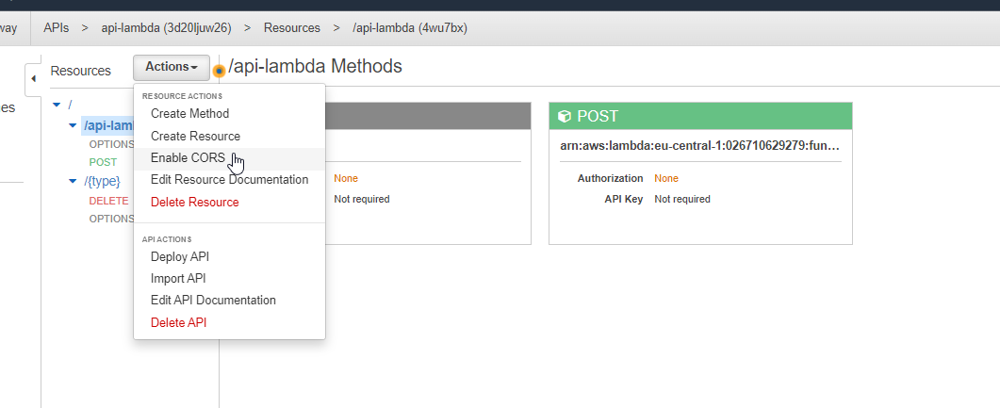
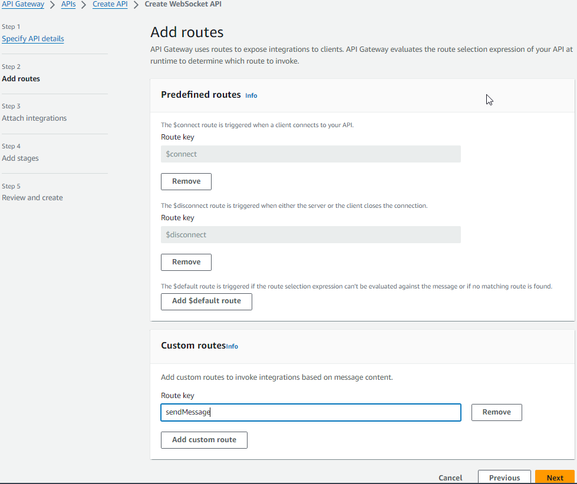
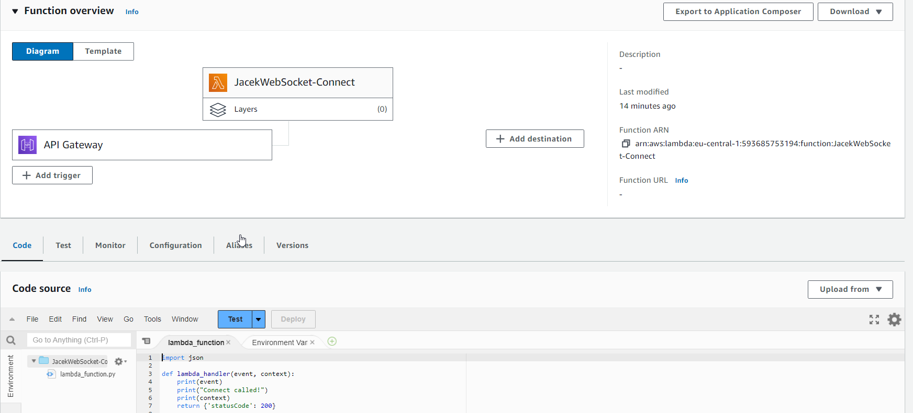

- [Create first mocked API](#create-first-mocked-api)
- [General API GW features](#general-api-gw-features)
- [Request-response cycle](#request-response-cycle)
- [API with Lambda](#api-with-lambda)
  - [Create API](#create-api)
  - [Create lambda](#create-lambda)
  - [Call the API and solve CORS problem](#call-the-api-and-solve-cors-problem)
  - [Change lambda to use request body](#change-lambda-to-use-request-body)
    - [Integration Request with enabled **Use Lambda Proxy integration**](#integration-request-with-enabled-use-lambda-proxy-integration)
    - [Integration Request with disabled **Use Lambda Proxy integration**](#integration-request-with-disabled-use-lambda-proxy-integration)
      - [Integration Response](#integration-response)
  - [Using models and validators](#using-models-and-validators)
  - [Using params in URL path](#using-params-in-url-path)
- [Designing WebSocket APIs](#designing-websocket-apis)
  - [Benefits and use cases of WebSocket APIs](#benefits-and-use-cases-of-websocket-apis)
  - [Pricing considerations for WebSocket APIs](#pricing-considerations-for-websocket-apis)
    - [Flat charge](#flat-charge)
    - [Connection minutes](#connection-minutes)
    - [Additional charges](#additional-charges)
  - [Developing a WebSocket API in API Gateway](#developing-a-websocket-api-in-api-gateway)
    - [Creating and configuring WebSocket APIs](#creating-and-configuring-websocket-apis)
      - [Specify API details](#specify-api-details)
      - [Add routes](#add-routes)
      - [Attach integrations](#attach-integrations)
      - [Add Stages](#add-stages)
      - [Broadcast](#broadcast)
    - [Calling WebSocket API](#calling-websocket-api)
  - [Maintaining connections to WebSocket APIs](#maintaining-connections-to-websocket-apis)
- [Designing REST APIs](#designing-rest-apis)
  - [API Gateway REST API endpoint types](#api-gateway-rest-api-endpoint-types)
  - [API Gateway optional cache](#api-gateway-optional-cache)
    - [Why you use API GW caching](#why-you-use-api-gw-caching)
    - [Configuring caching per API stage](#configuring-caching-per-api-stage)
  - [Managing the API Gateway cache](#managing-the-api-gateway-cache)
  - [Pricing considerations for REST APIs](#pricing-considerations-for-rest-apis)
- [Building and Deploying APIs with API Gateway](#building-and-deploying-apis-with-api-gateway)
  - [The base API invoke URL follows a pattern](#the-base-api-invoke-url-follows-a-pattern)
  - [Customize the hostname](#customize-the-hostname)
  - [Configure resource as proxy](#configure-resource-as-proxy)
  - [API Gateway integration types](#api-gateway-integration-types)


# Create first mocked API


In integration response use mapping section to define the response:


Next we have to deploy the API to a stage - **Resources** section contains only new configuration that is not visible in run time.


Next we can see deployed stage and call the API:


# General API GW features


* API Keys: used when API will be used by developers (or by other backend services - not users???). Then such key has to be sent in every requests.
* Usage Plans: you can enforce a throttling and quota limit on each API key.
* Client Certificates: to ensure HTTP requests to your back-end services are originating from API Gateway, you can use Client Certificates to verify the requester's authenticity.
* Authorizers: Authorizers enable you to control access to your APIs using Amazon Cognito User Pools or a Lambda function.
* Models: using json schema we can validate incoming requests and also use it to map requests and to map responses.

# Request-response cycle


# API with Lambda

## Create API


* **Configure as proxy resource**: causes that this resource will catch all possible sub-paths and verbs.

* **Enable CORS**: it will add necessary headers to OPTIONS response:


and in the view of integration response we can see values of these headers:


Next create a POST endpoint:


* **Use Lambda Proxy integration**: it will cause that full request with its metadata like headers, authentication data will be send to the lambda as unfiltered. It means that in the lambda function we have to extract what we need. In general it is not recommended approach because it breaks single responsibility pattern. Logic related with API rather should stay in the API GW.

## Create lambda

Next create a lambda function:


js
```
exports.handler = (event, context, callback) => {
    // callback is a method that is used to return info from the lambda function
    // first paramter is used to pass errors, here we do not have any errors so we pass null,
    // second param is the resposne
    callback(null, {message: 'I am lambda function'});
};
```

It is import to point which java-script function should be called when the lambda is called: `[file-name].[method-name]`


Sometimes we want increase default timeout for the lambda function:


Next we have to publish the lambda function:


Next we can assign lambda function to the API GW endpoint:


Next we can deploy the API to dev stage.

## Call the API and solve CORS problem

```js
var xhr = new XMLHttpRequest();
xhr.open('POST', 'https://3d20ljuw26.execute-api.eu-central-1.amazonaws.com/dev/api-lambda');
xhr.onreadystatechange = function(event) {
  console.log(event.target.response);
}
xhr.send();
```

Next go to https://jsfiddle.net/ to run this script. If we run that we will see that we get CORS error.

It does not work because created POST endpoint also has to return proper headers to enable CORS - it is not enough to do it on OPTIONS verb.

First add the header to **Method Response**:


and next set its value in the **Integration Response**:


Now we have to deploy the new version of the API and next we can check if it is working fine:


Calls can be also enable by selecting parent path - then all (only VERBS???) will also have enabled CORS.



## Change lambda to use request body


```js
exports.handler = (event, context, callback) => {
    // callback is a method that is used to return info from the lambda function
    // first paramter is used to pass errors, here we do not have any errors so we pass null,
    // second param is the resposne
    callback(null, event);
};
```

Go to test button and send some payload:


```json
{
    "name": "Jacek",
    "age": 28
}
```

We can see that response body returns the whole request body.


### Integration Request with enabled **Use Lambda Proxy integration**

Select option **Use Lambda Proxy integration** it will cause that the whole request will be passed to the lambda function. In such case we do not use any API GW built-in features and we have to take care to return proper CORS headers in the lambda function:

```js
exports.handler = (event, context, callback) => {
    // callback is a method that is used to return info from the lambda function
    // first paramter is used to pass errors, here we do not have any errors so we pass null,
    // second param is the resposne
    console.log('Event content: ' + JSON.stringify(event));
    callback(null, {headers: {'Access-Control-Allow-Origin': '*'}});
};
```

Next we can call the lambda:


>NOTE: if we would try run lambda version when it returns the whole request as a response then with enabled **Use Lambda Proxy integration** it would not work because request schema does not match to response schema.

In AWS Cloud Watch we can that the **event** parameter contains the whole request with all its field:


Usually this approach is not recommended because then lambda has to do some extra logic that normally is responsibility of API GW.

### Integration Request with disabled **Use Lambda Proxy integration**

Uncheck option **Use Lambda Proxy integration**:


Use payload like this:
```json
{
    "personData": {
        "name": "Jacek",
        "age": 26
    }
}
```

and next use this lambda code:

```js
exports.handler = (event, context, callback) => {
    // callback is a method that is used to return info from the lambda function
    // first paramter is used to pass errors, here we do not have any errors so we pass null,
    // second param is the resposne
    console.log('Event content: ' + JSON.stringify(event));
    const newAge = event.personData.age;
    callback(null, newAge * 2);
};
```

It is working fine but there is way to create a data contract tailor made for this lambda using mappings.


Use body mapping in **Integration Request** to format the body. Select **When there are no templates defined (recommended)** and set `content-type` to `application-json`. It will cause that all requests with such content type will be mapped according to the template. Requests with other content types will be simply forwarded to the lambda without any modification.

>NOTE: if the template is empty then for `application-json` still forwarding without modification will be used but if we add an empty object in the template then this object will be passed to the lambda.

Select template **Method Request passthrough** to get some sample code:


but we can reduce it to version we need in this example:

```json
{
"age" : $input.json('$.personData.age')
}
```

Next we can update the lambda code to this:

```js
exports.handler = (event, context, callback) => {
    // callback is a method that is used to return info from the lambda function
    // first paramter is used to pass errors, here we do not have any errors so we pass null,
    // second param is the resposne
    console.log('Event content: ' + JSON.stringify(event));
    const newAge = event.age;
    callback(null, newAge * 2);
};
```

and see that it is working fine:


#### Integration Response

```
{
    "your-age": $input.json('$')
}
```


Next we can test that mapping is working fine:


## Using models and validators

```json
{
  "$schema": "http://json-schema.org/draft-04/schema#",
  "title": "CompareData",
  "type": "object",
  "properties": {
    "age": {"type": "integer"},
    "height": {"type": "integer"},
    "income": {"type": "integer"}
  },
  "required": ["age", "height", "income"]
}
```


Next we can use this model as a validation rule in **Method Request**:


If we pass a payload that does not satisfy the schema then we get an error:


## Using params in URL path


Create a new lambda function:

```js
exports.handler = (event, context, callback) => {
    const type = event.type
    console.log('Event content: ' + JSON.stringify(event));
    if (type == 'all') {
        callback(null, 'Deleted all data');
    } else if (type == 'single') {
        callback(null, 'Deleted only my data');
    } else {
        callback(null, 'Nothing deleted');
    }
};
```

Bind this lambda function with API in API GW:


Define mapping in **Integration Request**:

```
{
    "type": "$input.params('type')"
}
```


and next we can test it:


Deploy the API because next we will try call it from the web:

```js
var xhr = new XMLHttpRequest();
xhr.open('DELETE', 'https://3d20ljuw26.execute-api.eu-central-1.amazonaws.com/dev/api-lambda/all');
xhr.onreadystatechange = function (event) {
  console.log(event.target.response);
}
xhr.setRequestHeader('Content-Type', 'application/json');
xhr.send();
```

>NOTE: from some reason I was getting CORS error for this endpoint but did not have time to solve it.

# Designing WebSocket APIs

In a WebSocket API, the client and server can send messages to each other at any time. With a WebSocket connection, your backend servers can push data to connected users and devices, avoiding the need to implement complex polling mechanisms.

For example, you could build a serverless application using an API Gateway WebSocket API and Lambda function to send and receive messages to and from users in a chat room.


In API Gateway, you can create a WebSocket API as a stateful frontend for an AWS service, such as Lambda or Amazon DynamoDB, or for an HTTP endpoint. The WebSocket API will then invoke your correct backend service based on the content of the messages it receives from client applications.


## Benefits and use cases of WebSocket APIs

API Gateway WebSocket APIs are designed for bidirectional communication between your client and backend architecture. You can do this by using any WebSockets client such as a mobile app, chat app, AWS IOT device, or application dashboard.   

When you connect the client to API Gateway, API Gateway will manage the persistence and state needed to connect it to your clients. Unlike a REST API, which receives and responds to requests, a WebSocket API supports two-way communication between your client applications and your backend.   

WebSocket APIs are often used in real-time application use cases such as:

* Chat applications
* Streaming dashboards
* Real-time alerts and notifications
* Collaboration platforms
* Multiplayer games
* Financial trading platforms

By using WebSockets with API Gateway, your clients can send messages to a service and the services can independently send messages back to the clients. This bidirectional behavior creates more valuable interactions between your clients and services because the services can push data to clients without requiring clients to make an explicit request. 

## Pricing considerations for WebSocket APIs

With API Gateway WebSocket APIs, you only pay when your APIs are in use. When considering the pricing model for WebSocket APIs, there are three different aspects to consider. To learn about a category, choose the appropriate tab.

### Flat charge

WebSocket APIs for API Gateway charge for the messages you send and receive. You can send and receive **messages up to 128 KB in size**. Messages are **metered in 32-KB increments, so a 33-KB message is charged as two messages**.   
For WebSocket APIs, the API Gateway free tier currently includes one million messages (sent or received) and 750,000 connection minutes for up to 12 months.

### Connection minutes

In addition to paying for the messages you send and receive, you are also charged for the **total number of connection minutes**.

### Additional charges

You may also incur additional charges if you use API Gateway in **conjunction with other AWS services or transfer data out of AWS**.

## Developing a WebSocket API in API Gateway

As you're developing your WebSocket API in API Gateway, there are a number of characteristics you need to choose for your API. These characteristics depend on your API's use case.   

For example, you might want to only allow certain clients to call your API, or you might want it to be available to everyone. In addition, you might want an API call to invoke a Lambda function, make a database query, or call an application. All of these options will change the characteristics of the API as you design and deploy it.

### Creating and configuring WebSocket APIs

To create a functional API, you must have at least one route, integration, and stage before deploying the API.

#### Specify API details

The **route selection expression** is an attribute defined at the API level. It specifies a JSON property that is expected to be present in the message payload.

#### Add routes

There are three predefined routes that can be used with WebSocket APIs: $connect, $disconnect, and $default. In addition to the predefined routes, you can also create custom routes.   

**Value of the `Route key` must match to value stored in field `action` from the JSON payload sent to the API GW.**

#### Attach integrations


Selected routes are integrated with the following lambda functions:

* $connect
  
  ```py
  import json

  def lambda_handler(event, context):
    print(event)
    print("Connect called!")
    print(context)
    return {'statusCode': 200}
  ```
  
* $disconnect
  ```py
  import json

  def lambda_handler(event, context):
    print(event)
    print("Disconnect called!")
    print(context)
    return {'statusCode': 200}
  ```
  
* custom route
  ```py
  import json
  import urllib3
  import boto3

  client = boto3.client('apigatewaymanagementapi', endpoint_url="TBD/production")

  def lambda_handler(event, context):
      print(event)
      
      # extract connectionId from the incoming event
      connectionId = event["requestContext"]["connectionId"]
      
      # do something... (it is not used)
      responseMessage = "responding..."
      
      # form response and post back to connectionId
      response = client.post_to_connection(ConnectionId=connectionId, Data=json.dumps("responding").encode('utf-8'))
      return { 'statusCode': 200 }
  ```
  In the role which is used by this lambda function add to permissions `AmazonAPIGatewayInvokeFullAccess`.
  

#### Add Stages


#### Broadcast

It is possible to send a message to all active clients. For example `connectionId` values could be stored in DB. Next the values could be read from this DB. Here we will use test window to simulate it. Make sure that role of this function also has policy `AmazonAPIGatewayInvokeFullAccess`.

```py
import json
import urllib3
import boto3

client = boto3.client('apigatewaymanagementapi', endpoint_url="TBD/production")

def lambda_handler(event, context):
    print(event)
    
    # extract connectionId and desired message to send from input
    connectionId = event["connectionId"]
    message = event["message"]  
    
    # form response and post back to connectionId
    response = client.post_to_connection(ConnectionId=connectionId, Data=json.dumps("responding to all active clients").encode('utf-8'))

    # no need to return 200 because this function would not be called from API GW
```

### Calling WebSocket API

* **Check URLs**
  
  wss://oxwt27c61i.execute-api.eu-central-1.amazonaws.com/production   
  https://oxwt27c61i.execute-api.eu-central-1.amazonaws.com/production/@connections

* **Connect with WebSocket API**   
  This can be done using for example this page: https://piehost.com/websocket-tester
  
  

  Next we can check logs from the executed lambda, **see value of `'connectionId': 'V_0lYc-6FiACHyw='`**:
  

* **Call `SendMessage` WebSocket API**.

  To do this make sure that the lambda function uses correct address of API GW https://oxwt27c61i.execute-api.eu-central-1.amazonaws.com/production. Update the following line in the lambda function:

  ```py
  client = boto3.client('apigatewaymanagementapi', endpoint_url="https://oxwt27c61i.execute-api.eu-central-1.amazonaws.com/production")
  ```

  Call `SendMessage` WebSocket API we have to use the following payload.
  ```json
  {
    "action": "sendMessage",
    "message": "hello, is anyone there?"
  }
  ```
  It is required the value of `action` field matches value defined in `Route key` from `Custom routes`.

  
  We can see that proper lambda function has been called and this lambda function called back the client (message `"responding"`).

  * **Broadcast**   
  We can simulate existence of some background process which sends a message to all active clients. This can be done using broadcast lambda function.

  Update the following line in the lambda function:

  ```py
  client = boto3.client('apigatewaymanagementapi', endpoint_url="https://oxwt27c61i.execute-api.eu-central-1.amazonaws.com/production")
  ```
  Open test window for the `connectionId` **use value `V_0lYc-6FiACHyw=` the was generate for the client that is used in this example**.   

  ```json
  {
    "connectionId": "V_0lYc-6FiACHyw=",
    "message": "Anyone out there?"
  }
  ```
  

  After clicking `Invoke` we can see that the client received the message (`"responding to all active clients"`).
  

## Maintaining connections to WebSocket APIs

* **Connect**: The client apps connect to your WebSocket API by sending a WebSocket upgrade request. If the request succeeds, the $connect route is invoked while the connection is being established. Until the invocation of the integration you associated with the $connect route is completed, the upgrade request is pending and the actual connection will not be established. If the $connect request fails, the connection will not be made.
* **Established connection**: After the connection is established, your client's JSON messages can be routed to invoke a specific backend service based on message content. When a client sends a message over its WebSocket connection, this results in a route request to the WebSocket API. The request will be matched to the route with the corresponding route key in API Gateway. 
* **Disconnect**: The $disconnect route is invoked after the connection is closed. **The connection can be closed by the server or by the client**. Since the connection is already closed when it is invoked, the $disconnect route is a best-effort event. API Gateway will try its best to deliver the $disconnect event to your integration, but it cannot guarantee delivery. The backend can initiate disconnection by using the @connections API. 

# Designing REST APIs

## API Gateway REST API endpoint types

* **Regional endpoint**
  The regional endpoint is designed to reduce latency when calls are made from the same AWS Region as the API. **In this model, API Gateway does not deploy its own CloudFront distribution in front of your API**. Instead, traffic destined for your API will be directed straight at the API endpoint in the Region where you’ve deployed it.   

  This endpoint type gives you lower latency for applications that are invoking your API from within the same Region (for example, an API that is going to be accessed from EC2 instances within the same Region).   

  **The regional endpoint provides you with the flexibility to deploy your own CloudFront distribution or content delivery network (CDN) in front of API Gateway** and control that distribution using your own settings for customized scenarios. An example of this might be to design for disaster recovery scenarios or implement load balancing in a very customized way.

  

* **Edge-optimized endpoint**

  The edge-optimized endpoint is designed to help you reduce client latency from anywhere on the internet. **If you choose an edge-optimized endpoint, API Gateway will automatically configure a fully managed CloudFront distribution to provide lower latency access to your API.**

  This endpoint-type setup reduces your first hit latency for your API. An additional benefit of using a managed CloudFront distribution is that you don’t have to pay for or manage a CDN separately from API Gateway.

  

* **Private endpoint**

  The private endpoint is designed to **expose APIs only inside your selected Amazon Virtual Private Cloud (Amazon VPC)**. This endpoint type is still managed by API Gateway, but requests are only routable and can only originate from within a single virtual private cloud (VPC) that you control.

  This endpoint type is designed for applications that have very secure workloads, such as healthcare or financial data that cannot be exposed publicly on the internet. There are no data transfer-out charges for private APIs. However, AWS PrivateLink charges apply when using private APIs in API Gateway.

     

Although it is important to consider your current and future needs when creating your REST API endpoint in API Gateway, it is possible to change the endpoint type. Changing your API endpoint type requires you to update the API's configuration. You can change an existing API type using the API Gateway console, the AWS CLI, or an AWS SDK for API Gateway.

The following endpoint type changes are supported:

* From edge-optimized to regional or private
* From regional to edge-optimized or private
* From private to regional

**You cannot change a private API endpoint into an edge-optimized API endpoint.**

## API Gateway optional cache

You can turn on API caching in API Gateway to cache your endpoint's responses. With caching, you can reduce the number of calls made to your endpoint and also improve the latency of requests to your API.   

This is an optional configuration **only available for REST APIs**, but definitely an option that you want to consider based on your use cases. To learn about API Gateway caching, expand each of the following three categories.

### Why you use API GW caching

When caching is turned on, API Gateway caches responses from your endpoint for a specified Time-to-Live (TTL) period. API Gateway then responds to a request by looking up the endpoint response from the cache instead of making a request to your endpoint. There are two big benefits of using the cache:

* It reduces overall latency for serving requests.
* It minimizes the number of requests that need to be made to your backend.

This becomes even more valuable as you scale and want to reduce the amount of calls to your backend resources.


### Configuring caching per API stage

Configuration choices for stage caching include the following.

* **Provision between 0.5 GB and 237 GB of cache**   
  When you turn on caching, you can configure the size of the cache anywhere from half a gig to 237 gigabytes, and you can also configure and customize the maximum TTL for each cache entry. 

* **Set TTL in seconds**   
  The default TTL value for API caching is 300 seconds. The maximum TTL value is 3,600 seconds. When you set TTL=0, caching is turned off within API Gateway.

* **Turn on encryption of cache data**
  You can also encrypt the cached data if you need to. 

* **Only GET methods will be cached**
  When you turn on caching in a stage's cache settings, only GET methods are cached. We recommend that you don’t cache other types of calls unless you have very specific reasons.

* **Configure per method**
  You can override stage-level settings for individual methods. Turn caching on or off for specific methods, increase or decrease the TTL, or turn encryption on or off for cached responses.   

  You can also use parameters in the method to form cache keys so that API Gateway caches the method's responses depending on the parameter values used.

## Managing the API Gateway cache

**Caching is charged at an hourly rate**   
Keep in mind that data caching is charged at an hourly rate that is dependent on the cache size you select, regardless of the number of API calls being cached. So be thoughtful in choosing the cache size, and consider the amount of data you intend to cache. **Two ways to verify caching**:

1. CloudWatch Metrics: **CacheHitCount** and **CacheMissCount**.
2. Create a timestamp and include it in your API response.

## Pricing considerations for REST APIs

With API Gateway, you only pay when your APIs are in use. When considering the pricing model for REST APIs, there are two different aspects to consider.

* **Flat charge**: REST APIs for API Gateway have a flat charge per million API Gateway requests. With API Gateway, you only pay when your APIs are in use at a set cost per million requests. The API Gateway free tier includes one million API calls per month for up to 12 months.

* **Data transfer out**: An additional cost to factor into your cost estimates is the data transfer out of AWS that will be charged at standard AWS prices. You may incur additional charges if you use API Gateway in conjunction with other AWS services or transfer data out of AWS.   

Private API endpoints don’t have data transfer-out charges. Instead, PrivateLink charges apply.

* **Optional cache**: As mentioned earlier in this lesson, you can optionally provision a dedicated cache for each stage of your APIs. After you specify the size of the cache you require, you will be charged an hourly rate for each stage's cache.

# Building and Deploying APIs with API Gateway

## The base API invoke URL follows a pattern


## Customize the hostname

You can make the URL more meaningful to your users by using a custom domain name as the host and choosing a base path to map the alternative URL to your API. In most cases, you’ll want to use custom domains because they are more user friendly than the invoke URL. In addition, API Gateway is integrated with AWS Certificate Manager (ACM) and lets you import your own certificate or generate a Secure Sockets Layer (SSL) certificate with ACM. 

## Configure resource as proxy

When adding a resource, you have the option to create a proxy resource as well. If you choose this option, it will automatically create a special HTTP method called ANY.

A proxy resource is expressed by a special resource path parameter of **{proxy+}**, often referred to as a greedy path parameter. The plus sign (+) indicates child resources appended to it.   

In addition to the HTTP proxy, there is also a Lambda proxy option. With the Lambda proxy integration, the client can call a single Lambda function in the backend. The function accesses many resources or features of other AWS services, including calling other Lambda functions.

To use the proxy option, you first configure the resource as a proxy resource and then set up an integration type of either HTTP or Lambda proxy when creating the method.  


## API Gateway integration types

* **Lambda function**: When you are using API Gateway as the gateway to a Lambda function, you’ll use the Lambda integration. This will result in requests being proxied to Lambda with request details available to your function handler in the event parameter, supporting a streamlined integration setup. The setup can evolve with the backend without requiring you to tear down the existing setup.   
  
  For integrations with Lambda functions, you will need to set an IAM role with required permissions for API Gateway to call the backend on your behalf.
* **HTTP endpoint**: HTTP integration endpoints are useful for public web applications where you want clients to interact with the endpoint. This type of integration lets an API expose HTTP endpoints in the backend.   
  
  When the **proxy is not configured**, you’ll need to configure both the integration request and the integration response, and set up necessary data mappings between the method request-response and the integration request-response.   

  If the If the proxy option is used, you don’t set the integration request or the integration response. API Gateway passes the incoming request from the client to the HTTP endpoint and passes the outgoing response from the HTTP endpoint to the client., you don’t set the integration request or the integration response. API Gateway passes the incoming request from the client to the HTTP endpoint and passes the outgoing response from the HTTP endpoint to the client.
* **AWS service**: AWS Service is an integration type that lets an API expose AWS service actions. For example, you might drop a message directly into an Amazon Simple Queue Service (Amazon SQS) queue.
* **Mock**: Mock lets API Gateway return a response without sending the request further to the backend. This is a good idea for a health check endpoint to test your API. Anytime you want a hardcoded response to your API call, use a Mock integration.
* **VPC link**: **With VPC Link, you can connect to a Network Load Balancer to get something in your private VPC**. For example, consider an endpoint on your EC2 instance that’s not public. API Gateway can’t access it unless you use the VPC link and you have to have a **Network Load Balancer** on your backend. For an API developer, a VPC Link is functionally equivalent to an integration endpoint.