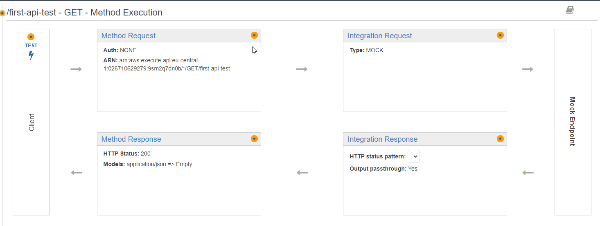

- [Create first mocked API](#create-first-mocked-api)
- [General API GW features](#general-api-gw-features)
- [Request-response cycle](#request-response-cycle)
- [API with Lambda](#api-with-lambda)
  - [Create API](#create-api)
  - [Create lambda](#create-lambda)
  - [Call the API and solve CORS problem](#call-the-api-and-solve-cors-problem)


# Create first mocked API




In integration response use mapping section to define the response:


Next we have to deploy the API to a stage - **Resources** section contains only new configuration that is not visible in run time.


Next we can see deployed stage and call the API:


# General API GW features


* API Keys: used when API will be used by developers (or by other backend services - not users???). Then such key has to be sent in every requests.
* Usage Plans: you can enforce a throttling and quota limit on each API key.
* Client Certificates: to ensure HTTP requests to your back-end services are originating from API Gateway, you can use Client Certificates to verify the requester's authenticity.
* Authorizers: Authorizers enable you to control access to your APIs using Amazon Cognito User Pools or a Lambda function.
* Models: using json schema we can validate incoming requests and also use it to map requests and to map responses.

# Request-response cycle


# API with Lambda

## Create API


* **Configure as proxy resource**: causes that this resource will catch all possible sub-paths and verbs.

* **Enable CORS**: it will add necessary headers to OPTIONS response:


and in the view of integration response we can see values of these headers:


Next create a POST endpoint:


* **Use Lambda Proxy integration**: it will cause that full request with its metadata like headers, authentication data will be send to the lambda as unfiltered. It means that in the lambda function we have to extract what we need. In general it is not recommended approach because it breaks single responsibility pattern. Logic related with API rather should stay in the API GW.

## Create lambda

Next create a lambda function:


It is import to point which java-script function should be called when the lambda is called: `[file-name].[method-name]`


Sometimes we want increase default timeout for the lambda function:


Next we have to publish the lambda function:


Next we can assign lambda function to the API GW endpoint:


Next we can deploy the API to dev stage.

## Call the API and solve CORS problem

js
```
var xhr = new XMLHttpRequest();
xhr.open('POST', 'https://3d20ljuw26.execute-api.eu-central-1.amazonaws.com/dev/api-lambda');
xhr.onreadystatechange = function(event) {
  console.log(event.target.response);
}
xhr.send();
```

Next go to https://jsfiddle.net/ to run this script. If we run that we will see that we get CORS error.

It does not work because created POST endpoint also has to return proper headers to enable CORS - it is not enough to do it on OPTIONS verb.

First add the header to **Method Response**:


and next set its value in the **Integration Response**:


Now we have to deploy the new version of the API and next we can check if it is working fine:


