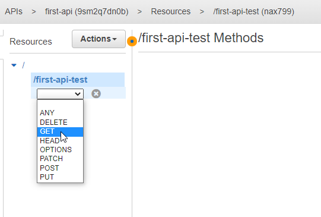

- [Create first mocked API](#create-first-mocked-api)
- [General API GW features](#general-api-gw-features)
- [Request-response cycle](#request-response-cycle)
- [API with Lambda](#api-with-lambda)
  - [Create API](#create-api)
  - [Create lambda](#create-lambda)
  - [Call the API and solve CORS problem](#call-the-api-and-solve-cors-problem)
  - [Change lambda to use request body](#change-lambda-to-use-request-body)
    - [Integration Request with enabled **Use Lambda Proxy integration**](#integration-request-with-enabled-use-lambda-proxy-integration)
    - [Integration Request with disabled **Use Lambda Proxy integration**](#integration-request-with-disabled-use-lambda-proxy-integration)
      - [Integration Response](#integration-response)
  - [Using models and validators](#using-models-and-validators)
  - [Using params in URL path](#using-params-in-url-path)


# Create first mocked API





In integration response use mapping section to define the response:


Next we have to deploy the API to a stage - **Resources** section contains only new configuration that is not visible in run time.


Next we can see deployed stage and call the API:


# General API GW features


* API Keys: used when API will be used by developers (or by other backend services - not users???). Then such key has to be sent in every requests.
* Usage Plans: you can enforce a throttling and quota limit on each API key.
* Client Certificates: to ensure HTTP requests to your back-end services are originating from API Gateway, you can use Client Certificates to verify the requester's authenticity.
* Authorizers: Authorizers enable you to control access to your APIs using Amazon Cognito User Pools or a Lambda function.
* Models: using json schema we can validate incoming requests and also use it to map requests and to map responses.

# Request-response cycle


# API with Lambda

## Create API


* **Configure as proxy resource**: causes that this resource will catch all possible sub-paths and verbs.

* **Enable CORS**: it will add necessary headers to OPTIONS response:


and in the view of integration response we can see values of these headers:


Next create a POST endpoint:


* **Use Lambda Proxy integration**: it will cause that full request with its metadata like headers, authentication data will be send to the lambda as unfiltered. It means that in the lambda function we have to extract what we need. In general it is not recommended approach because it breaks single responsibility pattern. Logic related with API rather should stay in the API GW.

## Create lambda

Next create a lambda function:


js
```
exports.handler = (event, context, callback) => {
    // callback is a method that is used to return info from the lambda function
    // first paramter is used to pass errors, here we do not have any errors so we pass null,
    // second param is the resposne
    callback(null, {message: 'I am lambda function'});
};
```

It is import to point which java-script function should be called when the lambda is called: `[file-name].[method-name]`


Sometimes we want increase default timeout for the lambda function:


Next we have to publish the lambda function:


Next we can assign lambda function to the API GW endpoint:


Next we can deploy the API to dev stage.

## Call the API and solve CORS problem

```js
var xhr = new XMLHttpRequest();
xhr.open('POST', 'https://3d20ljuw26.execute-api.eu-central-1.amazonaws.com/dev/api-lambda');
xhr.onreadystatechange = function(event) {
  console.log(event.target.response);
}
xhr.send();
```

Next go to https://jsfiddle.net/ to run this script. If we run that we will see that we get CORS error.

It does not work because created POST endpoint also has to return proper headers to enable CORS - it is not enough to do it on OPTIONS verb.

First add the header to **Method Response**:


and next set its value in the **Integration Response**:


Now we have to deploy the new version of the API and next we can check if it is working fine:


Calls can be also enable by selecting parent path - then all (only VERBS???) will also have enabled CORS.


## Change lambda to use request body


```js
exports.handler = (event, context, callback) => {
    // callback is a method that is used to return info from the lambda function
    // first paramter is used to pass errors, here we do not have any errors so we pass null,
    // second param is the resposne
    callback(null, event);
};
```

Go to test button and send some payload:


```json
{
    "name": "Jacek",
    "age": 28
}
```

We can see that response body returns the whole request body.


### Integration Request with enabled **Use Lambda Proxy integration**

Select option **Use Lambda Proxy integration** it will cause that the whole request will be passed to the lambda function. In such case we do not use any API GW built-in features and we have to take care to return proper CORS headers in the lambda function:

```js
exports.handler = (event, context, callback) => {
    // callback is a method that is used to return info from the lambda function
    // first paramter is used to pass errors, here we do not have any errors so we pass null,
    // second param is the resposne
    console.log('Event content: ' + JSON.stringify(event));
    callback(null, {headers: {'Access-Control-Allow-Origin': '*'}});
};
```

Next we can call the lambda:


>NOTE: if we would try run lambda version when it returns the whole request as a response then with enabled **Use Lambda Proxy integration** it would not work because request schema does not match to response schema.

In AWS Cloud Watch we can that the **event** parameter contains the whole request with all its field:


Usually this approach is not recommended because then lambda has to do some extra logic that normally is responsibility of API GW.

### Integration Request with disabled **Use Lambda Proxy integration**

Uncheck option **Use Lambda Proxy integration**:


Use payload like this:
```json
{
    "personData": {
        "name": "Jacek",
        "age": 26
    }
}
```

and next use this lambda code:

```js
exports.handler = (event, context, callback) => {
    // callback is a method that is used to return info from the lambda function
    // first paramter is used to pass errors, here we do not have any errors so we pass null,
    // second param is the resposne
    console.log('Event content: ' + JSON.stringify(event));
    const newAge = event.personData.age;
    callback(null, newAge * 2);
};
```

It is working fine but there is way to create a data contract tailor made for this lambda using mappings.


Use body mapping in **Integration Request** to format the body. Select **When there are no templates defined (recommended)** and set `content-type` to `application-json`. It will cause that all requests with such content type will be mapped according to the template. Requests with other content types will be simply forwarded to the lambda without any modification.

>NOTE: if the template is empty then for `application-json` still forwarding without modification will be used but if we add an empty object in the template then this object will be passed to the lambda.

Select template **Method Request passthrough** to get some sample code:


but we can reduce it to version we need in this example:

```json
{
"age" : $input.json('$.personData.age')
}
```

Next we can update the lambda code to this:

```js
exports.handler = (event, context, callback) => {
    // callback is a method that is used to return info from the lambda function
    // first paramter is used to pass errors, here we do not have any errors so we pass null,
    // second param is the resposne
    console.log('Event content: ' + JSON.stringify(event));
    const newAge = event.age;
    callback(null, newAge * 2);
};
```

and see that it is working fine:


#### Integration Response

```
{
    "your-age": $input.json('$')
}
```


Next we can test that mapping is working fine:


## Using models and validators

```json
{
  "$schema": "http://json-schema.org/draft-04/schema#",
  "title": "CompareData",
  "type": "object",
  "properties": {
    "age": {"type": "integer"},
    "height": {"type": "integer"},
    "income": {"type": "integer"}
  },
  "required": ["age", "height", "income"]
}
```


Next we can use this model as a validation rule in **Method Request**:


If we pass a payload that does not satisfy the schema then we get an error:


## Using params in URL path


Create a new lambda function:

```js
exports.handler = (event, context, callback) => {
    const type = event.type
    console.log('Event content: ' + JSON.stringify(event));
    if (type == 'all') {
        callback(null, 'Deleted all data');
    } else if (type == 'single') {
        callback(null, 'Deleted only my data');
    } else {
        callback(null, 'Nothing deleted');
    }
};
```

Bind this lambda function with API in API GW:


Define mapping in **Integration Request**:

```
{
    "type": "$input.params('type')"
}
```


and next we can test it:


Deploy the API because next we will try call it from the web:

```js
var xhr = new XMLHttpRequest();
xhr.open('DELETE', 'https://3d20ljuw26.execute-api.eu-central-1.amazonaws.com/dev/api-lambda/all');
xhr.onreadystatechange = function (event) {
  console.log(event.target.response);
}
xhr.setRequestHeader('Content-Type', 'application/json');
xhr.send();
```

>NOTE: from some reason I was getting CORS error for this endpoint but did not have time to solve it.