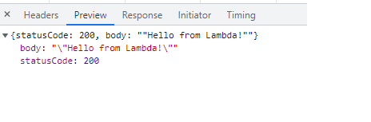
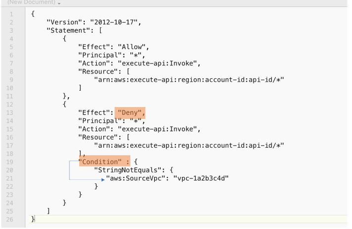
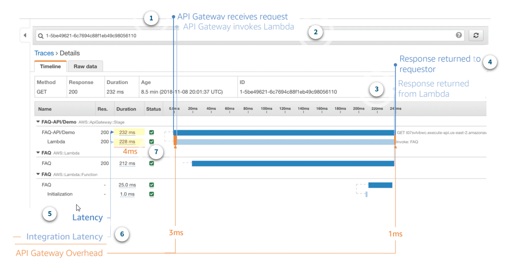

- [Create first mocked API](#create-first-mocked-api)
- [General API GW features](#general-api-gw-features)
- [Request-response cycle](#request-response-cycle)
- [API with Lambda](#api-with-lambda)
  - [Create API](#create-api)
  - [Create lambda](#create-lambda)
  - [Call the API and solve CORS problem](#call-the-api-and-solve-cors-problem)
  - [Change lambda to use request body](#change-lambda-to-use-request-body)
    - [Integration Request with enabled **Use Lambda Proxy integration**](#integration-request-with-enabled-use-lambda-proxy-integration)
    - [Integration Request with disabled **Use Lambda Proxy integration**](#integration-request-with-disabled-use-lambda-proxy-integration)
      - [Integration Response](#integration-response)
  - [Using models and validators](#using-models-and-validators)
  - [Using params in URL path](#using-params-in-url-path)
- [Designing WebSocket APIs](#designing-websocket-apis)
  - [Benefits and use cases of WebSocket APIs](#benefits-and-use-cases-of-websocket-apis)
  - [Pricing considerations for WebSocket APIs](#pricing-considerations-for-websocket-apis)
    - [Flat charge](#flat-charge)
    - [Connection minutes](#connection-minutes)
    - [Additional charges](#additional-charges)
  - [Developing a WebSocket API in API Gateway](#developing-a-websocket-api-in-api-gateway)
    - [Creating and configuring WebSocket APIs](#creating-and-configuring-websocket-apis)
      - [Specify API details](#specify-api-details)
      - [Add routes](#add-routes)
      - [Attach integrations](#attach-integrations)
      - [Add Stages](#add-stages)
      - [Broadcast](#broadcast)
    - [Calling WebSocket API](#calling-websocket-api)
  - [Maintaining connections to WebSocket APIs](#maintaining-connections-to-websocket-apis)
- [Designing REST APIs](#designing-rest-apis)
  - [API Gateway REST API endpoint types](#api-gateway-rest-api-endpoint-types)
  - [API Gateway optional cache](#api-gateway-optional-cache)
    - [Why you use API GW caching](#why-you-use-api-gw-caching)
    - [Configuring caching per API stage](#configuring-caching-per-api-stage)
  - [Managing the API Gateway cache](#managing-the-api-gateway-cache)
  - [Pricing considerations for REST APIs](#pricing-considerations-for-rest-apis)
- [Building and Deploying APIs with API Gateway](#building-and-deploying-apis-with-api-gateway)
  - [The base API invoke URL follows a pattern](#the-base-api-invoke-url-follows-a-pattern)
  - [Customize the hostname](#customize-the-hostname)
  - [Configure resource as proxy](#configure-resource-as-proxy)
  - [API Gateway integration types](#api-gateway-integration-types)
  - [Test your API methods](#test-your-api-methods)
  - [API stages](#api-stages)
    - [Stage options](#stage-options)
    - [Differentiate your APIs with stages](#differentiate-your-apis-with-stages)
    - [Simplify version management with stage variables](#simplify-version-management-with-stage-variables)
    - [Stage variable example](#stage-variable-example)
    - [Building and deploying best practices](#building-and-deploying-best-practices)
      - [Use API Gateway stages with Lambda aliases](#use-api-gateway-stages-with-lambda-aliases)
      - [Use Canary deployments](#use-canary-deployments)
      - [Use AWS SAM to simplify deployments](#use-aws-sam-to-simplify-deployments)
- [Managing API Access](#managing-api-access)
  - [Authorizing with IAM](#authorizing-with-iam)
  - [Lambda Authorizers](#lambda-authorizers)
      - [Lambda Authorizer token types](#lambda-authorizer-token-types)
      - [Lambda Authorizer request types](#lambda-authorizer-request-types)
    - [Cognito Authorizers](#cognito-authorizers)
- [Throttling and usage plans](#throttling-and-usage-plans)
  - [API keys](#api-keys)
  - [Usage plans](#usage-plans)
    - [Example of usage plans based on types of consumers](#example-of-usage-plans-based-on-types-of-consumers)
    - [Token bucket algorithm](#token-bucket-algorithm)
    - [Throttling settings hierarchy](#throttling-settings-hierarchy)
- [IAM permissions](#iam-permissions)
  - [Invoke permissions](#invoke-permissions)
  - [Manage permissions](#manage-permissions)
  - [Resource policies](#resource-policies)
    - [Limiting access by user example](#limiting-access-by-user-example)
    - [Limiting by IP address example](#limiting-by-ip-address-example)
    - [Limiting by VPC example](#limiting-by-vpc-example)
    - [Resource policies and authentication methods](#resource-policies-and-authentication-methods)
- [Monitoring and Troubleshooting](#monitoring-and-troubleshooting)
  - [CloudWatch Metrics for API Gateway](#cloudwatch-metrics-for-api-gateway)
  - [Calculating API Gateway overhead](#calculating-api-gateway-overhead)
  - [CloudWatch Logs for API Gateway](#cloudwatch-logs-for-api-gateway)
    - [Execution logging](#execution-logging)
    - [Access logging](#access-logging)
  - [Monitoring with X-Ray and CloudTrail](#monitoring-with-x-ray-and-cloudtrail)
    - [AWS X-Ray](#aws-x-ray)
    - [AWS CloudTrail](#aws-cloudtrail)
    - [X-Ray trace examples](#x-ray-trace-examples)
      - [X-Ray Example 1](#x-ray-example-1)
      - [X-Ray Example 2](#x-ray-example-2)
    - [Troubleshooting Exercise – Access Logs and X-Ray](#troubleshooting-exercise--access-logs-and-x-ray)
      - [What might be the cause?](#what-might-be-the-cause)
- [Data Mapping and Request Validation](#data-mapping-and-request-validation)
  - [JSON to XML transformation example](#json-to-xml-transformation-example)
  - [Key variables for transformations](#key-variables-for-transformations)
  - [Handling errors with Gateway Responses](#handling-errors-with-gateway-responses)
  - [Offloading request validation to API Gateway](#offloading-request-validation-to-api-gateway)


# Create first mocked API


In integration response use mapping section to define the response:


Next we have to deploy the API to a stage - **Resources** section contains only new configuration that is not visible in run time.


Next we can see deployed stage and call the API:


# General API GW features


* API Keys: used when API will be used by developers (or by other backend services - not users???). Then such key has to be sent in every requests.
* Usage Plans: you can enforce a throttling and quota limit on each API key.
* Client Certificates: to ensure HTTP requests to your back-end services are originating from API Gateway, you can use Client Certificates to verify the requester's authenticity.
* Authorizers: Authorizers enable you to control access to your APIs using Amazon Cognito User Pools or a Lambda function.
* Models: using json schema we can validate incoming requests and also use it to map requests and to map responses.

# Request-response cycle


# API with Lambda

## Create API


* **Configure as proxy resource**: causes that this resource will catch all possible sub-paths and verbs.

* **Enable CORS**: it will add necessary headers to OPTIONS response:


and in the view of integration response we can see values of these headers:


Next create a POST endpoint:


* **Use Lambda Proxy integration**: it will cause that full request with its metadata like headers, authentication data will be send to the lambda as unfiltered. It means that in the lambda function we have to extract what we need. In general it is not recommended approach because it breaks single responsibility pattern. Logic related with API rather should stay in the API GW.

## Create lambda

Next create a lambda function:


js
```
exports.handler = (event, context, callback) => {
    // callback is a method that is used to return info from the lambda function
    // first paramter is used to pass errors, here we do not have any errors so we pass null,
    // second param is the resposne
    callback(null, {message: 'I am lambda function'});
};
```

It is import to point which java-script function should be called when the lambda is called: `[file-name].[method-name]`


Sometimes we want increase default timeout for the lambda function:


Next we have to publish the lambda function:


Next we can assign lambda function to the API GW endpoint:


Next we can deploy the API to dev stage.

## Call the API and solve CORS problem

```js
var xhr = new XMLHttpRequest();
xhr.open('POST', 'https://3d20ljuw26.execute-api.eu-central-1.amazonaws.com/dev/api-lambda');
xhr.onreadystatechange = function(event) {
  console.log(event.target.response);
}
xhr.send();
```

Next go to https://jsfiddle.net/ to run this script. If we run that we will see that we get CORS error.

It does not work because created POST endpoint also has to return proper headers to enable CORS - it is not enough to do it on OPTIONS verb.

First add the header to **Method Response**:


and next set its value in the **Integration Response**:


Now we have to deploy the new version of the API and next we can check if it is working fine:



Calls can be also enable by selecting parent path - then all (only VERBS???) will also have enabled CORS.


## Change lambda to use request body


```js
exports.handler = (event, context, callback) => {
    // callback is a method that is used to return info from the lambda function
    // first paramter is used to pass errors, here we do not have any errors so we pass null,
    // second param is the resposne
    callback(null, event);
};
```

Go to test button and send some payload:


```json
{
    "name": "Jacek",
    "age": 28
}
```

We can see that response body returns the whole request body.


### Integration Request with enabled **Use Lambda Proxy integration**

Select option **Use Lambda Proxy integration** it will cause that the whole request will be passed to the lambda function. In such case we do not use any API GW built-in features and we have to take care to return proper CORS headers in the lambda function:

```js
exports.handler = (event, context, callback) => {
    // callback is a method that is used to return info from the lambda function
    // first paramter is used to pass errors, here we do not have any errors so we pass null,
    // second param is the resposne
    console.log('Event content: ' + JSON.stringify(event));
    callback(null, {headers: {'Access-Control-Allow-Origin': '*'}});
};
```

Next we can call the lambda:


>NOTE: if we would try run lambda version when it returns the whole request as a response then with enabled **Use Lambda Proxy integration** it would not work because request schema does not match to response schema.

In AWS Cloud Watch we can that the **event** parameter contains the whole request with all its field:


Usually this approach is not recommended because then lambda has to do some extra logic that normally is responsibility of API GW.

### Integration Request with disabled **Use Lambda Proxy integration**

Uncheck option **Use Lambda Proxy integration**:


Use payload like this:
```json
{
    "personData": {
        "name": "Jacek",
        "age": 26
    }
}
```

and next use this lambda code:

```js
exports.handler = (event, context, callback) => {
    // callback is a method that is used to return info from the lambda function
    // first paramter is used to pass errors, here we do not have any errors so we pass null,
    // second param is the resposne
    console.log('Event content: ' + JSON.stringify(event));
    const newAge = event.personData.age;
    callback(null, newAge * 2);
};
```

It is working fine but there is way to create a data contract tailor made for this lambda using mappings.


Use body mapping in **Integration Request** to format the body. Select **When there are no templates defined (recommended)** and set `content-type` to `application-json`. It will cause that all requests with such content type will be mapped according to the template. Requests with other content types will be simply forwarded to the lambda without any modification.

>NOTE: if the template is empty then for `application-json` still forwarding without modification will be used but if we add an empty object in the template then this object will be passed to the lambda.

Select template **Method Request passthrough** to get some sample code:


but we can reduce it to version we need in this example:

```json
{
"age" : $input.json('$.personData.age')
}
```

Next we can update the lambda code to this:

```js
exports.handler = (event, context, callback) => {
    // callback is a method that is used to return info from the lambda function
    // first paramter is used to pass errors, here we do not have any errors so we pass null,
    // second param is the resposne
    console.log('Event content: ' + JSON.stringify(event));
    const newAge = event.age;
    callback(null, newAge * 2);
};
```

and see that it is working fine:


#### Integration Response

```
{
    "your-age": $input.json('$')
}
```


Next we can test that mapping is working fine:


## Using models and validators

```json
{
  "$schema": "http://json-schema.org/draft-04/schema#",
  "title": "CompareData",
  "type": "object",
  "properties": {
    "age": {"type": "integer"},
    "height": {"type": "integer"},
    "income": {"type": "integer"}
  },
  "required": ["age", "height", "income"]
}
```


Next we can use this model as a validation rule in **Method Request**:


If we pass a payload that does not satisfy the schema then we get an error:


## Using params in URL path


Create a new lambda function:

```js
exports.handler = (event, context, callback) => {
    const type = event.type
    console.log('Event content: ' + JSON.stringify(event));
    if (type == 'all') {
        callback(null, 'Deleted all data');
    } else if (type == 'single') {
        callback(null, 'Deleted only my data');
    } else {
        callback(null, 'Nothing deleted');
    }
};
```

Bind this lambda function with API in API GW:


Define mapping in **Integration Request**:

```
{
    "type": "$input.params('type')"
}
```


and next we can test it:


Deploy the API because next we will try call it from the web:

```js
var xhr = new XMLHttpRequest();
xhr.open('DELETE', 'https://3d20ljuw26.execute-api.eu-central-1.amazonaws.com/dev/api-lambda/all');
xhr.onreadystatechange = function (event) {
  console.log(event.target.response);
}
xhr.setRequestHeader('Content-Type', 'application/json');
xhr.send();
```

>NOTE: from some reason I was getting CORS error for this endpoint but did not have time to solve it.

# Designing WebSocket APIs

In a WebSocket API, the client and server can send messages to each other at any time. With a WebSocket connection, your backend servers can push data to connected users and devices, avoiding the need to implement complex polling mechanisms.

For example, you could build a serverless application using an API Gateway WebSocket API and Lambda function to send and receive messages to and from users in a chat room.


In API Gateway, you can create a WebSocket API as a stateful frontend for an AWS service, such as Lambda or Amazon DynamoDB, or for an HTTP endpoint. The WebSocket API will then invoke your correct backend service based on the content of the messages it receives from client applications.


## Benefits and use cases of WebSocket APIs

API Gateway WebSocket APIs are designed for bidirectional communication between your client and backend architecture. You can do this by using any WebSockets client such as a mobile app, chat app, AWS IOT device, or application dashboard.   

When you connect the client to API Gateway, API Gateway will manage the persistence and state needed to connect it to your clients. Unlike a REST API, which receives and responds to requests, a WebSocket API supports two-way communication between your client applications and your backend.   

WebSocket APIs are often used in real-time application use cases such as:

* Chat applications
* Streaming dashboards
* Real-time alerts and notifications
* Collaboration platforms
* Multiplayer games
* Financial trading platforms

By using WebSockets with API Gateway, your clients can send messages to a service and the services can independently send messages back to the clients. This bidirectional behavior creates more valuable interactions between your clients and services because the services can push data to clients without requiring clients to make an explicit request. 

## Pricing considerations for WebSocket APIs

With API Gateway WebSocket APIs, you only pay when your APIs are in use. When considering the pricing model for WebSocket APIs, there are three different aspects to consider. To learn about a category, choose the appropriate tab.

### Flat charge

WebSocket APIs for API Gateway charge for the messages you send and receive. You can send and receive **messages up to 128 KB in size**. Messages are **metered in 32-KB increments, so a 33-KB message is charged as two messages**.   
For WebSocket APIs, the API Gateway free tier currently includes one million messages (sent or received) and 750,000 connection minutes for up to 12 months.

### Connection minutes

In addition to paying for the messages you send and receive, you are also charged for the **total number of connection minutes**.

### Additional charges

You may also incur additional charges if you use API Gateway in **conjunction with other AWS services or transfer data out of AWS**.

## Developing a WebSocket API in API Gateway

As you're developing your WebSocket API in API Gateway, there are a number of characteristics you need to choose for your API. These characteristics depend on your API's use case.   

For example, you might want to only allow certain clients to call your API, or you might want it to be available to everyone. In addition, you might want an API call to invoke a Lambda function, make a database query, or call an application. All of these options will change the characteristics of the API as you design and deploy it.

### Creating and configuring WebSocket APIs

To create a functional API, you must have at least one route, integration, and stage before deploying the API.

#### Specify API details

The **route selection expression** is an attribute defined at the API level. It specifies a JSON property that is expected to be present in the message payload.

#### Add routes

There are three predefined routes that can be used with WebSocket APIs: $connect, $disconnect, and $default. In addition to the predefined routes, you can also create custom routes.   

**Value of the `Route key` must match to value stored in field `action` from the JSON payload sent to the API GW.**

#### Attach integrations


Selected routes are integrated with the following lambda functions:

* $connect
  
  ```py
  import json

  def lambda_handler(event, context):
    print(event)
    print("Connect called!")
    print(context)
    return {'statusCode': 200}
  ```
  
* $disconnect
  ```py
  import json

  def lambda_handler(event, context):
    print(event)
    print("Disconnect called!")
    print(context)
    return {'statusCode': 200}
  ```
  
* custom route
  ```py
  import json
  import urllib3
  import boto3

  client = boto3.client('apigatewaymanagementapi', endpoint_url="TBD/production")

  def lambda_handler(event, context):
      print(event)
      
      # extract connectionId from the incoming event
      connectionId = event["requestContext"]["connectionId"]
      
      # do something... (it is not used)
      responseMessage = "responding..."
      
      # form response and post back to connectionId
      response = client.post_to_connection(ConnectionId=connectionId, Data=json.dumps("responding").encode('utf-8'))
      return { 'statusCode': 200 }
  ```
  In the role which is used by this lambda function add to permissions `AmazonAPIGatewayInvokeFullAccess`.
  

#### Add Stages


#### Broadcast

It is possible to send a message to all active clients. For example `connectionId` values could be stored in DB. Next the values could be read from this DB. Here we will use test window to simulate it. Make sure that role of this function also has policy `AmazonAPIGatewayInvokeFullAccess`.

```py
import json
import urllib3
import boto3

client = boto3.client('apigatewaymanagementapi', endpoint_url="TBD/production")

def lambda_handler(event, context):
    print(event)
    
    # extract connectionId and desired message to send from input
    connectionId = event["connectionId"]
    message = event["message"]  
    
    # form response and post back to connectionId
    response = client.post_to_connection(ConnectionId=connectionId, Data=json.dumps("responding to all active clients").encode('utf-8'))

    # no need to return 200 because this function would not be called from API GW
```

### Calling WebSocket API

* **Check URLs**
  
  wss://oxwt27c61i.execute-api.eu-central-1.amazonaws.com/production   
  https://oxwt27c61i.execute-api.eu-central-1.amazonaws.com/production/@connections

* **Connect with WebSocket API**   
  This can be done using for example this page: https://piehost.com/websocket-tester
  
  

  Next we can check logs from the executed lambda, **see value of `'connectionId': 'V_0lYc-6FiACHyw='`**:
  

* **Call `SendMessage` WebSocket API**.

  To do this make sure that the lambda function uses correct address of API GW https://oxwt27c61i.execute-api.eu-central-1.amazonaws.com/production. Update the following line in the lambda function:

  ```py
  client = boto3.client('apigatewaymanagementapi', endpoint_url="https://oxwt27c61i.execute-api.eu-central-1.amazonaws.com/production")
  ```

  Call `SendMessage` WebSocket API we have to use the following payload.
  ```json
  {
    "action": "sendMessage",
    "message": "hello, is anyone there?"
  }
  ```
  It is required the value of `action` field matches value defined in `Route key` from `Custom routes`.

  
  We can see that proper lambda function has been called and this lambda function called back the client (message `"responding"`).

  * **Broadcast**   
  We can simulate existence of some background process which sends a message to all active clients. This can be done using broadcast lambda function.

  Update the following line in the lambda function:

  ```py
  client = boto3.client('apigatewaymanagementapi', endpoint_url="https://oxwt27c61i.execute-api.eu-central-1.amazonaws.com/production")
  ```
  Open test window for the `connectionId` **use value `V_0lYc-6FiACHyw=` the was generate for the client that is used in this example**.   

  ```json
  {
    "connectionId": "V_0lYc-6FiACHyw=",
    "message": "Anyone out there?"
  }
  ```
  

  After clicking `Invoke` we can see that the client received the message (`"responding to all active clients"`).
  

## Maintaining connections to WebSocket APIs

* **Connect**: The client apps connect to your WebSocket API by sending a WebSocket upgrade request. If the request succeeds, the $connect route is invoked while the connection is being established. Until the invocation of the integration you associated with the $connect route is completed, the upgrade request is pending and the actual connection will not be established. If the $connect request fails, the connection will not be made.
* **Established connection**: After the connection is established, your client's JSON messages can be routed to invoke a specific backend service based on message content. When a client sends a message over its WebSocket connection, this results in a route request to the WebSocket API. The request will be matched to the route with the corresponding route key in API Gateway. 
* **Disconnect**: The $disconnect route is invoked after the connection is closed. **The connection can be closed by the server or by the client**. Since the connection is already closed when it is invoked, the $disconnect route is a best-effort event. API Gateway will try its best to deliver the $disconnect event to your integration, but it cannot guarantee delivery. The backend can initiate disconnection by using the @connections API. 

# Designing REST APIs

## API Gateway REST API endpoint types

* **Regional endpoint**
  The regional endpoint is designed to reduce latency when calls are made from the same AWS Region as the API. **In this model, API Gateway does not deploy its own CloudFront distribution in front of your API**. Instead, traffic destined for your API will be directed straight at the API endpoint in the Region where you’ve deployed it.   

  This endpoint type gives you lower latency for applications that are invoking your API from within the same Region (for example, an API that is going to be accessed from EC2 instances within the same Region).   

  **The regional endpoint provides you with the flexibility to deploy your own CloudFront distribution or content delivery network (CDN) in front of API Gateway** and control that distribution using your own settings for customized scenarios. An example of this might be to design for disaster recovery scenarios or implement load balancing in a very customized way.

  

* **Edge-optimized endpoint**

  The edge-optimized endpoint is designed to help you reduce client latency from anywhere on the internet. **If you choose an edge-optimized endpoint, API Gateway will automatically configure a fully managed CloudFront distribution to provide lower latency access to your API.**

  This endpoint-type setup reduces your first hit latency for your API. An additional benefit of using a managed CloudFront distribution is that you don’t have to pay for or manage a CDN separately from API Gateway.

  

* **Private endpoint**

  The private endpoint is designed to **expose APIs only inside your selected Amazon Virtual Private Cloud (Amazon VPC)**. This endpoint type is still managed by API Gateway, but requests are only routable and can only originate from within a single virtual private cloud (VPC) that you control.

  This endpoint type is designed for applications that have very secure workloads, such as healthcare or financial data that cannot be exposed publicly on the internet. There are no data transfer-out charges for private APIs. However, AWS PrivateLink charges apply when using private APIs in API Gateway.

     

Although it is important to consider your current and future needs when creating your REST API endpoint in API Gateway, it is possible to change the endpoint type. Changing your API endpoint type requires you to update the API's configuration. You can change an existing API type using the API Gateway console, the AWS CLI, or an AWS SDK for API Gateway.

The following endpoint type changes are supported:

* From edge-optimized to regional or private
* From regional to edge-optimized or private
* From private to regional

**You cannot change a private API endpoint into an edge-optimized API endpoint.**

## API Gateway optional cache

You can turn on API caching in API Gateway to cache your endpoint's responses. With caching, you can reduce the number of calls made to your endpoint and also improve the latency of requests to your API.   

This is an optional configuration **only available for REST APIs**, but definitely an option that you want to consider based on your use cases. To learn about API Gateway caching, expand each of the following three categories.

### Why you use API GW caching

When caching is turned on, API Gateway caches responses from your endpoint for a specified Time-to-Live (TTL) period. API Gateway then responds to a request by looking up the endpoint response from the cache instead of making a request to your endpoint. There are two big benefits of using the cache:

* It reduces overall latency for serving requests.
* It minimizes the number of requests that need to be made to your backend.

This becomes even more valuable as you scale and want to reduce the amount of calls to your backend resources.


### Configuring caching per API stage

Configuration choices for stage caching include the following.

* **Provision between 0.5 GB and 237 GB of cache**   
  When you turn on caching, you can configure the size of the cache anywhere from half a gig to 237 gigabytes, and you can also configure and customize the maximum TTL for each cache entry. 

* **Set TTL in seconds**   
  The default TTL value for API caching is 300 seconds. The maximum TTL value is 3,600 seconds. When you set TTL=0, caching is turned off within API Gateway.

* **Turn on encryption of cache data**
  You can also encrypt the cached data if you need to. 

* **Only GET methods will be cached**
  When you turn on caching in a stage's cache settings, only GET methods are cached. We recommend that you don’t cache other types of calls unless you have very specific reasons.

* **Configure per method**
  You can override stage-level settings for individual methods. Turn caching on or off for specific methods, increase or decrease the TTL, or turn encryption on or off for cached responses.   

  You can also use parameters in the method to form cache keys so that API Gateway caches the method's responses depending on the parameter values used.

## Managing the API Gateway cache

**Caching is charged at an hourly rate**   
Keep in mind that data caching is charged at an hourly rate that is dependent on the cache size you select, regardless of the number of API calls being cached. So be thoughtful in choosing the cache size, and consider the amount of data you intend to cache. **Two ways to verify caching**:

1. CloudWatch Metrics: **CacheHitCount** and **CacheMissCount**.
2. Create a timestamp and include it in your API response.

## Pricing considerations for REST APIs

With API Gateway, you only pay when your APIs are in use. When considering the pricing model for REST APIs, there are two different aspects to consider.

* **Flat charge**: REST APIs for API Gateway have a flat charge per million API Gateway requests. With API Gateway, you only pay when your APIs are in use at a set cost per million requests. The API Gateway free tier includes one million API calls per month for up to 12 months.

* **Data transfer out**: An additional cost to factor into your cost estimates is the data transfer out of AWS that will be charged at standard AWS prices. You may incur additional charges if you use API Gateway in conjunction with other AWS services or transfer data out of AWS.   

Private API endpoints don’t have data transfer-out charges. Instead, PrivateLink charges apply.

* **Optional cache**: As mentioned earlier in this lesson, you can optionally provision a dedicated cache for each stage of your APIs. After you specify the size of the cache you require, you will be charged an hourly rate for each stage's cache.

# Building and Deploying APIs with API Gateway

## The base API invoke URL follows a pattern


## Customize the hostname

You can make the URL more meaningful to your users by using a custom domain name as the host and choosing a base path to map the alternative URL to your API. In most cases, you’ll want to use custom domains because they are more user friendly than the invoke URL. In addition, API Gateway is integrated with AWS Certificate Manager (ACM) and lets you import your own certificate or generate a Secure Sockets Layer (SSL) certificate with ACM. 

## Configure resource as proxy

When adding a resource, you have the option to create a proxy resource as well. **If you choose this option, it will automatically create a special HTTP method called ANY.**

A proxy resource is expressed by a special resource path parameter of **{proxy+}**, often referred to as a greedy path parameter. The plus sign (+) indicates child resources appended to it.   

In addition to the HTTP proxy, there is also a Lambda proxy option. With the Lambda proxy integration, the client can call a single Lambda function in the backend. The function accesses many resources or features of other AWS services, including calling other Lambda functions.

To use the proxy option, you first configure the resource as a proxy resource and then set up an integration type of either HTTP or Lambda proxy when creating the method.  


## API Gateway integration types

* **Lambda function**: When you are using API Gateway as the gateway to a Lambda function, you’ll use the Lambda integration. This will result in requests being proxied to Lambda with request details available to your function handler in the event parameter, supporting a streamlined integration setup. The setup can evolve with the backend without requiring you to tear down the existing setup.   
  
  For integrations with Lambda functions, you will need to set an IAM role with required permissions for API Gateway to call the backend on your behalf.
* **HTTP endpoint**: HTTP integration endpoints are useful for public web applications where you want clients to interact with the endpoint. This type of integration lets an API expose HTTP endpoints in the backend.   
  
  When the **proxy is not configured**, you’ll need to configure both the integration request and the integration response, and set up necessary data mappings between the method request-response and the integration request-response.   

  If the If the proxy option is used, you don’t set the integration request or the integration response. API Gateway passes the incoming request from the client to the HTTP endpoint and passes the outgoing response from the HTTP endpoint to the client., you don’t set the integration request or the integration response. API Gateway passes the incoming request from the client to the HTTP endpoint and passes the outgoing response from the HTTP endpoint to the client.
* **AWS service**: AWS Service is an integration type that lets an API expose AWS service actions. For example, you might drop a message directly into an Amazon Simple Queue Service (Amazon SQS) queue.
* **Mock**: Mock lets API Gateway return a response without sending the request further to the backend. This is a good idea for a health check endpoint to test your API. Anytime you want a hardcoded response to your API call, use a Mock integration.
* **VPC link**: **With VPC Link, you can connect to a Network Load Balancer to get something in your private VPC**. For example, consider an endpoint on your EC2 instance that’s not public. API Gateway can’t access it unless you use the VPC link and you have to have a **Network Load Balancer** on your backend. For an API developer, a VPC Link is functionally equivalent to an integration endpoint.

## Test your API methods

Testing a method with the API Gateway console is the same as calling the method outside of the API Gateway console. Changes can’t be undone. For example, if you use the API Gateway console to call a method that deletes an API's resources, if the method call is successful, the API's resources will be deleted.   

Test results **include simulated CloudWatch logs. No data is actually written to CloudWatch when testing.**

## API stages

A stage is a snapshot of the API and represents a unique identifier for a version of a deployed API.   
With stages, you can have multiple versions and roll back versions. Anytime you update anything about the API, you need to redeploy it to an existing stage or to a new stage that you create as part of the deploy action.


### Stage options

Critical design options that were discussed earlier in the course are set **per stage** including: 

* Caching
* Throttling
* Usage plans

At an API stage, you can also export the API definitions or generate an SDK for your users to call the API using a supported programming language.

### Differentiate your APIs with stages

Some options for you to differentiate your APIs with stages include:

* Use different stages by environment or customer.
* Use stage variables to increase deployment flexibility.
* Use stages with canary deployments to test new versions.


### Simplify version management with stage variables

As you define variables in the stage settings in the console, you can reference them with the **$stageVariables.[variable name]** notation. You can also inject stage-dependent items at runtime such as:

* URLs
* Lambda functions
* Any necessary variables

This is a great way for you to perform actions such as **invoking different endpoints and different backends for different stages**. For example, if you have different endpoints with different URLs or different Lambda function aliases based on environment, you can use stage variables to inject those variables.

### Stage variable example

This example demonstrates how you can manage stage variables in the console. Two stages are defined in this example; a demo stage and a production stage.


Both of these stages invoke a Lambda function and an HTTP endpoint, but each have different resources based on the stage they are located in.   

Both the Lambda function variable lambdaFn and the url variable are defined in each stage. Each Lambda and URL stage variable, for both demo and prod, are pointing at a Lambda function and URL for the respective stage. For example, the demo stage always points at demo resources and the same goes for the prod stage.   

Now, the stage variables need to be referenced in the methods while configuring the integration type.

* Lambda Function integration: The first integration point is integrating with a Lambda Function type. Rather than specifying the function name in the setup, the stage variable notation is used with the lambdaFn variable.
  

* HTTP integration: The second integration point is using an HTTP integration type. Rather than specifying the URL in the setup, the stage variable notation is used with the url variable.
  

### Building and deploying best practices

#### Use API Gateway stages with Lambda aliases

To highlight something that was mentioned in the previous example, Lambda and API Gateway are both designed to support flexible use of versions. You can do this by using aliases in Lambda and stages in API Gateway. When you couple that with stage variables, you don't have to hard-code components, which leads to having a smooth and safe deployment.

* In Lambda, enable versioning and use aliases to reference.
* In API Gateway, use stages for environments.
* Point API Gateway stage variables at the Lambda aliases.

#### Use Canary deployments

With Canary deployments, you can send a percentage of traffic to your "canary" while leaving the bulk of your traffic on a known good version of your API until the new version has been verified. API Gateway makes a base version available and updated versions of the API on the same stage. This way, you can introduce new features in the same environment for the base version.   

To set up a Canary deployment through the console, select a stage and then select the Canary tab for that stage.   

Consider you want to add a new GET method to a petStore API with a `/store/products` API resource without impacting clients. To do this, you can create a canary that sends 10 percent of traffic to the canary with the new method. When you are sure the new method works, you can promote the canary and have all traffic flow through the new method.


#### Use AWS SAM to simplify deployments

One of the challenges of serverless deployments is the need to provide all the details of your deployment environment as part of your deployment package. The AWS Serverless Application Model (AWS SAM) is an open-source framework that you can use to build serverless applications on AWS.   

There are some best practices for deploying your APIs and serverless applications to production using AWS SAM as your application framework. To learn more, expand each of the following two categories.

* **Using AWS SAM templates**
  AWS SAM provides templates that help you define your serverless applications. These template specifications provide you with a straightforward and clean syntax to describe your functions, APIs, permissions, configurations, and events. You use an AWS SAM template file to operate on a single, deployable, versioned entity that makes up your serverless application.   

  **AWS SAM is an extension of AWS CloudFormation**, so it gives you the deployment capabilities and the full suite of resources available in CloudFormation. The AWS SAM template file closely follows the format of a CloudFormation template file.

* **Use Swagger and OpenAPI for more complex APIs**
  **AWS SAM also supports OpenAPI to define more complex APIs.** This can either be 2.0 for the Swagger specification, or one of the OpenAPI 3.0 versions, like 3.0.1. OpenAPI is an industry-standard way to document and design your APIs.   

  With SAM, you can document your API in an external OpenAPI or Swagger file, and then reference that in a SAM template.

# Managing API Access


As shown in the comparison table, there are three main ways to authorize API calls to your API Gateway endpoints:

* Use IAM and Signature version 4 (also known as Sig v4) to authenticate and authorize entities to access your APIs.
* Use Lambda Authorizers, which you can use to support bearer token authentication strategies such as OAuth or SAML.
* Use Amazon Cognito with user pools.

## Authorizing with IAM

If you have an internal service or a restricted number of customers, IAM is a great choice for authorization, especially for applications that use IAM to interact with other AWS services using IAM roles. To learn more about the signing process, select each hotspot.


* 1: When you turn on IAM auth., all requests are required to be signed using the AWS V4 signing process (also known as Sig v4).
* 2: The process uses your AWS access key and secret key to compute HMAC signature using SHA 256. You can obtain these keys as IAM user or by assuming an IAM role.
* 3: The key information is added to the Auth. header and behind the scenes, API GW will take that signed request, parse it, and determine whether the use who signed the request has the IAM permissions to invoke your API. If not, API GW will simply deny and reject that request. So for this type of authentication, your request must have AWS credentials

## Lambda Authorizers

You also need to consider what you already have in place that should be used. If you are using an OAuth strategy as an organization, you may want to consider Lambda Authorizer.


* 1: A lambda authorizer is a lambda function that you can write to perform any custom authorization that you need. **There are two types of lambda authorizers: token and request.**
* 2: When a client calls your API, API GW verifies whether a lambda authorizer is configured for the API method. If so, API GW calls the lambda function.
* 3: In this call, API GW supplies that auth. token or the request parameters based on the type of authorizer. The lambda function returns a policy that allows or denies the caller`s request.
* 4: API GW also supports an optional policy cache that you can configure for your lambda authorizer. This feature increases performance by reducing the number of invocations of your lambda authorizer for previously authorized tokens. With this cache, you can configure a custom TTL.

#### Lambda Authorizer token types

For token-type Lambda Authorizers, API Gateway passes the source token to the Lambda function as a JSON input. Based on the value of this token, your Lambda function will determine whether to allow the request.


* 1: API GW passes the source token to the lambda function as a JSON input. Based on the value of this token, your lambda function will determine whether to allow the request.
* 2: If the authorizer allows the request, it **will return an IAM policy** that **allows execute-API:invoke** on the particular API resources that you specified. This lets a caller invoke the specified methods that are defined in the API in the JSON output.   
If your lambda denies the request, **you will need to return a JSON policy document that denies access** to the API methods and specified resources. In this case, **the client receives a 403 error.**

#### Lambda Authorizer request types

Request-type Lambda Authorizers are **useful if you need more information about the request itself before authorizing it**.


* 1: With request-type authorizers, you can include additional payload in the JSON input to your lambda function. So if you want to make authorizations that are based on information found in the request header, query string params, or the body of the request, use the REQUEST type.
* 2: The lambda function of the REQUEST authorizer type verifies the input request parameters and returns an **Allow IAM policy on a specified method**. The ALLOW will only be returned if all the required paramter values match the pre-configured ones. If they match, the caller can invoke the specified method. Otherwise, the authorizer function returns an **Unauthorized error, without generating any IAM policy**.

### Cognito Authorizers

As an alternative to using IAM or Lambda authorizers, you can use Amazon Cognito and a Cognito User Pool to control access to your APIs.


* 1: Cognito user pool provides a set of APIs that you can integrate into your application to provide authentication. User pools are intended for mobile or web apps where you handle user registration and sign-in directly in the application. In addition, with Cognito, **you can create your own OAuth 2 resource servers** and define custom scopes within them.
* 2: To use Amazon Cognito user pool with your API, you must first create an authorizer of the COGNITO_USER_POOLS type, and then configure and API method to use that authorizer.
* 3: After a user is authenticated against the user pool, **they obtain an OpenID Connect (OIDC) token** formatted SON web token. Users who have signed in to your application will have tokens provided to them bby the user pool. Then that token can by used by your application to inject information into a header in subsequent API calls that you make against your API GW endpoint.
* 4: The API call succeeds only if the required token is supplied and the token is valid. Otherwise, the client isn`t authorized to make the call because the client did not have credentials that could be authorized.

# Throttling and usage plans

Beyond just allowing or denying access to your APIs, API Gateway also helps you manage the volume of API calls that are processed through your API endpoint. 

With API Gateway, you can set throttle and quota limits on your API consumers. This can useful for things such as preventing one consumer from using all of your backend system’s capacity or to ensure that your downstream systems can manage the number of requests you send through. 

## API keys

With API Gateway, you can create and distribute API keys to your customers, which can be used to identify the consumer and apply desired usage and throttle limits to their requests. Customers include the API key through **x-API-key header in requests**. 

## Usage plans

You can use API keys with usage plans to set up some very specific plans that make sense for your use case. For example, you can perform API key throttling based on a rate and a burst per API key. API key usage can also be used to meter daily, weekly, and monthly usage.   
You can set throttle and quota limits based on API keys through the usage plans feature. You can set up usage plans for:

* **API Key Throttling** per second and burst
* **API Key Quota** by day, week, or month
* **API Key Usage** by daily usage records

### Example of usage plans based on types of consumers

Using the information on API keys and usage plans, review this throttling example where you might throttle with usage plans for specific types of consumers.


* 1: in this example, you want to limit your mobile consumers to invoke your API at a maximum rate of 50 requests per second.
* 2: in this example, you want to enforce a quota of 10 000 requests per day for your partners.

 With usage plans, you can create both the throttle rate limit and apply a daily quota.

 ### Token bucket algorithm

 The method by which the limits are measured and throttled is based on the **token bucket algorithm**, which is a widely used algorithm for checking that network traffic conforms to set limits. **A token, in this case, counts as a request and the burst is the maximum bucket size**.

 Requests that come into the bucket are fulfilled at a steady rate. If the rate at which the bucket is being filled causes the bucket to fill up and exceed the burst value, a **429 Too Many Requests error would be returned**.

 API Gateway sets a limit on a steady-state rate and a **burst of request submissions per account and per Region**. At the account level, by **default**, API Gateway limits the steady-state request rate to **10,000 requests per second**. It limits the **burst to 5,000 requests across all APIs within an AWS account**. However, as discussed earlier, you can use usage plans to manage limits at a more granular level.

 

 ### Throttling settings hierarchy

 The type and level of throttling applied to a request is dependent on all of the limits involved and are applied in this order:

 * 1: **Per-client, per-method** throttling limits that you set for an API stage in a usage plan
 * 2: **Per-client** throttling limits that you set in a usage plan
 * 3: **Default per-method limits** and **individual per-method limits** that you set in API stage settings
 * 4: The **account level limit**

# IAM permissions

There are two types of IAM permissions for APIs:


* Who can invoke the API: To call a deployed API, or refresh the API caching, the caller needs the **execute-api** permission.
* Who can manage the API: To create, deploy, and manage an API in API Gateway, the API developer needs the **apigateway** permission.

## Invoke permissions

For the **execute-api** permission, you need to create IAM policies that permit a specified API caller to invoke the desired API method. To apply this IAM policy on the API method, you need to configure the API method to use an **authorization type **of **AWS_IAM**.

This example grants "Allow" Invoke permissions on the POST method of mydemoresource API:


When you do this, API Gateway will expect an IAM Sig v4 request for any requests that come to that API method. After you have associated this authorization type with your API method, you can then allow users with this permission to invoke your API. This could be an IAM user who represents an API caller; it could be an IAM group containing a set of IAM users; or it could be an IAM role assumed by a user, an EC2 instance, or an application running inside AWS.   

For the execute-api permission, create IAM policies that permit a specified API caller to invoke the desired API method.

## Manage permissions

To allow an API developer to create and manage an API in API Gateway, you need IAM permission policies that allow a specified API developer to create, update, deploy, view, or delete required API entities. To do that, create a policy using the **apigateway:HTTP_VERB format**, associated with the specific resource using the verb that you want to permit or deny in the policy.

In this example, the user with this policy is limited to perform the GET method requests on one of the API resources, but is permitted to take all of the actions (*) on the second resource.


## Resource policies

Resource policies help you to further refine access for your APIs. While an IAM policy is used to grant permission to a user, group, or role, **you can also apply policies directly on API Gateway using a resource policy**. A resource policy is a JSON policy document that you attach to an API to limit access by users from a specified account, IP address range, VPC, or VPC endpoint. You can make this as granular as you need, and resource policies can be used in coordination with IAM policies to restrict access.   

For example, you could use resource policies to provide access to another AWS account, or to limit access to your API from a particular set of IP address ranges. You can also use resource policies to grant access to specific VPCs or VPC endpoints.

### Limiting access by user example

In this example, the resource policy allows a user from another AWS account (account-id:user/George) to perform GET requests on the pets resource of our API.


### Limiting by IP address example

This resource policy denies any user with a source IP address in one of two specified ranges from accessing the API.
This is done by specifying an effect of DENY and an IpAddress condition with an array of source IP addresses.


### Limiting by VPC example

This resource policy denies anyone (indicated by the principal = *) coming from the VPC specified as the sourceVpc within the Condition.



**Since the Principal in the policy is set to "*", other authorization types can be used alongside the resource policy. However, if the Principal is set to "AWS," authorization will fail for all resources not secured with AWS_IAM authorization, including unsecured resources.**

### Resource policies and authentication methods

Resource policy and authentication methods work together to grant access to your APIs. As illustrated below, methods for securing your APIs work in aggregate. To learn more, expand each of the following four categories.

* **API GW resource policy only**: explicit allow is required on the inbound criteria of the caller. If not found, deny the caller.
* **Lambda authorizer and resource policy**: **if the policy has explicit denials**, the caller is denied access immediately. Otherwise, the Lambda Authorizer is called and returns a policy document that is evaluated with the resource policy.
* **IAM authentication and resource policy**: if the user authenticates successfully with IAM, policies attached to the IAM user and resource policy are evaluated together. 
  * If the caller and API owner are from separate accounts, both the IAM user policies and the resource policy explicitly allow the caller to proceed.
  * If the caller and the API owner are in the same account, either user policies or the resource policy must explicitly allow the caller to proceed.
* **Cognito authentication and resource policy**: If API Gateway authenticates the caller from Cognito, the resource policy is evaluated independently. If there is an explicit allow, the caller proceeds. Otherwise, deny or neither allow nor deny will result in a deny.

More here: https://docs.aws.amazon.com/apigateway/latest/developerguide/apigateway-authorization-flow.html

# Monitoring and Troubleshooting

## CloudWatch Metrics for API Gateway

After your APIs are deployed, you can use CloudWatch Metrics to monitor performance of deployed APIs. API Gateway has seven default metrics out of the box:

* **Count**: Total number of API requests in a period
* **Latency**: Time between when API Gateway receives a request from a client and when it returns a response to the client; this includes the integration latency and other API Gateway overhead
* **IntegrationLatency**: Time between when API Gateway relays a request to the backend and when it receives a response from the backend
* **4xxError**: Client-side errors captured in a specified period
* **5xxError**: Server-side errors captured in a specified period
* **CacheHitCount**: Number of requests served from the API cache in a given period
* **CacheMissCount**: Number of requests served from the backend in a given period, when API caching is turned on

With these metrics, you can monitor details such as the following:

* How often your APIs are being called
* The number of invocations to your API
* The latency of the API responses
* If there are any errors, and if so, whether they are 400 errors or 500 errors
* Whether your cache is being hit or how many times the backend needed to be called while caching was enabled

In addition, **consider the value of turning on detailed metrics so you can see these metrics at the method level**. This is where you would be able to see details about gets, posts, deletes, and so on.
**You can turn on detailed metrics from the Stage settings.**

## Calculating API Gateway overhead

Two key metrics that are used to calculate the API Gateway overhead of deployed APIs are the **Latency** and **IntegrationLatency** CloudWatch Metrics.

* **The latency metric** gives you details about how long it takes for a full round-trip response, from the second your customer invokes your API to when your API responds with the results. This is a full round-trip duration of an API request through API Gateway.
* **Integration latency** is how long it takes for API Gateway to make the invocation to your backend and receive the response.

**The difference between these two metrics gives you your API Gateway overhead**. Together, these metrics can help you fine-tune your applications and see where the bottlenecks are.

## CloudWatch Logs for API Gateway

In addition to CloudWatch Metrics, you can also learn a lot about how your APIs are performing from CloudWatch Logs. API Gateway has two types of CloudWatch logs built in. To learn about a category, choose the appropriate tab.

### Execution logging

The first type is execution logging, which logs what’s happening on the roundtrip of a request. You can see all the details from when the request was made, the other request parameters, everything that happened between the requests, and what happened when API Gateway returned the results to the client that’s calling the service.   

Execution logs can be useful to troubleshoot APIs, but can result in logging sensitive data. Because of this, it is recommended you don't enable Log full requests/responses data for production APIs. In addition, there is a cost component associated with logging your APIs.


### Access logging

The second type is access logging, which provides details about who's invoking your API. This includes everything including IP address, the method used, the user protocol, and the agent that's invoking your API. 


Access logging is fully customizable using JSON formatting. If you need to, you can publish them to a third-party resource to help you analyze them.

## Monitoring with X-Ray and CloudTrail

There are two AWS tools you should understand to analyze your API use and performance: AWS X-Ray and AWS CloudTrail.

### AWS X-Ray

You can use X-Ray to trace and analyze user requests as they travel through your Amazon API Gateway APIs to the underlying services. With X-Ray, you can understand how your application is performing to identify and troubleshoot the root cause of performance issues and errors. X-Ray gives you an end-to-end view of an entire request, so you can analyze latencies and errors in your APIs and their backend services. You can also configure sampling rules to tell X-Ray which requests to record, and at what sampling rates, according to criteria that you specify.   

To summarize, with X-Ray, you can trace and analyze requests as they travel through your APIs to services:

* Analyze latencies and debug errors in your APIs and their backend services.
* Configure sampling rules to focus on specific requests.

When X-Ray is enabled, it gets data from services as **segments**, and groups them by request into **traces**. X-Ray then creates a service **graph** that gives you a visual representation of what’s happening at each service integration point, highlighting successful and failed service calls.   

You can use **subsegments** to give you more granular visibility into application performance. You can also use **subsegments to debug or annotate blocks of code** in your application.  

You can also **add annotations to segments** in order **to group traces** to help you identify performance stats on application-specific operations. Annotations are key-value pairs with string, number, or Boolean values that are **automatically indexed by X-Ray**.
You can search traces by annotation. Annotations might help you see how long it takes to query a database, how many retries it took to succeed, or what was the processing time per file, event, or operation.

### AWS CloudTrail

The second service, CloudTrail, captures all API calls for API Gateway as events, including calls from the API Gateway console and from code calls to your API Gateway APIs.

Using the information collected by CloudTrail, you can determine the request that was made to API Gateway, the IP address from which the request was made, who made the request, when it was made, and additional details. You can view the most recent events in the CloudTrail console in Event history.   

To summarize, CloudTrail captures all API calls for API Gateway as events.

* IP address, requester, and time of request are included.
* Event history can be reviewed.
* Create a trail to send events to an Amazon Simple Storage Service (Amazon S3) bucket.

### X-Ray trace examples

These examples reflect an AWS X-Ray trace for a GET method request for the FAQ-API on the Demo stage. The GET method for this API is configured with a proxy integration to Lambda. When the GET request is received, Lambda invokes the FAQ Lambda function.   

#### X-Ray Example 1

This first example demonstrates API Gateway Latency metrics for a **Lambda cold start**. To learn more about the sections of the X-Ray trace, select each hotspot.



* **1 API GW receives request**: the GET method for this API is configured with a proxy integration to AWS Lambda. First, API GW receives a request for the GET method (for the FAQ-API on the Demo stage)
* **2 API GW invokes Lambda**: API GW invokes lambda through the integration associated with a GET method for this API.
* **3 response from Lambda**: the function runs and Lambda returns the response to the API GW.
* **4 API GW return response**: API GW returns the response to the requestor.
* **5 Latency**: the latency metric is equal to the time from when API GW receives the request unit the response it returned to the requestor. In this example that`s 232 ms.
* **6 Integration Latency**: integration latency is equal to the time from when API invokes the lambda function until lambda provides a response back to API GW. In this example, that`s 228ms.
* **7 API GW overhead**: the difference between latency and integration latency tells you your API GW overhead. In this example, that`s 4ms.

Diving deeper into the example, this image shows a deeper look at the Lambda portion of this trace. 

* **Lambda cold start**: the lambda function had not been invoked in a while, so this request goes through a cold start. Lambda bootstraps the env. and initializes function. **You can tell it`s a cold start because of the initialization segment.**


* **Billable duration**: in this example it is 26ms to initialize the function and execute the code


As shown, the entire duration for the Lambda cold start is 232 ms, with a **billable duration of 26 ms**.

#### X-Ray Example 2

This example demonstrates the API Gateway Latency metrics for a **Lambda warm start**. To learn more about the sections of the X-Ray trace, select each hotspot.


* 1 API GW receives request
* 2 API GW invokes lambda
* 3 response from lambda
* 4 API returns the response
* 5 Latency, 18ms
* 6 Integration latency, 15ms
* 7 API GW overhead, 3ms

Diving deeper into the example, this image shows a deeper look at the Lambda portion of this trace.

* **Lambda warm start:** the lambda function has been invoke recently, so this request goes through warm start. Lambda thaws an available container and executes the code with no time spent on initialization.


* **Lambda billed duration:** the billable duration of the lambda in this example is 1ms.


As shown, the entire duration for the Lambda cold start is 18 ms, **with a billable duration of 1 ms**. Compared to the metrics from the Lambda cold start, the warm start steeply decreases the duration that the Lambda function must run.

### Troubleshooting Exercise – Access Logs and X-Ray

To experience these monitoring and troubleshooting tools in action, this scenario outlines a situation where a single customer reports getting an access denied error trying to call the API between 9:45 and 10 am. The IP address of the reporter was 207.172.87.12. Continue through the steps to look at two ways to troubleshoot this report.\

* **Review errors with access logs**: Check the name of the CloudWatch Group for access logging on this API stage.


* **Open the access log in CloudWatch**


* **Select a log event for the time frame**


* **Review errors**

In the details of this log event, you can see a successful connection (200 status) from one IP address but a 403 error for the attempt to access from 207.172.87.12.


* **Review errors with X-Ray**

Alternatively, you could look at the X-Ray trace for this event. Open X-Ray, select Traces, and set the Group by to ClientIP.


* **Select Trace**


* **Review error reported in trace**

You can quickly see there was an error on this request. If you hover over the error icon, you can see explicit details indicating that the user is not authorized to perform execute-api:invoke on the resource due to an explicit deny.


#### What might be the cause?

Consider a few configuration options to determine the root cause of this permission error.

* **Option 1**: Authorization settings


* **Option 2**: Resource policy


# Data Mapping and Request Validation

In API Gateway, an API's method request can take a payload in a different format from the corresponding integration request payload as required by your backend and the reverse.   

**Mapping templates** can be added to the integration request to transform the incoming request to the format required by the backend of the application or to transform the backend payload to the format required by the method response.

## JSON to XML transformation example

This specific example shows a client making a GET request to /sayHello. Select each hotspot to learn more.


Point 4 contains the used mapping.

## Key variables for transformations

Here are a few of the key variables you might use in your transformations.


More here: https://docs.aws.amazon.com/apigateway/latest/developerguide/api-gateway-mapping-template-reference.html

## Handling errors with Gateway Responses

For invalid requests, API Gateway bypasses the integration altogether and returns an error response. By default, the error response contains a short descriptive error message.   

For some of the error responses, API Gateway allows customization by API developers to return the responses in different formats. You can access the Gateway Responses option on the API Gateway console. Some of the customization of various error responses you can use are:

* Change HTTP status code.
* Modify body content.
* Add headers.

In addition to these, you can also customize specific responses or modify the default 4xx or 5xx error response.

## Offloading request validation to API Gateway

In conjunction with data transformation and customized Gateway Responses, you can also let API Gateway handle some of your basic validations, rather than making the call or building that validation into the backend.   

In this example, the request must have a "make" value, and only the values of Tesla or Hyundai would make it to the backend. Select each hotspot to learn more.


API Gateway verifies either or both of the following conditions for you.

* The required request parameters in the URL, query string, and headers of an incoming request are included and non-blank. 
* The applicable request payload adheres to the configured JSON request model of the method.

More here: https://docs.aws.amazon.com/apigateway/latest/developerguide/api-gateway-method-request-validation.html