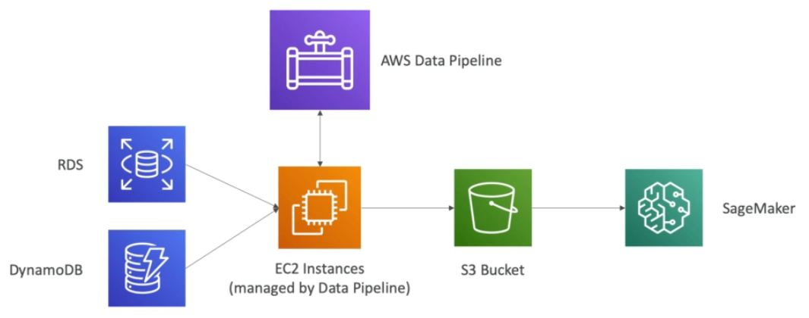

# AWS Data Pipeline Features

* Destinations include S3, RDS, DynamoDB, Redshift and EMR
* Manages task dependencies
* Retires and notifies on failures
* **Data sources may be on-premises**
* HA

# Data Pipeline example

# AWS Data Pipeline vs Glue

* Glue
  * Glue ETL - run Apache Spark code, Scala or Python based, focus on the ETL
  * Glue ETL - do not worry about configuring or managing the resources
  * Data Catalog to make the data available to Athena or Redshift Spectrum

* Data Pipeline
  * Orchestration service
  * More control over the environment, compute resources that run code and code
  * Allows access to EC2 or EMR instances (creates resources in your own account)