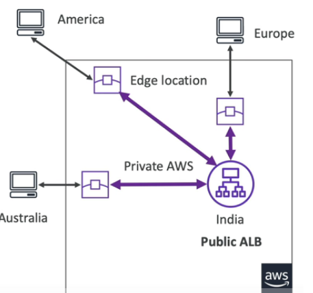
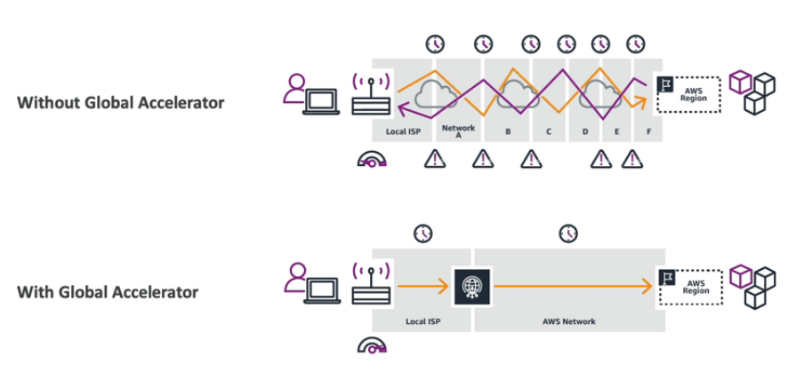

# AWS Global Accelerator

* Improve global application availability and performance using AWS global network
* Leverage the AWS internal network to optimize the route to your application (60% improvement)
* 2 Anycast IP are created for your application and traffic is sent through **Edge Locations**
  * https://medium.com/@datapath_io/what-is-anycast-f37051054ad
  * *Anycast on the other hand allows multiple network devices to advertise the same IP address. On an Anycast network, traffic meant for a specific IP address can be forwarded to any one of a number of origin servers, depending on the distance*
* The **Edge Locations** send the traffic to your application

# AWS Global Accelerator vs CloudFront

* They both use the AWS global network and its Edge Locations around the world
* Both services integrated with AWS Shield for DDoS protection
* **CloudFront** - Content Delivery Network
  * Improves performance for your cashable content (such as images and videos)
  * **Content is served at the edge**
* **Global Accelerator**
  * No caching, proxying packets at the edge to applications running in one or more AWS Regions
  * Improves performance for a wide range of applications over TCP and UDP
  * Good for HTTP use cases that require static IP
  * Good for HTTP use cases that required deterministic, fast region failover