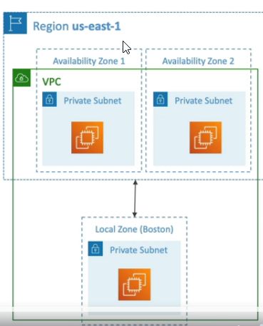
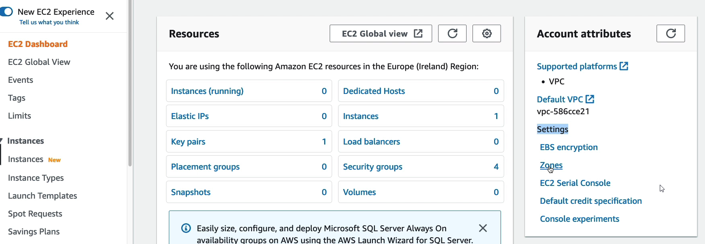
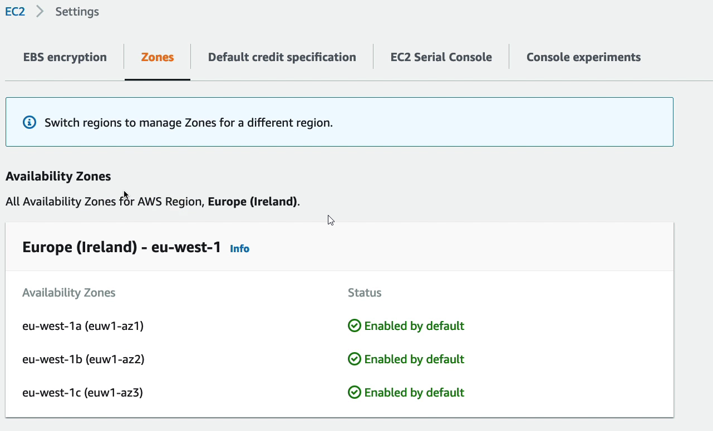
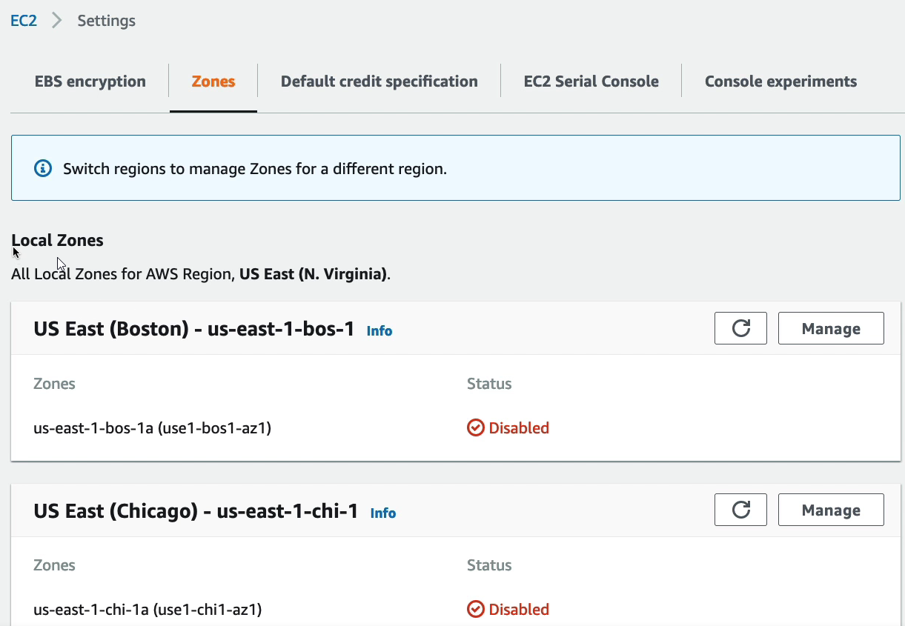
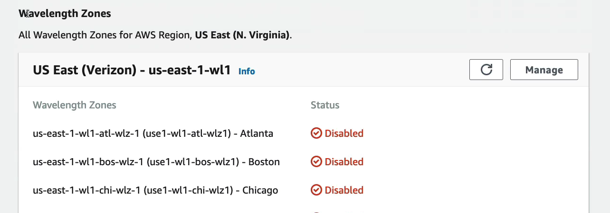
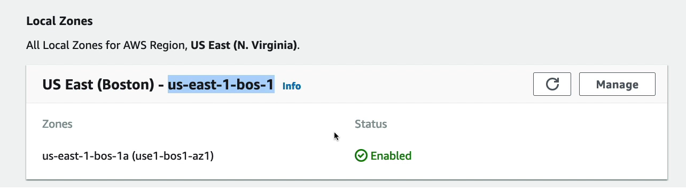
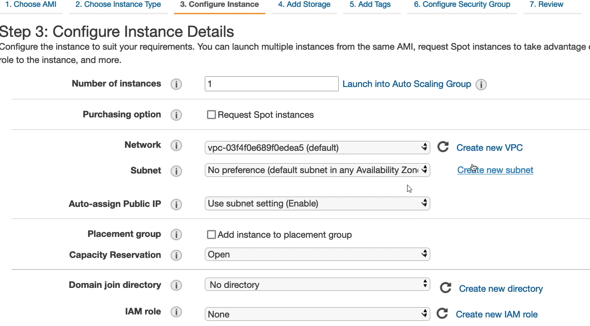
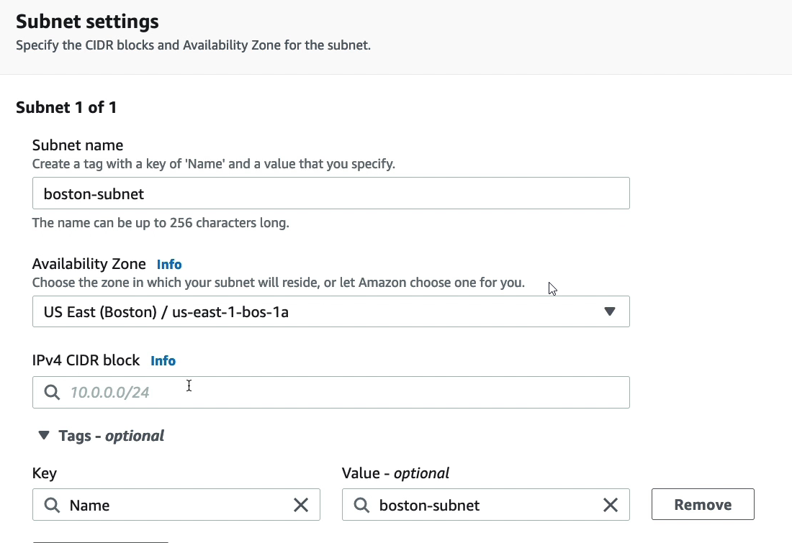
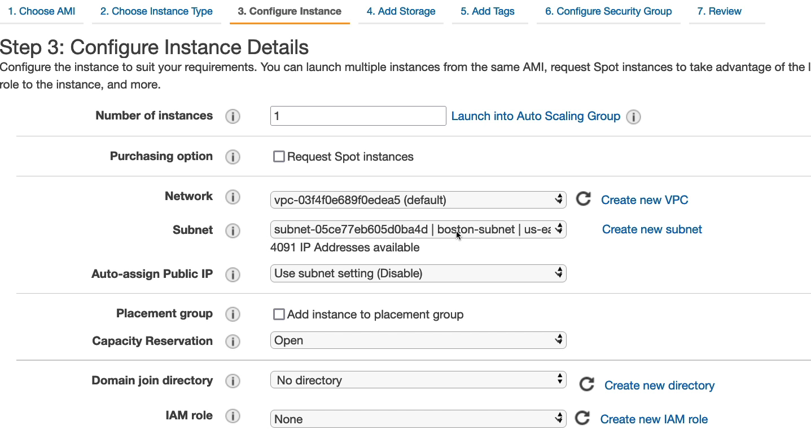

# AWS Local Zones

* Places AWS compute, storage, database, and other selected AWS services **closer to end users to run latency-sensitive applications like for example games**
* Extend your VPC to more locations - "Extension of an AWS Region"
* Compatible with EC2, RDS, ECS, EBS, ElastiCache, Direct Connect...
* Example
  * AWS Region: N.Virginia (us-east-1)
  * AWS Local Zones: Boston, Chicago, Dallas, Houston, Miami,...

# Hands On

* To check local zones click "Zones" link

* There are regions which do not have local zones, there are only availability zones

* And there are regions which have local zones (availability zones are always)

and also Wavelength Zones

* If we want reduce latency for users from Boston we can enable local zone

* Next if we want launch EC2 we can create a new subnet for selected VPC that will be hosted in Boston

* Next we can select this subnet for the EC2 instance

