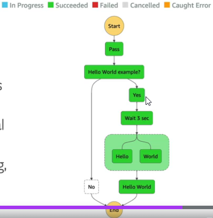
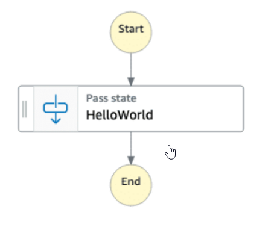

# Introduction

* Build serverless visual workflow to **orchestrate** your lambda functions
* Features: sequence, parallel, conditions, timeouts, error handling
* **Can integrate with EC2, ECS, On-premises servers, API Gateway, SQS, etc...**
* Possibility of implementing human approval feature
* Use cases: order fulfillment, data processing, web applications, any workflow
* **Can be used to train/tune ML models**
* Step Functions logs the state of each step, so when things do go wrong, you can diagnose and debug problems quickly.
* Retries when errors occur.
* You can change and add steps without even writing code, so you can evolve your application and innovate faster.

# Different types of states

* A **Pass state** passes its input to its output, without performing work. Pass states are useful when constructing and debugging state machine.

* 