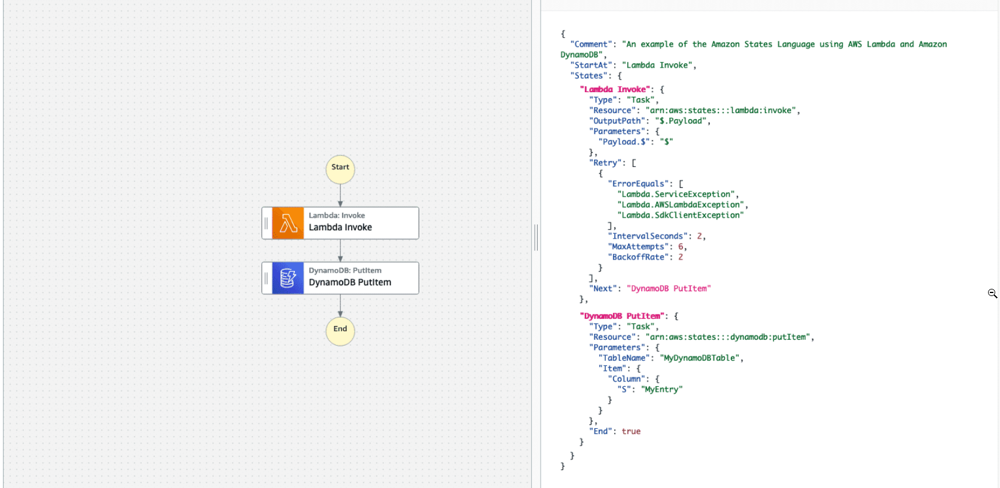

# Introduction

* Build serverless visual workflow to **orchestrate** your lambda functions
* Features: sequence, parallel, conditions, timeouts, error handling
* **Can integrate with**
  * Compute services, such as AWS Lambda, Amazon Elastic Container Service (Amazon ECS), Amazon Elastic Kubernetes Service (Amazon EKS), and AWS Fargate   
  * Database services (Amazon DynamoDB)
  * Messaging services, such as Amazon Simple Notification Service (Amazon SNS) and Amazon Simple Queue Service (Amazon SQS)
  * Data processing and analytics services, such as Amazon Athena, AWS Batch, AWS Glue, Amazon EMR, and AWS Glue DataBrew
  * Machine learning services (Amazon SageMaker)
  * APIs created by Amazon API Gateway
  * AWS SDK integrations to call over two hundred AWS services
* Possibility of implementing human approval feature
* Use cases: order fulfillment, data processing, web applications, any workflow
* **Can be used to train/tune ML models**
* Step Functions logs the state of each step, so when things do go wrong, you can diagnose and debug problems quickly.
* Retries when errors occur.
* You can change and add steps without even writing code, so you can evolve your application and innovate faster.

# Different types of states

* A **Pass state** passes its input to its output, without performing work. Pass states are useful when constructing and debugging state machine.

* A **Task state** represents a single unit of work performed by a state machine. Tasks perform all work in your state machine. A task performs work **by using an activity or an AWS Lambda or by passing parameters to the API actions** of other services.

* A **Choice state** add branching logic to a state machine.

* A **Wait state** delays the state machine from  continuing for a specified time. You can choose either a relative time, specified in seconds from when the state begins, or an absolute end time, specified as a timestamp.

* A **Succeed state** stops an activity successfully. The Succeed state is a useful target for Choice state branches that do not do anything except stop the activity. Because Succeed states are terminal states, **they have no Next field, and do not need End field**.

* A **Fail state** stops the activity of the state machine and marks it as a failure, unless it is caught by a Catch block.

* The **Parallel state** can be used to create parallel branches of activity in your state machine.

* The **Map state** can be used to run a set of steps for each element of an input array. While **Parallel state** invokes multiple branches of steps using the same input, a **Map state** will invoke the same steps for multiple entries of an array in the state input.

# Why Use AWS Step Functions?

AWS Step Functions helps with any computational problem or business process that can be subdivided into a series of steps. Application development is faster and more intuitive with Step Functions, **because you can define and manage the workflow of your application independently from its business logic**. Making changes to one does not affect the other. You can easily update and modify workflows in one place, without having to struggle with managing, monitoring, and maintaining multiple point-to-point integrations. Step Functions frees your functions and containers from excess code, so you can write your applications faster and make them more resilient and easier to maintain.

# Step Functions features

* **Automatic scaling**: AWS Step Functions automatically scales the operations and underlying compute to run the steps of your application for you in response to changing workloads. Step Functions scales automatically to help ensure the performance of your application workflow remains consistent as the frequency of requests increases.
* **High availability**: AWS Step Functions has built-in fault tolerance and maintains service capacity **across multiple Availability Zones in each region** to protect applications against individual machine or data center failures. This helps ensure high availability for both the service itself and for the application workflow it operates.
* **Pay per use**: With AWS Step Functions, **you pay for each transition from one state to the next**. Billing is metered by state transition, and you do not pay for idle time, regardless of how long each state persists (up to one year). This keeps Step Functions cost-effective as you scale from a few executions to tens of millions.
* **Secure and compliance**: AWS Step Functions is **integrated with AWS Identity and Access Management (IAM)**, and recommends a least-privileged IAM policy for all of the resources used in your workflow. **You can access AWS Step Functions from VPC-enabled AWS Lambda functions** and other AWS services **without traversing the public internet using AWS PrivateLink**. AWS Step Functions  is a **HIPAA eligible service**, and can be used with applications containing healthcare-related information such as personal health information (PHI). Step Functions is also compliant with **SOC (System & Organization Control)** measures, and the results of these third-party audits are available on the AWS SOC Compliance site. 

# Built-in error handling

AWS Step Functions automatically handles errors and exceptions with built-in try/catch and retry, whether the task takes seconds or months to complete. You can automatically retry failed or timed-out tasks, respond differently to different types of errors, and recover gracefully by falling back to designated cleanup and recovery code.

# History of each run

AWS Step Functions delivers real-time diagnostics and dashboards, integrates with Amazon CloudWatch and AWS CloudTrail, and logs every execution, including overall state, failed steps, inputs, and outputs. If things go wrong, you can quickly identify not only where, but why, and quickly troubleshoot and remediate failures.

# Visual Monitoring

Launching an application is as simple as pressing a button, then watching the invocation of the steps visually lets you quickly verify that everything is operating in order, and as expected. The console clearly highlights errors, so you can quickly pinpoint their root-cause, and troubleshoot issues.

# High volume orchestration

AWS Step Functions has **Express Workflows to support event rates greater than 100,000 per second**, so you can build high volume, short duration workflows. Express Workflows can coordinate AWS Lambda function invocations, AWS IoT Rules Engine actions, and Amazon EventBridge events.

# Amazon States Language

In AWS Step Functions, you define your workflows in the **Amazon States Language**. **The Amazon States Language is a JSON-based, structured language used to define your state machine**. Using Amazon States Language, you create workflows. Workflows are a collection of states that can do work (Task states), determine which states to transition to next (Choice states), or stop an activity with an error (Fail states), and so on. The Step Functions console provides a graphical representation of that state machine to help visualize your application logic.

