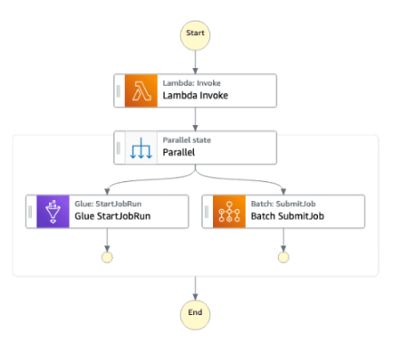
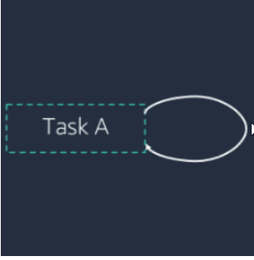
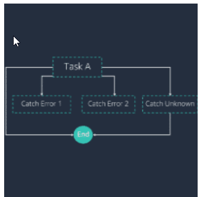
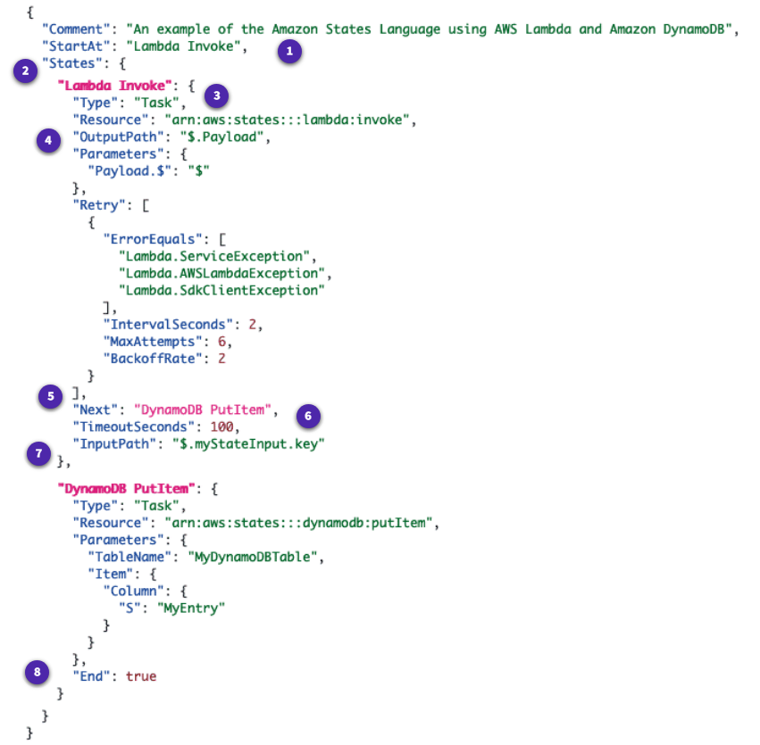
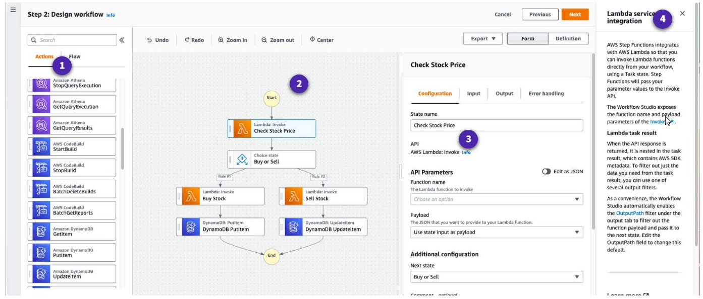
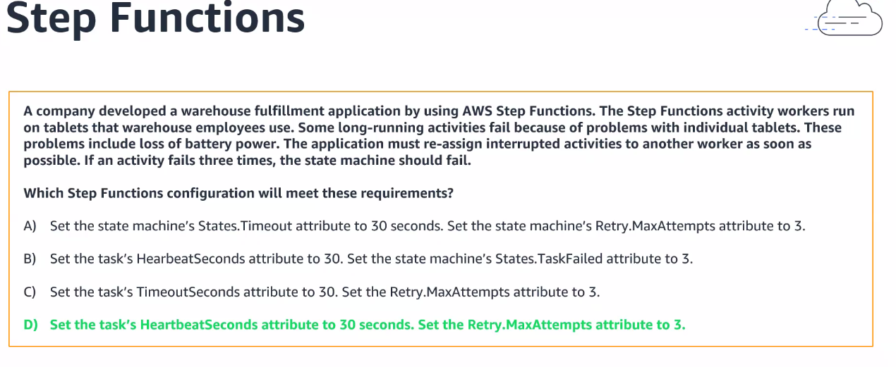
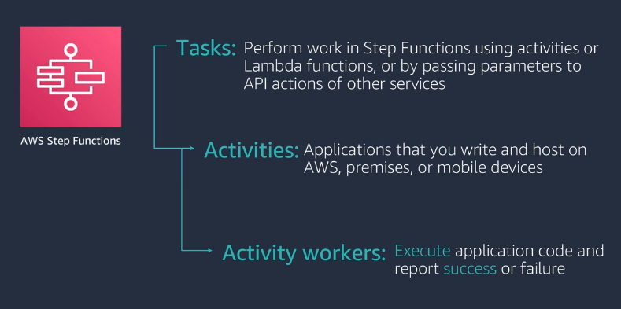
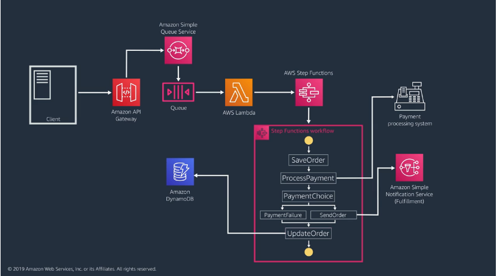

- [Introduction](#introduction)
- [Different types of states](#different-types-of-states)
- [Why Use AWS Step Functions?](#why-use-aws-step-functions)
- [Step Functions features](#step-functions-features)
- [Built-in error handling](#built-in-error-handling)
- [History of each run](#history-of-each-run)
- [Visual Monitoring](#visual-monitoring)
- [High volume orchestration](#high-volume-orchestration)
- [Amazon States Language](#amazon-states-language)
  - [Transitions](#transitions)
  - [Common state fields](#common-state-fields)
  - [Step Functions supports JSON path expressions](#step-functions-supports-json-path-expressions)
  - [Intrinsic Functions](#intrinsic-functions)
- [AWS Step Functions Workflow Studio](#aws-step-functions-workflow-studio)
- [AWS Step Functions Security](#aws-step-functions-security)
  - [How a user can access Step Functions](#how-a-user-can-access-step-functions)
  - [How AWS Step Functions works with IAM](#how-aws-step-functions-works-with-iam)
- [Standard and Express Workflows](#standard-and-express-workflows)
  - [Standard vs Express Workflows](#standard-vs-express-workflows)
  - [Asynchronous vs synchronous Express Workflows](#asynchronous-vs-synchronous-express-workflows)
- [Notes from AWS PartnerCast](#notes-from-aws-partnercast)
- [Task vs Activity vs Activity Worker](#task-vs-activity-vs-activity-worker)
- [Sample flow](#sample-flow)

# Introduction

* Build serverless visual workflow to **orchestrate** your lambda functions
* Features: sequence, parallel, conditions, timeouts, error handling
* **Can integrate with**
  * Compute services, such as AWS Lambda, Amazon Elastic Container Service (Amazon ECS), Amazon Elastic Kubernetes Service (Amazon EKS), and AWS Fargate   
  * Database services (Amazon DynamoDB)
  * Messaging services, such as Amazon Simple Notification Service (Amazon SNS) and Amazon Simple Queue Service (Amazon SQS)
  * Data processing and analytics services, such as Amazon Athena, AWS Batch, AWS Glue, Amazon EMR, and AWS Glue DataBrew
  * Machine learning services (Amazon SageMaker)
  * APIs created by Amazon API Gateway
  * AWS SDK integrations to call over two hundred AWS services
* Possibility of implementing human approval feature
* Use cases: order fulfillment, data processing, web applications, any workflow
* **Can be used to train/tune ML models**
* Step Functions logs the state of each step, so when things do go wrong, you can diagnose and debug problems quickly.
* Retries when errors occur.
* You can change and add steps without even writing code, so you can evolve your application and innovate faster.


# Different types of states

* A **Pass state** passes its input to its output, without performing work. Pass states are useful when constructing and debugging state machine.

* A **Task state** represents a single unit of work performed by a state machine. Tasks perform all work in your state machine. A task performs work **by using an activity or an AWS Lambda or by passing parameters to the API actions** of other services.

* A **Choice state** add branching logic to a state machine.

* A **Wait state** delays the state machine from  continuing for a specified time. You can choose either a relative time, specified in seconds from when the state begins, or an absolute end time, specified as a timestamp.   
     
  With a wait state in Step Functions, you don’t incur any further cost because Step Functions cost is based on transitions between states and not on time spent within a state.

  Callback tasks let you pause the workflow indefinitely until a task token is returned.   
  For some integrated services (including Lambda), Step Functions lets you pass a task token to the service and then pause that task until you get the token back via a **SendTaskSuccess** or a **SendTaskFailure** call.
* A **Succeed state** stops an activity successfully. The Succeed state is a useful target for Choice state branches that do not do anything except stop the activity. Because Succeed states are terminal states, **they have no Next field, and do not need End field**.

* A **Fail state** stops the activity of the state machine and marks it as a failure, unless it is caught by a Catch block.

* The **Parallel state** can be used to create parallel branches of activity in your state machine.

* The **Map state** can be used to run a set of steps for each element of an input array. While **Parallel state** invokes multiple branches of steps using the same input, a **Map state** will invoke the same steps for multiple entries of an array in the state input.

* **Looping tasks**: Iterates on your state machine task a specific number of times.   
  
* **Try/catch/finally**: Deals with errors and exceptions automatically based on your defined business logic.   
  
# Why Use AWS Step Functions?

AWS Step Functions helps with any computational problem or business process that can be subdivided into a series of steps. Application development is faster and more intuitive with Step Functions, **because you can define and manage the workflow of your application independently from its business logic**. Making changes to one does not affect the other. You can easily update and modify workflows in one place, without having to struggle with managing, monitoring, and maintaining multiple point-to-point integrations. Step Functions frees your functions and containers from excess code, so you can write your applications faster and make them more resilient and easier to maintain.

# Step Functions features

* **Automatic scaling**: AWS Step Functions automatically scales the operations and underlying compute to run the steps of your application for you in response to changing workloads. Step Functions scales automatically to help ensure the performance of your application workflow remains consistent as the frequency of requests increases.
* **High availability**: AWS Step Functions has built-in fault tolerance and maintains service capacity **across multiple Availability Zones in each region** to protect applications against individual machine or data center failures. This helps ensure high availability for both the service itself and for the application workflow it operates.
* **Pay per use**: With AWS Step Functions, **you pay for each transition from one state to the next**. Billing is metered by state transition, and you do not pay for idle time, regardless of how long each state persists (up to one year). This keeps Step Functions cost-effective as you scale from a few executions to tens of millions.
* **Secure and compliance**: AWS Step Functions is **integrated with AWS Identity and Access Management (IAM)**, and recommends a least-privileged IAM policy for all of the resources used in your workflow. **You can access AWS Step Functions from VPC-enabled AWS Lambda functions** and other AWS services **without traversing the public internet using AWS PrivateLink**. AWS Step Functions  is a **HIPAA eligible service**, and can be used with applications containing healthcare-related information such as personal health information (PHI). Step Functions is also compliant with **SOC (System & Organization Control)** measures, and the results of these third-party audits are available on the AWS SOC Compliance site. 

# Built-in error handling

AWS Step Functions automatically handles errors and exceptions with built-in try/catch and retry, whether the task takes seconds or months to complete. You can automatically retry failed or timed-out tasks, respond differently to different types of errors, and recover gracefully by falling back to designated cleanup and recovery code.

# History of each run

AWS Step Functions delivers real-time diagnostics and dashboards, integrates with Amazon CloudWatch and AWS CloudTrail, and logs every execution, including overall state, failed steps, inputs, and outputs. If things go wrong, you can quickly identify not only where, but why, and quickly troubleshoot and remediate failures.

# Visual Monitoring

Launching an application is as simple as pressing a button, then watching the invocation of the steps visually lets you quickly verify that everything is operating in order, and as expected. The console clearly highlights errors, so you can quickly pinpoint their root-cause, and troubleshoot issues.

# High volume orchestration

AWS Step Functions has **Express Workflows to support event rates greater than 100,000 per second**, so you can build high volume, short duration workflows. Express Workflows can coordinate AWS Lambda function invocations, AWS IoT Rules Engine actions, and Amazon EventBridge events.

# Amazon States Language

In AWS Step Functions, you define your workflows in the **Amazon States Language**. **The Amazon States Language is a JSON-based, structured language used to define your state machine**. Using Amazon States Language, you create workflows. Workflows are a collection of states that can do work (Task states), determine which states to transition to next (Choice states), or stop an activity with an error (Fail states), and so on. The Step Functions console provides a graphical representation of that state machine to help visualize your application logic.


## Transitions

Transitions link states together, defining the control flow for the state machine. When a state machine is invoked, the system **begins with the state referenced in the top-level "StartAt" field**. This field is a string value that must match the name of one of the states exactly. **It is case sensitive**.   

**All non-terminal states must have a Next field, except for the Choice state.** After initiating a state, AWS Step Functions uses the value of the **Next field to determine the next state**. Next fields also specify state names as strings, and must match the name of a state specified in the state machine description exactly.   

States can have multiple incoming transitions from other states. The process repeats itself until it reaches a terminal state, a **Success or Fail state**, or until a runtime error occurs.

## Common state fields



* **StartAt (required)**: case-sensitive that must match the name of one of the state objects exactly. This field value indicates the the task or the state where the workflow starts.
* **States (required)**: this is an object containing a comma-delimited set of states.
* **Type (required)**: this is the state type.
* **OutputPath (optional)**: this is a path the selects a portion of the state input to be passed to the state output. If omitted, it has the value $, which designates the entire input.
* **Next (optional)**: this is the name of the next state to be run when the current state finishes. Some state types, such as Choice, allow multiple transition states.
* **TimeoutSeconds (optional)**: this is the maximum number of seconds an activity of the state machine can run. If it runs longer than the specified time, the activity fails with a States.Timeout error.
* **InputPath (optional)**: this is a path that selects a portion of the state input to be passed to the state task for processing. If omitted, it has value $, which designates the entire input.
* **End (required)**: this designates this state as a terminal state and ends the activity if set to true. There can be any number of terminal states per state machine. **Next and End can only be used once each in state.**

## Step Functions supports JSON path expressions

Step Functions, when invoked, receives a JSON text as input and passes that input to the first state in the workflow. Individual states receive JSON as input and usually pass JSON as output to the next state. Step Functions can be effectively designed not only by understanding the flow of data from one state to another but also by  knowing how to manipulate and filter the data. **The fields that filter and control the flow from state to state in the Amazon States Language are:**

* InputPath
* ResultPath
* OutputPath
* Parameters
* ResultSelector

## Intrinsic Functions

The Amazon States Language provides several **intrinsic functions to allow basic operations without Task states**. Intrinsic functions are constructs that look like functions in programming languages and can be used to help Payload Builders process the data going to and from Task Resources. An intrinsic function must be a string and must begin with an intrinsic function name.

* **States.Format**: This intrinsic function takes one or more arguments. The value of the first must be a string, which may include zero or more instances of the character sequence.
* **States.StringToJson**: This intrinsic function takes a single argument, whose value must be a string. The interpreter applies a JSON parser to the value and returns its parsed JSON form.
* **States.JsonToString**: This intrinsic function takes a single argument, which must be a path. The interpreter returns a string, which is a JSON text representing the data identified by the path.
* **States.Array**: This intrinsic function takes zero or more arguments. The interpreter returns a JSON array containing the values of the arguments, in the order provided.

Here is an example of the Intrinsic Function "States.Format".

Sample payload template:
```json
"X": {
  "Type": "Task",
  "Resource": "arn:aws:states:us-east-1:123456789012:task:X",
  "Next": "Y",
  "Parameters": {
    "greeting.$": "States.Format('Welcome to {} {}\\'s playlist.', $.firstName, $.lastName)"
  }
}
```

Input to the payload template is:
```json
{
  "firstName": "John",
  "lastName": "Doe"
}
```

After processing the payload template, the new payload is :
```json
{
  "greeting": "Welcome to John Doe's playlist."
}
```

# AWS Step Functions Workflow Studio



* 1 - States browser
* 2 - Canvas panel
* 3 - inspector panel
* 4 - info panel

# AWS Step Functions Security

Access to AWS Step Functions requires credentials that AWS can use to authenticate your  requests. These credentials should be setup using AWS Identity and Access Management (IAM). Along with the credentials, you will also need permissions to create or access the Step Functions resources. For example, you must have permissions to invoke a AWS Lambda function or invoke a Amazon Simple Queue Service (SQS) that will be used as target resources in your Step Functions workflow.   

## How a user can access Step Functions

An IAM user or role can be given access to AWS Step Functions by directly attaching the existing policies defined in the IAM service. **There are three existing policies that can be chosen from the IAM console**. To view the permissions defined for each of these policies, expand each of the three blocks.

* **AWSStepFunctionsConsoleFullAccess**: An access policy with the below permissions providing a user/role/etc access to the AWS Step Functions console. For a full console experience, in addition to this policy, a user may need iam:PassRole permission on other IAM roles that can be assumed by the service. 
  * "states:*"
  * "iam:ListRoles"
  * "iam:PassRole"
  * "lambda:ListFunctions"

* **AWSStepFunctionsFullAccess**: An access policy with the below permissions  providing a user/role/etc access to the AWS Step Functions API.
  * "states:*"

* **AWSStepFunctionsReadOnlyAccess**: An access policy with the below permissions providing a user/role/etc read only access to the AWS Step Functions service.
  * "states:ListStateMachines"
  * "states:ListActivities"
  * "states:DescribeStateMachine"
  * "states:DescribeStateMachineForExecution"
  * "states:ListExecutions"
  * "states:DescribeExecution"
  * "states:GetExecutionHistory"
  * "states:DescribeActivity"

## How AWS Step Functions works with IAM

AWS Step Functions can invoke code and access AWS resources. In order for AWS Step Functions to invoke AWS resources, and maintain security, **you need to grant Step Functions access to those resources by using an IAM role.**   

You can create a role using the IAM console by choosing the Roles section and the Create Role option. Choose Step Functions under AWS service, give a name to the role and create the role. **By default, the lambda:InvokeFunction permission is attached in this process**. You can add more services to this role by choosing the Attach Policies option listed when the Step Functions role is selected in the IAM console. 

# Standard and Express Workflows

When you create a state machine, you can select either a Standard (default) or Express Workflow. In both cases, you define your state machine using the Amazon States Language. Your state machine workflow runs will behave differently depending on which option you select. You cannot change the workflow type after you have created your state machine.

* **Standard Workflows** are ideal for long-running, durable, and auditable workflows.
* **Express Workflows** are ideal for high-volume, event-processing workloads such as IoT data ingestion, streaming data processing and transformation, and mobile application backends.
  * There are **two types of Express Workflows, asynchronous and synchronous**. You learn more about the different types of Express Workflows later in this topic.

Standard and Express Workflows can start automatically in response to events such as HTTP requests via Amazon API Gateway, IoT rules, or event sources in Amazon EventBridge.

## Standard vs Express Workflows

|                                   | Standard Workflows            | Express Workflows (async and sync)    |
|-----------------------------------|-------------------------------|---------------------------------------|
| Maximum duration                  | 1 year                        | 5 minutes                             |
| Workflow run start rate           | Over 2,000 per second         | Over 100,000 per second               |
| Start transition rate             | Over 4,000 per second per account  | Nearly unlimited                 |
| Pricing                           |Priced per state transition. A state transition is counted each time a step in your run is completed. | Priced by the number of times you run, their duration, and memory consumption. |
| Workflow run history              | Workflow runs can be listed and described with Step Functions APIs, and visually debugged through the console. They can also be inspected in CloudWatch Logs by turning on logging on your state machine. | Workflow runs can be inspected in CloudWatch Logs by turning on logging on your state machine - **it is enabled by default**. |
| Workflow run semantics            | Exactly-once workflow run. | Asynchronous Express Workflows: At-least-once workflow run. Synchronous Express Workflows: At-most-once workflow run. |
| Service integrations              | Supports all service integrations and patterns. | Supports all service integrations. It does not support Job-run (.sync) or Callback (.waitForTaskToken) patterns. |
| Step Functions activities         | Supports Step Functions activities.             | Does not support Step Functions activities. |

## Asynchronous vs synchronous Express Workflows

| Asynchronous Express Workflows                |                   Synchronous Express Workflows     |
|-----------------------------------------------|-----------------------------------------------------|
| Return confirmation that the workflow has started, but do not wait for the workflow to complete. | Start a workflow, wait until it completes, and then return the result. |
| Can be used when you don't require immediate response output, such as messaging services or data processing that other services don't depend on.| **Can be used to orchestrate microservices**; you can develop applications without the need to develop additional code to handle errors, retries, or initiate parallel tasks. |
| Can be started in response to an event by a nested workflow in Step Functions, or by using the StartExecution API Call. | Can be invoked from Amazon API Gateway, AWS Lambda, or by using the StartSyncExecution API call. |

# Notes from AWS PartnerCast



* https://docs.aws.amazon.com/step-functions/latest/dg/concepts-error-handling.html#error-handling-error-representation
* https://docs.aws.amazon.com/step-functions/latest/dg/amazon-states-language-task-state.html#task-state-fields

# Task vs Activity vs Activity Worker



# Sample flow

