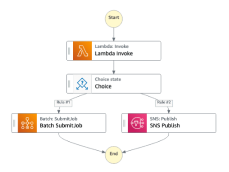

# Introduction

* Build serverless visual workflow to **orchestrate** your lambda functions
* Features: sequence, parallel, conditions, timeouts, error handling
* **Can integrate with EC2, ECS, On-premises servers, API Gateway, SQS, etc...**
* Possibility of implementing human approval feature
* Use cases: order fulfillment, data processing, web applications, any workflow
* **Can be used to train/tune ML models**
* Step Functions logs the state of each step, so when things do go wrong, you can diagnose and debug problems quickly.
* Retries when errors occur.
* You can change and add steps without even writing code, so you can evolve your application and innovate faster.

# Different types of states

* A **Pass state** passes its input to its output, without performing work. Pass states are useful when constructing and debugging state machine.

* A **Task state** represents a single unit of work performed by a state machine. Tasks perform all work in your state machine. A task performs work **by using an activity or an AWS Lambda or by passing parameters to the API actions** of other services.

* A **Choice state** add branching logic to a state machine.

* A **Wait state** delays the state machine from  continuing for a specified time. You can choose either a relative time, specified in seconds from when the state begins, or an absolute end time, specified as a timestamp.

* A **Succeed state** stops an activity successfully. The Succeed state is a useful target for Choice state branches that do not do anything except stop the activity. Because Succeed states are terminal states, **they have no Next field, and do not need End field**.

* A **Fail state** stops the activity of the state machine and marks it as a failure, unless it is caught by a Catch block.

* The **Parallel state** can be used to create parallel branches of activity in your state machine.

* The **Map state** can be used to run a set of steps for each element of an input array. While **Parallel state** invokes multiple branches of steps using the same input, a **Map state** will invoke the same steps for multiple entries of an array in the state input.

