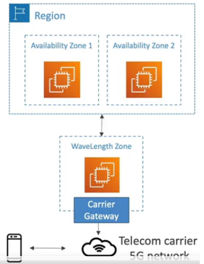

# AWS WaveLength

* WaveLength Zones are infrastructure deployments embedded within the telecommunications providers` data centers at the edge of the 5G networks
* Brings AWS services to the edge of the 5G networks (for example: EC2, EBS, VPC...)
* Ultra-low latency applications through 5G networks
* Traffic does not leave the Communication Service Provider (CSP) network
* High-bandwidth and secure connection to parent AWS Region
* No additional charges or service agreements
* Use cases: Smart Cities, ML-assisted diagnostics, Connected Vehicles, Interactive Live Video Streams, AR/VS, Real-time gaming,...

