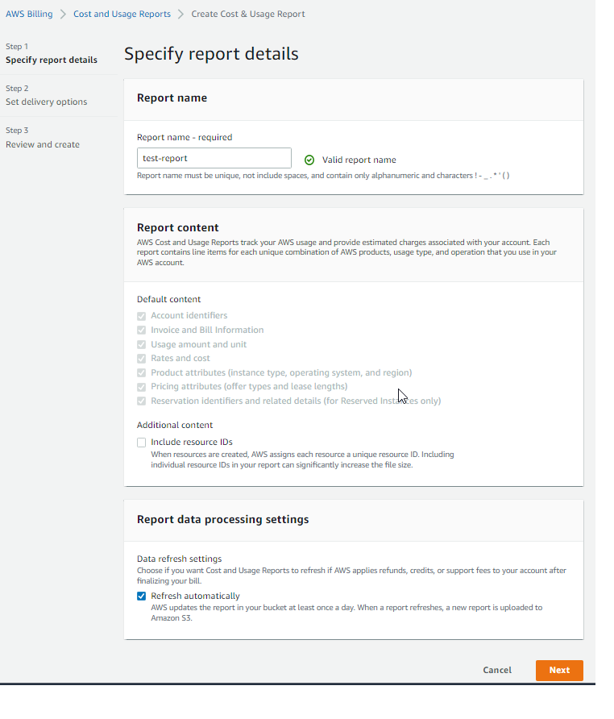
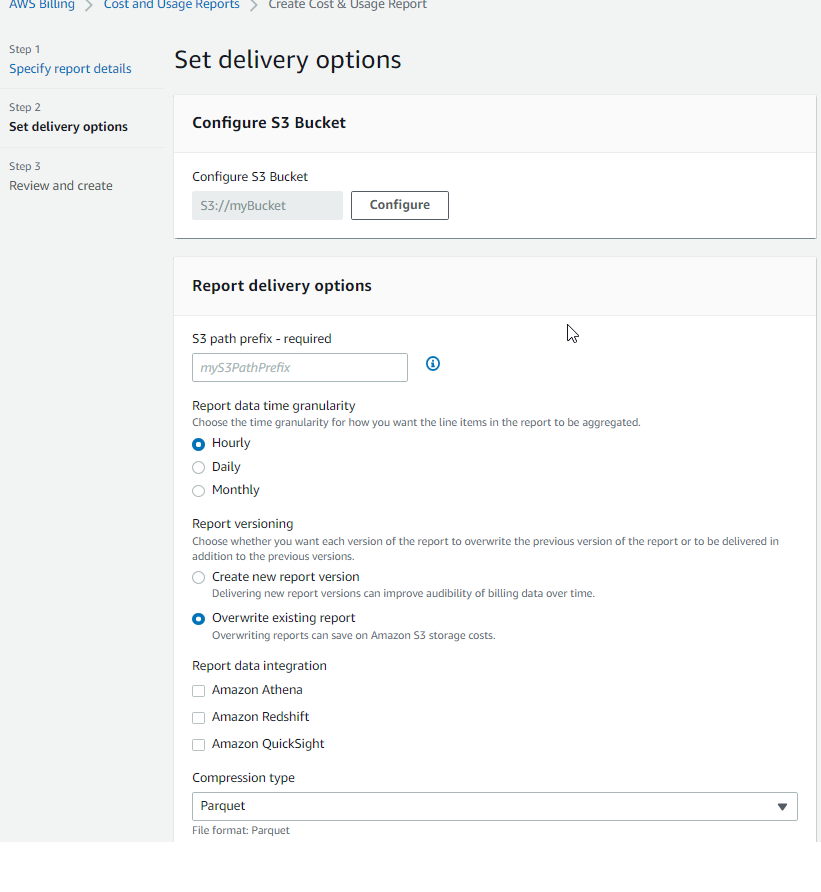
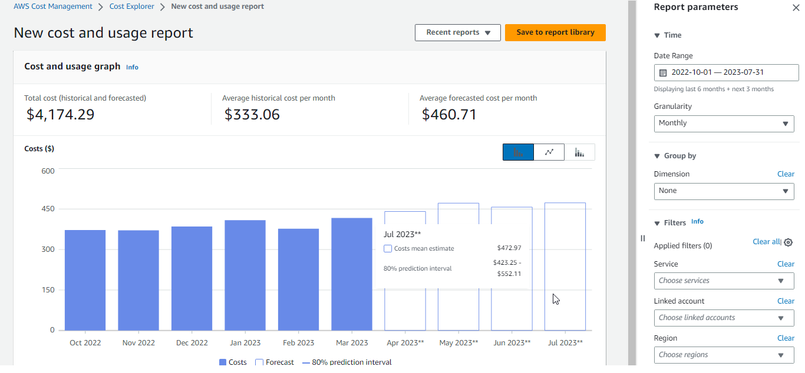
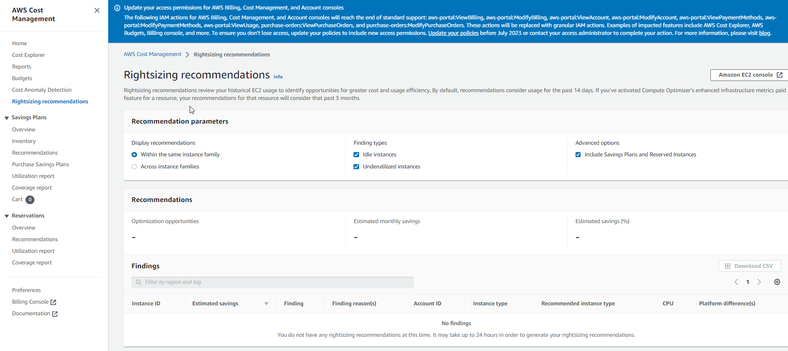

- [AWS Organizations](#aws-organizations)
  - [Multi Account Strategies](#multi-account-strategies)
  - [Service Control Policies (SCP)](#service-control-policies-scp)
  - [AWS Organizations Hands On](#aws-organizations-hands-on)
  - [Organizations Consolidated Billing](#organizations-consolidated-billing)
- [AWS Control Tower](#aws-control-tower)
  - [AWS Control Tower Hands On](#aws-control-tower-hands-on)
- [Pricing Models](#pricing-models)
  - [Three fundamental drivers of cost with AWS](#three-fundamental-drivers-of-cost-with-aws)
  - [Compute Pricing - EC2](#compute-pricing---ec2)
  - [Compute Pricing - EC2 different models](#compute-pricing---ec2-different-models)
  - [Compute Pricing - Lambda and ECS](#compute-pricing---lambda-and-ecs)
  - [Storage Pricing - S3](#storage-pricing---s3)
  - [Storage Pricing - EBS](#storage-pricing---ebs)
  - [Database pricing - RDS](#database-pricing---rds)
  - [Content Delivery - CloudFront](#content-delivery---cloudfront)
  - [Networking costs in AWS per GB - simplified](#networking-costs-in-aws-per-gb---simplified)
  - [Services that support reservations to optimize costs](#services-that-support-reservations-to-optimize-costs)
  - [Data transfer](#data-transfer)
- [Savings Plan Overview](#savings-plan-overview)
- [AWS Compute Optimizer](#aws-compute-optimizer)
- [Billing \& Costing Tools Overview](#billing--costing-tools-overview)
  - [AWS Billing Dashboard, tags, reports](#aws-billing-dashboard-tags-reports)
    - [Cost and Usage Reports (**it is part of AWS Billing**)](#cost-and-usage-reports-it-is-part-of-aws-billing)
    - [Cost Explorer](#cost-explorer)
- [Billing alarms and AWS budgets](#billing-alarms-and-aws-budgets)
- [Billing alarms](#billing-alarms)
  - [AWS budgets](#aws-budgets)
- [AWS Trusted Advisor](#aws-trusted-advisor)
- [Support plans](#support-plans)
  - [Basic support plan](#basic-support-plan)
  - [Developer support plan](#developer-support-plan)
  - [Business support plan (24/7)](#business-support-plan-247)
  - [Enterprise On-Ramp Support plan (24/7)](#enterprise-on-ramp-support-plan-247)
  - [Enterprise Support plan (24/7)](#enterprise-support-plan-247)
- [AWS Pricing/TCO Tools](#aws-pricingtco-tools)
- [Optimizing your cost with Rightsizing Recommendations](#optimizing-your-cost-with-rightsizing-recommendations)
- [Credits](#credits)
# AWS Organizations

* Global Service
* Allows to manage multiple AWS accounts
* The main account is the master account
* Cost benefits
  * Consolidated billing across all accounts - single payment method
  * Pricing benefits from aggregated usage (volume discount for EC2, S3...) - bulk discounts
  * Pooling of Reserved EC2 instances for optimal savings
* API is available to automate AWS account creation
* Hierarchical groupings of accounts
* **Restrict account privileges using Service Control Policies (SCP)**
* Regarding removing an AWS account from AWS Organizations
  * The AWS account must be able to operate as a standalone account. Only then it can be removed from AWS organizations.
  * Restrictions imposed by those SCPs are gone, and the users and roles in the account might have more permissions than they had before.

## Multi Account Strategies

* Creates accounts per department, per cost center, per dev/test/prod, based on regulatory restrictions (using SCP) for better resource isolation (ex:VPC), to have per-account service limits, isolated account for logging.
* Multi Account vs One Account Multi VPC
* Use tagging standards for billing purpose
* Enable CloudTrail on all accounts, send logs to central S3 account
* Send CloudWatch logs to central logging account
* Organizational units (OU) - examples
  

## Service Control Policies (SCP)

https://aws.amazon.com/organizations/faqs/

* **SCP specifies the maximum permissions that can be used by users and roles in your organization`s accounts. An SCP does not grant permissions. You must still use IAM permissions or resources policies to grant permissions.**
* Whitelist or blacklist IAM actions
* Applied at the OU or Account level
* **Does not apply to the master account**
* SCP is applied to all the Users and Roles of the Account, including Root
* Attaching an empty SCP to an account is equivalent to attaching a policy that explicitly denies all actions.
* The SCP does not affect service-linked roles
  * Service-linked roles enable other AWS services to integrate with AWS Organizations and cannot be restricted by SCPs.
* SCP must have an explicit Allow (does not allow anything by default)
* **Deny takes precedence before Allow!**
* Use cases
  * Restrict access to certain services (for example cannot use EMR)
  * Enforce PCI compliance by explicitly disabling services
* Sample SCP hierarchy
  
* Sample blacklist and whitelist strategies
  

## AWS Organizations Hands On

* Sample organization
  

* Use SCP to create restrictions
  
  
  
  
  
  
  

## Organizations Consolidated Billing

* When you enabled, provides you with
  * Combined Usage - combine the usage across all AWS accounts in the AWS Organization to share the volume pricing, Reserved Instances and Saving Plans
  * Benefit of consolidated billing is the ability to share bulk discount pricing, Savings Plans, and Reserved Instances across the accounts in your organization. For instance, one account might not have enough monthly usage to qualify for discount pricing. However, when multiple accounts are combined, their aggregated usage may result in a benefit that applies across all accounts in the organization.
  * One Bill - get on bill for all AWS accounts in the AWS Organization
* The management account can turn off Reserved Instances discount sharing for any account in the AWS Organization, including itself

# AWS Control Tower

* Easy way to set up and govern a secure and compliant **multi-account AWS environment** based on best practices
* Benefits
  * Automate the set up of your environment in a few clicks
  * Automate ongoing policy management using guardrails
    * Guardrails are pre-packaged SCP and AWS Config governance rules for security, operations, and compliance that customers can select and apply enterprise-wide or to specific groups of accounts
  * Detect policy violations and remediate them
  * Monitor compliance through an interactive dashboard
* **AWS Control Tower runs on top of AWS Organizations**
  * It automatically sets up AWS Organizations to organize accounts and implement SCPs

## AWS Control Tower Hands On

>NOTE: To set up your AWS Control Tower landing zone, you must log in to the management account of your organization.

# Pricing Models

* AWS has 4 pricing models
  * Pay as you go: pay for what you use, remain agile, responsive, meet scale demands
  * Save when you reserve (commit): minimize risk, predictably mange budgets, comply with long-terms requirements
    * Reservations are available for EC2 Reserved Instances, DynamoDB Reserved Capacity, ElastiCache Reserved Nodes, RDS Reserved Instances, Redshift Reserved Nodes
  * Pay less by using more: volume-based discounts (for services such as S3, pricing is tiered, meaning the more you use, the less you pay per GB).
  * Pay less as AWS grows

* Free services & free tier in AWS
  * IAM
  * VPC
  * Consolidated Billing
  * Elastic Beanstalk - you pay for created resources
  * Cloud Formation - you pay for created resources
  * Auto Scaling Groups - you pay for created resources

## Three fundamental drivers of cost with AWS

* Compute
* Storage
* Outbound data transfer (inbound data transfer into all AWS regions from the internet is free)

## Compute Pricing - EC2

* Only charged for what you use
* Number of instances
* Instance configuration
  * Physical capacity
  * Region
  * OS and software
  * Instance type
  * Instance size
* ELB running time and amount of data processed
* Detailed monitoring

## Compute Pricing - EC2 different models

* On-demand instances
  * Minimum billing time of 60s
  * Pay per second (Linux/Windows) or per hour (other): https://aws.amazon.com/ec2/pricing/
  * **No long-term commitments**
* Reserved instances
  * Up to 72% discount compared to On-demand on hourly rate
  * **1 or 3 yeats commitment**: 3 years term would always be more cost-effective than a 1-year term regardless of options All upfront, partial upfront, no upfront
  * Payment options: All upfront, partial upfront, no upfront
  * **Commitment unit: instance**
  * Predictable usage
  * Amazon EC2 RI instance types
    * **Standard RIs**: These provide the most significant discount (up to 72% off On-Demand) and are best suited for steady-state usage.
    * **Convertible RIs**: These provide a discount (up to 54% off On-Demand) and the capability to change the attributes of the RI as long as the exchange results in the creation of Reserved Instances of equal or greater value. Like Standard RIs, Convertible RIs are best suited for steady-state usage.
    * **Scheduled RIs**: These are available to launch within the time windows you reserve. This option allows you to match your capacity reservation to a predictable recurring schedule that only requires a fraction of a day, a week, or a month.
  * **Reserved Instance Marketplace**: The Reserved Instance Marketplace is a platform that supports the sale of third-party and AWS customers' unused Standard Reserved Instances, which vary in term lengths and pricing options. For example, you might want to sell Reserved Instances after moving instances to a new AWS Region, changing to a new instance type, ending projects before the term expiration, when your business needs change, or if you have unneeded capacity. https://docs.aws.amazon.com/AWSEC2/latest/UserGuide/ri-market-general.html
* Spot instances
  *  AWS must have spare capacity available for any surge in customer demand. To offset the loss of idle infrastructure, AWS offers this excess capacity at a massive discount to drive usage.
  * A Spot Instance is an instance that uses spare EC2 capacity that is available for less than the On-Demand price
  * Up to 90% discount compared to On-demand on hourly rate
  * Bid for unused capacity
  * AWS can “pull the plug” and terminate spot instances with just a 2 minute warning.
* [Dedicated Instance](https://aws.amazon.com/ec2/pricing/dedicated-instances/)
  * Dedicated Instances are Amazon EC2 instances that run in a VPC on hardware that's dedicated to a single customer
  * Your Dedicated instances are physically isolated at the host hardware level from instances that belong to other AWS accounts
  * Dedicated instances may share hardware with other instances from the same AWS account that are not Dedicated instances
  * Pay for Dedicated Instances **On-Demand**, save up to 70% by purchasing **Reserved Instances**, or save up to 90% by purchasing **Spot Instances**.
* Saving plans as an alternative to save on sustained usage
  * you do not purchase actual instances but ‌commit to one or three years of On-Demand Instances at a discounted price
  * **commitment unit: dollar**
  * provide up to 72 percent savings on AWS compute usage
* Reserved instances vs saving plans
  * 
* [Dedicated Host](https://aws.amazon.com/ec2/dedicated-hosts/)
  * Physical servers with Amazon EC2 instance capacity that is fully dedicated to your use
  * On-demand
  * [Pricing options](https://aws.amazon.com/ec2/dedicated-hosts/pricing/) **no spot option**
    * On-Demand (hourly)
    * Reservations (1 or 3 years commitment): reservations can provide up to a 70% discount compared to the On-Demand price
    * Dedicated Hosts can be purchased as a Reservation for up to 70 percent off the On-Demand price.
* Dedicated Instances vs Dedicated Host
  * **Dedicated Instances**: If you stop/start instance, you can get some other hardware somewhere else. Basically, the hardware is "yours" (you are not sharing it with others) for the time your instance is running. You stop/start it, you may get different physical machine later on (maybe older, maybe newer, maybe its specs will be a bit different), and so on. **So your instance is moved around on different physical servers - whichever is not occupied by others at the time.**
  * **Dedicated Host**: With Dedicated Host the physical server is basically yours. It does not change, it's always the same physical machine for as long as you are paying.

## Compute Pricing - Lambda and ECS

* Lambda
  * Pay per call
  * Pay per duration
  * Amount of RAM and CPU assigned to the Lambda function
* ECS
  * EC2 Launch Type Model: no additional fees, you pay for AWS resources stored and created in your application
* Fargate
  * Fargate Launch Type Model: Pay for vCPU and memory resources allocated to your applications in your containers

Saving plans are supported by lambda: https://aws.amazon.com/about-aws/whats-new/2020/02/aws-lambda-participates-in-compute-savings-plans/

## Storage Pricing - S3

https://aws.amazon.com/s3/pricing/

* Storage class: S3 Standard, S3 Infrequent Access, S3 One-Zone IA, S3 Intelligent Tiering, S3 Glacier and S3 Glacier Deep Archive
* Number and size of objects: Price can be tiered (based on volume)
* Number and type of requests
* You also pay a per GB/month storage fee
* Data transfer OUT of the S3 region
* S3 Transfer Acceleration
* Lifecycle transitions
* You do not pay for data ingress

## Storage Pricing - EBS

* Volume type (based on performance)
* Storage volume in GB per month provisioned
* IOPS
  * General purpose SSD: included
  * Provisioned IOPS SSD: provisioned amount in IOPS
  * Magnetic: number of requests
* Snapshots
  * Added data cost per GB per month
* Data transfer
  * Outbound data transfer are tiered for volume discounts
  * Inbound is free

## Database pricing - RDS

* Per hour billing
* Database characteristics
  * Engine
  * Size
  * Memory class
* Purchase type
  * **On-demand**
  * **Reserved instances (1 or 3 years) with required up-front**
* Backup storage: there is no additional charge for backup storage up to 100% of your total database storage for a region
* Additional storage (per GB per month)
* Number of input and output requests per month
* Deployment type (storage and I/O are variable)
  * Single AZ
  * Multiple AZs
* Data transfer
  * Outbound data transfer are tiered for volume discounts
  * Inbound is free

## Content Delivery - CloudFront

* Pricing is different across different geographic regions
* Aggregated for each edge location, then applied to your bill
* Data transfer out (volume discount)
* Number of HTTP/HTTPS requests

## Networking costs in AWS per GB - simplified

* Use private IP instead of public IP for good savings and better network performance
* Use same AZ for maximum savings (at the costs of high availability)

## Services that support reservations to optimize costs

* Amazon EC2 Reserved Instances: You can use Amazon EC2 Reserved Instances to reserve capacity and receive a discount on your instance usage compared to running On-Demand instances.

* Amazon DynamoDB Reserved Capacity: If you can predict your need for Amazon DynamoDB read-and-write throughput, Reserved Capacity offers significant savings over the normal price of DynamoDB provisioned throughput capacity.

* Amazon ElastiCache Reserved Nodes: Amazon ElastiCache Reserved Nodes give you the option to make a low, one-time payment for each cache node you want to reserve and, in turn, receive a significant discount on the hourly charge for that node.

* Amazon RDS RIs: Like Amazon EC2 RIs, Amazon RDS RIs can be purchased using No Upfront, Partial Upfront, or All Upfront terms. All Reserved Instance types are available for Aurora, MySQL, MariaDB, PostgreSQL, Oracle, and SQL Server database engines.

* Amazon Redshift Reserved Nodes: If you intend to keep an Amazon Redshift cluster running continuously for a prolonged period, you should consider purchasing reserved-node offerings. These offerings provide significant savings over on-demand pricing, but they require you to reserve compute nodes and commit to paying for those nodes for either a 1- or 3-year duration.

## Data transfer

In most cases, there is no charge for inbound data transfer or data transfer between other AWS services within the same region. Outbound data transfer is aggregated across services and then charged at the outbound data transfer rate.

For example: per AWS pricing, data transfer between S3 and EC2 instances within the same region is not charged.

# Savings Plan Overview

* Commit a certain $ amount per hour for 1 or 3 years
* Easiest wat to setup long-term commitments on AWS
* [EC2 Saving Plan](https://aws.amazon.com/savingsplans/compute-pricing/)
  * Up to 72% discount compared to On-Demand
  * Commit to usage of individual instance families in a region (eg. C5 or M5)
  * Regardless of AZ, size (m5.xl to m5.4xl), OS (Linux/Windows) or tenancy
  * All upfront, partial upfront, no upfront
* [Compute Savings Plan](https://aws.amazon.com/savingsplans/compute-pricing/)
  * Up to 66% discount compared to On-Demand
  * Regardless to Family, Region, size, OS, tenancy, compute options
  * Compute Options: EC2, Fargate, Lambda
* Machine Learning Savings Plan: SageMaker

# AWS Compute Optimizer

* Global service
* **Can be used to for rightsizing process**
* Reduce costs and improve performance by recommending optimal AWS resources for your workloads
* Helps you choose optimal configurations and right-size your workloads (over/under provisioned)
* Use ML to analyze your resources configurations and their utilization CloudWatch metrics - **historical data**
* Supported resources
  * EC2 instances
  * EC2 Auto Scaling Groups
  * EBS volumes
  * Lambda functions
  * ECS services on Fargate (New)
* Lower your costs by up to 25%
* Recommendations can be exported to S3

# Billing & Costing Tools Overview

* Estimating costs in the cloud
  * Pricing calculator https://calculator.aws
* Tracking costs in the cloud
  * Billing dashboard
  * Cost allocation tags
  * Cost and usage reports
  * Cost explorer
* Monitoring against costs plans
  * Billing alarms
  * Budgets

## AWS Billing Dashboard, tags, reports

* AWS Billing Dashboard
  
* Free tier
  

* [Cost allocation tags](https://docs.aws.amazon.com/awsaccountbilling/latest/aboutv2/cost-alloc-tags.html) to track your AWS costs on a detailed level
  * AWS generated tags
    * Automatically applied to the resource you create
    * Starts with Prefix aws: (e.g. aws:createdBy)
  * User-defined tags
    * Defined by the user
    * Starts with Prefix user:
      
  * For each resource, each tag key must be unique, and each tag key can have only one value
  * **You must activate both [AWS generated tags](https://docs.aws.amazon.com/awsaccountbilling/latest/aboutv2/activate-built-in-tags.html) and [user-defined tags](https://docs.aws.amazon.com/awsaccountbilling/latest/aboutv2/custom-tags.html) separately** before they can appear in Cost Explorer or on a cost allocation report

* Tagging and Resource Groups    
  * Tags are used for organizing resources
    * EC2 instances, images, load balancers, security groups...
    * RDS, VPC, IAM, etc...
    * Resources created by CloudFormation are all tagged the same way
  * Free naming, common tags are: Name, Environment, Team...
  * Tags can be used to create Resource Groups
    * Create, maintain, and view a collection of resources that share common tags
    * Manage these tags using the Tag Editor
  * It is per region group
  

### Cost and Usage Reports (**it is part of AWS Billing**)
  https://docs.aws.amazon.com/cur/latest/userguide/cur-create.html   
  https://docs.aws.amazon.com/cur/latest/userguide/what-is-cur.html   
  https://www.linkedin.com/pulse/aws-cost-report-faint-heart-joshua-moore/   

  
  * *It can take up to 24 hours for AWS to start delivering reports to your Amazon S3 bucket. After delivery starts, AWS updates the AWS Cost and Usage Reports files at least once a day.*
  * It is global service

  *AWS Cost and Usage reports provide access to detailed data, enabling you to better analyze and understand your AWS **costs as well as the specific product offerings and usage amounts underlying those costs**. You can customize the content and delivery of your reports and manage them from the reports dashboard.*

  *AWS Cost and Usage Reports track your AWS usage and provide **estimated charges** associated with your account. Each report contains line items for each unique combination of AWS products, usage type, and operation that you use in your AWS account.*

  
  

  * Dive deeper into your AWS costs and usage
  * The AWS Cost and Usage Report contains **the most comprehensive set of AWS cost and usage data available**, including additional metadata about AWS services, pricing, and reservations (e.g., Amazon EC2 Reserved Instances)
  * The AWS Cost and Usage Report lists AWS usage for each service category used by an account and its IAM users in hourly or daily line items, as well as any tags that you have activated for cost allocation purpose
  * Can be integrated with Athena, Redshift or QuickSight
  
  * **Cost and Usage Reports cannot be used to identify under-utilized EC2 instances.**
  * You can use Cost and Usage Reports to publish your AWS billing reports to an Amazon Simple Storage Service (Amazon S3) bucket that you own.

### Cost Explorer
  * **It is part of AWS Cost Management but here it means all AWS Cost Management module.**
  * Global service
  * Data available immediately (no need to wait ~24 hours on first report)
  * Visual, understand, and manage your AWS costs and usage over time
  * Create custom reports that analyze **cost and usage data**
  * **Analyze your data at high level**: total costs and usage **across all accounts**
  * Monthly, hourly, resource level granularity
  * Choose an optimal **Savings Plan** (to lower prices on your bill)
  * **[Forecast usage up to 12 months based on previous usage](https://docs.aws.amazon.com/cost-management/latest/userguide/ce-forecast.html)**
    * You create a forecast by selecting a future time range for your report
    * 
  * Doesn’t have insight into resource utilization (this is available in AWS Trusted Advisor)
  
  * Sample report - monthly cost by AWS Service
  
  * The rightsizing recommendations feature in Cost Explorer helps you identify cost-saving opportunities by downsizing or terminating EC2 instances. You can see all of your underutilized EC2 instances across member accounts in a single view to immediately identify how much you can save: https://docs.aws.amazon.com/cost-management/latest/userguide/ce-rightsizing.html
  
  * Explorer cannot provide into an S3 bucket (this can be done in *AWS Cost and Usage Reports*)

# Billing alarms and AWS budgets

# Billing alarms

* Billing data metric is stored in CloudWatch us-east-1
* Billing data are for overall worldwide AWS costs
* It is for actual costs, not for projected costs
* Intended a simple alarm - not as powerful as AWS Budgets

## AWS budgets

* Create budget and send alarms when costs exceeds the budget
* Sends an alarm when the actual cost exceeds the budgeted amount or **even when the cost forecast exceeds the budgeted amount**.
* 3 types of budgets: Usage, Cost, Reservation (alerts when your utilization drops **below** the threshold you define)
* For Reserved Instances (RI)
  * Track utilization
  * Supports EC2, ElastiCache, RDS, Redshift
* Up to 5 SNS notifications per budget
* Can filter by: service, linked account, tag, purchase option, instance type, region, etc...
* Same options as AWS Cost Explorer
* 2 budgets are free, then $0.02/day/budget

# AWS Trusted Advisor

https://aws.amazon.com/premiumsupport/technology/trusted-advisor/

* No need to install anything - high level AWS account assessment
* Analyze your AWS accounts and provides recommendation on **5 categories**
  * Cost optimization: https://docs.aws.amazon.com/awssupport/latest/user/cost-optimization-checks.html
    * For example: AWS Trusted Advisor checks the Amazon Elastic Compute Cloud (Amazon EC2) instances that were running at any time during the last 14 days and alerts you if the daily CPU utilization was 10% or less and network I/O was 5 MB or less on 4 or more days.
  * Performance - trusted Advisor cannot be used to debug performance issues (use X-Ray)
  * Security
    * 7 core checks - basic & developer support plan
    * S3 bucket permissions (making sure that a bucket is not public)
    * Security groups - specific ports unrestricted
    * IAM Use (making sure that we have at least one IAM user)
    * MFA on Root Account (making sure that MFA is enabled)
    * EBS - making sure that we do not have public snapshots
    * RDS - making sure that we do not have public snapshots
    * Server Limits
    * **Does not check EC2 instances, for EC2 is used AWS Inspector**
  * Fault tolerance
  * Service limits
  * Full checks - business & enterprise support plan - beyond the seven checks above, there are additional checks (over 60 total) under each category available
    * Full check available on the **5 categories**
    * Ability to set CloudWatch alarms when reaching limits
    * Programmatic Access using AWS Support API

# Support plans

https://aws.amazon.com/premiumsupport/plans/

## Basic support plan

* Customer Service & Communications - 24x7 access to customer service, documentation, whitepapers, and support forums
* AWS Trusted Advisor - access to the 7 core trusted advisor checks and guidance to provision your resources following best practices to increase performance and improve security
  
* AWS Personal Health Dashboard - a personalized view of the health of AWS services and alerts when your resources are impacted

## Developer support plan

* All Basic support plan +
* Business hours email access to Cloud Support Associates
* Allows unlimited cases to be open / 1 primary contact (one primary contact to open unlimited cases)
* This plan also supports general guidance on how services can be used for various use cases, workloads, or applications. You do not get access to Infrastructure Event Management with this plan
* Case severity / response times
  * General guidance: < 24 business hours
  * System impaired: < 12 business hours

## Business support plan (24/7)

* Intended to be used if you have production workloads
* Trusted Advisor - Full set of checks + API access
* 24x7 phone, email, and chat access to Cloud Support Engineers - enhanced technical support (**but they are not Senior Cloud Engineers**)
  * Provides architectural guidance contextual to your specific use-cases
* Unlimited cases / unlimited contacts
* Access to Infrastructure Event Management for additional fee.
  * **AWS Infrastructure Event Management is a short-term engagement with AWS Support**. AWS Infrastructure Event Management partners with your technical and project resources to gain a deep understanding of your use case and provide architectural and scaling guidance for an event. Common use-case examples for AWS Event Management include advertising launches, new product launches, and infrastructure migrations to AWS.
* Access to AWS Health API - you can use the API operations to get information about events that might affect your AWS services and resources
* Access to guidance, configuration, and troubleshooting of AWS interoperability with third-party software
* You get programmatic access (API Access) to AWS Support Center features to create, manage, and close your support cases.
* Case severity / response time
  * General guidance < 24 business hours
  * System impaired < 12 business hours
  * Production system impaired < 4 hours
  * Production system down < 1 hour

## Enterprise On-Ramp Support plan (24/7)

* Intended to be used if you have production or business critical workloads
* All of Business support plan +
* Access to a pool of Technical Account Managers (TAM)
* Concierge Support Team (for billing and account best practices)
* Infrastructure Even Management, Well-Architected & Operations Reviews
* Provides access to online training with self-paced labs
* Case severity / response times
  * The same as before with exception that for business-critical system down < 30 mins 

## Enterprise Support plan (24/7)

* Intended to be used if you have mission critical workloads
* All of Business Support Plan +
* Access to a **designated Technical Account Manager** (TAM)
* Infrastructure Even Management, Well-Architected & Operations Reviews
* Case severity / response times
  * The same as before with exception that for business-critical system down < 15 mins 

# AWS Pricing/TCO Tools

https://docs.aws.amazon.com/whitepapers/latest/how-aws-pricing-works/aws-pricingtco-tools.html

# Optimizing your cost with Rightsizing Recommendations

https://docs.aws.amazon.com/cost-management/latest/userguide/ce-rightsizing.html

# Credits

https://www.amazonaws.cn/en/support/faqs/
https://docs.aws.amazon.com/awsaccountbilling/latest/aboutv2/useconsolidatedbilling-credits.html

Credits are applied in the following order:

* Choosing the credits to apply
  * The soonest to expire amongst the credits
  * The credit with the least number of eligible services
  * The oldest of all credits

* Choose where to apply your credits
  * Account that owns the credit is covered for the service charges
  * Credits are applied towards the AWS account with the highest spend
  * **Credits are applied to the service with the highest spend within that account**
  * Credits are applied to the SKU with the highest spend within that service
