- [AWS Organizations](#aws-organizations)
  - [Multi Account Strategies](#multi-account-strategies)
  - [Service Control Policies (SCP)](#service-control-policies-scp)
  - [AWS Organizations Hands On](#aws-organizations-hands-on)
  - [Organizations Consolidated Billing](#organizations-consolidated-billing)
- [AWS Control Tower](#aws-control-tower)
  - [AWS Control Tower Hands On](#aws-control-tower-hands-on)
- [Pricing Models](#pricing-models)
  - [Compute Pricing - EC2](#compute-pricing---ec2)
  - [Compute Pricing - EC2 different models](#compute-pricing---ec2-different-models)
  - [Compute Pricing - Lambda and ECS](#compute-pricing---lambda-and-ecs)
  - [Storage Pricing - S3](#storage-pricing---s3)
  - [Storage Pricing - EBS](#storage-pricing---ebs)
  - [Database pricing - RDS](#database-pricing---rds)
  - [Content Delivery - CloudFront](#content-delivery---cloudfront)
  - [Networking costs in AWS per GB - simplified](#networking-costs-in-aws-per-gb---simplified)
- [Savings Plan Overview](#savings-plan-overview)
- [AWS Compute Optimizer](#aws-compute-optimizer)
- [Billing \& Costing Tools Overview](#billing--costing-tools-overview)
  - [AWS Billing Dashboard, tags, reports](#aws-billing-dashboard-tags-reports)
- [Billing alarms and AWS budgets](#billing-alarms-and-aws-budgets)
- [Billing alarms](#billing-alarms)
  - [AWS budgets](#aws-budgets)
- [AWS Trusted Advisor](#aws-trusted-advisor)
- [Support plans](#support-plans)
  - [Basic support plan](#basic-support-plan)
  - [Developer support plan](#developer-support-plan)
  - [Business support plan (24/7)](#business-support-plan-247)
  - [Enterprise On-Ramp Support plan (24/7)](#enterprise-on-ramp-support-plan-247)
  - [Enterprise Support plan (24/7)](#enterprise-support-plan-247)
- [AWS Pricing/TCO Tools](#aws-pricingtco-tools)
- [Optimizing your cost with Rightsizing Recommendations](#optimizing-your-cost-with-rightsizing-recommendations)
# AWS Organizations

* Global Service
* Allows to manage multiple AWS accounts
* The main account is the master account
* Cost benefits
  * Consolidated billing across all accounts - single payment method
  * Pricing benefits from aggregated usage (volume discount for EC2, S3...) - bulk discounts
  * Pooling of Reserved EC2 instances for optimal savings
* API is available to automate AWS account creation
* Hierarchical groupings of accounts
* **Restrict account privileges using Service Control Policies (SCP)**

## Multi Account Strategies

* Creates accounts per department, per cost center, per dev/test/prod, based on regulatory restrictions (using SCP) for better resource isolation (ex:VPC), to have per-account service limits, isolated account for logging.
* Multi Account vs One Account Multi VPC
* Use tagging standards for billing purpose
* Enable CloudTrail on all accounts, send logs to central S3 account
* Send CloudWatch logs to central logging account
* Organizational units (OU) - examples
  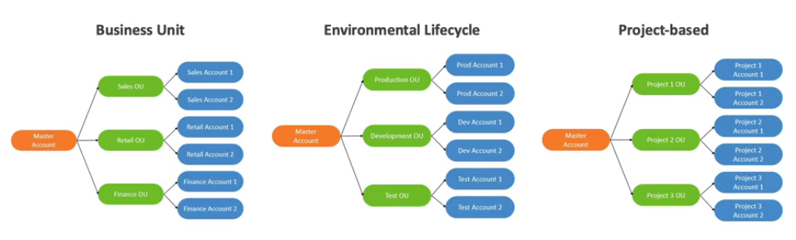

## Service Control Policies (SCP)

https://aws.amazon.com/organizations/faqs/

* Whitelist or blacklist IAM actions
* Applied at the OU or Account level
* **Does not apply to the master account**
* SCP is applied to all the Users and Roles of the Account, including Root
* The SCP does not affect service-linked roles
  * Service-linked roles enable other AWS services to integrate with AWS Organizations and cannot be restricted by SCPs.
* SCP must have an explicit Allow (does not allow anything by default)
* **Deny takes precedence before Allow!**
* Use cases
  * Restrict access to certain services (for example cannot use EMR)
  * Enforce PCI compliance by explicitly disabling services
* Sample SCP hierarchy
  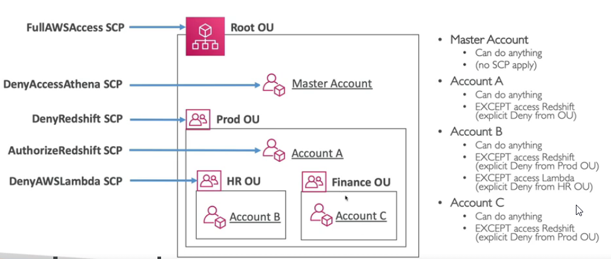
* Sample blacklist and whitelist strategies
  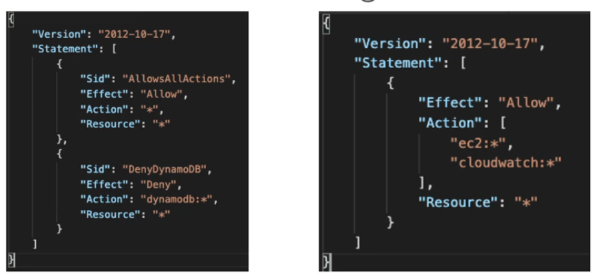

## AWS Organizations Hands On

* Sample organization
  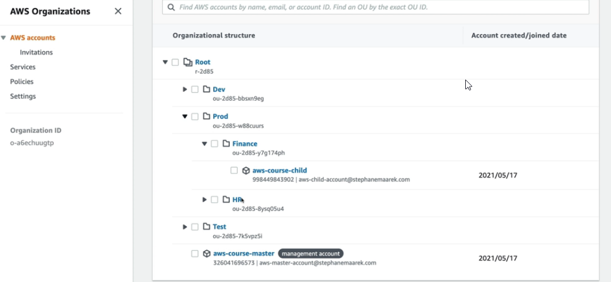

* Use SCP to create restrictions
  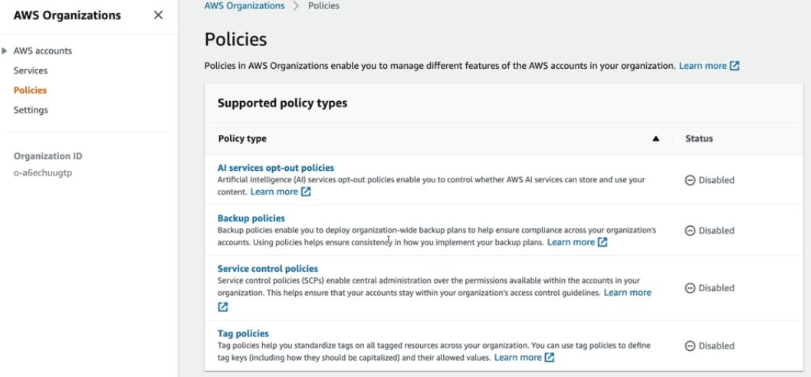
  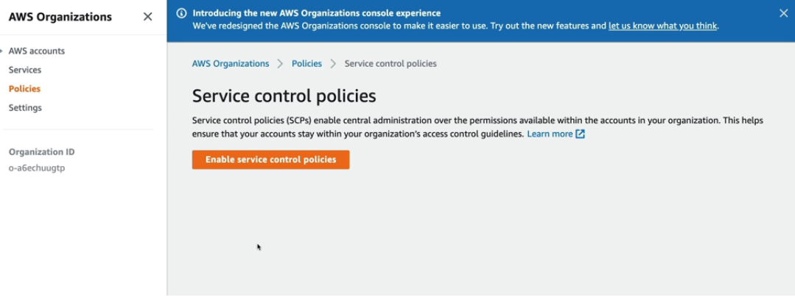
  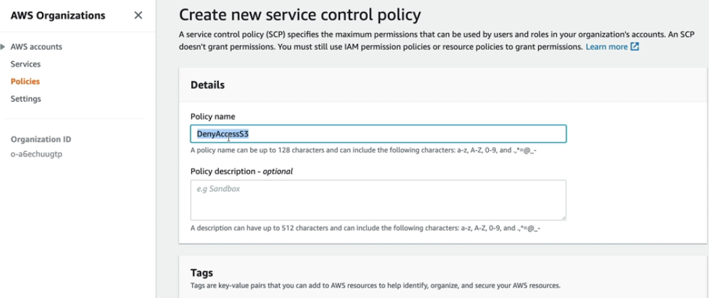
  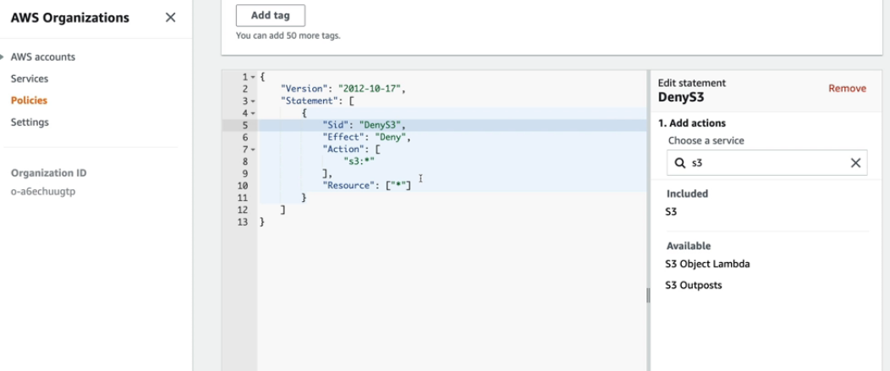
  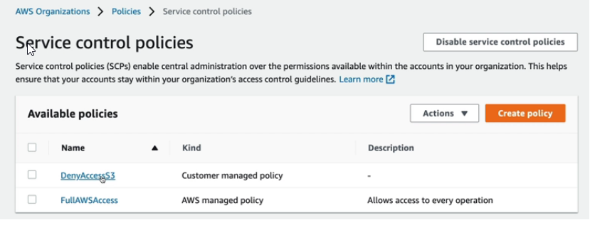
  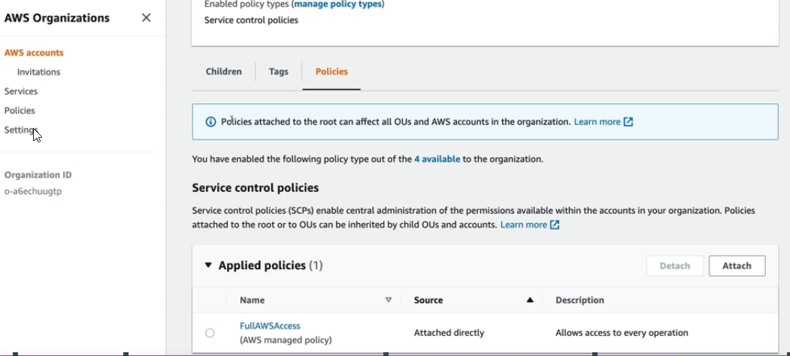
  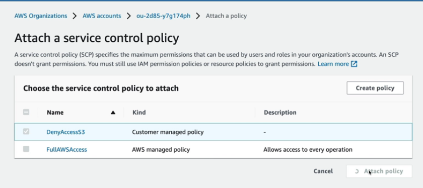

## Organizations Consolidated Billing

* When you enabled, provides you with
  * Combined Usage - combine the usage across all AWS accounts in the AWS Organization to share the volume pricing, Reserved Instances and Saving Plans
  * Benefit of consolidated billing is the ability to share bulk discount pricing, Savings Plans, and Reserved Instances across the accounts in your organization. For instance, one account might not have enough monthly usage to qualify for discount pricing. However, when multiple accounts are combined, their aggregated usage may result in a benefit that applies across all accounts in the organization.
  * One Bill - get on bill for all AWS accounts in the AWS Organization
* The management account can turn off Reserved Instances discount sharing for any account in the AWS Organization, including itself

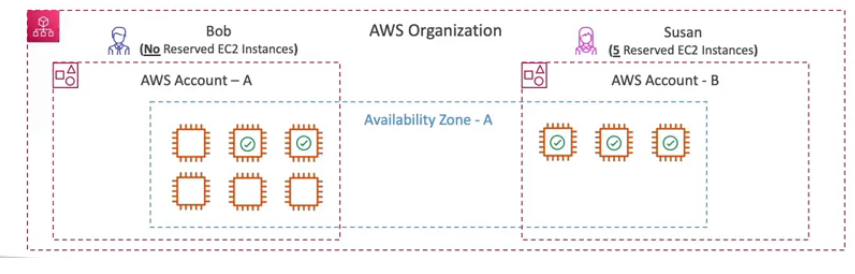

# AWS Control Tower

* Easy way to set up and govern a secure and compliant **multi-account AWS environment** based on best practices
* Benefits
  * Automate the set up of your environment in a few clicks
  * Automate ongoing policy management using guardrails
  * Detect policy violations and remediate them
  * Monitor compliance through an interactive dashboard
* **AWS Control Tower runs on top of AWS Organizations**
  * It automatically sets up AWS Organizations to organize accounts and implement SCPs

## AWS Control Tower Hands On

>NOTE: To set up your AWS Control Tower landing zone, you must log in to the management account of your organization.

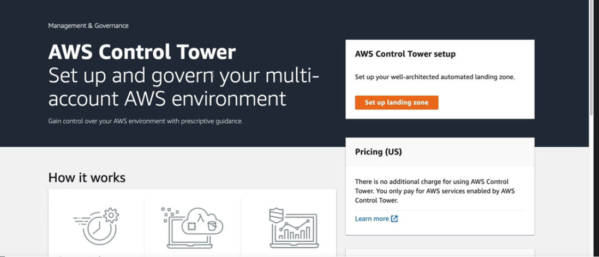
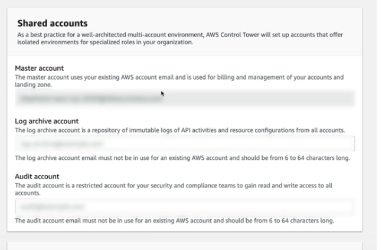
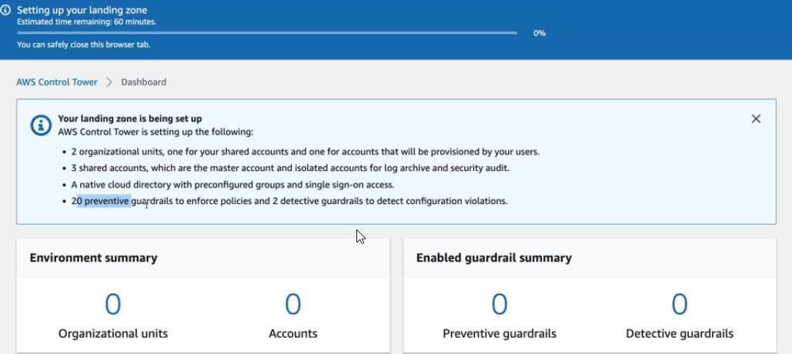

# Pricing Models

* AWS has 4 pricing models
  * Pay as you go: pay for what you use, remain agile, responsive, meet scale demands
  * Save when you reserve: minimize risk, predictably mange budgets, comply with long-terms requirements
    * Reservations are available for EC2 Reserved Instances, DynamoDB Reserved Capacity, ElastiCache Reserved Nodes, RDS Reserved Instances, Redshift Reserved Nodes
  * Pay less by using more: volume-based discounts
  * Pay less as AWS grows

* Free services & free tier in AWS
  * IAM
  * VPC
  * Consolidated Billing
  * Elastic Beanstalk - you pay for created resources
  * Cloud Formation - you pay for created resources
  * Auto Scaling Groups - you pay for created resources

## Compute Pricing - EC2

* Only charged for what you use
* Number of instances
* Instance configuration
  * Physical capacity
  * Region
  * OS and software
  * Instance type
  * Instance size
* ELB running time and amount of data processed
* Detailed monitoring

## Compute Pricing - EC2 different models

* On-demand instances
  * Minimum billing time of 60s
  * Pay per second (Linux/Windows) or per hour (other)
  * **No long-term commitments**
* Reserved instances
  * Up to 75% discount compared to On-demand on hourly rate
  * **1 or 3 yeats commitment**
  * Payment options: All upfront, partial upfront, no upfront
  * **Commitment unit: instance**
  * Predictable usage
  * Amazon EC2 RI instance types
    * **Standard RIs**: These provide the most significant discount (up to 72% off On-Demand) and are best suited for steady-state usage.
    * **Convertible RIs**: These provide a discount (up to 54% off On-Demand) and the capability to change the attributes of the RI as long as the exchange results in the creation of Reserved Instances of equal or greater value. Like Standard RIs, Convertible RIs are best suited for steady-state usage.
    * **Scheduled RIs**: These are available to launch within the time windows you reserve. This option allows you to match your capacity reservation to a predictable recurring schedule that only requires a fraction of a day, a week, or a month.
  * **Reserved Instance Marketplace**: The Reserved Instance Marketplace is a platform that supports the sale of third-party and AWS customers' unused Standard Reserved Instances, which vary in term lengths and pricing options. For example, you might want to sell Reserved Instances after moving instances to a new AWS Region, changing to a new instance type, ending projects before the term expiration, when your business needs change, or if you have unneeded capacity. https://docs.aws.amazon.com/AWSEC2/latest/UserGuide/ri-market-general.html
* Spot instances
  *  AWS must have spare capacity available for any surge in customer demand. To offset the loss of idle infrastructure, AWS offers this excess capacity at a massive discount to drive usage.
  * A Spot Instance is an instance that uses spare EC2 capacity that is available for less than the On-Demand price
  * Up to 90% discount compared to On-demand on hourly rate
  * Bid for unused capacity
  * AWS can “pull the plug” and terminate spot instances with just a 2 minute warning.
* Dedicated Host
  * On-demand
  * Physical servers with Amazon EC2 instance capacity that is fully dedicated to your use
  * Reservation for 1 year or 3 years commitment
* Saving plans as an alternative to save on sustained usage
  * you do not purchase actual instances but ‌commit to one or three years of On-Demand Instances at a discounted price
  * **commitment unit: dollar**
* Reserved instances vs saving plans
  * 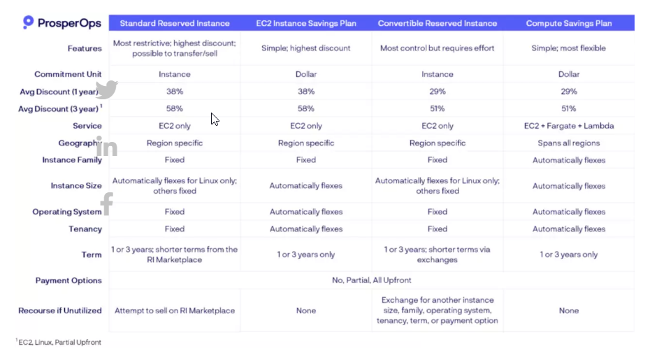

## Compute Pricing - Lambda and ECS

* Lambda
  * Pay per call
  * Pay per duration
  * Amount of RAM and CPU assigned to the Lambda function
* ECS
  * EC2 Launch Type Model: no additional fees, you pay for AWS resources stored and created in your application
* Fargate
  * Fargate Launch Type Model: Pay for vCPU and memory resources allocated to your applications in your containers

## Storage Pricing - S3

* Storage class: S3 Standard, S3 Infrequent Access, S3 One-Zone IA, S3 Intelligent Tiering, S3 Glacier and S3 Glacier Deep Archive
* Number and size of objects: Price can be tiered (based on volume)
* Number and type of requests
* Data transfer OUT of the S3 region
* S3 Transfer Acceleration
* Lifecycle transitions

## Storage Pricing - EBS

* Volume type (based on performance)
* Storage volume in GB per month provisioned
* IOPS
  * General purpose SSD: included
  * Provisioned IOPS SSD: provisioned amount in IOPS
  * Magnetic: number of requests
* Snapshots
  * Added data cost per GB per month
* Data transfer
  * Outbound data transfer are tiered for volume discounts
  * Inbound is free

## Database pricing - RDS

* Per hour billing
* Database characteristics
  * Engine
  * Size
  * Memory class
* Purchase type
  * On-demand
  * Reserved instances (1 or 3 years) with required up-front
* Backup storage: there is no additional charge for backup storage up to 100% of your total database storage for a region
* Additional storage (per GB per month)
* Number of input and output requests per month
* Deployment type (storage and I/O are variable)
  * Single AZ
  * Multiple AZs
* Data transfer
  * Outbound data transfer are tiered for volume discounts
  * Inbound is free

## Content Delivery - CloudFront

* Pricing is different across different geographic regions
* Aggregated for each edge location, then applied to your bill
* Data transfer out (volume discount)
* Number of HTTP/HTTPS requests

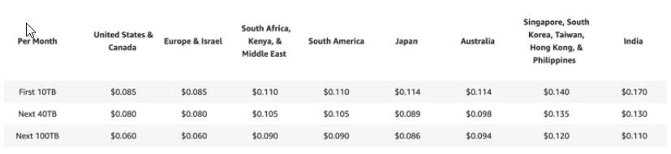

## Networking costs in AWS per GB - simplified

* Use private IP instead of public IP for good savings and better network performance
* Use same AZ for maximum savings (at the costs of high availability)

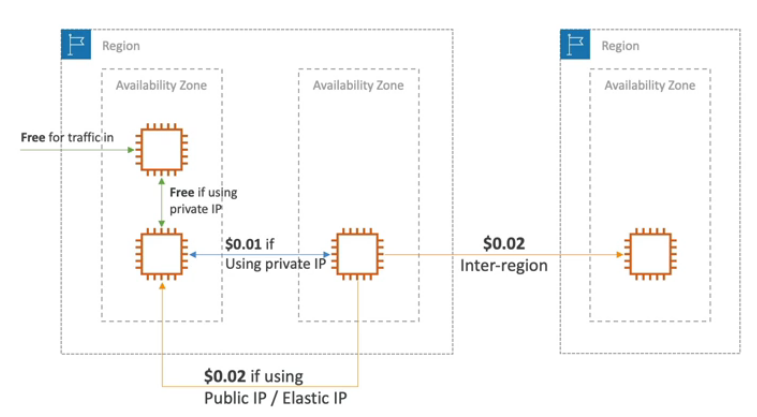

# Savings Plan Overview

* Commit a certain $ amount per hour for 1 or 3 years
* Easiest wat to setup long-term commitments on AWS
* EC2 Saving Plan
  * Up to 72% discount compared to On-Demand
  * Commit to usage of individual instance families in a region (eg. C5 or M5)
  * Regardless of AZ, size (m5.xl to m5.4xl), OS (Linux/Windows) or tenancy
  * All upfront, partial upfront, no upfront
* Compute Savings Plan
  * Up to 66% discount compared to On-Demand
  * Regardless to Family, Region, size, OS, tenancy, compute options
  * Compute Options: EC2, Fargate, Lambda
* Machine Learning Savings Plan: SageMaker

# AWS Compute Optimizer

* Global service
* Reduce costs and improve performance by recommending optimal AWS resources for your workloads
* Helps you choose optimal configurations and right-size your workloads (over/under provisioned)
* Use ML to analyze your resources configurations and their utilization CloudWatch metrics
* Supported resources
  * EC2 instances
  * EC2 Auto Scaling Groups
  * EBS volumes
  * Lambda functions
* Lower your costs by up to 25%
* Recommendations can be exported to S3

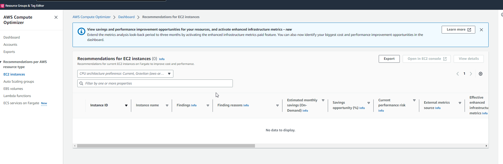

# Billing & Costing Tools Overview

* Estimating costs in the cloud
  * Pricing calculator https://calculator.aws
* Tracking costs in the cloud
  * Billing dashboard
  * Cost allocation tags
  * Cost and usage reports
  * Cost explorer
* Monitoring against costs plans
  * Billing alarms
  * Budgets

## AWS Billing Dashboard, tags, reports

* AWS Billing Dashboard
  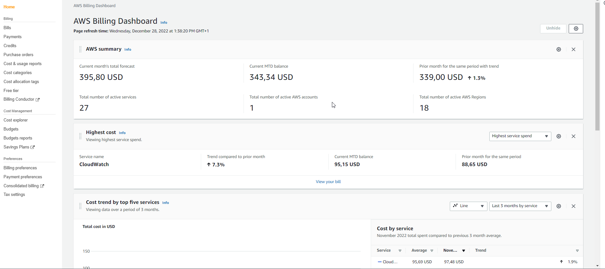
* Free tier
  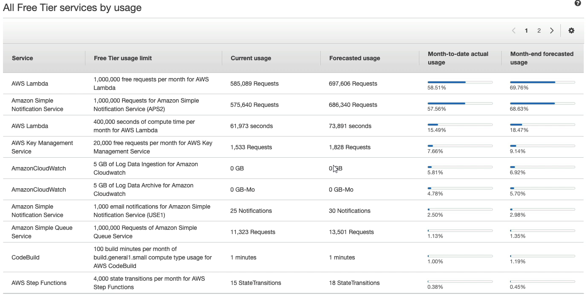

* Cost allocation tags to track your AWS costs on a detailed level
  * AWS generated tags
    * Automatically applied to the resource you create
    * Starts with Prefix aws: (e.g. aws:createdBy)
  * User-defined tags
    * Defined by the user
    * Starts with Prefix user:
      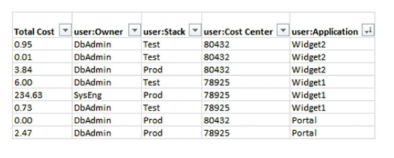

* Tagging and Resource Groups    
  * Tags are used for organizing resources
    * EC2 instances, images, load balancers, security groups...
    * RDS, VPC, IAM, etc...
    * Resources created by CloudFormation are all tagged the same way
  * Free naming, common tags are: Name, Environment, Team...
  * Tags can be used to create Resource Groups
    * Create, maintain, and view a collection of resources that share common tags
    * Manage these tags using the Tag Editor
  * It is per region group
  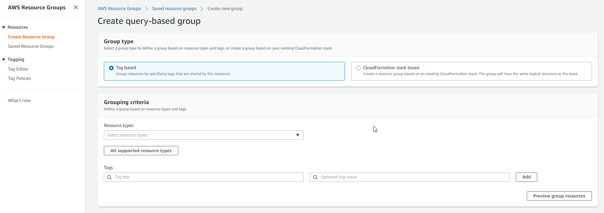

* Cost and Usage Report
  * Dive deeper into your AWS costs and usage
  * The AWS Cost and Usage Report contains the most comprehensive set of AWS cost and usage data available, including additional metadata about AWS services, pricing, and reservations (e.g., Amazon EC2 Reserved Instances)
  * The AWS Cost and Usage Report lists AWS usage for each service category used by an account and its IAM users in hourly or daily line items, as well as any tags that you have activated for cost allocation purpose
  * Can be integrated with Athena, Redshift or QuickSight
  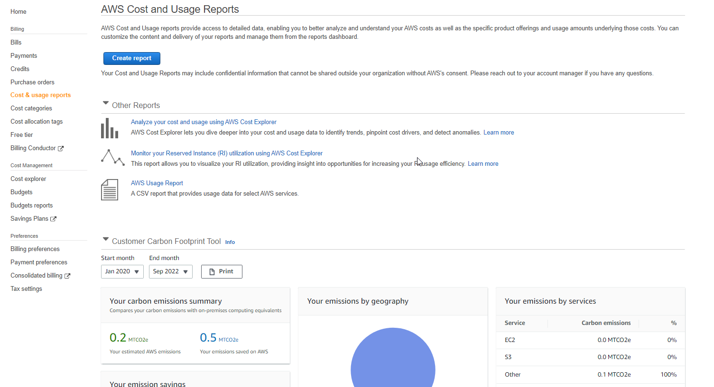

* Cost Explorer
  * Visual, understand, and manage your AWS costs and usage over time
  * Create custom reports that analyze cost and usage data
  * **Analyze your data at high level**: total costs and usage **across all accounts**
  * Or monthly, hourly, resource level granularity
  * Choose an optimal **Savings Plan** (to lower prices on your bill)
  * **Forecast usage up to 12 months based on previous usage**
  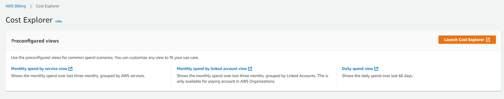
  * Sample report - monthly cost by AWS Service
  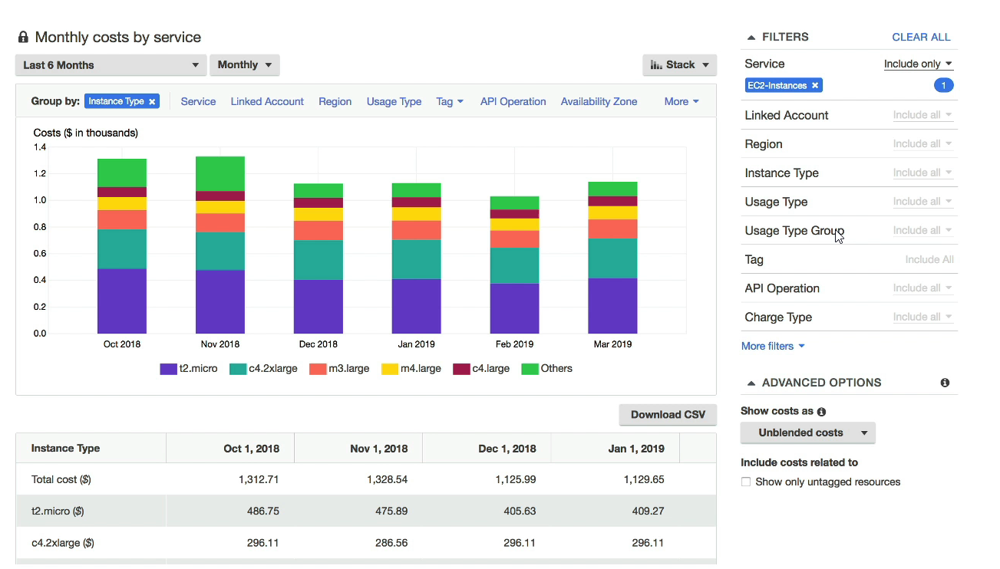

# Billing alarms and AWS budgets

# Billing alarms

* Billing data metric is stored in CloudWatch us-east-1
* Billing data are for overall worldwide AWS costs
* It is for actual costs, not for projected costs
* Intended a simple alarm - not as powerful as AWS Budgets

## AWS budgets

* Create budget and send alarms when costs exceeds the budget
* 3 types of budgets: Usage, Cost, Reservation
* For Reserved Instances (RI)
  * Track utilization
  * Supports EC2, ElastiCache, RDS, Redshift
* Up to 5 SNS notifications per budget
* Can filter by: service, linked account, tag, purchase option, instance type, region, etc...
* Same options as AWS Cost Explorer
* 2 budgets are free, then $0.02/day/budget

# AWS Trusted Advisor

* No need to install anything - high level AWS account assessment
* Analyze your AWS accounts and provides recommendation on **5 categories**
  * Cost optimization
  * Performance
  * Security
  * Fault tolerance
  * Service limits
* Support plan
  * 7 core checks - basic & developer support plan
    * S3 bucket permissions (making sure that a bucket is not public)
    * Security groups - specific ports unrestricted
    * IAM Use (making sure that we have at least one IAM user)
    * MFA on Root Account (making sure that MFA is enabled)
    * EBS - making sure that we do not have public snapshots
    * RDS - making sure that we do not have public snapshots
    * Server Limits
  * Full checks - business & enterprise support plan
    * Full check available on the **5 categories**
    * Ability to set CloudWatch alarms when reaching limits
    * Programmatic Access using AWS Support API
  * **Does not check EC2 instances, for EC2 is used AWS Inspector**

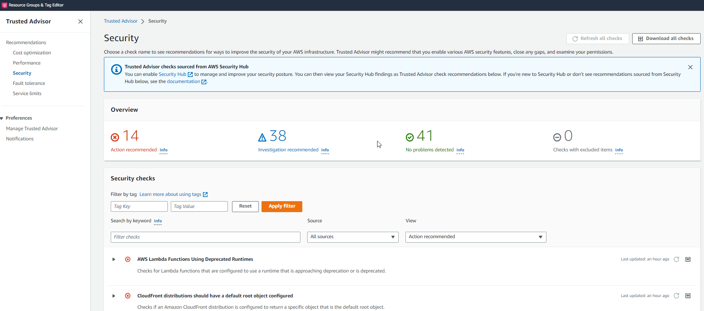

# Support plans

## Basic support plan

* Customer Service & Communications - 24x7 access to customer service, documentation, whitepapers, and support forums
* AWS Trusted Advisor - access to the 7 core trusted advisor checks and guidance to provision your resources following best practices to increase performance and improve security
* AWS Personal Health Dashboard - a personalized view of the health of AWS services and alerts when your resources are impacted

## Developer support plan

* All Basic support plan +
* Business hours email access to Cloud Support Associates
* Unlimited cases / 1 primary contact
* Case severity / response times
  * General guidance: < 24 business hours
  * System impaired: < 12 business hours

## Business support plan (24/7)

* Intended to be used if you have production workloads
* Trusted Advisor - Full set of checks + API access
* 24x7 phone, email, and chat access to Cloud Support Engineers (**but they are not Senior Cloud Engineers**)
* Unlimited cases / unlimited contacts
* Access to Infrastructure Event Management for additional fee.
* Case severity / response time
  * General guidance < 24 business hours
  * System impaired < 12 business hours
  * Production system impaired < 4 hours
  * Production system down < 1 hour

## Enterprise On-Ramp Support plan (24/7)

* Intended to be used if you have production or business critical workloads
* All of Business support plan +
* Access to a pool of Technical Account Managers (TAM)
* Concierge Support Team (for billing and account best practices)
* Infrastructure Even Management, Well-Architected & Operations Reviews
* Case severity / response times
  * The same as before with exception that for business-critical system down < 30 mins 

## Enterprise Support plan (24/7)

* Intended to be used if you have mission critical workloads
* All of Business Support Plan +
* Access to a designated Technical Account Manager (TAM)
* Infrastructure Even Management, Well-Architected & Operations Reviews
* Case severity / response times
  * The same as before with exception that for business-critical system down < 15 mins 

# AWS Pricing/TCO Tools

https://docs.aws.amazon.com/whitepapers/latest/how-aws-pricing-works/aws-pricingtco-tools.html

# Optimizing your cost with Rightsizing Recommendations

https://docs.aws.amazon.com/cost-management/latest/userguide/ce-rightsizing.html