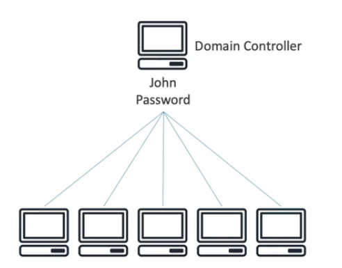

# AWS STS (Security Token Service)

* Enables you to create temporary, limited-privileges credentials to access your AWS resources
* Short-term credentials: you configure expiration period
* Use cases
  * Identity federation: manage user identities in external systems, and provide them with STS tokens to access AWS resources
  * IAM roles for cross/same account access
  * IAM roles for EC2: provide temporary credentials for EC2 instances to access AWS resources

# Cognito

* Identity for web and mobile applications users (potentially millions)
* Instead of creating them an IAM user, you create a user in Cognito

# AWS Directory Service

* What is Microsoft Active Directory (AD)?
  * Found on any Windows Server with AD Domain Services
  * Database of objects: User Accounts, Computers, Printers, File Shares, Security Groups
  * Centralized security management, create account, assign permissions
  

* [AWS Managed Microsoft AD](https://docs.aws.amazon.com/directoryservice/latest/admin-guide/directory_microsoft_ad.html)
  * Create you own AD in AWS, manage users locally, supports MFA
  * Establish "trust" connections with your on-premise AS
  

* [AD Connector](https://docs.aws.amazon.com/directoryservice/latest/admin-guide/directory_ad_connector.html)
  * Directory gateway (proxy) to redirect to on-premises AD, supports MFA
  * Users are managed on the on-premise AD
  

* [Simple AD](https://docs.aws.amazon.com/directoryservice/latest/admin-guide/directory_simple_ad.html)
  * AD-compatible managed directory on AWS
  * Cannot be joined with on-premise AD
  

# Aws IAM Identity Center (successor to AWS SSO)

* One login (SSO) for all your
  * AWS accounts in AWS Organizations
  * Business cloud applications (e.g. Salesforce, Box, Microsoft 365,...)
  * SAML2.0-enabled applications
  * EC2 Windows Instances
* Identity providers
  * Built-in identity store in IAM Identity Center
  * 3rd party: AD, OneLogin, Okta...
  