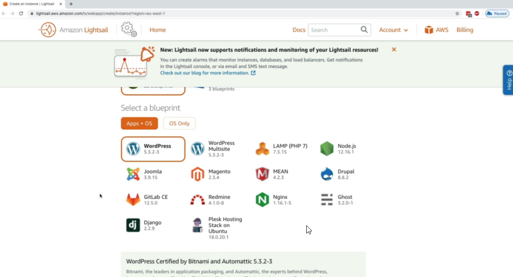

#  Amazon LightSail

* Virtual private server (VPS), storage, databases and networking
* Low & predictable pricing
* Simpler alternative to using EC2, RDS, ELB, EBS, Route 53...
* Great for people with little cloud experience
* Can setup notifications and monitoring of your LightSail resources
* Use cases
  * Simple web applications (has templates for LAMP, Nginx, MEAN, Node.js)
  * Websites (templates for WordPress, Magento, Plesk, Joomla)
  * **Dev/Test environment**
* Has high availability but no auto-scaling, limited integrations
* It includes
  * Virtual Private Server
  * Managed MySQL database

