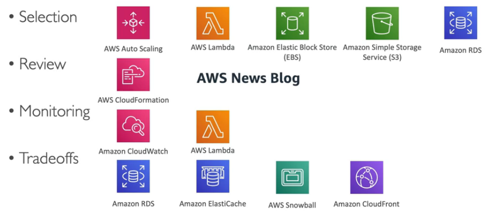

- [General Guiding Principles](#general-guiding-principles)
  - [Six advantages of cloud computing](#six-advantages-of-cloud-computing)
- [Design Principles](#design-principles)
- [Cloud architecture design principles](#cloud-architecture-design-principles)
- [Well architected framework 6 pillars](#well-architected-framework-6-pillars)
  - [1 Operational excellence](#1-operational-excellence)
  - [2 Security](#2-security)
  - [3 Reliability](#3-reliability)
  - [4 Performance efficiency](#4-performance-efficiency)
  - [5 Cost optimization](#5-cost-optimization)
  - [6 Sustainability](#6-sustainability)
- [AWS well-architected tool](#aws-well-architected-tool)
- [Right sizing](#right-sizing)
- [AWS Ecosystem - free resources](#aws-ecosystem---free-resources)
- [AWS Knowledge Center](#aws-knowledge-center)
- [AWS IQ](#aws-iq)
- [AWS re:Post](#aws-repost)
- [AWS Cloud Value Proposition](#aws-cloud-value-proposition)
- [What Is Cloud Economics](#what-is-cloud-economics)
  - [Total Cost of Ownership (TCO)](#total-cost-of-ownership-tco)
  - [Cost reduction operations](#cost-reduction-operations)

# General Guiding Principles

https://aws.amazon.com/getting-started/cloud-essentials/

* Stop guessing your capacity needs (use auto scaling)
* Test systems at production scale
* Automate to make architectural experimentation easier (IaC)
* Allow for evolutionary architectures
  * Design based on changing requirements
* Drive architectures using data
* Improve through game days
  * Simulate applications for flash sale days

## Six advantages of cloud computing

https://docs.aws.amazon.com/whitepapers/latest/aws-overview/six-advantages-of-cloud-computing.html

* Trade upfront expense for variable expense  
  Upfront expenses include data centers, physical servers, and other resources that you would need to invest in before using computing resources. 
  Instead of investing heavily in data centers and servers before you know how you’re going to use them, you can pay only when you consume computing resources

* Benefit from massive economies of scale   
  By using cloud computing, you can achieve a lower variable cost than you can get on your own. 
  Because usage from hundreds of thousands of customers aggregates in the cloud, providers such as AWS can achieve higher economies of scale. Economies of scale translate into **lower pay-as-you-go prices**

* Stop guessing capacity   
  With cloud computing, you don’t have to predict how much infrastructure capacity you will need before deploying an application

* Increase speed and agility   
  The flexibility of cloud computing makes it easier for you to develop and deploy applications. This flexibility also provides your development teams with more time to experiment and innovate.

* Stop spending money running and maintaining data centers    
  Cloud computing in data centers often requires you to spend more money and time managing infrastructure and servers. 
  A benefit of cloud computing is the ability to focus less on these tasks and more on your applications and customers.

* Go global in minutes   
  The AWS Cloud global footprint enables you to quickly deploy applications to customers around the world, while providing them with low latency.

# Design Principles

* Scalability: vertical and horizontal
* Disposable Resources: servers should be disposable & easily configured
* Automation: Serverless, Infrastructure as a Service, Auto Scaling...
* Loos coupling
  * Monolith are applications that do more and more over time, become bigger
  * Break it down into smaller, loosely coupled components
  * A change or a failure in one component should not cascade to other components
* Services, not Server
  * Do not use just EC2
  * Use managed services, databases, serverless, etc!

# Cloud architecture design principles

* Design for failure: understanding what and how components fail, and how to architect around failures to add resiliency
* Decouple components vs monolithic architecture
  * Monolithic architecture
    * If one process of the application experiences a spike in demand the entire architecture must be scaled
    * To update system we have to update always the whole system
* Implement elasticity in the cloud vs. on-premises
* Think parallel: serial and sequential processes similar to monolithic, tightly coupled architectures, are incredibly limited.
  Dependencies can make or break entire processes, any any failure in the chain, means a failure for thw whole job.
  Thinking parallel is similar to decoupling, but you are looking at how you can divide a job, into its simplest form, and then
  distribute that load to multiple components (example is load balancer).

# Well architected framework 6 pillars

## 1 Operational excellence

* Includes the ability to run and monitor systems to deliver business value and to continually improve supporting processes and procedures
* Design principles
  * Perform operations as code - IaC
  * Annotate documentation - automate the creation of annotated docs after every build
  * Make frequent, small, reversible changes - so that in case of any failure, you can reverse it
  * Refine operations procedures frequently - and ensure that team members are familiar with it
  * Anticipate failure
  * Learn from all operational failures

## 2 Security

* Includes the ability to protect information, systems, and assets while delivering business value through risk assessments and mitigation strategies
* Design principles
  * Implement a string identity foundation - centralize privilege management and reduce (or even eliminate) reliance on long-term credentials - principle of least privilege - IAM
  * Enable traceability - integrated logs and metrics with systems to automatically respond and take action
  * Apply security at all layers - like edge network, VPC, subnet, load balancer, every instance, operating system, and application
  * Auto security best practices
  * Protect data in transit and at rest - encryption, tokenization, and access control
  * Keep people away from data - reduce or eliminate the need for direct access or manual processing of data
  * Prepare for security events - run incident response simulations and use tools with automation to increase your speed for detection, investigation, and recover

## 3 Reliability

* Ability of a system to recover from infra. or service disruptions, dynamically acquire computing resources to meed demand, and mitigate disruptions such as misconfigurations or transient network issues
* Design Principles
  * Test recovery procedures - use automation to simulate different failures or to recreate scenarios that led to failures before
  * Automatically recover from failure - anticipate and remediate failures before they occur
  * Scale horizontally to increase aggregate system availability - distribute requests across multiple, smaller resources to ensure that they do not share a common point of failure
  * Stop guessing capacity - maintain the optimal level to satisfy demand without over or under provisioning - use auto scaling
  * Manage change in automation - use automation to make changes to infrastructure

## 4 Performance efficiency

* Includes the ability to use computing resources efficiently to meet system requirements, and to maintain that efficiency as demand changes and technologies evolve
* Design Principles
  * **Democratize advanced technologies - advanced technologies become services and hence you can focus on product development**
  * Go global in minutes - easy deployment in multiple regions
  * User serverless architectures - avoid burden of managing servers
  * Experiment more often - easy to carry out comparative testing
  * Mechanical sympathy - be aware of all AWS services
  

## 5 Cost optimization

* Includes the ability to run systems to deliver business value at the lowest price point
* Design principles
  * Adopt a consumption mode - pay only for what you use
  * Measure overall efficiency - use CloudWatch
  * Stop spending money on data center operations - AWS does the infra. part and enables customer to focus on organization projects
  * Analyze and attribute expenditure - accurate identification of system usage and costs, helps measure return on investment (ROI) - make sure to use tags
  * **Use managed and application level services to reduce costs of ownership** - as managed service operate at cloud scale, they can offer a lower cost per transaction or service

## 6 Sustainability

* The sustainability pillar focuses in minimizing the environmental impacts of running cloud workloads
* Design principles
  * Understand your impact - establish performance indicators, evaluate improvements
  * Establish sustainability goals - set long term goals for each workload, model return on investment (ROI)
  * Maximize utilization - right size each workload to maximize the energy efficiency of the underlying hardware and minimize idle resources
  * Anticipate and adopt new, more efficient hardware and software offerings - and design for flexibility to adopt new technologies over time
  * Use managed services - shared services reduce the amount of infrastructure; managed services help automate sustainability best practices as moving infrequent accessed data to cold storage and adjusting compute capacity
  * Reduce the downstream impact of your cloud workloads - reduce the amount of energy or resources required to use your services and reduce the need for your customers to upgrade their devices
  * Sustainability AWS Services

# AWS well-architected tool

Free tool to review your architectures against the 6 pillars well-architected framework and adopt architectural best practices

# Right sizing

* EC2 has many instance types, but choosing the most powerful instance type is not the best choice, because the cloud is **elastic**
* Right sizing is the process of matching instance types and sizes to your workload performance and capacity requirements **at the lowest possible cost**
* Scaling up is easy so always start small
* It is also the process of looking at deployed instances and identifying opportunities to eliminate or downsize without compromising capacity or other requirements, which results in lower costs
* It is important to right size especially in 2 moments
  * before a cloud migration
  * continuously after the cloud onboarding process (requirements change over time)
* Tools which can help: CloudWatch, Cost Explorer, Trusted Advisor, 3rd party tools can help also

# AWS Ecosystem - free resources

* AWS blogs: https://aws.amazon.com/blogs/aws
* AWS forum: https://repost.aws/
* AWS Whitepapers & guides: https://aws.amazon.com/whitepapers
* AWS Quick Starts: https://aws.amazon.com/quickstart
* AWS Solutions: https://aws.amazon.com/solutions/
* AWS Marketplace
  * Digital catalog with thousands of software listings from independent software vendors
  * Examples: Custom AMIs, CloudFormation templates, Software as Service, Containers
  * If you buy through the AWS Marketplace, it goes into your AWS bill
  * You can sell your own solutions on the AWS Marketplace

* AWS Training
  * AWS Digital (online) and Classroom Training (in-person or virtual)
  * AWS Private Training (for your organization)
  * Training and Certification for the U.S Government
  * Training and Certification for the Enterprise
  * AWS Academy: helps universities teach AWS

* AWS Professional Services & Partner Network
  * **The AWS Partner Network (APN) is the global partner program for technology and consulting businesses who leverage Amazon Web Services (AWS) to build solutions and services for customers. The APN helps companies build, market, and sell their AWS offerings by providing valuable business, technical, and marketing support**
  * The AWS Professional Services is a global team of experts
  * They work alongside your team and a chosen member of the APN (AWS Partner Network)
  * APN Technology Partners: providing hardware, connectivity, and software
  * APN Consulting Partners: professional services firm to help build on AWS
  * APN Training Partner: find who can help you learn AWS
  * AWS Competency Program: AWS Competencies are granted to APN Partners who have demonstrated technical proficiency and proven customer success in specialized areas.
  * AWS Navigate Program: help Partners become bette Partners

# AWS Knowledge Center

https://aws.amazon.com/premiumsupport/knowledge-center/

# AWS IQ

* Quickly find professional help for your AWS projects
* Engage and pay AWS Certified 3rd party experts for on-demand project work
* Video-conferencing, contract mgmt, secure collaboration, integrated billing
* For customers

* For experts

# AWS re:Post

It replaces AWS forum.

https://repost.aws/

* Part of the AWS free tier
* Community members can earn reputation points to build up their community expert status bby providing accepted answers
* Questions from AWS Premium Support customers that do not receive a response from the community are passed on to AWS Support Engineers
* It is not intended to be used for questions that are time-sensitive or involve any proprietary information

# AWS Cloud Value Proposition

The AWS Cloud Value Proposition has five principles. Keep in mind that these are **different from the Well-Architectured Framework**

* Security: AWS offers multiple Security and Compliance services for various applications. Apart from the Shared Responsibility Model, there are options for configuring extra security measures.

* Agility: Applications can be developed and deployed globally **across multiple geo-locations within minutes**. **The speed of experimentation**, development and deployment is exponentially higher compared to applications developed on-premises.

* Flexibility: AWS offers **multiple services** for various applications. There are over 200 products that support services to run all kinds of workloads.

* Elasticity: Applications **can scale the resources required for smooth operability** based on the demand — the application capacity is sufficient to deal with the incoming requests while paying for only what they use. Elasticity is the ability to acquire resources as you need them and release resources when you no longer need them.

* Cost: AWS makes it easy to scale up and down based on demand and removes the need for an on-premise data centre to reduce costs. By using the pay as you go model, costs incurred can be monitored and reduced.

# What Is Cloud Economics

The term cloud economics refers to studying and analyzing the costs and benefits of cloud computing from a business perspective. For example, cloud economics explores the return on investment (ROI) of switching cloud providers or the total cost of ownership (TCO) of one cloud solution versus another.

## Total Cost of Ownership (TCO)

Comparative total cost of ownership analysis (acquisition and operating costs) for running an infrastructure environment end-to-end on-premises or in a co-location facility versus AWS. TCO analysis is used by our customers in comparing the costs of running an entire infrastructure environment or specific workload on premises or in a co-location facility versus on AWS and in
paralleling an existing AWS workload with an on premises or co-location setup.

* Operational expenses (opex) - day-to-day expenses, no long-term investment
* Capital expenses (capex) - long-term investment, for example: purchasing a building, servers, printers.
* Labor costs associated with on-premises operations - for example network configuration technicians
* Impact of software licensing costs

## Cost reduction operations

* Right-sizing infrastructure
* Automation
* Reduce compliance scope
* Managed Services