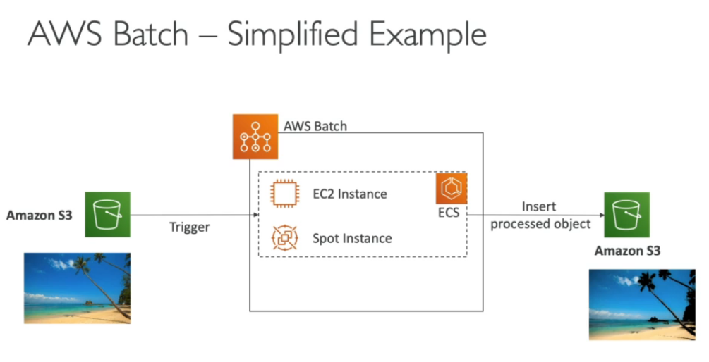

# AWS Batch

* Fully managed batch processing at any scale
* Efficiently run 100,000s of computing batch jobs on AWS
* A "batch" job is job with a start and end (opposed to continuous)
* Batch will dynamically launch EC2 instances of Spot instances
* AWS Batch provisions the right amount of compute/memory
* You submit or schedule batch jobs and AWS Batch does the rest
* **Batch jobs are defined as docker images and run on ECS**
* Helpful for cost optimizations and focusing less on the infrastructure
* AWS Batch is cheaper than running jobs on AWS Fargate

# AWS Batch vs Lambda

* Lambda
  * Time limit
  * Limited runtimes
  * Limited temporary disk space
  * Serverless

* Batch
  * No time limit
  * Any runtime as long as it is packed as a docker image
  * Rely on EBS / instance store for disk space
  * Relies on EC2 (can be managed by AWS)