- [Introduction](#introduction)
- [Information about your stack](#information-about-your-stack)
  - [Stack info](#stack-info)
  - [Resources](#resources)
  - [Events](#events)
  - [Other information](#other-information)
  - [How can I obtain information about my stack using the AWS CLI?](#how-can-i-obtain-information-about-my-stack-using-the-aws-cli)
- [Troubleshooting Stack Actions](#troubleshooting-stack-actions)
  - [What can I do if my template doesn't pass validation?](#what-can-i-do-if-my-template-doesnt-pass-validation)
  - [1 - Can you find and fix the error?](#1---can-you-find-and-fix-the-error)
  - [What can I do if my stack won't create as expected?](#what-can-i-do-if-my-stack-wont-create-as-expected)
  - [2 - Can you find and fix the error?](#2---can-you-find-and-fix-the-error)
  - [What can I do if my stacks won't delete?](#what-can-i-do-if-my-stacks-wont-delete)
  - [3 - Can you find and fix the error?](#3---can-you-find-and-fix-the-error)
  - [What can I do if my stacks won't update?](#what-can-i-do-if-my-stacks-wont-update)
  - [What information should I gather before asking for help?](#what-information-should-i-gather-before-asking-for-help)
  - [What does a good support ticket look like?](#what-does-a-good-support-ticket-look-like)

# Introduction

It is declarative way of outlining your AWS Infra, for any resources (most of them are supported).
CloudFormation creates those for you, in the right order, with the exact configuration that you specify.

* Infrastructure as code
* Cost
  * Each resources withing the stack is tagged with an identifier so you can easily see how much a stack costs you
  * You can estimate the costs of your resources using the CloudFromation template
  * Saving strategy, for example: In Dev, you could automation deletion of templates at 5 PM and recreated at 8 AM, safely
* Productivity
  * Ability to destroy and re-create as infra on the cloud on the fly
  * Automated generation of Diagram for your templates
  * Declarative programming (no need to figure out ordering and orchestration)
* Don`t re-invent the wheel
  * Leverage existing templates in the web
  * Leverage the documentation
* Supports (almost) all AWS resources
  * You can use "custom resources" for resources that are not supported

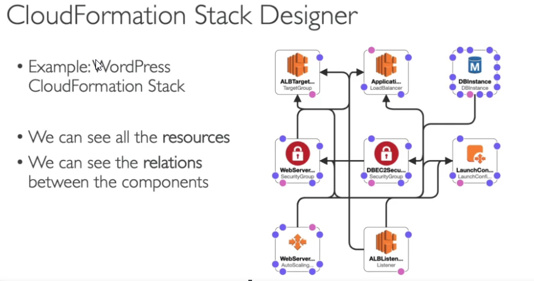

# Information about your stack

If CloudFormation fails to create, update, or delete your stack, you can view error messages or logs to help you learn more about the issue. The following screenshots describe the types of information available for troubleshooting a CloudFormation issue.

## Stack info

The Stack info tab shows basic information about each stack: stack ID, status, description, and when it was last created, deleted, or updated.

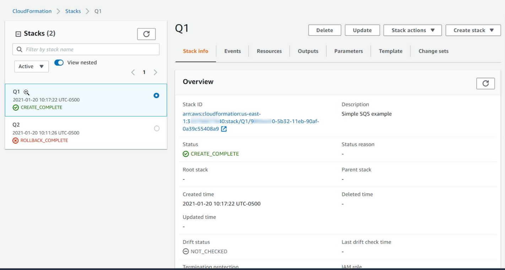

## Resources

The Resources tab shows information about all the resources grouped by this stack. You can view many of the resources through links to the AWS Management Console.

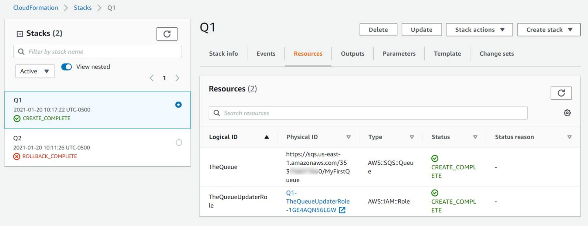

## Events

The Events tab shows all the events that have been generated for the stack, with their timestamp. This is very useful when trying to figure out what exactly is happening if something goes wrong.

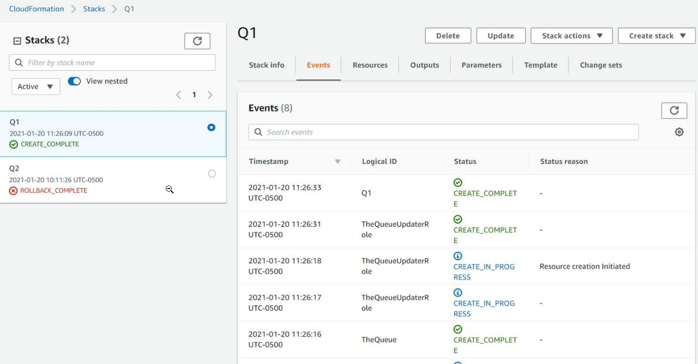

## Other information

The AWS CloudFormation console will also show you other information about your stack. This includes stack outputs, the template that was used and its parameters, and any change sets.

## How can I obtain information about my stack using the AWS CLI?

The AWS CLI can show you all the stack information. The following commands are useful, and take a stack name as argument (--stack-name "...").

* `aws cloudformation describe-stacks`

  This AWS CLI command shows the basic information about the stack, similar to the Stack info tab in the AWS Management Console. For more information, check the [documentation](https://docs.aws.amazon.com/cli/latest/reference/cloudformation/describe-stacks.html).

  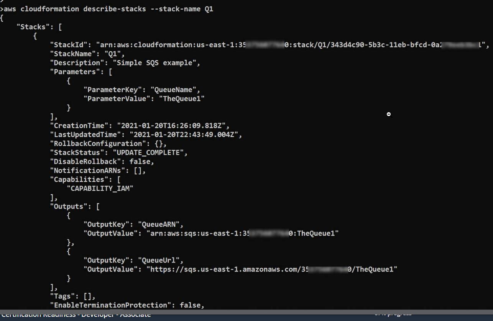

* `aws cloudformation describe-stack resources`

  This command shows information about the resources belonging to a stack, similar to the Resources tab in the AWS Management Console. For more information, check the [documentation](https://docs.aws.amazon.com/cli/latest/reference/cloudformation/describe-stack-resources.html).   

  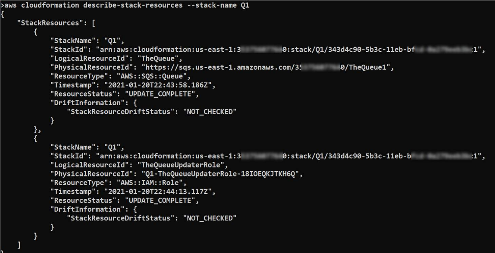

* `aws cloudformation describe-stack-events`

  This command shows information about all the events generated for a stack, in reverse chronological order, similar to the Events tab in the AWS Management Console. For more information, check the [documentation](https://docs.aws.amazon.com/cli/latest/reference/cloudformation/describe-stack-events.html).

  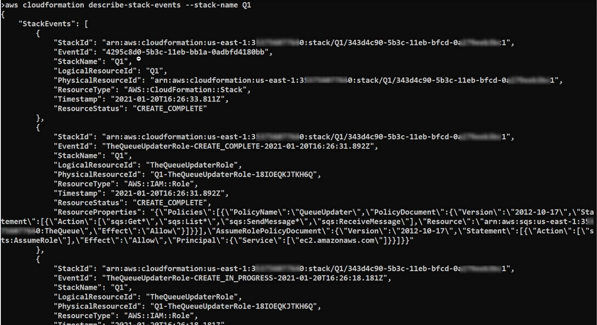

# Troubleshooting Stack Actions

* Your template does not pass validation: there is likely a syntax problem with your template, a typo, or you may be missing some information needed to create your resources.
  
* Your stacks are not creating as expected: The template is valid, but there is a problem creating one or more resources:

* Your stacks are not deleting as expected: AWS will not delete some resources (usually those containing data, like S3 buckets) unless they are empty. There may also be a permission or other issues that prevent you from deleting some resources.
  
* Your stacks are not updated as expected: this issue shares root causes in common with previous not creating and not deleting issues. Some resource updates require the resource to be destroyed and a new one created.

## What can I do if my template doesn't pass validation?

Both JSON and YAML are text-based formats, so it is easy to make a syntax error such as missing a comma or question mark. CloudFormation also adds a few extra operations, such as !Ref and !Sub, that have their own syntax and validation. As a result, you may end up with a template that looks fine but is not a valid CloudFormation template.

If your template doesn't pass validation, try the following troubleshooting tips:

* Use a JSON/YAML linter to ensure that the template is valid JSON or YAML. The [AWS CloudFormation Linter](https://github.com/aws-cloudformation/cfn-lint) includes checking valid values for resource properties and best practices. Both the AWS Management Console and the AWS CLI will usually provide you with information about the line and column where they detected the error. A specific linter or pretty printer for JSON or YAML might also help you see the error, and your text editor or integrated development environment (IDE) may contain one. You can also use the [aws cloudformation validate-template](https://docs.aws.amazon.com/cli/latest/reference/cloudformation/validate-template.html) command from the AWS CLI. This [AWS Knowledge Center article](https://repost.aws/knowledge-center/cloudformation-template-validation) describes how to resolve template validation or template format errors in more detail.

* Compare the template against the CloudFormation template anatomy to ensure that all keys are defined at the correct hierarchy. Check the [Template anatomy documentation](https://docs.aws.amazon.com/AWSCloudFormation/latest/UserGuide/template-anatomy.html). For example, missing an indentation level on a resource or output will produce valid YAML but not a valid CloudFormation template.

* Compare resources to the CloudFormation resource definitions to ensure that all required properties have been specified. The [Template reference](https://docs.aws.amazon.com/AWSCloudFormation/latest/UserGuide/template-reference.html) documents all the elements and resources with their properties.

* Check the property values against the CloudFormation resource definitions to ensure that they are the right data type, such as string, list, or JSON. The [Template reference](https://docs.aws.amazon.com/AWSCloudFormation/latest/UserGuide/template-reference.html) documents all the elements and resources with their properties and data types.

## 1 - Can you find and fix the error?

The following template has a syntax error.

```yaml
---
AWSTemplateFormatVersion: "2010-09-09"
Description: "Simple SQS example"
Resources:
TheQueue:
  Type: AWS::SQS::Queue
  Properties:
    QueueName: MyFirstQueue

```

* Hint
 
  Any resource defined, such as TheQueue in this example, should be a child of the Resources node. Is it in this case ? How do you put a node inside another node in YAML? 

* Solution

  The solution is to make TheQueue (and all its children) be a child of Resources, so you need to add one level of indentation to lines 5-8.

  ```yaml
  ---
  AWSTemplateFormatVersion: "2010-09-09"
  Description: "Simple SQS example"
  Resources:
    TheQueue:
      Type: AWS::SQS::Queue
      Properties:
        QueueName: MyFirstQueue

  ```

## What can I do if my stack won't create as expected?

If your template passes validation but your stack won't create as expected, it will still be listed in the console (or AWS CLI). From there, you can view information about which events were created for your stack and their status. You will get detailed information about which resources were not created and what the errors were.

* Verify events

  Check the Events tab for your stack in the AWS Management Console to see which resources failed to create and the reason for failure.
  For resources that fail to create, the Status reason field will provide more detailed information.

  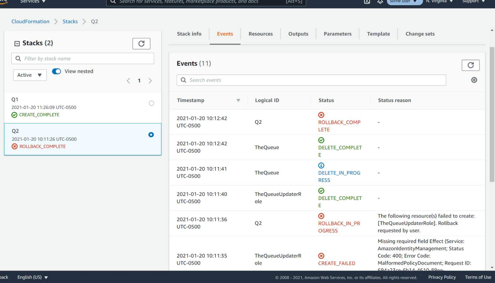

* Check the template

  Go through the stack template, located in the Template tab in the AWS Management Console. See if the resource(s) have been defined correctly.

  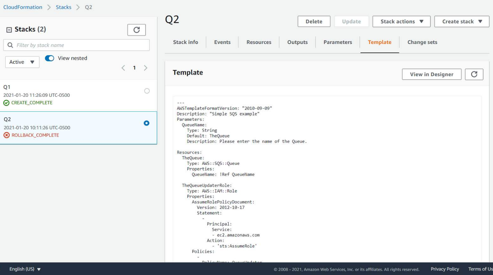

* Examine resources in the console
 
  Use the AWS Management Console or AWS CLI to verify that the resource exists. Your template may be trying to create a resource with the same name as one that already exists.

  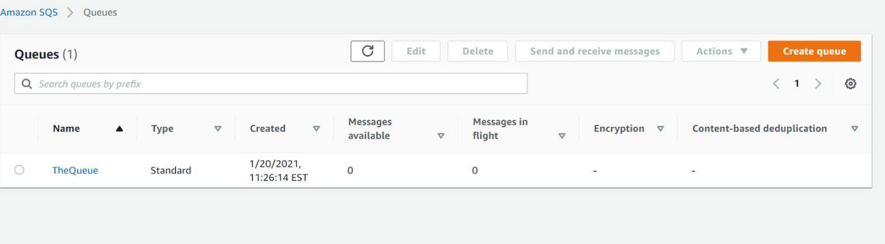

* Try manual creation

  Try creating the resource with the same configuration outside of CloudFormation. Use the AWS Management Console, AWS CLI, or AWS SDK.
  Be aware that the AWS Management Console sometimes automatically creates dependent resources. An example might be AWS Identity and Access Management (IAM) roles, which you would need to include in your CloudFormation template.

## 2 - Can you find and fix the error?

The following AWS CloudFormation template will pass validation, but the stack won't be created. Can you find and fix the error? 

```yaml
---
AWSTemplateFormatVersion: "2010-09-09"
Description: "Simple SQS example"
Parameters:
  QueueName:
    Type: String
    Default: TheQueue2
    Description: Please enter the name of the Queue.

Resources:
  TheQueue:
    Type: AWS::SQS::Queue
    Properties:
      QueueName: !Ref QueueName

  TheQueueUpdaterRole:
    Type: AWS::IAM::Role
    Properties:
      AssumeRolePolicyDocument:
        Version: 2012-10-17
        Statement:
          - 
            Principal:
              Service:
              - ec2.amazonaws.com
            Action:
              - 'sts:AssumeRole'      
      Policies:
        -
          PolicyName: QueueUpdater
          PolicyDocument:
            Version: 2012-10-17
            Statement:
              - 
                Effect: Allow
                Action: 
                  - sqs:Get*
                  - sqs:List*
                  - sqs:SendMessage*
                  - sqs:ReceiveMessage
                Resource: !GetAtt TheQueue.Arn
Outputs:
  QueueUrl:
    Value: !Ref TheQueue
  QueueARN:
    Value: !GetAtt  TheQueue.Arn

```

* Hint

  The detailed error states: Missing required field Effect.
 
  The statement of the AssumeRolePolicyDocument (around line 20) is missing a property, Effect. All IAM policies share elements, so you can see an example around line 34. Add the missing property (Effect).

* Solution

  The solution is to add the line:
    `Effect: Allow`
  (with the right indentation) to Line 23.  

## What can I do if my stacks won't delete?

Sometimes, AWS will not let you delete a resource if it contains data or if other resources depend on it. If you delete a stack that contains one of those resources, the stack will not be completely deleted. The stack will be in the `DELETE_FAILED` state.

After identifying the resource that is not deleting and the reason it won't delete, you have a few options. You can try to fix it, manually delete the resource, or delete the stack while retaining the problematic resource.

* View stack resources
  Determine the resource(s) that CloudFormation was unable to delete by viewing the Resources tab for the stack in the AWS Management Console. This will help you to identify the specific resources that experienced issues.

  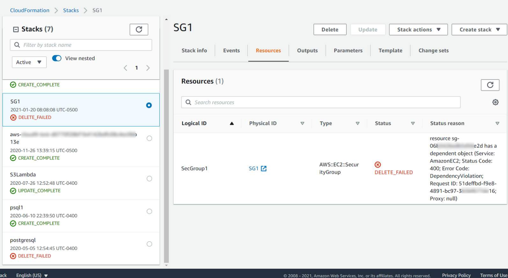

* View stack events
  In the AWS Management Console, open the Events tab for the stack.   
  This will tell you the sequence of events that led to the delete failure. Usually you will find detailed error information, which can help you debug your issues.

  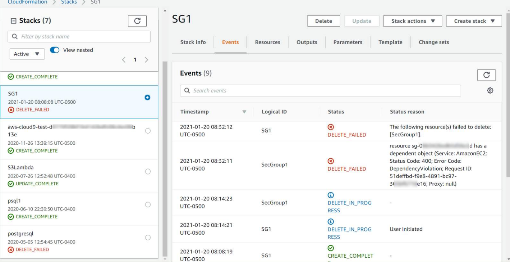

* Examine the resource
  Check if the resource exists, using the AWS Management Console or AWS CLI. See if there is anything special about the resource.

  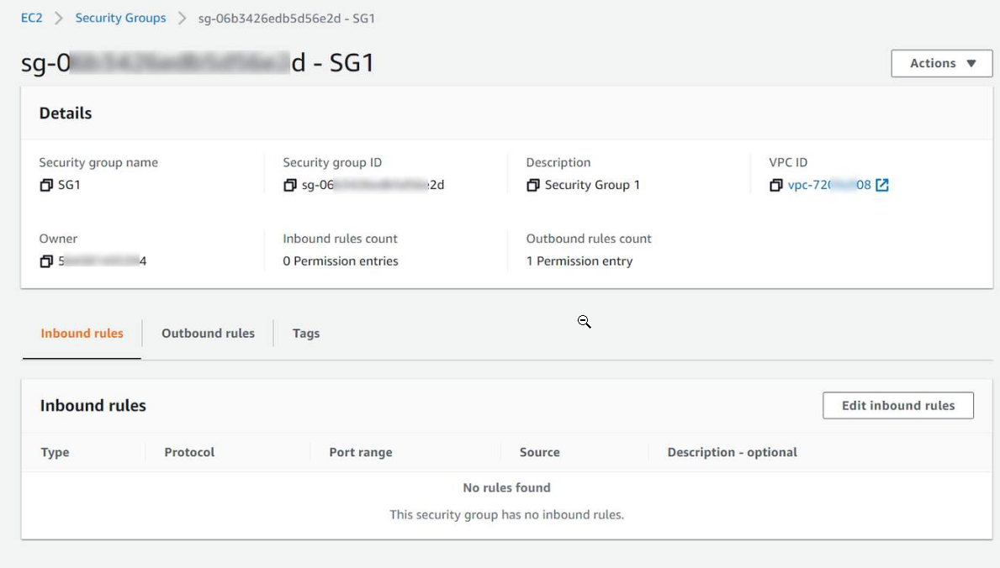

* Try manual delete
  To see if you are getting the same error, try deleting the resource manually from the AWS Management Console.
  The console often provides helpful messages and additional checks.

  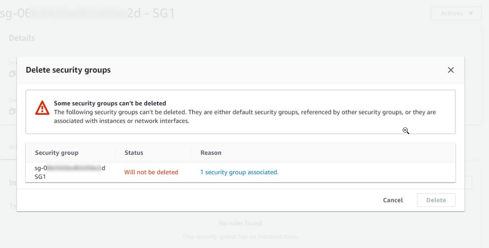

## 3 - Can you find and fix the error?

A security group acts as a virtual firewall for your Amazon Elastic Compute Cloud (Amazon EC2) instances to control incoming and outgoing traffic. In this challenge, you will define two stacks, each of them defining a security group.   
After you have created both stacks, try to delete the first stack, SG1. Can you find and fix the problem? 

* SecGroup1.yaml

  ```yaml
  ---
  AWSTemplateFormatVersion: "2010-09-09"
  Description: "Security group example"
  Resources:
  SecGroup1:
    Type: AWS::EC2::SecurityGroup
    Properties: 
      GroupDescription: Security Group 1
      GroupName: SG1
  ```

* SecGroup2.yaml

  ```yaml
  ---
  AWSTemplateFormatVersion: "2010-09-09"
  Description: "Security group example"
  Resources:
    SecGroup1:
      Type: AWS::EC2::SecurityGroup
      Properties: 
        GroupDescription: Security Group 2
        GroupName: SG2
        SecurityGroupIngress:
          -
            Description: SSH from SG1
            FromPort: 22
            ToPort: 22
            IpProtocol: tcp
            SourceSecurityGroupName: SG1
  ```

* Hint

  The problem is that the security group in the SG2 stack has a dependency on the security group created in stack SG1. You can try modifying the second security group or deleting the second stack first.

* Solution

  Delete the second stack, SG2, and you should now be able to delete the first stack, SG1.

## What can I do if my stacks won't update?

* View the `Events` tab to see the sequence of events and the resources that were being updated. The resource that failed to update should have `UPDATE_FAILED` marked next to it and also the reason for the failure.

* Choose the `Properties` section to view the configuration properties that were being applied to the resource. Determine if the change being applied is valid. This can be done using the documentation for the resource and reviewing the property types.

## What information should I gather before asking for help?

* Your account number
* The Region in which you were operating
* Your stack's Amazon Resource Name, or ARN (and the ARN of any stack set or change set, if applicable)
* The CloudFormation template you were using
* Any error messages produced, including output captured (if using AWS CLI tools) or console screenshots (if using the AWS Management Console) and logs produced by any tools
* Context about the issue: Additional details, such as what kind of resources you are launching or whether you are using an AWS solution, to help the engineer quickly test the solution, troubleshoot, and determine possible causes
* Any attempted troubleshooting steps already taken and their results

## What does a good support ticket look like?

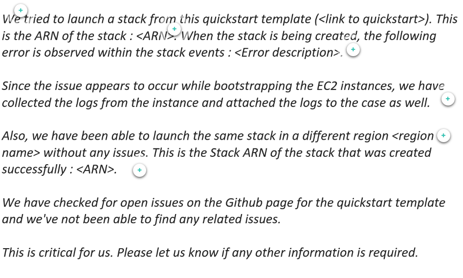