- [AWS CloudFront basics](#aws-cloudfront-basics)
- [CloudFront origins](#cloudfront-origins)
- [CloudFront architecture at a high level](#cloudfront-architecture-at-a-high-level)
- [S3 as origin](#s3-as-origin)
  - [CloudFront vs S3 Cross Region Replication](#cloudfront-vs-s3-cross-region-replication)
- [HTTP headers used in CloudFront](#http-headers-used-in-cloudfront)
  - [x-cache](#x-cache)
  - [x-amz-cf-id](#x-amz-cf-id)
  - [x-amz-cf-pop](#x-amz-cf-pop)
  - [server](#server)
- [Logs](#logs)
  - [Standard Logs (Access Logs)](#standard-logs-access-logs)
  - [Real-Time Logs](#real-time-logs)
- [Http error codes](#http-error-codes)
  - [Http error 403](#http-error-403)
  - [Troubleshooting HTTP 502 – Bad Gateway](#troubleshooting-http-502--bad-gateway)
    - [Troubleshooting with OpenSSL](#troubleshooting-with-openssl)

# AWS CloudFront basics

* Content Delivery Network (CDN)
* Improves read performance, content is cached at the edge location(s)
* Improves user experience
* 216 Point of Presence globally (edge locations)
* DDOoS protection (because worldwide)
* Integration with Shield, AWS Web Application Firewall


# CloudFront origins

* S3 bucket
  * For distributing files and caching them at the edge
  * Enhanced security with CloudFront Origin Access Control (OAC)
    * OAC is replacing Origin Access Identity (OAI)
  * **CloudFront can be used as an ingress (to upload files to S3)**
    * Is it about "S3 Transfer Acceleration" ? TBD
* Custom Origin (HTTP)
  * ALB
  * EC2 instance
  * S3 website
  * Any HTTP backend you want

# CloudFront architecture at a high level 

>NOTE: a client has to use DNS name created by the CloudFront

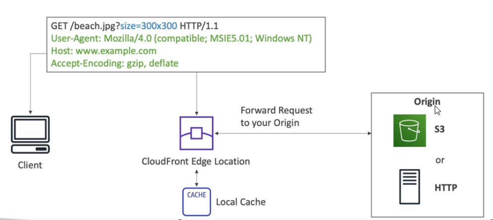


# S3 as origin

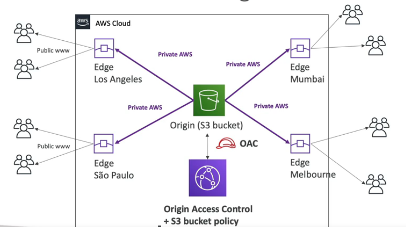

## CloudFront vs S3 Cross Region Replication

* CloudFront
  * Global Edge network
  * Files are cached for a TTL (~day?)
  * Great for static content that must be available everywhere

* S3 Cross Region Replication
  * Must be setup for each region you want replication to happen
  * Files are updated in near real-time
  * Read only
  * Great for dynamic content that needs to be available at low-latency in few regions

# HTTP headers used in CloudFront

## x-cache

This header tells us if the response was served from the CloudFront cache (cache hit) or if a request had to be made to the origin to fetch the content (cache miss).

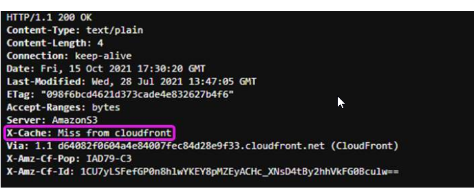

Possible values:

* **Hit from CloudFront** – The response was served from the CloudFront cache.
* **Miss from CloudFront** – The request could not be satisfied by an object in the cache, so the server forwarded the request to the origin and returned the result to the viewer.
* **RefreshHit from CloudFront** – The CloudFront server found the object in the cache but the object had expired, so the server contacted the origin to verify that the cache had the latest version of the object.
* **Redirect from CloudFront** – The server redirected the viewer from HTTP to HTTPS according to the distribution settings.
* **Error from CloudFront** – Typically this means the request resulted in either a client error (if the HTTP status code is in the 4XX range) or a server error (if the HTTP status code is in the 5XX range).

## x-amz-cf-id

This response header is an opaque string that uniquely identifies a request. The header is alternatively referred to as the CloudFront Request ID. It is important if you need to later identify a request in your CloudFront access logs or open a support case with AWS Premium Support. CloudFront also sends this header in requests made to your origin.

For troubleshooting issues with a custom origin, you should consider logging these headers at the origin if you are not already doing so.

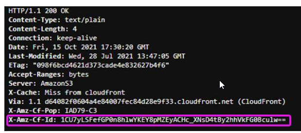

## x-amz-cf-pop

This is the edge location that served the request. Each edge location is identified by a three-letter code and an arbitrarily assigned number, such as DFW3.

The three-letter code typically corresponds with the International Air Transport Association (IATA) airport code for an airport near the edge location’s geographic location.

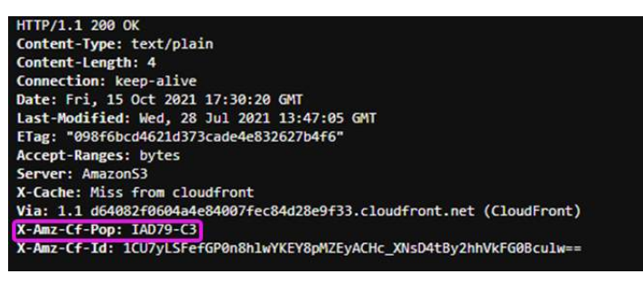

## server

When diagnosing HTTP errors, this header can be helpful to determine if the error was returned by your origin, or the request generated an error in CloudFront while connecting to your origin.

* If the request generates an error and the server header in the response contains the same value returned by your origin (for example, Amazon S3 returns server: AmazonS3), then CloudFront was able to connect and receive a response from the origin. Errors returned by the origin can be caused by events like increased load, invalid requests from the client, or distribution and origin misconfigurations.

* If the request generates an error and the server value response is `CloudFront`, then the error was generated by CloudFront without an HTTP response from the origin. Errors generated by CloudFront can be due to malformed HTTP requests, issues connecting to the origin, or distribution and origin misconfigurations.

* If the origin does not return a server header at all, CloudFront sets the value of the server header to CloudFront in its response by default.

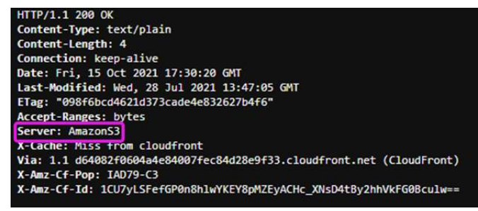

# Logs

CloudFront provides two ways for users to collect logs for distributions. Learn more from the following table.

## Standard Logs (Access Logs)

* CloudFront standard logs provide detailed records about every request that is made to a distribution. The logs are useful for many scenarios, such as security and access audits.

* CloudFront standard logs are delivered to the Amazon Simple Storage Service (Amazon S3) bucket of your choice.

* CloudFront doesn't charge for standard logs, although you incur Amazon S3 charges for storing and accessing the log files.

## Real-Time Logs

* CloudFront real-time logs deliver information about requests made to a distribution to an Amazon Kinesis data stream in seconds after receiving requests.

* You can choose the sampling rate for your real-time logs—that is, the percentage of requests for which you want to receive real-time log records. You can also choose the specific fields that you want to receive in the log records.

* CloudFront charges for real-time logs, in addition to the charges you incur for using Kinesis Data Streams.

# Http error codes

## Http error 403

When investigating HTTP 403 errors, it is critical to discern if the error is related to a **distribution issue**, an Amazon Simple Storage Service **(Amazon S3) bucket issue**, or a **signed URLs/cookies configuration** issue.

If a web request successfully reaches your distribution but generates an HTTP 403 error, end viewers may see a response similar to the following screenshots.

* If the error was generated by your CloudFront distribution, the error will explicitly say **Generated by CloudFront** towards the bottom and include a CloudFront Request ID.  Include this request ID in any cases raised with AWS Premium Support.

* If the error was generated by Amazon S3, it **will return an XML error** response showing **Access Denied** and include an **S3 request ID** as well as a Host ID. This means the web request was successfully received by your distribution but received an error when retrieving the requested object from Amazon S3.

* If the error was produced as a result of a signing error, CloudFront will generate an **XML error response** with no request IDs present.

Sample of errors:

* Request blocked (AWS WAF)

  The request was blocked due to an AWS WAF ACL. If the error was caused by a distribution issue at the CloudFront level, you will see an error similar to the following. Review the settings for the ACL associated with this distribution.
  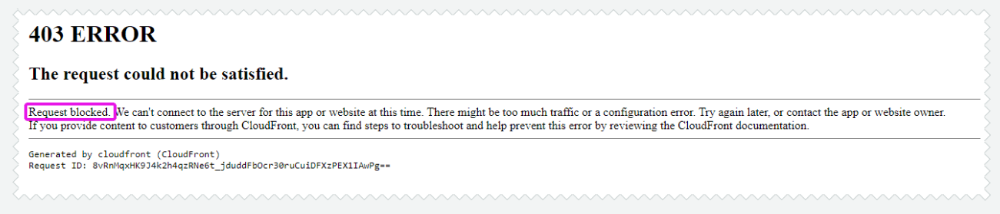

* Request blocked (geo-restrictions)

  The request was blocked due to restrictions on the country that the requesting IP is from. If this is being reported by a user in a permitted geographic area, ask if they are using a virtual private network (VPN). Review the geographic restrictions that are configured for your distribution.
  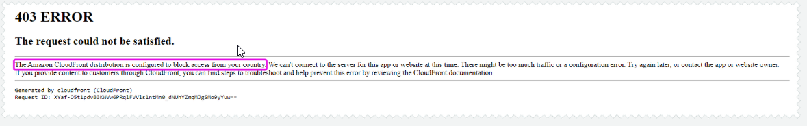

* HTTP method not allowed

  By default, CloudFront distributions only allow cachable HTTP requests (GET, HEAD). If a request is made using an HTTP method that is not supported by the distribution, this error response will be presented. To allow additional HTTP methods, modify the behavior configured for this distribution.
  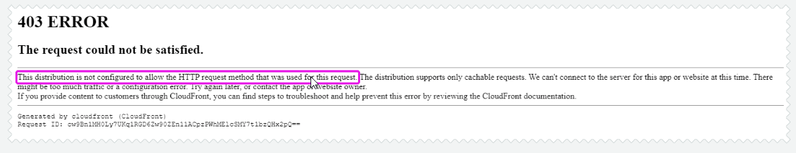

* Bad request

  Several causes might prompt this response.
  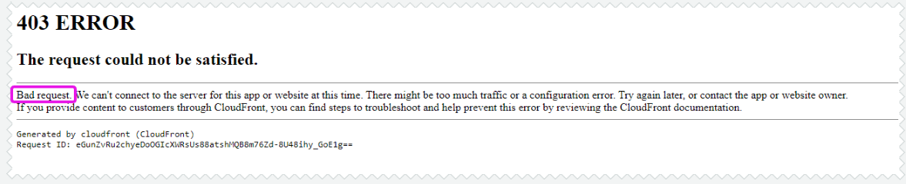

  * **Incorrect domain name used in request**: To successfully make requests to your distribution using a custom domain name, that name must be configured as an Alternate Domain Name in the General settings for your distribution.
  * **Request not made through HTTPS**: Review the Viewer protocol policy in the behavior configured for this distribution, as well as the request, to determine whether HTTPS was used.
  * **Request is malformed**: Review the request itself to ensure that it is properly constructed. For example, including a Content-Length header in a GET request is prohibited. If you are unsure, you can open a case that includes the request and response headers with AWS Premium Support.

* Troubleshooting HTTP Forbidden – S3 origin

  If the error shown is Access Denied and includes an S3 request ID, it means that the web request was successfully received by your distribution. However, it received an error when retrieving the requested object from Amazon S3.
  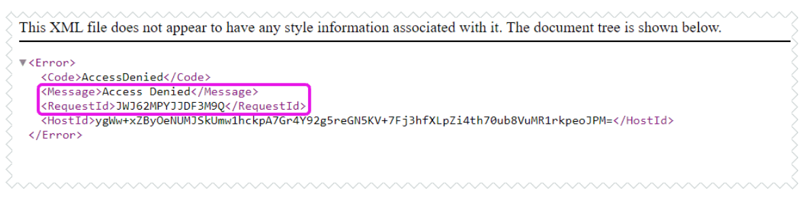
  Web requests to Amazon S3 must be properly authenticated and authorized, or they will be met with an Access Denied response. This will result in HTTP 403 errors from CloudFront. If the error was generated by Amazon S3, the server value in the response header should read AmazonS3.

  What causes HTTP 403 errors when using Amazon S3 as an origin?

  * **Bucket policy written incorrectly**
    If you are not using a public S3 bucket, you must grant read access to an origin access identity (OAI) through a statement in the origin bucket's bucket policy so that your distribution can retrieve objects.

    If you configure CloudFront to accept and forward all of the HTTP methods that CloudFront supports, be sure to give your CloudFront OAI the desired permissions.

    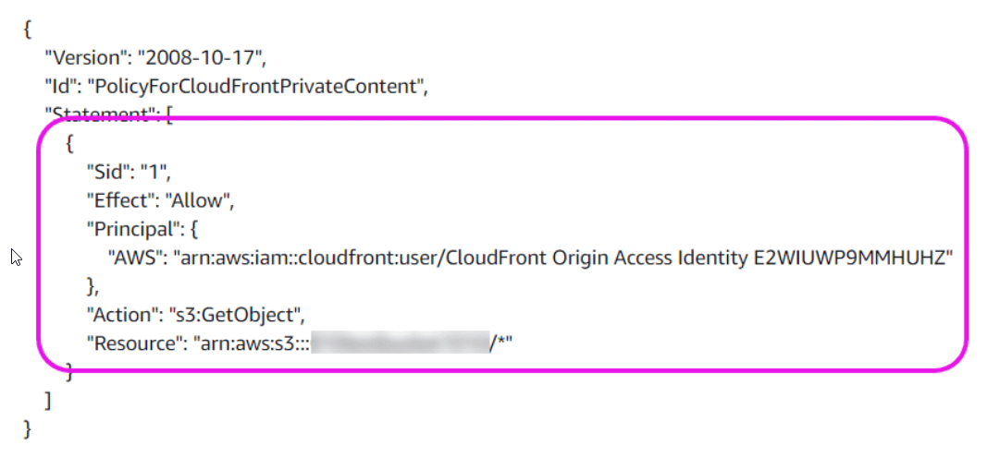

  * **Objects not owned by correct AWS account**

    If you have configured an OAI for your distribution, requested objects must be owned by the AWS account that owns the bucket for the OAI to properly access them.

    You can ensure this by adding a Condition statement to any PutObject statements in the origin bucket policy. 

    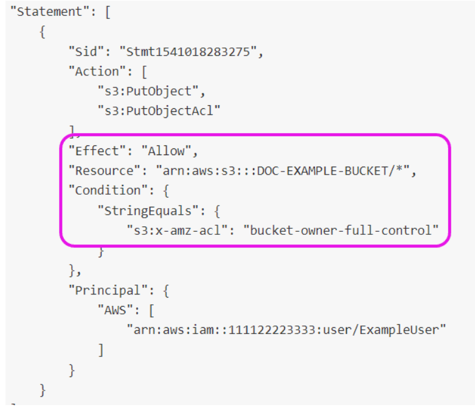

  * **Objects encrypted with AWS KMS**

    CloudFront distributions do not support objects encrypted with AWS Key Management Service (AWS KMS). nstead, you can use SSE-S3 server-side encryption. Amazon S3 server-side encryption uses one of the strongest block ciphers available to encrypt your data, 256-bit Advanced Encryption Standard (AES-256).
    Use one of the following methods to check if an object in your bucket is encrypted using AWS KMS:
    * Use the Amazon S3 console to view the properties of the object. Review the Encryption dialog box. If AWS-KMS is selected, then the object is encrypted with AWS KMS.
    * Run the head-object command using the AWS CLI. If the command returns ServerSideEncryption as aws:kms, then the object is encrypted with AWS KMS.

    More: https://docs.aws.amazon.com/AmazonS3/latest/userguide/UsingServerSideEncryption.html

  * **Requested object does not exist in origin bucket**

    Double check to ensure that the object exists at the requested path in your bucket. If you verify that the object does not exist, and you have not granted ListBucket permissions to your OAI, Amazon S3 will return HTTP 403.

    If you have not configured an origin path, when a user enters example.com/index.html in a browser, CloudFront sends a request to Amazon S3 for EXAMPLE-BUCKET/index.html.

    If you have configured an origin path, CloudFront appends this path to your origin domain name before forwarding the request to your bucket.

    For example, if a user enters example.com/index.html in a browser, and you have configured an origin path of '/production', CloudFront sends a request to Amazon S3 for EXAMPLE-BUCKET/production/index.html.
    More: https://docs.aws.amazon.com/AmazonCloudFront/latest/DeveloperGuide/distribution-web-values-specify.html#DownloadDistValuesOriginPath

  * **OAI not configured for origin**

    First ensure that the bucket policy grants access to the OAI and requires granting control of files to the account owner. Then, ensure that the distribution is using the permitted OAI to make requests to the bucket.
    More: https://docs.aws.amazon.com/AmazonCloudFront/latest/DeveloperGuide/private-content-restricting-access-to-s3.html#private-content-creating-oai

  * **Nonpublic bucket**

    If you have elected not to configure an OAI, then you can configure your distribution to use a public S3 bucket as an origin. Verify that your chosen bucket is public by accessing the Amazon S3 console, selecting the designated bucket, and reviewing the settings in the Permissions tab.

* Troubleshooting HTTP Forbidden – Signed URLs or cookies

  If your team is using signed URLs or cookies to serve private content to groups of viewers, HTTP 403 errors can be generated when those items are not included as expected in incoming requests. In this scenario, consider your application's signing process to discover where the problem is occurring. There may also be hints to deduce from the error responses reported by viewers. Find the heading that matches the current error responses, and review the following guidance.

  * **Invalid key**

  This means the request included a signed URL or cookie, but the wrong key was used to sign it. Go to the **Cache Behavior** for your distribution, and ensure that the **Trusted Key Group** corresponds with the key used by your application.
  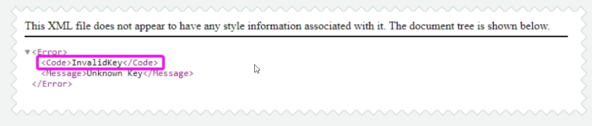

  * **Missing key**

  This response means that the cache behavior for this distribution requires signed URLs or cookies, but none were present in the request. Ensure that your application is distributing signed URLs or cookies in responses as expected.
  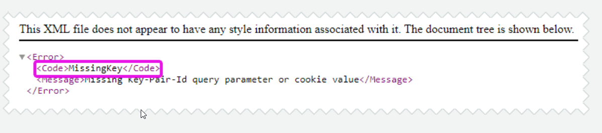

  * **Access denied**

  Finally, if you serve private content and encounter an Access Denied error response with no Amazon S3 request ID included, this also represents an issue with your application's signing process.
  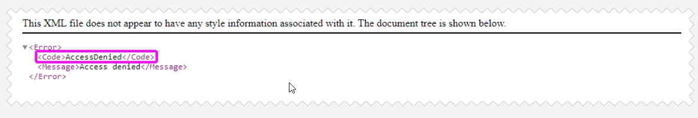

## Troubleshooting HTTP 502 – Bad Gateway

When investigating issues with CloudFront, an HTTP 502 Bad Gateway error indicates that a particular edge location wasn't able to serve the requested object because it couldn't connect to the origin server to retrieve it. This is often due to an SSL certificate misconfiguration.

### Troubleshooting with OpenSSL

As HTTP 502 errors commonly stem from certificate misconfigurations, a good first step is to use OpenSSL to try to make an SSL/TLS connection to your origin server.

If OpenSSL is not able to make a connection, that can indicate a problem with your origin server’s SSL/TLS configuration. If OpenSSL can make a connection, it returns information about the origin server’s certificate. This includes the certificate’s common name (Subject CN field) and subject alternative name (Subject Alternative Name field), which can be useful for further investigation.

Use the following OpenSSL command to test the connection to your origin server (replace <origindomainname> with your origin server’s domain name, such as example.com):

```
openssl s_client -connect <origindomainname>:443
```

If the following are true:

* Your origin server supports multiple domain names with multiple SSL/TLS certificates.
* Your distribution is configured to forward the Host header to the origin.

Then add the -servername option, as in the following example (replace <CNAME> with the CNAME that’s configured in your distribution):

```
openssl s_client -connect <origindomainname>:443 -servername <CNAME>
```

Common causes:

* Is the origin responding on the expected ports?
* Are there any DNS complications?
* Is the SSL/TLS negotiation to your origin 