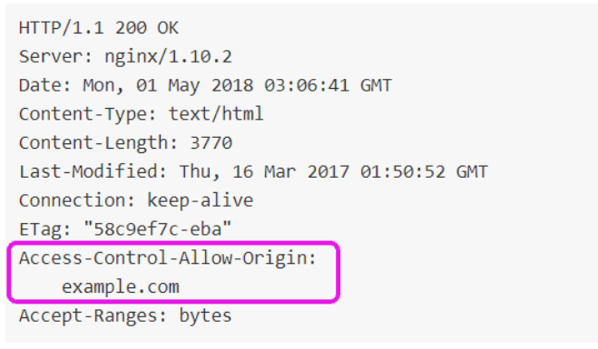

- [AWS CloudFront basics](#aws-cloudfront-basics)
- [CloudFront origins](#cloudfront-origins)
- [CloudFront architecture at a high level](#cloudfront-architecture-at-a-high-level)
- [S3 as origin](#s3-as-origin)
  - [CloudFront vs S3 Cross Region Replication](#cloudfront-vs-s3-cross-region-replication)
- [Troubleshooting](#troubleshooting)
  - [HTTP headers used in CloudFront](#http-headers-used-in-cloudfront)
    - [x-cache](#x-cache)
    - [x-amz-cf-id](#x-amz-cf-id)
    - [x-amz-cf-pop](#x-amz-cf-pop)
    - [server](#server)
  - [Logs](#logs)
    - [Standard Logs (Access Logs)](#standard-logs-access-logs)
    - [Real-Time Logs](#real-time-logs)
  - [Http error codes](#http-error-codes)
    - [Http error 403 (Forbidden)](#http-error-403-forbidden)
      - [Request blocked (AWS WAF)](#request-blocked-aws-waf)
      - [Request blocked (geo-restrictions)](#request-blocked-geo-restrictions)
      - [HTTP method not allowed](#http-method-not-allowed)
      - [Bad request](#bad-request)
      - [S3 origin](#s3-origin)
      - [Signed URLs or cookies](#signed-urls-or-cookies)
    - [HTTP 502 (Bad Gateway)](#http-502-bad-gateway)
      - [Troubleshooting with OpenSSL](#troubleshooting-with-openssl)
    - [HTTP 504 (Gateway Timeout)](#http-504-gateway-timeout)
      - [HTTP 504 – Networking](#http-504--networking)
      - [HTTP 504 – Performance](#http-504--performance)
  - [Troubleshooting Cache Issues](#troubleshooting-cache-issues)
    - [Distribution responding with x-cache: Miss from cloudfront](#distribution-responding-with-x-cache-miss-from-cloudfront)
    - [Troubleshooting cache response headers](#troubleshooting-cache-response-headers)
  - [Troubleshooting Cross-Origin Resource Sharing](#troubleshooting-cross-origin-resource-sharing)
    - [Missing Access-Control-Allow-Origin header](#missing-access-control-allow-origin-header)
      - [Adding CORS headers to responses using response headers policies](#adding-cors-headers-to-responses-using-response-headers-policies)
      - [Adding CORS headers to responses using origin headers](#adding-cors-headers-to-responses-using-origin-headers)

# AWS CloudFront basics

* Content Delivery Network (CDN)
* Improves read performance, content is cached at the edge location(s)
* Improves user experience
* 216 Point of Presence globally (edge locations)
* DDOoS protection (because worldwide)
* Integration with Shield, AWS Web Application Firewall


# CloudFront origins

* S3 bucket
  * For distributing files and caching them at the edge
  * Enhanced security with CloudFront Origin Access Control (OAC)
    * OAC is replacing Origin Access Identity (OAI)
  * **CloudFront can be used as an ingress (to upload files to S3)**
    * Is it about "S3 Transfer Acceleration" ? TBD
* Custom Origin (HTTP)
  * ALB
  * EC2 instance
  * S3 website
  * Any HTTP backend you want

# CloudFront architecture at a high level 

>NOTE: a client has to use DNS name created by the CloudFront


# S3 as origin


## CloudFront vs S3 Cross Region Replication

* CloudFront
  * Global Edge network
  * Files are cached for a TTL (~day?)
  * Great for static content that must be available everywhere

* S3 Cross Region Replication
  * Must be setup for each region you want replication to happen
  * Files are updated in near real-time
  * Read only
  * Great for dynamic content that needs to be available at low-latency in few regions

# Troubleshooting

## HTTP headers used in CloudFront

### x-cache

This header tells us if the response was served from the CloudFront cache (cache hit) or if a request had to be made to the origin to fetch the content (cache miss).


Possible values:

* **Hit from CloudFront** – The response was served from the CloudFront cache.
* **Miss from CloudFront** – The request could not be satisfied by an object in the cache, so the server forwarded the request to the origin and returned the result to the viewer.
* **RefreshHit from CloudFront** – The CloudFront server found the object in the cache but the object had expired, so the server contacted the origin to verify that the cache had the latest version of the object.
* **Redirect from CloudFront** – The server redirected the viewer from HTTP to HTTPS according to the distribution settings.
* **Error from CloudFront** – Typically this means the request resulted in either a client error (if the HTTP status code is in the 4XX range) or a server error (if the HTTP status code is in the 5XX range).

### x-amz-cf-id

This response header is an opaque string that uniquely identifies a request. The header is alternatively referred to as the CloudFront Request ID. It is important if you need to later identify a request in your CloudFront access logs or open a support case with AWS Premium Support. CloudFront also sends this header in requests made to your origin.

For troubleshooting issues with a custom origin, you should consider logging these headers at the origin if you are not already doing so.


### x-amz-cf-pop

This is the edge location that served the request. Each edge location is identified by a three-letter code and an arbitrarily assigned number, such as DFW3.

The three-letter code typically corresponds with the International Air Transport Association (IATA) airport code for an airport near the edge location’s geographic location.


### server

When diagnosing HTTP errors, this header can be helpful to determine if the error was returned by your origin, or the request generated an error in CloudFront while connecting to your origin.

* If the request generates an error and the server header in the response contains the same value returned by your origin (for example, Amazon S3 returns server: AmazonS3), then CloudFront was able to connect and receive a response from the origin. Errors returned by the origin can be caused by events like increased load, invalid requests from the client, or distribution and origin misconfigurations.

* If the request generates an error and the server value response is `CloudFront`, then the error was generated by CloudFront without an HTTP response from the origin. Errors generated by CloudFront can be due to malformed HTTP requests, issues connecting to the origin, or distribution and origin misconfigurations.

* If the origin does not return a server header at all, CloudFront sets the value of the server header to CloudFront in its response by default.


## Logs

CloudFront provides two ways for users to collect logs for distributions. Learn more from the following table.

### Standard Logs (Access Logs)

* CloudFront standard logs provide detailed records about every request that is made to a distribution. The logs are useful for many scenarios, such as security and access audits.

* CloudFront standard logs are delivered to the Amazon Simple Storage Service (Amazon S3) bucket of your choice.

* CloudFront doesn't charge for standard logs, although you incur Amazon S3 charges for storing and accessing the log files.

### Real-Time Logs

* CloudFront real-time logs deliver information about requests made to a distribution to an Amazon Kinesis data stream in seconds after receiving requests.

* You can choose the sampling rate for your real-time logs—that is, the percentage of requests for which you want to receive real-time log records. You can also choose the specific fields that you want to receive in the log records.

* CloudFront charges for real-time logs, in addition to the charges you incur for using Kinesis Data Streams.

## Http error codes

### Http error 403 (Forbidden)

When investigating HTTP 403 errors, it is critical to discern if the error is related to a **distribution issue**, an Amazon Simple Storage Service **(Amazon S3) bucket issue**, or a **signed URLs/cookies configuration** issue.

If a web request successfully reaches your distribution but generates an HTTP 403 error, end viewers may see a response similar to the following screenshots.

* If the error was generated by your CloudFront distribution, the error will explicitly say **Generated by CloudFront** towards the bottom and include a CloudFront Request ID.  Include this request ID in any cases raised with AWS Premium Support.

* If the error was generated by Amazon S3, it **will return an XML error** response showing **Access Denied** and include an **S3 request ID** as well as a Host ID. This means the web request was successfully received by your distribution but received an error when retrieving the requested object from Amazon S3.

* If the error was produced as a result of a signing error, CloudFront will generate an **XML error response** with no request IDs present.

#### Request blocked (AWS WAF)

  The request was blocked due to an AWS WAF ACL. If the error was caused by a distribution issue at the CloudFront level, you will see an error similar to the following. Review the settings for the ACL associated with this distribution.
  

#### Request blocked (geo-restrictions)

  The request was blocked due to restrictions on the country that the requesting IP is from. If this is being reported by a user in a permitted geographic area, ask if they are using a virtual private network (VPN). Review the geographic restrictions that are configured for your distribution.
  

#### HTTP method not allowed

  By default, CloudFront distributions only allow cachable HTTP requests (GET, HEAD). If a request is made using an HTTP method that is not supported by the distribution, this error response will be presented. To allow additional HTTP methods, modify the behavior configured for this distribution.
  

#### Bad request

  Several causes might prompt this response.
  

  * **Incorrect domain name used in request**: To successfully make requests to your distribution using a custom domain name, that name must be configured as an Alternate Domain Name in the General settings for your distribution.
  * **Request not made through HTTPS**: Review the Viewer protocol policy in the behavior configured for this distribution, as well as the request, to determine whether HTTPS was used.
  * **Request is malformed**: Review the request itself to ensure that it is properly constructed. For example, including a Content-Length header in a GET request is prohibited. If you are unsure, you can open a case that includes the request and response headers with AWS Premium Support.

#### S3 origin

If the error shown is Access Denied and includes an S3 request ID, it means that the web request was successfully received by your distribution. However, it received an error when retrieving the requested object from Amazon S3.

Web requests to Amazon S3 must be properly authenticated and authorized, or they will be met with an Access Denied response. This will result in HTTP 403 errors from CloudFront. If the error was generated by Amazon S3, the server value in the response header should read AmazonS3.

What causes HTTP 403 errors when using Amazon S3 as an origin?

* **Bucket policy written incorrectly**
  If you are not using a public S3 bucket, you must grant read access to an origin access identity (OAI) through a statement in the origin bucket's bucket policy so that your distribution can retrieve objects.

  If you configure CloudFront to accept and forward all of the HTTP methods that CloudFront supports, be sure to give your CloudFront OAI the desired permissions.

  

* **Objects not owned by correct AWS account**

  If you have configured an OAI for your distribution, requested objects must be owned by the AWS account that owns the bucket for the OAI to properly access them.

  You can ensure this by adding a Condition statement to any PutObject statements in the origin bucket policy. 

  

* **Objects encrypted with AWS KMS**

  CloudFront distributions do not support objects encrypted with AWS Key Management Service (AWS KMS). nstead, you can use SSE-S3 server-side encryption. Amazon S3 server-side encryption uses one of the strongest block ciphers available to encrypt your data, 256-bit Advanced Encryption Standard (AES-256).
  Use one of the following methods to check if an object in your bucket is encrypted using AWS KMS:
  * Use the Amazon S3 console to view the properties of the object. Review the Encryption dialog box. If AWS-KMS is selected, then the object is encrypted with AWS KMS.
  * Run the head-object command using the AWS CLI. If the command returns ServerSideEncryption as aws:kms, then the object is encrypted with AWS KMS.

  More: https://docs.aws.amazon.com/AmazonS3/latest/userguide/UsingServerSideEncryption.html

* **Requested object does not exist in origin bucket**

  Double check to ensure that the object exists at the requested path in your bucket. If you verify that the object does not exist, and you have not granted ListBucket permissions to your OAI, Amazon S3 will return HTTP 403.

  If you have not configured an origin path, when a user enters example.com/index.html in a browser, CloudFront sends a request to Amazon S3 for EXAMPLE-BUCKET/index.html.

  If you have configured an origin path, CloudFront appends this path to your origin domain name before forwarding the request to your bucket.

  For example, if a user enters example.com/index.html in a browser, and you have configured an origin path of '/production', CloudFront sends a request to Amazon S3 for EXAMPLE-BUCKET/production/index.html.
  More: https://docs.aws.amazon.com/AmazonCloudFront/latest/DeveloperGuide/distribution-web-values-specify.html#DownloadDistValuesOriginPath

* **OAI not configured for origin**

  First ensure that the bucket policy grants access to the OAI and requires granting control of files to the account owner. Then, ensure that the distribution is using the permitted OAI to make requests to the bucket.
  More: https://docs.aws.amazon.com/AmazonCloudFront/latest/DeveloperGuide/private-content-restricting-access-to-s3.html#private-content-creating-oai

* **Nonpublic bucket**

  If you have elected not to configure an OAI, then you can configure your distribution to use a public S3 bucket as an origin. Verify that your chosen bucket is public by accessing the Amazon S3 console, selecting the designated bucket, and reviewing the settings in the Permissions tab.

#### Signed URLs or cookies

If your team is using signed URLs or cookies to serve private content to groups of viewers, HTTP 403 errors can be generated when those items are not included as expected in incoming requests. In this scenario, consider your application's signing process to discover where the problem is occurring. There may also be hints to deduce from the error responses reported by viewers. Find the heading that matches the current error responses, and review the following guidance.

* **Invalid key**

This means the request included a signed URL or cookie, but the wrong key was used to sign it. Go to the **Cache Behavior** for your distribution, and ensure that the **Trusted Key Group** corresponds with the key used by your application.


* **Missing key**

This response means that the cache behavior for this distribution requires signed URLs or cookies, but none were present in the request. Ensure that your application is distributing signed URLs or cookies in responses as expected.


* **Access denied**

Finally, if you serve private content and encounter an Access Denied error response with no Amazon S3 request ID included, this also represents an issue with your application's signing process.


### HTTP 502 (Bad Gateway)

When investigating issues with CloudFront, an HTTP 502 Bad Gateway error indicates that a particular edge location wasn't able to serve the requested object because it couldn't connect to the origin server to retrieve it. This is often due to an SSL certificate misconfiguration.

#### Troubleshooting with OpenSSL

As HTTP 502 errors commonly stem from certificate misconfigurations, a good first step is to use OpenSSL to try to make an SSL/TLS connection to your origin server.

If OpenSSL is not able to make a connection, that can indicate a problem with your origin server’s SSL/TLS configuration. If OpenSSL can make a connection, it returns information about the origin server’s certificate. This includes the certificate’s common name (Subject CN field) and subject alternative name (Subject Alternative Name field), which can be useful for further investigation.

Use the following OpenSSL command to test the connection to your origin server (replace <origindomainname> with your origin server’s domain name, such as example.com):

```
openssl s_client -connect <origindomainname>:443
```

If the following are true:

* Your origin server supports multiple domain names with multiple SSL/TLS certificates.
* Your distribution is configured to forward the Host header to the origin.

Then add the -servername option, as in the following example (replace <CNAME> with the CNAME that’s configured in your distribution):

```
openssl s_client -connect <origindomainname>:443 -servername <CNAME>
```

Common causes:

* Is the origin responding on the expected ports?

  When you create an origin on your CloudFront distribution, you can set the ports that CloudFront connects to the origin with for HTTP and HTTPS traffic. By default, these are TCP 80/443. You have the option to modify these ports. If your origin is rejecting traffic on these ports for any reason, or if your backend server isn't responding on the ports, CloudFront will fail to connect.

  To troubleshoot these issues, verify whether your web server is running on the origin. Then, check any firewalls running in your infrastructure and validate that they are not blocking the [supported IP ranges](https://docs.aws.amazon.com/vpc/latest/userguide/aws-ip-ranges.html). For more information, see AWS IP address ranges in the Amazon Web Services General Reference.

* Are there any DNS complications?

  To make successful requests to the origin, CloudFront performs DNS resolutions for the origin domain name. When CloudFront cannot resolve the domain name to get the IP address, this results in a 502 error. To fix this issue, contact your DNS provider, or, if you are using Amazon Route 53 , see [My domain is unavailable on the internet](https://docs.aws.amazon.com/Route53/latest/DeveloperGuide/troubleshooting-domain-unavailable.html).

* Is the SSL/TLS negotiation to your origin?

  If you use a custom origin and configured CloudFront to require HTTPS between CloudFront and your origin, the problem might be mismatched domain names. The SSL/TLS certificate that is installed on your origin includes a domain name in the Common Name field and possibly several more in the Subject Alternative Names field. (CloudFront supports wildcard characters in certificate domain names.) 

  One of the domain names in the certificate must match one or both of the following values:
  * The value that you specified for **Origin domain** for the applicable origin in your distribution
  * The value of the **Host** header if you configured CloudFront to forward the Host header to your origin

  If the domain names don't match, the SSL/TLS handshake fails. CloudFront will return an HTTP status code 502 (Bad Gateway) and sets the **X-Cache** header to *Error from cloudfront*.

* Is the origin responding with supported ciphers or protocols?

  CloudFront connects to origin servers using a certain set of ciphers and protocols. For a list of the ciphers and protocols that CloudFront supports, see [Supported protocols and ciphers between CloudFront and the origin](https://docs.aws.amazon.com/AmazonCloudFront/latest/DeveloperGuide/secure-connections-supported-ciphers-cloudfront-to-origin.html).
  If your origin does not respond with one of these ciphers or protocols in the SSL/TLS exchange, CloudFront fails to connect. You can validate that your origin supports the ciphers and protocols by using an online checker, such as [SSL Labs](https://www.ssllabs.com/ssltest/).

  1. After reaching the page, type the domain name of your origin in the Hostname field, and then choose Submit.
  2. Review the Common names and Alternative names fields from the test to see if they match your origin's domain name.
  3. After the test is finished, find the Protocols and Cipher Suites sections in the test results to see which ciphers or protocols are supported by your origin. Compare them with the list of Supported Ciphers and Protocols.

* Are there issue with the origin server`s certificate?

  If there are problems with the origin server's certificate, CloudFront drops the TCP connection, returns HTTP status code 502 (Bad Gateway), and sets the **X-Cache** header to *Error from cloudfront*. Here are some of the most common issues:
  * Expired certificate
  * Invalid certificate
  * Self-signed certificate
  * Certificate chain in the wrong order

  To view a full list of criteria for using certificates with CloudFront, see [Requirements for using SSL/TLS certificates with CloudFront](https://docs.aws.amazon.com/AmazonCloudFront/latest/DeveloperGuide/cnames-and-https-requirements.html).
  Review the certificate installed on your origin to ensure that none of these issues are present.

* Is the origin returning a 502 error to CloudFront?

  If the error occurred upstream from CloudFront, and the origin returns a 502 error, CloudFront will forward this error to the viewer. For example, consider a load balancer origin generating a 502 error while connecting to its targets.

  To verify this, reproduce the request and **check the server header in the response**. If the error was generated by your origin, and the origin returns a server header, the header value will reflect that.

### HTTP 504 (Gateway Timeout)

An HTTP 504 (Gateway Timeout) error indicates that when CloudFront forwarded a request to the origin (because the requested object wasn’t in the edge cache), one of the following happened:

* The origin returned an HTTP 504 status code to CloudFront.
* The origin didn’t respond before the request expired.

CloudFront will return an HTTP 504 status code if traffic is blocked to the origin by a firewall or security group, or if the origin isn’t accessible on the internet. Check for those issues first. Then, if access isn’t the problem, explore application delays and server timeouts to help you identify and fix the issues.

An important first step is to compare your origin's connection attempts and connection timeout values to the origin response timeout. Depending on how much time passed before the 504 error, you can determine if CloudFront timed out while connecting to the origin or while waiting for a response.

* If the timeout occurred while connecting to the origin, there is likely a **networking misconfiguration** present.
* If the timeout occurred while waiting for a response, follow the steps to troubleshoot **performance issues**. 
* If the timeout occurred upstream from CloudFront, and the origin returned a 504 error, CloudFront will forward this error to the viewer.
  * Check the server response header. If the timeout was generated by your origin, and the origin returns a server header, the header value will reflect that.

#### HTTP 504 – Networking

* Is your origin server accepting traffic?

  If the firewall on your origin server blocks CloudFront traffic, CloudFront returns an HTTP 504 status code. Confirm that this isn’t the issue before checking for other problems. When you evaluate the firewall configuration on your origin server, look for any firewalls or security rules that block traffic from CloudFront edge locations, based on the published IP address range.

  If the CloudFront IP address range is whitelisted on your origin server, be sure to update your server’s security rules to incorporate changes. See [Subscribe to AWS Public IP Address Changes via Amazon SNS](https://aws.amazon.com/blogs/aws/subscribe-to-aws-public-ip-address-changes-via-amazon-sns/) for details on how to automate these changes.

  If your origin is an AWS resource aside from Amazon S3, ensure that any associated security groups also allow traffic from CloudFront.

* Is your origin server available on the internet?

  CloudFront will also return an HTTP 504 response if the origin server is not publicly available on the internet because that is how edge locations connect to origin servers. If your custom origin is on a private network, CloudFront can’t reach it.

  To check that internet traffic can connect to your origin server, run the following commands (substitute the domain name for your origin as <OriginDomainName>, and 80 or 443 for <Port> depending on your HTTP configuration):

  ```
  nc -zv <OriginDomainName> <Port>
  telnet <OriginDomainName> <Port>
  ```
#### HTTP 504 – Performance

Server timeouts are often the result of an application taking a very long time to respond or a timeout value that is set too low.

A quick fix to help avoid HTTP 504 errors is to set a higher CloudFront timeout value for your distribution. We recommend that you first make sure that you address any performance and latency issues with the application and origin server. Then, you can set a reasonable timeout value that helps prevent HTTP 504 errors and provides a responsive experience for your viewers.

* Measure typical and high-load latency

  To determine if one or more backend web application servers is experiencing high latency, run the following Linux curl command on each server. Replace the request path at the end with a path for an object from your distribution.

  ```
  curl -w "Connect time: %{time_connect} Time to first byte: %{time_starttransfer} Total time: %{time_total} \n" -o /dev/null <https://www.example.com/yourobject>
  ```

  Remember that latency values are relative to each application. However, a time to first byte (TTFB) in milliseconds, rather than seconds or more, is generally reasonable. If the latency appears to be acceptable under normal load, be aware that viewers might still experience timeouts under high load. When there is high demand, servers can have delayed responses or not respond at all. It is critical to implement monitoring for your origin server to understand whether your resources are truly strained.

  If you are using EC2 instances for your origin, you can use CloudWatch to track metrics such as CPU utilization, memory, and disk reads and writes. This will help ensure that your servers have the capacity to scale for high load.

* Add resources, and tune servers and databases

  After you evaluate the responsiveness of your applications and servers, confirm that you have sufficient resources in place for typical traffic and high-load situations:

  * If you have your own server, ensure that it has enough CPU, memory, and disk space to handle viewer requests, based on your evaluation.
  * If you use an EC2 instance as your backend server, make sure that the instance type has the appropriate resources to fulfill incoming requests. For more information, see Instance types in the Amazon EC2 user guide.
  * You might also consider placing your EC2 instances into an Auto Scaling group, and then configuring a load balancer to distribute traffic across the group

  In addition, consider the following tuning steps to help avoid timeouts:
  * If the TTFB value that is returned by the curl command seems high, improve application responsiveness to help reduce timeout errors.
  * Tune database queries to make sure that they can handle high-request volumes without slow performance.
  * Set up keep-alive (persistent) connections on your backend server. This option helps avoid latencies that occur when connections must be re-established for subsequent requests or users.
  * If you use an Application Load Balancer as your origin, learn how you can reduce latency by reviewing the suggestions in this article: [How can I troubleshoot high latency on my Application Load Balancer?](https://repost.aws/knowledge-center/elb-fix-high-latency-on-alb)

* If needed, adjust CloudFront timeout value

  What if you have evaluated and addressed slow application performance, origin server capacity, and other issues, but viewers are still experiencing HTTP 504 errors? Consider changing the time that is specified in your distribution for origin response timeout. To learn more, see [Origin Response Timeout](https://docs.aws.amazon.com/AmazonCloudFront/latest/DeveloperGuide/distribution-web-values-specify.html#DownloadDistValuesOriginResponseTimeout).

## Troubleshooting Cache Issues

A cache miss is defined as an instance in which a viewer makes a request to a distribution, and CloudFront must contact the origin to retrieve the file. Cache misses can cause unexpected latency and frustration for viewers and application owners alike. 

### Distribution responding with x-cache: Miss from cloudfront

This is the response indicating that CloudFront did not have a requested object in cache and that the origin server was contacted. If you are repeatedly seeing this response for the same object, it is possible that a configuration issue is preventing proper caching functionality.

When repeated cache misses are occurring, capturing a set of response headers will provide context for troubleshooting. Obtain them from a customer who is reporting issues, or reproduce the behavior yourself using the techniques mentioned previously in this course.

* Which edge location is receiving requests?

  After an object is requested through CloudFront, the object is cached only in the edge location that received the request. Send several requests from the same client to the object in question, and capture the response headers each time. Evaluate the **x-amz-cf-pop** value for each request. If multiple cache miss responses come from the same edge location, you can confirm unexpected behavior.

* Is the distribution configured to forward any headers, cookies, or query string parameters?

  If your distribution is configured to forward headers, cookies, or query string parameters, then the distribution caches requests based on those parameters. The parameters reduce the number of requests served from the cache. For example, if two requests to access an object have different values in query string parameters, then the second request won't be served from the cache. The second request would return the *x-cache: Miss from cloudfront* response.

  Make several requests to the distribution, ensuring that headers, cookies, and query strings are consistent with each response. If subsequent responses after the first result in cache hits, then the distribution is working as expected. If the distribution continues to respond with misses despite consistent incoming requests, then the misses indicate another cause.

  To optimize caching rates, consider caching only the exact parameters that you want CloudFront to include in the cache key. The cache key is a unique identifier for cached objects, that determines whether a request results in a cache hit. Including a wide range of values in the cache key increases the chance for cache misses. This is because more values, such as headers, would need to be consistent among requests to result in a cache hit.

  To learn more about cache keys, see [Understanding the cache key](https://docs.aws.amazon.com/AmazonCloudFront/latest/DeveloperGuide/understanding-the-cache-key.html).

* How frequently is the object requested?

  If an object in an edge location isn't requested frequently, CloudFront might remove the object before its expiration date. For more information about when CloudFront evicts objects, see [Managing how long content stays in an edge cache (expiration)](https://docs.aws.amazon.com/AmazonCloudFront/latest/DeveloperGuide/Expiration.html).

  If you notice the *x-cache: Miss from cloudfront* response intermittently, CloudFront might be removing the object because of infrequent requests.

### Troubleshooting cache response headers

When you customize object caching, you configure a Default TTL, Minimum TTL, and Maximum TTL. TTL, or time to live, determines how long objects remain in a distribution's cache. CloudFront uses these parameters based on whether the origin returns a caching header.

If the origin does return a caching header, CloudFront uses the following logic to handle TTL conflicts:

* If the origin doesn't return a caching header, then the distribution uses the Default TTL.
* If the origin returns a caching header that is less than the Minimum TTL, then the distribution uses the Minimum TTL.
* If the origin returns a caching header that is greater than the Maximum TTL, then the distribution uses the Maximum TTL.

If the caching results for a distribution do not match the intended configuration, it is likely that your origin is responding with an unexpected header. As a first step for troubleshooting, it is necessary to capture a response from CloudFront and investigate the headers. For guidance on each undesired caching behavior, expand each of the following three categories.

* **Minimum/Default TTL set to zero, CloudFront still serving from cache**

  If there are hits from CloudFront even when a request URI matches a cache behavior path with Minimum TTL and Default TTL set to 0, then check the response from CloudFront.
  If the **X-Cache** header value is *Hit from cloudfront* or *RefreshHit from cloudfront*, then the request was served from the cache of the edge location.

  Now, review the **Cache-Control, Expires**, and **Age** headers. The Cache-Control and Expires headers are behavioral caching headers that tell the intermediary (CloudFront) or private (browser) cache how to store a request. The Age header shows how long a response has been cached.

  If the max-age value for Cache-Control is greater than the value for Age, then the cached response is considered new and is served from the edge location.

  If the Expires date is still in the future, then the cached response is also considered new. This occurs even if the cache behavior path has Minimum TTL and Default TTL set to 0.

  For more information about preventing CloudFront from caching objects, see [How do I prevent CloudFront from caching certain files?](https://repost.aws/knowledge-center/prevent-cloudfront-from-caching-files) 

* **Maximum/Default TTL greater than zero, CloudFront still missing objects**

  If there are misses from CloudFront when a request URI matches a cache behavior path with Maximum TTL and Default TTL set to values greater than 0, check the response from CloudFront.

  If the **X-Cache** header value is *Miss from cloudfront*, then the request was retrieved from the origin and was not served by the cache.

  Review the **Cache-Control** header in the response.

  If the value for Cache-Control is no-store, then the origin is directing CloudFront to not cache the response. 

  If the value for Cache-Control is no-cache, then the header is directing CloudFront to verify with the origin before returning a cached response. These directives supersede the Maximum TTL and Default TTL CloudFront settings, but not the Minimum TTL.

* **CloudFront caching error responses**

  By default, CloudFront caches error responses for certain status codes from the origin for 10 seconds, and then forwards these error responses from the origin to the client. For more information about which errors are cached by CloudFront, see [HTTP 4xx and 5xx status codes that CloudFront caches.](https://docs.aws.amazon.com/AmazonCloudFront/latest/DeveloperGuide/HTTPStatusCodes.html#HTTPStatusCodes-cached-errors)

  If the error response from the origin contains a **Cache-Control** header, CloudFront caches the error with the configured TTL instead of the default 10 seconds.

  To determine whether the error response is from the origin or CloudFront, check the **Server** header. To determine whether the error is a cached response, check the **Age** header. A cached response  always includes an **Age** header.

  CloudFront doesn't cache its own error responses unless specified otherwise in a custom error response. You can configure custom error responses to control the caching TTL, and redirect viewers to specific pages. For more information, see [Generating custom error responses.](https://docs.aws.amazon.com/AmazonCloudFront/latest/DeveloperGuide/GeneratingCustomErrorResponses.html)

## Troubleshooting Cross-Origin Resource Sharing

CORS defines a way for client web applications that are loaded in one domain to interact with resources in a different domain. If your origin exists on a different domain than your CloudFront distribution, content will be loaded and verified through this mechanism. When implementing this in your environment, ensuring that the proper header values are configured for each request and response is critical to a smooth user experience.

### Missing Access-Control-Allow-Origin header

The Access-Control-Allow-Origin response header indicates to the viewer's browser whether the response can be shared with requesting code from the given origin. If this header is not being returned in responses from the origin, viewers will not be able to access the response content. Continue with the lesson for guidance on troubleshooting this issue.



There are two options for ensuring that this header is included in responses sent to viewer browsers. You can use a **response headers policy** to add certain headers to responses at the distribution level, or you can use **origin headers**.

#### Adding CORS headers to responses using response headers policies

You can configure CloudFront to add HTTP headers to responses that it sends to viewers. Using response header policies, you can do this without modifying the origin or writing any code. For example, you can add **Access-Control-Allow-Origin** and other headers useful for implementing CORS.

When using these policies, CloudFront adds the headers regardless of whether it serves the object from the cache or retrieves the object from the origin. If the response from the origin includes headers specified in a policy, you can specify whether CloudFront includes or overwrites the received value in its response to the viewer.

CloudFront provides predefined response headers policies, known as managed policies, to ease implementation for common use cases. For more information, see [Using the managed response headers policies](https://docs.aws.amazon.com/AmazonCloudFront/latest/DeveloperGuide/using-managed-response-headers-policies.html). If these policies are not sufficient for your use case, consider creating a custom response header policy to indicate exactly which headers will be added to viewer responses. See [Creating response headers policies](https://docs.aws.amazon.com/AmazonCloudFront/latest/DeveloperGuide/creating-response-headers-policies.html) for step-by-step instructions. 

#### Adding CORS headers to responses using origin headers

If you are having issues using origin responses to generate headers for CORS, consider these steps to begin your troubleshooting.

* Does the origin's CORS policy include the Access-Control-Allow-Origin header?

  As we need to investigate HTTP headers returned by the origin, a good first step is to send a request directly to it. Start by running a curl command similar to the following. Substitute your origin's domain name for <example.com>, and then replace the request path at the end with a realistic one.

  ```
  curl -H "origin: <example.com>" -v "<https://www.anything.net/video/call/System.generateId.dwr>"
  ```

  If the CORS policy allows the origin to return the header, the command returns a response including the Access-Control-Allow-Origin header.
  If the header is not returned, consider making an adjustment to your origin server's CORS policy.

* Does the CloudFront distribution forward the appropriate headers?

  After you have verified the origin's CORS policy, ensure that your CloudFront distribution forwards the headers that are required by your origin. The required headers will differ, depending on your chosen origin. For more information, see [Configuring CloudFront to respect CORS settings.](https://docs.aws.amazon.com/AmazonCloudFront/latest/DeveloperGuide/header-caching.html#header-caching-web-cors)

  When you have identified the necessary headers to pass to the origin, you can configure CloudFront to forward these headers. You can use a managed origin request policy, custom cache policy, or legacy cache settings.

  * Managed origin request policy
  * Custom cache policy
  * Legacy cache settings