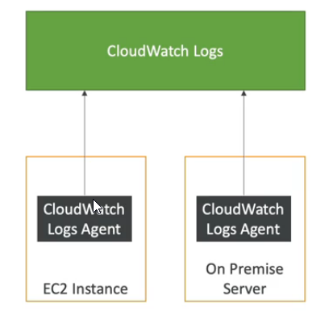
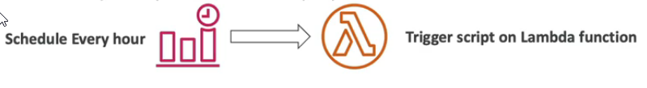

- [Cloud watch Important Metrics](#cloud-watch-important-metrics)
- [CloudWatch Alarms](#cloudwatch-alarms)
- [CloudWatch Logs](#cloudwatch-logs)
- [CloudWatch Logs EC2](#cloudwatch-logs-ec2)
- [Amazon EventBridge (formerly CloudWatch Events)](#amazon-eventbridge-formerly-cloudwatch-events)
  - [Default event bus](#default-event-bus)
  - [It is possible to receive events from partners for AWS](#it-is-possible-to-receive-events-from-partners-for-aws)
  - [Additional capabilities](#additional-capabilities)
  - [EventBridge Hands On](#eventbridge-hands-on)
- [AWS CloudTrail](#aws-cloudtrail)
    - [AWS CloudTrail Insights](#aws-cloudtrail-insights)
  - [Three types of events that can be logged in CloudTrail](#three-types-of-events-that-can-be-logged-in-cloudtrail)
  - [AWS CloudTrail Hands On](#aws-cloudtrail-hands-on)
- [AWS X-Ray](#aws-x-ray)
- [CodeGuru](#codeguru)
- [AWS Health Dashboard](#aws-health-dashboard)
  - [Service Health (aka Service Health Dashboard)](#service-health-aka-service-health-dashboard)
  - [Your Account Health (aka Personal Health Dashboard)](#your-account-health-aka-personal-health-dashboard)
# Cloud watch Important Metrics

* EC2 instances: CPU, Status Check, Network (not RAM)
  * Default metrics every 5 minutes
  * Option for detailed monitoring ($$$): metrics every I minute
* EBS volumes: disk read/writes
* S3 buckets: BucketSizeBytes, NumberOfObjects, AllRequests
* Billing: Total Estimated Charge (only in us-east-1)
* Service Limits: how much you have been using a service API
* Custom metrics: push your own metrics

# CloudWatch Alarms

* Auto Scaling: increase or decrease EC2 instances "desired" count
* EC2 Actions: stop, terminate, reboot or recover EC2 instance
* SNS notifications: send a notification into an SNS topic
* Various options (sampling, %, max, min, etc...)
* Can choose the period on which to evaluate an alarm
* Example: create a billing alarm on the CloudWatch Billing metric
* Alarm states: OK, INSUFFICIENT_DATA, ALARM
* It doesn't use projections based on your usage so far in the month - **sends an alarm when the actual cost exceeds a certain threshold.**. It does not use forecasting like in AWS Budgets Alarms

# CloudWatch Logs

CloudWatch Logs can be collected from:
* Elastic Beanstalk: collection of logs from application
* ECS: collection from containers
* AWS Lambda: collection from function logs
* CloudTrail based on filter
* CloudWatch log agents: on EC2 machines or on-premises servers
* Route53: Log DNS queries

* Enables real-time monitoring of logs
* Adjustable CloudWatch Logs retention

# CloudWatch Logs EC2

* By default, no logs from your EC2 instances will go to CloudWatch
* You need to run a **CloudWatch agent** on EC2 to push the log files you want
* Make sure IAM permissions are correct
* The CloudWatch log agent can be setup on-premises too

# Amazon EventBridge (formerly CloudWatch Events)

A serverless service for building event-driven applications.

## Default event bus
* Schedule: Cron jobs (scheduled scripts)
  
* Even Patter: Event rules to react to a service doing something
  
* Trigger Lambda functions, send SQS/SNS messages...

## It is possible to receive events from partners for AWS

It is possible to react on events happening outside of AWS.

## Additional capabilities

* Schema registry: model event schema
* You can archive events (all/filter) sent to an even bus (indefinitely or se period)
* Ability to replay archived events

## EventBridge Hands On

# AWS CloudTrail

* Provides governance, compliance and audit for your AWS account
* CloudTrail is enabled by default
* Get an history of events / API calls made within you AWS account by
  * Console
  * SDK
  * CLI
  * AWS Services
* Can put logs from CloudTrail into CloudWatch Logs or S3 for longer retention
* A trail can be applied to All Regions (default) or a single Region
* If a resource is deleted in AWS, investigate CloudTrail first
* Entries in the CloudTrail appears after around 5 mins after executing action in AWS

### AWS CloudTrail Insights

Insights events are logged when CloudTrail detects unusual write management API activity in your account. If you have CloudTrail Insights enabled, and CloudTrail detects unusual activity, Insights events are delivered to the destination S3 bucket for your trail. You can also see the type of insight and the incident time period when you view Insights events on the CloudTrail console. Unlike other types of events captured in a CloudTrail trail, Insights events are logged only when CloudTrail detects changes in your account's API usage that differ significantly from the account's typical usage patterns.

CloudTrail Insights can help you detect unusual API activity in your AWS account by raising Insights events. CloudTrail Insights measures your normal patterns of API call volume, also called the baseline, and generates Insights events when the volume is outside normal patterns.

## Three types of events that can be logged in CloudTrail

* management events (only this is enabled by default)
  * These are also known as control plane operations. Examples include registering devices, configuring rules for routing data, setting up logging etc.
* data events
  * Data events provide information about the resource operations performed on or in a resource. These are also known as data plane operations. Data events are often high-volume activities. The following data types are recorded: Amazon S3 object-level API activity, AWS Lambda function execution activity, Amazon S3 object-level API activity on AWS Outposts.
* CloudTrail Insights events
  * CloudTrail Insights events capture unusual activity in your AWS account. If you have Insights events enabled, and CloudTrail detects unusual activity, Insights events are logged to a different folder or prefix in the destination S3 bucket for your trail. You can also see the type of insight and the incident time period when you view Insights events on the CloudTrail console.

## AWS CloudTrail Hands On

# AWS X-Ray

* Debugging in Production, the good old way
  * Test locally
  * Add log statements everywhere
  * Re-deploy in production
  * Log formats differ across applications and log analysis is hard
  * Debugging: one big monolith "easy", distributed services "hard"
  * No common views of you entire architecture

* AWS X-Ray visual analysis and debug of our applications
  
  * Troubleshooting performance (bottlenecks)
  * Understand dependencies in a microservice architecture
  * Pinpoint service issue
  * Review request behavior
  * Find errors and exceptions
  * Are we meeting time SLA?
  * Where I am throttled?
  * Identify users that are impacted

# CodeGuru

* An ML-powered service for automated code reviews and application performance recommendations
* Provide two functionalities
  * CodeGuru Reviewer: automated code reviews for static code analysis (development)
  * CodeGuru Profiler: visibility/recommendations about application performance during runtime (production)

# AWS Health Dashboard

https://health.aws.amazon.com/

## Service Health (aka Service Health Dashboard)

https://status.aws.amazon.com redirects to https://health.aws.amazon.com/health/home#/account/dashboard/open-issues and here we can see status of all services in all regions https://health.aws.amazon.com/health/status

Service Health Dashboard offers the possibility to subscribe to an RSS feed to be notified of interruptions to each service

## Your Account Health (aka Personal Health Dashboard)

https://phd.aws.amazon.com/ now it is redirected to https://health.aws.amazon.com/health/home#/account/dashboard/open-issues

* Provides alerts and remediation guidance when AWS is experiencing events that might impact you
* While the `Service Health Dashboard` displays the general status of AWS services, `Your Account Health` gives you a personalized view into the performance and availability of the AWS services underlying your AWS resources
* Displays relevant and timely information to help you manage events in progress and provides proactive notification to help you plan for scheduled activities
* No RSS feed
