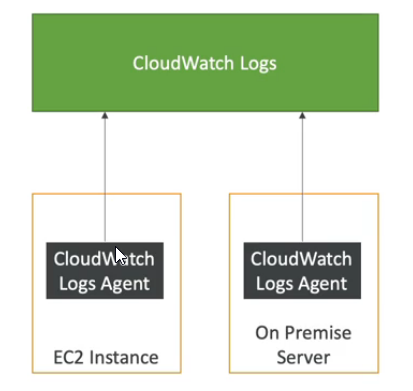

# Cloud watch Important Metrics

* EC2 instances: CPU, Status Check, Network (not RAM)
  * Default metrics every 5 minutes
  * Option for detailed monitoring ($$$): metrics every I minute
* EBS volumes: disk read/writes
* S3 buckets: BucketSizeBytes, NumberOfObjects, AllRequests
* Billing: Total Estimated Charge (only in us-east-1)
* Service Limits: how much you have been using a service API
* Custom metrics: push your own metrics

# CloudWatch Alarms

* Auto Scaling: increase or decrease EC2 instances "desired" count
* EC2 Actions: stop, terminate, reboot or recover EC2 instance
* SNS notifications: send a notification into an SNS topic
* Various options (sampling, %, max, min, etc...)
* Can choose the period on which to evaluate an alarm
* Example: create a billing alarm on the CloudWatch Billing metric
* Alarm states: OK, INSUFFICIENT_DATA, ALARM

# CloudWatch Logs

CloudWatch Logs can be collected from:
* Elastic Beanstalk: collection of logs from application
* ECS: collection from containers
* AWS Lambda: collection from function logs
* CloudTrail based on filter
* CloudWatch log agents: on EC2 machines or on-premises servers
* Route53: Log DNS queries

* Enables real-time monitoring of logs
* Adjustable CloudWatch Logs retention

# CloudWatch Logs EC2

* By default, no logs from your EC2 instances will go to CloudWatch
* You need to run a **CloudWatch agent** on EC2 to push the log files you want
* Make sure IAM permissions are correct
* The CloudWatch log agent can be setup on-premises too

