- [NoSQL Databases (non relational databases)](#nosql-databases-non-relational-databases)
  - [DynamoDB](#dynamodb)
    - [DynamoDB Accelerator - DAX](#dynamodb-accelerator---dax)
    - [DynamoDB Global Tables](#dynamodb-global-tables)
- [RDS (Relational Database Service)](#rds-relational-database-service)
  - [RDS Important points](#rds-important-points)
  - [Advantage over using RDS versus deploying DB on EC2](#advantage-over-using-rds-versus-deploying-db-on-ec2)
    - [Aurora (part of RDS)](#aurora-part-of-rds)
  - [RDS Deployments](#rds-deployments)
- [ElastiCache](#elasticache)
- [Redshift](#redshift)
- [Amazon EMR](#amazon-emr)
- [Athena](#athena)
- [QuickSight](#quicksight)
- [DocumentDB](#documentdb)
- [Neptune](#neptune)
- [QLDB (Quantum Ledger Database)](#qldb-quantum-ledger-database)
- [Amazon Managed Blockchain](#amazon-managed-blockchain)
- [Glue](#glue)
  - [Glue Data Catalog](#glue-data-catalog)
- [DMS](#dms)

# NoSQL Databases (non relational databases)
## DynamoDB

* Fully managed HA with replication across 3 AZ
* Scales to massive workloads, distributed "serverless" database
* Millions of requests per seconds, trillions of row, 100s of TB of storage
* Fast and consistent in performance
* Single-digit millisecond latency - low latency retrieval
* Integrated with IAM for security, authorization and administration
* Low cost and auto scaling capabilities
* Standard and Infrequent Access (IA) Table Class
* Key/Value DB
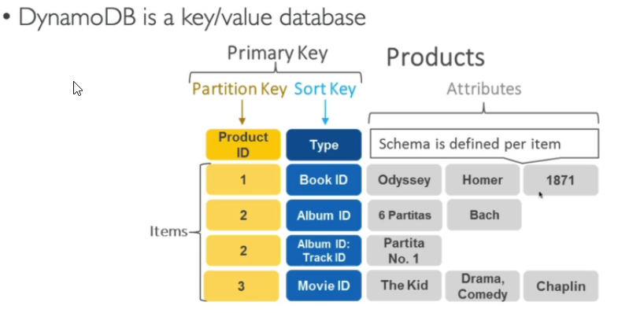

### DynamoDB Accelerator - DAX

* Fully managed in-memory cache for DynamoDB
* It is not ElastiCache
* 10x performance improvement - single digit millisecond latency to microseconds latency - when accessing your DynamoDB tables
* Difference with ElastiCache at the CCP level: DAX is only used for and is integrated with DynamoDB, while ElastiCache can be used for other databases

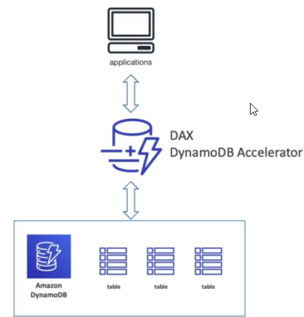

### DynamoDB Global Tables

* Make a DynamoDB table accessible with low latency in multiple-regions
* Active-Active replication (read/write to any AWS region)

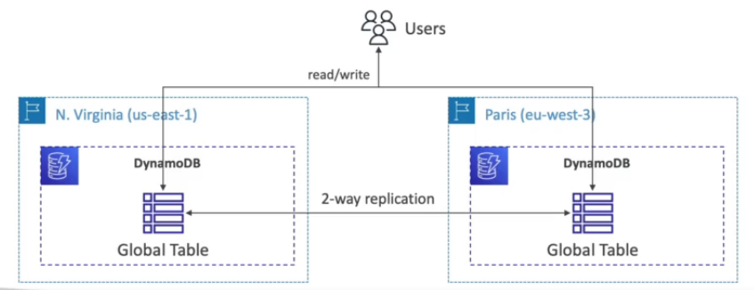

# RDS (Relational Database Service)

* PostgresSQL
* MySQL
* MariaDB
* Oracle
* Microsoft SQL Server

## RDS Important points

https://aws.amazon.com/rds/features/multi-az/

* RDS is not serverless database (for example DynamoDB is server less).
* RDS instances are optimized for memory, performance, or I/O, therefore the performance of AWS managed RDS instance is better than a customer-managed database instance.
* Amazon RDS Multi-AZ deployments provide enhanced availability and durability for RDS database (DB) instances, making them a natural fit for production database workloads. When you provision a Multi-AZ DB Instance, Amazon RDS automatically creates a primary DB Instance and synchronously replicates the data to a standby instance in a different Availability Zone (AZ).

## Advantage over using RDS versus deploying DB on EC2

RDS is managed service:
* Automated provisioning, OS patching
* Continuous backups and restore to specific timestamp (Point in Time Restore)
* Monitoring dashboards
* Read replicas for improved performance
* Multi AZ setup for DR (Disaster Recovery)
* Scaling capability (vertical and horizontal)
* Storage backed by EBS (gp2 or io 1)

**But you can`t SSH into your instances.**

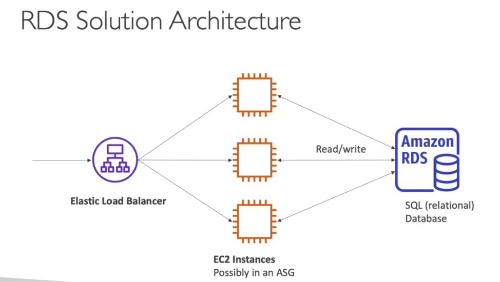

### Aurora (part of RDS)
Aurora is AWS Proprietary database, not open source.

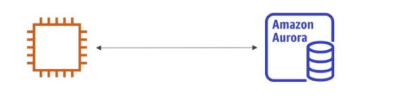

* **PostgresSQL and MySQL** are supported as Aurora DB.
* It is "AWS cloud optimized" and claims 5x performance improvement over MySQL on RDS, over 3x the performance of Postgres on RDS.
* Storage will automatically grow in increments of 10GB, up to 64TB
* Aurora costs more than RDS (20% more) - but is more efficient
* Not in the free tier
* Automatic data replication across 6 facilities - so we have 6 copies at any given time
* Can deploy up to 15 read replicas
* Continuous backup to S3 - always available backup ready to restore
* Point-in-time recover

## RDS Deployments

* Read replicas
  * Can create up to 5 read replicas for Oracle and SQL Server and up to 15 for MySQL, MariaDB and PostgreSQL, more [here](https://aws.amazon.com/rds/features/read-replicas/)
  * Data is only written to the main DB
  * Read Replicas are an example of horizontal scaling of resources
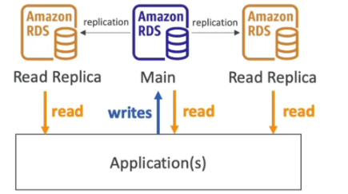
* Multi-AZ
  * Failover in case AZ outage (HA)
  * Only one AZ as failover
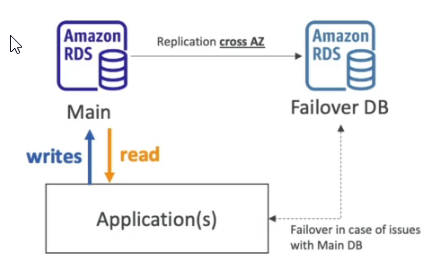
* Multi-region (read replicas)
  * Disaster recover in case of region issue
  * Local performance for global reads
  * Replication cost
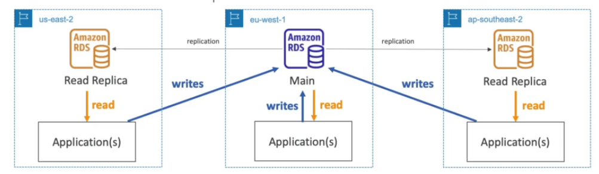

# ElastiCache

* The same way RDS is to get managed Relational Databases
* ElastiCache is to get managed Redis or Memcached
* Caches are in-memory databases with high performance, low latency
* Helps reduce load off databases for read intensive workloads
* AWS takes care of OS maintenance / patching, optimizations, setup, configuration, monitoring, failure recovery and backups

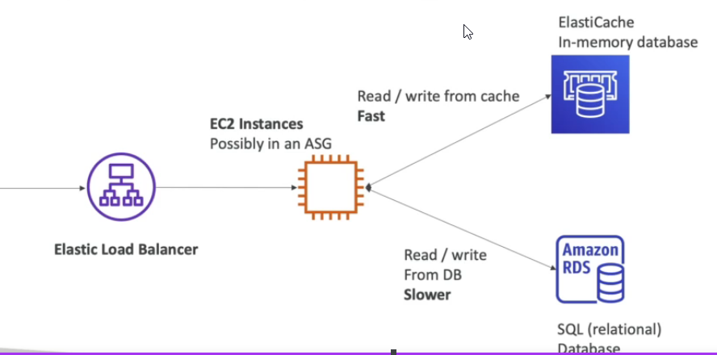

# Redshift

https://aws.amazon.com/redshift/faqs/

* Is based on PostgresSQL, but it is not used for OLTP (Online transaction processing)
* It is OLAP - online **analytical** processing (analytics and data warehousing)
* Load data once every hour, not every second
* 10x better performance than other data warehouses, scales to PBs of data
* Columnar storage of data (instead of row based)
* Massively Parallel Query Execution (MPP), HA
* Pay as you go based on the instances provisioned
* Has a SQL interface for performing the queries
* BI tools such as AWS Quicksight or Tableau integrate with it
* It is highly available: customers can now improve availability of Redshift by running their data warehouse in a multi-AZ deployment

# Amazon EMR

* Stands for "Elastic MapReduce"
* EMR helps creating **Hadoop** clusters (Big Data) to analyze and process vast amount of data
* The clusters can be made of hundreds of EC2 instances
* Also supports Apache, Spark, HBase, Presto, Flink,...
* EMR takes care of all the provisioning configuration
* Auto-scaling and integrated with Spot instances
* Use cases: data processing, machine learning, web indexing, big data

# Athena

* Serverless query service to perform analytics again S3 objects
* Use standard SQL language to query the files
* Supports: CSV, JSON, ORC, Avro and Parquet (build on Presto)
* Pricing: $500 per TB of data scanned
* Use compressed or columnar data for cost savings (less scan)
* Use cases: business intelligence, analytics, reporting, analyze & query VPC Flow Logs, ELB Logs, CloudTrails etc.
*** Exam tip: analyze data in S3 using serverless SQL, use Athena**

# QuickSight
* Serverless **machine learning-powered business intelligence** service to create interactive dashboards
* Fast, automatically scalable, embeddable
* Use cases
  * BA
  * Building visualizations
  * Perform ad-hoc analysis
  * Get business insights using data
* Integrated with: RDS, Aurora, Athena, Redshift, S3...
* **Can be also used to visual AWS costs**
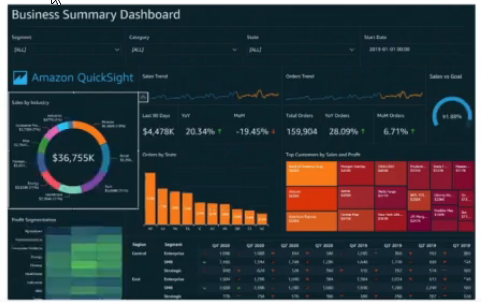

# DocumentDB

* Aurora is as "AWS-implementation" of PostgresSQL/MySQL
* DocumentDB is the same for **MongoDB**
* Fully managed, HA with replication across 3 AZ
* Storage automatically grows in increments of 10GB, up to 64TB
* Automatically scales to workloads with millions of requests per seconds
* Great for content management system

# Neptune

* Fully managed graph database
* A popular graph dataset would be a social network
  * Users have friends
  * Posts have comments
  * Comments have likes from users
  * Users share and like posts...
* HA across 3 AZ, with pu to 15 read replicas
* Build and run applications working with highly connected datasets - optimized for these complex and hard queries
* Can store up to billions of relations and query the graph with milliseconds latency
* HA with replications across multiple AZs
* Great for knowledge graphs (Wikipedia), fraud detection, recommendation engines, social networking

# QLDB (Quantum Ledger Database)

* A ledger is a book recording financial transactions
* Fully managed, serverless, HA, replication across 3 AZ
* Used to review history of all the changes made to your application data over time
* Immutable system: no entry can be removed or modified, cryptographically verifiable
* 2-3x better performance than common ledger blockchain frameworks
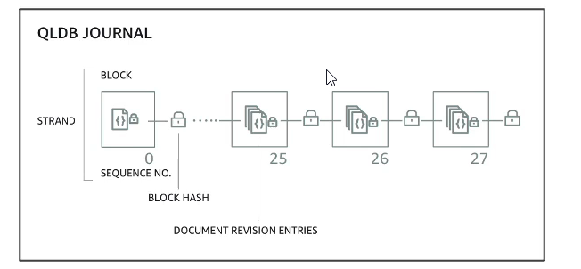
* Manipulate data using SQL
* Difference with Amazon Managed Blockchain: **no decentralization component**, in accordance with financial regulations rules

# Amazon Managed Blockchain

* Blockchain makes it possible to build applications where multiple parties can execute transactions **without the need for a trusted, central authority.**
* Can be used to:
  * Join public blockchain networks
  * Or create your own scalable private network
* Compatible with the frameworks Hyperledger Fabric and Ethereum
* It is decentralized

# Glue

* Managed extract, transform, and load (ETL) service
* Useful to prepare and transform data for analytics
* Fully serverless service

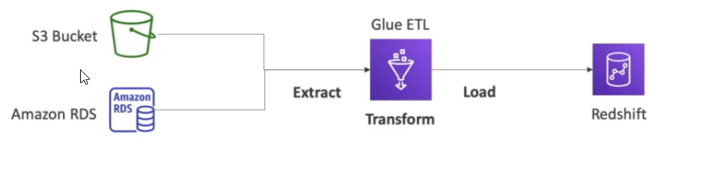

## Glue Data Catalog

* Catalog of datasets in AWS infrastructure (column names, field name, field type, etc.)
* Can be used by Athena, Redshift, EMR

# DMS

* **Database Migration Service**
* Quick and securely migrate databases to AWS, resilient, self healing
* The source database remains available during the migration
* Basic use cases
  * Homogeneous migrations: ex Oracle to Oracle
  * Heterogeneous migrations: ex Microsoft SQL Server to Aurora
* Other use cases
  * Development and test database migrations - migrate data to test application against production data without affecting production users
  * Database consolidation - combining several databases into a single database
  * Continuous replication - sending ongoing copies of your data to other target sources instead of doing a one-time migration

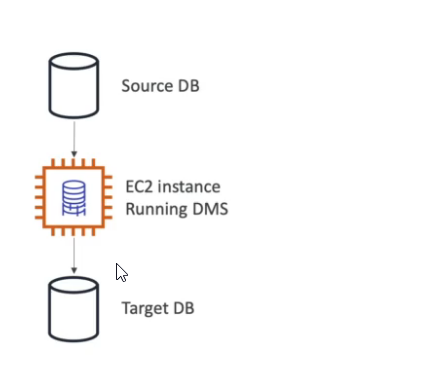