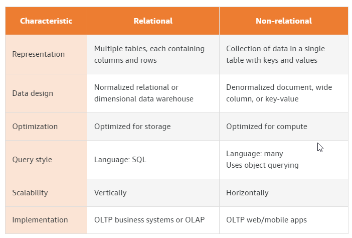
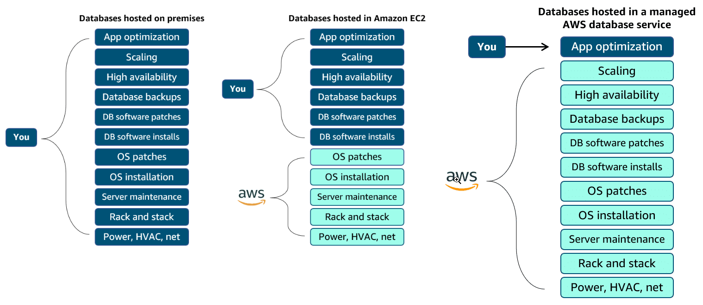
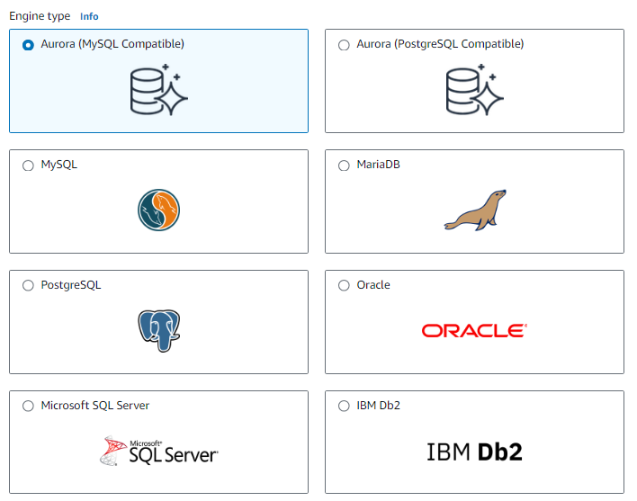
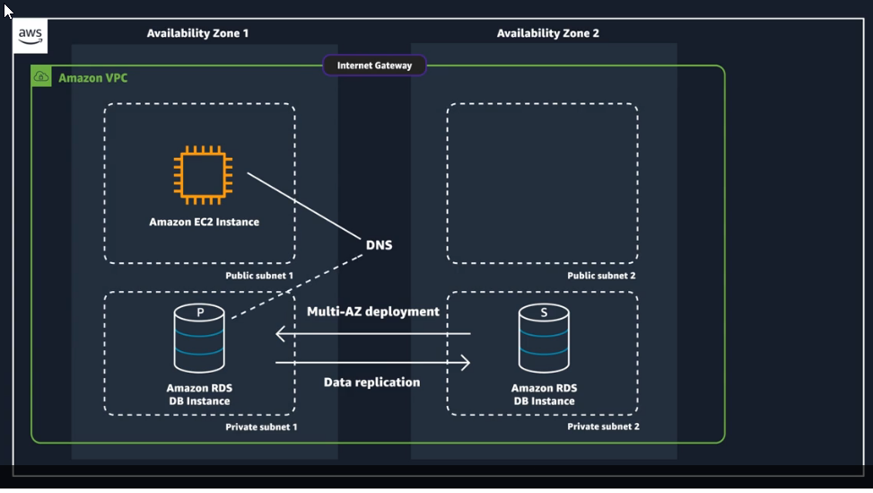
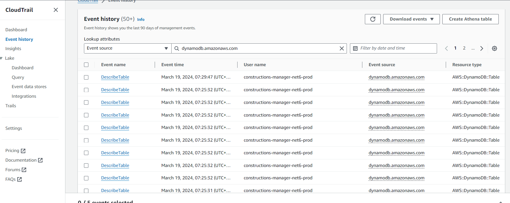
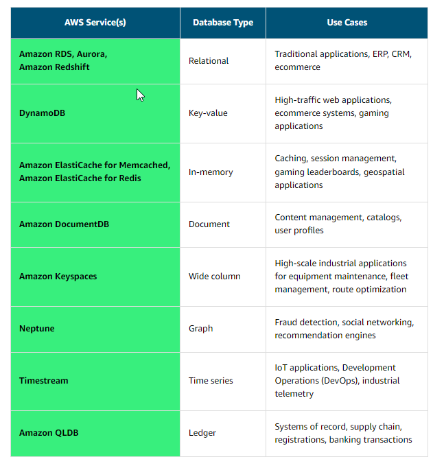

- [Comparing relational and non-relational databases](#comparing-relational-and-non-relational-databases)
- [Non-relational database types](#non-relational-database-types)
- [Unmanaged databases vs managed databases](#unmanaged-databases-vs-managed-databases)
- [OLTP vs OLAP](#oltp-vs-olap)
- [NoSQL Databases (non relational databases)](#nosql-databases-non-relational-databases)
  - [DynamoDB](#dynamodb)
    - [DynamoDB Accelerator - DAX](#dynamodb-accelerator---dax)
    - [DynamoDB Global Tables](#dynamodb-global-tables)
- [Amazon RDS (Relational Database Service)](#amazon-rds-relational-database-service)
  - [RDS Important points](#rds-important-points)
  - [RDS Instance Types](#rds-instance-types)
  - [Advantage over using RDS versus deploying DB on EC2](#advantage-over-using-rds-versus-deploying-db-on-ec2)
    - [Aurora (part of RDS)](#aurora-part-of-rds)
  - [RDS Deployments](#rds-deployments)
  - [Backup data](#backup-data)
    - [Automated backups](#automated-backups)
    - [Manual snapshots](#manual-snapshots)
  - [Security](#security)
- [Purpose-Built Databases](#purpose-built-databases)
  - [Amazon Keyspaces (for Apache Cassandra)](#amazon-keyspaces-for-apache-cassandra)
  - [DynamoDB](#dynamodb-1)
    - [DynamoDB security](#dynamodb-security)
  - [ElastiCache](#elasticache)
  - [Amazon MemoryDB for Redis](#amazon-memorydb-for-redis)
  - [Redshift](#redshift)
  - [Amazon EMR](#amazon-emr)
  - [Athena](#athena)
  - [QuickSight](#quicksight)
  - [DocumentDB](#documentdb)
  - [Neptune](#neptune)
  - [Amazon Timestream](#amazon-timestream)
  - [QLDB (Quantum Ledger Database)](#qldb-quantum-ledger-database)
  - [Amazon Managed Blockchain](#amazon-managed-blockchain)
  - [Glue](#glue)
    - [Glue Data Catalog](#glue-data-catalog)
- [Choosing the Right Database Service](#choosing-the-right-database-service)
- [DMS](#dms)

# Comparing relational and non-relational databases

# Non-relational database types

* **Key-value databases**: Key-value databases logically store data in a single table. Within the table, the values are associated with a specific key and stored in the form of blob objects without a predefined schema. The values can be of nearly any type.
  * Strengths
    * Very flexible
    * Able to handle a wide variety of data types
    * Keys are linked directly to their values with no need for indexing or complex join operations
    * Content of a key can easily be copied to other systems without reprogramming the data
  * Weaknesses
    * Analytical queries are difficult to perform due to the lack of joins
    * Access patterns need to be known in advance for optimum performance
* **Document databases**: Document stores keep files containing data as a series of elements. These files can be navigated using numerous languages including Python and Node.js. Each element is an instance of a person, place, thing, or event. For example, a document store may hold a series of log files from a set of servers. These log files can each contain the specifics for that system without concern for what the log files in other systems contain.
  * Strengths
    * Flexibility
    * No need to plan for a specific type of data when creating one
    * Easy to scale
  * Weaknesses
    * Sacrifice ACID compliance for flexibility
    * Databases cannot query across files natively
* **In-memory databases**: In-memory databases are used for applications that require real-time access to data. Most databases have areas of data that are frequently accessed but seldom updated. Additionally, querying a database is always slower and more expensive than locating a key in a key-value pair cache. Some database queries are especially expensive to perform. By caching such query results, you pay the price of the query once and then are able to quickly retrieve the data multiple times without having to re-execute the query.
  * Strengths
    * Support the most demanding applications requiring sub-millisecond response times
    * Great for caching, gaming, and session store
    * Adapt to changes in demands by scaling out and in without downtime
    * Provide ultrafast (sub-microsecond latency) and inexpensive access to copies of data
  * Weaknesses
    * Data that is rapidly changing or is seldom accessed
    * Application using the in-memory store has a low tolerance for stale data
* **Graph databases**: Graph databases store data as nodes, while edges store information on the relationships between nodes. Data within a graph database is queried using specific languages associated with the software tool you have implemented. Review the Understanding graph relationships section below for more information.
  * Strengths
    * Allow simple, fast retrieval of complex hierarchical structures
    * Great for real-time big data mining
    * Can rapidly identify common data points between nodes
    * Great for making relevant recommendations and allowing for rapid querying of those relationships
  * Weaknesses
    * Cannot adequately store transactional data
    * Analysts must learn new languages to query the data
    * Performing analytics on the data may not be as efficient as with other database types

# Unmanaged databases vs managed databases

# OLTP vs OLAP

**Online transaction processing (OLTP)** databases focus on recording Update, Insertion, and Deletion data transactions. OLTP queries are simple and short, which requires less time and space to process. A great example of an OLTP system is a bank ATM, in which you can modify your bank account using short transactions. 

**Online analytical processing (OLAP)** databases store historical **data that has been input by OLTP**. OLAP databases allow users to view **different summaries of multidimensional data**. Using OLAP, you can extract information from a large database and analyze it for decision-making. A good example of an **OLAP system is a business intelligence tool.**

Both are relational databases.

# NoSQL Databases (non relational databases)
## DynamoDB

* Fully managed HA with replication across 3 AZ
* Scales to massive workloads, distributed "serverless" database
* Millions of requests per seconds, trillions of row, 100s of TB of storage
* Fast and consistent in performance
* Single-digit millisecond latency - low latency retrieval
* Integrated with IAM for security, authorization and administration
* Low cost and auto scaling capabilities
* Standard and Infrequent Access (IA) Table Class
* Key/Value DB

### DynamoDB Accelerator - DAX

* Fully managed in-memory cache for DynamoDB
* It is not ElastiCache
* 10x performance improvement - single digit millisecond latency to microseconds latency - when accessing your DynamoDB tables
* Difference with ElastiCache at the CCP level: DAX is only used for and is integrated with DynamoDB, while ElastiCache can be used for other databases

### DynamoDB Global Tables

* Make a DynamoDB table accessible with low latency in multiple-regions
* Active-Active replication (read/write to any AWS region)

# Amazon RDS (Relational Database Service)

* PostgresSQL
* MySQL
* MariaDB
* Oracle
* Microsoft SQL Server
* IBM Db2

## RDS Important points

https://aws.amazon.com/rds/features/multi-az/

* RDS is not serverless database (for example DynamoDB is server less).
* RDS instances are optimized for memory, performance, or I/O, therefore the performance of AWS managed RDS instance is better than a customer-managed database instance.
* Amazon RDS Multi-AZ deployments provide enhanced availability and durability for RDS database (DB) instances, making them a natural fit for production database workloads. When you provision a **Multi-AZ DB Instance**, Amazon RDS **automatically creates a primary DB Instance and synchronously replicates the data to a standby instance in a different Availability Zone (AZ)**.
* Amazon RDS creates and saves automated backups of your DB instance or Multi-AZ DB cluster during the backup window of your database. https://docs.aws.amazon.com/AmazonRDS/latest/UserGuide/USER_WorkingWithAutomatedBackups.html
* DB instances for Amazon RDS for MySQL, MariaDB, PostgreSQL, Oracle, and Microsoft SQL Server use Amazon Elastic Block Store (Amazon EBS) volumes for database and log storage. https://docs.aws.amazon.com/AmazonRDS/latest/UserGuide/CHAP_Storage.html

## RDS Instance Types

* https://aws.amazon.com/rds/instance-types/
  * General Purpose
  * Memory Optimized
  * Instance Features
    * Burstable Performance Instances
    * Database Storage Options
    * EBS-optimized Instances
    * Enhanced Networking

## Advantage over using RDS versus deploying DB on EC2

RDS is managed service:
* Automated provisioning, OS patching
* Continuous backups and restore to specific timestamp (Point in Time Restore)
* Monitoring dashboards
* Read replicas for improved performance
* Multi AZ setup for DR (Disaster Recovery)
* Scaling capability (vertical and horizontal)
* Storage backed by EBS (gp2 or io 1)

**But you can`t SSH into your instances.**

### Aurora (part of RDS)
Aurora is AWS Proprietary database, not open source.

* **PostgreSQL and MySQL** are supported as Aurora DB.
  * See that [Redshift](https://github.com/kicaj29/aws/tree/main/Databases#redshift) is also based on PostgreSQL but it is used for OLAP and not OLTP
* It is "AWS cloud optimized" and claims 5x performance improvement over MySQL on RDS, over 3x the performance of Postgres on RDS.
* Storage will automatically grow in increments of 10GB, up to 64TB
* Aurora costs more than RDS (20% more) - but is more efficient
* Not in the free tier
* Automatic data replication across 6 facilities - so we have 6 copies at any given time
* Can deploy up to 15 read replicas
* Continuous backup to S3 - always available backup ready to restore
* Point-in-time recover

## RDS Deployments

**When you create a DB instance, you select the Amazon Virtual Private Cloud (Amazon VPC)** your databases will live in. Then, you select the subnets that will be designated for your DB. This is called a DB subnet group, and it has at least two Availability Zones in its Region. 

* **Read replicas**
  * Can create up to 5 read replicas for Oracle and SQL Server and up to 15 for MySQL, MariaDB and PostgreSQL, more [here](https://aws.amazon.com/rds/features/read-replicas/)
  * Data is only written to the main DB
  * Read Replicas are an example of horizontal scaling of resources
  * Read Replicas are used for **improved read performance**. You can also place your read replica in a different AWS Region closer to your users for better performance. **Using a cross-Region Read Replica** can also help ensure that you get back up and running if you experience a **regional availability issue in case of a disaster**.

* **Multi-AZ**
  * Failover in case AZ outage (HA)
  * Only one AZ as failover

* **Multi-region (read replicas)**
  * Disaster recover in case of region issue
  * Local performance for global reads
  * Replication cost

## Backup data

### Automated backups

* Automated backups are turned on by default. This backs up your entire DB instance (not just individual databases on the instance) and your transaction logs.
* **Retaining backups**: Automated backups are retained **between 0 and 35 days**. You might ask yourself, “Why set automated backups for 0 days?” The 0 days setting stops automated backups from happening. If you set it to 0, it will also delete all existing automated backups. This is not ideal. The benefit of automated backups that you can do point-in-time recovery.
* **Point-in-time recovery**: his creates a new DB instance using data restored from a specific point in time. This restoration method provides more granularity by restoring the full backup and rolling back transactions up to the specified time range

### Manual snapshots

If you want to keep your automated backups longer than 35 days, use manual snapshots. Manual snapshots are similar to taking Amazon EBS snapshots, except you manage them in the Amazon RDS console. These are backups that you can initiate at any time. They exist until you delete them.

## Security

* Network ACLs and security groups help users dictate the flow of traffic.
* If you want to restrict the actions and resources others can access, you can use AWS Identity and Access Management (IAM) policies
  * For example you can determine whe can create, describe, modify and delete DB instances, tag resources, or modify security groups.
* [Controlling access with security groups](https://docs.aws.amazon.com/AmazonRDS/latest/UserGuide/Overview.RDSSecurityGroups.html)

# Purpose-Built Databases

## Amazon Keyspaces (for Apache Cassandra)

* Scalable, highly available, and managed Apache Cassandra compatible database service
* Apache Cassandra is a popular option for high-scale applications that need top-tier performance
  * Cassandra is a NoSQL distributed database
  * Counted among their strengths are horizontal scalability, distributed architectures, and a flexible approach to schema definition
* Amazon Keyspaces is a good option for high-volume applications with straightforward access patterns

## DynamoDB

* Fully managed NoSQL database that provides fast, consistent performance at any scale
* DynamoDB has become the database of choice for two categories of applications: high-scale applications and serverless applications.
* Key-value pair tables.
* Charges based on the usage of the table and the amount of data that you are reading from the table, not by the hour or by the second

### DynamoDB security

* All user data stored in DynamoDB is fully encrypted at rest. DynamoDB encryption at rest provides enhanced security by encrypting all your data at rest using encryption keys stored in AWS Key Management Service (AWS KMS).
* IAM administrators control who can be authenticated and authorized to use DynamoDB resources. You can use IAM to manage access permissions and implement security policies.
* As a managed service, DynamoDB is protected by the AWS global network security procedures.
* When activity occurs in DynamoDB, that activity is recorded in a CloudTrail event. For ongoing record of events in DynamoDB and in your AWS account, create a trail to deliver log files to an S3 bucket. CloudTrail events are generated automatically, no need to enable it.
  

## ElastiCache

* https://github.com/kicaj29/aws/tree/main/DatabasesElastiCache

## Amazon MemoryDB for Redis

* MemoryDB is a Redis-compatible, **durable**, in-memory database service that delivers ultra-fast performance
* You can use MemoryDB as a fully managed, primary database to build high-performance applications.

## Redshift

https://aws.amazon.com/redshift/faqs/

* Is based on PostgreSQL, but it is not used for OLTP (Online transaction processing)
* It is OLAP - online **analytical** processing (analytics and data warehousing)
  * See that [Aurora](https://github.com/kicaj29/aws/tree/main/Databases#aurora-part-of-rds) is also based on PostgreSQL but it is used for OLTP and not OLAP
* Load data once every hour, not every second
* 10x better performance than other data warehouses, scales to PBs of data
* Columnar storage of data (instead of row based)
* Massively Parallel Query Execution (MPP), HA
* Pay as you go based on the instances provisioned
* Has a SQL interface for performing the queries
* BI tools such as AWS Quicksight or Tableau integrate with it
* It is highly available: customers can now improve availability of Redshift by running their data warehouse in a multi-AZ deployment

## Amazon EMR

* Stands for "Elastic MapReduce"
* EMR helps creating **Hadoop** clusters (Big Data) to analyze and process vast amount of data
* The clusters can be made of hundreds of EC2 instances
* Also supports Apache, Spark, HBase, Presto, Flink,...
* EMR takes care of all the provisioning configuration
* Auto-scaling and integrated with Spot instances
* Use cases: data processing, machine learning, web indexing, big data

## Athena

* Serverless query service to perform analytics again S3 objects
* Use standard SQL language to query the files
* Supports: CSV, JSON, ORC, Avro and Parquet (build on Presto)
* Pricing: $500 per TB of data scanned
* Use compressed or columnar data for cost savings (less scan)
* Use cases: business intelligence, analytics, reporting, analyze & query VPC Flow Logs, ELB Logs, CloudTrails etc.
*** Exam tip: analyze data in S3 using serverless SQL, use Athena**

## QuickSight
* Serverless **machine learning-powered business intelligence** service to create interactive dashboards
* Fast, automatically scalable, embeddable
* Use cases
  * BA
  * Building visualizations
  * Perform ad-hoc analysis
  * Get business insights using data
* Integrated with: RDS, Aurora, Athena, Redshift, S3...
* **Can be also used to visual AWS costs**

## DocumentDB

* Aurora is as "AWS-implementation" of PostgresSQL/MySQL
* DocumentDB is the same for **MongoDB**
* Fully managed, HA with replication across 3 AZ
* Storage automatically grows in increments of 10GB, up to 64TB
* Automatically scales to workloads with millions of requests per seconds
* Great for content management system

## Neptune

* Fully managed graph database
* A popular graph dataset would be a social network
  * Users have friends
  * Posts have comments
  * Comments have likes from users
  * Users share and like posts...
* HA across 3 AZ, with pu to 15 read replicas
* Build and run applications working with highly connected datasets - optimized for these complex and hard queries
* Can store up to billions of relations and query the graph with milliseconds latency
* HA with replications across multiple AZs
* Great for knowledge graphs (Wikipedia), fraud detection, recommendation engines, social networking

## Amazon Timestream

* Fast, scalable, and serverless time series database service for Internet of Things (IoT) and operational applications
* It makes it easy to store and analyze trillions of events per day up to 1,000 times faster and for as little as one-tenth of the cost of relational databases
* Time series data is a sequence of data points recorded over a time interval
* It is used for measuring events that change over time, such as stock prices over time or temperature measurements over time

## QLDB (Quantum Ledger Database)

* A ledger is a book recording financial transactions
* Fully managed, serverless, HA, replication across 3 AZ
* Used to review history of all the changes made to your application data over time
* Immutable system: no entry can be removed or modified, cryptographically verifiable
* 2-3x better performance than common ledger blockchain frameworks

* Manipulate data using SQL
* Difference with Amazon Managed Blockchain: **no decentralization component**, in accordance with financial regulations rules

## Amazon Managed Blockchain

* Blockchain makes it possible to build applications where multiple parties can execute transactions **without the need for a trusted, central authority.**
* Can be used to:
  * Join public blockchain networks
  * Or create your own scalable private network
* Compatible with the frameworks Hyperledger Fabric and Ethereum
* It is decentralized

## Glue

* Managed extract, transform, and load (ETL) service
* Useful to prepare and transform data for analytics
* Fully serverless service

### Glue Data Catalog

* Catalog of datasets in AWS infrastructure (column names, field name, field type, etc.)
* Can be used by Athena, Redshift, EMR

# Choosing the Right Database Service

# DMS

* **Database Migration Service**
* Quick and securely migrate databases to AWS, resilient, self healing
* The source database remains available during the migration
* Basic use cases
  * Homogeneous migrations: ex Oracle to Oracle
  * Heterogeneous migrations: ex Microsoft SQL Server to Aurora, for this is needed https://aws.amazon.com/dms/schema-conversion-tool/
* Other use cases
  * Development and test database migrations - migrate data to test application against production data without affecting production users
  * Database consolidation - combining several databases into a single database
  * Continuous replication - sending ongoing copies of your data to other target sources instead of doing a one-time migration

