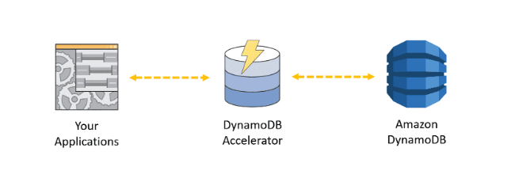

- [Introduction](#introduction)
- [Consistency](#consistency)
- [Read and Write Capacity Units](#read-and-write-capacity-units)
- [Basic Item Requests](#basic-item-requests)
- [Secondary Indexes](#secondary-indexes)
  - [Local Secondary Indexes](#local-secondary-indexes)
  - [Global Secondary Indexes](#global-secondary-indexes)
- [DynamoDB Streams](#dynamodb-streams)
- [Operating Amazon DynamoDB](#operating-amazon-dynamodb)
  - [Build Resilient Client Behavior](#build-resilient-client-behavior)
  - [Tune Retries](#tune-retries)
  - [Handle Errors in Batch Operations](#handle-errors-in-batch-operations)
  - [DynamoDB Auto Scaling](#dynamodb-auto-scaling)
  - [Global Tables](#global-tables)
    - [Expiring Items with TTL](#expiring-items-with-ttl)
  - [Access Control](#access-control)
  - [Amazon DynamoDB Accelerator (DAX)](#amazon-dynamodb-accelerator-dax)
  - [Backup and Restore](#backup-and-restore)
  - [Monitoring and Troubleshooting](#monitoring-and-troubleshooting)
- [Design Considerations](#design-considerations)
  - [Design for Uniform Workload](#design-for-uniform-workload)
  - [Hot and cold data](#hot-and-cold-data)
  - [Manage Large Attributes](#manage-large-attributes)
  - [Use Indexes Thoughtfully](#use-indexes-thoughtfully)
  - [Use Optimistic Locking with Version Number](#use-optimistic-locking-with-version-number)
  - [Use One-to-many Tables Instead of a Large Number of Attributes](#use-one-to-many-tables-instead-of-a-large-number-of-attributes)
  - [Store Frequently Accessed Small Attributes in a Separate Table](#store-frequently-accessed-small-attributes-in-a-separate-table)
  - [Options for Migrating an Existing Data to DynamoDB](#options-for-migrating-an-existing-data-to-dynamodb)
    - [Live Migration](#live-migration)
    - [AWS Data Migration Service (DMS)](#aws-data-migration-service-dms)
- [Resources](#resources)

# Introduction

* DynamoDB is designed for OLTP

# Consistency

Consistency is the ability to read data with the understanding that all prior writes will be reflected in the results returned. **Reads can be “strongly” consistent or “eventually” consistent**.  Let's  walk through an example of the difference with the diagram below.

* The client writes an update to Key1, and it is durable persisted. The copy in AZ A is one of those written to immediately. The copu in AZ B has not yet been replicated.

    

* When a client wants to read the item an **eventually consistency read request (this is default behavior)**, DynamoDB may choose to route the request to either of AZ copies shown - the returned result may be the updated value "B", or it may be the stale value "A".

    

* In the strong consistent read request scenario, DynamoDB ensures that the request is routed to an AZ copy that is known to have the lates updates.

    

    It’s tempting to want to use strongly consistent reads all the time – but DynamoDB charges more for them because the work is concentrated on a smaller number of replicated copies. Also, there is the chance that in some failure scenarios, SC reads may be briefly unavailable. Finally, a SC read may not inherently provide the kinds of assurances you think it might – it is not a locking mechanism. If you make a SC read and then come back to write to the same item based on the data you read, you might find that another client made a different update in the interim.

# Read and Write Capacity Units

You must specify read and write throughput values when you create a table. DynamoDB reserves the necessary resources to handle your throughput requirements and divides the throughput evenly among partitions. 

* **Read** capacity units (RCU) - the number of strongly consistent reads **per second** of items up to 4 KB in size
  * Eventually consistency consumes half as many RCUs
* **Write** capacity units (WCU) -  the number of 1 KB writes **per second**
  * Note that updating a **single attribute in an item requires writing the entire item**. Your throughput is generally evenly divided among your partitions – so it is important to design for requests which are evenly distributed across your keys.

DynamoDB has features called **Burst** (which is like carry-over minutes on a cellular plan), and **Adaptive Capacity** (which is intelligent compensation allowing you to “borrow” unused throughput from less active keys to cover the needs of a key which is busier).

Be aware that a **single item can never be read at more than 3000 RCU**, **or written at more than 1000 WCU** (or a linear combination of the two).

# Basic Item Requests

* Write
  * **PutItem** – Write item to specified primary key.
  * **UpdateItem** – Change attributes for item with specified primary key.
  * **BatchWriteItem** – Write bunch of items to the specified primary keys.
  * **DeleteItem** – Remove item associated with specified primary key.
* Read
  * **GetItem** – Retrieve item associated with specified primary key.
  * **BatchGetItem** – Retrieve items with this bunch of specified primary keys.
  * **Query** – For specified **partition key**, retrieve items matching **sort key** expression (forward/reverse order).
  * **Scan** – Give me every item in my table.

# Secondary Indexes

## Local Secondary Indexes

* Index is local to a partition key. An LSI **always has the same partition key as the base table**. They live on the same partitions with the base table, and they share the provisioned capacity of the base table.
  * The partition key is the same as the table’s partition key. The sort key can be any scalar attribute.
* **Allows you to query items with the same partition key – specified with the query.** All the items with a particular partition key in the table and the items in the corresponding local secondary index (together known as an item collection) are stored on the same partition. The total size of an item collection cannot exceed 10 GB.
* Can only be created when a table is created and cannot be deleted.
* Supports eventual consistency and strong consistency.
* Does not have its own provisioned throughput.
* **Queries can return attributes that are not projected into the index.**

## Global Secondary Indexes

* Index is across all partition keys
  * Think of a GSI as another completely separate table that DynamoDB replicates to from the base table.
* **Allows you to query over the entire table, across all partitions**
* Can have a partition key and optional sort key that are different from the partition key and sort key of the original table.
* Key values do not need to be unique.
* Can be created when a table is created or can be added to an existing table and it can be deleted.
* **Supports eventual consistency only.**
* Has its own provisioned throughput settings for read and write operations.
* **Queries only return attributes that are projected into the index.**

# DynamoDB Streams

A DynamoDB stream is an ordered flow of information about changes to a table. The records in the stream are strictly in the order in which the changes occurred. Each change contains exactly one stream record. A stream record is available for 24 hours.

DynamoDB streams are a lot like Kinesis streams – in fact, they are compatible with the Kinesis Client Library. All writes to the table are recorded in the stream – **like a changelog**.

Example:  an application makes changes to user preferences that are stored in a DynamoDB table. Another application such as an ad server responds to changes in user preferences and presents different advertisements. The ad server application can read information about changes from the DynamoDB stream and present advertisements corresponding to the new preferences.

# Operating Amazon DynamoDB

## Build Resilient Client Behavior

Handle 400 and 500 error codes gracefully to ensure a smooth customer experience.
For some 400 errors, you should fix the issue before re-submitting the request. For example:

* There was a problem with the request.
* Some required parameters were missing.

For other 400 errors, you can retry until the request succeeds. For example:

* Provisioned throughput was exceeded.

You can retry 500 errors until the request succeeds. For example:

* An internal server error occurred.
* The service was unavailable.

## Tune Retries

AWS SDKs have built-in retry logic, with reasonable defaults.
Tune for your use case to minimize visibility and hasten recovery for:

* Limits on retry attempts
* Timeouts
* Exponential back-off and jitter

## Handle Errors in Batch Operations

Think of BatchGetItem and BatchWriteItem as simple wrappers around GetItem and PutItem/DeleteItem.
Use returned information about unprocessed items (BatchGetItem: UnprocessedKeys, BatchWriteItem: UnprocessedItems) in the batch to create your own retry logic - be sure to implement exponential back-off in your application.

Batch operations can read or write items from one or more tables and individual requests in a batch operation may fail. The most likely reason for failure is that the table in question does not have enough provisioned read or write capacity.

Use the information about failed tables and items to retry the batch operation with exponential backoff.

## DynamoDB Auto Scaling

Many tables have seasonality in their loads – perhaps even with a regular ebb and flow of traffic through a business day. **Auto Scaling is enabled by default**, and using it everywhere is highly recommended.
RCU and WCU are managed separately, and you set a minimum, a maximum, and a target utilization (in percent) for each.   

Auto Scaling is reactive and takes a little time to recognize the pattern in your metrics – it cannot instantly react to cover a sudden spike without some throttling. **The target utilization** setting can help with this – take a look at the history of your consumption, assess the spiky behavior, and set a target utilization which allows Auto Scaling to maintain an appropriate buffer.

## Global Tables

Amazon DynamoDB global tables provide a fully managed solution for deploying a multi-region, multi-master database, without having to build and maintain your own replication solution. When you create a global table, you specify the AWS regions where you want the table to be available. DynamoDB performs all of the necessary tasks to create identical tables in these regions, and propagate ongoing data changes to all of them.   

Cross-region strong consistency is not possible – if you want strongly consistent read-after-write you will need to direct clients to read from the same region as they are writing.   

For some use cases, you may wish to use a second region as a warm failover target in case of a regional disaster. Or where you do not have high concurrency for a single item across multiple regions, you can use geo-routing to bring global clients to whichever global endpoint is closest.   

Imagine an application where each item represents a user’s profile. Since the user is unlikely to be updating this from multiple places at the same time, you can direct their traffic to the nearest copy of the table – they’ll enjoy a low latency experience anywhere they may travel.    

Global tables in each region need to have sufficient write capacity to carry all global writes – this is to accommodate the replicated traffic. Keep this in mind when provisioning – Auto Scaling is highly recommended. 

In this slide, we can see an example of last-write-wins with eventual consistency. We’re operating a two-region Global Table (Replica 1 and Replica 2) and it contains an item which records monitored status of a microservice the company operates.

There are monitors running in both regions. At 11:21 AM and 3 seconds, the microservice appears down (status “red”) from the Replica 1 region. At 11:21 AM and 4 seconds, the microservice appears up (status “green”) from the Replica 2 region.   

When the red status update from Replica 1 reaches Replica 2, it does not overwrite the green status, because the associated timestamp shows that it is stale. All the regions converge towards the latest update, status “green.”

### Expiring Items with TTL

If items in your table lose relevance with time, you can expire the old items to keep your storage cost low and your RCU consumption efficient.   

Rather than paying for the WCU required to delete the items you can have DynamoDB take care of it for you for free using the time-to-live (or TTL) feature. You can configure a particular attribute name as your expiry flag – any item which has that attribute is eligible for expiry.   

The attribute should contain a number representing the time after which deletion is allowed – this time should be in epoch format. Within a day or two of passing that expiry time, DynamoDB will delete the item for you – no WCUs are consumed.   

If it’s important to your application to immediately ignore items which are past their expiry time, you can check the epoch time retrieved with any items against current time and handle them accordingly.   

One great pattern with TTL is to move expiring items into “cold” storage such as S3. You can do this with streams – the TTL delete is written to the stream with a record of the item which was deleted. You can read these expired item entries from the stream and write it to S3 (via Kinesis Firehose) – using triggers for a Lambda function which handles this transition is a very popular pattern.   

## Access Control

DynamoDB is tightly integrated with Identity and Access Management (or IAM). You can use fine-grained control to prevent unauthorized access to your tables down to individual items and even individual attributes.   

Recommended best practice is to apply the principle of **least privilege** – only allow users and roles the access they strictly require.   
**Another best practice for clients which are all in a VPC is to use a VPC Endpoint** – this gives you a target DynamoDB endpoint within your VPC and prevents your traffic from having to traverse the public routed Internet using public addressing. You may be able to maintain greater isolation for your VPC this way.

## Amazon DynamoDB Accelerator (DAX)

DAX is a DynamoDB-compatible caching service that enables you to benefit from fast in-memory performance for demanding applications. 
DAX addresses three core scenarios:

* Reduce response times of **eventually-consistent** read workloads by an order of magnitude
* Reduce operational and application complexity through a managed service that is API-compatible with Amazon DynamoDB.  
* Increase throughput for read-heavy or bursty workloads.

DAX is a highly-available cluster of nodes **accessible only in your VPC**. **DAX is a write-through cache**, which means that items and updates written through the cache are automatically made available for the next time you make an Eventually Consistent read. Strongly Consistent reads are not cached.

Using a DAX cache can dramatically decrease the amount of RCUs required on your table and smooths out spiky and imbalanced read loads. It also reduces DynamoDB’s already-fast single-digit millisecond response time to sub-millisecond. 

## Backup and Restore

Two types of backups are available – **on-demand** (takes a backup whenever you request it) and **point-in-time** recovery (or PITR).

* **PITR** keeps a 35-day rolling window of information about your table – you can recover to any second within that 35 days.
* On-demand backups are almost instant. Each time you create an on-demand backup, the entire table data is backed up.
* Neither type of backup consumes any capacity from your table

Restore is made to a new table (or you can delete the original table first). Typically customers will want to restore to a separate table where they can look at the data to compare it with the current items – perhaps using this to selectively repair unintended changes which have been made in the table.   

Alternatively, you can reconfigure clients to access a different table name. Restore times vary by partition density, but most restores will complete in well under 10hrs.   

This time does not scale linearly with your total table size – partitioned data is restored in parallel. For most production tables, PITR is a smart choice – and you can supplement this with on-demand backups for longer-term storage.   

## Monitoring and Troubleshooting

* Check the AWS error code returned from your operations and include in your application logs.
* Enable CloudTrail so that DynamoDB control operations (create table, update table, etc.) are available for later analysis.
* Use the CloudWatch metrics provided by DynamoDB to monitor table performance.
* Set alarms for pertinent metrics out of acceptable range. Recommended alarms
  * SuccessfulRequestLatency
  * Throttling Events
  * Capacity Consumption
  * User Errors
  * System Errors

# Design Considerations

## Design for Uniform Workload

The partition key determines the distribution of data across the partitions where data is stored. The total throughput provisioned for a table is divided equally across partitions.   

When you make a large number of consecutive reads or consecutive writes to a narrow range of partition keys, the same partitions are accessed repeatedly (hot partitions). The throughput allocated to remaining partitions remains unused.    

To achieve maximum read and write throughput, implement your read and write operations as follows:

* Choose the partition key carefully to avoid hot spots.
* Consider concatenating a random number or a calculated value to the partition key when writing data to ensure distribution of partition keys. For example, you might concatenate the sum of the ASCII values of each character in the partition key.
* Distribute reads and writes across multiple partitions.

## Hot and cold data

Consider access patterns for your data. For example, you might have an Orders table with a partition key of customer id and sort key of timestamp. Your application probably accesses the latest order data most of the time. It might rarely access data about very old orders.

In such cases, consider breaking the time series data into separate tables. Store the frequently accessed “hot” data in a separate table with higher throughput. Store rarely accessed “cold” data in tables with lower throughput.

You can even move the old data to other storage options such as an Amazon S3 bucket and delete the table that contains the old data.

## Manage Large Attributes

Ideally you want to keep items small, and DynamoDB imposes limits on the size of an item.  There are several ways to address this:

* Consider storing large attribute values in Amazon S3.
* Compress large values before storing in DynamoDB.
* Break up large attributes across multiple items.
  

## Use Indexes Thoughtfully

**Local secondary indexes** consume storage and the table's provisioned throughput. Keep the size of the index as small as possible.

* Use indexes sparingly.
* Choose projections carefully.
* Project only those attributes that you request frequently. 
* Take advantage of sparse indexes.

**GSI (Global Secondary Indexes)** acts like any other table - choose a partition key and sort key that will distribute reads across multiple partitions.

* Take advantage of sparse indexes.
* Create a global secondary index with a subset of table’s attributes for quick lookups.
* Use as an eventually consistent read replica.

## Use Optimistic Locking with Version Number

Use optimistic locking with a version number as described below to make sure that an item has not changed since the last time you read it. This approach is also known as the read-modify-write design pattern or optimistic concurrency control.

## Use One-to-many Tables Instead of a Large Number of Attributes

If your table has items that store a large number of values in an attribute of set type, such as string set or number set, consider removing the set attribute from the table and splitting it as separate items in another table.

For example, if you have a table that stores threads in a forum and replies as a string set in each item, the item size is likely to exceed the maximum item size, and throughput will be reduced because you will unnecessarily fetch large amounts of data even if you only need minimum information such as the thread subject.

## Store Frequently Accessed Small Attributes in a Separate Table

If you frequently access large items in a table but do not use the large attribute values, consider storing frequently accessed smaller attributes in a separate table. For example, consider the Company table. It has fairly large attributes such as company information, mission statement, and logo. These attributes are fairly static and rarely accessed.

## Options for Migrating an Existing Data to DynamoDB

### Live Migration

* Create DynamoDB table(s).
* Modify application to write to both source and DynamoDB.
* Perform a back-fill.
* Verify.
* Modify application to read from DynamoDB.
* Modify application to write to DynamoDB only.
* Shut down deprecated datastore.    

For exporting, transforming and importing data (such as for a back-fill), there are a number of popular options you can consider: AWS Data Pipeline, AWS Glue, and Amazon EMR with Hive (using the DynamoDB connector).

### AWS Data Migration Service (DMS)

DMS is a service which can move data from a source (Cassandra, MongoDB, and a number of relational databases) to DynamoDB.

DMS can be used to make an initial copy of the full dataset, and then continue to update DynamoDB tables with any ongoing changes. When you are comfortable that the application is ready to make the switch, you deploy a new version of your software which uses the SDK to connect to DynamoDB instead.

Remember that this is an opportunity to optimize your design – you will want to remodel your data to better fit the DynamoDB service – particularly if migrating from a relational database.

# Resources

* https://www.alexdebrie.com/posts/dynamodb-partitions/
* http://docs.aws.amazon.com/general/latest/gr/api-retries.htm
* http://docs.aws.amazon.com/amazondynamodb/latest/APIReference/API_BatchGetItem.html
* http://docs.aws.amazon.com/amazondynamodb/latest/APIReference/API_BatchWriteItem.html
* http://docs.aws.amazon.com/amazondynamodb/latest/developerguide/UsingIAMWithDDB.html
* http://docs.aws.amazon.com/amazondynamodb/latest/developerguide/ErrorHandling.html