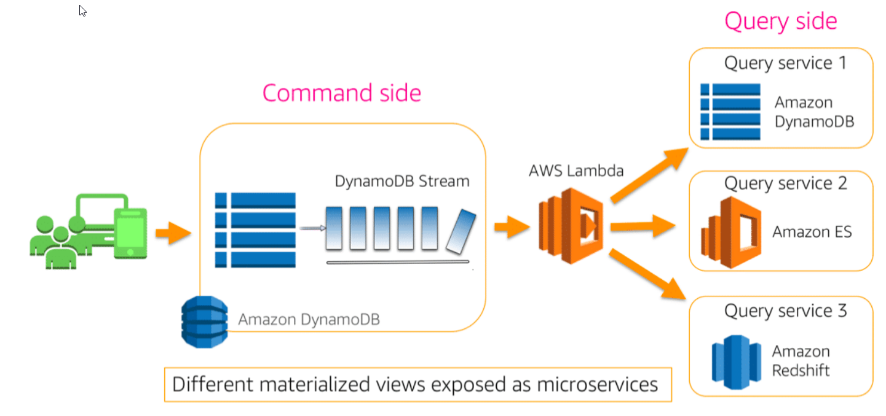
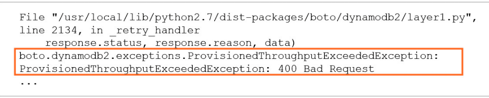

- [Introduction](#introduction)
- [Consistency](#consistency)
- [Read and Write Capacity Units](#read-and-write-capacity-units)
- [Basic Item Requests](#basic-item-requests)
- [Secondary Indexes](#secondary-indexes)
  - [Local Secondary Indexes](#local-secondary-indexes)
  - [Global Secondary Indexes](#global-secondary-indexes)
- [DynamoDB Streams](#dynamodb-streams)
- [Operating Amazon DynamoDB](#operating-amazon-dynamodb)
  - [Build Resilient Client Behavior](#build-resilient-client-behavior)
  - [Tune Retries](#tune-retries)
  - [Handle Errors in Batch Operations](#handle-errors-in-batch-operations)
  - [DynamoDB Auto Scaling](#dynamodb-auto-scaling)
  - [Global Tables](#global-tables)
    - [Expiring Items with TTL](#expiring-items-with-ttl)
  - [Access Control](#access-control)
  - [Amazon DynamoDB Accelerator (DAX)](#amazon-dynamodb-accelerator-dax)
  - [Backup and Restore](#backup-and-restore)
  - [Monitoring and Troubleshooting](#monitoring-and-troubleshooting)
- [Design Considerations](#design-considerations)
  - [Design for Uniform Workload](#design-for-uniform-workload)
  - [Hot and cold data](#hot-and-cold-data)
  - [Manage Large Attributes](#manage-large-attributes)
  - [Use Indexes Thoughtfully](#use-indexes-thoughtfully)
  - [Use Optimistic Locking with Version Number](#use-optimistic-locking-with-version-number)
  - [Use One-to-many Tables Instead of a Large Number of Attributes](#use-one-to-many-tables-instead-of-a-large-number-of-attributes)
  - [Store Frequently Accessed Small Attributes in a Separate Table](#store-frequently-accessed-small-attributes-in-a-separate-table)
  - [Options for Migrating an Existing Data to DynamoDB](#options-for-migrating-an-existing-data-to-dynamodb)
    - [Live Migration](#live-migration)
    - [AWS Data Migration Service (DMS)](#aws-data-migration-service-dms)
- [Serverless Architecture Patterns Overview](#serverless-architecture-patterns-overview)
  - [DynamoDB Streams and AWS Lambda](#dynamodb-streams-and-aws-lambda)
  - [Querying in Microservice Architectures](#querying-in-microservice-architectures)
  - [Time Series Data Example](#time-series-data-example)
- [Troubleshooting: Amazon DynamoDB](#troubleshooting-amazon-dynamodb)
  - [What are the important concepts and terminology?](#what-are-the-important-concepts-and-terminology)
  - [Logging DynamoDB operations using CloudTrail](#logging-dynamodb-operations-using-cloudtrail)
    - [Example CloudTail trail](#example-cloudtail-trail)
    - [CloudTrail event history](#cloudtrail-event-history)
    - [CloudWatch log group for DynamoDB](#cloudwatch-log-group-for-dynamodb)
  - [Monitoring DynamoDB](#monitoring-dynamodb)
    - [Accessing table metrics from the DynamoDB console](#accessing-table-metrics-from-the-dynamodb-console)
    - [Accessing DynamoDB table metrics in the CloudWatch console](#accessing-dynamodb-table-metrics-in-the-cloudwatch-console)
    - [Why are the metrics on the DynamoDB console different from the CloudWatch metrics?](#why-are-the-metrics-on-the-dynamodb-console-different-from-the-cloudwatch-metrics)
    - [Creating CloudWatch alarms to monitor DynamoDB](#creating-cloudwatch-alarms-to-monitor-dynamodb)
    - [Accessing custom alarms in the DynamoDB console](#accessing-custom-alarms-in-the-dynamodb-console)
    - [What are auto scaling alarms?](#what-are-auto-scaling-alarms)
    - [Contributor Insights for DynamoDB](#contributor-insights-for-dynamodb)
      - [Accessing CloudWatch Contributor Insights from the CloudWatch console](#accessing-cloudwatch-contributor-insights-from-the-cloudwatch-console)
  - [Troubleshooting DynamoDB Tables That Are Throttled](#troubleshooting-dynamodb-tables-that-are-throttled)
    - [Table has enough provisioned capacity, but most requests are throttled](#table-has-enough-provisioned-capacity-but-most-requests-are-throttled)
    - [Application Auto Scaling is set up, but your table is still throttled](#application-auto-scaling-is-set-up-but-your-table-is-still-throttled)
    - [Your table uses the on-demand capacity mode but still throttled](#your-table-uses-the-on-demand-capacity-mode-but-still-throttled)
    - [You have a hot partition in your table](#you-have-a-hot-partition-in-your-table)
    - [Why is my on-demand DynamoDB table being throttled?](#why-is-my-on-demand-dynamodb-table-being-throttled)
    - [How can I troubleshoot DynamoDB table throttling?](#how-can-i-troubleshoot-dynamodb-table-throttling)
  - [Troubleshooting Observed Latency in DynamoDB](#troubleshooting-observed-latency-in-dynamodb)
    - [Reduce the request timeout settings](#reduce-the-request-timeout-settings)
    - [Reduce distance between client and DynamoDB endpoint](#reduce-distance-between-client-and-dynamodb-endpoint)
    - [Use caching](#use-caching)
    - [Send constant traffic or reuse connections](#send-constant-traffic-or-reuse-connections)
    - [Use eventually consistent reads](#use-eventually-consistent-reads)
    - [Troubleshooting scenario: Observed latency in DynamoDB](#troubleshooting-scenario-observed-latency-in-dynamodb)
    - [How do I resolve HTTP 5xx errors in DynamoDB?](#how-do-i-resolve-http-5xx-errors-in-dynamodb)
  - [Troubleshooting Issues with DynamoDB Auto Scaling](#troubleshooting-issues-with-dynamodb-auto-scaling)
    - [How does DynamoDB auto scaling work?](#how-does-dynamodb-auto-scaling-work)
    - [How do I resolve issues with DynamoDB auto scaling?](#how-do-i-resolve-issues-with-dynamodb-auto-scaling)
- [Notes from AWS PartnerCast](#notes-from-aws-partnercast)
- [Resources](#resources)

# Introduction

* DynamoDB is designed for OLTP

# Consistency

Consistency is the ability to read data with the understanding that all prior writes will be reflected in the results returned. **Reads can be “strongly” consistent or “eventually” consistent**.  Let's  walk through an example of the difference with the diagram below.

* The client writes an update to Key1, and it is durable persisted. The copy in AZ A is one of those written to immediately. The copu in AZ B has not yet been replicated.

    

* When a client wants to read the item an **eventually consistency read request (this is default behavior)**, DynamoDB may choose to route the request to either of AZ copies shown - the returned result may be the updated value "B", or it may be the stale value "A".

    

* In the strong consistent read request scenario, DynamoDB ensures that the request is routed to an AZ copy that is known to have the lates updates.

    

    It’s tempting to want to use strongly consistent reads all the time – but DynamoDB charges more for them because the work is concentrated on a smaller number of replicated copies. Also, there is the chance that in some failure scenarios, SC reads may be briefly unavailable. Finally, a SC read may not inherently provide the kinds of assurances you think it might – it is not a locking mechanism. If you make a SC read and then come back to write to the same item based on the data you read, you might find that another client made a different update in the interim.

# Read and Write Capacity Units

You must specify read and write throughput values when you create a table. DynamoDB reserves the necessary resources to handle your throughput requirements and divides the throughput evenly among partitions. 

* **Read** capacity units (RCU) - the number of **strongly consistent** reads **per second** of items up to 4 KB in size
  * Eventually consistency consumes half as many RCUs
* **Write** capacity units (WCU) -  the number of 1 KB writes **per second**
  * Note that updating a **single attribute in an item requires writing the entire item**. Your throughput is generally evenly divided among your partitions – so it is important to design for requests which are evenly distributed across your keys.

DynamoDB has features called **Burst** (which is like carry-over minutes on a cellular plan), and **Adaptive Capacity** (which is intelligent compensation allowing you to “borrow” unused throughput from less active keys to cover the needs of a key which is busier).

Be aware that a **single item can never be read at more than 3000 RCU**, **or written at more than 1000 WCU** (or a linear combination of the two).

# Basic Item Requests

* Write
  * **PutItem** – Write item to specified primary key.
  * **UpdateItem** – Change attributes for item with specified primary key.
  * **BatchWriteItem** – Write bunch of items to the specified primary keys.
  * **DeleteItem** – Remove item associated with specified primary key.
* Read
  * **GetItem** – Retrieve item associated with specified primary key.
  * **BatchGetItem** – Retrieve items with this bunch of specified primary keys.
  * **Query** – For specified **partition key**, retrieve items matching **sort key** expression (forward/reverse order).
  * **Scan** – Give me every item in my table.

# Secondary Indexes

## Local Secondary Indexes

* Index is local to a partition key. An LSI **always has the same partition key as the base table**. They live on the same partitions with the base table, and they share the provisioned capacity of the base table.
  * The partition key is the same as the table’s partition key. The sort key can be any scalar attribute.
* **Allows you to query items with the same partition key – specified with the query.** All the items with a particular partition key in the table and the items in the corresponding local secondary index (together known as an item collection) are stored on the same partition. The total size of an item collection cannot exceed 10 GB.
* Can only be created when a table is created and cannot be deleted.
* Supports eventual consistency and strong consistency.
* Does not have its own provisioned throughput.
* **Queries can return attributes that are not projected into the index.**


## Global Secondary Indexes

* Index is across all partition keys
  * Think of a GSI as another completely separate table that DynamoDB replicates to from the base table.
* **Allows you to query over the entire table, across all partitions**
* Can have a partition key and optional sort key that are different from the partition key and sort key of the original table.
* Key values do not need to be unique.
* Can be created when a table is created or can be added to an existing table and it can be deleted.
* **Supports eventual consistency only.**
* Has its own provisioned throughput settings for read and write operations.
* **Queries only return attributes that are projected into the index.**


# DynamoDB Streams

A DynamoDB stream is an ordered flow of information about changes to a table. The records in the stream are strictly in the order in which the changes occurred. Each change contains exactly one stream record. A stream record is available for 24 hours.

DynamoDB streams are a lot like Kinesis streams – in fact, they are compatible with the Kinesis Client Library. All writes to the table are recorded in the stream – **like a changelog**.

Example:  an application makes changes to user preferences that are stored in a DynamoDB table. Another application such as an ad server responds to changes in user preferences and presents different advertisements. The ad server application can read information about changes from the DynamoDB stream and present advertisements corresponding to the new preferences.


# Operating Amazon DynamoDB

## Build Resilient Client Behavior

Handle 400 and 500 error codes gracefully to ensure a smooth customer experience.
For some 400 errors, you should fix the issue before re-submitting the request. For example:

* There was a problem with the request.
* Some required parameters were missing.

For other 400 errors, you can retry until the request succeeds. For example:

* Provisioned throughput was exceeded.

You can retry 500 errors until the request succeeds. For example:

* An internal server error occurred.
* The service was unavailable.

## Tune Retries

AWS SDKs have built-in retry logic, with reasonable defaults.
Tune for your use case to minimize visibility and hasten recovery for:

* Limits on retry attempts
* Timeouts
* Exponential back-off and jitter

## Handle Errors in Batch Operations

Think of BatchGetItem and BatchWriteItem as simple wrappers around GetItem and PutItem/DeleteItem.
Use returned information about unprocessed items (BatchGetItem: UnprocessedKeys, BatchWriteItem: UnprocessedItems) in the batch to create your own retry logic - be sure to implement exponential back-off in your application.

Batch operations can read or write items from one or more tables and individual requests in a batch operation may fail. The most likely reason for failure is that the table in question does not have enough provisioned read or write capacity.

Use the information about failed tables and items to retry the batch operation with exponential backoff.

## DynamoDB Auto Scaling

Many tables have seasonality in their loads – perhaps even with a regular ebb and flow of traffic through a business day. **Auto Scaling is enabled by default**, and using it everywhere is highly recommended.
RCU and WCU are managed separately, and you set a minimum, a maximum, and a target utilization (in percent) for each.   

Auto Scaling is reactive and takes a little time to recognize the pattern in your metrics – it cannot instantly react to cover a sudden spike without some throttling. **The target utilization** setting can help with this – take a look at the history of your consumption, assess the spiky behavior, and set a target utilization which allows Auto Scaling to maintain an appropriate buffer.


## Global Tables


Amazon DynamoDB global tables provide a fully managed solution for deploying a multi-region, multi-master database, without having to build and maintain your own replication solution. When you create a global table, you specify the AWS regions where you want the table to be available. DynamoDB performs all of the necessary tasks to create identical tables in these regions, and propagate ongoing data changes to all of them.   

Cross-region strong consistency is not possible – if you want strongly consistent read-after-write you will need to direct clients to read from the same region as they are writing.   

For some use cases, you may wish to use a second region as a warm failover target in case of a regional disaster. Or where you do not have high concurrency for a single item across multiple regions, you can use geo-routing to bring global clients to whichever global endpoint is closest.   

Imagine an application where each item represents a user’s profile. Since the user is unlikely to be updating this from multiple places at the same time, you can direct their traffic to the nearest copy of the table – they’ll enjoy a low latency experience anywhere they may travel.    

Global tables in each region need to have sufficient write capacity to carry all global writes – this is to accommodate the replicated traffic. Keep this in mind when provisioning – Auto Scaling is highly recommended. 


In this slide, we can see an example of last-write-wins with eventual consistency. We’re operating a two-region Global Table (Replica 1 and Replica 2) and it contains an item which records monitored status of a microservice the company operates.

There are monitors running in both regions. At 11:21 AM and 3 seconds, the microservice appears down (status “red”) from the Replica 1 region. At 11:21 AM and 4 seconds, the microservice appears up (status “green”) from the Replica 2 region.   

When the red status update from Replica 1 reaches Replica 2, it does not overwrite the green status, because the associated timestamp shows that it is stale. All the regions converge towards the latest update, status “green.”

### Expiring Items with TTL

If items in your table lose relevance with time, you can expire the old items to keep your storage cost low and your RCU consumption efficient.   

Rather than paying for the WCU required to delete the items you can have DynamoDB take care of it for you for free using the time-to-live (or TTL) feature. You can configure a particular attribute name as your expiry flag – any item which has that attribute is eligible for expiry.   

The attribute should **contain a number representing the time after which deletion is allowed – this time should be in epoch format. Within a day or two of passing that expiry time, DynamoDB will delete the item for you – no WCUs are consumed**.   

If it’s important to your application to immediately ignore items which are past their expiry time, you can check the epoch time retrieved with any items against current time and handle them accordingly.   

One great pattern with TTL is to move expiring items into “cold” storage such as S3. You can do this with streams – the TTL delete is written to the stream with a record of the item which was deleted. You can read these expired item entries from the stream and write it to S3 (via Kinesis Firehose) – using triggers for a Lambda function which handles this transition is a very popular pattern.   


## Access Control

DynamoDB is tightly integrated with Identity and Access Management (or IAM). You can use fine-grained control to prevent unauthorized access to your tables down to individual items and even individual attributes.   

Recommended best practice is to apply the principle of **least privilege** – only allow users and roles the access they strictly require.   
**Another best practice for clients which are all in a VPC is to use a VPC Endpoint** – this gives you a target DynamoDB endpoint within your VPC and prevents your traffic from having to traverse the public routed Internet using public addressing. You may be able to maintain greater isolation for your VPC this way.

## Amazon DynamoDB Accelerator (DAX)

DAX is a DynamoDB-compatible caching service that enables you to benefit from fast in-memory performance for demanding applications. 
DAX addresses three core scenarios:

* Reduce response times of **eventually-consistent** read workloads by an order of magnitude
* Reduce operational and application complexity through a managed service that is API-compatible with Amazon DynamoDB.  
* Increase throughput for read-heavy or bursty workloads.

DAX is a highly-available cluster of nodes **accessible only in your VPC**. **DAX is a write-through cache**, which means that items and updates written through the cache are automatically made available for the next time you make an Eventually Consistent read. **Strongly Consistent reads are not cached.**

Using a DAX cache can dramatically decrease the amount of RCUs required on your table and smooths out spiky and imbalanced read loads. It also reduces DynamoDB’s already-fast single-digit millisecond response time to sub-millisecond. 


## Backup and Restore

Two types of backups are available – **on-demand** (takes a backup whenever you request it) and **point-in-time** recovery (or PITR).

* **PITR** keeps a 35-day rolling window of information about your table – you can recover to any second within that 35 days.
* On-demand backups are almost instant. Each time you create an on-demand backup, the entire table data is backed up.
* Neither type of backup consumes any capacity from your table


Restore is made to a new table (or you can delete the original table first). Typically customers will want to restore to a separate table where they can look at the data to compare it with the current items – perhaps using this to selectively repair unintended changes which have been made in the table.   

Alternatively, you can reconfigure clients to access a different table name. Restore times vary by partition density, but most restores will complete in well under 10hrs.   

This time does not scale linearly with your total table size – partitioned data is restored in parallel. For most production tables, PITR is a smart choice – and you can supplement this with on-demand backups for longer-term storage.   

## Monitoring and Troubleshooting

* Check the AWS error code returned from your operations and include in your application logs.
* Enable CloudTrail so that DynamoDB control operations (create table, update table, etc.) are available for later analysis.
* Use the CloudWatch metrics provided by DynamoDB to monitor table performance.
* Set alarms for pertinent metrics out of acceptable range. Recommended alarms
  * SuccessfulRequestLatency
  * Throttling Events
  * Capacity Consumption
  * User Errors
  * System Errors

# Design Considerations

## Design for Uniform Workload

The partition key determines the distribution of data across the partitions where data is stored. The total throughput provisioned for a table is divided equally across partitions.   

When you make a large number of consecutive reads or consecutive writes to a narrow range of partition keys, the same partitions are accessed repeatedly (hot partitions). The throughput allocated to remaining partitions remains unused.    

To achieve maximum read and write throughput, implement your read and write operations as follows:

* Choose the partition key carefully to avoid hot spots.
* Consider concatenating a random number or a calculated value to the partition key when writing data to ensure distribution of partition keys. For example, you might concatenate the sum of the ASCII values of each character in the partition key.
* Distribute reads and writes across multiple partitions.

## Hot and cold data

Consider access patterns for your data. For example, you might have an Orders table with a partition key of customer id and sort key of timestamp. Your application probably accesses the latest order data most of the time. It might rarely access data about very old orders.

In such cases, consider breaking the time series data into separate tables. Store the frequently accessed “hot” data in a separate table with higher throughput. Store rarely accessed “cold” data in tables with lower throughput.

You can even move the old data to other storage options such as an Amazon S3 bucket and delete the table that contains the old data.


## Manage Large Attributes

Ideally you want to keep items small, and DynamoDB imposes limits on the size of an item.  There are several ways to address this:

* Consider storing large attribute values in Amazon S3.
* Compress large values before storing in DynamoDB.
* Break up large attributes across multiple items.
  

## Use Indexes Thoughtfully

**Local secondary indexes** consume storage and the table's provisioned throughput. Keep the size of the index as small as possible.

* Use indexes sparingly.
* Choose projections carefully.
* Project only those attributes that you request frequently. 
* Take advantage of sparse indexes.

**GSI (Global Secondary Indexes)** acts like any other table - choose a partition key and sort key that will distribute reads across multiple partitions.

* Take advantage of sparse indexes.
* Create a global secondary index with a subset of table’s attributes for quick lookups.
* Use as an eventually consistent read replica.

## Use Optimistic Locking with Version Number

Use optimistic locking with a version number as described below to make sure that an item has not changed since the last time you read it. This approach is also known as the read-modify-write design pattern or optimistic concurrency control.


## Use One-to-many Tables Instead of a Large Number of Attributes

If your table has items that store a large number of values in an attribute of set type, such as string set or number set, consider removing the set attribute from the table and splitting it as separate items in another table.

For example, if you have a table that stores threads in a forum and replies as a string set in each item, the item size is likely to exceed the maximum item size, and throughput will be reduced because you will unnecessarily fetch large amounts of data even if you only need minimum information such as the thread subject.


## Store Frequently Accessed Small Attributes in a Separate Table

If you frequently access large items in a table but do not use the large attribute values, consider storing frequently accessed smaller attributes in a separate table. For example, consider the Company table. It has fairly large attributes such as company information, mission statement, and logo. These attributes are fairly static and rarely accessed.


## Options for Migrating an Existing Data to DynamoDB

### Live Migration

* Create DynamoDB table(s).
* Modify application to write to both source and DynamoDB.
* Perform a back-fill.
* Verify.
* Modify application to read from DynamoDB.
* Modify application to write to DynamoDB only.
* Shut down deprecated datastore.    

For exporting, transforming and importing data (such as for a back-fill), there are a number of popular options you can consider: AWS Data Pipeline, AWS Glue, and Amazon EMR with Hive (using the DynamoDB connector).

### AWS Data Migration Service (DMS)

DMS is a service which can move data from a source (Cassandra, MongoDB, and a number of relational databases) to DynamoDB.

DMS can be used to make an initial copy of the full dataset, and then continue to update DynamoDB tables with any ongoing changes. When you are comfortable that the application is ready to make the switch, you deploy a new version of your software which uses the SDK to connect to DynamoDB instead.

Remember that this is an opportunity to optimize your design – you will want to remodel your data to better fit the DynamoDB service – particularly if migrating from a relational database.

# Serverless Architecture Patterns Overview

## DynamoDB Streams and AWS Lambda

This serverless example illustrates using DynamoDB streams with Lambda to feed data from DynamoDB to other services (perhaps as part of a pipeline which could include a data lake).   

The stream is sharded to scale out as throughput grows, and Lambda scales automatically to process data and push it to the next step.   

Any “write” activity can become a trigger and Lambda can filter and take actions based on the change.   


## Querying in Microservice Architectures

* Separate operational and querying views
* Polyglot persistence: use the right database for the job
* Command Query Responsibility Segregation (CQRS)



## Time Series Data Example

The requirement is to collect and store temperature readings from potentially thousands of sensors. We also need to be able to quickly (<10ms) retrieve a reading for a given sensor and timestamp. We need to keep these for 30 days, after which they can be deleted.

* Initial Solution

We implement this by having the sensors place their readings into a Kinesis Stream. We configure a Lambda function which polls the stream, and writes the readings into a DynamoDB table with SensorID as partition key, and timestamp as Sort Key.

Finally, we use a TTL attribute which is essentially timestamp plus 30 days. DynamoDB will delete those records for us after a month has passed.


* Solution Architecture

From the left, you can see the sensors pushing their readings to the Kinesis Stream. Lambda functions read from the stream and insert into the DynamoDB table.

Metrics are emitted to CloudWatch which we use for our operational monitoring. We keep the expired temperature readings for potential long-term analysis – as the recent readings expire via TTL, we use a triggered Lambda function to push them to Kinesis Firehose, which writes them to S3.

Users access a static website (hosted on S3) and authenticate via Cognito to query the temperature data from DynamoDB.


* Cost Considerations

Data rate: 100,000 data points per second

Data storage: 1 month’s worth = ~2.5 TB

Estimated cost:

Lambda: $2K – $5K per month
Kinesis: 100,000 records -> 100 shards -> ~$5K per month
DynamoDB: 100,000 WCU’s -> $50K per month
Where is the problem? 

DynamoDB Write Capacity Unit (WCU) is 1 KB
Our scenario:
Storing data points ~50 B in size
Write capacity utilization per write: 50/1024 * 100% = 4.88%

* Revised Solution

Let's try some queue-based load-leveling.  We can group multiple data points into a single item, saving on WCUs. Using the Lambda batch size, we can batch the data points into a single List attribute – and we can also use BatchWriteItem to improve our connection efficiency. We could also consider compressing the data. We’ll still rely on TTL for expiry.

How much does the revised design save us? If we look just at the DynamoDB WCUs, aggregating 10 data points per item saves us 90% of the cost. The difference over a year is more than $500k. We can save a lot by storing multiple data points in a single item.


* Scaling Considerations

Adding more sensors: 

Kinesis: you need to add more shards   
Lambda: scales automatically based on Kinesis shards   
DynamoDB: scales automatically for space and throughput   
Auto Scaling increases and decreases provisioned capacity as needed   
For large spikes, provision capacity explicitly   
Time-to-live (TTL) automatically deletes expired data without consuming provisioned capacity   

Adding more events per sensor:

Lambda function creates “denser” DynamoDB items   
More data points stored in each DynamoDB item

# Troubleshooting: Amazon DynamoDB

## What are the important concepts and terminology?

* Tables

  As with other database systems, DynamoDB stores data in tables. A table is a collection of data. For example, you might have a table called People that you could use to store personal contact information about solutions architects, business partners, or others. You could also have a Locations table to store information about your office buildings.

  For more information, including examples, see the documentation [Working with Tables and Data in DynamoDB](https://docs.aws.amazon.com/amazondynamodb/latest/developerguide/WorkingWithTables.html).

* Items

  Each table contains zero or more items. An item is a group of attributes that is uniquely identifiable among all other items. In a People table, each item represents a person. For a Locations table, each item represents one building. Items in DynamoDB are similar in many ways to rows, records, or tuples in other database systems. In DynamoDB, there is no limit to the number of items you can store in a table.

* Attributes

  Each item is composed of one or more attributes. An attribute is a fundamental data element, something that does not need to be broken down any further. For example, an item in a People table contains attributes called PersonID, LastName, FirstName, and so on. For a Department table, an item might have attributes such as DepartmentID, Name, Manager, and so on. Attributes in DynamoDB are similar in many ways to fields or columns in other database systems.

* PrimaryKey

  When you create a table, in addition to the table name, you must specify the primary key of the table. The primary key uniquely identifies each item in the table so that no two items can have the same key.

  DynamoDB supports two kinds of primary keys: a partition key and a partition key plus sort key.

  * **Partition key**: A simple primary key, composed of one attribute known as the partition key. DynamoDB uses the partition key's value as input to an internal hash function. The output from the hash function determines the partition (physical storage internal to DynamoDB) in which the item will be stored. In a table that has only a partition key, no two items can have the same partition key value.

  * **Partition key and sort key**: Referred to as a composite primary key, this type of key is composed of two attributes. The first attribute is the partition key, and the second attribute is the sort key. DynamoDB uses the partition key value as input to an internal hash function. The output from the hash function determines the partition (physical storage internal to DynamoDB) in which the item will be stored. All items with the same partition key value are stored together in sorted order by sort key value. In a table that has a partition key and a sort key, it is possible for multiple items to have the same partition key value. However, those items must have different sort key values.

  For more information, see the [Primary Key](https://docs.aws.amazon.com/amazondynamodb/latest/developerguide/HowItWorks.CoreComponents.html#HowItWorks.CoreComponents.PrimaryKey) documentation.

* Secondary Indexes

  You can create one or more secondary indexes on a table. Using a secondary index, you can query the data in the table using an alternate key and also against the primary key. DynamoDB doesn't require that you use indexes, but they provide more flexibility when querying data. After you create a secondary index on a table, you can read data from the index in much the same way as you do from the table.

  DynamoDB supports two kinds of indexes:
  * Global secondary index – An index with a partition key and sort key that can be different from those on the table
  * Local secondary index – An index that has the same partition key as the table but a different sort key

  Each table in DynamoDB has a quota of 20 global secondary indexes (default quota) and five local secondary indexes.

  For more information, see [Improving Data Access with Secondary Indexes](https://docs.aws.amazon.com/amazondynamodb/latest/developerguide/SecondaryIndexes.html).

* Amazon DynamoDB Streams

  DynamoDB Streams is an optional feature that captures data modification events in DynamoDB tables. The data about these events appear in the stream in near real time, and in the order that the events occurred.

  Each event is represented by a stream record. If you enable a stream on a table, DynamoDB Streams writes a stream record whenever one of the following events occurs:

  * A new item is added to the table: The stream captures an image of the entire item, including all of its attributes
  * An item is updated: The stream captures the before and after image of any attributes that were modified in the item
  * An item is deleted from the table: The stream captures an image of the entire item before it was deleted

  Each stream record also contains the name of the table, event timestamp, and other metadata. Stream records have a lifetime of 24 hours, after which they are automatically removed from the stream.

  For more information, see the [DynamoDB Streams](https://docs.aws.amazon.com/amazondynamodb/latest/developerguide/HowItWorks.CoreComponents.html#HowItWorks.CoreComponents.Streams) documentation.

  For advanced features, see the [Change Data Capture for DynamoDB Streams](https://docs.aws.amazon.com/amazondynamodb/latest/developerguide/Streams.html) documentation.

* Read capacity units

  One read capacity unit (RCU) represents one strongly consistent read per second, or two eventually consistent reads per second, for an item up to 4 KB in size. Transactional read requests require two RCUs to perform one read per second for items up to 4 KB. If you need to read an item that is larger than 4 KB, DynamoDB must consume additional RCUs. The total number of RCUs required depends on the item size and whether you want an eventually consistent or strongly consistent read. For example, if your item size is 8 KB, you require two RCUs to sustain one strongly consistent read per second, one RSU if you choose eventually consistent reads, or four RSUs for a transactional read request.

  For more information about read consistency, see the [Read Consistency](https://docs.aws.amazon.com/amazondynamodb/latest/developerguide/HowItWorks.ReadConsistency.html) documentation.

  For more information about RCUs, see the [Capacity Unit Consumption for Reads](https://docs.aws.amazon.com/amazondynamodb/latest/developerguide/provisioned-capacity-mode.html#ItemSizeCalculations.Reads) documentation.

* Write capacity units

  One write capacity unit (WCU) represents one write per second for an item up to 1 KB in size. If you need to write an item that is larger than 1 KB, DynamoDB must consume additional WCUs. Transactional write requests require two WCUs to perform one write per second for items up to 1 KB. The total number of WCUs required depends on the item size. For example, if your item size is 2 KB, you require two WCUs to sustain one write request per second or four WCUs for a transactional write request.

  For more information, see the [Capacity Unit Consumption for Writes](https://docs.aws.amazon.com/amazondynamodb/latest/developerguide/provisioned-capacity-mode.html#ItemSizeCalculations.Writes) documentation.

* Throttling

  Throttling is the action of limiting the number of requests that a client can submit to a given operation in a given amount of time. Throttling prevents your application from consuming too many capacity units. When a request is throttled, it fails with an HTTP 400 Bad Request error and a ProvisionedThroughputExceededException.

* Read/write capacity mode

  DynamoDB has two read/write capacity modes for processing read/write transactions on your tables:
  * On demand
  * Provisioned (default, eligible for AWS Free Tier)

  The read/write capacity mode controls how you are charged for read/write throughput and how you manage capacity. You can set the read/write capacity mode when creating a table, or you can change it later.

  For more information, see the [Read/Write Capacity Mode](https://docs.aws.amazon.com/amazondynamodb/latest/developerguide/capacity-mode.html) documentation.

## Logging DynamoDB operations using CloudTrail 

DynamoDB is integrated with CloudTrail, a service that provides a record of actions taken by a user, role, or an AWS service in DynamoDB. CloudTrail captures all API calls for DynamoDB as events. The calls captured include calls from the DynamoDB console and code calls to the DynamoDB API operations. 

* If you create a trail, you can set up continuous delivery of CloudTrail events to an S3 bucket, including events for DynamoDB.
* If you don't configure a trail, you can still view the most recent events in the CloudTrail console in Event history. 

Using the information collected by CloudTrail, you can determine the request that was made to DynamoDB, the IP address from which the request was made, who made the request, when it was made, and additional details.

### Example CloudTail trail

The following screenshot is an example of a trail created in the CloudTrail console for DynamoDB. In this example, there is a link to the S3 bucket that you can follow to examine the DynamoDB event. There is also a CloudWatch log group name that you can examine in the CloudWatch console.


### CloudTrail event history

To examine all events, you can also select Event history in the CloudTrail console. Each event is listed with its name, time, user name, and event source. You can choose the event name to examine more details of the event.


### CloudWatch log group for DynamoDB

In this example screenshot, a particular DynamoDB event is displayed. It includes information about the request that was made to DynamoDB, the IP address from which the request was made, who made the request, when it was made, and additional details. 


## Monitoring DynamoDB

DynamoDB sends the following sets of metrics to CloudWatch:

https://docs.aws.amazon.com/amazondynamodb/latest/developerguide/metrics-dimensions.html

* Account metrics
  

* Table metrics
  

* Table operations metrics
  

* Global secondary index name and table metrics

### Accessing table metrics from the DynamoDB console

You can choose the Monitoring tab for any DynamoDB table in the console to display graphs of CloudWatch metrics. The following screenshot is an example. Graphs of table metrics include read usage, write usage, write throttled requests, write throttled events, and others not shown.


### Accessing DynamoDB table metrics in the CloudWatch console

You can use a quick link in the DynamoDB console to display table metrics in CloudWatch. The following screenshot is an example of a line graph over 1 hour. Note that this graph is from a different DynamoDB table than the previous example and shows relatively little activity over this period of time. There are some table reads, but they are well below the provisioned read capacity.


### Why are the metrics on the DynamoDB console different from the CloudWatch metrics?

The graphs on the Metrics tab in the Amazon DynamoDB console are different from the graphs in the CloudWatch console. The metrics in the CloudWatch console are raw and provide more statistics options than the metrics in the DynamoDB console. The metrics in the DynamoDB console are average values over 1-minute intervals. For example, ConsumedWriteCapacityUnits is the sum of the consumed units over 1 minute, divided by the number of seconds (60) in a minute.

### Creating CloudWatch alarms to monitor DynamoDB 

You can create a CloudWatch alarm that sends an Amazon Simple Notification Service (Amazon SNS) message when the alarm changes state. An alarm watches a single metric over a time period you specify, performing one or more actions based on the value of the metric relative to a given threshold over a number of time periods.

The action is a notification sent to an Amazon SNS topic or AWS Application Auto Scaling policy. Alarms invoke actions for sustained state changes only. CloudWatch alarms do not invoke actions just because they are in a particular state. Rather, the state must have changed and been maintained for a specified number of periods.

### Accessing custom alarms in the DynamoDB console

* DynamoDB dashboard

  The DynamoDB dashboard lists the names of each custom alarm you created and its status.

  

* Table monitor tab

  The Monitor tab for each table provides an Alarms section with more information. You can examine the name of each custom alarm that you create for the table. You can also review the alarms status and the condition that will change the state and launch an action (if one is configured).

  

### What are auto scaling alarms?

When you turn on auto scaling for a table, DynamoDB automatically creates several alarms that can launch auto scaling actions.

* Table alarms - OK state

  You can examine the status of your alarms in the CloudWatch console. The following example screenshot lists all alarms that are in the OK state. It also provides the conditions that launch the alarms and indicates if actions are configured.

  

* Table alarms - In alarm state

  The following example screenshot lists all alarms that are in the In alarm state. It also provides the conditions that launch the alarms and indicates if actions are configured. 

  

### Contributor Insights for DynamoDB 

CloudWatch Contributor Insights for DynamoDB is a diagnostic tool for identifying the most frequently accessed and throttled keys in your table or index at a glance.

If you set up CloudWatch Contributor Insights for DynamoDB on a table or global secondary index, you can determine the most accessed and throttled items in those resources.

https://docs.aws.amazon.com/amazondynamodb/latest/developerguide/contributorinsights_tutorial.html

#### Accessing CloudWatch Contributor Insights from the CloudWatch console

When you configure CloudWatch Contributor Insights for a DynamoDB table, you can examine the information about all items in the table.

DynamoDB creates the following rules on your behalf.

* Most accessed items (partition key)

  This rule identifies the partition keys of the most accessed items in your table or global secondary index.
  CloudWatch rule name format: **DynamoDBContributorInsights-PKC-[resource_name]-[creationtimestamp]**

* Most throttled keys (partition key)

  This rule identifies the partition keys of the most throttled items in your table or global secondary index.
  CloudWatch rule name format: **DynamoDBContributorInsights-PKT-[resource_name]-[creationtimestamp]**

* Most accessed keys (partition and sort keys)

  This rule identifies the partition and sort keys of the most accessed items in your table or global secondary index.
  CloudWatch rule name format: **DynamoDBContributorInsights-SKC-[resource_name]-[creationtimestamp]**

* Most throttled keys (partition and sort keys)

  This rule identifies the partition and sort keys of the most throttled items in your table or global secondary index.
  **CloudWatch rule name format: DynamoDBContributorInsights-SKT-[resource_name]-[creationtimestamp]**

**Example of CloudWatch Contributor Insights for DynamoDB**

The following screenshot is an example of CloudWatch Contributor Insights for a DynamoDB table as displayed in the CloudWatch console. For this example, the sort key rule is selected. The graph and table display the most frequently accessed items by partition and sort key over a 30-minute interval.


https://docs.aws.amazon.com/amazondynamodb/latest/developerguide/contributorinsights_HowItWorks.html#contributorinsights_HowItWorks.Graphs
## Troubleshooting DynamoDB Tables That Are Throttled

Throttling is one of the most common performance issues that you might encounter with your DynamoDB tables. Throttling could be caused by either DynamoDB or the applications that read or write into your DynamoDB table.

Some of the common throttling issues that you might face are the following:

* Your DynamoDB table has adequate provisioned capacity, but most of the requests are being throttled.
* You activated AWS Application Auto Scaling for DynamoDB, but your DynamoDB table is being throttled.
* Your DynamoDB table is in on-demand capacity mode, but the table is being throttled.
* You have a hot partition in your table.

What DynamoDB metric should I examine if my tables experience throttling?

The metrics associated with throttling are:

* OnlineIndexThrottleEvents
* ReadThrottleEvents
* ThrottledPutRecordCount
* ThrottledRequests
* WriteThrottleEvents

These metrics can help you locate the operations that are creating throttled requests and help you identify the cause for throttling.

https://docs.aws.amazon.com/amazondynamodb/latest/developerguide/metrics-dimensions.html

### Table has enough provisioned capacity, but most requests are throttled

DynamoDB reports minute-level metrics to CloudWatch. The metrics are calculated as the sum for a minute, and then are averaged. However, the DynamoDB rate limits are applied per second.

For example, if you provisioned 60 write capacity units for your DynamoDB table, then you can perform 3600 writes in one minute. However, driving all 3600 requests in one second, with no requests for the rest of the minute, might result in throttling.

The total number of read capacity units or write capacity units per minute might be lower than the provisioned throughput for the table. However, if all the workload falls within a couple of seconds, then the requests might be throttled.

**Solution**: Add jitter and exponential backoff to your API calls. For more information, see the [Exponential Backoff and Jitter documentation](https://aws.amazon.com/blogs/architecture/exponential-backoff-and-jitter/).

### Application Auto Scaling is set up, but your table is still throttled

Application Auto Scaling is not a suitable solution to address sudden spikes in traffic with DynamoDB tables. It only initiates a scale-up when two consecutive data points for consumed capacity units exceed the configured target utilization value in a 1-minute span.

Application Auto Scaling automatically scales the provisioned capacity only when the consumed capacity is higher than target utilization for 2 consistent minutes. Also, a scale-down event is initiated when 15 consecutive data points for consumed capacity in CloudWatch are lower than the target utilization. After Application Auto Scaling is initiated, an UpdateTable API call is invoked that might take a couple of minutes to update the provisioned capacity for your DynamoDB table or index.

Application Auto Scaling requires consecutive data points with higher target utilization values to scale up the provisioned capacity of the DynamoDB table. During this period, any requests that exceed the provisioned capacity of the table are throttled. Therefore, it's not a best practice to use Application Auto Scaling to handle spiked workloads in DynamoDB.

For more information, see the [Managing Throughput Capacity Automatically with DynamoDB Auto Scaling](https://docs.aws.amazon.com/amazondynamodb/latest/developerguide/AutoScaling.html) documentation.

**Solution**: If you use DynamoDB for a service that receives requests with several peak times and abrupt workload spikes, you too can benefit from switching the capacity mode from provisioned to on demand.

For more information, see the [Running Spiky Workloads and Optimizing Costs by More than 90% Using Amazon DynamoDB On-Demand Capacity Mode](https://aws.amazon.com/blogs/database/running-spiky-workloads-and-optimizing-costs-by-more-than-90-using-amazon-dynamodb-on-demand-capacity-mode/) documentation

### Your table uses the on-demand capacity mode but still throttled

When the table uses the on-demand capacity mode, the table doesn't throttle as long as the following conditions are true:

* The access pattern is distributed evenly across partitions to avoid issues related to a hot partition. (In general, a 'hot partition' is one that is accessed more frequently than other partitions in the table.)
* The table doesn't exceed double its previous peak traffic.

For on-demand tables, DynamoDB automatically allocates more capacity as your traffic volume increases to make sure that your workload doesn't experience throttling. However, throttling can occur if the traffic volume is more than double the previous peak within a span of 30 minutes. 

For more information, consult the documentation [Peak Traffic and Scaling Properties](https://docs.aws.amazon.com/amazondynamodb/latest/developerguide/capacity-mode.html#HowItWorks.PeakTraffic).

**Solution**: Apply a strategy to avoid creating hot partitions such as distributing the read and write operations as evenly as possible across your table. Refer to the following topic, **You have a hot partition in your table**.

### You have a hot partition in your table

In DynamoDB, a partition key that doesn't have a high cardinality can result in many requests targeting only a few partitions and resulting in a hot partition. A hot partition can cause throttling if the partition limits of 3000 read capacity units (RCU) or 1000 write capacity units (WCU) (or a combination of both) per second are exceeded.

To find the most accessed and throttled items in your table, use the Amazon CloudWatch Contributor Insights. Amazon CloudWatch Contributor Insights is a diagnostic tool that provides a summarized view of your DynamoDB tables traffic trends and helps you identify the most frequently accessed partition keys. With this tool, you can continuously monitor the graphs for your table’s item access patterns. 

A hot partition can degrade the overall performance of your table. 

**Solution**: To avoid this poor performance, distribute the read and write operations as evenly as possible across your table.

For more information, consult the [Designing Partition Keys to Distribute Your Workload Evenly](https://docs.aws.amazon.com/amazondynamodb/latest/developerguide/bp-partition-key-uniform-load.html) documentation.

For information on choosing the right partition key, consult the [Choosing the Right DynamoDB Partition Key](https://aws.amazon.com/blogs/database/choosing-the-right-dynamodb-partition-key/) documentation.

### Why is my on-demand DynamoDB table being throttled? 

DynamoDB on-demand is a flexible option capable of serving thousands of requests per second without capacity planning. DynamoDB on-demand offers pay-per-request pricing for read/write requests so you pay only for what you use. DynamoDB tables using on-demand capacity mode automatically adapt to your application’s traffic volume. However, tables using the on-demand mode might still throttle.

Here are two common reasons why on-demand tables might be throttled:

* The traffic is more than double the previous peak

  You might experience throttling if you exceed double your previous traffic peak in 30 minutes. It's a best practice to spread your traffic growth over at least 30 minutes before exceeding double your previous traffic peak. Use the ConsumedReadCapacityUnits metric in CloudWatch to monitor traffic to the table.

  For more information, see the [DynamoDB Metrics and Dimensions](https://docs.aws.amazon.com/amazondynamodb/latest/developerguide/metrics-dimensions.html) documentation.

  For new on-demand tables, you can immediately drive up to 4,000 write request units or 12,000 read request units, or any linear combination of the two. For an existing table that you switched to on-demand capacity mode, the previous peak is half the previous provisioned throughput for the table—or the settings for a newly created table with on-demand capacity mode, whichever is higher.

  For more information, see the [Initial Throughput for On-Demand Capacity Mode](https://docs.aws.amazon.com/amazondynamodb/latest/developerguide/capacity-mode.html#HowItWorks.InitialThroughput) documentation.

* The traffic exceeds the per-partition maximum

  Each partition on the table can serve up to 3,000 read request units or 1,000 write request units, or a linear combination of both. If the traffic to a partition exceeds this limit, then the partition might be throttled. To resolve this issue:

  1. Use CloudWatch Contributor Insights for DynamoDB to identify the most frequently accessed and throttled keys in your table.
  2. Randomize the requests to the table so that the requests to the hot partition keys are distributed over time. 

  For more information, consult the documentation [Using Write Sharding to Distribute Workloads Evenly](https://docs.aws.amazon.com/amazondynamodb/latest/developerguide/bp-partition-key-sharding.html).

### How can I troubleshoot DynamoDB table throttling?

When you find symptoms that suggest a problem that is causing throttling of your DynamoDB tables, try the following steps to gather diagnostic data. Then, try to match the data to one of the common causes already discussed and apply the documented fixes. 

* Symptoms

  You are getting a 4xx error ProvisionedThroughputExceededException for one of your tables.
  For example:
  ```
  ProvisionedThroughputExceededException: An error occurred (ProvisionedThroughputExceededException) when calling the PutItem operation (reached max retries: 9): The level of configured provisioned throughput for the table was exceeded. Consider increasing your provisioning level with the UpdateTable API.
  ```
  Or, you find an entry such as the following in your application logs:
  

* Gather diagnostic data
  
  * Determine whether the table is an on-demand table or a provisioned table. Check the read/write capacity modes in the DynamoDB console or with the AWS CLI command dynamodb describe-table. 

    

  * If the table is provisioned, determine the following:

    1. Is auto scaling configured? Use the DynamoDB console to find this data.
    2. Is the consumed capacity greater than the provisioned capacity? Use the CloudWatch console to compare the metrics. For example, in the following screenshot, observe that there is a spike in Consumed Write Capacity where it is going above Provisioned Capacity.
   
    

  * If the table is on demand:
    1. If possible, determine the previous consumed capacity peak for the table.
    2. If you have the previous peak data, is the current consumed capacity double the previous peak?
    3. Is CloudWatch Contributor Insights configured for the table? If so, identify the most frequently accessed and throttled keys in your table or index.


## Troubleshooting Observed Latency in DynamoDB

**Performance issue**: You observe an increase in the response time for DynamoDB requests.

When analyzing the CloudWatch metric **SuccessfulRequestLatency**, it's a best practice to check the average latency. Occasional spikes in latency aren't a cause for concern. However, if average latency is high, you may need to resolve an underlying issue.

To get the latency value for all DynamoDB calls, turn on latency metric logging for the AWS SDK. These metrics can help you identify the source of the increased latency. Keep in mind that DynamoDB latency metrics measure activity only in DynamoDB or DynamoDB Streams. The latency metrics don't take network latency or client-side activity into account.

Consider one or more of the following strategies to reduce latency. Try each of these strategies one at a time. Monitor the **SuccessfulRequestLatency** metric to determine whether requests are still throttled or latency is below an acceptable threshold.

### Reduce the request timeout settings

Tune the client AWS SDK parameters **requestTimeOut** and **clientExecutionTimeout** to timeout and fail much faster (for example, after 50 milliseconds). This causes the client to abandon high-latency requests after the specified time period and then send a second request that usually completes much faster than the first.

For more information about timeout settings, see the [Tuning AWS Java SDK HTTP Request Settings for Latency-Aware Amazon DynamoDB Applications](https://aws.amazon.com/blogs/database/tuning-aws-java-sdk-http-request-settings-for-latency-aware-amazon-dynamodb-applications/) documentation.

### Reduce distance between client and DynamoDB endpoint

If you have globally dispersed users, consider using global tables. With global tables, you can specify the AWS Regions for which you want the table to be available. This can help to significantly reduce latency for your users.

For more information about global tables, see the Global Tables: [Multi-Region Replication with DynamoDB](https://docs.aws.amazon.com/amazondynamodb/latest/developerguide/GlobalTables.html) documentation.

### Use caching

If your traffic is read heavy, consider using a caching service such as Amazon DynamoDB Accelerator (DAX). DAX is a fully managed, highly available in-memory cache for DynamoDB that can help improve performance from milliseconds to microseconds, even at millions of requests per second.

For more information about caching, see the [In-Memory Acceleration with DynamoDB Accelerator (DAX)](https://docs.aws.amazon.com/amazondynamodb/latest/developerguide/DAX.html) documentation.

### Send constant traffic or reuse connections

When you are not making requests, consider having the client send dummy traffic to a DynamoDB table. You can also reuse client connections or try connection pooling. All of these techniques keep internal caches warm, which can help keep latency low.

### Use eventually consistent reads

If your application doesn't require strongly consistent reads, consider using eventually consistent reads. Eventually consistent reads are cheaper and are less likely to experience high latency.

For more information about eventually consistent reads, see the [Read Consistency](https://docs.aws.amazon.com/amazondynamodb/latest/developerguide/HowItWorks.ReadConsistency.html) documentation.

### Troubleshooting scenario: Observed latency in DynamoDB

* Symptoms

  You observe elevated latency in DynamoDB APIs.

  For example: You might observe spikes in the **SuccessfulRequestLatency** CloudWatch metric for a particular API.
  * To observe metrics such as which process is taking the most time or whether server or client side has the greater latency, the latency logger can be helpful.
  * Set the **com.amazonaws.latency** logger to DEBUG to enable this logger.

* Gather diagnostic data

  * Determine which API is experiencing elevated latency. 
    * To get the latency value for all DynamoDB calls, turn on latency metric logging for the AWS SDK. These metrics can help you identify the source of the increased latency. For more information, see the [Latency Metrics Logging](https://docs.aws.amazon.com/sdk-for-java/v1/developer-guide/java-dg-logging.html#sdk-latency-logging) documentation.
    * Does the elevated latency persist over time? If yes, find a timestamp of when the issue began.
   
  When analyzing the CloudWatch metric **SuccessfulRequestLatency**, it's a best practice to check the average latency. Occasional spikes in latency aren't a cause for concern. However, if average latency is high, you may need to resolve an underlying issue.

  For most atomic operations, such as GetItem and PutItem, you can expect an average latency in single-digit milliseconds. Latency for non-atomic operations, such as Query and Scan, depends on many factors, including the size of the result set and the complexity of the query conditions and filters.

  As shown in the following screenshot, initial requests can experience higher latency because caches are cold.

  

### How do I resolve HTTP 5xx errors in DynamoDB? 

While not directly related to latency in DynamoDB, HTTP 5xx errors can affect application performance.\

Sometimes when you work with items in a DynamoDB table, you could note an HTTP 5xx error similar to the following:

*Internal server error (Service: AmazonDynamoDBv2; Status Code: 500; Error Code: InternalServerError)*

A 5xx error indicates a problem that must be resolved by AWS. This might be a transient issue, such as a network outage or backend hardware failure. To mitigate 5xx errors, do the following:

* Implement a retry strategy for requests that fail with a 5xx error code. All AWS SDKs have a built-in retry mechanism with an algorithm that uses exponential backoff. You can modify the retry parameters to suit your needs. For more information, see the [Error Retries and Exponential Backoff](https://docs.aws.amazon.com/amazondynamodb/latest/developerguide/Programming.Errors.html#Programming.Errors.RetryAndBackoff) documentation.
* Avoid strongly consistent reads. When there is a network delay or outage, strongly consistent reads are more likely to fail with a 500 error. For more information, see the [Read Consistency](https://docs.aws.amazon.com/amazondynamodb/latest/developerguide/HowItWorks.ReadConsistency.html) documentation.

If you continue to get 5xx errors, open the [AWS Health Dashboard](https://health.aws.amazon.com/health/status) to check if there are any operational issues with the service.

## Troubleshooting Issues with DynamoDB Auto Scaling

DynamoDB auto scaling creates CloudWatch alarms on your behalf. When an alarm is activated, the CloudWatch alarm invokes AWS Application Auto Scaling. This, in turn, notifies DynamoDB to adjust the provisioned throughput capacity for the table.

DynamoDB auto scaling modifies provisioned throughput only when the workload stays depressed or elevated for several minutes. For example, assume that you set the minimum read capacity units (RCUs) to 100 and the target utilization to 70 percent:

* DynamoDB auto scaling increases provisioned capacity when utilization exceeds 70 RCUs for at least 2 consecutive minutes.
* DynamoDB auto scaling decreases provisioned capacity when utilization is 20 percent or more below the target for 15 consecutive minutes (50 RCUs).

### How does DynamoDB auto scaling work?

The following diagram provides a high-level overview of how DynamoDB auto scaling manages throughput capacity for a table.


* 1: Create policy. You create an Application Auto Scaling policy for your DynamoDB table.
* 2: Metrics published. DynamoDB publishes consumed capacity metrics to CloudWatch.
* 3: CloudWatch activates alarms. If the consumed capacity of the table exceeds your target utilization (or falls below the target) for a specific length of time, CloudWatch activates an alarm. You can view the alarm on the console and receive notifications using SNS.
* 4: Alarm invokes auto scaling. The CloudWatch alarm invokes Application Auto Scaling to evaluate your scaling policy
* 5: Update table request. Application Auto Scaling issues an UpdateTable request to adjust the provisioned throughput of your table.

### How do I resolve issues with DynamoDB auto scaling? 

**Issue**: You turn on DynamoDB auto scaling for your table, but it's not working as expected or your read/write activity is still being throttled.

* Don`t delete CloudWatch alarms

  Be sure that you don't delete the CloudWatch alarms that DynamoDB creates when you turn on auto scaling for a table. If you do, DynamoDB auto scaling might not work as expected.

  If you accidentally delete the CloudWatch alarms, then turn off and turn on auto scaling for the table. When you do this, CloudWatch automatically recreates the alarms.

* DynamoDB might not handle short active spikes

  Don't rely on DynamoDB auto scaling to handle occasional short-duration activity spikes. DynamoDB auto scaling works best when there are gradual increases or decreases in traffic. The table's built-in burst capacity handles occasional activity spikes.

  For more information about burst capacity, see the [Using Burst Capacity Effectively](https://docs.aws.amazon.com/amazondynamodb/latest/developerguide/bp-partition-key-design.html#bp-partition-key-throughput-bursting) documentation.

* Set the billing mode to PAY_PER_REQUEST

  If the table traffic is frequently unpredictable, use an UpdateTable operation to set the billing mode to PAY_PER_REQUEST. This activates on-demand mode, which instantly adapts throughput to handle the workload.

  For more information about the UpdateTable operation, see the [UpdateTable BillingMode](https://docs.aws.amazon.com/amazondynamodb/latest/APIReference/API_UpdateTable.html#DDB-UpdateTable-request-BillingMode) documentation.

# Notes from AWS PartnerCast


* https://docs.aws.amazon.com/crypto/latest/userguide/awscryp-service-ddb-client.html
* https://docs.aws.amazon.com/kms/latest/developerguide/concepts.html


* https://docs.aws.amazon.com/amazondynamodb/latest/developerguide/Query.Other.html#Query.Limit
* https://docs.aws.amazon.com/amazondynamodb/latest/developerguide/Scan.html#Scan.Limit

# Resources

* https://www.alexdebrie.com/posts/dynamodb-partitions/
* http://docs.aws.amazon.com/general/latest/gr/api-retries.htm
* http://docs.aws.amazon.com/amazondynamodb/latest/APIReference/API_BatchGetItem.html
* http://docs.aws.amazon.com/amazondynamodb/latest/APIReference/API_BatchWriteItem.html
* http://docs.aws.amazon.com/amazondynamodb/latest/developerguide/UsingIAMWithDDB.html
* http://docs.aws.amazon.com/amazondynamodb/latest/developerguide/ErrorHandling.html