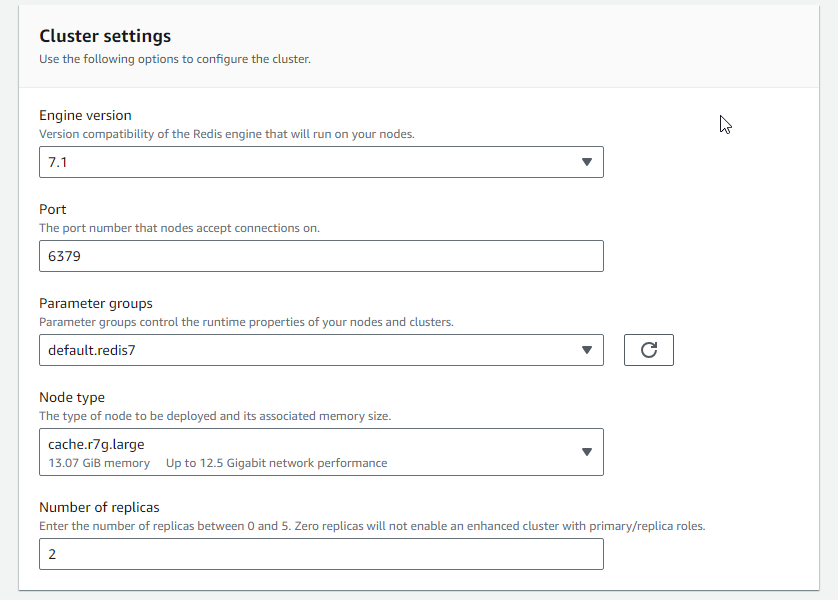

- [Introduction](#introduction)
- [ElastiCache for Redis](#elasticache-for-redis)
  - [Redis Cluster Modes: Enabled and Disabled](#redis-cluster-modes-enabled-and-disabled)
  - [Create ElastiCache for Redis Serverless](#create-elasticache-for-redis-serverless)
  - [Create ElastiCache for Design your own cache - easy create](#create-elasticache-for-design-your-own-cache---easy-create)
  - [Create ElastiCache for Design your own cache, cluster cache, cluster mode disabled](#create-elasticache-for-design-your-own-cache-cluster-cache-cluster-mode-disabled)
  - [Create ElastiCache for Design your own cache, cluster cache, cluster mode enabled](#create-elasticache-for-design-your-own-cache-cluster-cache-cluster-mode-enabled)
- [ElastiCache for Memcached](#elasticache-for-memcached)

# Introduction

* ElastiCache is to get managed **Redis or Memcached**
* Caches are in-memory databases with high performance, low latency
* Helps reduce load off databases for read intensive workloads
* AWS takes care of OS maintenance / patching, optimizations, setup, configuration, monitoring, failure recovery and backups

* https://aws.amazon.com/elasticache/redis-vs-memcached/
  

# ElastiCache for Redis

* https://docs.aws.amazon.com/AmazonElastiCache/latest/red-ug/WhatIs.html

## Redis Cluster Modes: Enabled and Disabled

https://docs.aws.amazon.com/whitepapers/latest/database-caching-strategies-using-redis/redis-cluster-modes-enabled-and-disabled.html

*Cluster Mode for Amazon ElastiCache for Redis is a feature that enables you to scale your Redis cluster without any impact on the cluster performance. While you initiate a scale-out operation by adding a specified number of new shards to a cluster, you also initiate scale-up or scale-down operation by selecting a new desired node type, Amazon ElastiCache for Redis a new cluster synchronizing the new nodes with the previous ones. Amazon ElastiCache for Redis supports three cluster configurations:*

* Redis - **single node**
* Redis - **cluster mode disabled**: In a Redis cluster with cluster mode disabled, there is one primary and you can have up to five read replicas in your replication group. Adding or removing replicas incurs no downtime to your application.
* Redis - **cluster mode enabled (sharding)**: With Cluster Mode enabled, your Redis cluster can now scale horizontally (in or out) in addition to scaling vertically (up and down). In a Redis cluster with cluster mode enabled, clusters can have **up to ninety shards by default** (which can be increased if requested) and up to five read replicas in each node group. By default, the hash slots get evenly distributed between shards, but customers can also configure a custom hash slot. 

## Create ElastiCache for Redis Serverless

## Create ElastiCache for Design your own cache - easy create

NOTE: subnet groups can be also created from separated view

## Create ElastiCache for Design your own cache, cluster cache, cluster mode disabled

## Create ElastiCache for Design your own cache, cluster cache, cluster mode enabled

The same steps like above but here we can specify amount of shards and replicas per shard, plus slots and keyspaces.

* Equal distribution

* Custom distribution

# ElastiCache for Memcached

https://docs.aws.amazon.com/AmazonElastiCache/latest/mem-ug/WhatIs.html