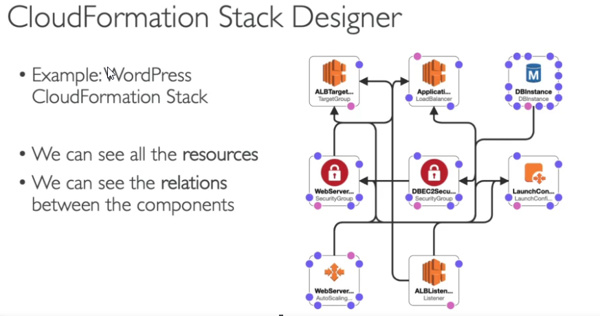
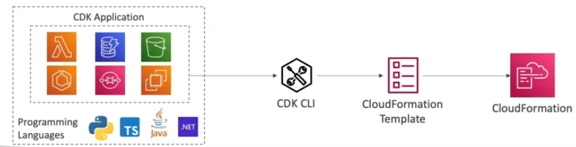
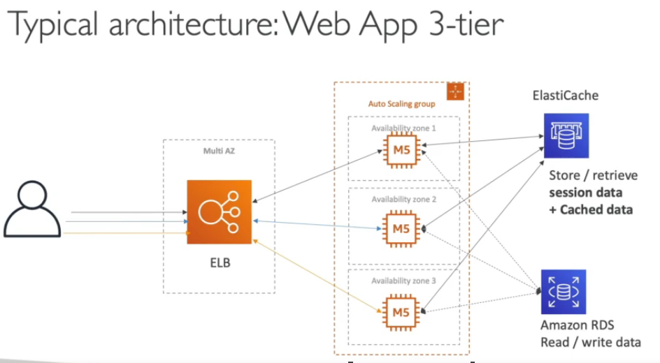
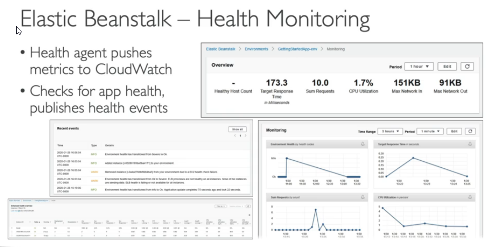

# CloudFormation

It is declarative way of outlining your AWS Infra, for any resources (most of them are supported).
CloudFormation creates those for you, in the right order, with the exact configuration that you specify.

* Infrastructure as code
* Cost
  * Each resources withing the stack is tagged with an identifier so you can easily see how much a stack costs you
  * You can estimate the costs of your resources using the CloudFromation template
  * Saving strategy, for example: In Dev, you could automation deletion of templates at 5 PM and recreated at 8 AM, safely
* Productivity
  * Ability to destroy and re-create as infra on the cloud on the fly
  * Automated generation of Diagram for your templates
  * Declarative programming (no need to figure out ordering and orchestration)
* Don`t re-invent the wheel
  * Leverage existing templates in the web
  * Leverage the documentation
* Supports (almost) all AWS resources
  * You can use "custom resources" for resources that are not supported

# AWS Cloud Development Kit (CDK)

* Define your cloud infra. using a familiar language
  * JS/TS, Python, Java and .NET
* The code is "compiled" into a CloudFormation template (JSON/YAML)
* You can therefor deploy infra and application runtime code together
  * Great for Lambda Functions
  * Great for Docker containers in ECS/EKS

# Elastic Beanstalk

## Typical architecture

* Developer problems on AWS
  * Manage infra
  * Deploying code
  * Configuring all the databases, load balancers erc.
  * Scaling concerns

* Most web apps have the same architecture (ALB + ASG)
* All devs want is for their code to tun!
* Possibly, consistently across different applications and envs.

## Beanstalk Overview

* Elastic Beanstalk is a developer centric view of deploying an application to AWS
* It uses many components: EC2, ASG, ELB, RDS, etc...
* But it is all on one view that is easy to make sense of
* We still have full control over the configuration
* **It is PaaS**
* Beanstalk is free but you pay for the underlying instances
* Managed service
  * Instances configuration / OS is handled by Beanstalk
  * Deployment strategy is configurable but performed by Elastic Beanstalk
  * Capacity provisioning
  * Load balancing and auto-scaling
  * Application health-monitor and responsiveness
* Supports 3 architecture models
  * Single Instance deployment: good for dev
  * LB + ASG: great for production or pre-production web applications
  * ASG only: great for non-web apps in production (workers, etc...)
* Supports: Go, Java SE, .NET, Docker etc... Can also write custom platform
* Beanstalk uses **CloudFormation**
* Health Monitoring

