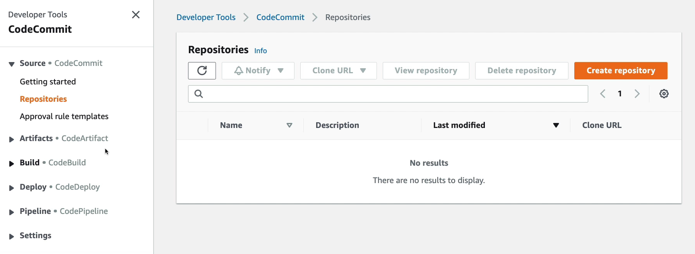
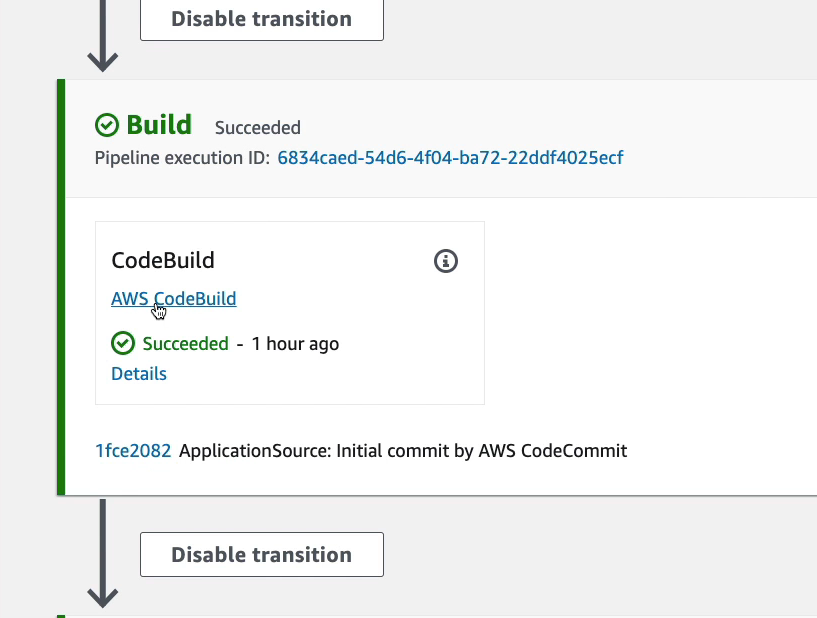
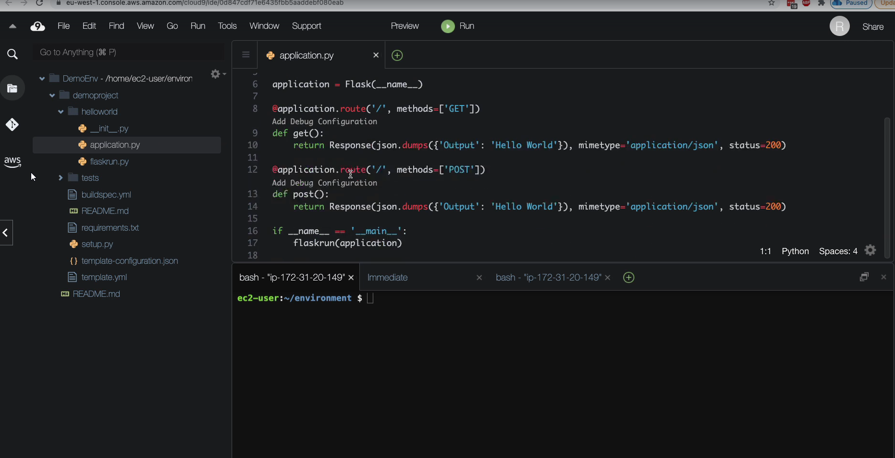
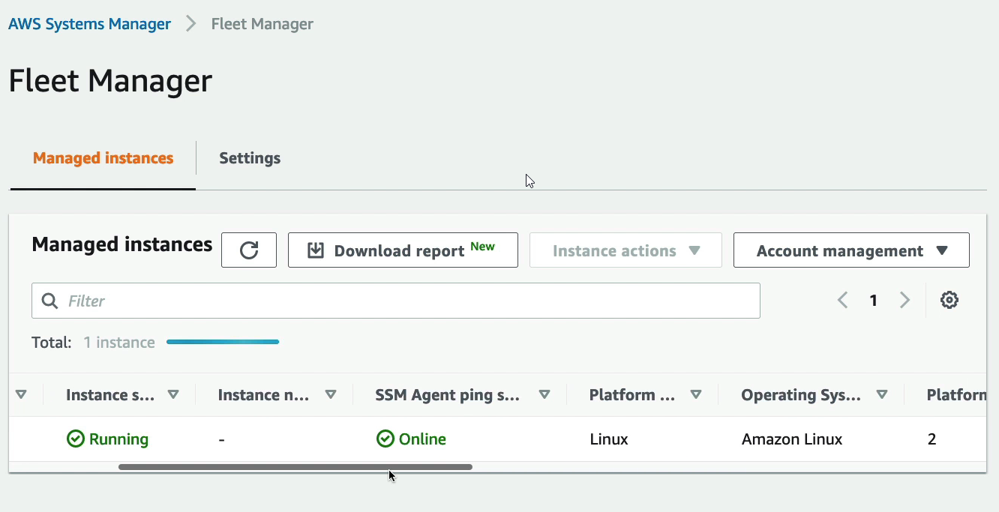

- [CloudFormation](#cloudformation)
- [AWS Cloud Development Kit (CDK)](#aws-cloud-development-kit-cdk)
- [Elastic Beanstalk](#elastic-beanstalk)
  - [Typical architecture](#typical-architecture)
  - [Beanstalk Overview](#beanstalk-overview)
- [AWS CodeDeploy](#aws-codedeploy)
- [AWS CodeCommit](#aws-codecommit)
- [AWS CodeBuild](#aws-codebuild)
- [AWS CodePipeline](#aws-codepipeline)
- [AWS CodeArtifact](#aws-codeartifact)
- [AWS CodeStar](#aws-codestar)
- [AWS Cloud9](#aws-cloud9)
- [CodeStart \& Cloud9 Hands On](#codestart--cloud9-hands-on)
- [Systems Manager (SSM)](#systems-manager-ssm)
  - [How Systems Manager work](#how-systems-manager-work)
  - [SSM Session Manager](#ssm-session-manager)
    - [SSM Session Manger Hands On](#ssm-session-manger-hands-on)
- [OpsWorks Overview](#opsworks-overview)
# CloudFormation

It is declarative way of outlining your AWS Infra, for any resources (most of them are supported).
CloudFormation creates those for you, in the right order, with the exact configuration that you specify.

* Infrastructure as code
* Cost
  * Each resources withing the stack is tagged with an identifier so you can easily see how much a stack costs you
  * You can estimate the costs of your resources using the CloudFromation template
  * Saving strategy, for example: In Dev, you could automation deletion of templates at 5 PM and recreated at 8 AM, safely
* Productivity
  * Ability to destroy and re-create as infra on the cloud on the fly
  * Automated generation of Diagram for your templates
  * Declarative programming (no need to figure out ordering and orchestration)
* Don`t re-invent the wheel
  * Leverage existing templates in the web
  * Leverage the documentation
* Supports (almost) all AWS resources
  * You can use "custom resources" for resources that are not supported

# AWS Cloud Development Kit (CDK)

* Define your cloud infra. using a familiar language
  * JS/TS, Python, Java and .NET
* The code is "compiled" into a CloudFormation template (JSON/YAML)
* You can therefor deploy infra and application runtime code together
  * Great for Lambda Functions
  * Great for Docker containers in ECS/EKS

# Elastic Beanstalk

## Typical architecture

* Developer problems on AWS
  * Manage infra
  * Deploying code
  * Configuring all the databases, load balancers erc.
  * Scaling concerns

* Most web apps have the same architecture (ALB + ASG)
* All devs want is for their code to tun!
* Possibly, consistently across different applications and envs.

## Beanstalk Overview

* Elastic Beanstalk is a developer centric view of deploying an application to AWS
* It uses many components: EC2, ASG, ELB, RDS, etc...
* But it is all on one view that is easy to make sense of
* We still have full control over the configuration
* **It is PaaS**
* Beanstalk is free but you pay for the underlying instances
* Managed service
  * Instances configuration / OS is handled by Beanstalk
  * Deployment strategy is configurable but performed by Elastic Beanstalk
  * Capacity provisioning
  * Load balancing and auto-scaling
  * Application health-monitor and responsiveness
* Supports 3 architecture models
  * Single Instance deployment: good for dev
  * LB + ASG: great for production or pre-production web applications
  * ASG only: great for non-web apps in production (workers, etc...)
* Supports: Go, Java SE, .NET, Docker etc... Can also write custom platform
* Beanstalk uses **CloudFormation**
* Health Monitoring

# AWS CodeDeploy

* We want to deploy our application
* Works with EC2 instances
* **Works with On-Premises Servers**
* Servers/Instances must be provisioned and configured ahead of time with the CodeDeploy Agent

# AWS CodeCommit

* AWS competing product for GitHub is CodeCommit
* It hosts Git-based repositories
* Fully managed
* Scalable & high available
* Private, Secured, Integrated with AWS 

# AWS CodeBuild

* Code building service in the cloud (name is obvious)
* Compiles source code, run tests, and produces packages that are ready to be deployed (by CodeDeploy for example)

* Benefits
  * Fully managed, serverless
  * Continuously scalable & high available
  * Secure
  * Pay-as-you-go pricing - only pay for the build time

# AWS CodePipeline

* Orchestrate the different steps to have the code automatically pushed to production
  * Code => Build => Test => Provision => Deploy
  * Basics for CICD
* Benefits
  * Fully managed, compatible with CodeCommit, CodeBuild, CodeDeploy, Elastic Beanstalk
  * Fast delivery & rapid updates

# AWS CodeArtifact

* Software packages depend on each other to be built (also called code dependencies), and new onces are created
* Storing and retrieving these dependencies is called artifact management
* Traditional you need to setup your own artifact management system
* **CodeArtifact** is a secure, scalable, and code-effective artifact management for software development
* Works with common deps tools such as Maven, npm, yarn, pip, NuGet
* Developers and CodeBuild can then retrieve deps straight from CodeArtifact

# AWS CodeStar

* Unified UI to easily manage software development activities in one place

* "Quick way" to get started to correctly set-up CodeCommit, CodePipeline, CodeBuild, CodeDeploy, Elastic Beanstalk, EC2, etc...
* Can edit the code "in-the-cloud" using **AWS Cloud9**

# AWS Cloud9

* It is cloud IDE for writing, running and debugging code
* "Classic" IDE are downloaded on a computer before being used
* A cloud IDE can be used within a web browser, meaning you can work on your projects with no setup necessary
* Allows for code collaboration in real-time (pair-programming)

# CodeStart & Cloud9 Hands On

* Developer tools: please where all developer tools are available but we have to create all of them

* CodeStart creates everything automatically

* After creation we can see that a lot of resources have been created automatically

* Pipeline steps

* If we go to the beanstalk we can  see created application and also there we can click the link to open the app

* Next create Cloud9 environment

* Next we can open Cloud9 IDE

* Push the changes

# Systems Manager (SSM)

* Helps you manage your EC2 and On-Premises systems at scale
* Another **Hybrid AWS service**
* Get operational insights about the state of your infra.
* Suit of 10+ products
* Most important features
  * Patching automation for enhanced compliance
  * Run commands across an entire fleet of servers
  * Store parameter configuration with the SSM Parameter Store
* Works for both Windows and Linux OS

## How Systems Manager work

* We need to install the SSM agent onto the systems we control
* Installed by default on Amazon Linux AMI & some Ubuntu AMIs
* If an instance cannot be controlled with SSM, it is probably an issue with the SSM agent!
* Thanks to the SSM agent, we can run commands, path & configure our servers

## SSM Session Manager

* Allows you to start a secure shell on your EC2 and on-premises servers
* No SSH access, bastion hosts, or SSH keys needed
* No port 22 needed (better security)
* Supports Linux, macOS and Windows
* Send session log data to S3 or CloudWatch Logs

### SSM Session Manger Hands On

* First we have to launch some EC2 instance

* We will not use any key-pair

* Also disable SSH traffic

* Assign IAM role which can talk to the SSM service

* Next go to the SSM Service and select **Fleet Manager**

Here all EC2 instances which are registered with SSM will appear here:

* When the created EC2 instances will start it will appear on the list

* Next we can run secure shell using **Session Manager**

* Start the session

* We can access also session history

# OpsWorks Overview

* Chef & Puppet help you perform server configuration automatically, or repetitive actions.
  * These tools are not created by AWS
* They work great with EC2 & On-Premises VM
* AWS OpsWorks = Managed Chef & Puppet
* It is alternative to the AWS SSM
* Only provision on standard AWS resources
  * EC2, Databases, Load Balancers, EBS volumes
* **The only reason to use OpsWorks is that you were using Chef & Puppet before migration to the cloud and after migration
  you would like to still use Chef & Puppet to re-use existing code**

