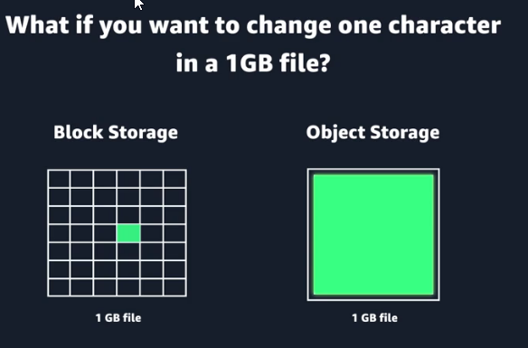
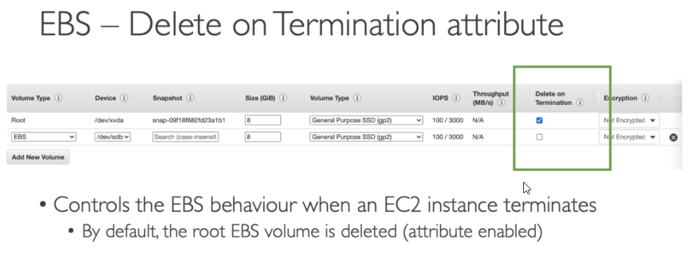
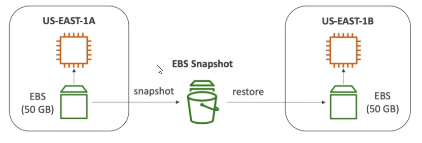
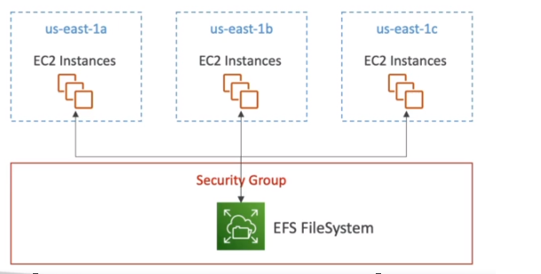
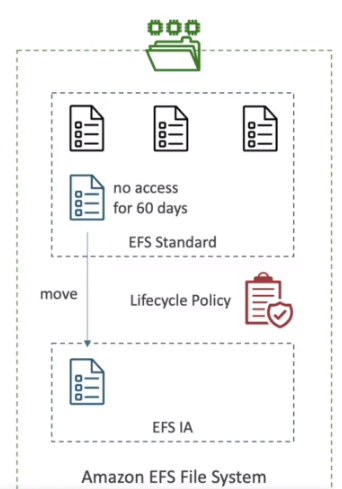
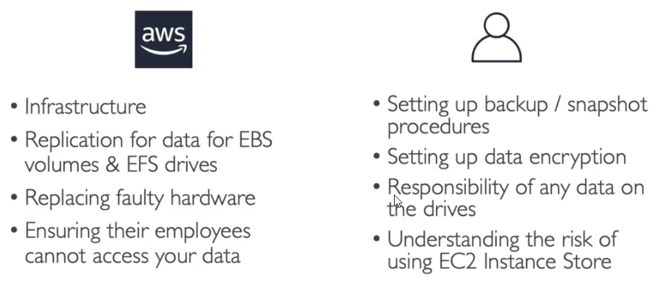
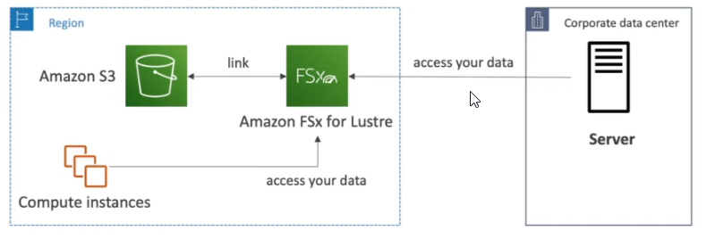
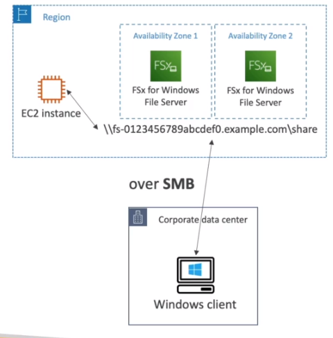

- [File storage vs block storage vs object storage](#file-storage-vs-block-storage-vs-object-storage)
- [EC2 Instance Store Volumes](#ec2-instance-store-volumes)
- [What is an EBS Volume](#what-is-an-ebs-volume)
  - [EBS - delete on termination](#ebs---delete-on-termination)
  - [EBS use cases](#ebs-use-cases)
  - [EBS volume types](#ebs-volume-types)
  - [Amazon EBS benefits](#amazon-ebs-benefits)
  - [EBS - snapshots (backup)](#ebs---snapshots-backup)
- [Root device storage concepts](#root-device-storage-concepts)
  - [Instance store-backed instances](#instance-store-backed-instances)
  - [Amazon EBS-backed instances](#amazon-ebs-backed-instances)
- [EFS - Elastic File System](#efs---elastic-file-system)
- [EFS Infrequent Access (EFS-IA)](#efs-infrequent-access-efs-ia)
- [Shared responsibility model for EC2 storage](#shared-responsibility-model-for-ec2-storage)
- [Amazon FSx](#amazon-fsx)

# File storage vs block storage vs object storage

https://aws.amazon.com/compare/the-difference-between-block-file-object-storage/   

# EC2 Instance Store Volumes

https://docs.aws.amazon.com/AWSEC2/latest/UserGuide/InstanceStorage.html

An instance store provides temporary block-level storage for your instance. This storage is located on disks that are **physically attached** to the host computer. Instance store is ideal for temporary storage of information that changes frequently, such as buffers, caches, scratch data, and other temporary content

This is also good option when you need storage with very low latency, but you don't need the data to persist **when the instance stops or terminates** or you can take advantage of fault-tolerant architectures.

Backups and replication are your responsibility.

# What is an EBS Volume

https://docs.aws.amazon.com/ebs/latest/userguide/what-is-ebs.html

* It is a network drive you can attach to your instances while they run (it is not a physical drive). Because it is a network drive there might be a bit of latency.
* It allows your instances to persist data, even after their termination.
* Typically they are mounted to a single instance at a time.
  * There is feature called **EBS Multi-Attach** - it depends on EC2 instance type and type of EBS volume, then you can have the same EBS volume attached to multiple EC2 instances.
* **They are bound to a specific availability zone** (it is not regional resource)
  * For example: an EBS in us-east-1a cannot be attached to us-east-1b, unless we create a snapshot - then it is possible.
* Analogy: think ot them as a "network USB stick".
* Size up to 64 TB
* Single file can be stored as many blocks - it allows to update only part of the file, partial file updates are possible, S3 does not support it
* EBS Volumes do not automatically **scale** if more space is needed: https://docs.aws.amazon.com/AWSEC2/latest/UserGuide/step3-increase-size-of-data-volume.html
  * It can be automated by running custom lambda function: https://aws.amazon.com/blogs/storage/automating-amazon-ebs-volume-resizing-with-aws-step-functions-and-aws-systems-manager/
    * Increase volume size (up to 64TB)
    * Attache multiple EBS volumes to EC2 instance
* Both non-root and root volumes can be encrypted

## EBS - delete on termination

* By default, attached EBS volume is not deleted.

## EBS use cases

* Operating systems: Boot and root volumes can be used to store an operating system. The root device for an instance launched from an Amazon Machine Image (AMI) is typically an EBS volume. These are commonly referred to as EBS-backed AMIs.
* Databases: As a storage layer for databases running on Amazon EC2 that will scale with your performance needs and provide consistent and low-latency performance.
* Enterprise applications: Amazon EBS provides high availability and high durability block storage to run business-critical applications.
* Big data analytics engines: Amazon EBS offers data persistence, dynamic performance adjustments, and the ability to detach and reattach volumes, so you can resize clusters for big data analytics.

## EBS volume types

* SSD (solid-state drives) volumes: SSDs are used for transactional workloads with frequent read/write operations with small I/O size.
* HDD (hard-disk drives) volumes: HDDs are used for large streaming workloads that need high throughput performance.

**Both do not support EBS Multi-attach.**

## Amazon EBS benefits

* HA: When you create an EBS volume, it is automatically replicated in its Availability Zone to prevent data loss from single points of failure.
* Data persistence: Storage persists even when your instance doesn’t.
* Data encryption: **When activated by the user**, all EBS volumes support encryption.
* Flexibility: EBS volumes **support on-the-fly changes**. Modify volume type, volume size, and input/output operations per second (IOPS) capacity without stopping your instance.
* Backups: Amazon EBS provides the ability to create backups of any EBS volume.

## EBS - snapshots (backup)

* EBS snapshots are stored on S3
  * The backups are stored redundantly in multiple Availability Zones using Amazon S3
* Incremental snapshots
  * For example, if you have 10 GB of data on a volume and only 2 GB of data have been modified since your last snapshot, only the 2 GB that have been changed are written to Amazon S3.
* Make a snapshot (backup) of you EBS volume at point in time
* Not necessary to detach volume to do snapshot, but recommended
* Can copy snapshots across AZ or Region

Features

* EBS snapshot archive
  * move a snapshot to an "archive tier" that is 75% cheaper
  * takes within 24 to 72 hours for restoring the archive
  * snapshots are stored on S3
* Recycle bin for EBS snapshot
  * setup rules to retain deleted snapshots so you can recover the after an accidental deletion
  * specify retention (1 day to 1 year)

# Root device storage concepts

https://docs.aws.amazon.com/AWSEC2/latest/UserGuide/RootDeviceStorage.html

When you launch an instance, the **root device volume contains the image used to boot the instance**. When we introduced Amazon EC2, all AMIs were backed by Amazon EC2 instance store, which means the root device for an instance launched from the AMI is an instance store volume created from a template stored in Amazon S3. After we introduced Amazon EBS, we introduced AMIs that are backed by Amazon EBS. This means that the root device for an instance launched from the AMI is an Amazon EBS volume created from an Amazon EBS snapshot.

You can choose between AMIs backed by Amazon EC2 instance store and AMIs backed by Amazon EBS. **We recommend that you use AMIs backed by Amazon EBS**, because they launch faster and use persistent storage.

## Instance store-backed instances

Any data on the instance store volumes persists as long as the instance is running, but this data is deleted when the instance is terminated (instance store-backed instances do not support the Stop action) or if it fails (such as if an underlying drive has issues).

After an instance store-backed instance fails or terminates, it cannot be restored. If you plan to use Amazon EC2 instance store-backed instances, we highly recommend that you distribute the data on your instance stores across multiple Availability Zones. You should also back up critical data from your instance store volumes to persistent storage on a regular basis.

## Amazon EBS-backed instances

Instances that use Amazon EBS for the root device automatically have an Amazon EBS volume attached. When you launch an Amazon EBS-backed instance, we create an Amazon EBS volume for each Amazon EBS snapshot referenced by the AMI you use. You can optionally use other Amazon EBS volumes or instance store volumes, depending on the instance type.

An Amazon EBS-backed instance can be stopped and later restarted without affecting data stored in the attached volumes. 

# EFS - Elastic File System

* Managed NFS (network file system) that can be mounted on hundreds of EC2 at a time so it makes it **shared filed system**.
* Works only with Linux EC2 and multi-AZ.
* Highly available (multiple Availability Zones), scalable, expensive (3x gp2), pay per use, no capacity planning.
* It is regional resource
* **Automatically scales** (if more space is needed, EBS does not automatically scales)
* To access EFS file systems from on-premises, you must have an AWS Direct Connect or AWS VPN connection between your on-premises datacenter and your Amazon VPC. **You mount an EFS file system on your on-premises Linux server** using the standard Linux mount command for mounting a file system

# EFS Infrequent Access (EFS-IA)

* Storage class that is cost-optimized for files not accessed every day
* Up to 92% lower cost compared of EFS Standard
* EFS will automatically move your files EFS-IA based on the list time there were accessed
  * enable EFS-IA with Lifecycle Policy
  * example: move files that are not accessed for 60 days to EFS-IA
* transparent to the applications accessing EFS

# Shared responsibility model for EC2 storage

# Amazon FSx

* launch 3rd party high-performance file systems on AWS
* fully managed service
* 3 options
  * FXs for Lustre
    * for Hight Performance Computing (HPC)
    * the name Lustre is derived from "Linux" and "cluster:
    * ML, analytics, video processing, financial modeling...
    * Scales up to 100s GB/s, millions of IOPS, sub-ms latencies

    
    
  * FSx for Windows File Server
    * Windows native file system
    * Built on File Server
    * Supports SMB and Windows NTFS
    * Integrity with Microsoft AD
    * Can be accessed from AWS or your on-premise infrastructure

    

  * FSx for NetApp ONTAP
  * FSx for OpenZFS