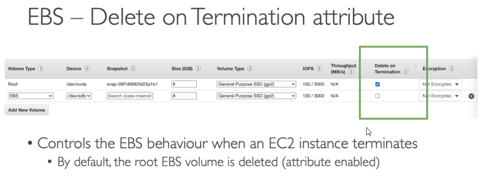
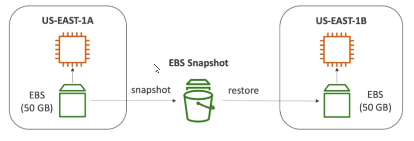

Amazon Elastic Block Store

# What is an EBS Volumne

* It is a network drive you can attach to your instances while they run (it is not a physical drive). Because it is a network drive there might be a bit of latency.
* It allows your instacnes to persist data, even after their termination.
* They can only be mounted to a single instance at a time.
* They are bound to a specific availabilty zone.
  * For example: an EBS in us-east-1a cannot be attached to us-east-1b, unless we create a snapshot - then it is possible.
* Analogy: think ot them as a "network USB stick".

## EBS - delete on termination

* By default, the root EBS volumne is deleted.
* By default, any other attached EBS volume is not deleted.

## EBS - snashots (backup)

* make a snapshot (backup) of you EBS volume at point in time
* not necessary to detach volume to do snapshot, but recommended
* can copy snapshots across AZ or Region

Features

* EBS snapshot archive
  * move a snapshot to an "archive tier" that is 75% cheaper
  * takes within 24 to 72 hours for restoring the archive
* Recycle bin for EBS snapshot
  * setup rules to retain deleted snapshots so you can recover the after an accidential deletion
  * specify retention (1 day to 1 year)