# EC2 instance families

* General purpose: provide a balance of compute, memory, and networking resources
  * application servers, gaming servers, backend servers for enterprise applications, small and medium databases
  
* Compute optimized: ideal for compute-bound applications that benefit from high-performance processors
  * high-performance web servers
  * compute-intensive applications servers
  * dedicated gaming servers
  * batch processing workloads that require processing many transactions in a single group
  
* Memory optimized: designed to deliver fast performance for workloads that process large datasets in memory
  * high-performance database
  * performing real-time processing of a large amount of unstructured data
  
* Accelerate computing:  use hardware accelerators, or coprocessors, to perform some functions more efficiently than is possible in software running on CPUs
  * floating-point number calculations
  * graphics processing
  * data pattern matching
  * graphics applications
  * game streaming
  * application streaming
  
* Storage optimized: sequential read and write access to large datasets on local storage
  * distributed file systems
  * data warehousing applications
  * high-frequency online transaction processing (OLTP) systems
  * deliver tens of thousands of low-latency, random input/output operations per second (IOPS) to applications.


# AMI process for creating custom AMIs

*"The AMI must be in the same region as that of the EC2 instance to be launched. If the AMI exists in a different region, you can copy that AMI to the region where you want to launch the EC2 instance. The region of AMI has no bearing on the performance of the EC2 instance."*

* Start an EC2 instance and customize it
* Stop the instance (for data integrity)
* Build an AMI - this will also create EBS snapshot
* Launc instances from other AMIs

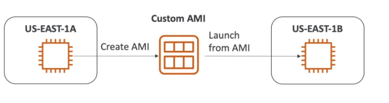

* In first EC2 instance we add a script that installs some packages

  ```sh
  #!/bin/bash
  # Use this for your user data (script from top to bottom)
  # install httpd (Linux 2 version)
  yum update -y
  yum install -y httpd
  systemctl start httpd
  systemctl enable httpd
  ```  

* Next launch the instance
* Next create a custom image from this EC2 instance

  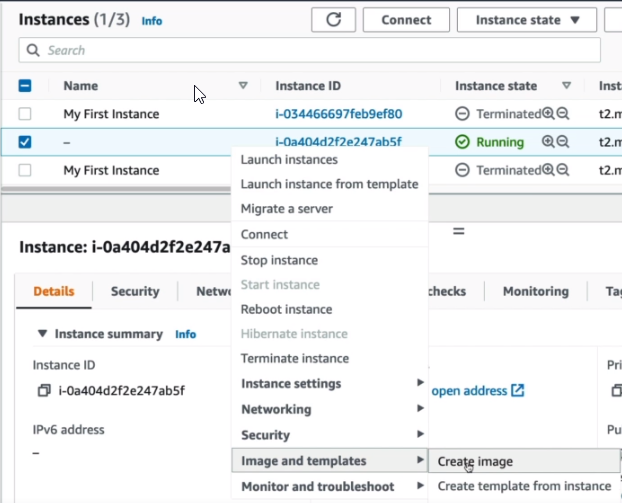

* When the image will be available run the instance from it.
  This time http server will be available much faster because it will not be installed during system bootstrap

  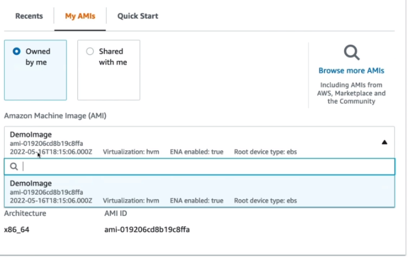

  Now in user data we do not have to install http server and we can just past http files.

  ```sh
  echo "<h1>Hello World from $(hostname -f)</h1>" > /var/www/html/index.html
  ```

# EC2 Image builder

* Used to automate the creation of Virtual Machines or **container images**
* => Automate the creation, maintain, validate and test EC2 AMIs
* Can be run on a schedule
* Free service (only pay for the underlying resources)

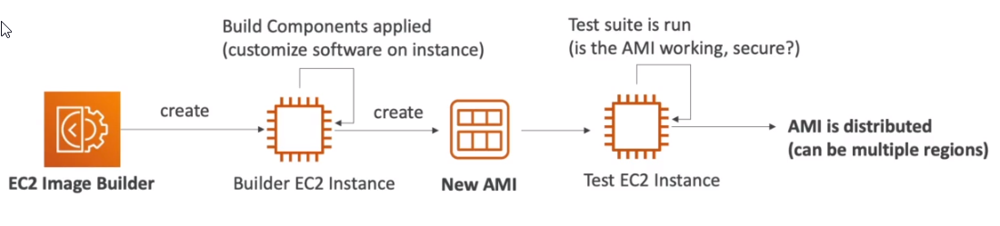

## EC2 Image builder hands-on screens

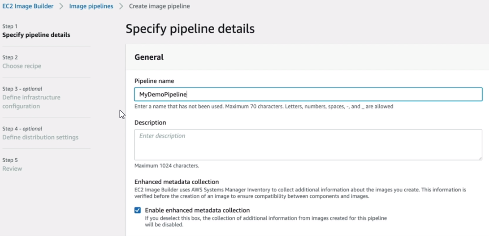

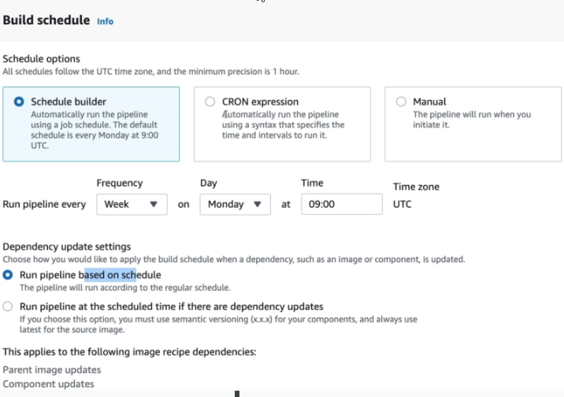

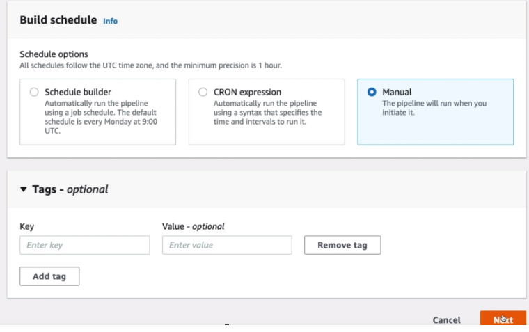

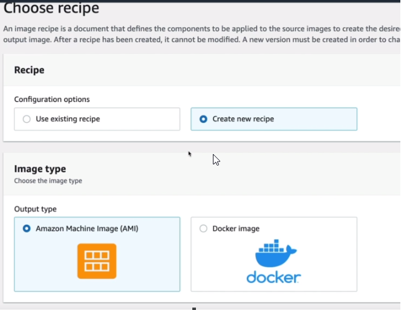

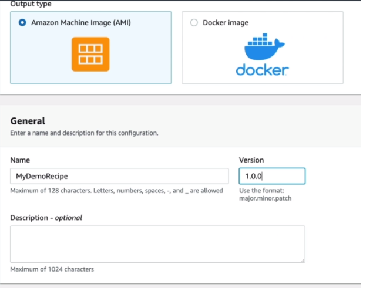

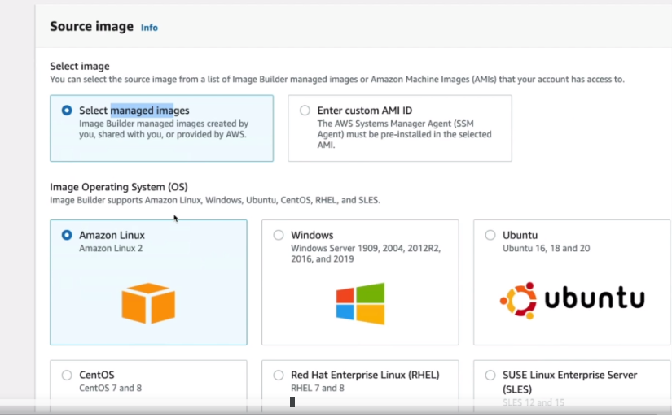

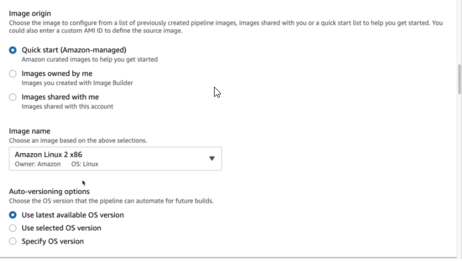

We can select from a list which components should be installed on the new custom image.
If needed we can create also own custom components.
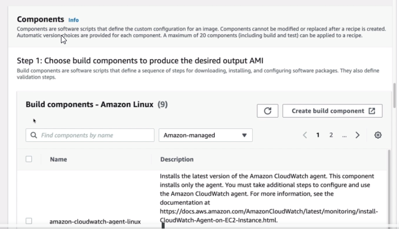

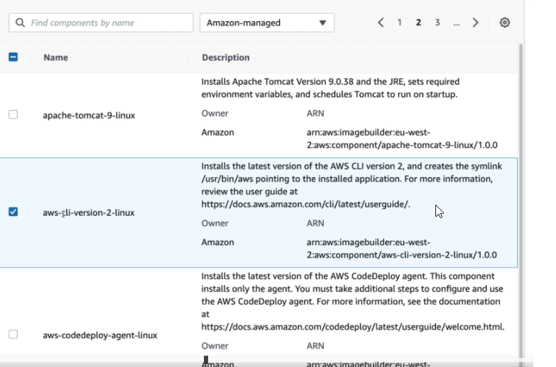

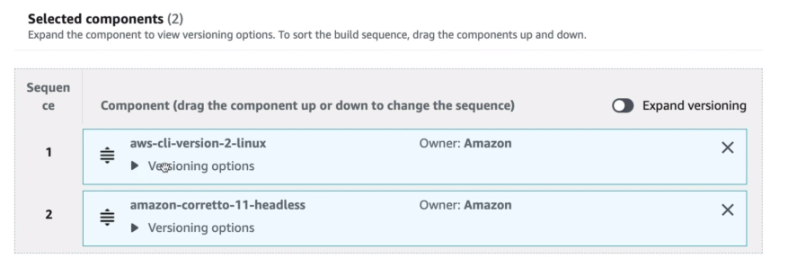

Next we can select how we want test the new image.

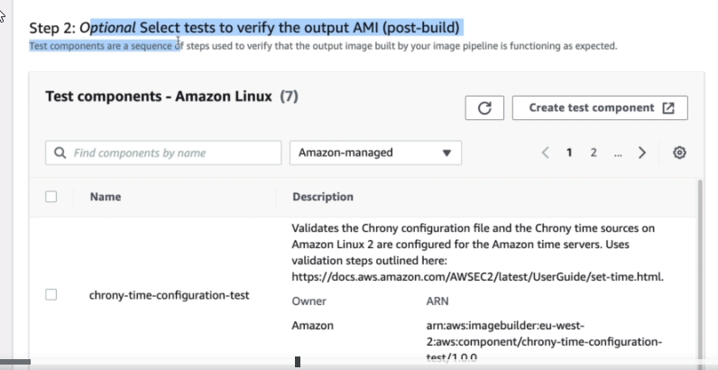

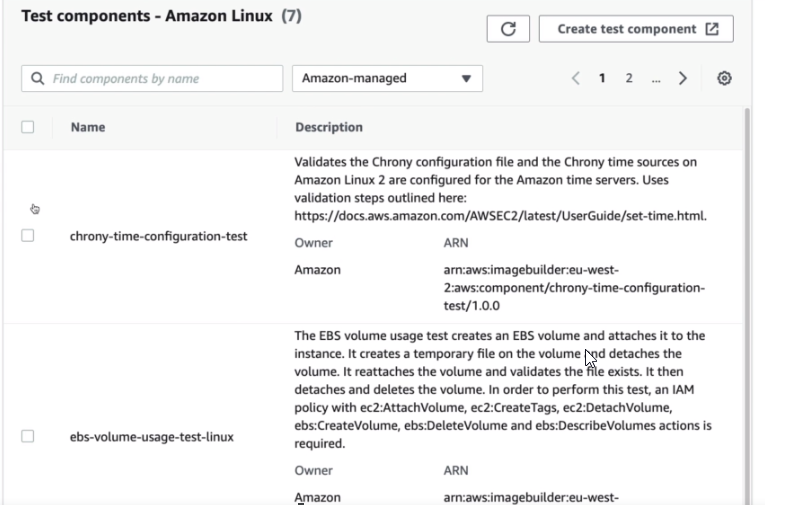

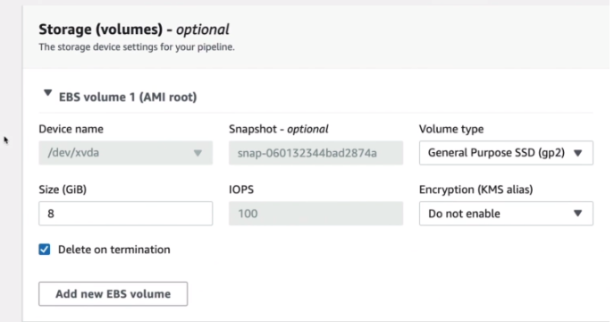

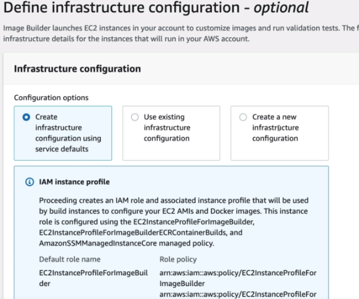

If we want create custom infra and own IAM Role then this role must have a required policies which are listed in default infra. configuration
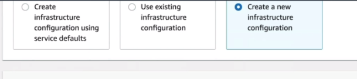

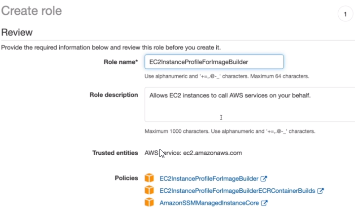

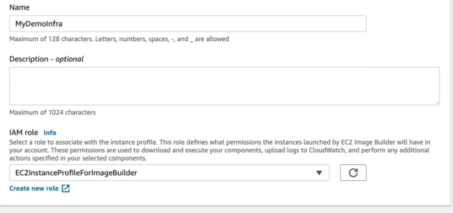

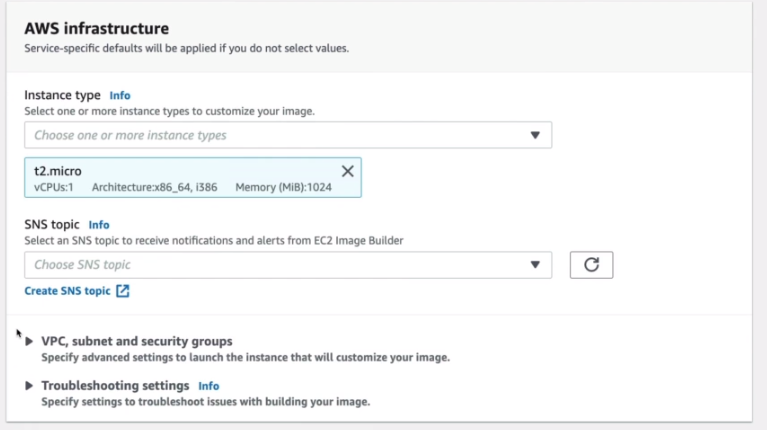

In last step we select AMI distribution settings.
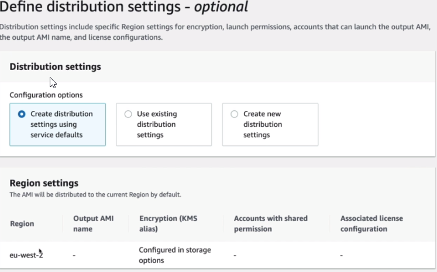

Next we can run created pipeline.
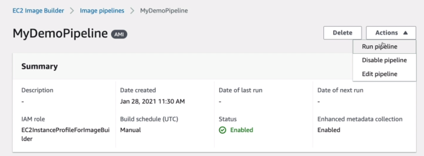

During this time we can see that EC2 instance for building a new image is running.
![026-ec2-image-builder.png] (./images/026-ec2-image-builder.png)
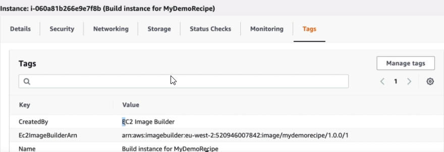

Next status of the pipeline is testing.
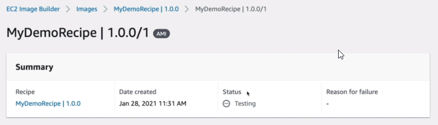

We can see now that the builder instance is terminating and new test instance is created.
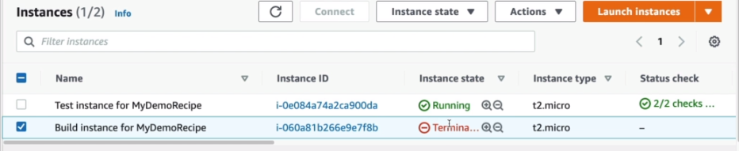

Last step is distribution the new image.
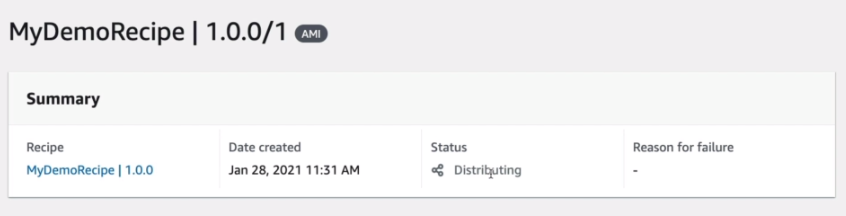


# EC2 Instance Connect

Amazon EC2 Instance Connect provides a simple and secure way to connect to your instances using Secure Shell (SSH).
With EC2 Instance Connect, you use AWS Identity and Access Management (IAM) policies and principals to control SSH access to your instances, removing the need to share and manage SSH keys. All connection requests using EC2 Instance Connect are logged to AWS CloudTrail so that you can audit connection requests. **It is browser-based client**.

SSH can be used from a Mac OS, Windows or Linux based computer, but it's not a browser-based client.