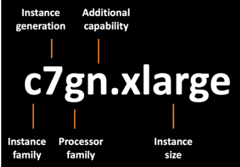

- [EC2 instance families](#ec2-instance-families)
- [Instance types](#instance-types)
- [Instance sizing](#instance-sizing)
- [Anatomy of an instance](#anatomy-of-an-instance)
  - [AWS Nitro System](#aws-nitro-system)
- [Bare-metal instances](#bare-metal-instances)
- [EC2 instance lifecycle](#ec2-instance-lifecycle)
  - [Difference between stop and stop-hibernate](#difference-between-stop-and-stop-hibernate)
- [AMI process for creating custom AMIs](#ami-process-for-creating-custom-amis)
- [EC2 Image builder](#ec2-image-builder)
  - [EC2 Image builder hands-on screens](#ec2-image-builder-hands-on-screens)
- [EC2 Instance Connect](#ec2-instance-connect)

# EC2 instance families

https://aws.amazon.com/ec2/instance-types/

* **General purpose**: provide a balance of compute, memory, and networking resources
  * Use cases: ideal for applications that use these resources in equal proportions, such as web servers and code repositories.
  
* **Compute optimized**: ideal for compute-bound applications that benefit from high-performance processors
  * Use cases:
    * high-performance web servers
    * compute-intensive applications servers
    * dedicated gaming servers
    * batch processing workloads that require processing many transactions in a single group
    * scientific modeling
  
* **Memory optimized**: designed to deliver fast performance for workloads that process large datasets in memory
  * Use cases:
    * high-performance database
    * performing real-time processing of a large amount of unstructured data
    * in-memory cache
    * real-time big-data analytics
  
* **Accelerate computing**:  use hardware accelerators, or coprocessors, to perform some functions more efficiently than is possible in software running on CPUs
  * Use cases:
    * machine learning
    * speech recognition
    * floating-point number calculations
    * graphics processing
    * data pattern matching
    * graphics applications
    * game streaming
    * application streaming
  
* **Storage optimized**: sequential read and write access to large datasets on local storage
  * Use cases:
    * NoSQL databases (Cassandra, MongoDB and Redis)
    * in-memory databases
    * distributed file systems
    * data warehousing applications
    * high-frequency online transaction processing (OLTP) systems
    * deliver tens of thousands of low-latency, random input/output operations per second (IOPS) to applications.
* **HPC optimized**: High performance computing (HPC) instances are purpose built to offer the best price performance for running HPC workloads at scale on AWS. HPC == **many servers running parallel processing**. **HPC is like a virtual super computer**.
  * Use cases:
    * complex simulations
    * deep learning workloads
    * weather forecasting, and other computationally intensive tasks **where large-scale parallel processing is necessary**

# Instance types

   
More [here](https://docs.aws.amazon.com/AWSEC2/latest/UserGuide/instance-types.html).

# Instance sizing

EC2 instances are sized based on the combined hardware resources consumed by that instance type. This means the size is the total configured capacity of vCPU, memory, storage, and networking.


# Anatomy of an instance

An EC2 instance is made up of the host's physical hardware components (storage, networking, compute), a hypervisor (software that hides hardware resources from the application OS), and the configuration information from the AMI. 

A **hypervisor** is a piece of virtualization software that allocates resources and manages physical hardware in a virtualized environment. The hypervisor allows multiple operating systems to run on a single physical server.

AWS has **two types of hypervisors**: the **original hypervisor** and the **newer Nitro Hypervisor** that was launched as part of the AWS Nitro System. 

## AWS Nitro System

The majority of EC2 instances run on hardware known as the AWS Nitro System. The important element of the AWS Nitro System hardware is how it uses dedicated hardware to offload input and output (I/O) operations.

The following image illustrates how Amazon EC2 allocated resources at its original launch.


When Amazon EC2 originally launched, up to 30% of the host's compute resources were allocated to the hypervisor for managing the hardware. This left only 70% of the resources for the remaining hypervisor functions and the customer instances.

Traditionally, a hypervisor's job is to protect the physical hardware and BIOS; virtualize the CPU, storage, and networking; and provide a rich set of management capabilities. With the Nitro System, these functions are separated and offloaded to dedicated hardware and software. Doing this reduces costs and increases performance by delivering practically all of the server resources to your instances.

The following image illustrates how the AWS Nitro System splits the management resources from the hardware resources.


By offloading all hardware, management, and security operations to a dedicated card, the hypervisor no longer has to carve out a portion of compute resources to handle this I/O.

# Bare-metal instances

Bare-metal instances are different from an instance on a Dedicated Host because a Dedicated Host instance comes with the virtualization software (the hypervisor) preinstalled. Bare-metal instances are ideal for the following applications: 

* Workloads that require access to the hardware feature set
* Applications that need to run in nonvirtualized environments for licensing or support requirements
* Customers who want to use their own hypervisor

Workloads on bare-metal instances continue to **take advantage of all the services and features of the AWS Cloud, such as Amazon EBS**. A bare-metal instance has the lowest latency because it does not have the overhead of running a hypervisor.

# EC2 instance lifecycle


* **Pending**: When you launch an instance, it enters the pending state. **When an instance is pending, billing has not started**. At this stage, the instance is preparing to enter the running state. Pending is where AWS performs all actions needed to set up an instance, such as copying the AMI content to the root device and allocating the necessary networking components.
* **Running**: When your instance is running, it's ready to use. This is also the stage where billing begins. As soon as an instance is running, you can take other actions on the instance, such as reboot, terminate, stop, and stop-hibernate.
* **Rebooting**: When you reboot an instance, **it’s different than performing a stop action and then a start action**. Rebooting an instance is equivalent to rebooting an operating system. The instance keeps its public DNS name (IPv4) and private and public IPv4 addresses. An IPv6 address (if applicable) remains on the same host computer and maintains its public and private IP address, in addition to any data on its instance store volume.
* **Stopping/Stopped**: When you stop your instance, it enters the stopping and then stopped state. This is similar to when you shut down your laptop. You can stop and start an instance if it has an Amazon Elastic Block Store (Amazon EBS) volume as its root device. **When you stop and start an instance, your instance can be placed on a new underlying physical server**. Your instance retains its private IPv4 addresses and if your instance has an IPv6 address, it retains its IPv6 address (but it will have different public IP address unless it uses Elastic IP). **When you put the instance into stop-hibernate**, the instance enters the stopped state, but saves the last information or content into memory, so that the start process is faster.
You can compare this to how you lock your laptop and shut the lid, but when you open it back up, everything is still in place where you left it.
* **Terminate**: When you terminate an instance, the instance stores are erased, and you lose both the public IP address and private IP address of the machine. Termination of an instance means that you can no longer access the machine. As soon as the status of an instance changes to shutting down or terminated, you stop incurring charges for that instance.

## Difference between stop and stop-hibernate

When you **stop an instance**, it enters the stopping state until it reaches the stopped state. AWS does not charge usage or data transfer fees for your instance after you stop it. But storage for any Amazon EBS volumes is still charged. While your instance is in the stopped state, you can modify some attributes, like the instance type. When you stop your instance, the data from the instance memory (RAM) is lost.

When you **stop-hibernate an instance**, Amazon EC2 signals the operating system to perform hibernation (suspend-to-disk), which saves the contents from the instance memory (RAM) to the EBS root volume. You can hibernate an instance only if hibernation is turned on and the instance meets the hibernation prerequisites.

# AMI process for creating custom AMIs

*"The AMI must be in the same region as that of the EC2 instance to be launched. If the AMI exists in a different region, you can copy that AMI to the region where you want to launch the EC2 instance. The region of AMI has no bearing on the performance of the EC2 instance."*

* Start an EC2 instance and customize it
* Stop the instance (for data integrity)
* Build an AMI - this will also create EBS snapshot
* Launc instances from other AMIs


* In first EC2 instance we add a script that installs some packages

  ```sh
  #!/bin/bash
  # Use this for your user data (script from top to bottom)
  # install httpd (Linux 2 version)
  yum update -y
  yum install -y httpd
  systemctl start httpd
  systemctl enable httpd
  ```  

* Next launch the instance
* Next create a custom image from this EC2 instance

  

* When the image will be available run the instance from it.
  This time http server will be available much faster because it will not be installed during system bootstrap

  

  Now in user data we do not have to install http server and we can just past http files.

  ```sh
  echo "<h1>Hello World from $(hostname -f)</h1>" > /var/www/html/index.html
  ```

# EC2 Image builder

* Used to automate the creation of Virtual Machines or **container images**
* => Automate the creation, maintain, validate and test EC2 AMIs
* Can be run on a schedule
* Free service (only pay for the underlying resources)


## EC2 Image builder hands-on screens


We can select from a list which components should be installed on the new custom image.
If needed we can create also own custom components.


Next we can select how we want test the new image.


If we want create custom infra and own IAM Role then this role must have a required policies which are listed in default infra. configuration


In last step we select AMI distribution settings.


Next we can run created pipeline.


During this time we can see that EC2 instance for building a new image is running.
![026-ec2-image-builder.png] (./images/026-ec2-image-builder.png)


Next status of the pipeline is testing.


We can see now that the builder instance is terminating and new test instance is created.


Last step is distribution the new image.


# EC2 Instance Connect

https://docs.aws.amazon.com/AWSEC2/latest/UserGuide/Connect-using-EC2-Instance-Connect.html

Amazon EC2 Instance Connect provides a simple and secure way to connect to your instances using Secure Shell (SSH).
With EC2 Instance Connect, you use AWS Identity and Access Management (IAM) policies and principals to control SSH access to your instances, removing the need to share and manage SSH keys. All connection requests using EC2 Instance Connect are logged to AWS CloudTrail so that you can audit connection requests. **It is browser-based client**.

SSH can be used from a Mac OS, Windows or Linux based computer, but it's not a browser-based client.