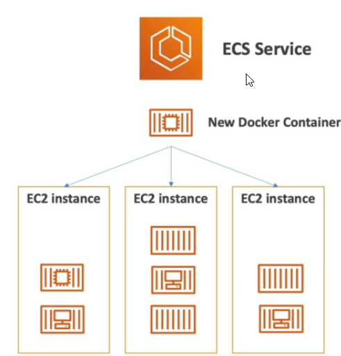
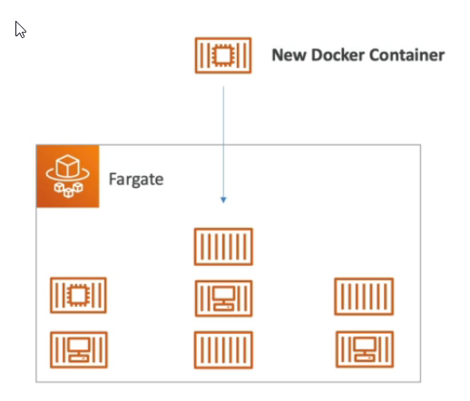

# ECS

* ECS = Elastic Container Service
* Launch Docker containers on AWS
* You must provision & maintain the infrastructure (EC2 instances)
* AWS takes care of starting/stopping containers
* Has integrations with the Application Load Balancer

# Fargate

* Launch Docker containers on AWS
* You do not have to provision the infrastructure (no EC2 instances to manage)
* Serverless offering - AWS just runs containers for you based on the CPU/RAM you need

