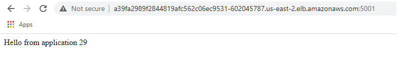

- [Create ECR via AWS CLI](#create-ecr-via-aws-cli)
- [Create docker image](#create-docker-image)
- [Publish image to ECR](#publish-image-to-ecr)
- [Create AWS EKS](#create-aws-eks)
  - [Install eksctl](#install-eksctl)
  - [Create EKS cluster](#create-eks-cluster)
- [Deploy image do EKS cluster](#deploy-image-do-eks-cluster)
  - [Create deployment](#create-deployment)
  - [Expose app to the outside world - create K8s service](#expose-app-to-the-outside-world---create-k8s-service)
- [Scale Pods and Nodes](#scale-pods-and-nodes)
  - [Scale Pods](#scale-pods)
  - [Scale Nodes](#scale-nodes)
    - [Scale down nodes (horizontally)](#scale-down-nodes-horizontally)
    - [Scale up nodes (horizontally)](#scale-up-nodes-horizontally)
- [Update application](#update-application)
  - [Create a new image and publish it to ECR](#create-a-new-image-and-publish-it-to-ecr)
  - [Update deployment (use new image version)](#update-deployment-use-new-image-version)
- [AWS Fargate - deploying serverless pods](#aws-fargate---deploying-serverless-pods)
  - [Create EKS cluster with Fargate nodepool](#create-eks-cluster-with-fargate-nodepool)
  - [Deploy first version of the image](#deploy-first-version-of-the-image)
  - [Create Load Balancer Service](#create-load-balancer-service)
  - [Scale pods](#scale-pods-1)
- [Delete EKS cluster](#delete-eks-cluster)
- [Connect to existing EKS](#connect-to-existing-eks)
- [resources](#resources)

# Create ECR via AWS CLI

* create ECR:

```
PS C:\> aws ecr create-repository --repository-name ecr-tmp-jacek
{
    "repository": {
        "repositoryArn": "arn:aws:ecr:us-east-2:633883526719:repository/ecr-tmp-jacek",
        "registryId": "633883526719",
        "repositoryName": "ecr-tmp-jacek",
        "repositoryUri": "633883526719.dkr.ecr.us-east-2.amazonaws.com/ecr-tmp-jacek",
        "createdAt": "2020-10-20T09:48:53+02:00",
        "imageTagMutability": "MUTABLE",
        "imageScanningConfiguration": {
            "scanOnPush": false
        },
        "encryptionConfiguration": {
            "encryptionType": "AES256"
        }
    }
}
```

* get password to ECR and use it docker login

```
PS D:\> aws ecr get-login-password --region us-east-2 | docker login --username AWS --password-stdin 633883526719.dkr.ecr.us-east-2.amazonaws.com/ecr-tmp-jacek
Login Succeeded
```

>NOTE: "The generated token is valid for 12 hours, which means developers running and managing container images have to re-authenticate every 12 hours manually, or script it to generate a new token, which can be somewhat cumbersome in a CI/CD environment." **Based on information from this [article](https://aws.amazon.com/blogs/compute/authenticating-amazon-ecr-repositories-for-docker-cli-with-credential-helper/)**.

# Create docker image

To publish an image to ECR it has to follow this syntax:

```
<registryId>.dkr.ecr.<region>.amazonaws.com/<image-name>:<tag>
```

>NOTE: image-name must be the same name as name of the repository, in this case it is **ecr-tmp-jacek**.

```
PS D:\GitHub\kicaj29\aws\EKS\app> docker build -t 633883526719.dkr.ecr.us-east-2.amazonaws.com/ecr-tmp-jacek:1.0 .
Sending build context to Docker daemon   5.12kB
Step 1/7 : FROM python:3.8-slim-buster
 ---> 53f4b6d54ed7
...
...
Successfully built 94d09468e70a
Successfully tagged 633883526719.dkr.ecr.us-east-2.amazonaws.com/ecr-tmp-jacek:1.0
SECURITY WARNING: You are building a Docker image from Windows against a non-Windows Docker host. All files and directories added to build context will have '-rwxr-xr-x' permissions. It is recommended to double check and reset permissions for sensitive files and directories.
```

Next we can check that this image is available in local docker repo:

```
PS D:\GitHub\kicaj29\aws\EKS\app> docker images
REPOSITORY                                                   TAG                                              IMAGE ID            CREATED             SIZE
633883526719.dkr.ecr.us-east-2.amazonaws.com/ecr-tmp-jacek   1.0                                              94d09468e70a        12 minutes ago      123MB
...
...
```

# Publish image to ECR

```
PS D:\GitHub\kicaj29\aws\EKS\app> docker push 633883526719.dkr.ecr.us-east-2.amazonaws.com/ecr-tmp-jacek:1.0
The push refers to repository [633883526719.dkr.ecr.us-east-2.amazonaws.com/ecr-tmp-jacek]
0876cd9f1c57: Pushed
9d4e91530c11: Pushed
9e268f0e9561: Pushed
06eeb6988749: Pushed
06b60c6e6ffd: Pushed
322c3996a80b: Pushed
225ef82ca30a: Pushed
d0fe97fa8b8c: Pushed
1.0: digest: sha256:acb20595014dd3322b2bb5320f612143a45d0b616ead7eebb665408e96f52424 size: 1995
```

# Create AWS EKS

## Install eksctl

```
chocolatey install -y eksctl 
```

```
PS C:\Windows\system32> eksctl version
0.30.0
```

## Create EKS cluster

```
PS C:\Windows\system32> eksctl create cluster --name demo-cluster-jacek-ec2 --region us-east-2
[ℹ]  eksctl version 0.30.0
[ℹ]  using region us-east-2
[ℹ]  setting availability zones to [us-east-2c us-east-2a us-east-2b]
[ℹ]  subnets for us-east-2c - public:192.168.0.0/19 private:192.168.96.0/19
[ℹ]  subnets for us-east-2a - public:192.168.32.0/19 private:192.168.128.0/19
[ℹ]  subnets for us-east-2b - public:192.168.64.0/19 private:192.168.160.0/19
[ℹ]  nodegroup "ng-c828caa6" will use "ami-0135903686f192ffe" [AmazonLinux2/1.17]
[ℹ]  using Kubernetes version 1.17
[ℹ]  creating EKS cluster "demo-cluster-jacek-ec2" in "us-east-2" region with un-managed nodes
[ℹ]  will create 2 separate CloudFormation stacks for cluster itself and the initial nodegroup
[ℹ]  if you encounter any issues, check CloudFormation console or try 'eksctl utils describe-stacks --region=us-east-2 --cluster=demo-cluster-jacek-ec2'
[ℹ]  CloudWatch logging will not be enabled for cluster "demo-cluster-jacek-ec2" in "us-east-2"
[ℹ]  you can enable it with 'eksctl utils update-cluster-logging --enable-types={SPECIFY-YOUR-LOG-TYPES-HERE (e.g. all)} --region=us-east-2 --cluster=demo-cluster-jacek-ec2'
[ℹ]  Kubernetes API endpoint access will use default of {publicAccess=true, privateAccess=false} for cluster "demo-cluster-jacek-ec2" in "us-east-2"
[ℹ]  2 sequential tasks: { create cluster control plane "demo-cluster-jacek-ec2", 2 sequential sub-tasks: { no tasks, create nodegroup "ng-c828caa6" } }
[ℹ]  building cluster stack "eksctl-demo-cluster-jacek-ec2-cluster"
[ℹ]  deploying stack "eksctl-demo-cluster-jacek-ec2-cluster"
[ℹ]  building nodegroup stack "eksctl-demo-cluster-jacek-ec2-nodegroup-ng-c828caa6"
[ℹ]  --nodes-min=2 was set automatically for nodegroup ng-c828caa6
[ℹ]  --nodes-max=2 was set automatically for nodegroup ng-c828caa6
[ℹ]  deploying stack "eksctl-demo-cluster-jacek-ec2-nodegroup-ng-c828caa6"
[ℹ]  waiting for the control plane availability...
[✔]  saved kubeconfig as "C:\\Users\\jkowalski/.kube/config"
[ℹ]  no tasks
[✔]  all EKS cluster resources for "demo-cluster-jacek-ec2" have been created
[ℹ]  adding identity "arn:aws:iam::633883526719:role/eksctl-demo-cluster-jacek-ec2-nod-NodeInstanceRole-1P7GHVUEK4MRE" to auth ConfigMap
[ℹ]  nodegroup "ng-c828caa6" has 0 node(s)
[ℹ]  waiting for at least 2 node(s) to become ready in "ng-c828caa6"
[ℹ]  nodegroup "ng-c828caa6" has 2 node(s)
[ℹ]  node "ip-192-168-57-232.us-east-2.compute.internal" is ready
[ℹ]  node "ip-192-168-89-85.us-east-2.compute.internal" is ready
[ℹ]  kubectl command should work with "C:\\Users\\jkowalski/.kube/config", try 'kubectl get nodes'
[✔]  EKS cluster "demo-cluster-jacek-ec2" in "us-east-2" region is ready
PS C:\Windows\system32>
```

>NOTE: the above command will also add new connection string in %USERPROFILE%.kube\config and will set this connecting string as current. It means that since now ```kubectl``` is connected to EKS in AWS.

```
PS C:\Windows\system32> kubectl config get-contexts
CURRENT   NAME                                                       CLUSTER                                      AUTHINFO                                                   NAMESPACE
          docker-desktop                                             docker-desktop                               docker-desktop
          docker-for-desktop                                         docker-desktop                               docker-desktop
*         jkowalski-cli@demo-cluster-jacek-ec2.us-east-2.eksctl.io   demo-cluster-jacek-ec2.us-east-2.eksctl.io   jkowalski-cli@demo-cluster-jacek-ec2.us-east-2.eksctl.io
PS C:\Windows\system32> kubectl get nodes
NAME                                           STATUS   ROLES    AGE   VERSION
ip-192-168-57-232.us-east-2.compute.internal   Ready    <none>   93m   v1.17.11-eks-cfdc40
ip-192-168-89-85.us-east-2.compute.internal    Ready    <none>   93m   v1.17.11-eks-cfdc40
PS C:\Windows\system32> kubectl get pods
No resources found in default namespace.
PS C:\Windows\system32> kubectl version
Client Version: version.Info{Major:"1", Minor:"16+", GitVersion:"v1.16.6-beta.0", GitCommit:"e7f962ba86f4ce7033828210ca3556393c377bcc", GitTreeState:"clean", BuildDate:"2020-01-15T08:26:26Z", GoVersion:"go1.13.5", Compiler:"gc", Platform:"windows/amd64"}
Server Version: version.Info{Major:"1", Minor:"17+", GitVersion:"v1.17.9-eks-4c6976", GitCommit:"4c6976793196d70bc5cd29d56ce5440c9473648e", GitTreeState:"clean", BuildDate:"2020-07-17T18:46:04Z", GoVersion:"go1.13.9", Compiler:"gc", Platform:"linux/amd64"}
```

# Deploy image do EKS cluster

## Create deployment

```
PS C:\Windows\system32> kubectl get pods
No resources found in default namespace.
PS C:\Windows\system32> kubectl create deployment deploy-demo-app-ec2 --image=633883526719.dkr.ecr.us-east-2.amazonaws.com/ecr-tmp-jacek:1.0
deployment.apps/deploy-demo-app-ec2 created
PS C:\Windows\system32> kubectl get pods
NAME                                  READY   STATUS    RESTARTS   AGE
deploy-demo-app-ec2-d4866d9d4-ks95b   1/1     Running   0          6s
```

## Expose app to the outside world - create K8s service
```
PS C:\Windows\system32> kubectl expose deployment deploy-demo-app-ec2 --type=LoadBalancer --port 5001 --target-port 5000
service/deploy-demo-app-ec2 exposed
PS C:\Windows\system32> kubectl get service
NAME                  TYPE           CLUSTER-IP      EXTERNAL-IP                                                              PORT(S)          AGE
deploy-demo-app-ec2   LoadBalancer   10.100.174.73   a39fa2989f2844819afc562c06ec9531-602045787.us-east-2.elb.amazonaws.com   5001:30545/TCP   14s
kubernetes            ClusterIP      10.100.0.1      <none>                                                                   443/TCP          117m
```

Next you can open the app in web browser:



# Scale Pods and Nodes

## Scale Pods

Use ```kubectl``` to scale pods.

```
PS C:\Windows\system32> kubectl get pods -o wide
NAME                                  READY   STATUS    RESTARTS   AGE    IP               NODE                                           NOMINATED NODE   READINESS GATES
deploy-demo-app-ec2-d4866d9d4-ks95b   1/1     Running   0          143m   192.168.39.154   ip-192-168-57-232.us-east-2.compute.internal   <none>           <none>
PS C:\Windows\system32> kubectl scale deployment deploy-demo-app-ec2 --replicas=3
deployment.apps/deploy-demo-app-ec2 scaled
PS C:\Windows\system32> kubectl get pods -o wide
NAME                                  READY   STATUS              RESTARTS   AGE    IP               NODE                                           NOMINATED NODE   READINESS GATES
deploy-demo-app-ec2-d4866d9d4-5g65g   0/1     ContainerCreating   0          6s     <none>           ip-192-168-89-85.us-east-2.compute.internal    <none>           <none>
deploy-demo-app-ec2-d4866d9d4-b2ghc   1/1     Running             0          6s     192.168.38.222   ip-192-168-57-232.us-east-2.compute.internal   <none>           <none>
deploy-demo-app-ec2-d4866d9d4-ks95b   1/1     Running             0          144m   192.168.39.154   ip-192-168-57-232.us-east-2.compute.internal   <none>           <none>
PS C:\Windows\system32> kubectl get pods -o wide
NAME                                  READY   STATUS    RESTARTS   AGE    IP               NODE                                           NOMINATED NODE   READINESS GATES
deploy-demo-app-ec2-d4866d9d4-5g65g   1/1     Running   0          17s    192.168.93.99    ip-192-168-89-85.us-east-2.compute.internal    <none>           <none>
deploy-demo-app-ec2-d4866d9d4-b2ghc   1/1     Running   0          17s    192.168.38.222   ip-192-168-57-232.us-east-2.compute.internal   <none>           <none>
deploy-demo-app-ec2-d4866d9d4-ks95b   1/1     Running   0          144m   192.168.39.154   ip-192-168-57-232.us-east-2.compute.internal   <none>           <none>
```

## Scale Nodes

Use ```eksctl``` to scale nodes.

Get node group:
```
PS C:\Windows\system32> eksctl get nodegroup --cluster=demo-cluster-jacek-ec2
CLUSTER                 NODEGROUP       CREATED                 MIN SIZE        MAX SIZE        DESIRED CAPACITY        INSTANCE TYPE   IMAGE ID
demo-cluster-jacek-ec2  ng-c828caa6     2020-10-20T10:02:45Z    2               2               0                       m5.large        ami-0135903686f192ffe
```

Check current nodes:
```
PS C:\Windows\system32> kubectl get nodes
NAME                                           STATUS   ROLES    AGE     VERSION
ip-192-168-57-232.us-east-2.compute.internal   Ready    <none>   4h12m   v1.17.11-eks-cfdc40
ip-192-168-89-85.us-east-2.compute.internal    Ready    <none>   4h12m   v1.17.11-eks-cfdc40
```
### Scale down nodes (horizontally)

Scale down nodes to one instance. We can see that one pod has been started (age 45) because this pod was working on stopped node. We can see it also after opening web app http://a39fa2989f2844819afc562c06ec9531-602045787.us-east-2.elb.amazonaws.com:5001/ in case it is handled by the new pod that counter starts from zero.
```
PS C:\Windows\system32> eksctl get nodegroup --cluster=demo-cluster-jacek-ec2
CLUSTER                 NODEGROUP       CREATED                 MIN SIZE        MAX SIZE        DESIRED CAPACITY        INSTANCE TYPE   IMAGE ID
demo-cluster-jacek-ec2  ng-c828caa6     2020-10-20T10:02:45Z    2               2               0                       m5.large        ami-0135903686f192ffe
PS C:\Windows\system32> eksctl scale nodegroup --cluster=demo-cluster-jacek-ec2 --nodes=1 --name=ng-c828caa6 --nodes-min=1 --nodes-max=3
[ℹ]  scaling nodegroup stack "eksctl-demo-cluster-jacek-ec2-nodegroup-ng-c828caa6" in cluster eksctl-demo-cluster-jacek-ec2-cluster
[ℹ]  scaling nodegroup, desired capacity from 0 to 1, min size from 2 to 1, max size from 2 to 3
PS C:\Windows\system32> kubectl get nodes
NAME                                           STATUS     ROLES    AGE     VERSION
ip-192-168-57-232.us-east-2.compute.internal   Ready      <none>   4h27m   v1.17.11-eks-cfdc40
ip-192-168-89-85.us-east-2.compute.internal    NotReady   <none>   4h27m   v1.17.11-eks-cfdc40
PS C:\Windows\system32> kubectl get nodes
NAME                                           STATUS   ROLES    AGE     VERSION
ip-192-168-57-232.us-east-2.compute.internal   Ready    <none>   4h27m   v1.17.11-eks-cfdc40
PS C:\Windows\system32> kubectl get pods -o wide
NAME                                  READY   STATUS    RESTARTS   AGE    IP               NODE                                           NOMINATED NODE   READINESS GATES
deploy-demo-app-ec2-d4866d9d4-7qdpt   1/1     Running   0          45s    192.168.57.220   ip-192-168-57-232.us-east-2.compute.internal   <none>           <none>
deploy-demo-app-ec2-d4866d9d4-b2ghc   1/1     Running   0          19m    192.168.38.222   ip-192-168-57-232.us-east-2.compute.internal   <none>           <none>
deploy-demo-app-ec2-d4866d9d4-ks95b   1/1     Running   0          163m   192.168.39.154   ip-192-168-57-232.us-east-2.compute.internal   <none>           <none>
```

>NOTE: options ```nodes-min``` and ```nodes-max``` because by default the cluster is created with node group settings ```nodes-min=2``` and  ```nodes-max=2```.

### Scale up nodes (horizontally)

Below we can see that after adding 2 additional nodes all pods stay untouched - this still work on the same pod - it is default behavior of EKS in such case.

```
PS C:\Windows\system32> eksctl scale nodegroup --cluster=demo-cluster-jacek-ec2 --nodes=3 --name=ng-c828caa6
[ℹ]  scaling nodegroup stack "eksctl-demo-cluster-jacek-ec2-nodegroup-ng-c828caa6" in cluster eksctl-demo-cluster-jacek-ec2-cluster
[ℹ]  scaling nodegroup, desired capacity from 1 to 3
PS C:\Windows\system32> kubectl get nodes -o wide
NAME                                           STATUS   ROLES    AGE   VERSION               INTERNAL-IP      EXTERNAL-IP     OS-IMAGE         KERNEL-VERSION                  CONTAINER-RUNTIME
ip-192-168-22-42.us-east-2.compute.internal    Ready    <none>   50s   v1.17.11-eks-cfdc40   192.168.22.42    3.17.63.225     Amazon Linux 2   4.14.198-152.320.amzn2.x86_64   docker://19.3.6
ip-192-168-57-232.us-east-2.compute.internal   Ready    <none>   20h   v1.17.11-eks-cfdc40   192.168.57.232   3.14.134.70     Amazon Linux 2   4.14.198-152.320.amzn2.x86_64   docker://19.3.6
ip-192-168-89-106.us-east-2.compute.internal   Ready    <none>   40s   v1.17.11-eks-cfdc40   192.168.89.106   3.128.181.135   Amazon Linux 2   4.14.198-152.320.amzn2.x86_64   docker://19.3.6
PS C:\Windows\system32> kubectl get pods -o wide
NAME                                  READY   STATUS    RESTARTS   AGE   IP               NODE                                           NOMINATED NODE   READINESS GATES
deploy-demo-app-ec2-d4866d9d4-7qdpt   1/1     Running   0          15h   192.168.57.220   ip-192-168-57-232.us-east-2.compute.internal   <none>           <none>
deploy-demo-app-ec2-d4866d9d4-b2ghc   1/1     Running   0          16h   192.168.38.222   ip-192-168-57-232.us-east-2.compute.internal   <none>           <none>
deploy-demo-app-ec2-d4866d9d4-ks95b   1/1     Running   0          18h   192.168.39.154   ip-192-168-57-232.us-east-2.compute.internal   <none>           <none>
```

# Update application

## Create a new image and publish it to ECR
In [app.py](./app/app.py) change *hello* to *goodbye* and create a new image.

```
PS C:\Windows\system32> docker build -t 633883526719.dkr.ecr.us-east-2.amazonaws.com/ecr-tmp-jacek:2.0 .
unable to prepare context: unable to evaluate symlinks in Dockerfile path: CreateFile C:\Windows\System32\Dockerfile: The system cannot find the file specified.
PS C:\Windows\system32> cd D:\GitHub\kicaj29\aws\EKS\app
PS D:\GitHub\kicaj29\aws\EKS\app> docker build -t 633883526719.dkr.ecr.us-east-2.amazonaws.com/ecr-tmp-jacek:2.0 .
Sending build context to Docker daemon   5.12kB
Step 1/7 : FROM python:3.8-slim-buster
 ---> 53f4b6d54ed7
Step 2/7 : COPY ./requirements.txt /app/requirements.txt
 ---> Using cache
 ---> 0a5b0ad94c28
Step 3/7 : WORKDIR /app
 ---> Using cache
 ---> c79ff28d74c0
Step 4/7 : RUN pip install -r requirements.txt
 ---> Using cache
 ---> 1d49ed3d2797
Step 5/7 : COPY ./app.py /app
 ---> 1d9d00333126
Step 6/7 : ENTRYPOINT [ "python" ]
 ---> Running in 70972eaaa704
Removing intermediate container 70972eaaa704
 ---> 94e5d5563c63
Step 7/7 : CMD [ "app.py" ]
 ---> Running in b0bfecf83b37
Removing intermediate container b0bfecf83b37
 ---> db792eef205e
Successfully built db792eef205e
Successfully tagged 633883526719.dkr.ecr.us-east-2.amazonaws.com/ecr-tmp-jacek:2.0
SECURITY WARNING: You are building a Docker image from Windows against a non-Windows Docker host. All files and directories added to build context will have '-rwxr-xr-x' permissions. It is recommended to double check and reset permissions for sensitive files and directories.
PS D:\GitHub\kicaj29\aws\EKS\app> docker push 633883526719.dkr.ecr.us-east-2.amazonaws.com/ecr-tmp-jacek:2.0
The push refers to repository [633883526719.dkr.ecr.us-east-2.amazonaws.com/ecr-tmp-jacek]
7e6eb50947f2: Preparing
9d4e91530c11: Preparing
9e268f0e9561: Preparing
06eeb6988749: Preparing
06b60c6e6ffd: Preparing
322c3996a80b: Waiting
225ef82ca30a: Waiting
d0fe97fa8b8c: Waiting
denied: Your authorization token has expired. Reauthenticate and try again.
PS D:\GitHub\kicaj29\aws\EKS\app> aws ecr get-login-password --region us-east-2 | docker login --username AWS --password-stdin 633883526719.dkr.ecr.us-east-2.amazonaws.com/ecr-tmp-jacek
Login Succeeded
PS D:\GitHub\kicaj29\aws\EKS\app> docker push 633883526719.dkr.ecr.us-east-2.amazonaws.com/ecr-tmp-jacek:2.0
The push refers to repository [633883526719.dkr.ecr.us-east-2.amazonaws.com/ecr-tmp-jacek]
7e6eb50947f2: Pushed
9d4e91530c11: Layer already exists
9e268f0e9561: Layer already exists
06eeb6988749: Layer already exists
06b60c6e6ffd: Layer already exists
322c3996a80b: Layer already exists
225ef82ca30a: Layer already exists
d0fe97fa8b8c: Layer already exists
2.0: digest: sha256:b113b030ed47049777384d61ec02b4cf4f70569990e77d52990595b4aec2e18f size: 1995
PS D:\GitHub\kicaj29\aws\EKS\app>
```

## Update deployment (use new image version)

To update deployment first we have to find name of the container that should be update to new image. This can be done for every pod using the following commands:

```
PS D:\GitHub\kicaj29\aws\EKS\app> kubectl get pods deploy-demo-app-ec2-d4866d9d4-7qdpt -o jsonpath='{.spec.containers[*].name}'
ecr-tmp-jacek
PS D:\GitHub\kicaj29\aws\EKS\app> kubectl get pods deploy-demo-app-ec2-d4866d9d4-b2ghc -o jsonpath='{.spec.containers[*].name}'
ecr-tmp-jacek
PS D:\GitHub\kicaj29\aws\EKS\app> kubectl get pods deploy-demo-app-ec2-d4866d9d4-ks95b -o jsonpath='{.spec.containers[*].name}'
ecr-tmp-jacek
```

Based on this we can see that container name is equal image name (without tag) - it is default convention in EKS.

Next we can update these containers in all pods. We can see that old pods are destroyed and new are created.

```
PS D:\GitHub\kicaj29\aws\EKS\app> kubectl set image deployment/deploy-demo-app-ec2 ecr-tmp-jacek=633883526719.dkr.ecr.us-east-2.amazonaws.com/ecr-tmp-jacek:2.0
deployment.apps/deploy-demo-app-ec2 image updated
PS D:\GitHub\kicaj29\aws\EKS\app> kubectl get pods -o wide
NAME                                   READY   STATUS              RESTARTS   AGE   IP               NODE                                           NOMINATED NODE   READINESS GATES
deploy-demo-app-ec2-7f69ffc7d9-45hbr   1/1     Running             0          7s    192.168.29.239   ip-192-168-22-42.us-east-2.compute.internal    <none>           <none>
deploy-demo-app-ec2-7f69ffc7d9-fwhlp   0/1     ContainerCreating   0          1s    <none>           ip-192-168-57-232.us-east-2.compute.internal   <none>           <none>
deploy-demo-app-ec2-7f69ffc7d9-mh7nj   1/1     Running             0          13s   192.168.65.142   ip-192-168-89-106.us-east-2.compute.internal   <none>           <none>
deploy-demo-app-ec2-d4866d9d4-7qdpt    1/1     Terminating         0          16h   192.168.57.220   ip-192-168-57-232.us-east-2.compute.internal   <none>           <none>
deploy-demo-app-ec2-d4866d9d4-b2ghc    1/1     Terminating         0          17h   192.168.38.222   ip-192-168-57-232.us-east-2.compute.internal   <none>           <none>
deploy-demo-app-ec2-d4866d9d4-ks95b    1/1     Running             0          19h   192.168.39.154   ip-192-168-57-232.us-east-2.compute.internal   <none>           <none>
PS D:\GitHub\kicaj29\aws\EKS\app> kubectl get pods -o wide
NAME                                   READY   STATUS    RESTARTS   AGE   IP               NODE                                           NOMINATED NODE   READINESS GATES
deploy-demo-app-ec2-7f69ffc7d9-45hbr   1/1     Running   0          71s   192.168.29.239   ip-192-168-22-42.us-east-2.compute.internal    <none>           <none>
deploy-demo-app-ec2-7f69ffc7d9-fwhlp   1/1     Running   0          65s   192.168.53.80    ip-192-168-57-232.us-east-2.compute.internal   <none>           <none>
deploy-demo-app-ec2-7f69ffc7d9-mh7nj   1/1     Running   0          77s   192.168.65.142   ip-192-168-89-106.us-east-2.compute.internal   <none>           <none>
PS D:\GitHub\kicaj29\aws\EKS\app>
```

Next we can open new version of the app:


# AWS Fargate - deploying serverless pods

* no EC2 nodepool to manage
* pods run of fargate resources
* automatically scale

There are some pod limitation for what can run on fargate so check documentation for the latest version before deciding to go with this approach.

## Create EKS cluster with Fargate nodepool

```
PS D:\GitHub\kicaj29\aws\EKS\app> eksctl create cluster --name demo-cluster-jacek-fg --region us-east-2 --fargate
[ℹ]  eksctl version 0.30.0
[ℹ]  using region us-east-2
[ℹ]  setting availability zones to [us-east-2a us-east-2b us-east-2c]
[ℹ]  subnets for us-east-2a - public:192.168.0.0/19 private:192.168.96.0/19
[ℹ]  subnets for us-east-2b - public:192.168.32.0/19 private:192.168.128.0/19
[ℹ]  subnets for us-east-2c - public:192.168.64.0/19 private:192.168.160.0/19
[ℹ]  using Kubernetes version 1.17
[ℹ]  creating EKS cluster "demo-cluster-jacek-fg" in "us-east-2" region with Fargate profile
[ℹ]  if you encounter any issues, check CloudFormation console or try 'eksctl utils describe-stacks --region=us-east-2 --cluster=demo-cluster-jacek-fg'
[ℹ]  CloudWatch logging will not be enabled for cluster "demo-cluster-jacek-fg" in "us-east-2"
[ℹ]  you can enable it with 'eksctl utils update-cluster-logging --enable-types={SPECIFY-YOUR-LOG-TYPES-HERE (e.g. all)} --region=us-east-2 --cluster=demo-cluster-jacek-fg'
[ℹ]  Kubernetes API endpoint access will use default of {publicAccess=true, privateAccess=false} for cluster "demo-cluster-jacek-fg" in "us-east-2"
[ℹ]  2 sequential tasks: { create cluster control plane "demo-cluster-jacek-fg", create fargate profiles }
[ℹ]  building cluster stack "eksctl-demo-cluster-jacek-fg-cluster"
[ℹ]  deploying stack "eksctl-demo-cluster-jacek-fg-cluster"
[ℹ]  creating Fargate profile "fp-default" on EKS cluster "demo-cluster-jacek-fg"
[ℹ]  created Fargate profile "fp-default" on EKS cluster "demo-cluster-jacek-fg"
[ℹ]  "coredns" is now schedulable onto Fargate
[ℹ]  "coredns" is now scheduled onto Fargate
[ℹ]  "coredns" pods are now scheduled onto Fargate
[ℹ]  waiting for the control plane availability...
[✔]  saved kubeconfig as "C:\\Users\\jkowalski/.kube/config"
[ℹ]  no tasks
[✔]  all EKS cluster resources for "demo-cluster-jacek-fg" have been created
[ℹ]  kubectl command should work with "C:\\Users\\jkowalski/.kube/config", try 'kubectl get nodes'
[✔]  EKS cluster "demo-cluster-jacek-fg" in "us-east-2" region is ready
PS D:\GitHub\kicaj29\aws\EKS\app>
```

Notice that during cluster creation fargate profile has been created:
```
[ℹ]  creating Fargate profile "fp-default" on EKS cluster "demo-cluster-jacek-fg"
[ℹ]  created Fargate profile "fp-default" on EKS cluster "demo-cluster-jacek-fg"
```

Also since now local ```kubectl``` client is connected to the created cluster:
```
PS D:\GitHub\kicaj29\aws\EKS\app> kubectl config get-contexts
CURRENT   NAME                                                       CLUSTER                                      AUTHINFO                                                   NAMESPACE
          docker-desktop                                             docker-desktop                               docker-desktop
          docker-for-desktop                                         docker-desktop                               docker-desktop
          jkowalski-cli@demo-cluster-jacek-ec2.us-east-2.eksctl.io   demo-cluster-jacek-ec2.us-east-2.eksctl.io   jkowalski-cli@demo-cluster-jacek-ec2.us-east-2.eksctl.io
*         jkowalski-cli@demo-cluster-jacek-fg.us-east-2.eksctl.io    demo-cluster-jacek-fg.us-east-2.eksctl.io    jkowalski-cli@demo-cluster-jacek-fg.us-east-2.eksctl.io
```

We can see that 2 nodes have been created, for now we do not have any pods:

```
PS D:\GitHub\kicaj29\aws\EKS\app> kubectl get nodes -o wide
NAME                                                    STATUS   ROLES    AGE     VERSION              INTERNAL-IP       EXTERNAL-IP   OS-IMAGE         KERNEL-VERSION                  CONTAINER-RUNTIME
fargate-ip-192-168-158-107.us-east-2.compute.internal   Ready    <none>   9m28s   v1.17.9-eks-a84824   192.168.158.107   <none>        Amazon Linux 2   4.14.193-149.317.amzn2.x86_64   containerd://1.3.2
fargate-ip-192-168-96-207.us-east-2.compute.internal    Ready    <none>   10m     v1.17.9-eks-a84824   192.168.96.207    <none>        Amazon Linux 2   4.14.193-149.317.amzn2.x86_64   containerd://1.3.2
PS D:\GitHub\kicaj29\aws\EKS\app> kubectl get pods -o wide
No resources found in default namespace.
```

Also we can check that on list of EC2 instances we do not have fargate nodes (these are nodes from previous classic EKS cluster):


## Deploy first version of the image

```
PS D:\GitHub\kicaj29\aws\EKS\app> kubectl create deployment deploy-demo-app-fg --image=633883526719.dkr.ecr.us-east-2.amazonaws.com/ecr-tmp-jacek:1.0
deployment.apps/deploy-demo-app-fg created
PS D:\GitHub\kicaj29\aws\EKS\app> kubectl get pods -o wide
NAME                                  READY   STATUS    RESTARTS   AGE     IP                NODE                                                    NOMINATED NODE   READINESS GATES
deploy-demo-app-fg-75f9dc8c49-68fq5   1/1     Running   0          2m53s   192.168.100.100   fargate-ip-192-168-100-100.us-east-2.compute.internal   <none>           <none>
PS D:\GitHub\kicaj29\aws\EKS\app> kubectl get nodes -o wide
NAME                                                    STATUS   ROLES    AGE   VERSION              INTERNAL-IP       EXTERNAL-IP   OS-IMAGE         KERNEL-VERSION                  CONTAINER-RUNTIME
fargate-ip-192-168-100-100.us-east-2.compute.internal   Ready    <none>   92s   v1.17.9-eks-a84824   192.168.100.100   <none>        Amazon Linux 2   4.14.193-149.317.amzn2.x86_64   containerd://1.3.2
fargate-ip-192-168-158-107.us-east-2.compute.internal   Ready    <none>   17m   v1.17.9-eks-a84824   192.168.158.107   <none>        Amazon Linux 2   4.14.193-149.317.amzn2.x86_64   containerd://1.3.2
fargate-ip-192-168-96-207.us-east-2.compute.internal    Ready    <none>   18m   v1.17.9-eks-a84824   192.168.96.207    <none>        Amazon Linux 2   4.14.193-149.317.amzn2.x86_64   containerd://1.3.2
```

>NOTE: We can see that to run new pod new node has been created - it is the difference to normal EKS when new pod has been run on existing nodes.
It looks that in case of Farget the first 2 nodes are used only to run K8s master and its infrastructure.

## Create Load Balancer Service

```
PS D:\GitHub\kicaj29\aws\EKS\app> kubectl expose deployment deploy-demo-app-fg --type=LoadBalancer --port 5002 --target-port 5000
service/deploy-demo-app-fg exposed
PS D:\GitHub\kicaj29\aws\EKS\app> kubectl get service
NAME                 TYPE           CLUSTER-IP       EXTERNAL-IP                                                               PORT(S)          AGE
deploy-demo-app-fg   LoadBalancer   10.100.101.125   af850c0558d7a45b78c48ee639df26a7-1455864092.us-east-2.elb.amazonaws.com   5002:31884/TCP   15s
kubernetes           ClusterIP      10.100.0.1       <none>                                                                    443/TCP          30m
```

>NOTE: :warning: this load balancer service will not redirect traffic to correct pods because for not it is not supported by Fargate: https://github.com/weaveworks/eksctl/issues/1640#issuecomment-562522430

## Scale pods

We can see that in fargate every single pod runs in single node and this node is automatically created. In classic EKS new node is always created explicitly by dedicated command, in EKS Fargate it is created automatically.

```
PS D:\GitHub\kicaj29\aws\EKS\app> kubectl scale deployment deploy-demo-app-fg --replicas=3
deployment.apps/deploy-demo-app-fg scaled
PS D:\GitHub\kicaj29\aws\EKS\app> kubectl get pods -o wide
NAME                                  READY   STATUS    RESTARTS   AGE     IP                NODE                                                    NOMINATED NODE   READINESS GATES
deploy-demo-app-fg-75f9dc8c49-68fq5   1/1     Running   0          42m     192.168.100.100   fargate-ip-192-168-100-100.us-east-2.compute.internal   <none>           <none>
deploy-demo-app-fg-75f9dc8c49-9fvpk   1/1     Running   0          2m26s   192.168.156.114   fargate-ip-192-168-156-114.us-east-2.compute.internal   <none>           <none>
deploy-demo-app-fg-75f9dc8c49-g6prg   1/1     Running   0          2m26s   192.168.125.185   fargate-ip-192-168-125-185.us-east-2.compute.internal   <none>           <none>
PS D:\GitHub\kicaj29\aws\EKS\app> kubectl get nodes -o wide
NAME                                                    STATUS   ROLES    AGE     VERSION              INTERNAL-IP       EXTERNAL-IP   OS-IMAGE         KERNEL-VERSION                  CONTAINER-RUNTIME
fargate-ip-192-168-100-100.us-east-2.compute.internal   Ready    <none>   42m     v1.17.9-eks-a84824   192.168.100.100   <none>        Amazon Linux 2   4.14.193-149.317.amzn2.x86_64   containerd://1.3.2
fargate-ip-192-168-125-185.us-east-2.compute.internal   Ready    <none>   2m43s   v1.17.9-eks-a84824   192.168.125.185   <none>        Amazon Linux 2   4.14.193-149.317.amzn2.x86_64   containerd://1.3.2
fargate-ip-192-168-156-114.us-east-2.compute.internal   Ready    <none>   2m9s    v1.17.9-eks-a84824   192.168.156.114   <none>        Amazon Linux 2   4.14.193-149.317.amzn2.x86_64   containerd://1.3.2
fargate-ip-192-168-158-107.us-east-2.compute.internal   Ready    <none>   58m     v1.17.9-eks-a84824   192.168.158.107   <none>        Amazon Linux 2   4.14.193-149.317.amzn2.x86_64   containerd://1.3.2
fargate-ip-192-168-96-207.us-east-2.compute.internal    Ready    <none>   59m     v1.17.9-eks-a84824   192.168.96.207    <none>        Amazon Linux 2   4.14.193-149.317.amzn2.x86_64   containerd://1.3.2
```

# Delete EKS cluster

* delete service
  
```
kubectl delete service deploy-demo-app-ec2
```

* delete cluster
  
```
eksctl delete cluster --name deploy-demo-app-ec2
```

* delete images

To list all images:

```
PS D:\GitHub\kicaj29\aws\EKS\app> aws ecr list-images --repository-name ecr-tmp-jacek
{
    "imageIds": [
        {
            "imageDigest": "sha256:acb20595014dd3322b2bb5320f612143a45d0b616ead7eebb665408e96f52424",
            "imageTag": "1.0"
        },
        {
            "imageDigest": "sha256:b113b030ed47049777384d61ec02b4cf4f70569990e77d52990595b4aec2e18f",
            "imageTag": "2.0"
        }
    ]
}
```

To delete individual images:

```
aws ecr batch-delete-image --repository-name ecr-tmp-jacek --image-ids <image-id>
```

for example:

```
aws ecr batch-delete-image --repository-name ecr-tmp-jacek --image-ids imageDigest-sha256:acb20595014dd3322b2bb5320f612143a45d0b616ead7eebb665408e96f52424
```

* delete repository:

```
aws ecr delete-repository --repository-name ecr-tmp-jacek --force
```

# Connect to existing EKS

```
D:\>aws eks --region us-east-1 update-kubeconfig --name my-cluster --profile my-profile
Added new context arn:aws:eks:us-east-1:381123432777:cluster/my-cluster to C:\Users\kicaj29\.kube\config
```

Added connection is also automatically set as current:

```
D:\>kubectl config get-contexts
CURRENT   NAME                                                               CLUSTER                                                            AUTHINFO                                                           NAMESPACE
*         arn:aws:eks:us-east-1:381123432777:cluster/my-cluster                 arn:aws:eks:us-east-1:381123432777:cluster/my-cluster                 arn:aws:eks:us-east-1:381123432777:cluster/my-cluster      
```

# resources

https://awscli.amazonaws.com/v2/documentation/api/latest/reference/ecr/get-login-password.html

https://aws.amazon.com/blogs/compute/authenticating-amazon-ecr-repositories-for-docker-cli-with-credential-helper/

https://docs.aws.amazon.com/AmazonECR/latest/userguide/getting-started-cli.html#cli-authenticate-registry

https://github.com/weaveworks/eksctl