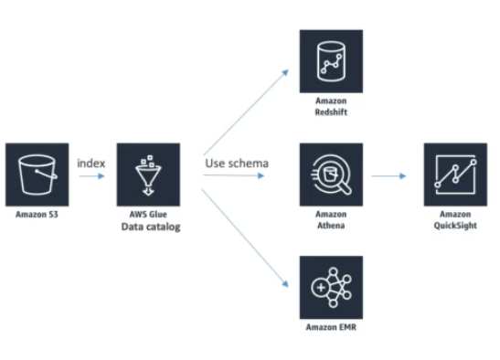
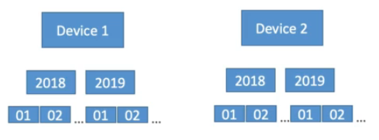

# Glue Data Catalog

* Metadata repository for all your tables
  * Automated schema interface
  * Schemas are versioned
* Integrates with Athena or Redshift Spectrum (schema and data discovery)
* Glue Crawlers can help build the Glue Data Catalog

## Glue Data Catalog - Crawlers

* Crawlers go through your data to infer schemas and partitions
* Works JSON, Parquet, CSV, relation store
* Crawlers work for S3, Amazon Redshift, Amazon RDS
* Run the Crawler on a Schedule or On Demand
* Need an IAM role / credentials to access the data stores

# Glue and S3 Partitions

* Glue crawler will extract partitions based on how you S3 data is organized
* Think up front about how you will be querying your data lake in S3
* Example: devices and sensor data every hour
* Do you query primarily by time ranges?
  * If so, organize you buckets as `s3://my-bucket/dataset/yyyy/mm/dd/device`
* Do you query primarily by device?
  * If so, organize your buckets as `s://my-bucket/dataset/device/yyyy/mm/dd/device`
  
