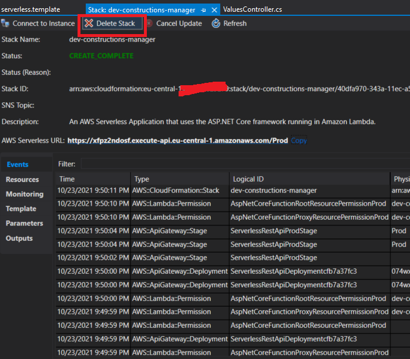

- [Basic IAM entities: Role, User, User group, Policy, Permission](#basic-iam-entities-role-user-user-group-policy-permission)
- [IAM Roles](#iam-roles)
  - [Assume role in AWS Console](#assume-role-in-aws-console)
    - [Introduction](#introduction)
    - [Create IAM role](#create-iam-role)
    - [Create IAM user](#create-iam-user)
    - [Configure aws credentials file](#configure-aws-credentials-file)
    - [Usage @Infra role](#usage-infra-role)
    - [Assuming multiple IAM roles](#assuming-multiple-iam-roles)
- [IAM user groups](#iam-user-groups)
- [IAM Access Analyzer and Access Advisor](#iam-access-analyzer-and-access-advisor)
- [Access Policies Schema](#access-policies-schema)
- [Types of AWS credentials](#types-of-aws-credentials)
- [Managing server certificates in IAM](#managing-server-certificates-in-iam)
- [Links](#links)

# Basic IAM entities: Role, User, User group, Policy, Permission

* **Permission**: it is the smallest "unit" in IAM. It's the statement in a policy that allows or denies access. Permissions in AWS are defined within policies.
* **Policy**: A policy is a document that formally states one or more permissions. It is written in JSON format. **Policy can be assigned to users, user groups and role.** In context of a single user, user group and role it is called **Permissions Policies**.
  
* **User**: An IAM user is an identity with **long-term credentials** that is used to interact with AWS in an account.
* **User group**: A user group is a collection of IAM users. Use groups to **specify permissions (these are statements from policies)** for a collection of users.
* **Role**: An IAM role is an identity you can create that has specific permissions with **credentials that are valid for short durations**. Roles can be assumed by entities that you trust.

# IAM Roles

**Roles are used for temporary permissions - it is easy to assign another role and in this way complete change user permissions.**

**Roles also can be used to map corporate identities to roles - then we even do not have create IAM Users. We can federate corporate identities into AWS account.**

**When someone assumes an IAM role, they abandon all previous permissions that they had under a previous role and assume the permissions of the new role.**

Other important features of IAM roles:
* No static login credentials
* IAM roles are assumed programmatically
* **Credentials are temporary** for a configurable amount of time

Roles can be assumed by:
* An **IAM user or role** in the same or different AWS account that needs the access that the role provides
* Applications on an Amazon Elastic Compute Cloud (Amazon EC2) instance that need access to AWS resources
* An AWS service that needs to call other services on your behalf or create and manage resources in your account.
* An external user authenticated by an identity provider service that is compatible with **SAML 2.0 or OpenID Connect, or a custom-built identity broker**
* If your organization uses multiple accounts, roles will be a key part of your strategy of centrally managing users' access across multiple accounts.
* **NOTE: IAM group cannot assume IAM roles!**

## Assume role in AWS Console

### Introduction

It is AWS best practice to use roles to grant limited access to certain resources for a limited period of time. Thanks to these IAM users can be deleted and created again to increase security (IAM users credentials are stored in c:\Users\[user-name]\.aws\credentials file).

Additionally if some resources are created using only IAM users (without using role) then we might loose access to these resources if IAM user that created them was deleted. Such resource is EKS then root aws account has to be used to again get access to the EKS but again because of security reasons root aws account should be use as less as possible.

### Create IAM role


Select permissions which will be need (best practice is to select only these which are really needed):


Next we have to add policy that allows the role to be assumed by any IAM user in the aws account 123456789012 (fake number), **if the administrator of that account explicitly grants the ```sts:assumerole``` permission to the user.**

```
{
  "Version": "2012-10-17",
  "Statement": [
    {
      "Effect": "Allow",
      "Principal": {
        "AWS": "arn:aws:iam::123456789012:root"
      },
      "Action": "sts:AssumeRole"
    }
  ]
}
```

>NOTE: It seems that if on a role we specify exact IAM user then it is not need to add ```sts:assumerole``` on this user.

```
{
  "Version": "2012-10-17",
  "Statement": [
    {
      "Sid": "",
      "Effect": "Allow",
      "Principal": {
        "AWS": [
          "arn:aws:iam::593685711111:user/infrastructure-admin"
        ]
      },
      "Action": "sts:AssumeRole"
    }
  ]
}
```


### Create IAM user

**By default, when you create a new IAM user in AWS, it has no permissions associated with it**


Next we should copy credentials and placed them in aws ```credentials``` file on local machine.


Next we have to add policy that allows the user to assume only the ```@Infra``` role.

>NOTE: Like explained in chapter create role this step is needed only if IAM role has policy assume role specified using root user!

```
{
  "Version": "2012-10-17",
  "Statement": [
    {
      "Effect": "Allow",
      "Action": "sts:AssumeRole",
      "Resource": "arn:aws:iam::123456789012:role/@Infra"
    }
  ]
}
```


>NOTE: pay attention that this IAM user has only this one permission and this is the key point because then all permissions are controlled on the role level. 

### Configure aws credentials file

Next we have to configure credential files:

```
[infra]
role_arn = arn:aws:iam::123456789012:role/@Infra
source_profile = deployer-do-not-use-this-profile-directly

[deployer-do-not-use-this-profile-directly]
aws_access_key_id = [KEY]
aws_secret_access_key = [ACCESS_KEY]
output=json
region=eu-central-1
```

>NOTE: in case of terraform assume role we have to use different way of configuring credentials: do not use `source_profile` and simply set only `aws_access_key_id` and `aws_secret_access_key` for the IAM user and next use such profile in terraform. Example of using user profile is available in terraform repository (without assuming a role):
https://github.com/kicaj29/Terraform/tree/master/aws/terraform-enhanced-backend

### Usage @Infra role

Next we can use ```@Infra``` role to do some operations in AWS (assuming it has proper permissions).
For example we can deploy AWS lambda.


Next we can delete created stack to clean up:




### Assuming multiple IAM roles

**You cannot apply multiple roles to a single instance.**

https://repost.aws/questions/QU-EiIvq3rTGyctiWqMfrSwg/how-to-access-multiple-roles-from-single-iam-user-simultaneously

*Technically, you can assume multiple IAM roles at the same time but the permissions will not be aggregated. Assuming an IAM role doesn't change who you are or what permissions you have.*

*When you assume a role, you are given a new set of temporary credentials to use, instead of "your" credentials -- the credentials you used to assume the role.*

*When interacting with AWS resources each request can only be associated with a singular principal. So, if you assume role1 and role2 you can make requests as role1 OR role2 but not as both together. So, if you are trying to perform a single action that requires an aggregate of the permissions of multiple roles, that's a not possible.*

https://stackoverflow.com/questions/48876077/assume-multiple-aws-iam-roles-are-a-single-time#:~:text=1%20Answer&text=Technically%2C%20yes%2C%20there%20is%20a,to%20assume%20a%20different%20identity.

# IAM user groups

An IAM group is a collection of users. All users in the group inherit the permissions assigned to the group. 
**Permissions can be assigned to user groups but not IAM roles.**

# IAM Access Analyzer and Access Advisor

https://docs.aws.amazon.com/IAM/latest/UserGuide/what-is-access-analyzer.html

*"IAM Access Analyzer helps you identify the resources in your organization and accounts, such as Amazon S3 buckets or IAM roles, shared with an external entity. This lets you identify unintended access to your resources and data, which is a security risk."*

**Access Analyzer** gives some visibility into existing external access but does not offer any insight into if the permissions are excessive and how to remediate the risk if so. Another AWS tool, **Access Advisor, analyzes usage of access permissions to services by IAM objects such as users, groups, roles and policies**.

# Access Policies Schema

https://docs.aws.amazon.com/IAM/latest/UserGuide/access_policies.html#access_policies-json

IAM polices can be applied to AWS identities:
* users
* groups
* roles

**Effect, Action are required fields.**

Sample policies:

```json
{
  "Version": "2012-10-17",
  "Statement": [
    {
      "Sid": "FirstStatement",
      "Effect": "Allow",
      "Action": ["iam:ChangePassword"],
      "Resource": "*"
    }
  ]
}
```
```json
{
  "Version": "2012-10-17",
  "Statement": [
    {
      "Sid": "DenyS3AccessOutsideMyBoundary",
      "Effect": "Deny",
      "Action": [
        "s3:*"
      ],
      "Resource": "*",
      "Condition": {
        "StringNotEquals": {
          "aws:ResourceAccount": [
            "222222222222"
          ]
        }
      }
    }
  ]
}
```

* **Version**: The Version element defines the version of the policy language. It specifies the language syntax rules that are needed by AWS to process a policy. To use all the available policy features, include "Version": "2012-10-17" before the "Statement" element in your policies.
* **Effect**: The Effect element specifies whether the policy will allow or deny access. In this policy, the Effect is "Allow", which means you’re providing access to a particular resource.
* The **Action** element describes the type of action that should be allowed or denied. In the example policy, the action is "*". This is called a wildcard, and it is used to symbolize every action inside your AWS account.
* The **Resource** element specifies the object or objects that the policy statement covers. In the policy example, the resource is the wildcard "*". This represents all resources inside your AWS console.

# Types of AWS credentials

* Username and password   
  **A password policy** is a set of rules that define the type of password an IAM user can set. You should define a password policy for all of your IAM users to enforce strong passwords and to require your users to regularly change their passwords. Password requirements are similar to those found in most secure online environments.

  

* Multi-factor authentication   
  Multi-factor authentication (MFA) is an additional layer of security for accessing AWS services. With this authentication method, more than one authentication factor is checked before access is granted, **which consists of a user name, a password, and the single-use code from the MFA device**.

  

* User access keys   
  Users need their own access keys to make programmatic calls to AWS using the AWS CLI or the AWS SDKs, or direct HTTPS calls using the APIs for individual AWS services. Access keys are used to digitally sign API calls made to AWS services. Each access key credential consists of an access key ID and a secret key. **Each user can have two active access keys, which is useful when you need to rotate the user's access keys or revoke permissions.** 

  

# Managing server certificates in IAM

https://docs.aws.amazon.com/IAM/latest/UserGuide/id_credentials_server-certs.html

Use IAM as a certificate manager only when you must support HTTPS connections in a Region that is not supported by ACM. IAM securely encrypts your private keys and stores the encrypted version in IAM SSL certificate storage. IAM supports deploying server certificates in all Regions, but you must obtain your certificate from an external provider for use with AWS. You cannot upload an ACM certificate to IAM. Additionally, you cannot manage your certificates from the IAM Console.

# Links
https://aws-blog.de/2021/08/iam-what-happens-when-you-assume-a-role.html   
https://docs.aws.amazon.com/cli/latest/userguide/cli-configure-role.html