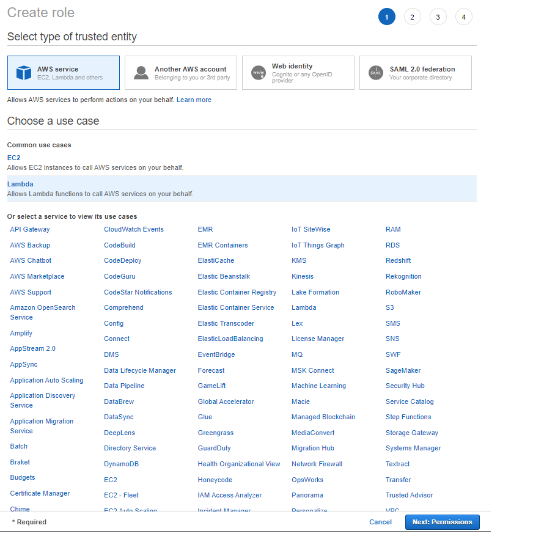
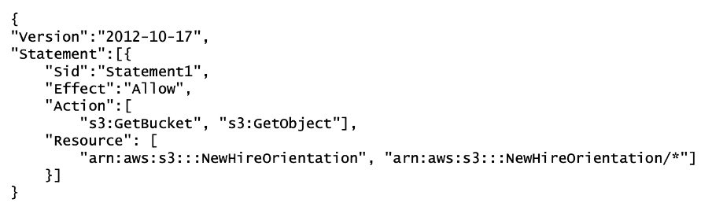
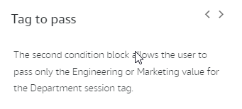

- [Basic IAM entities: Role, User, User group, Policy, Permission](#basic-iam-entities-role-user-user-group-policy-permission)
- [IAM Roles](#iam-roles)
  - [Passing a role to an AWS service](#passing-a-role-to-an-aws-service)
    - [Condition keys for passing roles](#condition-keys-for-passing-roles)
  - [Assume role in AWS Console](#assume-role-in-aws-console)
    - [Introduction](#introduction)
    - [Create IAM role](#create-iam-role)
    - [Create IAM user](#create-iam-user)
    - [Configure aws credentials file](#configure-aws-credentials-file)
    - [Usage @Infra role](#usage-infra-role)
    - [Assuming multiple IAM roles](#assuming-multiple-iam-roles)
  - [IAM PassRole vs IAM AssumeRole](#iam-passrole-vs-iam-assumerole)
- [IAM user groups](#iam-user-groups)
- [IAM Access Analyzer and Access Advisor](#iam-access-analyzer-and-access-advisor)
- [IAM Policy](#iam-policy)
  - [Policy: AWS managed, Customer managed, Inline](#policy-aws-managed-customer-managed-inline)
  - [Access Policies Schema](#access-policies-schema)
  - [Policy types](#policy-types)
    - [Guardrails vs. grants](#guardrails-vs-grants)
  - [Principal types](#principal-types)
  - [Analyzing the authorization context](#analyzing-the-authorization-context)
  - [Attributes and Tagging](#attributes-and-tagging)
    - [Benefits of the ABAC method](#benefits-of-the-abac-method)
  - [IAM Condition Keys](#iam-condition-keys)
- [Explicit and implicit denies](#explicit-and-implicit-denies)
- [Types of AWS credentials](#types-of-aws-credentials)
- [Managing server certificates in IAM](#managing-server-certificates-in-iam)
- [Global Condition Keys](#global-condition-keys)
  - [Who made what request?](#who-made-what-request)
  - [Who called first, and who called last?](#who-called-first-and-who-called-last)
- [Advanced Policy Elements](#advanced-policy-elements)
  - [The power of the NOTs](#the-power-of-the-nots)
  - [NotPrincipal](#notprincipal)
    - [Case study: Centralized credential store](#case-study-centralized-credential-store)
      - [Background](#background)
      - [Viewing the bucket](#viewing-the-bucket)
      - [Updating stored credentials](#updating-stored-credentials)
      - [Acquiring stored credentials](#acquiring-stored-credentials)
      - [Using Amazon S3 data protection](#using-amazon-s3-data-protection)
  - [NotAction](#notaction)
    - [Case study: Permissions guardrails with AWS Organizations](#case-study-permissions-guardrails-with-aws-organizations)
      - [Background](#background-1)
      - [Creating the SCP](#creating-the-scp)
      - [Restricting actions](#restricting-actions)
      - [Granting exceptions](#granting-exceptions)
  - [NotResource](#notresource)
- [Interacting with AWS STS](#interacting-with-aws-sts)
  - [Temporary security credentials use cases](#temporary-security-credentials-use-cases)
  - [Assuming a role](#assuming-a-role)
    - [The AssumeRole request](#the-assumerole-request)
    - [The AssumeRole response](#the-assumerole-response)
    - [Managing Role Sessions](#managing-role-sessions)
      - [Session policies for scoping down permissions](#session-policies-for-scoping-down-permissions)
        - [Use case: Restricting admin access](#use-case-restricting-admin-access)
      - [Naming individual sessions for more control](#naming-individual-sessions-for-more-control)
        - [Use case: Enforcing pre-approved roles](#use-case-enforcing-pre-approved-roles)
      - [Session Tagging](#session-tagging)
        - [Session tag considerations](#session-tag-considerations)
        - [Role chaining and session tags](#role-chaining-and-session-tags)
        - [Use case: Granting corporate employees AWS access based on job function](#use-case-granting-corporate-employees-aws-access-based-on-job-function)
- [Federating Users in AWS](#federating-users-in-aws)
  - [SAML-Based Federation](#saml-based-federation)
    - [The AssumeRoleWithSAML request](#the-assumerolewithsaml-request)
    - [The AssumeRoleWithSAML response](#the-assumerolewithsaml-response)
    - [Using ABAC for identity federation](#using-abac-for-identity-federation)
- [Web-Based Federation](#web-based-federation)
- [Test](#test)
- [Links](#links)

# Basic IAM entities: Role, User, User group, Policy, Permission

* **Permission**: it is the smallest "unit" in IAM. It's the statement in a policy that allows or denies access. Permissions in AWS are defined within policies.
* **Policy**: A policy is a document that formally states one or more permissions. It is written in JSON format. **Policy can be assigned to users, user groups and role.** In context of a single user, user group and role it is called **Permissions Policies**.
  
  Policy can exist also as **inline policy** which is always in context of single user, user group or role ane cannot be assigned to other users, user groups or roles.
  
* **User**: An IAM user is an identity with **long-term credentials** that is used to interact with AWS in an account.
* **User group**: A user group is a collection of IAM users. Use groups to **specify permissions (these are statements from policies)** for a collection of users.
* **Role**: An IAM role is an identity you can create that has specific permissions with **credentials that are valid for short durations**. Roles can be assumed by entities that you trust.

# IAM Roles

**Roles are used for temporary permissions - it is easy to assign another role and in this way complete change user permissions.**

**Roles also can be used to map corporate identities to roles - then we even do not have create IAM Users. We can federate corporate identities into AWS account.**

**When someone assumes an IAM role, they abandon all previous permissions that they had under a previous role and assume the permissions of the new role.**

Other important features of IAM roles:
* No static login credentials
* IAM roles are assumed programmatically
* **Credentials are temporary** for a configurable amount of time

Roles can be assumed by:
* An **IAM user or role** in the same or different AWS account that needs the access that the role provides
* Applications on an Amazon Elastic Compute Cloud (Amazon EC2) instance that need access to AWS resources
* An AWS service that needs to call other services on your behalf or create and manage resources in your account.
* An external user authenticated by an identity provider service that is compatible with **SAML 2.0 or OpenID Connect, or a custom-built identity broker**
* If your organization uses multiple accounts, roles will be a key part of your strategy of centrally managing users' access across multiple accounts.
* **NOTE: IAM group cannot assume IAM roles!**

## Passing a role to an AWS service

There are many AWS services that require permissions via a role to perform actions on your behalf. To configure these services, you need to **pass the role to the service only once during setup**. For example, assume that you have an application running on an Amazon EC2 instance that requires access to an Amazon DynamoDB table. The application needs temporary credentials for authentication and authorization to interact with the table. When you set up the application, you must pass a role to Amazon EC2 to use with the instance that provides those credentials. The **application assumes the role every time it needs to perform the actions that the role allows**.

### Condition keys for passing roles

To pass a role to an AWS service, a user must have the proper permissions. This helps to ensure that only approved users can configure a service with a role that grants permissions. In order to allow a user to pass a role to an AWS service, you must first add the `iam:PassRole` action to its IAM policy. You may also add IAM condition keys to your policies to further control how roles are passed

* `iam:PassedToService`: The `iam:PassedToService` key specifies the service principal of the service to which a role can be passed. A service principal is the name of a service that can be specified in the Principal element of a policy in the following format: `SERVICE_NAME_URL.amazonaws.com`. You can use `iam:PassedToService` to restrict your users so that they can pass roles only to specific services and ensure that users create service roles only for the services that you specify. 

  For example, a user might create a service role that trusts Amazon CloudWatch to write log data to an Amazon S3 bucket on their behalf. In this case, the trust policy must specify `cloudwatch.amazonaws.com` in the Principal element. If a user with the policy below attempts to create a service role for Amazon EC2, the operation will fail. The failure occurs because the user does not have permission to pass the role to Amazon EC2.

  

* `iam:AssociatedResourceArn`: This condition key specifies the ARN of the resource to which this role will be associated at the destination service.  Use this condition key in a policy to allow an IAM entity (an IAM user or role) to pass a role but only if that role is associated with the specified resource.

  For example, below you have the `iam:PassRole` action with both the `iam:PassedToService` and `iam:AssociatedResourceArn` condition keys. Here you are allowing an IAM entity to pass any role to the Amazon EC2 service to be used with instances in the us-east-1 or us-west-1 Region. The IAM user or role would not be allowed to pass roles to other services, and it doesn't allow Amazon EC2 to use the role with instances in other Regions.

  

## Assume role in AWS Console

### Introduction

It is AWS best practice to use roles to grant limited access to certain resources for a limited period of time. Thanks to these IAM users can be deleted and created again to increase security (IAM users credentials are stored in c:\Users\[user-name]\.aws\credentials file).

Additionally if some resources are created using only IAM users (without using role) then we might loose access to these resources if IAM user that created them was deleted. Such resource is EKS then root aws account has to be used to again get access to the EKS but again because of security reasons root aws account should be use as less as possible.

### Create IAM role



Select permissions which will be need (best practice is to select only these which are really needed):


Next we have to add policy that allows the role to be assumed by any IAM user in the aws account 123456789012 (fake number), **if the administrator of that account explicitly grants the ```sts:assumerole``` permission to the user.**

```
{
  "Version": "2012-10-17",
  "Statement": [
    {
      "Effect": "Allow",
      "Principal": {
        "AWS": "arn:aws:iam::123456789012:root"
      },
      "Action": "sts:AssumeRole"
    }
  ]
}
```

>NOTE: It seems that if on a role we specify exact IAM user then it is not need to add ```sts:assumerole``` on this user.

```
{
  "Version": "2012-10-17",
  "Statement": [
    {
      "Sid": "",
      "Effect": "Allow",
      "Principal": {
        "AWS": [
          "arn:aws:iam::593685711111:user/infrastructure-admin"
        ]
      },
      "Action": "sts:AssumeRole"
    }
  ]
}
```


### Create IAM user

**By default, when you create a new IAM user in AWS, it has no permissions associated with it**


Next we should copy credentials and placed them in aws ```credentials``` file on local machine.


Next we have to add policy that allows the user to assume only the ```@Infra``` role.

>NOTE: Like explained in chapter create role this step is needed only if IAM role has policy assume role specified using root user!

```
{
  "Version": "2012-10-17",
  "Statement": [
    {
      "Effect": "Allow",
      "Action": "sts:AssumeRole",
      "Resource": "arn:aws:iam::123456789012:role/@Infra"
    }
  ]
}
```


>NOTE: pay attention that this IAM user has only this one permission and this is the key point because then all permissions are controlled on the role level. 

### Configure aws credentials file

Next we have to configure credential files:

```
[infra]
role_arn = arn:aws:iam::123456789012:role/@Infra
source_profile = deployer-do-not-use-this-profile-directly

[deployer-do-not-use-this-profile-directly]
aws_access_key_id = [KEY]
aws_secret_access_key = [ACCESS_KEY]
output=json
region=eu-central-1
```

>NOTE: in case of terraform assume role we have to use different way of configuring credentials: do not use `source_profile` and simply set only `aws_access_key_id` and `aws_secret_access_key` for the IAM user and next use such profile in terraform. Example of using user profile is available in terraform repository (without assuming a role):
https://github.com/kicaj29/Terraform/tree/master/aws/terraform-enhanced-backend

### Usage @Infra role

Next we can use ```@Infra``` role to do some operations in AWS (assuming it has proper permissions).
For example we can deploy AWS lambda.


Next we can delete created stack to clean up:


### Assuming multiple IAM roles

**You cannot apply multiple roles to a single instance.**

https://repost.aws/questions/QU-EiIvq3rTGyctiWqMfrSwg/how-to-access-multiple-roles-from-single-iam-user-simultaneously

*Technically, you can assume multiple IAM roles at the same time but the permissions will not be aggregated. Assuming an IAM role doesn't change who you are or what permissions you have.*

*When you assume a role, you are given a new set of temporary credentials to use, instead of "your" credentials -- the credentials you used to assume the role.*

*When interacting with AWS resources each request can only be associated with a singular principal. So, if you assume role1 and role2 you can make requests as role1 OR role2 but not as both together. So, if you are trying to perform a single action that requires an aggregate of the permissions of multiple roles, that's a not possible.*

https://stackoverflow.com/questions/48876077/assume-multiple-aws-iam-roles-are-a-single-time#:~:text=1%20Answer&text=Technically%2C%20yes%2C%20there%20is%20a,to%20assume%20a%20different%20identity.

## IAM PassRole vs IAM AssumeRole

https://demacia.medium.com/difference-between-iam-passrole-and-iam-assumerole-en-id-3cb1ffd71a36
https://www.youtube.com/watch?v=h7Z2l_9Sq8Y

* IAM PassRole: The IAM PassRole is an IAM action that gives us permission to attach an IAM Role to an AWS Service. **The keywords are “attach”, “IAM Role”, “to an AWS Service”.**

* IAM AssumeRole: The IAM AssumeRole is an action for IAM User to assume an IAM Role. **This also has keywords which are “IAM User”, “assume”, and “IAM Role”.**

# IAM user groups

An IAM group is a collection of users. All users in the group inherit the permissions assigned to the group. 
**Permissions can be assigned to user groups but not IAM roles.**

# IAM Access Analyzer and Access Advisor

https://docs.aws.amazon.com/IAM/latest/UserGuide/what-is-access-analyzer.html

*"IAM Access Analyzer helps you identify the resources in your organization and accounts, such as Amazon S3 buckets or IAM roles, shared with an external entity. This lets you identify unintended access to your resources and data, which is a security risk."*

**Access Analyzer** gives some visibility into existing external access but does not offer any insight into if the permissions are excessive and how to remediate the risk if so. Another AWS tool, **Access Advisor, analyzes usage of access permissions to services by IAM objects such as users, groups, roles and policies**.

# IAM Policy

In order to talk about IAM policies, you first need to cover the three main pieces of logic that define what is in the policy and how the policy actually works. These pieces make up the **request context that is authenticated by IAM and authorized accordingly**. You can think of the **principal, action, and resource** as the subject, verb, and object of a sentence, respectively.

* Principal: User, role, external user, or application that sent the request and the policies associated with that principal
* Action: What the principal is attempting to do
* Resource: AWS resource object upon which the actions or operations are performed

## Policy: AWS managed, Customer managed, Inline

* **AWS managed**: AWS manages and creates these types of policies. They can be attached to multiple users, groups, and roles. If you are new to using policies, AWS recommends that you start by using AWS managed policies.
* **Customer managed**: These are policies that you create and manage in your AWS account. This type of policy provides more precise control than AWS managed policies and can also be attached to multiple users, groups, and roles. 
* **Inline**: Inline policies are embedded directly into a single user, group, or role. In most cases, AWS doesn’t recommend using inline policies. This type of policy is useful if you want to maintain a strict one-to-one relationship between a policy and the principal entity that it's applied to. **For example, use this type of policy if you want to be sure that the permissions in a policy are not inadvertently assigned to a principal entity other than the one they're intended for.** 

## Access Policies Schema

https://docs.aws.amazon.com/IAM/latest/UserGuide/access_policies.html#access_policies-json

IAM polices can be applied to AWS identities:
* users
* groups
* roles

* **Effect, Action are required fields.**

Sample policies:

```json
{
  "Version": "2012-10-17",
  "Statement": [
    {
      "Sid": "FirstStatement",
      "Effect": "Allow",
      "Action": ["iam:ChangePassword"],
      "Resource": "*"
    }
  ]
}
```
```json
{
  "Version": "2012-10-17",
  "Statement": [
    {
      "Sid": "DenyS3AccessOutsideMyBoundary",
      "Effect": "Deny",
      "Action": [
        "s3:*"
      ],
      "Resource": "[arn:aws:s3:::myBucket/*]",
      "Condition": {
        "StringNotEquals": {
          "aws:ResourceAccount": [
            "222222222222"
          ]
        }
      }
    }
  ]
}
```

* **Version**: The Version element defines the version of the policy language. It specifies the language syntax rules that are needed by AWS to process a policy. To use all the available policy features, include "Version": "2012-10-17" before the "Statement" element in your policies.

* **Sid**: it is optional and provides a brief description of the policy statement

* **Effect**: The Effect element specifies whether the policy will allow or deny access. In this policy, the Effect is "Allow", which means you’re providing access to a particular resource.

* The **Action** element describes the type of action that should be allowed or denied. In the example policy, the action is "*". This is called a wildcard, and it is used to symbolize every action inside your AWS account.

* The **Resource** element specifies the object or objects that the policy statement covers. In the policy example, the resource is the wildcard "*". This represents all resources inside your AWS console.

* **Condition**: IAM allows you to add conditions to your policy statements. The Condition element is optional and lets you specify conditions for when a policy is in effect. `"Condition" : { "{condition-operator}" : { "{condition-key}" : "{condition-value}" }}`. You can have multiple conditions in a single policy, **which are evaluated using a logical AND.**

## Policy types

* **Identity-based**: Also known as IAM policies, identity-based policies are **managed and inline policies** attached to IAM identities (users, groups to which users belong, or roles). Impacts IAM principal permissions.

* **Resource-based**: These are **inline policies** that are attached to AWS resources. The most common examples of   resource-based policies are Amazon S3 bucket policies and IAM role trust policies. Resource-based policies grant permissions to the principal that is specified in the policy; **hence, the principal policy element is required.**. Grants permission to principals or accounts (same or different accounts).

  The resource-based policy below is attached to an Amazon S3 bucket. According to the policy, only the IAM user carlossalzar can access this bucket.
  
  

* **Permissions boundaries**: A permissions boundary sets the maximum permissions that an identity-based policy can grant to an **IAM user or role** (permissions boundaries cannot be assigned to user group). The entity can perform only the actions that are allowed by both its identity-based policies and its permissions boundaries. Permissions boundaries do not grant permissions! **Resource-based policies that specify the user or role as the principal are not limited by the permissions boundary.** 

  For example, assume that one of your IAM users should be allowed to manage only Amazon S3, Amazon CloudWatch, and Amazon EC2. To enforce this rule, you can use the customer-managed policy enclosed in the square to set the permissions boundary for the user. Then, add the condition block below to the IAM user's policy. The user can never perform operations in any other service, including IAM, even if it has a permissions policy that allows it.

  

  https://docs.aws.amazon.com/IAM/latest/UserGuide/access_policies_boundaries.html   
  https://www.youtube.com/watch?v=t8P8ffqWrsY

* **AWS Organizations SCPs**: AWS Organizations is a service for grouping and centrally managing AWS accounts. If you enable all features in an organization, then you can apply SCPs to any or all of your accounts. SCPs specify the maximum permissions for an account, or a group of accounts, called an organizational unit (OU). 

  
 
* **ACLs**: Use ACLs to control which principals in other accounts can access the resource to which the ACL is attached.  **ACLs are supported by Amazon S3 buckets and objects.** They are similar to resource-based policies although they are the only policy type that does not use the JSON policy document structure. ACLs are cross-account permissions policies that grant permissions to the specified principal. **ACLs cannot grant permissions to entities within the same account.**

* **Session policies**: **A session policy is an inline permissions policy that users pass in the session when they assume the role**. The permissions for a session are the intersection of the identity-based policies for the IAM entity (user or role) used to create the session and the session policies. Permissions can also come from a resource-based policy. **Session policies limit the permissions that the role or user's identity-based policies grant to the session.**

### Guardrails vs. grants

Some policies are used to restrict permissions while others are used to grant access. Using a combination of different policy types not only improves your overall security posture but also minimizes your blast radius in case an incident occurs.


## Principal types

Principal is a person, role, or application that can make a request for an action or operation on an AWS resource.

* **AWS account**: When you use an AWS account identifier as the principal in a policy, you delegate authority to the account. Within that account, the permissions in the policy statement can be granted to all identities, including IAM users and roles in that account. When you specify an AWS account, you can use the Amazon Resource Name (ARN) arn:aws:iam::AWS-account-ID:root or a shortened form that consists of the aws: prefix followed by the account ID.

  For example, given an account ID of 123456789012, you can use either one of the following methods to specify that account in the Principal element.

  

* **IAM user**: You can specify an individual IAM user (or array of users) as the principal, as in the following examples. When you specify more than one principal in the element, **you grant permissions to each principal. This is a logical OR** and not a logical AND because you are authenticated as one principal at a time. In a Principal element, the user name is case-sensitive. When you specify users in a Principal element, **you cannot use a wildcard (*) to mean "all users."** Principals must always name a specific user or users.

  

* **Federated user**: If you already manage user identities outside AWS, you can use IAM identity providers instead of creating IAM users in your AWS account. With an identity provider (IdP), you can manage your user identities outside AWS and give these external user identities permissions to use AWS resources in your account. IAM supports SAML-based IdPs and web identity providers, such as Login with Amazon, Amazon Cognito, Facebook, or Google. 

  Here are examples of a Principal element used for federated web identity users and for federated SAML users.

  

* **IAM role**: You can use roles to delegate access to users, applications, or services that don't normally have access to your AWS resources. For example, you might want to grant users in your AWS account access to resources they don't usually have or grant users in one AWS account access to resources in another account.  The entity that assumes the role will lose its original privileges and gain the access associated with the role.

  

* **AWS Service**: IAM roles that can be assumed by an AWS service are called service roles. **Service roles must include a trust policy, which are resource-based policies that are attached to a role that define which principals can assume the role.** Some service roles have predefined trust policies. However, in some cases, you must specify the service principal in the trust policy. A service principal is an identifier that is used to grant permissions to a service.

  The identifier includes the long version of a service name and is usually in the long_service-name.amazonaws.com format. The following example shows a policy that can be attached to a service role. The policy enables two services—Amazon EMR and AWS Data Pipeline—to assume the role. 

  

## Analyzing the authorization context

In summary, when a principal tries to use the AWS Management Console, the AWS API, or the AWS CLI, that principal sends a request to AWS. AWS gathers the request information into a request context, which is used to evaluate and authorize the request. During authorization, AWS uses values from the request context to check for policies that apply to the request. It then uses the policies to determine whether to allow or deny the request.

* Example 1: access denied because requested action **iam:GetUser** does not match to the action from the policy **"dynamodb:ListTables"**
  

* Example 2: access denied because the request tries to access resource **arn:aws:iam::123456789012:user/Carol** but policy says that only resource **arn:aws:iam::123456789012:user/Bob** can be accessed
  

* Example 3: access granted, request matches policy including the same tag value for tags **aws:ResourceTag/project** and **aws:PrincipalTag/project**
  

## Attributes and Tagging

Attribute-based access control (ABAC) is an authorization strategy that defines permissions based on attributes. In AWS, these attributes are called tags. Tags can be attached to IAM principals (users or roles) and to AWS resources. 

You can create a single ABAC policy or small set of policies for your IAM principals. These ABAC policies can be designed to allow operations when the principal's tag matches the resource tag. ABAC is helpful in environments that are growing rapidly and helps with situations where policy management becomes cumbersome.

### Benefits of the ABAC method

* **Scalable**: Teams change and grow quickly. It is no longer necessary for an administrator to update existing policies to allow access to new resources because permissions for new resources are automatically granted based on attributes. 

* **Manageable**: Because you don't have to create different policies for different job functions, you create fewer policies. Those policies are easier to manage.

* **Granular permissions**: When you create policies, it's a best practice to grant least privilege. Using traditional RBAC, you must write a policy that allows access to only specific resources. However, when you use ABAC, you can allow actions on all resources but only if the resource tag matches the principal's tag.

## IAM Condition Keys

The `Condition` element in a policy lets you indicate the circumstances for when a policy is in effect. You can use the `Condition` element to compare keys in the request context with key values that you specify in your policy. This gives you granular control over when your JSON policy statements match or don't match an incoming request.

The condition key that you specify can be a service-specific or a global condition key. Service-specific condition keys have the service's prefix. For example, Amazon EC2 lets you write a condition using the `ec2:InstanceType` key, which is unique to that service.

Below you can read about different service-specific keys for IAM:   

https://docs.aws.amazon.com/IAM/latest/UserGuide/reference_policies_elements_condition_operators.html#Conditions_String

* **iam:AWSService**: This condition key is used to control access for a specific service role. Many AWS services require that you use roles to allow the service to access resources in other services on your behalf. A role that a service assumes to perform actions on your behalf is called a service role. Here you are able to specify the service to which the permissions in the policy applies.

  To allow an IAM entity to create a specific service role, add the following policy to the IAM entity that needs to create the service role. This policy allows you to create a service role for the specified service and with a specific name. You can then attach managed or inline policies to that role.

  

* **iam:OrganizationsPolicyId**: For those accounts that are members of an AWS Organizations unit, this condition key provides the IAM entity access to specific SCPs. The example shown here is an IAM policy that allows viewing service last accessed information for SCP with the p-policy123 ID. This policy also allows the requester to retrieve the data for any Organizations entity in their organization.

  

* **iam:PermissionsBoundary**: The `iam:PermissionsBoundary` key checks that the specified policy is attached as a permissions boundary on the IAM principal resource.

* **iam:PolicyARN**: This condition key checks the Amazon Resource Name (ARN) of a managed policy in requests that involve that same managed policy. You use this key to control how users can apply AWS managed and customer managed policies. For example, you might create a policy that allows users to attach only the IAMUserChangePassword AWS managed policy to a new IAM user, group, or role.

  In the below policy, the iam:PolicyARN condition ensures that permissions are allowed only when the policy being attached matches the AWS managed policy in the condition. Here, the user is allowed to attach policies to only the groups and roles that include the path /TEAM-A/.

  

* **iam:ResourceTag**: The iam:ResourceTag condition key checks that the tag attached to the identity resource, either a user or role, matches the specified key name and value provided. You can add custom attributes to a user or role in the form of a key-value pair, such as environment=prod where "environment" is the key and "prod" is the value. An upcoming lesson will talk more about using tags.

  The example shows how you might create a policy that allows deleting users with only the `status=terminated` tag.

  

# Explicit and implicit denies

A request results in an explicit deny if an applicable policy includes a Deny statement. If policies that apply to a request include an Allow statement and a Deny statement, the Deny statement trumps the Allow statement. The request is explicitly denied.

An implicit denial occurs when there is no applicable Deny statement but also no applicable Allow statement. Because an IAM user, role, or federated user is denied access by default, they must be explicitly allowed to perform an action. Otherwise, they are implicitly denied access.

The flow chart below provides details about how the decision is made as AWS authenticates the principal that makes the request. AWS evaluates the policy types in the following order:


# Types of AWS credentials

* Username and password   
  **A password policy** is a set of rules that define the type of password an IAM user can set. You should define a password policy for all of your IAM users to enforce strong passwords and to require your users to regularly change their passwords. Password requirements are similar to those found in most secure online environments.

  

* Multi-factor authentication   
  Multi-factor authentication (MFA) is an additional layer of security for accessing AWS services. With this authentication method, more than one authentication factor is checked before access is granted, **which consists of a user name, a password, and the single-use code from the MFA device**.

  

* User access keys   
  Users need their own access keys to make programmatic calls to AWS using the AWS CLI or the AWS SDKs, or direct HTTPS calls using the APIs for individual AWS services. Access keys are used to digitally sign API calls made to AWS services. Each access key credential consists of an access key ID and a secret key. **Each user can have two active access keys, which is useful when you need to rotate the user's access keys or revoke permissions.** 

  

# Managing server certificates in IAM

https://docs.aws.amazon.com/IAM/latest/UserGuide/id_credentials_server-certs.html

Use IAM as a certificate manager only when you must support HTTPS connections in a Region that is not supported by ACM. IAM securely encrypts your private keys and stores the encrypted version in IAM SSL certificate storage. IAM supports deploying server certificates in all Regions, but you must obtain your certificate from an external provider for use with AWS. You cannot upload an ACM certificate to IAM. Additionally, you cannot manage your certificates from the IAM Console.

# Global Condition Keys

Global condition keys start with the `aws:` prefix. AWS services can support global condition keys or provide service-specific keys that include their service prefix. Not all AWS services support all of the available global condition keys.

## Who made what request?

https://docs.aws.amazon.com/IAM/latest/UserGuide/reference_policies_condition-keys.html#condition-keys-calledvia   

When an IAM principal (user or role) makes a request to an AWS service, that service might use the principal's credentials to make subsequent requests to other services. If there is no service role configured, the request context may contain the `aws:CalledVia` key. This condition key includes information in the form of an ordered list of each service in the chain that made requests on the principal’s behalf. This information is available only if the AWS services involved support `aws:CalledVia`.

For example, here AWS CloudFormation is reading and writing from an Amazon DynamoDB table. DynamoDB then uses the encryption services supplied by AWS Key Management Service (AWS KMS) to protect the data


* **1**: `cloudformation:CreateStack`, principal requests made directly to a service are not recorded by the `aws:CalledVia` context key. This is the case for User 1`s call to CloudFormation to create a stack.
* **2**: `dynamodb:CreateTable`, CloudFormation used the principal's credentials to create a table in DynamoDB. Here, CloudFormation is the first piece of information recorded by the `aws:CalledVia` context key.
* **3**: `kms:Encrypt`, DynamoDB uses AWS KMS to encrypt data as it's been written to the new table, so a call is made by DynamoDB to AWS KMS on behalf of the principal. Here, DynamoDB is the second service  making a call and being recorded by `aws:CalledVia`

In the diagram above, User 1 makes a request to AWS CloudFormation, which calls DynamoDB, which calls AWS KMS. These are three separate requests. User 1 performs the final call to AWS KMS via AWS CloudFormation and then DynamoDB. In this case, the aws:CalledVia key in the request context includes cloudformation.amazonaws.com and dynamodb.amazonaws.com in that order. If you care only that the call was made via DynamoDB somewhere in the chain of requests, you can use this condition key in your policy.

For your first policy example, the following allows managing the AWS KMS key named my-example-key but only if DynamoDB is one of the services making the request. The ForAnyValue:StringEquals condition operator ensures that DynamoDB is one of the calling services. If the principal makes the call to AWS KMS directly, the condition returns false and the request is not allowed by this policy.

```json
{
    "Version": "2012-10-17",
    "Statement": [
        {
            "Sid": "KmsActionsIfCalledViaDynamodb",
            "Effect": "Allow",
            "Action": [
                "kms:Encrypt",
                "kms:Decrypt",
                "kms:ReEncrypt*",
                "kms:GenerateDataKey",
                "kms:DescribeKey"
            ],
            "Resource": "arn:aws:kms:region:111122223333:key/my-example-key",
            "Condition": {
                "ForAnyValue:StringEquals": {
                    "aws:CalledVia": ["dynamodb.amazonaws.com"]
                }
            }
        }
    ]
}
```

## Who called first, and who called last?

If you want to enforce which service makes the first or last call in the aws:CalledVia context key, you can use the `aws:CalledViaFirst` and `aws:CalledViaLast` keys. For example, assume that CloudFormation calls another service named Service X, which calls DynamoDB, which then calls AWS KMS. User 1 performs the final call to AWS KMS via AWS CloudFormation, then Service X, and then DynamoDB. It was first called via CloudFormation and last called via DynamoDB. 


* **1**: because this is a direct request that a principal made to a service, no `CalledVia` context keys are present.
* **2**: `CalledVia: cloudformation`, `CalledViaFirst: cloudformation`, `CalledViaLast: cloudformation`
* **3**: `CalledVia: cloudformation, service X`, `CalledViaFirst: cloudformation`, `CalledViaLast: service X`
* **4**: `CalledVia: cloudformation, service X, dynamodb`, `CalledViaFirst: cloudformation`, `CalledViaLast: dynamodb`

In your second policy example, the following allows managing the same AWS KMS key only if multiple requests were included in the chain. The first request must be made via AWS CloudFormation and the last via DynamoDB like in the diagram above. If other services make requests in the middle of the chain, the operation is still allowed.

```json
{
    "Version": "2012-10-17",
    "Statement": [
        {
            "Sid": "KmsActionsIfCalledViaChain",
            "Effect": "Allow",
            "Action": [
                "kms:Encrypt",
                "kms:Decrypt",
                "kms:ReEncrypt*",
                "kms:GenerateDataKey",
                "kms:DescribeKey"
            ],
            "Resource": "arn:aws:kms:region:111122223333:key/my-example-key",
            "Condition": {
                "StringEquals": {
                    "aws:CalledViaFirst": "cloudformation.amazonaws.com",
                    "aws:CalledViaLast": "dynamodb.amazonaws.com"
                }
            }
        }
    ]
}
```

# Advanced Policy Elements

## The power of the NOTs

AWS offers several advanced policy elements that not only let you specify exceptions in policies but may also result in shorter and more streamlined policies. Think of it this way: let's say you go to a sandwich shop, and the person behind the counter asks you what you want in your sandwich. Instead of listing all of the available ingredients you want one by one and leaving out only one, you can simply say, "I want all of the ingredients except for onions." This lesson covers the `NotPrincipal`, `NotAction`, and `NotResource` policy elements.

## NotPrincipal

The `NotPrincipal` element lets you specify an exception to a list of principals. For example, you can use this element to allow all AWS accounts except a specific account to access a resource. Conversely, you can deny access to all principals except the one named in the `NotPrincipal` element. As with the Principal element, you specify the user or account that should be allowed or denied permission. The difference is that the NotPrincipal element applies to everyone except that person or account. When used in conjunction with an identity policy that also explicitly allows that entity access to the specific resources, the `NotPrincipal` element can help ensure that only necessary parties can access a resource.

* **NotPrincipal with Allow**: It is strongly recommend that you do not use NotPrincipal in the same policy statement as `"Effect": "Allow"`. Doing so allows all principals except the one named in the NotPrincipal element access to your resources. By doing this, you might grant access to anonymous (unauthenticated) users.

* **NotPrincipal with Deny**: When you use `NotPrincipal` in the same policy statement as `"Effect": "Deny"`, the actions specified in the policy statement are explicitly denied to all principals except for the ones specified in the policy. You can use this method to allow access to only a certain principal while denying the rest. When you use `NotPrincipal` with Deny, you must also specify the account ARN of the not-denied principal. Otherwise, the policy might deny access to the entire account, including the principal. 

**You cannot use the NotPrincipal element in an IAM identity-based policy. You can use it in the trust policies for IAM roles and in resource-based policies.**

### Case study: Centralized credential store

#### Background

An e-commerce company created a new centralized credential store within Amazon S3. One of the company's requirements was to ensure that the credentials stored in the Amazon S3 bucket are protected from misuse. Two levels of access were created to handle the data:

* **Credential manager role** – Has read and write access into the bucket to ensure that they can place new credentials or key files in the bucket

* **Credential user role** – Has read access to only specific bucket directories

#### Viewing the bucket


To begin writing the Amazon S3 resource policy, the company had to create the above statement that allows both the credential manager (CredMgr) and credential user (CredUsr) to be able to see the credential bucket (CredentialBucket). They used a Deny statement along with the NotPrincipal element to ensure that only the individuals specifically listed in the policy are granted access to the credentials within the S3 buckets. 

#### Updating stored credentials


Now that the authorized users can see the CredentialBucket, the company had to ensure that the CredMgr user has the ability to put objects in and get objects from the bucket. This allows the CredMgr role to update credentials stored in the bucket.

#### Acquiring stored credentials


Finally, the company also created a policy to allow credential users and managers the ability to get the credentials for the specific service that they are authorized to access.

The NotPrincipal element along with the Deny statement in each of these policies ensure that even if an IAM administrator creates new IAM users or IAM roles that have access to the CredentialBucket, they will not be able to access the sensitive credentials within the bucket because those users have not been explicitly given allow listed access in the S3 access policy.

#### Using Amazon S3 data protection

Amazon S3 provides a number of data protection capabilities natively. This case study did not explain in detail how to configure the following capabilities, but AWS recommends enabling:

* S3 server-side encryption to help protect your credentials at rest.
* Versioning to help capture any changes to the files.
* Server access logging to help capture requests to access the credentials.
* IAM user permissions to help ensure only authorized individuals can manipulate the settings on your bucket.

## NotAction

The NotAction element explicitly matches everything except the specified list of actions. Using NotAction can result in a shorter policy by listing only a few actions that should not match rather than including a long list of actions that will match. This, in turn, means that all of the applicable actions or services that are not listed are allowed if you use the Allow effect. In addition, such unlisted actions or services are denied if you use the Deny effect. When you use NotAction with the Resource element, you provide scope for the policy. This is how AWS determines which actions or services are applicable.

* **NotAction with Allow**
  As with using the NotPrincipal element with "Allow", it is also strongly recommend that you do not use NotAction in the same policy statement as "Effect": "Allow". Doing so allows all actions except the one named in the NotAction element.

  Here is a policy example that allows users to access all of the Amazon S3 actions that can be performed on any S3 resource except for deleting a bucket. 

  ```json
  "Effect": "Allow",
  "NotAction": "s3:DeleteBucket",
  "Resource": "arn:aws:s3:::*",
  ```

* **NotAction with Deny**
  You can use the NotAction element in a statement with "Effect": "Deny" to deny access to all of the listed resources except for the actions specified in the NotAction element. This combination does not allow the listed items but instead explicitly denies the actions not listed. You must still allow actions that you want to allow.

  The following policy example denies access to non-IAM actions if the user is not signed in using MFA. If the user is signed in with MFA, then the "Condition" test fails and the final "Deny" statement has no effect. Note, however, that this would not grant the user access to any actions; it would only explicitly deny all other actions except IAM actions.

  ```json
  {    
    "Version": "2012-10-17",
    "Statement": [
      {
        "Sid": "DenyAllUsersNotUsingMFA",
        "Effect": "Deny",
        "NotAction": "iam:*",
        "Resource": "*",
        "Condition": {
            "BoolIfExists": {"aws:MultiFactorAuthPresent": "false"}}
        }]
  }  
  ```
### Case study: Permissions guardrails with AWS Organizations

#### Background

An insurance company launched its first central cloud security team to audit and make changes to settings across all of their AWS Organizations accounts. To access these accounts, the team created a role named AdminRole in all of the accounts. This role has the AdministratorAccess managed policy attached to it.

An SCP was created to restrict all IAM entities in each account from modifying the AdminRole or its associated permissions. This helps ensure this role is available to only the central cloud security team.

#### Creating the SCP


First, the company made sure that all of the features in AWS Organizations were enabled, especially SCPs. Then, in the Organizations console, the team selected the Policies tab and created a new SCP.

#### Restricting actions


After the team gave the policy a name of DenyChangesToAdminRole and a description of "Prevents all IAM principals from making changes to AdminRole," they used the Organizations policy editor displayed here to write the policy. 

The AdminRole was selected as the resource. Because this role is common in all accounts but each account ID is different, the wildcard (*) was used in the place of the account ID.

#### Granting exceptions


When the SCP was applied to each account, it prevented all principals from modifying or deleting the AdminRole IAM role. However, the central cloud security team that uses the role had to eventually make changes later on. The team's administrators could not modify the role without lifting the protection of the SCP.

The solution that the team implemented to address this issue involved adding a condition to the SCP to make an exception for the AdminRole itself. The aws:PrincipalArn global condition key was used to return the ARN for the principal making the request. The NotAction would be ignored if the requesting principal is the AdminRole. 

## NotResource

NotResource is an advanced policy element that explicitly matches every resource except those specified. Using NotResource can result in a shorter policy by listing only a few resources that should not match rather than including a long list of resources that will match. This is particularly useful for policies that apply within a single AWS service.

* **NotResource with "Allow"**: Be careful using the NotResource element and "Effect": "Allow" in the same statement or in a different statement within a policy. NotResource allows all services and resources that are not explicitly listed in the policy and could result in granting users more permissions than you intended. 

* **NotResource with "Deny"**: When using NotResource, you should keep in mind that resources specified in this element are the only resources that are not limited. This, in turn, limits all of the resources that would apply to the action. Using the NotResource element and "Effect": "Deny" in the same statement denies services and resources that are not explicitly listed in the policy.

As an example, imagine you have a group named HRPayroll. Members of HRPayroll should not be allowed to access any Amazon S3 resources except the Payroll folder in the HRBucket bucket. The following policy explicitly denies access to all Amazon S3 resources other than the listed resources. Note, however, that this policy does not grant the user access to any resources, so you would need to add an Allow statement to this policy for the access you wish to grant.


**You should never use the NotResource element with the "Effect": "Allow" and "Action": "*" elements together. This statement is very dangerous because it allows all actions in AWS on all resources except the resource specified in the policy. This would even allow the user to add a policy to themselves that allows them to access the resource specified by the NotResource element.**

# Interacting with AWS STS

You can use AWS Security Token Service (AWS STS) to create and provide trusted IAM users or users that you authenticate (federated users) with **temporary security credentials** that can control access to your AWS resources. **Temporary security credentials are required when assuming an IAM role**, and they work almost identically to the long-term access key credentials that your IAM users can use, with the following differences: 

* Temporary security credentials can be configured to last from a few minutes to several hours. After the credentials expire, AWS no longer recognizes them or allows any kind of access from API requests made with them.

* Temporary security credentials are not stored with the user but are generated dynamically and provided to the user when requested. When (or even before) the temporary security credentials expire, the user can request new credentials as long as the user requesting them still has permissions to do so.

## Temporary security credentials use cases

Due to the nature of temporary security credentials, you do not have to rotate them or explicitly revoke them when they're no longer needed. After temporary security credentials expire, they cannot be reused. Also, you can provide access to your AWS resources to users without having to define an AWS identity for them or embed long-term credentials with an application.

* **Identity federation**: You can manage your users in an external system outside AWS and grant them access to perform AWS tasks and access your AWS resources. IAM supports two types of identity federation: **corporate identity federation and web identity federation**. In both cases, the identities are stored outside AWS.

* **Cross-account access**: Many organizations maintain more than one AWS account. Using roles and cross-account access, you can define user identities in one account and use those identities to access AWS resources in other accounts that belong to your organization.

* **Roles for EC2**: If you run applications on Amazon EC2 instances and those applications need access to AWS resources, you can provide temporary security credentials to your instances when you launch them. These temporary security credentials are available to all applications that run on the instance, so you don't need to store any long-term credentials on the instance. 

## Assuming a role

By default, AWS STS is available as a global service, and all AWS STS API requests go to a single endpoint at https://sts.amazonaws.com. When a user or application requires temporary security credentials to access AWS resources, they make the AssumeRole API request. These temporary credentials consist of an access key ID, a secret access key, and a security token. Each time a role is assumed and a set of temporary security credentials is generated, an IAM role session is created.

### The AssumeRole request

Typically, you use AssumeRole within your account or for cross-account access. When it comes to cross-account access, imagine that you own multiple accounts and need to access resources in each account. You could create long-term credentials in each account to access those resources. However, managing all those credentials can be time consuming. Instead, you can create one set of long-term credentials in one account. Then, you use temporary security credentials to access all the other accounts by assuming roles in those accounts. 


* **1**:
  

* **2**: This is  the ARN of the role is being assumed. In this example, the role is named *demo*

* **3**: This parameter includes the ARNs of the IAM managed policies. The policies must exist in the same account as the role. You can provide up to 10 managed policy ARNs.

* **4**: This parameter is an IAM policy that is used as an inline session policy. Incline policies, as opposed to managed policies, have a one-to-one relationship with the attached role session.

* **5**: This is the duration of role session in seconds.

* **6**: This parameter list the session tags that you want to pass with the role.

* **7**:   
  

* **8**:   
  

The AssumeRole request allows you to add several optional parameters to help further secure the role session:

* **DurationSeconds** – By default, the temporary security credentials created by AssumeRole last for 1 hour. However, you can use this parameter to specify the duration of your session and further control the session. You can provide a value from 900 seconds (15 minutes) up to 12 hours.

* **Policy** – This parameter includes IAM policy that you want to use as an inline session policy. The resulting session's permissions are the intersection of the role's identity-based policy and the session policies. 

* **PolicyArns.member.N** – This parameter includes the ARNs of the IAM managed policies that you want to use as managed session policies. The policies must exist in the same account as the role. You can provide up to 10 managed policy ARNs.

* **Tags.member.N** – This parameter lists the session tags that you want to pass with the role. Each session tag consists of a key name and an associated value. An upcoming lesson will cover session tags in more detail.

* **SerialNumber and TokenCode** – You can include MFA information when you call AssumeRole with these parameters. This is useful for cross-account scenarios to ensure that the user who assumes the role has been authenticated with an AWS MFA device. In that scenario, the trust policy of the role being assumed includes a condition that tests for MFA.

### The AssumeRole response

The AssumeRole call returns a set of temporary security credentials for users who have been authorized by AWS STS


 * PackedPolicySize:   
  

### Managing Role Sessions

#### Session policies for scoping down permissions

By default, all users assuming the same role get the same permissions for their role session. To create distinctive role session permissions or to further restrict overall permissions, users or systems can set a session policy when assuming a role. A session policy is an inline permissions policy that users pass in the session when they assume the role. You can pass the policy yourself, or you can configure your broker to insert the policy when your identities federate in to AWS (if you have an identity broker configured in your environment). In either case, any of the three AssumeRole APIs can be used to pass the session policies.

Session policies allows administrators to:

* Reduce the number of roles they need to create because multiple users can assume the same role yet have unique session permissions.

* Set permissions for users to perform only those specific actions for that session. If users don’t require all the permissions associated with the role to perform a specific action in a given session, you can configure the identity broker to pass a session policy to reduce the scope of session permissions when users assume the role. 

Session policies can be applied in the following ways:

* **Identity based policies**
  When you pass session policies, the resulting  permissions are the intersection of the IAM entity's identity-based policy and the session policies. You can use AWS managed or customer managed policies as session policies and also apply the same session permissions for multiple sessions.

  

* **Resource based policies**
  When a resource-based policy is being used, you can specify the ARN of the user or role as a principal. In that case, the permissions from the resource-based policy are added to the role or user's identity-based policy before the session is created. The session policy limits the total permissions granted by the resource-based policy and the identity-based policy. The resulting permissions are the intersection of the session policies and either the resource-based policy or the identity-based policy.

  

##### Use case: Restricting admin access

* **Background**

  A security administrator by the name of Bob has administrative privileges when he assumes the role SecurityAdminAccess in the organization’s AWS account. When Bob assumes this role, he knows the specific actions he will perform using this role. Bob is also cautious of the role permissions and follows the practice of restricting his own permissions by using a session policy when assuming the role. This way, Bob ensures that at any given point in time, his role session can perform only the specific action for which he assumed the SecurityAdminAccess role.

* **Session policy**

  

  In this scenario, Bob needs permissions to access only an Amazon S3 bucket called NewHireOrientation in the same account. He creates the session policy above to reduce his session permissions when assuming the role SecurityAdminAccess. The action and resources elements of the policy statement allow access only to the NewHireOrientation bucket and all the objects inside this bucket.

* **Summary**

  When Bob assumes the SecurityAdminAccess role using the previous aws sts assume-role command, his effective session permissions are the intersection of the permissions on the role and the session policy.

  This means that although the SecurityAdminAccess role had administrative privileges, Bob's resulting session permissions are s3:GetBucket and s3:GetObject on the NewHireOrientation bucket. This way, Bob can ensure he has access to only the NewHireOrientation bucket for this session.

#### Naming individual sessions for more control

Each IAM role session is uniquely identified by a role session name. AWS STS provides a condition key called sts:RoleSessionName that controls how IAM principals and applications name their role sessions when they assume an IAM role. Administrators can rely on the role session name to track user actions when viewing AWS CloudTrail logs.

For example, the following role trust policy requires that IAM users in account 111122223333 provide their IAM user name as the session name when they assume the role. This requirement is enforced using the aws:username condition variable in the condition key. This policy allows IAM users to assume the role to which the policy is attached. This policy does not allow anyone using temporary credentials to assume the role because the username variable is present for only IAM users.

```json
{
    "Version": "2012-10-17",
    "Statement": [
        {
            "Sid": "RoleTrustPolicyRequireUsernameForSessionName",
            "Effect": "Allow",
            "Action": "sts:AssumeRole",
            "Principal": {"AWS": "arn:aws:iam::111122223333:root"},
            "Condition": {
                "StringLike": {"sts:RoleSessionName": "${aws:username}"} }
        }
    ]
}
```

There are different ways to name a role session, and it depends on the method used to assume the IAM role.

* **AWS Service**
  In some cases, AWS sets the role session name on your behalf. For example, for Amazon EC2 instance profiles, AWS sets the role session name to the instance profile ID. The table below provides examples of role session names provided by AWS services.

  

* **SAML-based**
  When you use the AssumeRolewithSAML API to assume an IAM role, AWS sets the role session name value to the attribute provided by the identity provider, which your administrator defined. For scenarios in which corporate identities outside AWS need to access AWS resources, the corporate SAML-based IdP will provide the role session name.

* **User-defined**
  In other cases, you provide the role session name when assuming the IAM role. For example, when assuming an IAM role with APIs such as AssumeRole or AssumeRoleWithWebIdentity, the role session name is a required input parameter that you set when making the API request.

##### Use case: Enforcing pre-approved roles

* **Background**
  You have a new AWS account with an Amazon DynamoDB database that stores competitive analysis data. You do not want members of the marketing department to have direct access to this new AWS account, so you created a role called Analyst in your new account. The requirement is to have the marketing partners select from a pre-defined set of role session names—“marketing-campaign” or “product-development”—which will identify their reason for accessing the competitive analysis data.

* **Trust policy**
  

  First, you need to create a role trust policy for the analyst IAM role. In the role trust policy, you set the marketing IAM role as the principal to restrict who can access the analyst IAM role. Then you use the sts:RoleSessionName condition to define the acceptable role session names: marketing-campaign and product-development.

* **Assuming the role**
  

  Alice from the marketing department wants to access the competitive analysis data. For AWS to authorize the assume-role request, when she assumes the Analyst IAM role, she must set the role session name to one of the pre-defined values. The following is a sample CLI command to assume the analyst IAM role.

Here is an example of a CloudTrail event displaying an AssumeRole call made by an AWS service that requested temporary security credentials. Note the session name: it's an AWS Lambda function that requested to assume the backend-logic-fn-role role, which is most likely a role created especially for that function.

```json
{
     "eventVersion": "1.05",
     "userIdentity": {
               "type": "AWSService",
               "invokedBy": "lambda.amazonaws.com"
     },
     "eventTime": "2019-08-26T11:15:26Z",
     "eventSource": "sts.amazonaws.com",
     "eventName": "AssumeRole",
     "awsRegion": "us-west-2",
     "sourceIPAddress": "lambda.amazonaws.com",
     "userAgent": "lambda.amazonaws.com",
     "requestParameters": {
                 "roleSessionName": "backend-logic-fn",
                 "roleArn": "arn:aws:iam::123456789012:role/backend-logic-fn-role"
     },
     "responseElements": {
                 "credentials": {
                          "sessionToken": "AgoJb3JpZ……2luX2VjEJz",
                          "accessKeyId": "ASIAUF7B273EXAMPLE",
                          "expiration": "Aug 26, 2019 11:15:26 PM"
                   }
     }
}
```

#### Session Tagging

Session tags are attributes passed in an IAM role session when you assume a role or federate a user using the AWS CLI or AWS API. You can use session tags for access control in IAM policies and for monitoring. These tags are not stored in AWS and are valid only for the duration of the session. You define session tags just like tags in AWS, consisting of a customer-defined key and an optional value.

To be able to add session tags, you must have the sts:TagSession action allowed in your IAM policy. For example, the following role trust policy allows the user Carol to assume the role to which the policy is attached. When that user assumes the role, they must use the AWS CLI or AWS API to pass the three required session tags and the required external ID. Additionally, the user can choose to set the Project and Department tags as transitive. Transitive tags are tags that persist through multiple sessions. This lesson will cover transitive tags in detail later.


* **1**   
  

* **2**   
  

* **3**   
  

* **4**   
  

* **5**   
  

* **6**   
  


##### Session tag considerations

Before you use session tags, you need to take several things into consideration. Review the following details about sessions and tags:

* Session tags are principal tags that you specify while requesting a session. 

* Session tags must follow the [rules for naming tags](https://docs.aws.amazon.com/IAM/latest/UserGuide/id_tags.html#id_tags_rules_creating) in IAM and AWS STS. This topic includes information about case sensitivity and restricted prefixes that apply to your session tags.

* New session tags override existing assumed role or federated user tags with the same tag key, regardless of case.

* You cannot pass session tags using the AWS Management Console.

* Session tags are valid for only the current session.

* You can use session tags to control access to resources or to control the tags that can be passed into a subsequent session.

* You can pass a maximum of 50 session tags.

* You can view the principal tags for your session, including its session tags, in the AWS CloudTrail logs.

##### Role chaining and session tags

Session tags support role chaining. Role chaining occurs when you use a role to assume a second role through the AWS CLI or API. You can assume one role and then use the temporary credentials to assume another role and continue from session to session. By default, tags are not passed to subsequent role sessions. **However, you can set session tags as transitive. This ensures that those session tags pass to subsequent sessions in a role chain.** 

In the role chaining scenario, you use an IAM user's access keys in the AWS CLI to assume a role named Role 1. You then use the resulting session credentials to assume a second role named Role 2. You can then use the second session credentials to assume a third role named Role 3. These requests occur as three separate operations. Each role is already tagged in IAM. During each request, you pass session tags represented by the gray tag.


When you chain roles, you can ensure that tags from an earlier session persist to the later sessions. To do this using the assume-role CLI command, **you must pass the tag as a session tag and set the tag as transitive.**

Role chaining is especially useful when you want to impose guardrails against yourself or an administrator in order to prevent something accidental. For example, maybe you assume a generic admin role on a weekly basis. Sometimes, all you need to perform are certain operations that are bounded by a more scoped-down role. You can allow the admin role to assume the other more scoped-down role when needed. This helps avoid management overhead by having roles individually assigned to single users. 

##### Use case: Granting corporate employees AWS access based on job function

* **Background**: Consider a scenario in which your organization deployed Amazon EC2 and Amazon Relational Database Service (Amazon RDS) instances in your AWS account for your company’s production web applications. Your systems engineers manage the EC2 instances, and database engineers manage the RDS instances. Both groups access AWS by federating into your AWS account from a SAML IdP. Your organization’s security policy requires employees to have access to manage only the resources related to their job function and projects they work on.

* **Tag all project resources**: The administrator is looking to implement ABAC using the jobfunction and project attributes as session tags. First, all project resources need to be tagged with the appropriate project tag. This is important because the administrator wants to create permission rules based on this tag to implement ABAC.

* **Create IAM role with permissions based on attributes**: 
  

  Next, the administrator creates an IAM role called MyProjectResources using the AWS Management Console or CLI. This is the role that your systems engineers and database engineers will assume when they federate into AWS to access and manage the EC2 and RDS instances, respectively. To grant this role permissions, the administrator creates the IAM policy above and attaches it to the MyProjectResources role.

  In the policy above, the administrator allows specific actions related to EC2 and RDS that the systems engineers and database engineers need to manage their project instances. In the condition element of the policy statements, the administrator adds a condition based on the jobfunction and project attributes to ensure engineers can access only the instances that belong to their jobfunction and have a matching project tag.

* **Modify the role trust policy**: 
  

  In order to ensure that your systems engineers and database engineers can assume this role when they federate into AWS from your IdP, the administrator modifies the role’s trust policy to trust your SAML IdP as shown in the policy statement above. Because you also want to include session tags when engineers federate in, the administrator adds the new action sts:TagSession in the policy statement as shown below. They also add a condition that requires the jobfunction and project attributes to be included as session tags when engineers assume this role.

* **Configure your SAML IdP**
  

  Once the administrator creates the role and permissions policy in AWS, they [configure the SAML IdP](https://docs.aws.amazon.com/IAM/latest/UserGuide/id_roles_providers_create_saml_relying-party.html) to include the jobfunction and project attributes as session tags in the SAML assertion when engineers federate into AWS using this role. In order to pass attributes as session tags in the federated session, the SAML assertion must contain attributes. The example above shows a part of the SAML assertion generated from the IdP with two attributes (project:Automation and jobfunction:SystemsEngineer) that you want to pass as session tags.

# Federating Users in AWS

You may have users who need access to your AWS accounts that are authenticated through another identity provider. Identity federation is a system of trust between two parties for the purpose of authenticating users and conveying information needed to authorize their access to resources. **In this system, an identity provider (IdP) is responsible for user authentication, and a service provider, such as a service or an application, controls access to resources.** 


* **1**: a trust relationship is configured between the IdP and the service provider. The service provider trusts the IdP to authenticate users and relies on the information provided by the IdP about the users.
* **2**: after authenticating a user, the IdP returns a **message called an assertion**, containing the user`s sign-in name and other attributes that the service provider needs to establish a session with the user and to determine the scope of resource access.
* **3**: the service provider receives the assertion from the user, validates the level of access requested, and sends the user the necessary credentials to access the desired resources.
* **4**: with the right credentials from the service provider, the user has now direct access to the requested resources via an established session.

AWS offers different solutions for federating your employees, contractors, and partners (workforce) to AWS accounts and business applications, and for adding federation support to your customer-facing web and mobile applications. AWS supports commonly used open identity standards, including Security Assertion Markup Language 2.0 (SAML 2.0), Open ID Connect (OIDC), and OAuth 2.0.

* AWS IAM Identity Center: sso to AWS accounts and centrally managed access to resources.
* AWS IAM: fine-grained access to AWS
* AWS Cognito: access to web and mobile apps

## SAML-Based Federation

You can enable federated access to AWS accounts using IAM and AWS STS, which allows you to enable a separate SAML 2.0-based IdP for each AWS account and use federated user attributes for access control. With IAM, you can pass user attributes, such as cost center or job role, from your IdPs to AWS, and implement fine-grained access permissions based on these attributes. IAM helps you define permissions once and then grant, revoke, or modify AWS access by simply changing the attributes in the IdP. 

### The AssumeRoleWithSAML request

Before your application can call AssumeRoleWithSAML, you must configure your SAML IdP to issue the claims that AWS requires. Additionally, you must use IAM to create a SAML provider entity in your AWS account that represents your identity provider. You must also create an IAM role that specifies this SAML provider in its trust policy.


* **1**: this is the role that the federated user is assuming. In this case it is `TestSaml`
* **2**: this is the ARN of the SAML provider configured in IAM that describes the IdP. In this case the IdP is called `SAML-test`
* **3**: this is base64 encoded SAML authentication response that the IdP provides. The Service Provider uses this response to grant access to resources.

The **AssumeRoleWithSAML** request allows you to add several optional parameters to help further secure the role session:

* **DurationSeconds** – Your role session lasts for the duration that you specify in the DurationSeconds parameter or until the time specified in the SAML authentication response's SessionNotOnOrAfter value, whichever is shorter. You can provide a DurationSeconds value from 900 seconds (15 minutes) to the maximum session of 12 hours. The default value is 3,600 seconds (1 hour).

* **Policy** – This parameter includes the IAM policy that you want to use as an inline session policy. The resulting session's permissions are the intersection of the role's identity-based policy and the session policies. 

* **PolicyArns.member.N** – This parameter includes the ARNs of the IAM managed policies that you want to use as managed session policies. The policies must exist in the same account as the role. You can provide up to 10 managed policy ARNs.

### The AssumeRoleWithSAML response

The **AssumeRoleWithSAML** call returns a set of temporary security credentials for users who have been authenticated via a SAML authentication response. This operation provides a mechanism for tying an enterprise identity store or directory to role-based AWS access without user-specific credentials or configuration.


* **1**: the issuer element refers to the entity Id of you IdP which is a URL that uniquely identifies your SAML identity provider. SAML assertions sent to the service provider must match this value exactly in the attribute of the SAML assertion.
* **2**: the **AssumedRoleUser** section contains the ARN of the issue temporary credentials and the unique identifier of the role ID and role session name.
* **3**: this section contains the temporary security credentials, which include an access key ID, a secret access key, a security (or session) token, and the session expiration time.
* **4**: this field specifies the specific audience that the SAML assertion is intended for. The "audience" will be the service provider and is typically a URL.
* **5**: the subject type provides information on the format of the name identifier of the **Subject** field. And identifier intended to be used for a single session only is called a transient identifier.
* **6**: the **PackedPolicySize** is a percentage value that indicates the packed size of the combined session policies and session tags that were passed in the request. The request fails if the packed size is greater than 100%, which means that policies and tags exceeded the allowed space.
* **7**: the **NameQualifier** is a hash value based on the concatenation of the Issuer response value, the AWS account ID, and the name of the SAML provider in IAM. This combination of the **NameQualifier** and **Subject** can be used to uniquely identify a federated user.

### Using ABAC for identity federation

Granting access to cloud resources using ABAC has several advantages. One of them is that you have fewer roles to manage. Users that are federated into AWS can also use ABAC. User attributes can be passed as session tags using standards-based SAML. You can use attributes defined in external identity systems as part of attributes-based access control decisions within AWS. Administrators of the IdP manage user attributes and define attributes to pass in during federation.

For example, imagine that your systems engineer configures your IdP to include "CostCenter" as a session tag when users federate into AWS using an IAM role. All federated users assume the same role but are granted access only to AWS resources belonging to their cost center as displayed in the diagram below.


To setup the solution as displayed above, first you need to tag all project resources with their respective tags and configure the IdP to include the CostCenter tag in the session. The IAM role for this scenario would then grant access to project resources based on the CostCenter tag with the ec2:ResourceTag/CostCenter condition key. Now, whenever users federate into AWS using this role, they get access to only the resources belonging to their cost center based on the CostCenter tag included in the federated session. If a user switches cost centers or is added to a specific cost center, your system administrator will only have to update the IdP, and the permissions in AWS will automatically apply to grant access to the proper cost center's AWS resources without requiring a permissions update in AWS.

# Web-Based Federation

# Test


# Links
https://aws-blog.de/2021/08/iam-what-happens-when-you-assume-a-role.html   
https://docs.aws.amazon.com/cli/latest/userguide/cli-configure-role.html