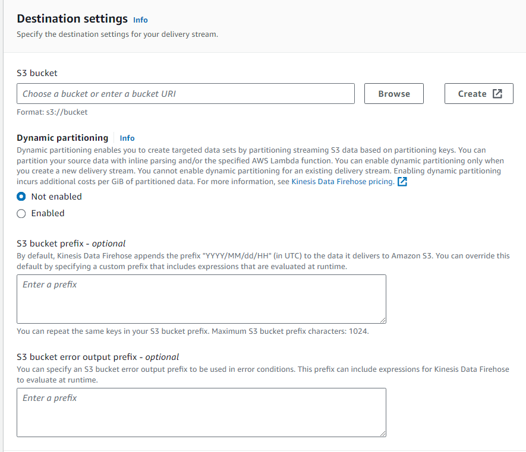
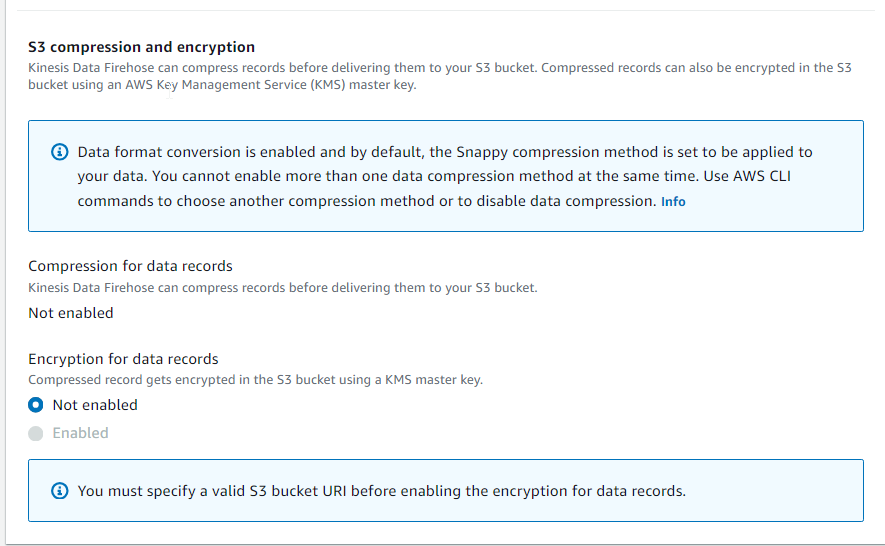

- [Kinesis](#kinesis)
  - [Kinesis Data Streams](#kinesis-data-streams)
    - [Capacity Modes](#capacity-modes)
    - [Limits to know](#limits-to-know)
  - [Kinesis Data Firehose (also called as delivery stream)](#kinesis-data-firehose-also-called-as-delivery-stream)
- [Kinesis Data Streams vs Firehose](#kinesis-data-streams-vs-firehose)

# Kinesis

* Kinesis = real-time big data streaming
* Data is automatically replicated synchronously to 3 AZ
* Kinesis is a managed alternative for Apache Kafka
* Great for application logs, metrics, IoT, clickstreams
* Managed service to collect, process and analyze real-time streaming data at any scale
* **Kinesis Data Streams**: low latency streaming to ingest data at scale from hundreds of thousands of sources (on boarding data)
* **Kinesis Data Firehose**: load streams into S3, Redshift, ElasticSearch, etc...
* **Kinesis Data Analytics**: perform real-time analytics on streams using SQL
* **Kinesis Video Streams**: monitor real-time video streams for analytics or ML

## Kinesis Data Streams

* Streams are divided in ordered shards/partitions
  
* Data retention is 24 hours by default, can go up to 365 days.
  It means that we can re-process or replay data.
* Multiple applications can consume the same stream
* Once data is inserted in Kinesis, it cannot be deleted (immutability)
* Records can be up to 1MB size - it is great for small amount of data going fast but not for PB batch analysis

### Capacity Modes

* **Provisioned mode**
  * You choose the number of shards provisioned, scale manually or using API
  * Each shard gets 1MB/s in (or 1000 records per seconds)
  * Each shard gets 2MB/s out (classic or enhanced fan-out consumer)
  * You pay per shard provisioned per hour

* **On-demand mode**
  * No need to provision or manage the capacity
  * Default capacity provisioned (4 MB/s in or 4000 records per second)
  * Scales automatically based on observed throughput peak during last 30 days
  * Pay per stream per hour & data in/out per GB

### Limits to know

* Producer
  * 1 MB/s or 1000 messages/s at write PER SHARD. If more traffic is generated `ProvisionedThroughputException` is thrown.
* Consumer Classic
  * 2MB/s at read PER SHARD across all consumers
  * 5 API calls per second PER SHARD across all consumers
* Data retention
  * 24 hours data retention by default
  * Can be extended to 365 days

## Kinesis Data Firehose (also called as delivery stream)

* Fully managed service, no administration
* Near real time (60 seconds latency for minimum for non full batches)
* Automatic scaling
* Supports many data formats
* Data conversion from CSV/JSON to **Apache Parquet / Apache ORC** (only for S3)
* Data transformation through AWS Lambda (ex: CSV => JSON)
* Supports compression when target is Amazon S3 (GZIP, ZIP, and SNAPPY)
* Pay for the amount of data going through Firehose

# Kinesis Data Streams vs Firehose

* Streams - used for building real time apps
  * **Going to write custom code (producer/consumer)**
  * Real time (~200 ms latency for classic, ~70 ms latency for enhanced fan-out)
  * Automatic scaling with On-demand mode
  * Data storage for 1 to 365 days, replay capability, multi consumers

* Firehose - delivering data
  * Fully managed, send to S3, Splunk, Redshift, ElasticSearch and few more
  * Serverless data transformation with Lambda
  * Near real time (lower buffer time is 1 minute)
  * Automatic scaling
  * No data storage
  * **Has buffer which is used to send the data to the target resource**
