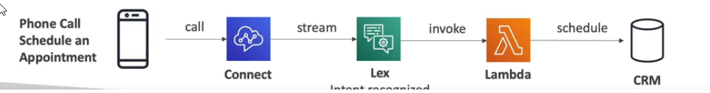
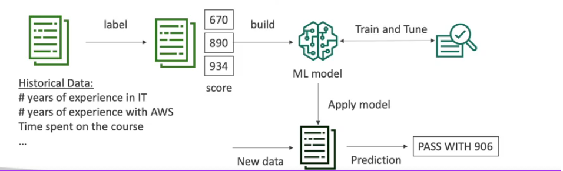
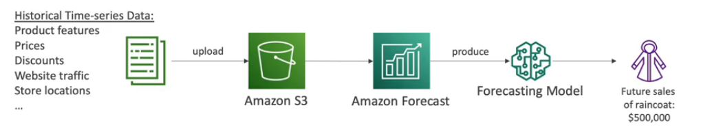
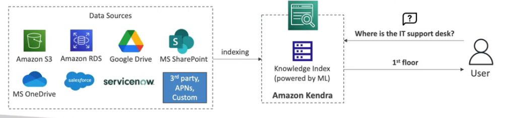
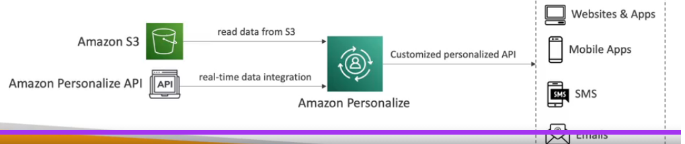
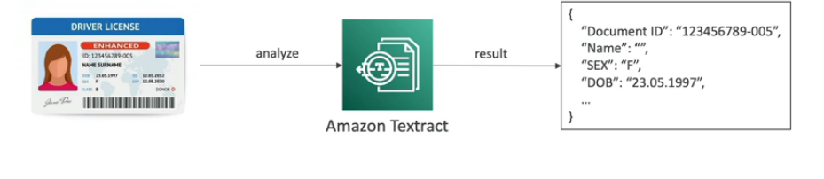

# Amazon Rekognition

* Find objects, people, text, scenes in images and videos using ML
* Facial analysis and facial search to do user verification, people counting
* Create a database of "familiar faces" or compare against celebrities
* Use cases
  * Labeling
  * Content Moderation
  * Text detection
  * Face detection and analysis (gender, age range, emotions,...)
  * Face search and verification
  * Celebrity recognition
  * Pathing (ex: for sports game analysis)

# Transcribe

* Automatically convert speech to text
* Uses deep learning process called automatic speech recognition (ASR)  to convert speech to text quickly and accurately
* Automatically removes PII using Redaction
* Supports Automatic Language Identification for multi-lingual audio
* Use cases
  * transcribe customer service calls
  * automate closed captioning and subtitling
  * generate metadata for media assets to create a fully searchable archive

# Polly

* Turn text into lifelike speech using deep learning
* Allowing you to create applications that talk

# Translate

* Natural and accurate language translation
* Amazon Translate allows you to localize content - such as websites and applications - for international users, and to easily translate large volumes of text efficiently

# Lex & Connect

* Amazon Lex: same technology that powers Alexa
  * Automatic Speech Recognition (ASR) to convert speech to text
  * Natural Language Understanding to recognize the intent of text, calles
  * **Helps build chatbots, call center bots**

* Amazon Connect
  * Receive calls, create contact flows, cloud-based virtual contact center
  * Can integrate with other CRM systems or AWS
  * No upfront payments, 80% cheaper than traditional contact center solutions

    

# Amazon Comprehend

* **For Natural Language Processing - NLP**
* Fully managed and server less service
* Uses machine learning to find insights and relationships in text
  * Language of the text
  * Extracts key phrases, places, people, brands, or events
  * Understands how positive or negative the text is
  * Analyzes text using tokenization and parts of speech
  * **Automatically organizes a collection of text files by topic**
* Sample use cases
  * Analyze customer interactions (emails) to find what leads to positive or negative experience
  * Create and groups articles to topics that Comprehend will uncover

# SageMaker

* Fully managed service **for developers / data scientists** to build ML models
* More general than earlier ML services
* Typically difficult to do all the processes in one place + provision servers
* Machine learning process (simplified): prediction your exam score

# Forecast

* Fully managed service that uses ML to deliver highly accurate forecasts
* Example: predict the future sales of a raincoat
* 50% more accurate than looking at the data itself
* Reduce forecasting time form month to hours
* Uses cases: Product Demand Planning, Financial Planning, Resource Planning...

# Kendra

* Fully managed **document search service** powered by ML
* Extracts answers from within a document (text, pdf, HTML, PowerPoint, MS Word, FAQs...)
* Natural language search capabilities
* Learn from user interactions/feedback to promote preferred results (incremental learning)
* Ability to manually fine-tune results (importance of data, freshness, custom,...)

# Personalize

* Fully managed ML-service to build apps with real-time personalized recommendations
* Example: personalized product recommendations/re-ranking, customized direct marketing
  * Example: user bought gardening tools, provide recommendations on the next one to buy
* Same technology used by Amazon.com
* Integrates into existing websites, applications, SMS, email marketing systems,...
* Implement in days, not months (you do not need to build, train and deploy ML solutions)
* Use cases: retail stores, media and entertainment...
  

# Textract

* Automatically extracts text, handwriting, and data from any scanned documents using AI and ML

