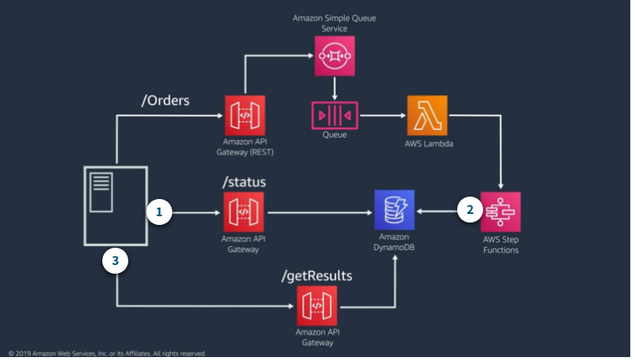
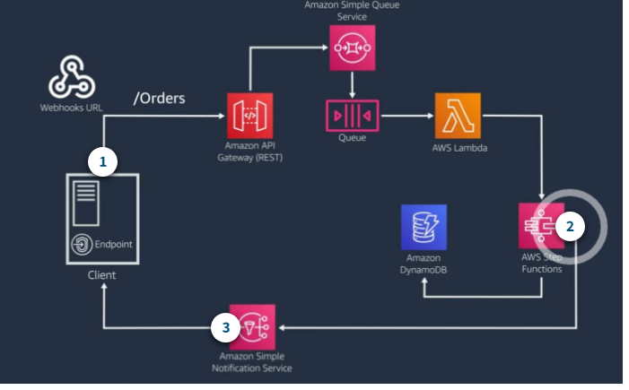
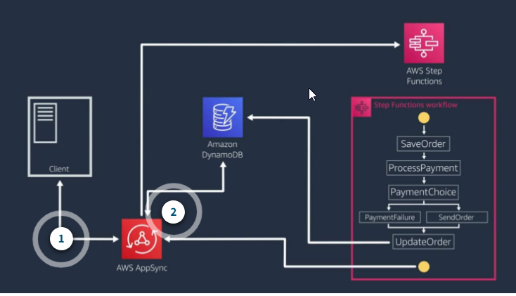
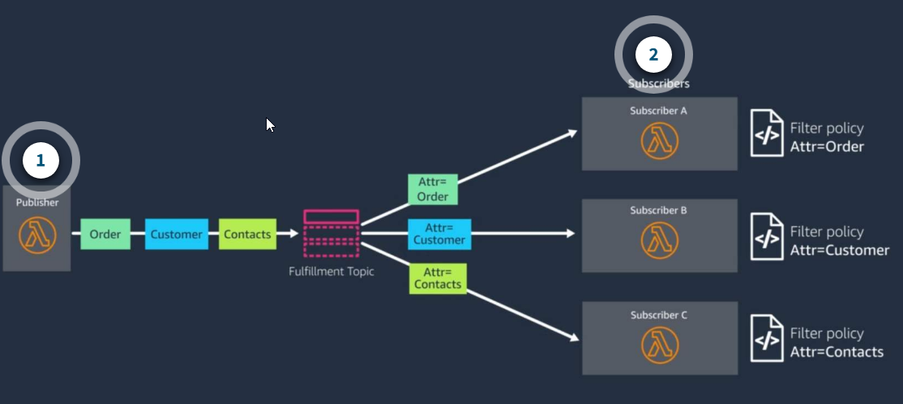

# Standard vs. FIFO SQS queues as Lambda event sources

* Record Order
  * Standard: Order is not guaranteed
  * FIFO: Order is guaranteed per group ID
* Delivery
  * Standard: Messages may be delivered more than once
  * FIFO: Messages are delivered only once. There are no duplicate messages introduced to the queue
* Transaction Throughput
  * Standard: Nearly unlimited messages per second
  * FIFO: FIFO queues support up to 300 messages per second, per API action without batching, or 3,000 with batching

# Patterns for Communicating Status Updates

## Client polling



Client polling is a common way to get **status information on a long-running transaction**.   
Advantages:
* Convenient to replace a synchronous flow
Disadvantages
* Adds additional latency to the consistency of the data to the client
* Unnecessary work and increased cost for requests and responses when nothing has changed

## Webhooks with Amazon Simple Notification Service (Amazon SNS)



Webhooks are user-defined HTTP callbacks. There are two types of clients for this pattern: **trusted and untrusted**.

* **Trusted clients** would be when **you own both sides of the system** and can create a secure integration between them. With a trusted client, the webhook that you use is established outside of the process. With trusted clients, you can use Amazon SNS to set up an HTTP subscriber that notifies the client using the webhook.   
* With an **untrusted client**, you would receive the webhook information through a **registration process** or require it as part of the data submitted to your API.

Instead of the client polling for the status, when the work is complete the backing service sends a request to the client webhook with the updated status. This is less resource intensive because the client doesn’t have to check for status updates.

## WebSockets with AWS AppSync (GraphQL)



WebSocket APIs are an open standard used to create a persistent connection between the client and the backing service, permitting bidirectional communication. You can provide the status for the client using WebSockets with GraphQL subscriptions to listen for updates through AWS AppSync.   

With AWS AppSync, clients can automatically subscribe and receive status updates as they occur. This is a great pattern when data drives the user interface, and is ideal for data that is streaming or may yield more than a single response.

In the order submission example:

* The client creates a subscription for order status updates and submits the order through the AppSync service.
* As data changes, the client receives updates through the subscription. This includes changes related to the status of the work as well as changes to the order data.

This is a simpler architecture than using API Gateway with a combination of REST and WebSocket APIs.

To choose whether to use API Gateway or AWS AppSync in this pattern, evaluate which factors are the most important for your workload and your development team.

* The **AWS AppSync approach greatly reduces the number of API calls** required and lets the client filter only the data it needs.
* If you need more **fine-grained management** of your APIs, such as supporting multiple versions of an API or controlling access with usage plans and throttling limits, **API Gateway** may be the better choice.
* **GraphQL is a newer API standard than REST.** So the industry best practices and field knowledge are still developing with GraphQL.

# Amazon SNS message filtering

In the Amazon SNS message filtering pattern, the subscriber assigns a filter policy to the topic subscription. The filter policy contains attributes that define which messages that subscriber receives, and Amazon SNS compares message attributes to the filter policy for each subscription. If the attributes don’t match, the message doesn’t get sent to that subscriber.
**It facilitates making changes going forward and prevents subscribers from having to process messages that they don't need.**



# Amazon EventBridge

Amazon EventBridge is a serverless event bus that facilitates connection of applications together using AWS services and data from your own applications, as well as integrated software-as-a-service (SaaS) applications. 

* https://youtu.be/TXh5oU_yo9M
* https://aws.amazon.com/eventbridge/resources/#Webinars_and_videos
* https://aws.amazon.com/eventbridge/

# Streaming or messaging for data processing

* Messaging
  * The core entity is an individual message, and message rates vary.
  * Messages are deleted when they’ve been consumed.
  * Configure retries and dead-letter queues for failures.
* Streaming
  * You look at the stream of messages together, and the stream is generally continuous.
    
  * Data remains on the stream for a period of time. Consumers must maintain a pointer.
  * A message is retried until it succeeds or expires. You must build error handling into your function to bypass a record.

# sqs localstack

## how to change visibility parameter

```
C:\>aws sqs set-queue-attributes --endpoint-url http://localhost:4566 --queue-url http://localhost:4566/000000000000/MyQueue --attribute VisibilityTimeout=3600

C:\>aws sqs get-queue-attributes --endpoint-url http://localhost:4566 --queue-url http://localhost:4566/000000000000/MyQueue --attribute-names All
{
    "Attributes": {
        "ApproximateNumberOfMessages": "0",
        "ApproximateNumberOfMessagesDelayed": "0",
        "ApproximateNumberOfMessagesNotVisible": "0",
        "CreatedTimestamp": "1629184776.743441",
        "DelaySeconds": "0",
        "LastModifiedTimestamp": "1629274571.382143",
        "MaximumMessageSize": "262144",
        "MessageRetentionPeriod": "345600",
        "QueueArn": "arn:aws:sqs:us-east-1:000000000000:MyQueue",
        "ReceiveMessageWaitTimeSeconds": "0",
        "VisibilityTimeout": "3600"
    }
}
```

Usually the queues are created by a system during its startup so it means that first we have to run the system to create the queues.


It looks that we have to set some default fake credentials, only then the cli will work correctly:

C:\Users\[USER]\.aws\credentials

```
[default]
aws_access_key_id=sfsdfdsf
aws_secret_access_key=sdfsasdf
aws_session_token=asdasdasd
```

From some reason it did not work when the values were set on n/a !

C:\Users\[USER]\.aws\config
```
[default]
region = us-east-1
```

## SQS.SampleApp example

Currently this example requires creation of the queue upfront.

# Differences between Amazon SQS, Amazon MQ, and Amazon SNS

https://docs.aws.amazon.com/AWSSimpleQueueService/latest/SQSDeveloperGuide/sqs-difference-from-amazon-mq-sns.html