- [WorkSpaces](#workspaces)
- [AppStream 2.0](#appstream-20)
- [Sumerian](#sumerian)
- [IoT Core](#iot-core)
- [Elastic Transcoder](#elastic-transcoder)
- [AppSync](#appsync)
- [Amplify](#amplify)
- [Device Farm](#device-farm)
- [AWS Backup](#aws-backup)
- [Disaster Recovery Strategies](#disaster-recovery-strategies)
- [Elastic Disaster Recover (DRS)](#elastic-disaster-recover-drs)
- [AWS DataSync](#aws-datasync)
- [Application Discovery Service](#application-discovery-service)
  - [AWS Application Migration Service (MGN)](#aws-application-migration-service-mgn)
- [AWS Fault Injection Simulator (FIS)](#aws-fault-injection-simulator-fis)
- [AWS Ground Station](#aws-ground-station)
- [Amazon Pinpoint](#amazon-pinpoint)
- [AWS Cloud Adoption Framework (AWS CAF)](#aws-cloud-adoption-framework-aws-caf)
- [Migration strategies](#migration-strategies)
- [Simple Workflow Service (SWF)](#simple-workflow-service-swf)
- [Amazon Elasticsearch Service](#amazon-elasticsearch-service)
- [Migration Evaluator](#migration-evaluator)

# WorkSpaces

* Managed Desktop as a Service (DaaS) solution to easily provision Windows or Linux desktops
* Great to eliminate management of on-premise VDI (Virtual Desktop Infrastructure)
* Fast and quickly scalable to thousands of users
* Secure data - integrates with KMS
* Pay-as-you-go service with monthly or hourly rates
* It is global service (not regional)

* Minimizing latency

# AppStream 2.0

* **Desktop apps run in the cloud and stream to a web browser which run on a client host**
* Deliver to any computer, without acquiring, provisioning
* The application is delivered from within a web browser

* AppStream 2.0 vs WorkSpaces
  * Workspaces
    * Fully managed VDI and desktop available
    * The users connect to the VDI and open native or WAM (WorkSpaces Application Manager) applications 
    * WorkSpaces are on-demand or always on
  * AppStream 2.0
    * Stream a desktop application to web browsers (no need to connect to a VDI)
    * Works with any device that has a web browser
    * Allow to configure an instance type per application type (CPU, RAM, GPU)

# Sumerian

* Creates and runs virtual reality (VR), augmented reality (AR), and 3D applications
* Can be used to quickly create 3D models with animations
* Ready-to-use templates and assets - no programming or 3D expertise required

# IoT Core

* "Internet of Things" - the network of internet-connected devices that are able to collect and transfer data
* AWS IoT Core allows you to easily connect IoT devices to the AWS Cloud
* Serverless, secure & scalable to billions of devices and trillions of messages
* Your applications can communicate with your devices even when they are not connected
* Integrates with a log of AWS Services: Lambda, S3, SageMaker, etc.
* Build IoT applications that gather, process, analyze and act on data

# Elastic Transcoder

* Used to convert media files stored in S3 into media files in the formats required by consumer playback devices (phones etc...)
* Benefits
  * Easy to use
  * Highly scalable - can handle large volumes of media files and large file sizes
  * Cost effective - duration-based pricing model
  * Fully managed & secure, pay for what you use

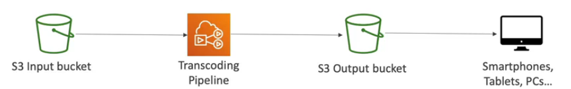

# AppSync

* Store and sync data across mobile and web apps in real-time
* **Makes use of GraphQL - it is fully managed GraphQL service**
* Client code can be generated automatically
* Integrations with DynamoDB / Lambda
* Real-time subscriptions
* Offline data synchronization (replaces Cognito Sync)
* Fine grained security
* **AWS Amplify can leverage AWS AppSync in the background!**

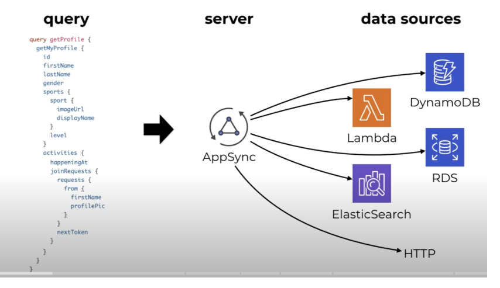

# Amplify

* A set of tools and services that helps you develop and deploy scalable full stack web and mobile applications
* Authentication, Storage, API (REST, GraphQL), CI/CD, PubSub, Analytics, AI/ML Predictions, Monitoring, Source Code From AWS, GitHub, etc...

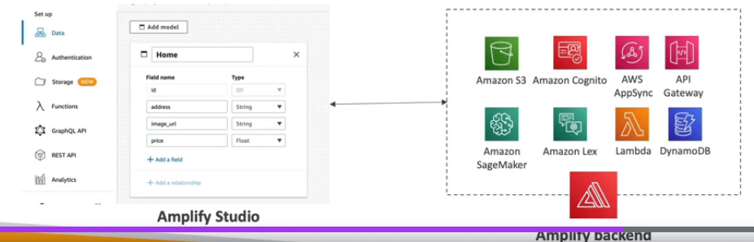

# Device Farm

* Fully-managed service that tests your web and mobile apps against desktop browsers, real mobile devices, and tables
* Run tests concurrently on multiple devices (speed up execution)
* Ability to configure device settings (GPS, language, WiFi, Bluetooth,...)

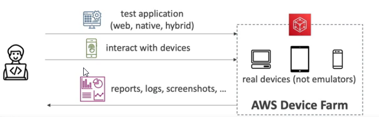

# AWS Backup

* Fully managed service to centrally manage and automate backups across AWS services
* On-demand and scheduled backups
* Supports PITR (Point-in-time Recovery)
* Retention Periods, Lifecycle Mgmt, Backup Policies,...
* Cross-Region Backup
* Cross-Account Backup - using AWS Organizations

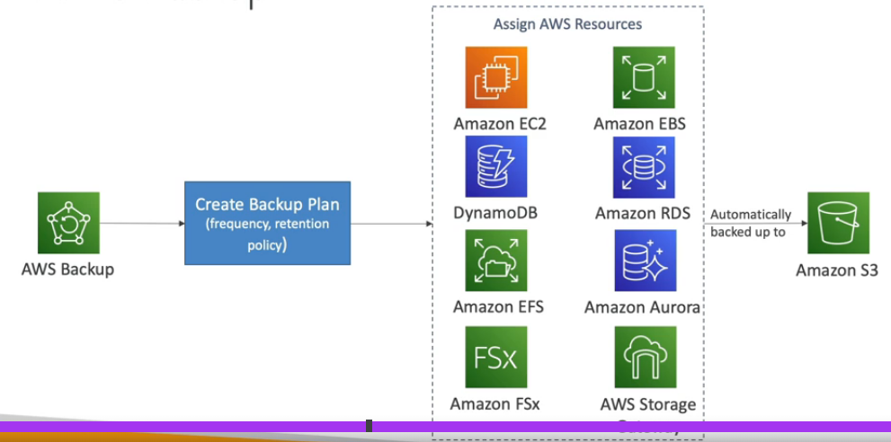

# Disaster Recovery Strategies

[Disaster recovery options in the cloud](https://docs.aws.amazon.com/whitepapers/latest/disaster-recovery-workloads-on-aws/disaster-recovery-options-in-the-cloud.html)

Recovery Time Objective (RTO) - is the goal your organization sets for the maximum length of time it should take to restore normal operations following an outage or data loss.

Recovery Point Objective (RPO) - is your goal for the maximum amount of data the organization can tolerate losing.

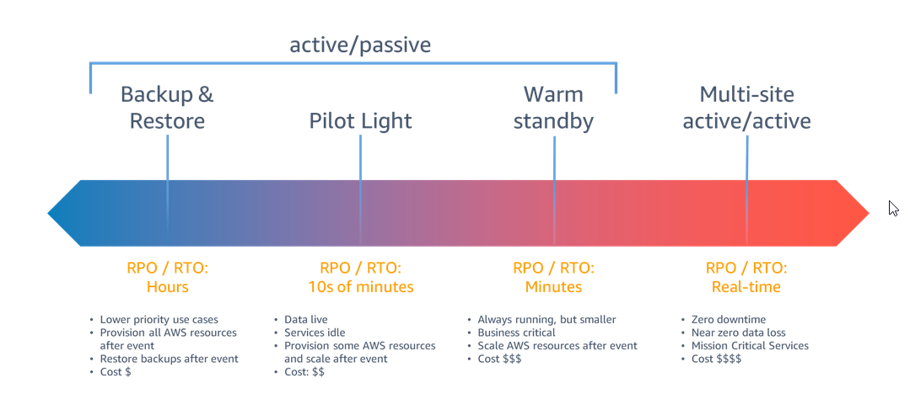

* The cheapest is backup and restore
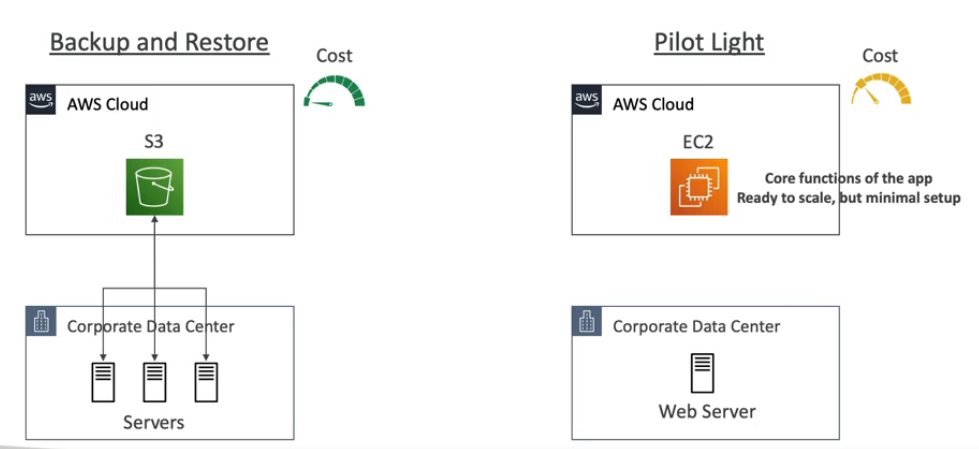
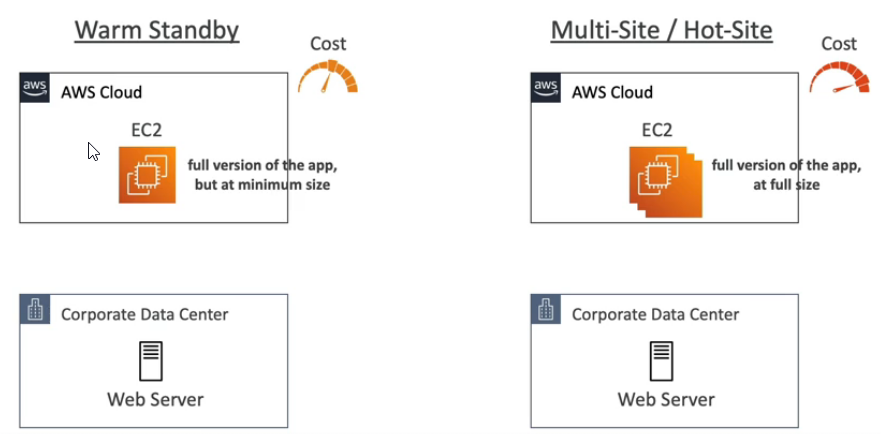

* Disaster recovery in the cloud

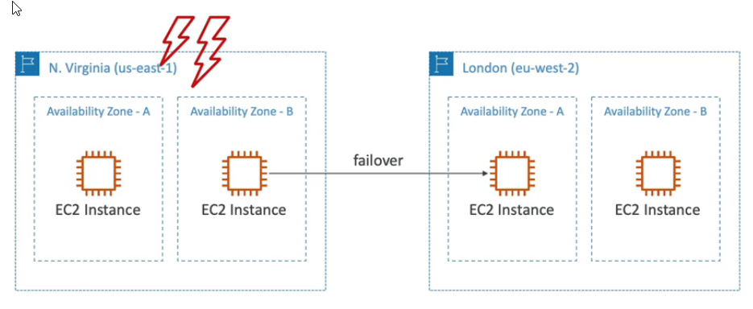

# Elastic Disaster Recover (DRS)

https://www.youtube.com/watch?v=GAMUCIJR5as

* Used to be named "**CloudEndure Disaster Recovery**" before AWS bought it
* Quickly and easily recover your physical, virtual and cloud-based servers into AWS
* Example: protect your most critical databases (Oracle, MySQL, SQL Server), enterprise apps (SAP), protect your data from ransomware attacks,...
* Continuous block-level replication for your servers

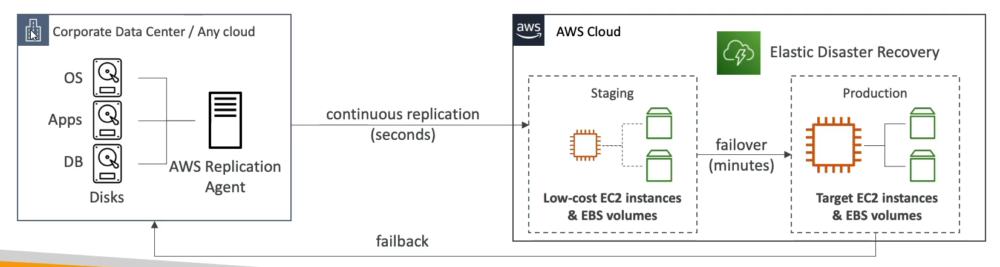

# AWS DataSync

* Move large amount of data from on-premises to AWS
* Can synchronize to: S3 (any storage classes - including Glacier), EFS, FSx for Windows
* Replication tasks can be scheduled hourly, daily, weekly
* The replication tasks are **incremental** after the first full load

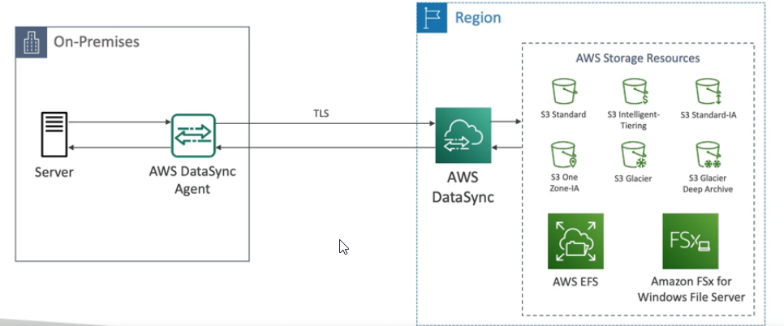

# Application Discovery Service

AWS Application Discovery Service helps you plan your migration to the AWS cloud by collecting usage and configuration data about your on-premises servers.

* Plan migration projects by gathering information about on-premises data centers
* Server utilization data and dependency mapping are important for migrations

* Agentless Discovery (AWS Agentless Discovery Connector)
  * VM inventory, configuration, and performance history such as CPU, memory, and disk usage
* Agent-based Discovery (AWS Application Discovery Agent)
  * System configuration, system performance, running processes, and details of the network connections between systems
* Resulting data can be viewed within **AWS Migration Hub**

## AWS Application Migration Service (MGN)

* The "AWS evolution" of CloudEndure Migration, replacing AWS Server Migration Service (SMS)
* **AWS Application Migration Service (AWS MGN) is the recommended service for migrations to AWS.**
* Lift-and-shift (rehost) solution which simplify migrating applications to AWS
* Converts your physical, virtual, and cloud-based servers to run natively on AWS
* Supports wide range of platforms, OSes and DBs
* Minimal downtime, reduced costs

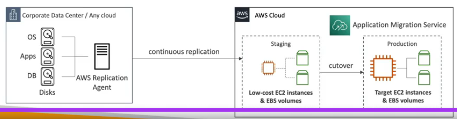

# AWS Fault Injection Simulator (FIS)

* Fully managed service for running fault injection experiments on AWS workloads
* Based on Chaos Engineering - stressing an application by creating disruptive events (e.g. sudden increase in CPU, memory), observing how the system responds, and implementing improvements
* Helps you uncover hidden bugs and performance bottlenecks
* Supports the following AWS services: EC2, ECS, EKS, RDS...
* Use pre-build templates that generate the desired disruptions

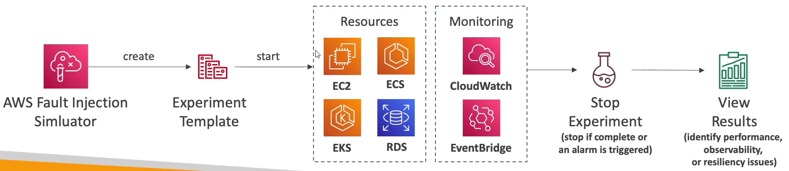

The **Acceptable Use Policy** describes prohibited uses of the web services offered by Amazon Web Services, Inc. and its affiliates (the “Services”) and the website located at http://aws.amazon.com (the “AWS Site”). This policy is present at https://aws.amazon.com/aup/ and is updated on a need basis by AWS.

# AWS Ground Station

* Fully managed service that lets you control satellite communications, process data, and scale your satellite operations 
* Provides a global network of satellite ground stations near AWS regions
* Allows you to download satellite data to your AWS VPC within seconds
* Send satellite data to S3 or EC2 instance
* Use cases: weather forecasting, surface imaging, communications, video broadcasts

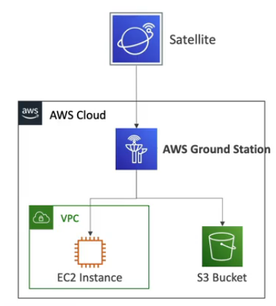

# Amazon Pinpoint

* Scalable 2-way (outbound/inbound) marketing communications service
* Supports email, SMS, push, voice, and in-app messaging
* Ability to segment and personalize messages with the right content to customers
* Possibility to receive replies
* Scales to billions of messages per day
* Use cases: run campaigns by sending marketing bulk, transactional SMS messages
* Amazon SNS vs SES (Simple Email Service)
  * In SNS & SES you managed each message`s audience, content, and delivery schedule
  * Amazon Pinpoint, you create message templates, delivery schedules, highly-targeted segments, and full campaigns

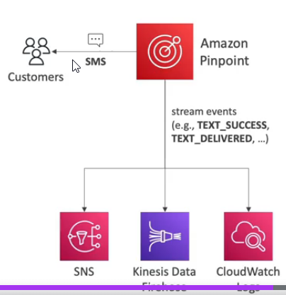

# AWS Cloud Adoption Framework (AWS CAF)

At the highest level, the AWS Cloud Adoption Framework (AWS CAF) organizes guidance into six areas of focus, called Perspectives.

In general, the **Business, People, and Governance Perspectives** focus on **business** capabilities.
**Platform, Security, and Operations** Perspectives focus on **technical** capabilities.

It is created by AWS Professional Services.

# Migration strategies

6 strategies for migration:

* Rehosting: also known as **“lift-and-shift”** involves moving applications without changes. 
In the scenario of a large legacy migration, in which the company is looking to implement its migration and scale quickly to meet a business case, the majority of applications are rehosted. **No code changes.**

* Replatforming: also known as **“lift, tinker, and shift”** involves making a few cloud optimizations to realize a tangible benefit. Optimization is achieved without changing the core architecture of the application. **No code changes.**

* Refactoring/re-architecting: involves reimagining how an application is architected and developed by using cloud-native features. Refactoring is driven by a strong business need to add features, scale, or performance that would otherwise be difficult to achieve in the application’s existing environment

* Repurchasing: involves moving from a traditional license to a software-as-a-service model. For example, a business might choose to implement the repurchasing strategy by migrating from a customer relationship management (CRM) system to Salesforce.com

* Retaining: consists of keeping applications that are critical for the business in the source environment. This might include applications that require major refactoring before they can be migrated, or, work that can be postponed until a later time.

* Retiring: is the process of removing applications that are no longer needed.

# Simple Workflow Service (SWF) 

https://docs.aws.amazon.com/amazonswf/latest/developerguide/swf-welcome.html

Amazon Simple Workflow Service (SWF) is a web service that makes it easy to coordinate work across distributed application components. SWF enables applications for a range of use cases, including media processing, web application back-ends, business process workflows, and analytics pipelines, to be designed as a coordination of tasks.

# Amazon Elasticsearch Service

https://aws.amazon.com/what-is/elasticsearch/

Amazon Elasticsearch Service is involved with operational analytics such as application monitoring, log analytics and clickstream analytics. Amazon Elasticsearch Service allows you to search, explore, filter, aggregate, and visualize your data in near real-time.

Cloudwatch can forward logs to three services for now. They are S3 bucket, **Elasticsearch**, and Lambda.

# Migration Evaluator
https://aws.amazon.com/migration-evaluator/

*"With Migration Evaluator, your organization can build a **data-driven business case** for AWS, gets access to AWS expertise, visibility into the costs associated with multiple migration strategies, and insights on how reusing existing software licensing reduces costs further"*