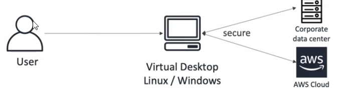
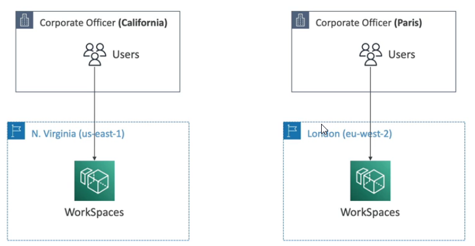
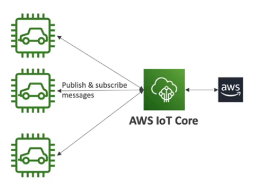

# WorkSpaces

* Managed Desktop as a Service (DaaS) solution to easily provision Windows or Linux desktops
* Great to eliminate management of on-premise VDI (Virtual Desktop Infrastructure)
* Fast and quickly scalable to thousands of users
* Secure data - integrates with KMS
* Pay-as-you-go service with monthly or hourly rates

* Minimizing latency

# AppStream 2.0

* Desktop application streaming service
* Deliver to any computer, without acquiring, provisioning
* The application is delivered from within a web browser

* AppStream 2.0 vs WorkSpaces
  * Workspaces
    * Fully managed VDI and desktop available
    * The users connect to the VDI and open native or WAM (WorkSpaces Application Manager) applications 
    * WorkSpaces are on-demand or always on
  * AppStream 2.0
    * Stream a desktop application to web browsers (no need to connect to a VDI)
    * Works with any device that has a web browser
    * Allow to configure an instance type per application type (CPU, RAM, GPU)

# Sumerian

* Creates and runs virtual reality (VR), augmented reality (AR), and 3D applications
* Can be used to quickly create 3D models with animations
* Ready-to-use templates and assets - no programming or 3D expertise required

# IoT Core

* "Internet of Things" - the network of internet-connected devices that are able to collect and transfer data
* AWS IoT Core allows you to easily connect IoT devices to the AWS Cloud
* Serverless, secure & scalable to billions of devices and trillions of messages
* Your applications can communicate with your devices even when they are not connected
* Integrates with a log of AWS Services: Lambda, S3, SageMaker, etc.
* Build IoT applications that gather, process, analyze and act on data

