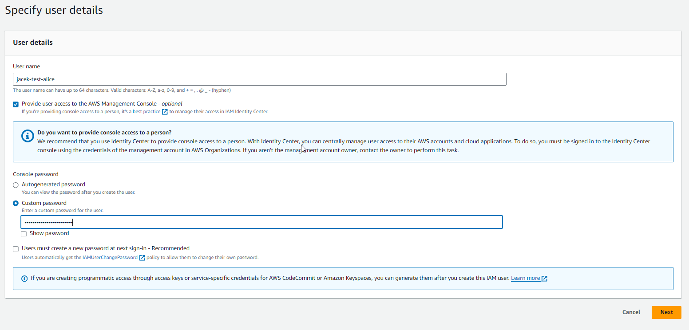

- [Important requirements](#important-requirements)
- [Object keys](#object-keys)
- [Limits](#limits)
- [Use cases](#use-cases)
- [Security](#security)
  - [S3 and IAM polices](#s3-and-iam-polices)
  - [Encryption](#encryption)
- [WebSites](#websites)
- [Versioning](#versioning)
- [Access logs](#access-logs)
- [Replication](#replication)
- [S3 classes](#s3-classes)
  - [S3 Durability](#s3-durability)
  - [S3 Availability](#s3-availability)
  - [Classes](#classes)
- [S3 Moving between Store Classes](#s3-moving-between-store-classes)
- [Amazon S3 analytics – Storage Class Analysis](#amazon-s3-analytics--storage-class-analysis)
- [S3 Object lock](#s3-object-lock)
- [S3 Glacier vault lock](#s3-glacier-vault-lock)
- [S3 Encryption](#s3-encryption)
- [Shared responsibility model for S3](#shared-responsibility-model-for-s3)
- [AWS Snow Family](#aws-snow-family)
  - [Data migration](#data-migration)
  - [Edge computing](#edge-computing)
    - [Edge computing devices](#edge-computing-devices)
  - [AWS OpsHub](#aws-opshub)
- [Storage gateway - hybrid cloud](#storage-gateway---hybrid-cloud)
- [S3 Transfer Acceleration](#s3-transfer-acceleration)


# Important requirements

S3 allows people to store **objects** (files) in **buckets** (directories - root directories).

*  Each bucket name must be unique across all AWS accounts in all AWS Regions within a partition. A partition is a grouping of Regions, of which AWS currently has three: Standard Regions, China Regions, and AWS GovCloud (US).
*  Buckets are defined at the region level
*  S3 looks like a global service but buckets are created in a region
*  It is key value based object storage service
*  Stores data in flat non-hierarchical structure
*  Naming conventions for buckets
   *  No uppercase
   *  Consist only of letters, numbers, dots (.), and hyphens (-).
   *  3-63 length
   *  Not an IP address
   *  Must start with letter or number
   *  To enable AWS S3 Transfer Acceleration on a bucket or use a virtual hosted-style bucket with SSL, the bucket name must conform to DNS naming requirements and **must not contain dots**


# Object keys

https://docs.aws.amazon.com/AmazonS3/latest/userguide/object-keys.html

*The object key (or key name) uniquely identifies the object in an Amazon S3 bucket*

The key is compose of prefix and object name: s3://[BUCKET-NAME]/[FOLDER1]/[FOLDER2]/[FILE-NAME], sample key:
`s3://my-bucket/f1/f2/my_file.txt` - here the prefix is f1/f2

# Limits

* Max object size is 5TB but **S3 has unlimited storage**
* If uploading more than 5TB, must use "multi-part upload".
* Cannot partially update objects - even we change only one bite we have to upload the whole object (such limitation does not exist in EBS - EBS can store a single file in multiple blocks and then only selected blocks are updated).

# Use cases

* **Backup and storage**: Amazon S3 is a natural place to back up files because it is highly redundant. As mentioned in the last lesson, AWS stores your EBS snapshots in Amazon S3 to take advantage of its high availability.
* **Media hosting**: Because you can store unlimited objects, and each individual object can be up to 5 TB, Amazon S3 is an ideal location to host video, photo, and music uploads.
* Software delivery: You can use Amazon S3 to host your software applications that customers can download.
* **Data lakes**: Amazon S3 is an optimal foundation for a data lake because of its virtually unlimited scalability. You can increase storage from gigabytes to petabytes of content, paying only for what you use.
* **Static websites**: You can configure your S3 bucket to host a static website of HTML, CSS, and client-side scripts.
* **Static content**: Because of the limitless scaling, the support for large files, and the fact that you can access any object over the web at any time, Amazon S3 is the perfect place to store static content.

# Security

Everything in Amazon S3 is private by default. This means that all Amazon S3 resources, such as buckets and objects, can only be viewed by the user or AWS account that created that resource.

## S3 and IAM polices

https://docs.aws.amazon.com/AmazonS3/latest/userguide/walkthrough1.html

* **Step 1**: create bucket `jacek-test-iam-policies`

Object keys:
```
Private/privDoc1.txt
Private/privDoc2.zip
Development/project1.xls
Development/project2.xls
Development/Dev1/project3.xls
Finance/Tax2011/document1.pdf
Finance/Tax2011/document2.pdf
s3-dg.pdf
```
You have two users, Alice and Bob. You want Alice to access only the Development folder, and you want Bob to access only the Finance folder. You want to keep the Private folder content private. 
IAM also supports creating user groups and granting group-level permissions that apply to all users in the group.

* **Step 2**: create Alice and Bob users and add them to `test-jacek-consultants` user group.



* **Step 3**: try sign in as Alice and Bob and see that you do not have any access to S3 


* **Step 4**: grant group-level permissions

  * List all buckets owned by the parent aws account. To do so, Bob and Alice must have permission for the `s3:ListAllMyBuckets` action. Create policy `test-jacek-s3-list-buckets`.
  
    ```json
    {
      "Version": "2012-10-17",
      "Statement": [
        {
          "Sid": "AllowGroupToSeeBucketListInTheConsole",
          "Action": ["s3:ListAllMyBuckets"],
          "Effect": "Allow",
          "Resource": ["arn:aws:s3:::*"]
        }
      ]
    }
    ```
    
    
    

    **Now Alice and Bob can see all the buckets:** 
    

  * List root-level items of the bucket, folders, and objects in the `jacek-test-iam-policies` bucket. To do so, Bob and Alice must have permission for the `s3:ListBucket` action on the `jacek-test-iam-policies` bucket. Create a new policy `test-jacek-s3-list-buckets-and-top-content` and attach it to the user group, unattach from the user group previous policy.   

    To ensure that they see only the root-level content, you add a condition that users must specify an empty prefix in the request — that is, they are not allowed to double-click any of the root-level folders. Finally, you add a condition to require folder-style access by requiring user requests to include the delimiter parameter with the value "/"

    When you choose a bucket on the Amazon S3 console, the console first sends the GET Bucket location request to find the AWS Region where the bucket is deployed. Then the console uses the Region-specific endpoint for the bucket to send the GET Bucket (List Objects) request - **that's why `s3:GetBucketLocation` is also needed.**

    ```json
    {
      "Version": "2012-10-17",
      "Statement": [
        {
          "Sid": "AllowGroupToSeeBucketListAndAlsoAllowGetBucketLocationRequiredForListBucket",
          "Action": [ "s3:ListAllMyBuckets", "s3:GetBucketLocation" ],
          "Effect": "Allow",
          "Resource": [ "arn:aws:s3:::*"  ]
        },
        {
          "Sid": "AllowRootLevelListingOfCompanyBucket",
          "Action": ["s3:ListBucket"],
          "Effect": "Allow",
          "Resource": ["arn:aws:s3:::jacek-test-iam-policies"],
          "Condition":{ 
            "StringEquals":{
              "s3:prefix":[""], "s3:delimiter":["/"]
            }
          }
        }
      ] 
    }
    ```
  * Test access for Alice and Bob.

    Now Alice and Bob has access to the top level objects of the `jacek-test-iam-policies` bucket but they cannot go deeper.
    Also they cannot go to detials of the top level objects which are files.

    
    

  * **Step 5.1**: Grant IAM user Alice permission to list the development folder content. This can be done as inline policy
    assigned directly to Alice.

    

    ```json
    {
      "Version": "2012-10-17",  
      "Statement": [
        {
          "Sid": "AllowListBucketIfSpecificPrefixIsIncludedInRequest",
          "Action": ["s3:ListBucket"],
          "Effect": "Allow",
          "Resource": ["arn:aws:s3:::jacek-test-iam-policies"],
          "Condition": {  
            "StringLike":{
              "s3:prefix":["Development/*"]
            }
          }
        }
      ]
    }
    ```

    Now Alice can list content of `Development` folder. **It includes also all subfolders and files but withouth possbility of downloading the files**.
    
    
    

* **Step 5.2**: Grant IAM user Alice permissions to get and put objects in the development folder.

  Update inline policy:

  ```json
  {
    "Version": "2012-10-17",
    "Statement":[
      {
         "Sid":"AllowListBucketIfSpecificPrefixIsIncludedInRequest",
         "Action":["s3:ListBucket"],
         "Effect":"Allow",
         "Resource":["arn:aws:s3:::jacek-test-iam-policies"],
         "Condition":{
            "StringLike":{"s3:prefix":["Development/*"]
            }
         }
      },
      {
        "Sid":"AllowUserToReadWriteObjectDataInDevelopmentFolder", 
        "Action":["s3:GetObject", "s3:PutObject"],
        "Effect":"Allow",
        "Resource":["arn:aws:s3:::jacek-test-iam-policies/Development/*"]
      }
    ]
  }
  ```
  Now Alice can download the files, upload files and also create folders.
  

* User based - IAM policies
  * NOTE: an IAM principal can accessas an S3 object if the user IAM permissions allow it OR the resource policy ALLOWS it AND there is no explicit DENY
* Resource based
  * Bucket policies - bucket wide rules from the S3 console - allow cross account
  * Object Access Control List (ACL) - finer grain (can be disabled)
  * Bucket ACL - less common (can be disabled)
* Encryption
* Bucket settings for block public access - can be set on account level

## Encryption

* There are 4 methods to encrypt objects
  * Server Side Encryption (SSE)
    * Amazon S3-Managed Keys (SSE-S3): enabled by default. Encrypts S3 objects using keys handled, managed, and owned by AWS. AWS user has no access to these keys. Encryption type is AES-256.
    Must have header `"x-amz-server-side-encryption":"AES256"`.
    
    * KMS Keys in AWS KMS (SSE-KMS): leverage AWS Key Management Service (AWS KMS) to manage keys. User control + audit key using CloudTrail. Must have header `"x-amz-server-side-encryption":"aws:kms"`.
    
    * SSE-KMS limitation
      * When you upload an object, it calls `GenerateDataKey` KMS API
      * When you download, it calls the `Decrypt` KMS API
      * Count towards the KMS quota per second (5500, 10 000, 30 000 req/s based on the region)
      * You can request a quota increase using the Service Quotas Console
      * To avoid this limitation use [**S3 Bucket Keys**](https://docs.aws.amazon.com/AmazonS3/latest/userguide/bucket-key.html)
    * Customer-Provided Keys (SSE-C): when you want to manage your own encryption keys
      * Amazon S3 does not store encryption key - after being used the key is discarded
      * HTTPS must be used, encryption key must be provided in HTTP headers, for every HTTP request made (to be able read this file)
      
  * Client-Side Encryption

* Encryption in transit (SSL/TLS)
  * HTTP - non encrypted
  * HTTPS - encryption in flight, mandatory for SSE-C
  * Forcing encryption in transit
  
  ```json
  {
    "Id": "Policy1698315053418",
    "Version": "2012-10-17",
    "Statement": [
      {
        "Sid": "Stmt1698315051562",
        "Action": [
          "s3:GetObject"
        ],
        "Effect": "Deny",
        "Resource": "arn:aws:s3:::my-bucket/*",
        "Condition": {
          "Bool": {
            "aws:SecureTransport": "false"
          }
        },
        "Principal": "*"
      }
    ]
  }
  ```
  * Default encryption vs bucket policies
    * SSE-S3 encryption is automatically applied to bew objects stored in S3 bucket
    * Optionally, you can force encryption using a bucket policy and refuse an API call to PUT an S3  object without encryption headers (SSE-KMS or SSE-C).
    * **Bucket policies are evaluated before default encryption**

# WebSites

URL address can be: `<bucket-name>.s3-website-<AWS-region>.amazonaws.com` or `<bucket-name>.s3-website.<AWS-region>.amazonaws.com`.


# Versioning

* It is enabled at the bucket level
* Same key overwrite will increment the "version": 1,2,3...
* Protects against unintended deletes (ability to restore version)
* Easy roll back to previous version
* **Any file the is not versioned prior to enabling versioning will have version "null"**
* Suspending versioning does not delete previous versions

# Access logs

* For audit purpose, you may want to log all access to S3 buckets
* Any requests made to S3, from any account, authorized pr denied, will be logged into another S3 bucket
* Access logs are also stored on S3 (new bucket has to be created)
* Logs appears after sometime (~1 hour)

# Replication

* Must enable versioning in source and destination
* Cross Region Replication (CRR)
* Same Region Replication (SRR)
* Buckets can be in different accounts
* Copying is asynchronous
* Must give proper IAM permissions to S3
* It is possible to specify prefix in the replication path
* IAM role is necessary
* When enabling we have to specify if already existing objects also should be replicated
* Version IDs are also replicated but only newest versions are replicated

CRR use cases: compliance, lower latency access, replication across accounts
SRR use cases: log aggregation, live replication between production and test accounts

# S3 classes

Can be specified for the whole bucket or per object (file) or per prefix (using lifecycle rules).

## S3 Durability

* High durability (99,999999999%, 11 9s) **of objects across multiple AZ**.
* If you store 10M objects with S3, you can on average expect to incur a loss of single object once every 10 000 years.
* Same for all storage classes.

## S3 Availability

* Measures how readily available a service is.
* Varies depending on storage class.
* Example: S3 standard has 99.99% availability = not available 53 minutes a year. More [here](https://blog.imagekit.io/how-do-you-prepare-for-an-aws-s3-outage-e60052937ef3).

## Classes

https://aws.amazon.com/s3/storage-classes/

Can move between classes manually or using S3 lifecycle configurations.

* Standard - general purpose
  * 99.999_999_999% availability (52 mins) (11 nines) - this is the probability that object will stay intact during 1 year
  * Used for frequently accessed data
  * Sustain 2 concurrent facility failures this is because data is **stored in at least 3 AZs**
  * Use cases: big data analytics, mobile & gaming applications, content distribution...
* Infrequent access (IA)  
  * For data that is less frequent accessed, but requires rapid access when needed
  * Lower cost than S3 standard
  * Standard IA
    * Stores data in at lease 3 AZs
    * 99.9% availability
    * Use cases: disaster recovery, backups
  * One Zone IA
    * Stores data in 1 AZ
    * 99.5% availability
    * High durability (99,999999999%, 11 9s) in a single AZ; data lost when AZ is destroyed
    * Use cases: secondary backup copies on on-prem data, or data you can recreate
* Glacier
  * Low-cost object storage meant for archiving/backup
  * Pricing: price for storage + object retrieval cost
  * Can upload directly or via LifeCycle Policy (also known as Object lifecycle management)
  * Instant Retrieval
    * Millisecond retrieval, **great for data accessed once a quarter**
    * Minimum storage duration of 90 days
  * Flexible Retrieval (formerly Amazon S3 Glacier)
    * Expedited (1 to 5 minutes), Standard (3 to 5 hours), Bulk (5 to 12 hours) - free
    * Minimum storage duration of 90 days
  * Deep Archive - for long term storage
    * Standard (12 hours), bulk (48 hours)
    * Minimum storage duration of 180 days
  * Glacier Instant Retrieval vs Infrequent access (IA): https://allcloud.io/blog/moving-to-s3-glacier-or-infrequent-access-storage/
    * Data stored in the S3 Glacier Instant Retrieval storage class offers a cost savings compared to the S3 Standard-IA storage class, with the same latency and throughput performance as the S3 Standard-IA storage class.
    * S3 Glacier Instant Retrieval has higher data access costs than S3 Standard-IA
    * https://aws.amazon.com/s3/pricing/
* Intelligent-Tiering
  * Ideal for data with unknown or changing access patterns
  * Small monthly monitoring and auto-tiering fee
  * Moves objects automatically between Access Tiers based on usage
  * There are no retrieval charges in S3 Intelligent-Tiering

* Comparison


# S3 Moving between Store Classes

https://docs.aws.amazon.com/AmazonS3/latest/userguide/lifecycle-transition-general-considerations.html


# Amazon S3 analytics – Storage Class Analysis

* Storage class analysis only provides recommendations for Standard to Standard IA classes.
* Report is updated daily
* 24 to 48 hours to start seeing data analysis
* https://docs.aws.amazon.com/AmazonS3/latest/userguide/analytics-storage-class.html

# S3 Object lock

* S3 object lock: adopt a WORM (Write Once - Read Many) model - possible in Glacier. It is also possible to lock this policy
  so no one can change it in the future.
* Block an object version deletion for a specified amount of time
* With S3 Object Lock, users with special permissions can make changes to the Lock policy and delete the data. This is not possible with S3 Glacier Vault Lock.

# S3 Glacier vault lock

* S3 object lock: adopt a WORM (Write Once - Read Many) model
* **Lock the policy for future edits (can no longer be changed)**
  * For example: I want upload and object to s3 and make sure then no one will ever be able to delete this file (even admins cannot delete it)
* Helpful for compliance and data retention

# S3 Encryption

* No encryption
* Server-side encryption (server encrypts the file after receiving it)
* Client-side encryption (user encrypts the file before uploading it)

# Shared responsibility model for S3

* aws
  * Infrastructure (global security, durability, availability, sustain concurrent loss of data in 2 facilities)
  * Configuration and vulnerability analysis
  * Compliance validation
* clients
  * S3 versioning
  * S3 bucket policies
  * S3 replication setup
  * Logging and monitoring
  * S3 storage class
  * Data encryption at rest and in transit

# AWS Snow Family

Highly-secure, portable offline devices to collect and process data at the edge, and migrate data into and out of AWS. Usually it is used to move on-premises data to AWS. In this way we can transfer data to AWS much faster.

## Data migration

https://aws.amazon.com/snow/

* Snowcone
  * Small device, portable, computing anywhere, rugged & secure, withstands harsh environments
  * Light (4.5 pounds, 2.1 kg)
  * Device used for edge computing, storage and data transfer
  * 8 TB of usable storage
  * Must provide own batter/cables
  * Can be sent back to AWS offline, or connect it to Internet and use **AWS DataSync** to send data
  * You can use Snowcone in backpacks on first responders, or **for IoT**, vehicular, and drone use cases.
* Snowball edge
  * Big device
  * Move TBs or PBs of data in or out of AWS
  * Pay per data transfer job
  * Provide block storage and Amazon S3-compatible object storage
  * Storage Optimized
    * 80 TB of HDD capacity for block volume and S3 compatible object storage
  * Compute Optimized
    * 42 TB of HDD capacity for block volume and S3 compatible object storage
  * Use case: large data cloud migration, DC decommission, disaster recovery
  * No **AWS DataSync** agent
  * Up to 15 nodes
  * **Natively supports EC2 instances** - you can run Amazon EC2 compute instances hosted on a Snowball Edge with the sbe1, sbe-c, and sbe-g instance types.
* Snowmobile
  * It is truck (real truck)
  * 100 PB
  * GPS
  * 24/7 video surveillance
  * No **AWS DataSync** agent

## Edge computing

Process data while it`s being created **on an edge location**. For example: a truck on the road, a ship on the sea, mining station underground, ...
These locations my have:

* Limited / no Internet access
* Limited / no easy access to computing powe

Use cases:
* pre-process data
* machine learning at the edge
* transcoding media streams

### Edge computing devices

* Snowcone
  * 2 CPU
  * 4GB of memory
  * Wired or wireless access
  * USB-C power using a cord of the optional better
* Snowball edge
  * Storage Optimized
    * Up to 40 vCPU, 80 GiB of RAM
    * Object storage clustering available
    * Better than Compute Optimized for data transfer (because of supporting clusters ?)
  * Compute Optimized
    * 52 vCPUs, 208 GiB of RAM
    * Optional GPU (useful for video processing or machine learning)
    * 42 TB usable storage
* All: can run EC2 instances & AWS lambda functions (using AWS IoT Greengrass)

## AWS OpsHub

Historically, to use Snow Family devices, you needed a CLI.
Today, you can use AWS OpsHub a software you instal on your computer to manage your Snow Family Devices (it has UI).

# Storage gateway - hybrid cloud

* AWS is pushing for "hybrid cloud"
  * Part of infra is on-prem
  * Part of infra is on the cloud
* This can be due to
  * Long cloud migrations
  * Security requirements
  * Compliance requirements
  * IT strategy
* S3 is a proprietary storage technology (unlike EFS/NFS), so how do you expose the S3 data on-premise?
  * **Use AWS Storage Gateway**

AWS Storage Gateway is a bridge between on-premise data and cloud data in S3. Hybrid storage service to allow on-prem to seamlessly use the AWS Cloud.

Use cases: disaster recovery, backup and restore, tiered storage

Types of storage gateways:
* File - provides a virtual on-premises **file server,** which enables you to store and retrieve files as objects in Amazon S3
* Volume - the volume gateway represents the family of gateways that support **block-based volumes**, previously referred to as gateway-cached and gateway-stored mode
* Tape - Gateway Virtual Tape Library **can be used with popular backup software such as** NetBackup, Backup Exec and Veeam. Uses a virtual media changer and tape drives.

All data transferred between the gateway and AWS storage is encrypted using SSL (for all three types of gateways - File, Volume and Tape Gateways).


# S3 Transfer Acceleration

* Increase transfer speed by transferring file to an AWS edge location which will forward the data to the S3 bucket in the target region


* Can be tested using page https://s3-accelerate-speedtest.s3-accelerate.amazonaws.com/en/accelerate-speed-comparsion.html


