- [AWS Shared responsibility model](#aws-shared-responsibility-model)
- [DDoS protection: WAF and Shield](#ddos-protection-waf-and-shield)
- [Penetration testing on AWS Cloud](#penetration-testing-on-aws-cloud)
- [Encryption with KMS (Key Management Service)](#encryption-with-kms-key-management-service)
- [Encryption CloudHMS](#encryption-cloudhms)
- [Types of Customer Master Keys (CMK)](#types-of-customer-master-keys-cmk)
- [KMS Hands On](#kms-hands-on)
  - [KMS Hands On - Customer managed keys](#kms-hands-on---customer-managed-keys)
- [AWS Certificate Manager (ACM)](#aws-certificate-manager-acm)
- [Secrets Manager](#secrets-manager)
- [AWS Artifact (not really a service)](#aws-artifact-not-really-a-service)
- [Guard Duty](#guard-duty)
- [Amazon Inspector](#amazon-inspector)
- [AWS Config](#aws-config)
- [Amazon Macie](#amazon-macie)
- [AWS Security Hub](#aws-security-hub)
- [Amazon Detective](#amazon-detective)
- [AWS Abuse](#aws-abuse)
- [Root user privileges](#root-user-privileges)

# AWS Shared responsibility model

* AWS responsibility - Security of the Cloud
  * Protecting infrastructure (hardware and software) that run all the AWS Services
  * Managed services like S3, DynamoDB, RDS
* Customer responsibility - Security in the Cloud
  * For EC2 instance customer is responsible for management of the guest OS, firewall & network configuration, IAM
  * Encrypting application data
* Share controls
  * Path Management, Configuration Management, Awareness and Training

* Example, for RDS
  * AWS responsibility
    * Manage the underlying EC2 instance, disable SSH access
    * Automated DB patching
    * Automated OS patching
    * Audit the underlying and disks & guarantee it functions
  * Your responsibility
    * Check the ports / IP / security group inbound rules in DBs SG
    * In-database user creation and permissions
    * Creating database with or without public access
    * Ensure parameter groups or DB is configured to only allow SSL connections
    * Database encrypting setting

* Example, for S3
  * AWS responsibility
    * Guarantee you get unlimited storage
    * Guarantee you get encryption
    * Ensure separation of the data between different customers
    * Ensure AWS employees cannot access your data
  * Your responsibility
    * Bucket configuration
    * Bucket policy/public setting
    * IAM users and roles
    * Enabling encryption

More here https://aws.amazon.com/compliance/shared-responsibility-model/

# DDoS protection: WAF and Shield

* AWS Shield Standard: protects against DDoS attack for your website and applications, for all customers at no additional costs
  * Provides protection from attacks such as SYN/UDP Floods, Reflection attacks and other layers 3 and 4 attacks
* AWS Shield Advanced: 24/7 premium DDoS protection, $3000 per month per organization
  * Protect against more sophisticated attack on Amazon EC2, ELB, CloudFront, AWS Global Accelerator and Route 53
  * 24/7 access to AWS DDoS response team (DRP)
  * Protect against higher fees during usage spikes due to DDoS
* AWS WAF: filter specific requests based on rules
  * Protects your web applications from common web exploits (Layer 7). Layer 7 is HTTP (vs Layer 4 is TCP)
  * Deploy on ALB, API Gateway, CLoudFront
  * Defines web ACL (Web Access Control List)
    * Rules can include IP addresses, HTTP headers, HTTP body, or URI strings
    * Protects from common attack - SQL injections and XSS (Cross-Site Scripting)
    * Size constraints, geo-match (block countries)
    * Rate-based rules to count occurrences of events - for DDoS protection, for example user cannot do more than 5 requests per second
* Cloud Front and Route 53
  * Availability protection using global edge network
  * Combined with AWS shield, provides attack mitigation at the edge
* Be read to scale - leverage AWS Auto Scaling

* Sample reference architecture for DDoS protection for a web application
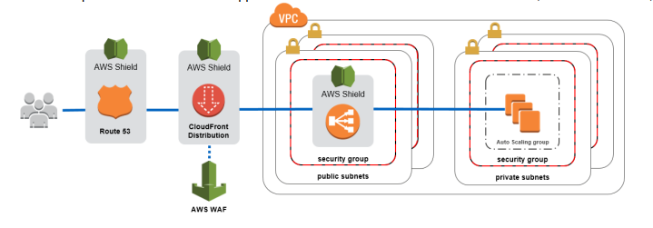

# Penetration testing on AWS Cloud

* AWS customers are welcome to carry out security assessments or penetration tests against their AWS infrastructure without prior approval for 8 services:
  * EC2 instances, NAT gateways and ELB
  * RDS
  * CloudFront
  * Aurora
  * API Gateways
  * AWS Lambda and Lambda Edge functions
  * Amazon Lightsail resources
  * Amazon Elastic Beanstalk envs.
  * List can increase over time
* Prohibited Activities
  * DNS zone waling via Route 53 Hosted Zones
  * Denial of Service (DoS), Distributed Denial of Service (DDoS), Simulated DoS, Simulated DDoS
  * Port flooding
  * Protocol flooding
  * Requests flooding (login request flooding, API request flooding)
* For any other simulated events, contact aws-security-simulated-event@amazon.com

# Encryption with KMS (Key Management Service)

* Anytime you hear "encryption" for an AWS service, it is most likely KMS
* KMS = AWS manages the encryption keys for us
* Encryption opt-in
  * EBS volumes
  * S3 buckets: server-side encryption of objects
  * Redshift database: encryption of data
  * RDS database: encryption of data
  * EFS drivers: encryption of data
* Encryption automatically enabled
  * CloudTrail logs
  * S3 glacier
  * Storage gateway

# Encryption CloudHMS

*  AWS provisions encryption hardware
*  You manage your own encryption keys entirely (now AWS)
*  Dedicated hardware (HSM = Hardware Security Model)
*  HSM device is tamper resistant, FIPS 140-2 Level 3 compliance 

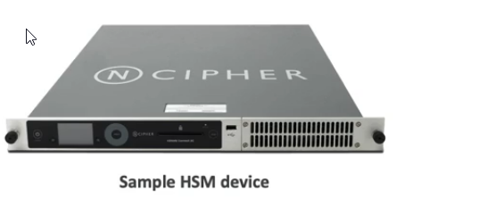

# Types of Customer Master Keys (CMK)

* Customer Managed CMK
  * Create, manage and used by the customer, can enable and disable
  * Possibility or rotation policy (new key generated every year, old key preserved)
  * Possibility to bring-your-own-key
* AWS managed CMK
  * Created, managed and used on the customers of behalf by AWS
  * Used by AWS services (s3, ebs, redshift etc...)
* AWS owned CMK
  * Collection of CMKs that an AWS service owns and manages to use in multiple accounts
  * AWS can use those to protect resources in your account (but you cannot view the keys)
* CloudHSM Keys (customer keystore)
  * Keys generated from your own CloudHSM hardware device
  * Cryptographic operations are performed withing the CloudHSM cluster

# KMS Hands On

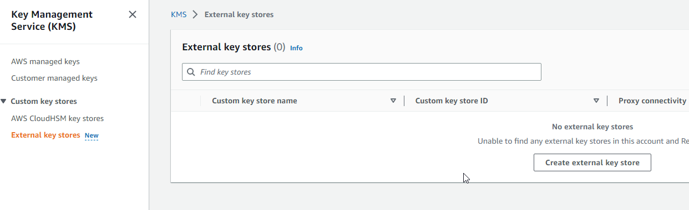

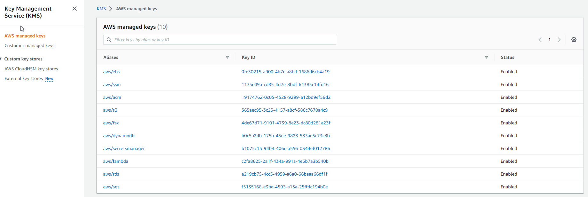

## KMS Hands On - Customer managed keys

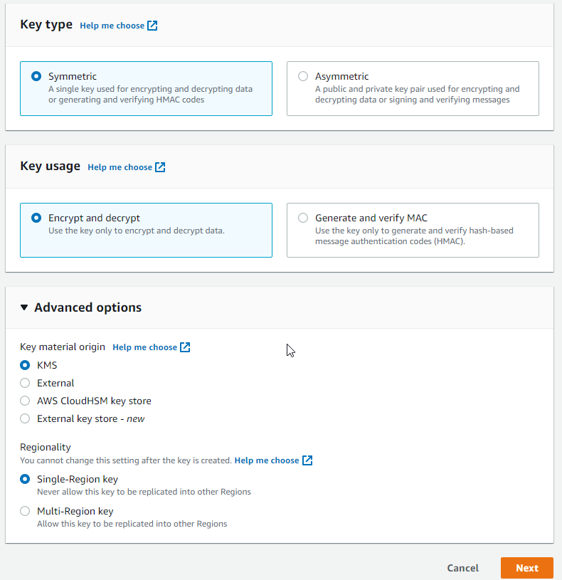

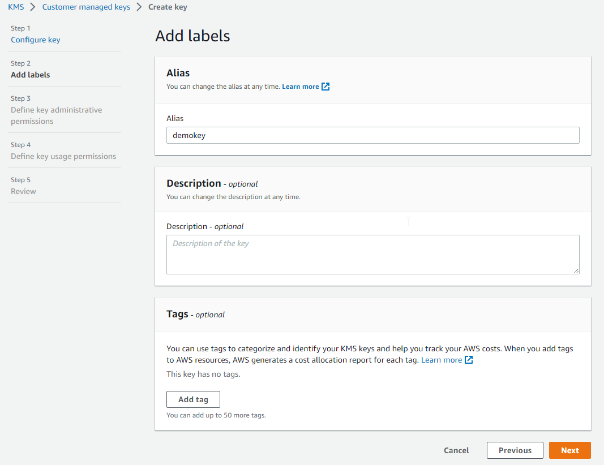

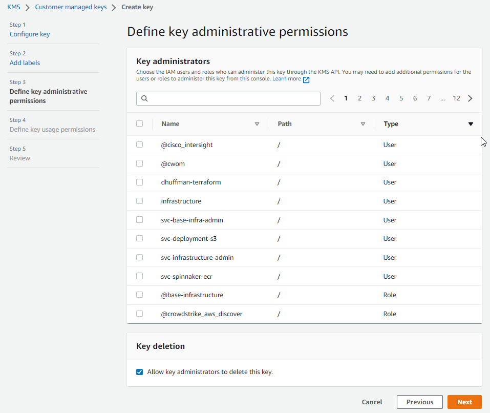

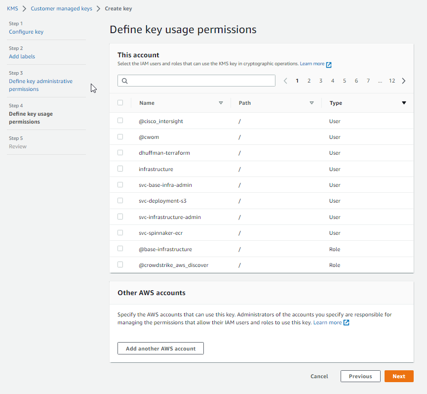

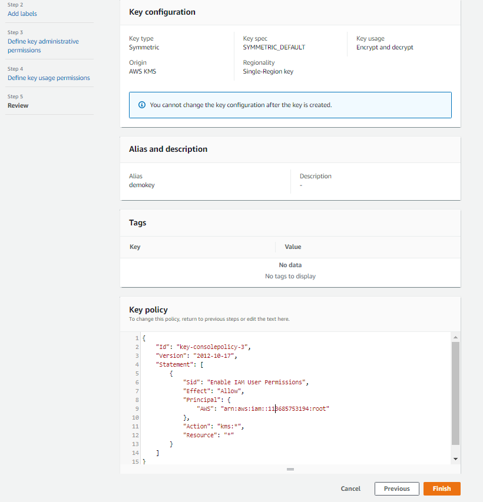

# AWS Certificate Manager (ACM)

* Let`s you easily provision, manage, and deploy SSL/TLS Certificates
* Used to provide in-flight encryption for websites (HTTPS)
* Supports both public and private TLS certificates
* Free of charge for public TLS certificates
* Automatic TLS certificate renewal
* Integrations with (load TLS certificates on)
  * ELB
  * CloudFront Distributions
  * APIs and API Gateways

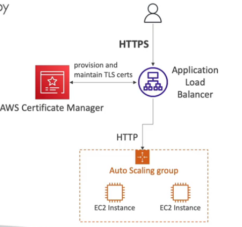

# Secrets Manager

* Newer service, meant for storing secrets
* Capability to force rotation of secrets every X days
* Automate generation of secrets on rotation (uses Lambda)
* Integration with Amazon RDS (MySQL, PostgreSQL, Aurora)
* Secrets are encrypted using KMS
* Mostly meant for RDS integrations

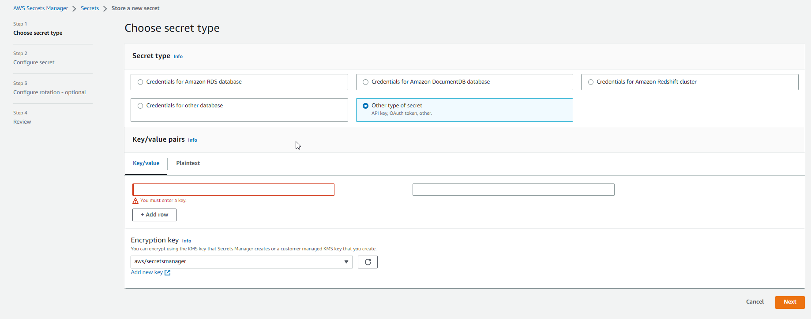

# AWS Artifact (not really a service)

* Global Portal that provides customers with on-demand access to AWS compliance documentation and AWS agreements
* Artifact Reports - allows you to download AWS security and compliance docs from third-party auditors
* Artifact Agreements - allows you to review, accept and track the status of AWS agreements
* Can be used to support internal audit or compliance

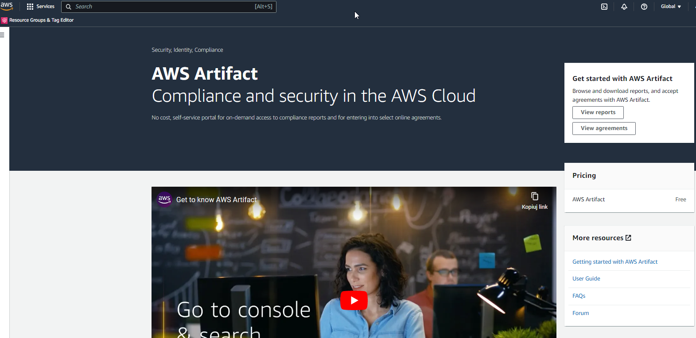

# Guard Duty

* Intelligent threat discovery to protect AWS account
* Uses ML algorithms, anomaly detection, 3rd party data
* One click to enable (30 days trial), no need to install software
* Input data includes
  * CloudTrail events logs - unusual API calls, unauthorized deployments
    * CloudTrail Management Events - create VPC subnet, create trail,...
    * CloudTrail S3 Data Events - get object, list objects, delete objects,...
  * VPC Flow Logs - unusual internet traffic, unusual IP address
  * DNS Logs - compromised EC2 instances sending encoded data within DNS queries
  * K8s Audit Logs - suspicious activities and potential EKS cluster compromises
* **Can setup CloudWatch Event rules to be notified in case of findings**
* CloudWatch Events rules can target AWS Lambda or SNS
* Can protect against CryptoCurrency attacks (has a dedicated "finding" for it)

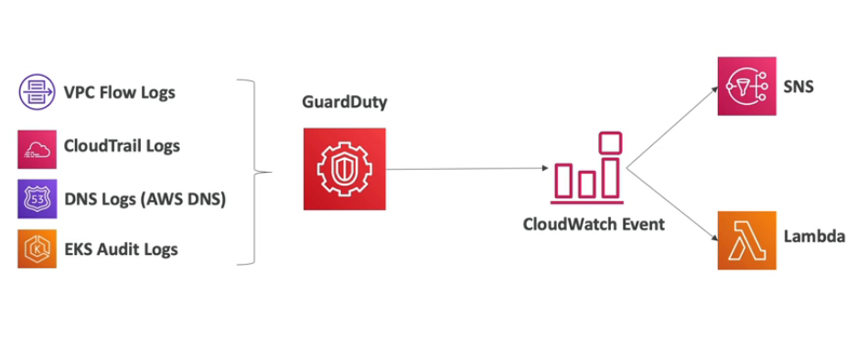

# Amazon Inspector

* Automated Security Assessments
* For EC2 instances
  * Leveraging the AWS System Manager (SSM) agent
  * Analyze against unintended network accessibility's
  * Analyze the running OS against known vulnerabilities
* For container Images push to Amazon ECR
  * Assessment for Container Images as they are pushed
* For Lambda Functions
  * Identifies software vulnerabilities in function code and package deps
  * Assessment of functions as they are deployed
* Reporting and integration with AWS Security Hub
* Send findings to Amazon Event Bridge

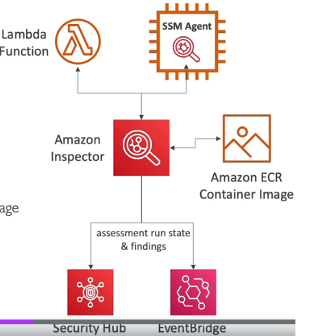

# AWS Config

* Helps with auditing and recording compliance of your AWS resources
* Helps record configuration and changes over time
* Possibility of storing the configuration data into S3 (analyzed by Athena)
* Question that can be solved by AWS Config
  * Is there unrestricted SSH access to my security groups?
  * Do my buckets have any public access?
  * How has many ALB configuration changed over time?
* You can receive alerts (SNS notifications) for any changes
* AWS Config is per-region service
* Can be aggregated across regions and accounts
* It is not free service - if it will be enabled then we have to pay

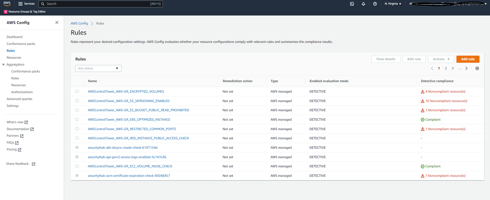
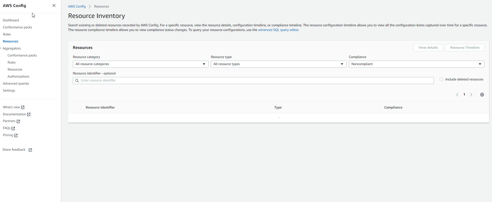

# Amazon Macie

* Fully managed data security and data privacy service that uses machine learning and patter matching to discover and protect your sensitive data in AWS
* Macie helps identify and alert you to sensitive data, such as personally identifiable information (PII)

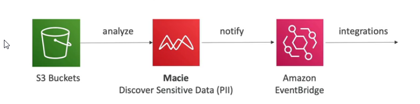

# AWS Security Hub

* Cental security tool to manage security across several AWS accounts and automate security checks
* Integrated dashboards showing current security and compliance status to quickly take actions
* **Automatically aggregates alerts in predefined or personal findings formats from various AWS services & AWS partner tools**
  * GuardDuty
  * Inspector
  * Macie
  * IAM Access Analyzer
  * AWS Systems Manager
  * AWS Firewall Manager
  * AWS Partner Network Solutions
* Must first enabled the AWS Config Service

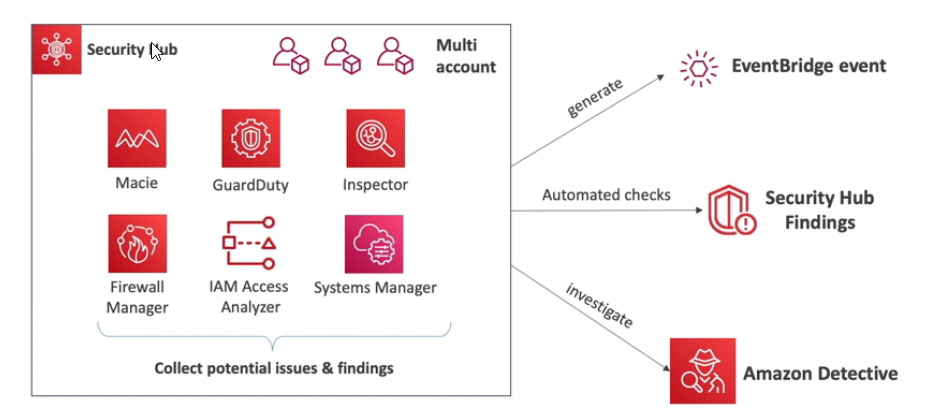

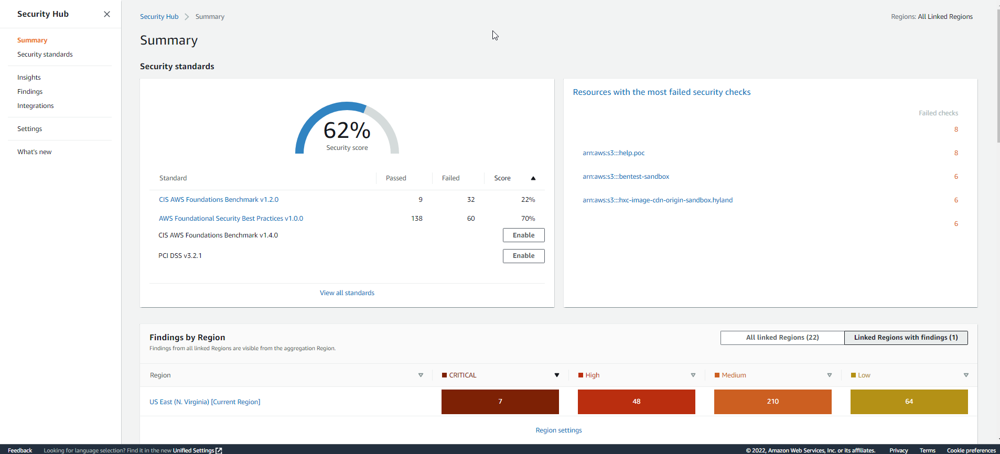

# Amazon Detective

* GuardDuty, Macie and SecurityHub are used to identify potential security issues, or findings.
* Sometimes security findings require deeper analysis to isolate the root cause and take action - it is a complex process
* Amazon Detective analyzes, investigates, and quickly identifies the root cause of security issue or suspicious activities (using ML and graphs)
* Automatically collects and processes events from VPS flow logs, CloudTrail, GuardDuty and create a unified view
* Produces visualizations with details and context to get the root cause

# AWS Abuse

* Report suspect AWS resources used for abusive or illegal purpose
* Abusive & prohibited behaviors are
  * Spam - received undesired emails from AWS-owned IP address, websites & forums spammed by AWS resources
  * Port scanning - sending packets to your ports to discover the unsecured ones
  * DoS or DDoS attacks - AWS owned-IP address attempting to overwhelm or crash your servers/software
  * Intrusion attempts - logging in on your resources
  * Hosting objectionable or copyrighted content - distributed illegal or copyrighted content without consent
  * Distributed malware - AWS resources distributing softwares to harm computers or machines
* Contact the AWS Abuse team: abuse@amazonaws.com

# Root user privileges

* Root user = Account Owner (created when the account is created)
* Has completely access to all AWS services and resources
* Lock away your AWS account root user access keys!
* Do not use the root account for everyday tasks, even administrative tasks
* Actions that can be performed only by the root user
  * Change account settings (account name, email address, root user password, root use access keys)
  * View certain tax invoices
  * Close you AWS account
  * Restore IAM user permissions
  * Change or cancel AWS Support plan
  * Register as a seller in Reserved Instance Marketplace
  * Configure an Amazon S3 bucket to enable MFA
  * Edit or delete Amazon S3 bucket policy that includes an invalid VPC ID or VPC endpoint ID
  * Sign up for GovCloud