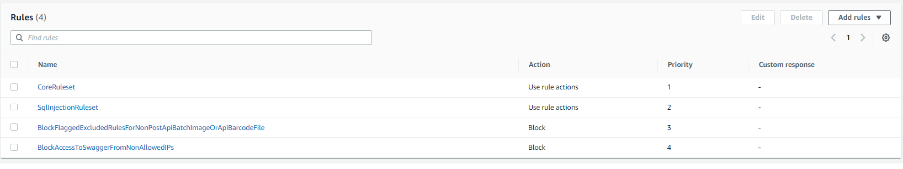

- [AWS Shared responsibility model](#aws-shared-responsibility-model)
- [WAF and Shield](#waf-and-shield)
- [Penetration testing on AWS Cloud](#penetration-testing-on-aws-cloud)
- [Encryption with KMS (Key Management Service)](#encryption-with-kms-key-management-service)
- [Encryption CloudHSM](#encryption-cloudhsm)
- [Types of Customer Master Keys (CMK)](#types-of-customer-master-keys-cmk)
- [KMS Hands On](#kms-hands-on)
  - [KMS Hands On - Customer managed keys](#kms-hands-on---customer-managed-keys)
- [AWS Certificate Manager (ACM)](#aws-certificate-manager-acm)
- [Secrets Manager](#secrets-manager)
- [AWS Artifact (not really a service)](#aws-artifact-not-really-a-service)
- [Customer Compliance Center](#customer-compliance-center)
- [Guard Duty](#guard-duty)
- [Amazon Inspector](#amazon-inspector)
- [AWS Config](#aws-config)
- [Amazon Macie](#amazon-macie)
- [AWS Security Hub](#aws-security-hub)
- [Amazon Detective](#amazon-detective)
- [AWS Abuse (AWS Trust \& Safety team)](#aws-abuse-aws-trust--safety-team)
- [Root user privileges](#root-user-privileges)
- [MFA (Multi-Factor Authentication)](#mfa-multi-factor-authentication)
- [Credential Reports](#credential-reports)

# AWS Shared responsibility model

* AWS responsibility - Security of the Cloud
  * Protecting infrastructure (hardware and software) that run all the AWS Services
  * Managed services like S3, DynamoDB, RDS
  * Maintaining network infrastructure
* Customer responsibility - Security in the Cloud
  * For EC2 instance customer is responsible for management of the guest OS, firewall & network configuration, IAM
  * Encrypting application data
  * Network configuration and firewall
* Shared controls
  * Path Management, Configuration Management, Awareness and Training

* Example, for RDS
  * AWS responsibility
    * Manage the underlying EC2 instance, disable SSH access
    * Automated DB patching
    * Automated OS patching
    * Audit the underlying and disks & guarantee it functions
  * Your responsibility
    * Check the ports / IP / security group inbound rules in DBs SG
    * In-database user creation and permissions
    * Creating database with or without public access
    * Ensure parameter groups or DB is configured to only allow SSL connections
    * Database encrypting setting

* Example, for S3
  * AWS responsibility
    * Guarantee you get unlimited storage
    * Guarantee you get encryption
    * Ensure separation of the data between different customers
    * Ensure AWS employees cannot access your data
  * Your responsibility
    * Bucket configuration
    * Bucket policy/public setting
    * IAM users and roles
    * Enabling encryption

More here https://aws.amazon.com/compliance/shared-responsibility-model/

# WAF and Shield

* Both are global services.
* AWS **Shield** Standard: **protects against DDoS attack** for your website and applications, for all customers at no additional costs
  * Provides protection from attacks such as SYN/UDP Floods, Reflection attacks and other layers 3 and 4 attacks
  * Is available globally on Amazon CloudFront Edge Locations
  * As Shield Standard is automatically activated for all AWS customers with no options for any customizations, therefore AWS needs to manage the maintenance and configurations for this service. Hence this service falls under the purview of AWS.
* AWS Shield Advanced: 24/7 premium DDoS protection, $3000 per month per organization
  *  Shield Advanced expands the number of supported AWS services and integrates with WAF to support coverage against attacks on Layer 7 (application)
  * Provides detailed attack diagnostics and the ability to detect and mitigate sophisticated DDoS attacks
  * **Protect against more sophisticated attack on Amazon EC2, ELB, CloudFront, AWS Global Accelerator and Route 53**
  * 24/7 access to AWS DDoS response team (DRP)
  * Protect against higher fees during usage spikes due to DDoS
  * It falls under customer responsibility per the AWS Shared Responsibility Model (because customer must enable it)
* AWS WAF: filter specific requests based on rules
  * Protects your web applications from common web exploits (Layer 7). Layer 7 is HTTP (vs Layer 4 is TCP)
    * For example can prevent SQL injection 
  * Deploy on ALB, API Gateway, CLoudFront
  * **WAF can block all requests except the ones that you allow** - WAF can block all requests except the ones that you allow. This is useful when you want to serve content for a restricted website whose users are readily identifiable by properties in web requests, such as the IP addresses that they use to browse to the website https://docs.aws.amazon.com/waf/latest/developerguide/waf-rule-action.html
  
  * Defines web ACL (Web Access Control List)
    * Rules can include IP addresses, HTTP headers, HTTP body, or URI strings
    * Protects from common attack - SQL injections and XSS (Cross-Site Scripting)
    * Size constraints, geo-match (block countries)
      * You can use the IP address based match rule to block specific geographies. The accuracy of the IP Address to country lookup database varies by Region. Based on recent tests, AWS mentions that the overall accuracy for the IP address to country mapping is 99.8%.
    * Rate-based rules to count occurrences of events - **for DDoS protection**, for example user cannot do more than 5 requests per second
* Cloud Front and Route 53
  * Availability protection using global edge network
  * Combined with AWS shield, provides attack mitigation at the edge
* Be read to scale - leverage AWS Auto Scaling

* Sample reference architecture for DDoS protection for a web application

# Penetration testing on AWS Cloud

* AWS customers are welcome to carry out security assessments or penetration tests against their AWS infrastructure without prior approval for 8 services:
  * EC2 instances, NAT gateways and ELB
  * RDS
  * CloudFront
  * Aurora
  * API Gateways
  * AWS Lambda and Lambda Edge functions
  * Amazon Lightsail resources
  * Amazon Elastic Beanstalk envs.
  * List can increase over time
* Prohibited Activities
  * DNS zone waling via Route 53 Hosted Zones
  * Denial of Service (DoS), Distributed Denial of Service (DDoS), Simulated DoS, Simulated DDoS
  * Port flooding
  * Protocol flooding
  * Requests flooding (login request flooding, API request flooding)
* For any other simulated events, contact aws-security-simulated-event@amazon.com

# Encryption with KMS (Key Management Service)

* Anytime you hear "encryption" for an AWS service, it is most likely KMS
* KMS = AWS manages the encryption keys for us
* Encryption opt-in
  * EBS volumes
  * S3 buckets: server-side encryption of objects
  * Redshift database: encryption of data
  * RDS database: encryption of data
  * EFS drivers: encryption of data
* Encryption automatically enabled
  * CloudTrail logs
  * S3 glacier
  * Storage gateway

# Encryption CloudHSM

*  AWS provisions encryption hardware
*  You manage your own encryption keys entirely (now AWS)
*  Dedicated hardware (HSM = Hardware Security Model)
*  HSM device is tamper resistant, FIPS 140-2 Level 3 compliance 

# Types of Customer Master Keys (CMK)

https://docs.aws.amazon.com/kms/latest/developerguide/concepts.html#key-mgmt

* Customer Managed CMK
  * A customer Managed (CMK) is a logical representation of a master key. The CMK includes metadata, such as the key ID, creation date, description, and key state. The CMK also contains the key material used to encrypt and decrypt data. These are created and managed by the AWS customer. Access to these can be controlled using the AWS IAM service.
  * Create, manage and used by the customer, can enable and disable
  * Possibility or rotation policy (new key generated every year, old key preserved)
  * Possibility to bring-your-own-key
* AWS managed CMK
  * AWS managed CMKs are CMKs in **your account** that are created, managed, and used on your behalf by an AWS service that is integrated with AWS KMS
  * Used by AWS services (s3, ebs, redshift etc...)
  * They are readonly for customer
* AWS owned CMK
  * AWS owned CMKs are a collection of CMKs that an AWS service owns and manages for use in **multiple AWS accounts**. **AWS owned CMKs are not in your AWS account**. You cannot view or manage these CMKs.
  * AWS can use those to protect resources in your account (but you cannot view the keys)
* CloudHSM Keys (customer keystore)
  * Keys generated from your own CloudHSM hardware device
  * Cryptographic operations are performed withing the CloudHSM cluster

# KMS Hands On

## KMS Hands On - Customer managed keys

# AWS Certificate Manager (ACM)

* Let`s you easily provision, manage, and deploy SSL/TLS Certificates
* Used to provide in-flight encryption for websites (HTTPS)
* Supports both public and private TLS certificates
* Free of charge for public TLS certificates
* Automatic TLS certificate renewal
* Integrations with (load TLS certificates on)
  * ELB
  * CloudFront Distributions
  * APIs and API Gateways

# Secrets Manager

* Newer service, meant for storing secrets
* Capability to force rotation of secrets every X days
* Automate generation of secrets on rotation (uses Lambda)
* Integration with Amazon RDS (MySQL, PostgreSQL, Aurora)
* Secrets are encrypted using KMS
* Mostly meant for RDS integrations
* **It does not generate new secrets/keys**

# AWS Artifact (not really a service)

* Global Portal that provides customers with on-demand access to AWS compliance documentation and AWS agreements
* Artifact Reports - allows you to download AWS security and compliance docs from third-party auditors
* Artifact Agreements - allows you to review, accept and track the status of AWS agreements
  * Suppose that your company needs to sign an agreement with AWS regarding your use of certain types of information throughout AWS services. You can do this through AWS Artifact Agreements.
* Can be used to support internal audit or compliance

# Customer Compliance Center

https://aws.amazon.com/compliance/customer-center/

* In the Customer Compliance Center, you can read customer compliance stories to discover how companies in regulated industries have solved various compliance, governance, and audit challenges.
* You can also access compliance whitepapers and documentation on topics such as
  *  AWS answers to key compliance questions
  *  An overview of AWS risk and compliance
  *  An auditing security checklist
*  Additionally, the Customer Compliance Center includes an auditor learning path. This learning path is designed for individuals in auditing, compliance, and legal roles who want to learn more about how their internal operations can demonstrate compliance using the AWS Cloud.

# Guard Duty

* Intelligent threat discovery to protect AWS account
* Uses ML algorithms, anomaly detection, 3rd party data
* One click to enable (30 days trial), no need to install software
* Input data includes
  * CloudTrail events logs - unusual API calls, unauthorized deployments
    * CloudTrail Management Events - create VPC subnet, create trail,...
    * CloudTrail S3 Data Events - get object, list objects, delete objects,...
  * VPC Flow Logs - unusual internet traffic, unusual IP address
  * DNS Logs - compromised EC2 instances sending encoded data within DNS queries
  * K8s Audit Logs - suspicious activities and potential EKS cluster compromises
  * **Because it takes as input only logs it will not impact system performance**
* **Can setup CloudWatch Event rules to be notified in case of findings**
* CloudWatch Events rules can target AWS Lambda or SNS
* Can protect against CryptoCurrency attacks (has a dedicated "finding" for it)

# Amazon Inspector

It has 3 main parts:
* Network configuration reachability piece
* Amazon agent
* Security assessment service

* **Automated** Security Assessments
* For EC2 instances
  * Leveraging the AWS System Manager (SSM) agent
  * Analyze against unintended network accessibility's
  * Analyze the running OS against known vulnerabilities
* For container Images push to Amazon ECR
  * Assessment for Container Images as they are pushed
* For Lambda Functions
  * Identifies software vulnerabilities in function code and package deps
  * Assessment of functions as they are deployed
* Reporting and integration with AWS Security Hub
* Send findings to Amazon Event Bridge

# AWS Config

* Helps with auditing and recording compliance of your AWS resources
* Helps record configuration and changes over time
* Possibility of storing the configuration data into S3 (analyzed by Athena)
* Question that can be solved by AWS Config
  * Is there unrestricted SSH access to my security groups?
  * Do my buckets have any public access?
  * How has many ALB configuration changed over time?
* You can receive alerts (SNS notifications) for any changes
* AWS Config is per-region service
* Can be aggregated across regions and accounts
* It is not free service - if it will be enabled then we have to pay
* **AWS Config vs CloudTrail**: Config is focused on the configuration of your AWS resources and reports with detailed snapshots on how your resources have changed. CloudTrail focuses on the events, or API calls, that drive those changes. It focuses on the user, application, and activity performed on the system

# Amazon Macie

* Fully managed data security and data privacy service that uses machine learning and patter matching to discover and protect your sensitive data in AWS
* Macie helps identify and alert you to sensitive data, such as personally identifiable information (PII)

Macie automatically provides an inventory of Amazon S3 buckets including a list of unencrypted buckets, publicly accessible buckets, and buckets shared with AWS accounts outside those you have defined in AWS Organizations. Then, Macie applies machine learning and pattern matching techniques to the buckets you select to identify and alert you to sensitive data, such as personally identifiable information (PII)

# AWS Security Hub

* Cental security tool to manage security across several AWS accounts and automate security checks
* Integrated dashboards showing current security and compliance status to quickly take actions
* **Automatically aggregates alerts in predefined or personal findings formats from various AWS services & AWS partner tools**
  * GuardDuty
  * Inspector
  * Macie
  * IAM Access Analyzer
  * AWS Systems Manager
  * AWS Firewall Manager
  * AWS Partner Network Solutions
* Must first enabled the AWS Config Service

# Amazon Detective

* GuardDuty, Macie and SecurityHub are used to identify potential security issues, or findings.
* Sometimes security findings require deeper analysis to isolate the root cause and take action - it is a complex process
* Amazon Detective analyzes, investigates, and quickly identifies the root cause of security issue or suspicious activities (using ML and graphs)
* Automatically collects and processes events from VPS flow logs, CloudTrail, GuardDuty and create a unified view
* Produces visualizations with details and context to get the root cause

# AWS Abuse (AWS Trust & Safety team)

* Report suspect AWS resources used for abusive or illegal purpose
* Abusive & prohibited behaviors are
  * Spam - received undesired emails from AWS-owned IP address, websites & forums spammed by AWS resources
  * Port scanning - sending packets to your ports to discover the unsecured ones
  * DoS or DDoS attacks - AWS owned-IP address attempting to overwhelm or crash your servers/software
  * Intrusion attempts - logging in on your resources
  * Hosting objectionable or copyrighted content - distributed illegal or copyrighted content without consent
  * Distributed malware - AWS resources distributing softwares to harm computers or machines
* Contact the AWS Abuse team: abuse@amazonaws.com
* If you suspect that AWS resources are used for abusive purposes, contact the **AWS Trust & Safety team** using the Report Amazon AWS abuse form, or by contacting abuse@amazonaws.com

# Root user privileges

* Root user = Account Owner (created when the account is created)
* Has completely access to all AWS services and resources
* Lock away your AWS account root user access keys!
* Do not use the root account for everyday tasks, even administrative tasks
* Actions that can be performed only by the root user
  * Change account settings (account name, email address, root user password, root use access keys)
  * View certain tax invoices
  * Close you AWS account
  * Restore IAM user permissions
  * Change or cancel AWS Support plan
  * Register as a seller in Reserved Instance Marketplace
  * Configure an Amazon S3 bucket to enable MFA
  * Edit or delete Amazon S3 bucket policy that includes an invalid VPC ID or VPC endpoint ID
  * Sign up for GovCloud

# MFA (Multi-Factor Authentication)

* U2F security key - Universal 2nd Factor (U2F) Security Key is a device that you can plug into a USB port on your computer. U2F is an open authentication standard hosted by the FIDO Alliance. When you enable a U2F security key, you sign in by entering your credentials and then tapping the device instead of manually entering a code.

* Virtual MFA device - This is a software app that runs on a phone or other device and emulates a physical device. The device generates a six-digit numeric code based upon a time-synchronized one-time password algorithm. The user must type a valid code from the device on a second webpage during sign-in. Each virtual MFA device assigned to a user must be unique.

* Hardware MFA device - This is a hardware device that generates a six-digit numeric code based upon a time-synchronized one-time password algorithm. The user must type a valid code from the device on a second webpage during sign-in. Each MFA device assigned to a user must be unique. A user cannot type a code from another user's device to be authenticated.

* SMS text message-based MFA - This is a type of MFA in which the IAM user settings include the phone number of the user's SMS-compatible mobile device. When the user signs in, AWS sends a six-digit numeric code by SMS text message to the user's mobile device. The user is required to type that code on a second webpage during sign-in.

# Credential Reports

You can generate and download a credential report that lists all users in your account and the status of their various credentials, including passwords, access keys, and MFA devices. You can use credential reports to assist in your auditing and compliance efforts. You can use the report to audit the effects of credential lifecycle requirements, such as password and access key rotation. You can provide the report to an external auditor, or grant permissions to an auditor so that he or she can download the report directly.