- [Introduction for Serverless](#introduction-for-serverless)
- [Integration with SQS](#integration-with-sqs)
- [Lambda with SNS vs Lambda with SQS](#lambda-with-sns-vs-lambda-with-sqs)
- [Scaling consideration](#scaling-consideration)
  - [Burst](#burst)
  - [Memory](#memory)
  - [Lambda execution environment reuse](#lambda-execution-environment-reuse)
  - [Serverless scaling with traditional relational databases](#serverless-scaling-with-traditional-relational-databases)
  - [Scaling considerations for Step Functions and Amazon SNS](#scaling-considerations-for-step-functions-and-amazon-sns)
    - [Step functions](#step-functions)
    - [Amazon SNS](#amazon-sns)
  - [Scaling considerations for Kinesis Data Streams](#scaling-considerations-for-kinesis-data-streams)
    - [Enhanced fan-out](#enhanced-fan-out)
    - [IteratorAge](#iteratorage)
    - [Getting it "just right"](#getting-it-just-right)
- [Handling errors](#handling-errors)
  - [Synchronous events](#synchronous-events)
  - [Asynchronous events](#asynchronous-events)
  - [Error handling for stream-based events](#error-handling-for-stream-based-events)
  - [Failed-event destinations](#failed-event-destinations)
    - [Failed-event destinations vs dead-letter queue](#failed-event-destinations-vs-dead-letter-queue)
  - [Error handling with Amazon SQS as an event source](#error-handling-with-amazon-sqs-as-an-event-source)
  - [Error handling summary by execution model](#error-handling-summary-by-execution-model)
    - [API GW (synchronous event source)](#api-gw-synchronous-event-source)
    - [SNS (asynchronous event source)](#sns-asynchronous-event-source)
    - [Kinesis Data Streams (polling a stream as event source)](#kinesis-data-streams-polling-a-stream-as-event-source)
    - [SQS queue (polling a queue as an event source)](#sqs-queue-polling-a-queue-as-an-event-source)
  - [Dead-letter queues for Lambda functions and for SQS source queues](#dead-letter-queues-for-lambda-functions-and-for-sqs-source-queues)
  - [AWS Event Fork Pipelines](#aws-event-fork-pipelines)
  - [Migrating to Serverless](#migrating-to-serverless)
    - [Leapfrog](#leapfrog)
    - [Organic](#organic)
    - [Strangler](#strangler)
- [Serverless IT automation](#serverless-it-automation)
- [Serverless web applications and mobile apps](#serverless-web-applications-and-mobile-apps)
  - [Example: Web application](#example-web-application)
  - [Example: Mobile backend](#example-mobile-backend)
- [Best practices for serverless applications](#best-practices-for-serverless-applications)
- [Concurrency](#concurrency)
- [Deploying Serverless Applications](#deploying-serverless-applications)
  - [Introduction to serverless deployments](#introduction-to-serverless-deployments)
  - [Serverfull vs serverless development](#serverfull-vs-serverless-development)
  - [AWS Serverless Application Model (SAM)](#aws-serverless-application-model-sam)
    - [SAM templates](#sam-templates)
      - [Example of a SAM template](#example-of-a-sam-template)
    - [Deploying SAM templates with the SAM CLI](#deploying-sam-templates-with-the-sam-cli)
  - [Serverless Patterns Collection](#serverless-patterns-collection)
  - [Sharing configuration data in a serverless environment](#sharing-configuration-data-in-a-serverless-environment)
    - [AWS Systems Manager Parameter Store](#aws-systems-manager-parameter-store)
      - [Parameter Store: Hierarchical key storage](#parameter-store-hierarchical-key-storage)
  - [Automating the Deployment Pipeline](#automating-the-deployment-pipeline)
    - [Lambda versioning and aliases](#lambda-versioning-and-aliases)
    - [Deployment strategies](#deployment-strategies)
      - [Comparing deployment strategies](#comparing-deployment-strategies)
    - [Deployment preferences with AWS SAM](#deployment-preferences-with-aws-sam)
  - [Creating a deployment pipeline](#creating-a-deployment-pipeline)
  - [AWS SAM Pipelines](#aws-sam-pipelines)
    - [Creating pipeline deployment resources](#creating-pipeline-deployment-resources)
    - [Deploy SAM templates with one command](#deploy-sam-templates-with-one-command)
- [Lambda monitors](#lambda-monitors)
- [Notes from AWS PartnerCast](#notes-from-aws-partnercast)

# Introduction for Serverless

* No Server Management
* Flexible Scaling
* **Automated HA and Fault Tolerance**
* No Idle Capacity

# Integration with SQS

The message is stored on the SQS queue durably. The Lambda service polls the Amazon SQS queue. If Lambda finds new messages, it invokes the Lambda function the queue is connected to, passing the message as a parameter and including the message ID for identifying the message.


It’s important here to distinguish between the Lambda service and your individual Lambda functions.

* The Lambda service uses long polling to poll the SQS queue, waiting for messages to appear.
* The Lambda service reads messages in batches and invokes your Lambda **function once per batch**.


Lambda will continue to add additional processes every minute until the queue has slowed down, or it reaches maximum concurrency. Maximum concurrency is 1,000, unless the account or function limit is lower.


**By default, Lambda reads up to five batches at a time** and sends each batch to an invocation of your function. Each invocation of the Lambda function gets an event object that contains the messages in a batch.   
The messages in that batch become hidden to other consumers for the duration of the queue’s visibility timeout setting.   
**When your Lambda function successfully processes a batch, the Lambda service deletes that batch of messages from the queue. If your function returns an error or doesn’t respond, the messages in that batch become visible again.**   

It means also that lambda function should have configured concurrency at least set to 5!


If any of the messages in the batch fail, all items in the batch become visible on the queue again. This means that some messages will be processed more than once. **You want to include code in your Lambda functions to handle this kind of partial failure.** Your Lambda function should delete each message from the queue after successfully processing it. That way if the batch fails, only the unsuccessful messages reappear in the queue.


When a message continues to fail, send it to a dead-letter queue. A dead-letter queue is another SQS queue that you use to process failed messages. This is optional, but recommended.   
Make sure that you configure the dead-letter queue on the source queue versus configuring the dead-letter queue option on the Lambda function.

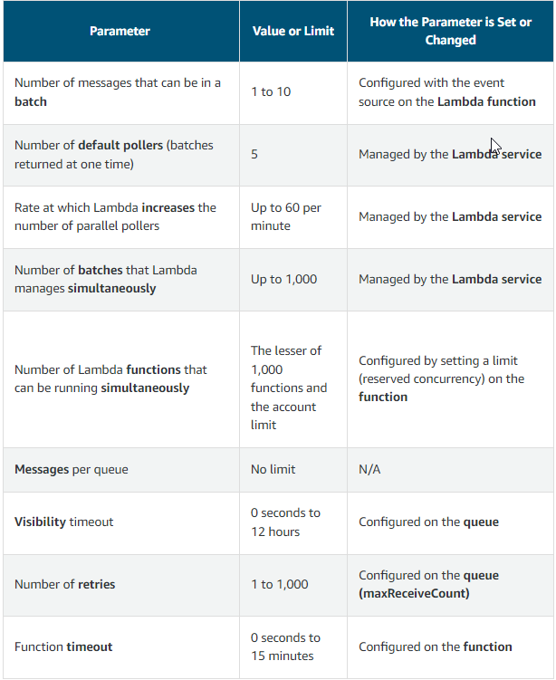

# Lambda with SNS vs Lambda with SQS

* **Lambda with SNS**: when you integrate AWS Lambda with SNS, the Lambda function is invoked when a message is published to the SNS topic. This is a push-based invocation, **where SNS pushes the message to the Lambda function**.
  * SNS supports fan-out architecture, meaning a single message can be delivered to multiple subscribers (which can be multiple Lambda functions).
  * If the Lambda function fails to process the message, SNS will not retry the delivery. You need to handle retries and dead-letter queues at the Lambda function level.

* **Lambda with SQS:** when you integrate AWS Lambda with SQS, the Lambda service polls the SQS queue and invokes your Lambda function synchronously with the message. **This is a pull-based model**.
  * SQS supports point-to-point messaging, meaning a message in the queue is processed by a single consumer (Lambda function).
  * If the Lambda function fails to process the message, SQS automatically retries delivering the message based on the visibility timeout setting. If all retries fail, SQS can move the message to a dead-letter queue.

# Scaling consideration

## Burst

The key thing is to know, that all of your account concurrency is not available immediately. **This means requests could be throttled for a few minutes even when the limit itself is higher than the burst.**

When you get a burst of requests, Lambda will immediately increase concurrency up to the "Immediate Concurrency Increase" level for the AWS Region where your Lambda function is running. Then, it will add 500 more invocations each minute, until it either has enough to process the burst, or hits the function or account concurrency limit.

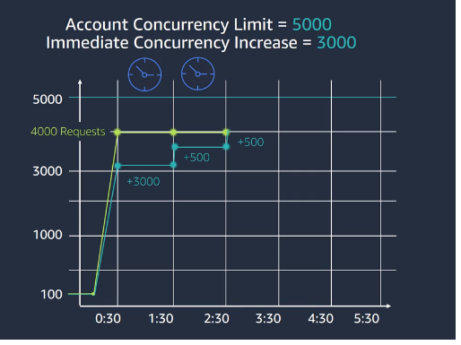

## Memory

When you configure functions, there is only one setting that can impact performance—memory. However, both CPU and I/O scale linearly with memory configuration. For example, a function with 256 MB of memory has twice the CPU and I/O as a 128 MB function.

Memory assignment will impact how long your function runs and, at a larger scale, can impact when functions are throttled

For example, if your function lasts 10 seconds on average, and there are 25 requests per second, you need 250 concurrent invocations of that function.

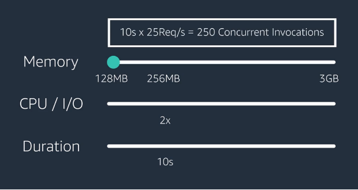

But if your function lasts only 5 seconds at the same request rate, you only need 125 concurrent invocations.

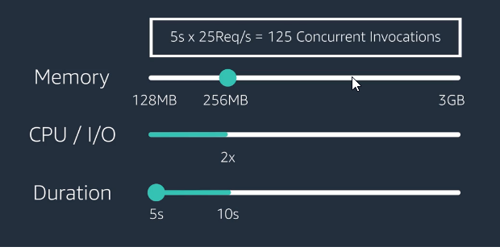

Performance has an effect on function pricing, too. Lambda costs are determined by the number of requests and the duration of the function. **Functions that are assigned more memory may actually be cheaper to run because they’ll run faster.**

**AWS Lambda Power Tuning** is an open-source project that runs your Lambda function at multiple memory configurations and provides feedback across execution time, and cost, to help you make the best choice.

## Lambda execution environment reuse

https://docs.aws.amazon.com/lambda/latest/dg/lambda-runtime-environment.html   
https://www.youtube.com/watch?v=E20B8Izr5fI   

When you’re writing AWS Lambda functions, even though you really need to make them stateless, and assume every Lambda invocation could get a new execution environment, you can improve performance of your functions by taking advantage of reuse when the same execution environment is reused (that is, when you get a **"warm start"**).

Here are a few best practices to incorporate into your Lambda function design standards.

If your code retrieves any externalized configuration or dependencies, make sure they are **stored and referenced locally after initial execution**. For example, if your function retrieves information from an external source like a relational database or AWS Systems Manager Parameter Store, it should be kept outside of the function handler. By doing so, the lookup occurs when the function is initially run. Subsequent warm invocations will not need to perform the lookup.

You should also limit the re-initialization of variables or objects on every invocation. Any declarations in your Lambda function code (outside the handler code) remain initialized when a function is invoked.

Add logic to your code to check whether a connection already exists before creating one. If one exists, just reuse it. We’ll talk a bit more about managing connections in the next video.

Add code to check whether the local cache has the data that you stored previously. Each execution context provides additional disk space in the /tmp directory that remains in a reused environment.

And finally, make sure any background processes (or callbacks in the case of Node.js) are complete before the code exits.

Background processes or callbacks initiated by the function that don’t complete when the function ended will resume, if you get a warm start.

https://stackoverflow.com/questions/43463130/c-sharp-lambda-constructor-not-called-in-consecutive-lambda-calls  
https://aws.amazon.com/blogs/compute/container-reuse-in-lambda/   
https://kenhalbert.com/posts/useful-csharp-aws-lambda-function-patterns   

```cs
using Amazon.Lambda.Core;
using System.Data.SqlClient;

[assembly: LambdaSerializer(typeof(Amazon.Lambda.Serialization.Json.JsonSerializer))]

public class Function
{
    // Static variable to store the database connection string
    private static string connectionString;

    // Static constructor
    static Function()
    {
        // This code will be executed during the initialization phase
        connectionString = System.Environment.GetEnvironmentVariable("DB_CONNECTION_STRING");
    }

    public string FunctionHandler(string input, ILambdaContext context)
    {
        // Use the connection string to connect to the database
        using (SqlConnection connection = new SqlConnection(connectionString))
        {
            connection.Open();
            // Perform database operations here...
        }

        return input?.ToUpper();
    }
}
```

## Serverless scaling with traditional relational databases

When you look at methods you’d traditionally use to manage relational database connections, you’ll find inherent challenges applying them with AWS Lambda.

The main hurdle is the fact that Lambda execution environments are ephemeral, and you don’t control when a new one starts up or an existing one is destroyed.

You can initialize connections inside your function, (outside the handler), to make them available for as long as the execution environment is alive. But there’s no point initializing more than one connection, **because that environment will never execute more than one Lambda function at a time.**

So, as a starting point, you might initialize a single connection outside of the handler, and then check for that connection as each new invocation of that function is executed.

A separate challenge is that you can’t explicitly close connections when an environment gets recycled, because there is no hook to let you indicate destruction of a Lambda environment. You can use the database Time to Live as a fallback to clean up connections, but this can still lead to session leakages.

Because you have no control over the lifecycle of the execution environments, you could have connections sitting idle. **And because you can’t share environments with two different Lambda functions, you can’t reuse idle connections across functions.**

You can use Lambda concurrency limits at the function level to limit the number of potential connections that Lambda would attempt to create.

You might also need to do this at the account level, to segregate connections for different applications. But this adds complexity to account management, and you still can’t share connections dynamically across multiple functions. Plus, it can be difficult to know where to set the limits effectively.

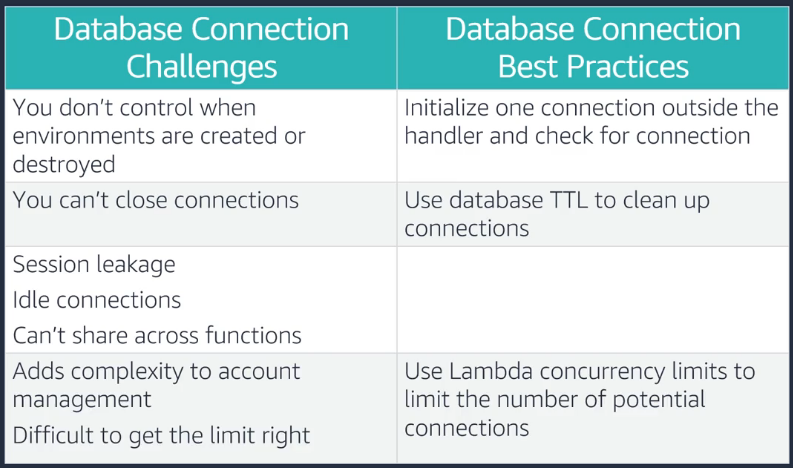

**So what else can you do?**

The best practice is to implement an external mechanism for managing the connections.
For example, your database engine may have a proxy program that will manage the incoming connection requests and use a persistent database connection that can be shared across functions.

You could also use a method called Dynamic Content Management. This method uses an Amazon DynamoDB table to track connections allowed and connections in use and manipulates the count with a helper function packaged as a Lambda layer.

## Scaling considerations for Step Functions and Amazon SNS

### Step functions

Most of the guidance around scaling with AWS Step Functions thus far has focused on how Step Functions helps you manage scaling.

For example, it lets you orchestrate tasks that trigger long-running activities, that might happen in AWS Fargate, AWS Batch, or even on an on-premises resource. **It’s a best practice to use wait states and callbacks to reduce costs when you are waiting on other tasks to finish.**

You also want to use timeouts within Step Functions to avoid stuck executions. Step Functions doesn’t set a default timeout. So if something goes wrong while it’s waiting on a response from an activity worker, it’s just going to sit there patiently waiting for a response that won’t come. To avoid this, use the **TimeoutSeconds** options within the Amazon States Language to end the activity, regardless of the response.

It’s also important to understand the size of the data that will be fed into or be passed out of one Step Functions state to the next.

If your payload has the potential to grow beyond the limit for input or output data size, use Amazon Simple Storge Service (Amazon S3) to store the data **and pass the ARN of the S3 bucket**. I spoke about this in the context of direct connections with Amazon API Gateway, but there is a limit to how many StartExecution requests can be made per second, and requests beyond that level will be throttled.

There are similar limits on the other APIs within Step Functions. Make sure you are aware of the limits of the APIs you use and include testing against them in your load tests.

### Amazon SNS

SNS can give you asynchronous connections and parallel execution of functions, or nested applications within your larger application.

In particular, the **AWS Event Fork Pipeline** applications available in the Serverless Application Repository let you deploy pre-built applications that use SNS to execute common tasks in parallel.

Use the pipelines to model your own SNS fanouts. By default, 200 filter policies per account, per AWS Region can be applied to a topic.

## Scaling considerations for Kinesis Data Streams

Amazon Kinesis Data Streams are designed to handle very high volumes of data. There are a couple of constraints that you need to consider when deciding how to configure your Kinesis data stream.

Stream processing is dependent on the number of shards on the stream. AWS Lambda gets records in a batch (one per shard) and invokes one instance of your function per shard.

If Lambda can’t process one message in the shard, that whole shard is blocked until you either force that message to complete or the retention period expires for the data in the shard.

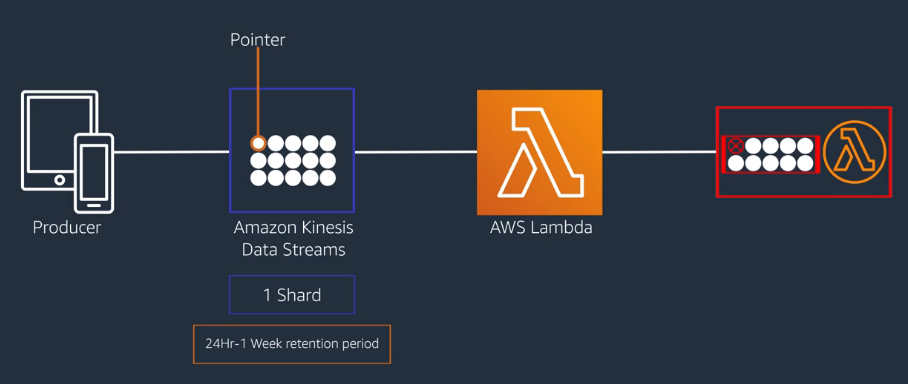

Customize failure handling with:

* Bisect on function error
* Maximum record age in seconds
* Maximum retry attempts
* Destination on failure

Kinesis Data streams can take in up to 1 MB of data or 1,000 records per second, per shard from a producer. When you look at the volume of data you expect to produce, this will drive how many shards you need.

For example, if you need the stream to take in 4,000 records or 4 MB of data per second, you’ll need four shards.

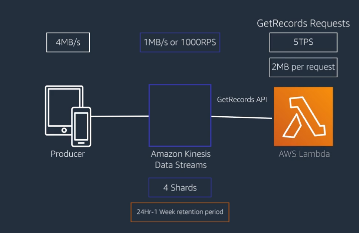

When you use Lambda as a consumer of a stream, the Lambda service is handling some things behind the scenes. For example, it determines how frequently the stream is polled, and it uses a GetRecords API call to get data off the stream. "GetRecords" requests can only be made at five transactions per second, per shard.

Each request can return a maximum of 2 MB of data. You can have up to five standard consumers on a stream, but all of them have to share the polling capacity and the data capacity.

So, if you have five standard consumers, each one can poll each shard only once per second (verses five times) and each one is getting 1/5 of the data bandwidth. So, latency goes up, and throughput goes down.

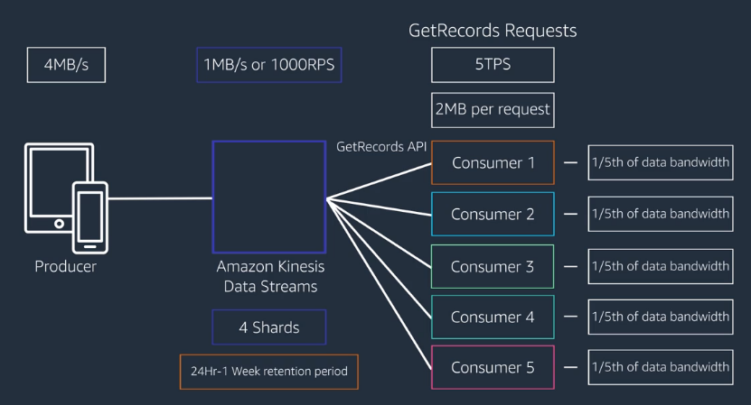

### Enhanced fan-out

In 2018, the option for enhanced fan-out was introduced to address these limitations, and it also changes the model of how the consumers get data off the stream. **Standard consumers poll the stream**.

Enhanced fan-out **consumers subscribe to the stream**. Once they are subscribed, data from the shard is pushed out to the consumer using an HTTP/2 request that can run for up to 5 minutes. Data will keep getting pushed out to the consumer as it comes in.

This reduces the latency such that the delivery rate is more like 50 to 70 ms. Additionally, enhanced fan-out increases throughput. Any consumers that are using enhanced fan-out get their own pipe, so they’re getting the full 2 MB per shard.

There is an additional cost to using enhanced fan-out, so consider what your traffic will look like, and whether the latency of a standard consumer is acceptable. Generally speaking, if you have three consumers or less, and latency isn’t critical, you probably want to use a standard stream to minimize the cost.

### IteratorAge

https://docs.aws.amazon.com/lambda/latest/dg/with-kinesis.html#events-kinesis-metrics

Lambda emits the `IteratorAge` metric when your function finishes processing a batch of records. The metric indicates how old the last record in the batch was when processing finished. If your function is processing new events, you can use the iterator age to estimate the latency between when a record is added and when the function processes it. **An increasing trend in iterator age can indicate issues with your function**.

### Getting it "just right"

You need to find the right balance between the type of stream, number of shards, batch size, and retention timeout.

With more shards, there are more batches being processed at once, which increases throughput and lowers how errors impact your stream processing. But there is a cost to using more shards.

If your Lambda function runs too long or runs into errors processing a batch, other messages on the stream might reach their retention timeout before you’ve consumed them.

If your Lambda function is not processing records in a timely manner, you’ll see the IteratorAge metric increase on your Lambda dashboard, and this may indicate that you need to **"reshard"**. **Resharding lets you increase the number of shards in your stream to adapt to changes in the rate of data flow**. When you reshard, data records that were flowing into the existing shards are rerouted to new shards based on key values.

However, any data records that were in the existing shards before the reshard, remain in those shards. For example, if you have two shards, each with 1,000 records, and you reshard and add a third, the existing 1,000 records will remain and need to be processed on the original two shards.

**Only new records will be split among all three shards.** When sizing these parameters, try to think through all possibilities such as an issue with your record processing logic, or a downstream dependency.

# Handling errors

When you invoke a function, two types of errors can occur:

* **Function errors**: You get a function error if Lambda successfully hands off an event to your function, but the function throws an error or times out before completing.
  

* **Invocation errors**: You get an invocation error if the request is rejected before your function receives it. For example, an oversized payload or lack of permissions will cause an invocation error. You also get an invocation error if the function is getting throttled.
  

## Synchronous events

In a synchronous invocation, like between API Gateway and Lambda, no retries are built in. You have to write code to handle errors and retries for all error types.  


## Asynchronous events

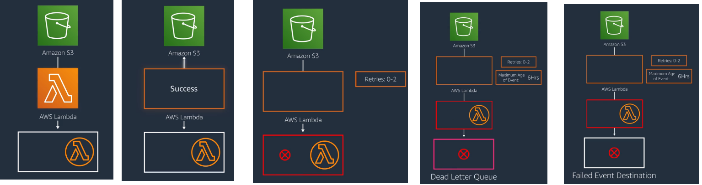

With asynchronous event sources, like Amazon S3, **Lambda provides built-in retry behaviors**.   

When Lambda gets an asynchronous event, the lambda service returns a success to the event source and **puts the request in its own internal queue**. Then it sends invocation requests from its queue to your function.   
If the invocation request returns invocation errors, Lambda retries that **request two more times by default**. You can configure this retry value between 0 and 2.   

If the invocation request returns invocation errors, Lambda retries that invocation for **up to 6 hours**. You can decrease the default duration using the maximum age of event setting. 

To handle events that continue to fail beyond the retry or maximum age settings, you can configure a **dead-letter queue** on the Lambda function. Alternatively, you can set a **failed-event destination**.

## Error handling for stream-based events

Stream-based event sources (like Kinesis Data Streams or DynamoDB Streams) need to maintain **record order per shard**. So, by default, if an error occurs while Lambda is processing a batch of records, Lambda won’t process any new records from that shard until the batch succeeds or expires.You can use the Iterator-Age metric to detect blocked shards.  


Prior to December 2019, if you wanted to bypass stream failures, you needed to write code into your function to return a success back to the stream after some number of attempts, and then write the error record to something like Amazon SQS queue or CloudWatch Logs for offline analysis. 


A better way to manage failures is to modify the default behaviors using four configuration options introduced in 2019:

* **Bisect batch on function error**: tells Lambda to split a failing batch into two and retry each batch separately.
* **Maximum retry attempts**: let you limit the number of retries on a failed batch.
* **Maximum record age**: let you limit the duration of retries on a failed batch.
* **On-failure destination**: lets you send failed records to an SNS topic or SQS queue to be handled offline without having to add additional logic into your function.

Here’s an illustration of how these options work together. In this example, **BisectOnFunctionError = True, MaximumRetryAttempts = 2**, and DestinationConfig includes an **OnFailure Destination** that points to an **SNS topic**.


Assume you have a batch of 10 records, and the third record in this batch of 10 returns a function error. When the function returns an error, Lambda splits the batch into two, and then sends those to your function separately, still maintaining record order. Lambda also resets the retry and max age values whenever it splits a batch.


Now you’ve got two batches of five. Lambda sends the first batch of five and it fails. So the splitting process repeats. Lambda splits that failing batch yielding a batch of two and a batch of three records. Lambda resets the retry and max age values, and sends the first of those two batches for processing.


This time, the batch of two records processes successfully. So Lambda sends the batch of three to the function. That batch fails. Lambda splits it, and now it has a batch with one record (the bad one) and another with two records.


Lambda sends the batch with a bad record and it fails, but there’s nothing left to split.

So now the max retry and max age settings come into play. In this example, the function retries the record twice, and when it continues to fail, sends it to the SNS topic configured for the on-failure destination.   

With the erroring record out of the way, Lambda works its way back through each of the smaller batches it created, always maintaining record order.


So Lambda is going to process the unprocessed batch of two, then the unprocessed batch of five. At that point, the original batch of 10 is marked as successful, and Lambda moves the pointer on the stream to the start of the next batch of records.


These options provide flexible error handling, but they also introduce **the potential for a record to be processed multiple times**. In the example, the first two records are processed before the function returns an error.


Then they’re processed a second time in the smaller batch of five records, which also fails, and then they are processed a third time in their own batch.

This means you have to handle idempotency in your function rather than assuming only-once record processing.


## Failed-event destinations

For both **asynchronous** and **streaming** event sources, you can specify an on-failure destination for a Lambda function.

For **asynchronous sources**, you have the option of an SNS topic, SQS queue, EventBridge event bus, or another Lambda function. 


For **streaming event sources**, you can specify an SNS topic or an SQS queue.


The SendOrder Step Functions task kicks off the SNS fulfillment topic, whose subscribers handle additional fulfillment requirements. Let’s say that one of the subscribers is a Lambda function that decides if the order qualifies for a promotional gift. If it does, the function initiates steps to send the gift from a third-party system.

To handle potential failures caused by the third-party system, set the function’s on-failure destination equal to the ARN of an SNS topic that notifies the team responsible for fulfillment.


### Failed-event destinations vs dead-letter queue

There are a couple of advantages to using an on-failure destination rather than using a dead-letter queue.

* First, the invocation record that is sent to the on-failure destination contains more data than the event object available to a dead-letter queue.
* Second, it provides more flexibility to change or modify the failure behaviors. A dead-letter queue is part of a function’s version-specific configuration.  
* You can also set on-success destinations to route successfully processed events without modifying your Lambda function code.


## Error handling with Amazon SQS as an event source

For polling event sources that aren’t stream based, for example Amazon SQS, if an invocation fails or times out, the message is available again when the visibility timeout period expires.

Lambda keeps retrying that message until it is either successful or the queue’s **Maxreceivecount** limit has been exceeded.   

As noted earlier, it’s a best practice to set up a dead-letter queue on the source queue to process the failed messages.   

When you’re building serverless applications, you need to execute performance tests, and adjust retries and timeouts to find the optimal combination that allows your processes to complete but doesn’t create bottlenecks that can cascade throughout the system.   

Let’s go back to the connection between an Amazon SQS queue and Lambda as an example of how you manage timeouts across services.

You can set a timeout on your Lambda functions, and you can set the visibility timeout on SQS queues.

You can also set the batch size for the queue from 1 to 10 messages per batch, which can impact both your function timeout and your visibility timeout configurations.

You choose your Lambda timeout to allow the function to complete successfully under most circumstances.

You also want to consider at what point to give up on individual invocation to avoid additional costs or prevent a bottleneck.

**A larger batch size can reduce polling costs and improve efficiency for fast workloads**. **But for longer running functions, you might need a lower batch size so that everything in the batch is processed before the function timeout expires.**

For example, a batch size of 10 would require fewer polling processes and fewer invocations than a batch size of 3.


If your function typically can process a message in 2 seconds, then a batch size of 10 would typically process in 20 seconds, and you might use a function timeout of 30 seconds. But if your function takes 2 minutes to process each message, then it would take 20 minutes to process a batch of 10.

However, the maximum timeout for Lambda is 15 minutes, so that batch would fail without processing all of its messages, and any messages in that batch that weren’t deleted by your function would again be visible on the queue. Which brings us back to the visibility timeout setting on the queue.

You need to configure the visibility timeout to allow enough time for your Lambda function to complete a message batch. So if we stick with the example of a batch size of 10 and a Lambda function that takes 20 seconds to process the batch, you need a visibility timeout that is greater than 20 seconds.


You also need to leave some buffer in the visibility timeout to account for Lambda invocation retries when the function is getting throttled. You don’t want your visibility timeout to expire before those messages can be processed. **The best practice is to set your visibility timeout to 6 times the timeout you configure for your function.**

**If a Lambda function returns errors when processing messages, Lambda decreases the number of processes polling the queue.**

## Error handling summary by execution model

### API GW (synchronous event source)

* **Timeout considerations** – API Gateway has a 30-second timeout. If the Lambda function hasn't responded to the request within 30 seconds, an error is returned.
* **Retries** – There are no built-in retries if a function fails to execute successfully.
* **Error handling** – Generate the SDK from the API stage, and use the backoff and retry mechanisms it provides.

### SNS (asynchronous event source)

* **Timeout considerations** – Asynchronous event sources do not wait for a response from the function's execution. Requests are handed off to Lambda, where they are queued and invoked by Lambda.
* **Retries** – Asynchronous event sources have built-in retries. If a failure is returned from a function's execution, Lambda will attempt that invocation **two more times** for a **total of three attempts** to execute the function with its event payload. You can use the Retry Attempts configuration to set the retries to 0 or 1 instead.

  If Lambda is unable to invoke the function (for example, if there is not enough concurrency available and requests are getting throttled), Lambda will continue to try to run the function again for up to **6 hours by default**. You can modify this duration with **Maximum Event Age**.

  Amazon SNS has unique retry behaviors among asynchronous events based on its delivery policy for AWS Lambda(opens in a new tab). It will perform 3 immediate tries, 2 at 1 second apart, 10 backing off from 1 second to 20 seconds, and 100,000 at 20 seconds apart.

* **Error handling** – Use the Lambda destinations(opens in a new tab) **OnFailure** option to send failures to another destination for processing. Alternatively, move failed messages to a **dead-letter queue** on the function. When Amazon SNS is the event source, you also have the option to configure a dead-letter queue on the SNS subscription.

### Kinesis Data Streams (polling a stream as event source)

* **Timeout considerations** – When the retention period for a record expires, the record is no longer available to any consumer. The retention period is **24 hours by default**. You can increase the retention period at a cost. As an event source for **Lambda**, you can configure **Maximum Record Age** to tell Lambda to skip processing a data record when it has reached its Maximum Record Age.
* **Retries** – By default, Lambda retries a failing batch until the retention period for a record expires. You can configure Maximum Retry Attempts so that your Lambda function will skip retrying a batch of records when it has reached the Maximum Retry Attempts (or it has reached the Maximum Record Age).
* **Error handling** – Configure an **OnFailure** destination on your Lambda function so that when a data record reaches the Maximum Retry Attempts or Maximum Record Age, you can send its metadata, such as shard ID and stream Amazon Resource Name (ARN), to an SQS queue or SNS topic for further investigation.

  Use **BisectBatchOnFunctionError** to tell Lambda to split a failed batch into two batches. Retry your function invocation with smaller batches to isolate bad records and work around timeout and retry issues.

  For more information on these error handling features, see the blog post AWS Lambda Supports Failure-Handling Features for Kinesis and DynamoDB Event Sources https://aws.amazon.com/about-aws/whats-new/2019/11/aws-lambda-supports-failure-handling-features-for-kinesis-and-dynamodb-event-sources/.

### SQS queue (polling a queue as an event source)

* **Timeout considerations** – When the visibility timeout expires, messages become visible to other consumers on the queue. Set your visibility timeout to 6 times the timeout you configure for your function.
* **Retries** – Use the **maxReceiveCount** on the queue's policy to limit the number of times Lambda will retry to process a failed execution.
* **Error handling** – Write your functions to delete each message as it is successfully processed. Move failed messages to a dead-letter queue configured on the source SQS queue.

## Dead-letter queues for Lambda functions and for SQS source queues

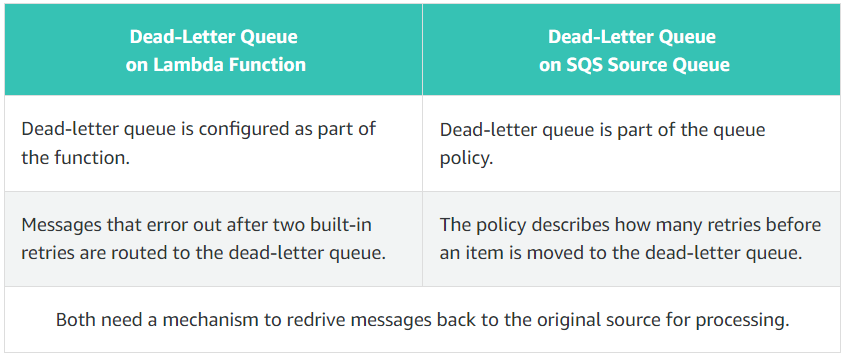

## AWS Event Fork Pipelines 

AWS Event Fork Pipelines are prebuilt applications, available in the [AWS Serverless Application Repository](https://aws.amazon.com/serverless/serverlessrepo/), that you can use in your serverless applications.

The **Event Replay Pipeline** buffers events from the given Amazon SNS topic into an Amazon SQS queue, so it can replay these events back to another pipeline in a disaster recovery scenario.

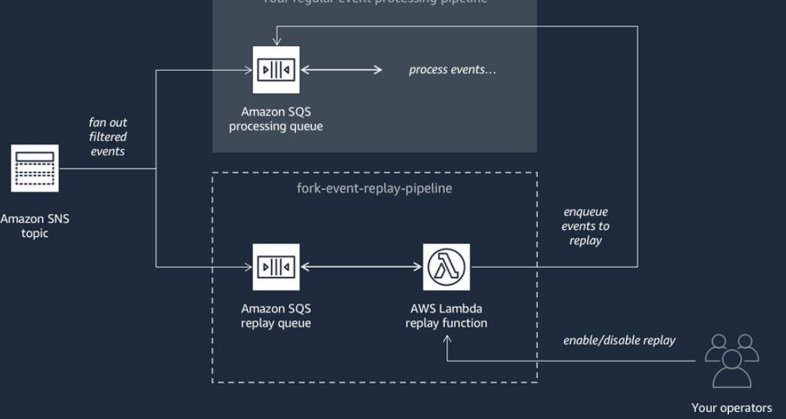

## Migrating to Serverless

At a high level, there are three migration patterns that you might follow to migrate your legacy applications to a serverless model.

### Leapfrog

As the name suggests, with the leapfrog pattern, you bypass interim steps and go straight from an on-premises legacy architecture to a serverless cloud architecture.

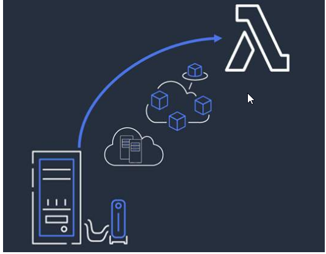

### Organic

With the organic pattern, you move on-premises applications to the cloud in more of a **lift-and-shift model**. **In this model, existing applications are kept intact**, either running on Amazon Elastic Compute Cloud (Amazon EC2) instances **or with some limited rewrites to container services such** as Amazon Elastic Kubernetes Service (Amazon EKS), Amazon Elastic Container Service (Amazon ECS), or AWS Fargate.

### Strangler

With the strangler pattern, an organization incrementally and systematically decomposes monolithic applications by creating APIs and building event-driven components that gradually replace components of the legacy application.

Distinct API endpoints can point to old compared to new components and safe deployment options (such as canary deployments) let you point back to the legacy version with very little risk.

New feature branches can be serverless first, and legacy components can be decommissioned as they are replaced. This pattern represents a more systematic approach to adopting serverless, **allowing you to move to critical improvements where you see benefit quickly but with less risk and upheaval than the leapfrog pattern**.

# Serverless IT automation

A powerful IT automation pattern is to trigger a Lambda function that assesses whether a configuration change is allowed and deletes the change automatically if it is not allowed. In this example, you will learn how configuration changes can be automated in response to an event.

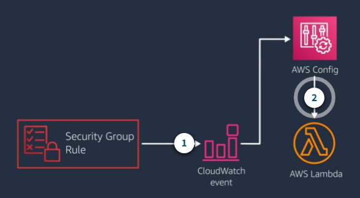

* **1 CloudWatch event for security group change**: a CloudWatch event is fired off whenever someone modifies a security group
* **2 Lambda function evaluates the change**: the CloudWatch event triggers a Lambda function through AWS Config that has custom code to review a list of what security group rules are allowed or denied. If the update is not allowed, the function deletes the rule and uses SNS to send an email alert.

# Serverless web applications and mobile apps

A common event-driven pattern forms the basic backbone of a serverless web application architecture using Amazon API Gateway to handle HTTP requests, Lambda to provide the application layer, and Amazon DynamoDB to provide database functionality.

## Example: Web application

In this example, you will see a demo architecture for a serverless web application. You can add Amazon Cognito for authentication and add Amazon Simple Storage Service (Amazon S3) and Amazon CloudFront to quickly serve up static content from anywhere. 

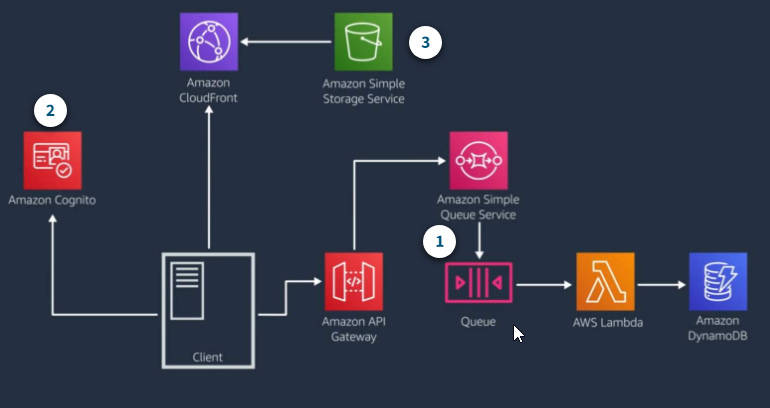

* **1 Start with the basic pattern**: this event-driven pattern is one approach in forming the basic backbone of a serverless web application architecture. When a request comes in, API GW sends it to SQS and gets a message ID back, which the client can use to track the message. The message is stored durably on the queue and the Lambda service polls the queue. If the Lambda finds a new message on the queue, it invokes Lambda function using the message as a parameter.
* **2 Authentication**: Cognito can be used for sign-up and sign-in.
* **3 S3 and CloudFront serve static assets**

## Example: Mobile backend

Similar to the web application example, in this example you will see a demo architecture for a serverless mobile backend. For mobile applications, users expect real-time data and a feature-rich user experience. Users also expect their data to be available when they’re offline or using a low-speed connection, and they expect data to be synchronized across devices. You have the added challenge that, with a microservice-based architecture, it takes multiple connections to retrieve distributed data vs. a single connection, which you might use in a more traditional backend.

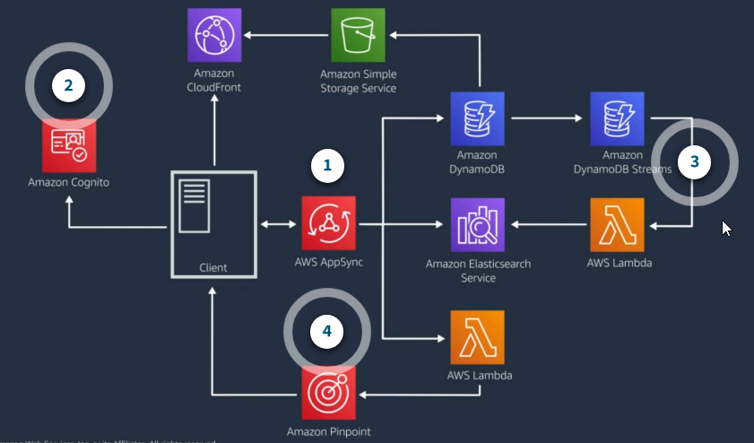

* **1 AWS Appsync provides a single point**: one GraphQL endpoint which spans out to interact with lots of backend services.
* **2 Authentication**: Cognito can be used for sign-up and sign-in.
* **3 Elasticsearch Service for search and analytics**: DynamoDB Streams indexes relevant data to ElasticSearch through a Lambda function. You can use ES for both application search engine and for analytics.
* **4 Pinpoint for analytics and targeted communications**: captures analytics data from clients and also sends targeted texts or emails based on user data.


# Best practices for serverless applications

* **Don’t reinvent the wheel**. Use managed services when possible and use the AWS Serverless Application Repository and Serverless Patterns Collection.
* **Don’t just port your code.** You can easily copy code from other applications and run it in Lambda. But if you don’t apply event-driven thinking, you’re going to miss out on some of the benefits. It’s OK to start here, but revisit and iterate.
* **Stay current.** Services and available serverless applications evolve quickly. There might be an easier way to do something.
* **Prefer idempotent, stateless functions.**: When you can’t, use Step Functions where you need stateful control (retries, long-running).
* **Keep events inside AWS services for as long as possible.**: Let AWS services talk directly to each other whenever possible rather than writing code to do it.
* **Verify the limits of all of the services involved.**: You can use AWS Service Quotas console to view and request increases for most AWS quotas.

# Concurrency

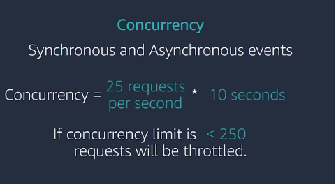

For data streams concurrency is measured by shards. There was a limit of one concurrent Lambda invocation per shard but now

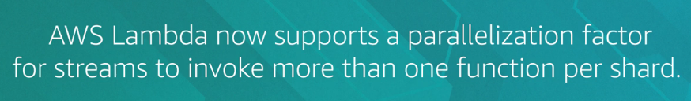

# Deploying Serverless Applications

## Introduction to serverless deployments

To make sure that your code is deployed successfully, you’ll need a couple things:

* **The first is the ability to audit changes during your deployment**. If you want to be alerted of any state change throughout your deployment, you can set up AWS CloudTrail to record events occurring throughout your system. When this state change occurs, you can react using automated actions, such as sending a notification to your operations team if a deployment failed. Additionally, each of your Lambda functions are automatically monitored on your behalf.
You can track the number of requests, the execution duration, and the number of requests that resulted in an error. These metrics can come in handy when troubleshooting and validating that your code is working as expected.

* **The second thing you’ll need for a successful deployment is the ability to halt or roll back any bad deployments.** If your new deployment fails or an alarm monitoring threshold is met, rolling back to a previous, more stable version of your code is an essential recovery strategy.

* **Deploying your changes through a planned and automated process is especially important with serverless workloads**. Automating how your deployment moves from the development environment all the way to the production environment can increase the likelihood of a successful deployment.
For example, it can improve your detection of anomalies, better automate your testing, halt your pipeline at a certain step, and even automatically roll back a change if a deployment were to fail or if an alarm threshold is triggered.
A successful deployment is a deployment that your customers don’t notice. Automation allows you to reduce human error and establish a planned, documented process that validates each of your changes before they are pushed into production.

## Serverfull vs serverless development

In a **serverfull** development environment, you might have an architecture that looks like the diagram below. The servers shown in the diagram could be Amazon EC2 instances, containers, or even on-premises servers that are all fronted by a load balancer. To deploy a new version of your application, you would need to update each of those servers with a copy of the latest application code.

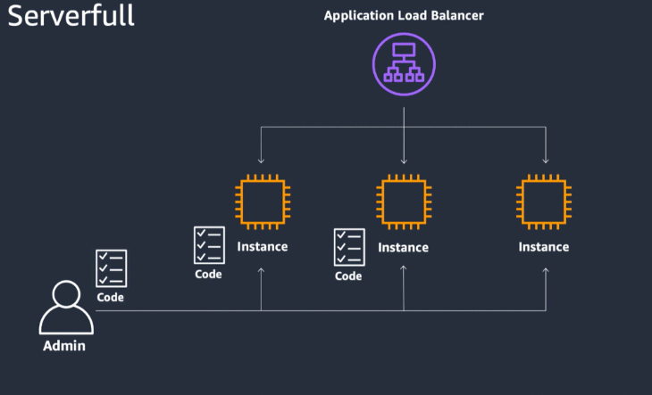

With serverless development, the term “deployment” can take on a whole new meaning. When developing serverless applications, you no longer deploy new application code to servers, because there are no servers.

Using infrastructure as code services, such as AWS CloudFormation, AWS Cloud Development Kit (AWS CDK), Terraform, and the Serverless Framework, developers are able to create AWS resources in an orderly and predictable fashion.

With AWS Lambda, a deployment can be as simple as an API call to create a function or update the function code.

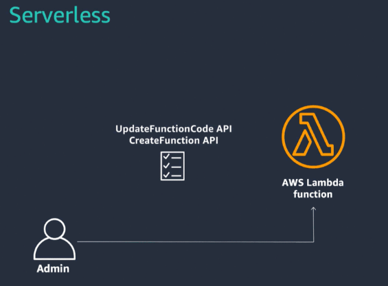

## AWS Serverless Application Model (SAM)

There are two key truths about serverless:

1. Developers need the ability to build and test their code locally, and
2. They need the ability to deploy their code into a sandbox. 

Both of these problems can be solved by using the **AWS Serverless Application Model**, otherwise known as AWS SAM. AWS SAM is made up of two main components: **SAM templates and the SAM Command Line Interface**, or CLI. 

AWS SAM is an open source framework you can use to build your serverless applications. It provides you with a shorthand syntax to express your functions, APIs, databases, and event source mappings.

During your deployments, SAM then transforms and expands the SAM syntax into an AWS CloudFormation syntax. CloudFormation can then provision your resources with reliable deployment capabilities, making the deployment of your serverless application simpler.

### SAM templates

AWS SAM templates are an extension of the AWS CloudFormation templates, with some additional components that make them easier for you to work with:

* Create AWS CloudFormation compatible templates using shorthand syntax.
* Use infrastructure as code to define your Lambda functions, API Gateway APIs, serverless application from the AWS Serverless Application Repository, and DynamoDB tables.
* If any errors are detected while deploying your template, AWS CloudFormation will roll back the template and delete any resources that were created, leaving your environment exactly as it was before the deployment.

#### Example of a SAM template

AWS SAM requires the use of the transform directive and a resource block with a corresponding type. The transform directive takes an entire template written in the AWS SAM syntax and transforms and expands it into a compliant AWS CloudFormation template. You can also optionally include any resource in a SAM template.

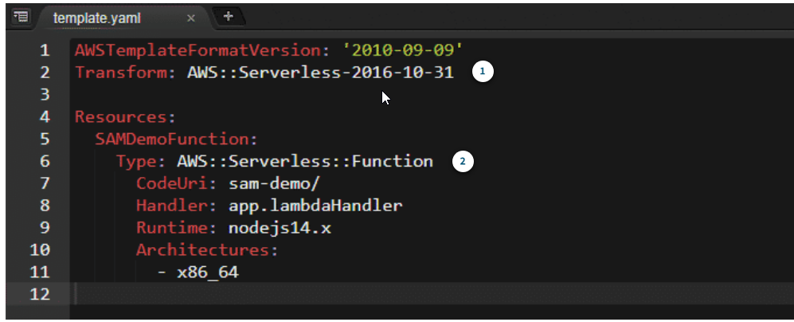

**1**: AWS CloudFormation can expand the SAM syntax with the transform directive. This helps AWS CloudFormation properly process the template and build out your serverless resources.
**2**: This section is where you dictate what ype of resource you would like to provision. AWS SAM also supports: `AWS::Serverless::Api`, `AWS::Serverless::Application`, `AWS::Serverless::Function`, `AWS::Serverless::LayerVersion`, `AWS::Serverless::SimpleTable`.

### Deploying SAM templates with the SAM CLI

This diagram summarizes the process of developing with AWS SAM. You begin by writing your Lambda function code and defining all of your serverless resources inside an AWS SAM template. **You can use the SAM CLI to emulate the Lambda environment and perform local tests on your Lambda functions.** After the code and templates are validated, you can then use the **SAM package command to create a deployment package, which is essentially a .zip file** that SAM stores in Amazon S3. After that, the SAM deploy command instructs AWS CloudFormation to deploy the .zip file to create resources inside of your AWS console.

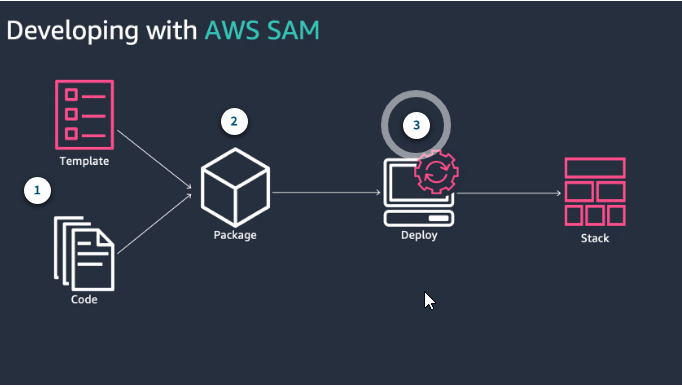

## Serverless Patterns Collection

The [Serverless Patterns Collection](https://serverlessland.com/patterns) is a repository of serverless examples that demonstrate integrating two or more AWS services using either AWS SAM or AWS CDK. These examples simplify the creation and configuration of the services referenced within the specific pattern.

The entire Serverless Patterns Collection is also available in GitHub so that you can clone it locally and build on it in your organization.

## Sharing configuration data in a serverless environment

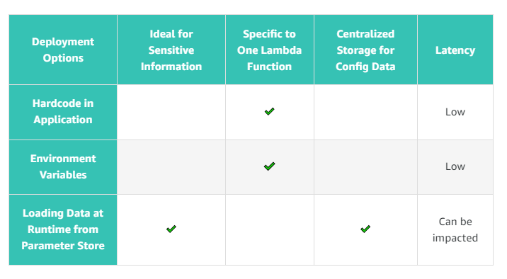

**As a best practice, never hardcode secrets or configurations into your deployment package, as you might accidentally expose that information.**

There are several ways to deploy your configuration data. You can hardcode this data in your application code, store it in environment variables, or load this data in at runtime from a storage system like AWS Systems Manager Parameter Store, AWS Secrets Manager, or AWS AppConfig. Hardcoding this data or using environment variables can keep latency low, but it isn't ideal for secrets or for sharing data across projects or other Lambda functions. When loading data in at runtime, you can store your data in a centralized storage system to keep sensitive information out of your code. However, this can incur additional latency.

### AWS Systems Manager Parameter Store 

AWS Systems Manager has an additional capability called Parameter Store that provides you with secure, hierarchical storage for configuration data management and secrets management. You can store data such as passwords, database strings, Amazon Machine Image (AMI) IDs, and license codes as parameter values.  In addition, Parameter Store includes the following:

* Free, fully managed, centralized storage system for configuration data and secret management.
* Data can be stored in plain text or also encrypted with AWS Key Management System (AWS KMS).
* Parameter Store tracks all parameter changes through versioning, so if you need to roll back your deployment, you can also choose to use an earlier version of your configuration data.

#### Parameter Store: Hierarchical key storage

Parameter Store provides hierarchical key-value storage. You can create a hierarchy for each of your environments (dev, stage, and prod), and then have the API keys that you need for each environment (it assumes that all envs are in the same AWS account).

Depending on the environment you’re in, you can pull the correct key without exposing your other keys.

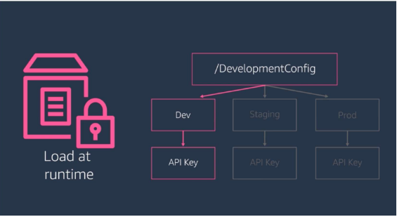

This diagram shows that you can access an API key in a development environment without exposing the staging or production API keys.

## Automating the Deployment Pipeline

### Lambda versioning and aliases

To understand deployment strategies, you first need to understand the concept of Lambda versions and Lambda aliases.

* Lambda versions

  When you create a Lambda function, there is only one version called $LATEST. Any time you publish a version, Lambda takes a snapshot copy of $LATEST to create the new version. This copy cannot be modified.
  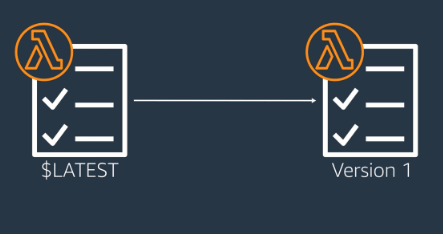

* Lambda aliases

  A Lambda alias is a pointer to a specific function version. By default, an alias points to a single Lambda version. When the alias is updated to point to a different function version, all incoming request traffic will be redirected to the updated Lambda function version.
  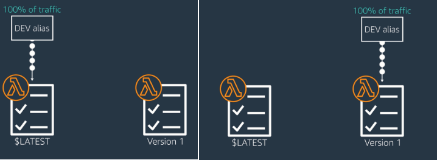


### Deployment strategies

With Lambda **traffic shifting**, you can send a small subset of traffic to your newest function version while keeping the majority of incoming production traffic to your old, stable version. Some of the following deployment strategies use traffic shifting. Traffic shifting helps you validate that your new Lambda version works as expected, before sending all production traffic to it.

* **All-at-once**
  All-at-once deployments instantly shift traffic from the original (old) Lambda function to the updated (new) Lambda function, all at one time. All-at-once deployments can be beneficial when the speed of your deployments matters. In this strategy, the new version of your code is released quickly, and all your users get to access it immediately.

* **Canary**
  In a canary deployment, you deploy your new version of your application code and shift a small percentage of production traffic to point to that new version. After you have validated that this version is safe and not causing errors, you direct all traffic to the new version of your code.
  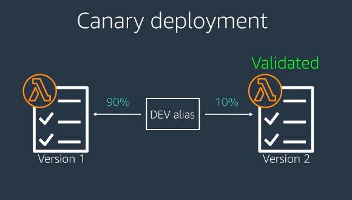

* **Linear**
  A linear deployment is similar to canary deployment. In this strategy, you direct a small amount of traffic to your new version of code at first. After a specified period of time, you automatically increment the amount of traffic that you send to the new version until you’re sending 100 percent of production traffic.
  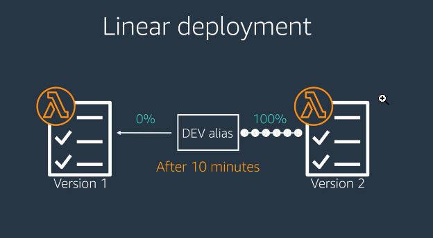

#### Comparing deployment strategies

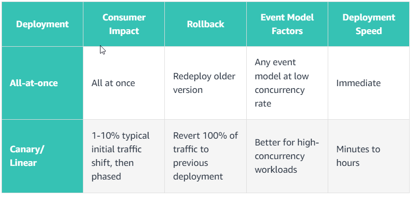

### Deployment preferences with AWS SAM

Traffic shifting with aliases is directly integrated into AWS SAM. If you’d like to use all-at-once, canary, or linear deployments with your Lambda functions, you can embed that directly into your AWS SAM templates. You can do this in the deployment preferences section of the template. AWS CodeDeploy uses the deployment preferences section to manage the function rollout as part of the AWS CloudFormation stack update. SAM has several pre-built deployment preferences you can use to deploy your code. See the following table for examples. 

* Canary10Percent30Minutes
* Canary10Percent5Minutes
* ...
* Linear10PercentEvery2Minutes
* Linear10PercentEvery3Minutes
* AllAtOnce

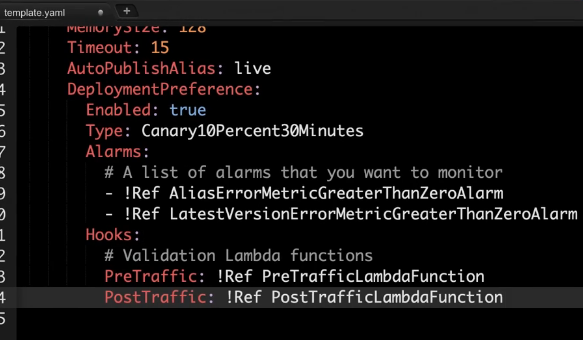

## Creating a deployment pipeline

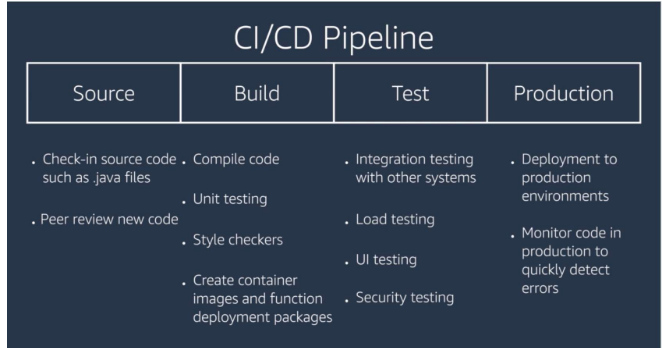
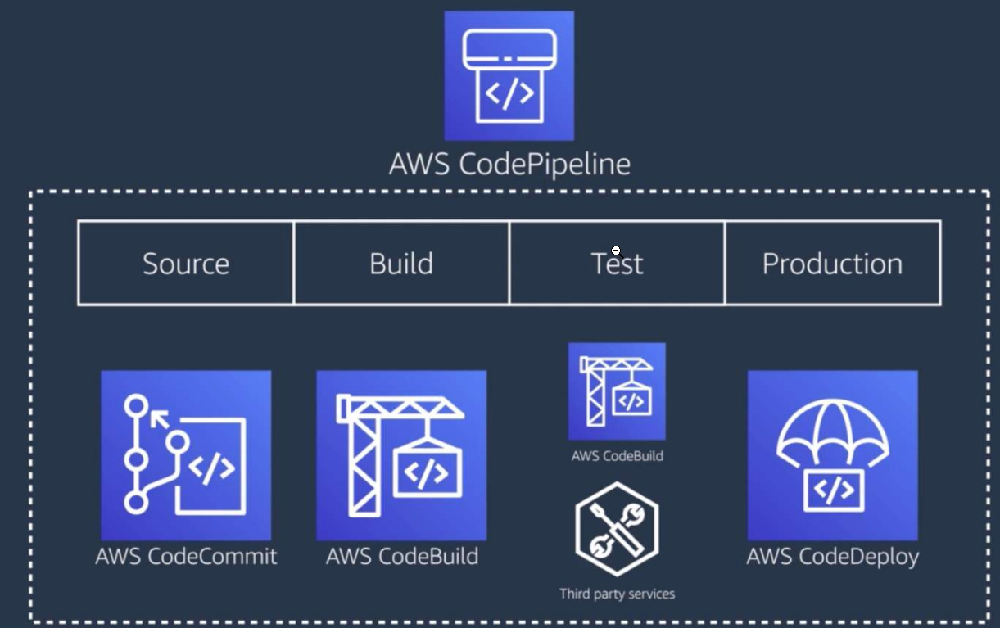

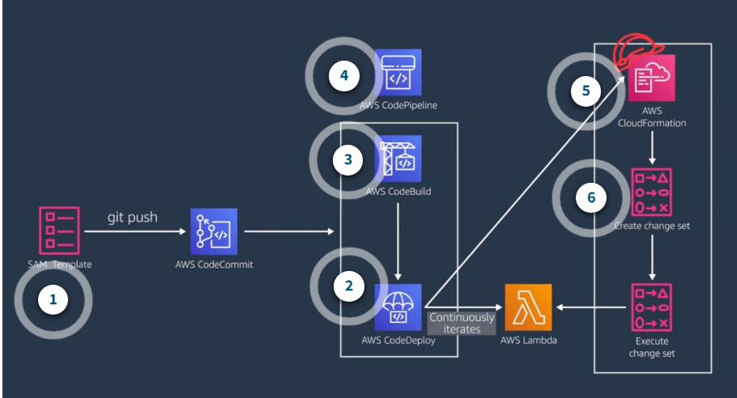

* **1**: inside your source code repository, you have a SAM template
* **4**: when a developer pushes a code to a user-defined branch in this repository, CodePipeline copies your source code into an S3 bucket and passes it to CodeBuild.
* **3**: CodeBuild gets the source code from the pipeline and tests, lints, runs security checks, install dependencies, and prepares the SAM template for deployment
* **2**: SAM kicks off CodeDeploy to manage the Lambda deployment configuration previously defined in the SAM template, whether that is all-at-once, canary or linear deployment. CodeDeploy also manages stack rollback based on of user-defined CloudWatch alarms.
* **5**: In the deployment phase, CodePipeline sends the SAM template outputted from build phase to AWS CloudFormation. AWS CloudFormation also assumes an IAM role that has the necessary permissions to provision the resources in the template.
* **6**: AWS CloudFormation is used to create or update an AWS CloudFormation stack.

## AWS SAM Pipelines

AWS SAM Pipelines is a feature of AWS SAM that automates the process of creating a continuous delivery pipeline. AWS SAM Pipelines provides templates for popular CI/CD systems, such as AWS CodePipeline, Jenkins, GitHub Actions, Bitbucket Pipelines, and GitLab CI/CD. Pipeline templates include AWS deployment best practices to help with multi-account and multi-region deployments. AWS environments such as dev and production typically exist in different AWS accounts. Development teams can configure safe deployment pipelines, without making unintended changes to infrastructure. You can also supply your own custom pipeline templates to help to standardize pipelines across development teams. 

AWS SAM Pipelines is composed of two commands:

* **sam pipeline bootstrap**, a configuration command that creates the AWS resources and permissions required to deploy application artifacts from your code repository into your AWS environments.
* **sam pipeline init**, an initialization command that generates a pipeline configuration file that your CI/CD system can use to deploy serverless applications using AWS SAM.

With two separate commands, you can manage the credentials for operators and developers separately. **Operators can use sam pipeline bootstrap** to provision AWS pipeline resources. This can reduce the risk of production errors and operational costs. **Developers can then focus on building** without having to set up the pipeline infrastructure by running the sam pipeline init command.

SAM Pipelines creates appropriate configuration files for your CI/CD provider of choice. For example, when using AWS CodePipeline, SAM will synthesize an AWS CloudFormation template file named **codepipeline.yaml**. This template defines multiple AWS resources that work together to deploy a serverless application automatically.

### Creating pipeline deployment resources

The **sam pipeline init --bootstrap** command guides you through a series of questions to help **produce the template file** that creates the AWS resources and permissions required to deploy application artifacts from your code repository into your AWS environments. The --bootstrap option helps you to set up AWS pipeline stage resources before the template file is initialized.

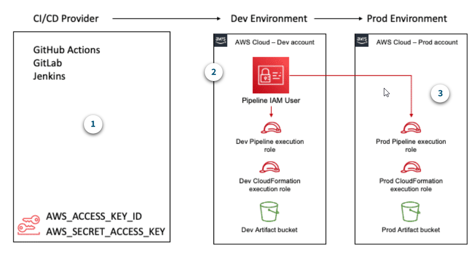

* **1**: AWS SAM Pipelines create a PipelineUser with an associated ACCESS_KEY_ID and SECRET_ACCESS_KEY to deploy artifacts to your AWS accounts.
* **2**: The pipeline IAM user, and pipeline and CloudFormation execution roles, are generated automatically, if not specified by the user. An S3 bucket is required to store application build artifacts during the deployment process, This is also generated automatically.
* **3**: The AWS SAM Pipeline command automatically detects that a second stage is required to complete the template and walks you through the setup process. The Prod environment uses the same Pipeline IAM user created in the dev environment.

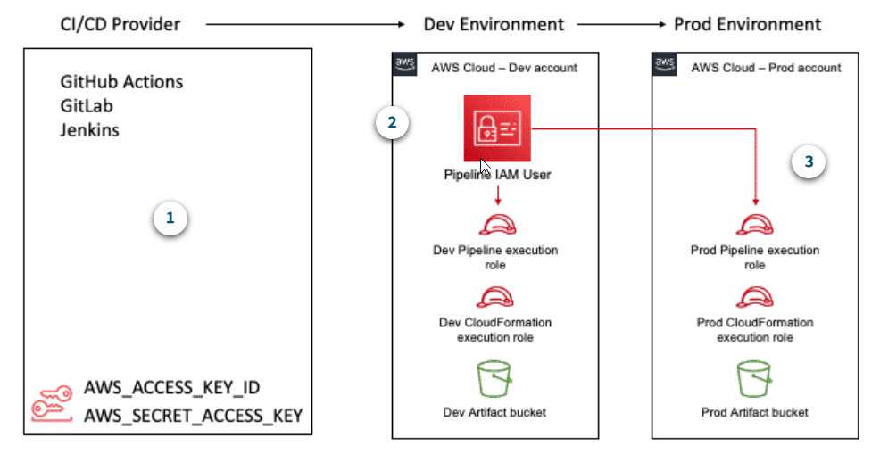

After AWS SAM has created the supporting resources, the guided walkthrough will prompt you to create the CloudFormation template that will define our entire CI/CD pipeline. To deploy the CI/CD pipeline template file, you use the **sam deploy** command.

### Deploy SAM templates with one command

You can use a single command, **sam deploy**, to deploy your serverless applications, and the SAM CLI will create and manage this S3 bucket for you. The following diagram is an example of the terminal output when the sam deploy command runs. 

https://docs.aws.amazon.com/serverless-application-model/latest/developerguide/serverless-sam-cli-config.html

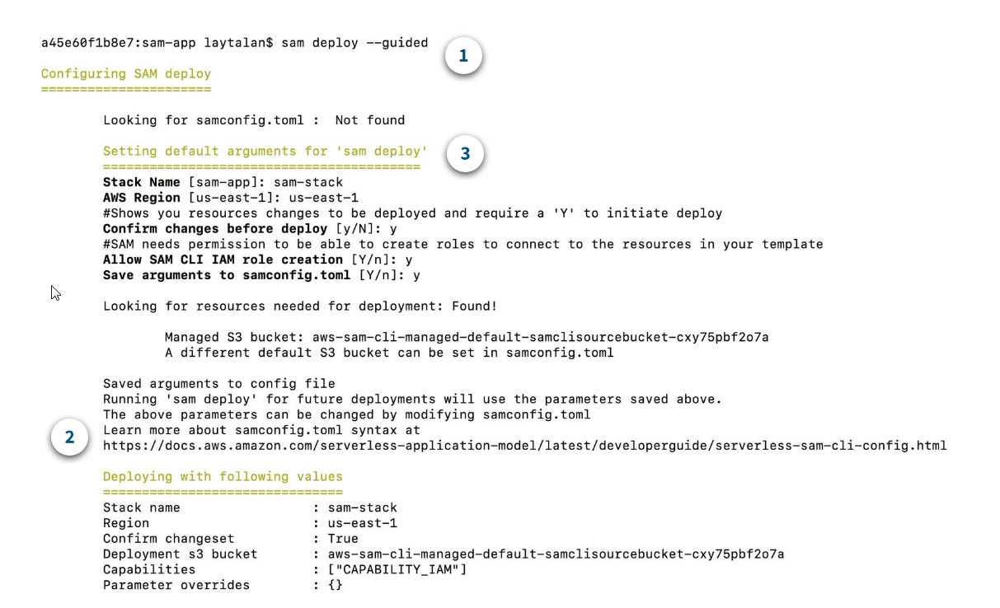

* **1**: **sam deploy --guided**, this mode walks you through the parameters required for deployment, provides default options, and saves your input for the given application.
* **3**: in this section, you can configure the name of your AWS CloudFormation stack, which Region you would like to deploy your stack, and more.
* **2**: **samconfig.toml**, the configurations you choose in the default arguments will be saved to the **samconfig.toml** file. You can change your configurations by modifying this file.

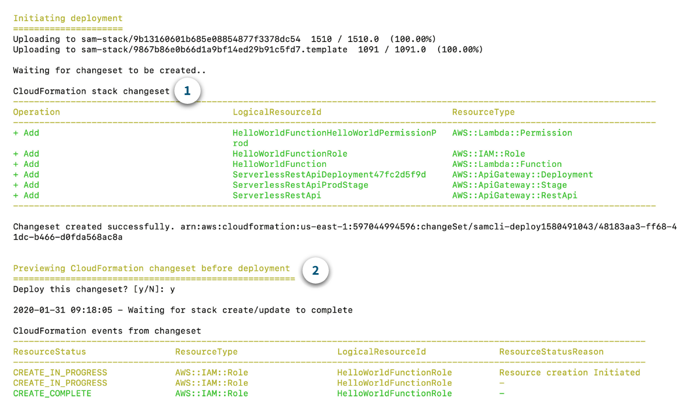

* **1**: CloudFormation stack changeset: in this section, you can preview the changes your template will make on existing resources when deployed. It will show which resources will be modified, deleted, and added.
* **2** after viewing the modifications in the changeset, you can choose whether or not you would like to continue to deploy the SAM template.

# Lambda monitors

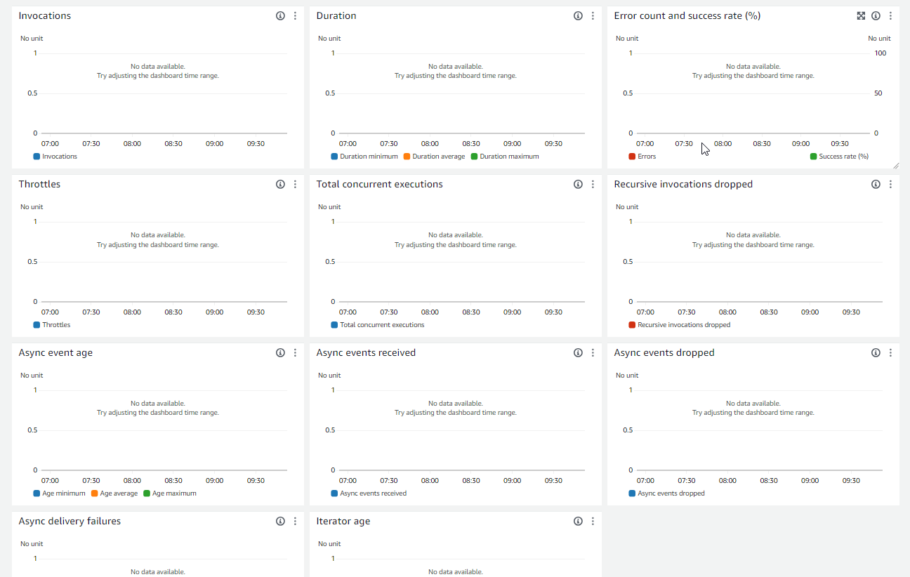

* **Throttles**: When all function instances are processing requests and no concurrency is available to scale up, Lambda rejects additional requests with a `TooManyRequestsException error`. Throttled requests and other invocation errors don't count as Invocations or Errors.
* **IteratorAge**: For stream event sources, the age of the last item in the batch when Lambda received it and invoked the function. The age is the amount of time between when a stream receives the record and when the event source mapping sends the event to the function.
* **Async delivery failures**: The number of times that Lambda attempted to write to a destination or dead-letter queue but fails. Dead-letter and delivery errors can occur due to permissions errors, misconfigured resources, or size limits.
* **Concurrent executions**: The number of function instances that are processing events. If this number reaches your concurrent executions quota for the Region or the reserved concurrency limit that you configured on the function, Lambda throttles additional invocation requests.


# Notes from AWS PartnerCast


* https://docs.aws.amazon.com/lambda/latest/dg/configuration-envvars.html