- [Introduction for Serverless](#introduction-for-serverless)
- [Integration with SQS](#integration-with-sqs)
- [Handling errors](#handling-errors)
  - [Synchronous events](#synchronous-events)
  - [Asynchronous events](#asynchronous-events)
  - [Error handling for stream-based events](#error-handling-for-stream-based-events)
  - [Failed-event destinations](#failed-event-destinations)
    - [Failed-event destinations vs dead-letter queue](#failed-event-destinations-vs-dead-letter-queue)
  - [Error handling with Amazon SQS as an event source](#error-handling-with-amazon-sqs-as-an-event-source)
- [Notes from AWS PartnerCast](#notes-from-aws-partnercast)

# Introduction for Serverless

* No Server Management
* Flexible Scaling
* **Automated HA and Fault Tolerance**
* No Idle Capacity

# Integration with SQS

The message is stored on the SQS queue durably. The Lambda service polls the Amazon SQS queue. If Lambda finds new messages, it invokes the Lambda function the queue is connected to, passing the message as a parameter and including the message ID for identifying the message.

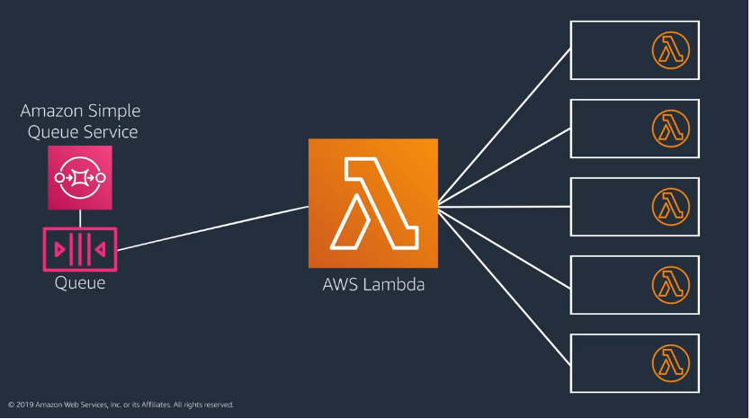

It’s important here to distinguish between the Lambda service and your individual Lambda functions.

* The Lambda service uses long polling to poll the SQS queue, waiting for messages to appear.
* The Lambda service reads messages in batches and invokes your Lambda **function once per batch**.

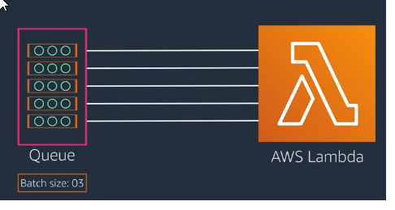

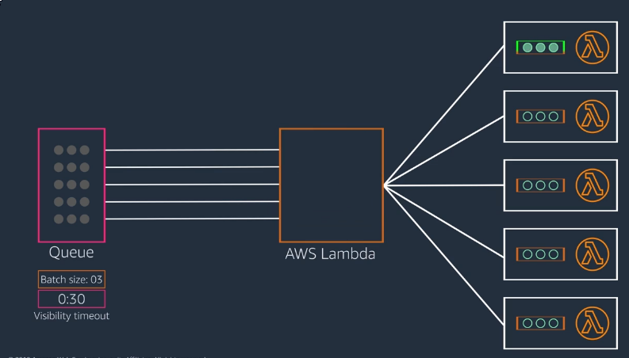

By default, Lambda reads up to five batches at a time and sends each batch to an invocation of your function. Each invocation of the Lambda function gets an event object that contains the messages in a batch.   
The messages in that batch become hidden to other consumers for the duration of the queue’s visibility timeout setting.   
**When your Lambda function successfully processes a batch, the Lambda service deletes that batch of messages from the queue. If your function returns an error or doesn’t respond, the messages in that batch become visible again.**   

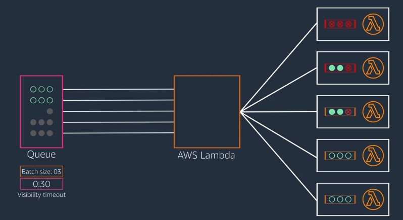

If any of the messages in the batch fail, all items in the batch become visible on the queue again. This means that some messages will be processed more than once. **You want to include code in your Lambda functions to handle this kind of partial failure.** Your Lambda function should delete each message from the queue after successfully processing it. That way if the batch fails, only the unsuccessful messages reappear in the queue.

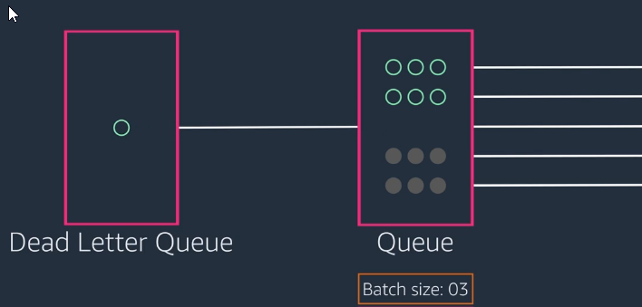

When a message continues to fail, send it to a dead-letter queue. A dead-letter queue is another SQS queue that you use to process failed messages. This is optional, but recommended.   
Make sure that you configure the dead-letter queue on the source queue versus configuring the dead-letter queue option on the Lambda function.

# Handling errors

When you invoke a function, two types of errors can occur:

* **Function errors**: You get a function error if Lambda successfully hands off an event to your function, but the function throws an error or times out before completing.
  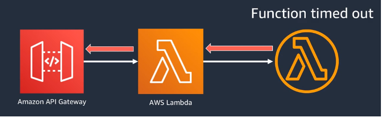

* **Invocation errors**: You get an invocation error if the request is rejected before your function receives it. For example, an oversized payload or lack of permissions will cause an invocation error. You also get an invocation error if the function is getting throttled.
  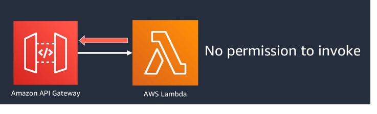

## Synchronous events

In a synchronous invocation, like between API Gateway and Lambda, no retries are built in. You have to write code to handle errors and retries for all error types.  

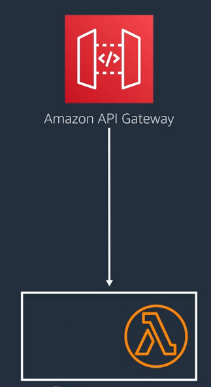

## Asynchronous events

With asynchronous event sources, like Amazon S3, **Lambda provides built-in retry behaviors**.   

When Lambda gets an asynchronous event, the lambda service returns a success to the event source and **puts the request in its own internal queue**. Then it sends invocation requests from its queue to your function.   
If the invocation request returns invocation errors, Lambda retries that **request two more times by default**. You can configure this retry value between 0 and 2.   

If the invocation request returns invocation errors, Lambda retries that invocation for **up to 6 hours**. You can decrease the default duration using the maximum age of event setting. 

To handle events that continue to fail beyond the retry or maximum age settings, you can configure a **dead-letter queue** on the Lambda function. Alternatively, you can set a **failed-event destination**.

## Error handling for stream-based events

Stream-based event sources (like Kinesis Data Streams or DynamoDB Streams) need to maintain **record order per shard**. So, by default, if an error occurs while Lambda is processing a batch of records, Lambda won’t process any new records from that shard until the batch succeeds or expires.You can use the Iterator-Age metric to detect blocked shards.  

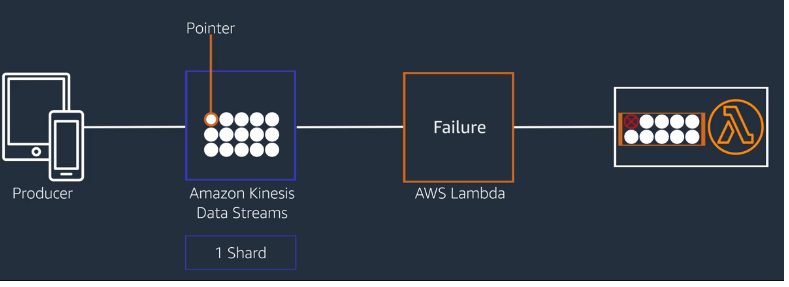

Prior to December 2019, if you wanted to bypass stream failures, you needed to write code into your function to return a success back to the stream after some number of attempts, and then write the error record to something like Amazon SQS queue or CloudWatch Logs for offline analysis. 

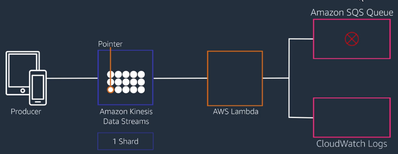

A better way to manage failures is to modify the default behaviors using four configuration options introduced in 2019:

* **Bisect batch on function error**: tells Lambda to split a failing batch into two and retry each batch separately.
* **Maximum retry attempts**: let you limit the number of retries on a failed batch.
* **Maximum record age**: let you limit the duration of retries on a failed batch.
* **On-failure destination**: lets you send failed records to an SNS topic or SQS queue to be handled offline without having to add additional logic into your function.

Here’s an illustration of how these options work together. In this example, **BisectOnFunctionError = True, MaximumRetryAttempts = 2**, and DestinationConfig includes an **OnFailure Destination** that points to an **SNS topic**.

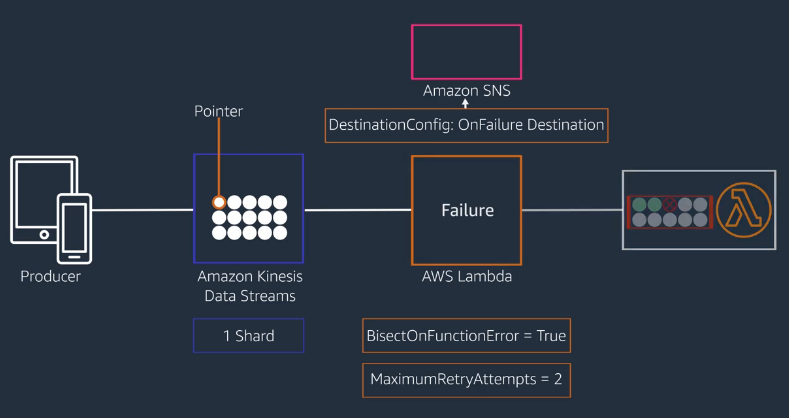

Assume you have a batch of 10 records, and the third record in this batch of 10 returns a function error. When the function returns an error, Lambda splits the batch into two, and then sends those to your function separately, still maintaining record order. Lambda also resets the retry and max age values whenever it splits a batch.

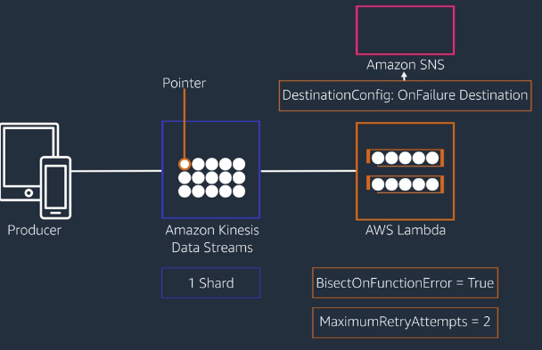

Now you’ve got two batches of five. Lambda sends the first batch of five and it fails. So the splitting process repeats. Lambda splits that failing batch yielding a batch of two and a batch of three records. Lambda resets the retry and max age values, and sends the first of those two batches for processing.

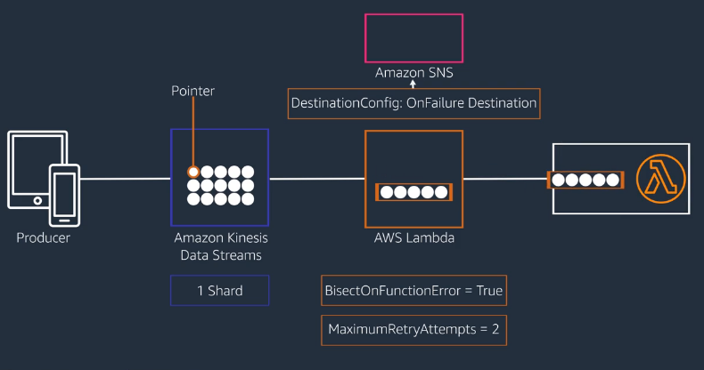
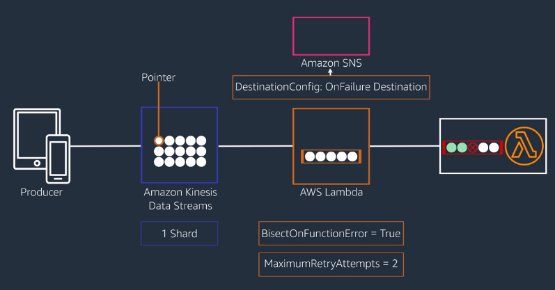

This time, the batch of two records processes successfully. So Lambda sends the batch of three to the function. That batch fails. Lambda splits it, and now it has a batch with one record (the bad one) and another with two records.

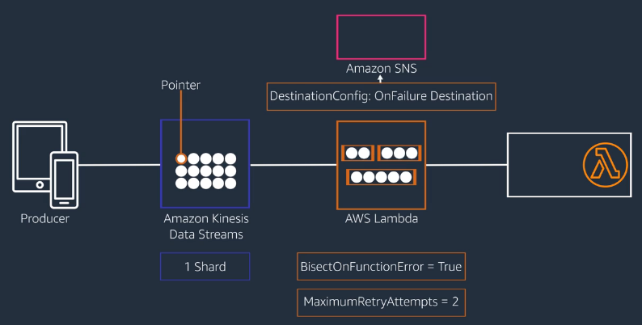
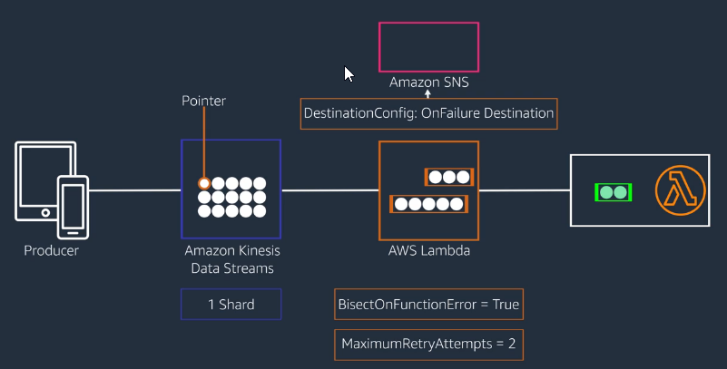

Lambda sends the batch with a bad record and it fails, but there’s nothing left to split.

So now the max retry and max age settings come into play. In this example, the function retries the record twice, and when it continues to fail, sends it to the SNS topic configured for the on-failure destination.   

With the erroring record out of the way, Lambda works its way back through each of the smaller batches it created, always maintaining record order.

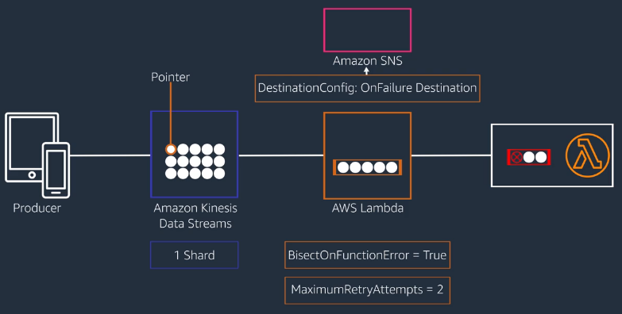
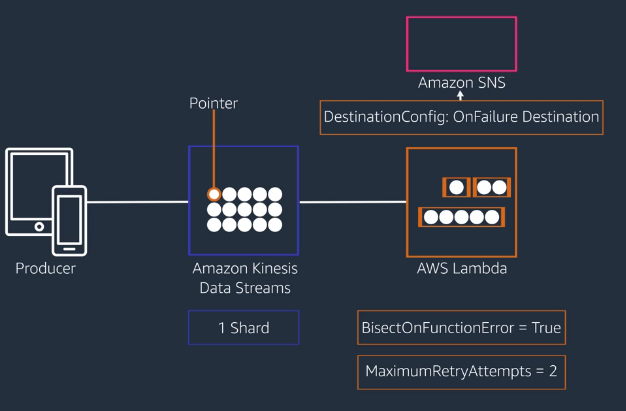
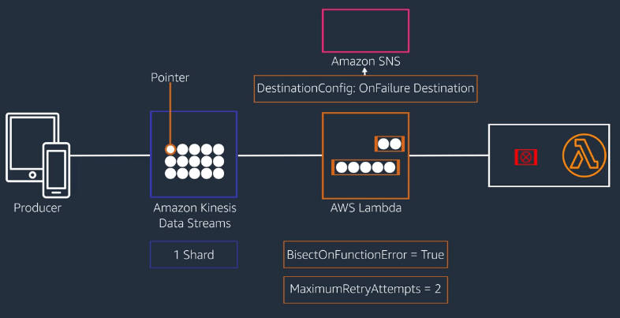
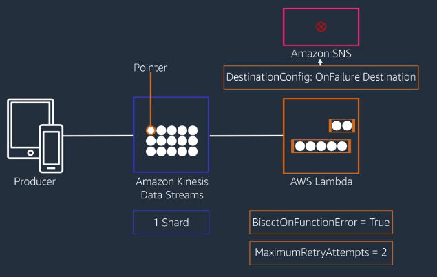

So Lambda is going to process the unprocessed batch of two, then the unprocessed batch of five. At that point, the original batch of 10 is marked as successful, and Lambda moves the pointer on the stream to the start of the next batch of records.

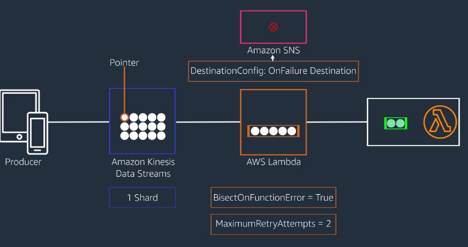
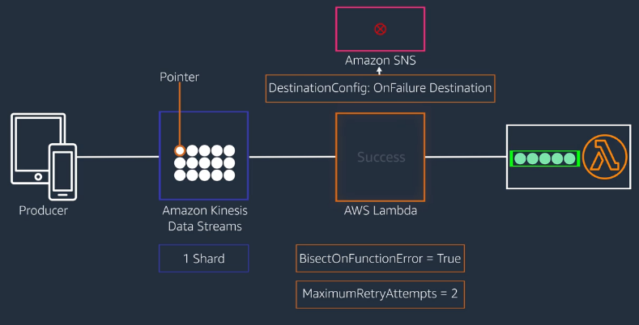
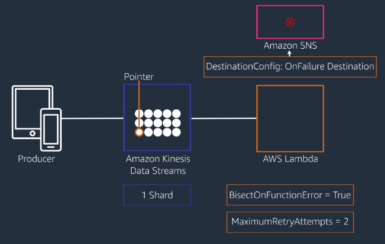

These options provide flexible error handling, but they also introduce **the potential for a record to be processed multiple times**. In the example, the first two records are processed before the function returns an error.

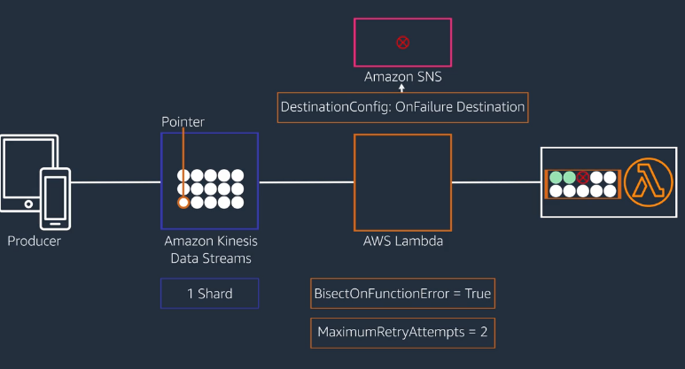

Then they’re processed a second time in the smaller batch of five records, which also fails, and then they are processed a third time in their own batch.

This means you have to handle idempotency in your function rather than assuming only-once record processing.

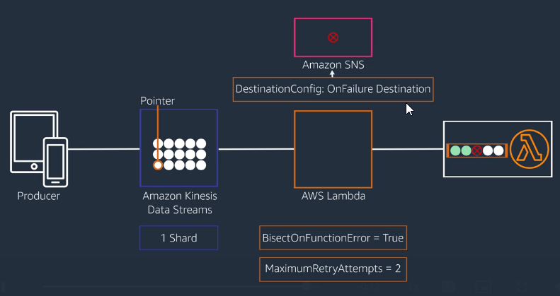
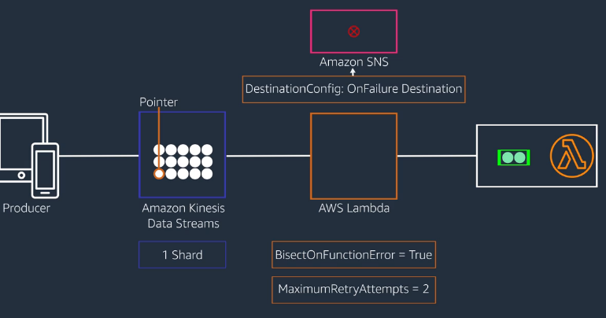

## Failed-event destinations

For both **asynchronous** and **streaming** event sources, you can specify an on-failure destination for a Lambda function.

For **asynchronous sources**, you have the option of an SNS topic, SQS queue, EventBridge event bus, or another Lambda function. 
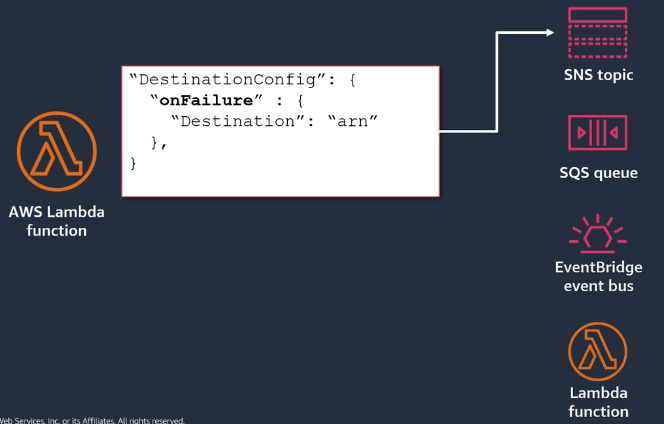

For **streaming event sources**, you can specify an SNS topic or an SQS queue.
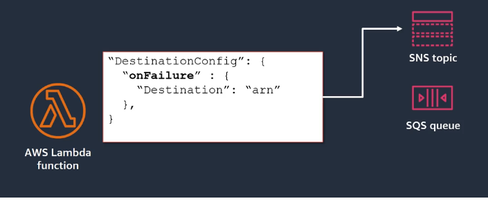

The SendOrder Step Functions task kicks off the SNS fulfillment topic, whose subscribers handle additional fulfillment requirements. Let’s say that one of the subscribers is a Lambda function that decides if the order qualifies for a promotional gift. If it does, the function initiates steps to send the gift from a third-party system.

To handle potential failures caused by the third-party system, set the function’s on-failure destination equal to the ARN of an SNS topic that notifies the team responsible for fulfillment.

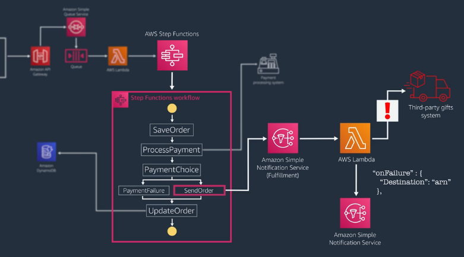

### Failed-event destinations vs dead-letter queue

There are a couple of advantages to using an on-failure destination rather than using a dead-letter queue.

* First, the invocation record that is sent to the on-failure destination contains more data than the event object available to a dead-letter queue.
* Second, it provides more flexibility to change or modify the failure behaviors. A dead-letter queue is part of a function’s version-specific configuration.  
* You can also set on-success destinations to route successfully processed events without modifying your Lambda function code.

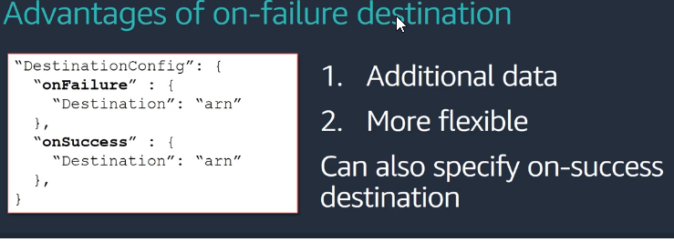

## Error handling with Amazon SQS as an event source

For polling event sources that aren’t stream based, for example Amazon SQS, if an invocation fails or times out, the message is available again when the visibility timeout period expires.

Lambda keeps retrying that message until it is either successful or the queue’s **Maxreceivecount** limit has been exceeded.   

As noted earlier, it’s a best practice to set up a dead-letter queue on the source queue to process the failed messages.   

When you’re building serverless applications, you need to execute performance tests, and adjust retries and timeouts to find the optimal combination that allows your processes to complete but doesn’t create bottlenecks that can cascade throughout the system.   

Let’s go back to the connection between an Amazon SQS queue and Lambda as an example of how you manage timeouts across services.

You can set a timeout on your Lambda functions, and you can set the visibility timeout on SQS queues.

You can also set the batch size for the queue from 1 to 10 messages per batch, which can impact both your function timeout and your visibility timeout configurations.

You choose your Lambda timeout to allow the function to complete successfully under most circumstances.

You also want to consider at what point to give up on individual invocation to avoid additional costs or prevent a bottleneck.

**A larger batch size can reduce polling costs and improve efficiency for fast workloads**. **But for longer running functions, you might need a lower batch size so that everything in the batch is processed before the function timeout expires.**

For example, a batch size of 10 would require fewer polling processes and fewer invocations than a batch size of 3.

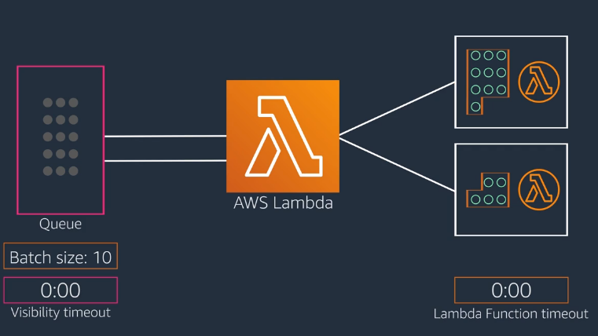

If your function typically can process a message in 2 seconds, then a batch size of 10 would typically process in 20 seconds, and you might use a function timeout of 30 seconds. But if your function takes 2 minutes to process each message, then it would take 20 minutes to process a batch of 10.

However, the maximum timeout for Lambda is 15 minutes, so that batch would fail without processing all of its messages, and any messages in that batch that weren’t deleted by your function would again be visible on the queue. Which brings us back to the visibility timeout setting on the queue.

You need to configure the visibility timeout to allow enough time for your Lambda function to complete a message batch. So if we stick with the example of a batch size of 10 and a Lambda function that takes 20 seconds to process the batch, you need a visibility timeout that is greater than 20 seconds.

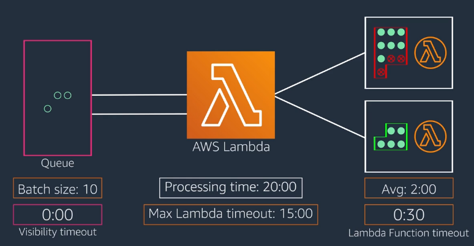

You also need to leave some buffer in the visibility timeout to account for Lambda invocation retries when the function is getting throttled. You don’t want your visibility timeout to expire before those messages can be processed. **The best practice is to set your visibility timeout to 6 times the timeout you configure for your function.**

# Notes from AWS PartnerCast

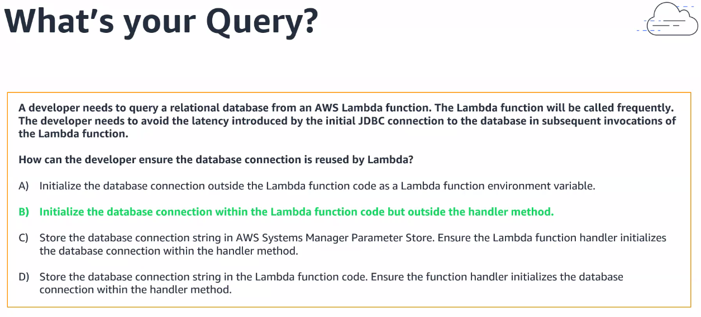

* https://docs.aws.amazon.com/lambda/latest/dg/configuration-envvars.html