- [VPC](#vpc)
- [Security Groups](#security-groups)
  - [Example 1: single security group](#example-1-single-security-group)
  - [Example 2: linked security groups](#example-2-linked-security-groups)
- [Routing table](#routing-table)
  - [Typical route table (public and private subnet)](#typical-route-table-public-and-private-subnet)
- [Network access control list](#network-access-control-list)
  - [Security Group vs ACL](#security-group-vs-acl)
- [Subnet](#subnet)
  - [Subnet reserved IP addresses](#subnet-reserved-ip-addresses)
- [Internet Gateway](#internet-gateway)
- [Virtual Private Gateway](#virtual-private-gateway)
- [VPC endpoints to connect with AWS public resources](#vpc-endpoints-to-connect-with-aws-public-resources)
  - [Services outside the VPC](#services-outside-the-vpc)
- [VPC Peering](#vpc-peering)
- [PrivateLink](#privatelink)
- [AWS Transit Gateway](#aws-transit-gateway)
- [Web Application Firewall (WAF)](#web-application-firewall-waf)
- [VPC Flow logs](#vpc-flow-logs)
  - [Create flow logs](#create-flow-logs)
  - [Read flow logs](#read-flow-logs)
- [Site to Site VPN \& Direct Connect](#site-to-site-vpn--direct-connect)
- [AWS Client VPN](#aws-client-vpn)
- [AWS Transient Gateway](#aws-transient-gateway)
- [Other AWS networking stuff](#other-aws-networking-stuff)
- [Create VPC with 2 public subnets](#create-vpc-with-2-public-subnets)
  - [Create EC2 instances that will be connected to created VPC](#create-ec2-instances-that-will-be-connected-to-created-vpc)
  - [Create and assign a public IP address to EC2 instance](#create-and-assign-a-public-ip-address-to-ec2-instance)
  - [Connect to the EC2 Instance via SSH](#connect-to-the-ec2-instance-via-ssh)
    - [Run PuTTYGent to convert pem file to ppk](#run-puttygent-to-convert-pem-file-to-ppk)
  - [Update EC2 instance and deploy the app](#update-ec2-instance-and-deploy-the-app)
    - [Update already installed components (in ssh console)](#update-already-installed-components-in-ssh-console)
    - [Install nodejs](#install-nodejs)
    - [Upload the app using WinSCP](#upload-the-app-using-winscp)
  - [Scaling EC2 instances](#scaling-ec2-instances)
    - [Creating dedicated AMI (image) for EC2 instance](#creating-dedicated-ami-image-for-ec2-instance)
    - [Create load balancer](#create-load-balancer)
    - [Enable instance stickiness on Load Balancer](#enable-instance-stickiness-on-load-balancer)
    - [Creating launch configuration for an auto-scaling group](#creating-launch-configuration-for-an-auto-scaling-group)
    - [Create autoscaling group using created launch configuration](#create-autoscaling-group-using-created-launch-configuration)
    - [Scaling in action](#scaling-in-action)
- [Review of default VPC and default subnets](#review-of-default-vpc-and-default-subnets)
  - [Selected subnets fields](#selected-subnets-fields)
- [Create VPC with public and private subnets](#create-vpc-with-public-and-private-subnets)
  - [Create VPC](#create-vpc)
  - [Create private subnet](#create-private-subnet)
  - [Create public subnet](#create-public-subnet)
  - [Create Internet Gateway](#create-internet-gateway)
  - [Create new route table for public subnet](#create-new-route-table-for-public-subnet)
  - [Enable auto-assign public IPv4](#enable-auto-assign-public-ipv4)
  - [Create EC2 instance in public subnet](#create-ec2-instance-in-public-subnet)
    - [Connect to the created EC2 via SSH to check IP addresses](#connect-to-the-created-ec2-via-ssh-to-check-ip-addresses)
  - [Assigned Elastic IP to ENI](#assigned-elastic-ip-to-eni)
  - [Create seconde EC2 instance in private network](#create-seconde-ec2-instance-in-private-network)
  - [Bastion host (jump box)](#bastion-host-jump-box)
    - [Create bastion host](#create-bastion-host)
    - [Connect with the bastion host](#connect-with-the-bastion-host)
    - [Connect to private EC2 instance from bastion host](#connect-to-private-ec2-instance-from-bastion-host)
  - [Create NAT gateway to allow traffic to/from private subnet](#create-nat-gateway-to-allow-traffic-tofrom-private-subnet)
    - [Create new route table for private subnet](#create-new-route-table-for-private-subnet)
    - [Check that there is no Internet traffic in private EC2](#check-that-there-is-no-internet-traffic-in-private-ec2)
    - [Change association for route table in private subnet](#change-association-for-route-table-in-private-subnet)
    - [Check that there is Internet traffic in private EC2](#check-that-there-is-internet-traffic-in-private-ec2)
  - [Create VPC Endpoint type of gateway for S3](#create-vpc-endpoint-type-of-gateway-for-s3)
    - [Using jump box confirm that private EC2 instance has access to S3](#using-jump-box-confirm-that-private-ec2-instance-has-access-to-s3)
    - [Remove NAT GW from route in private subnet](#remove-nat-gw-from-route-in-private-subnet)
    - [Create VPC endpoint](#create-vpc-endpoint)
    - [Test VPC endpoint for S3](#test-vpc-endpoint-for-s3)
    - [Remove VPC endpoint](#remove-vpc-endpoint)
    - [VPC endpoint pricing](#vpc-endpoint-pricing)
    - [VPC endpoint access control](#vpc-endpoint-access-control)
  - [VPC endpoint type of interface](#vpc-endpoint-type-of-interface)
    - [Create VPC endpoint type of interface](#create-vpc-endpoint-type-of-interface)
    - [Test connection to eu-north-1](#test-connection-to-eu-north-1)
- [Dual-Homed Instance](#dual-homed-instance)
- [Route 53/DNS](#route-53dns)
  - [Key DNS record types](#key-dns-record-types)
  - [Routing policies](#routing-policies)
  - [Route 53 Alias records](#route-53-alias-records)
  - [Example: domain registration, alias record and ELB integration](#example-domain-registration-alias-record-and-elb-integration)
    - [Register domain](#register-domain)
    - [Create 2 EC2 instances](#create-2-ec2-instances)
    - [Create NLB](#create-nlb)
    - [Add Route 53 alias record - simple routing](#add-route-53-alias-record---simple-routing)
    - [Add weighted routing](#add-weighted-routing)
    - [Add latency-based routing](#add-latency-based-routing)
    - [Add failover routing policy](#add-failover-routing-policy)
      - [Create health checks](#create-health-checks)
      - [Create DNS records for failover](#create-dns-records-for-failover)
    - [Add geolocation routing policy](#add-geolocation-routing-policy)
- [resources](#resources)


# VPC
* is a logical data center
* local to a single region
* a vpc can span multiple AZ`s
* good for separating public and private resources
* you can create a hardware VPN between your data center  and your VPC
* can have only one Internet Gateway (IGW is completely managed AWS including HA and scaling)

# Security Groups

A security group defines a collection of IPs that are allowed to connect to your instance and IPs that instance is allowed to connect to. **Security groups are attached at the instance level (EC2) to interfaces (ENI) and can be shared among many instances**. You can even set security group rules to allow access from other security groups instead of by IP. **Security groups are stateful firewalls (it has persistency and can remember traffic from the past)**.


You cannot use individual IP address value: 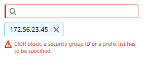   

You can do a trick and specify individual IP address using CIDR block, for example: 193.27.211.171/32
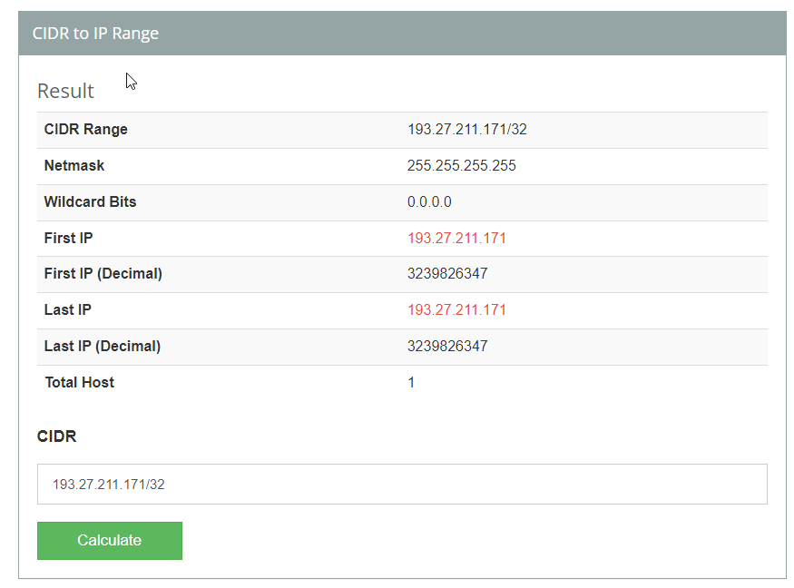   

**Also in ACL you cannot use individual IP address without using CIDR block.**

For example security group can be defined in EC2 wizard as one of its steps:
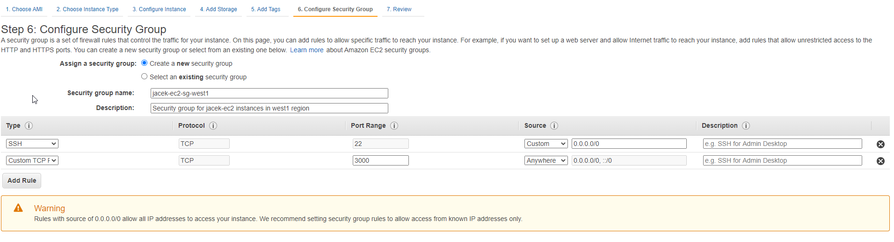

* **Outbound traffic is allowed by default** - when incoming connection (request) is allowed then by default response is also allowed. Using other worlds: return traffic is allowed by default (if incoming traffic is allowed).
Also when connection is established by for example EC2 instance then by default this outgoing traffic is allowed.

* **Inbound traffic is implicitly denied** - if there is no rule then the incoming traffic is denied.

* Sample screens

  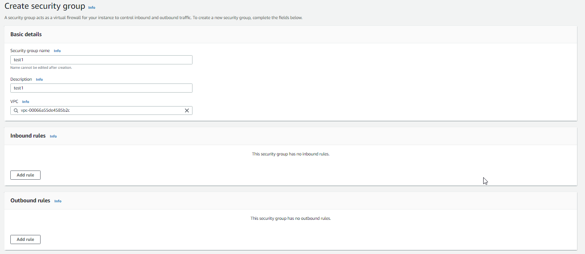
  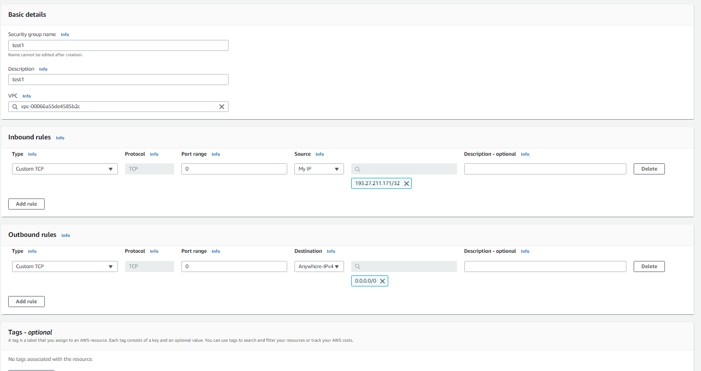

* Only **allow rules** are supported!

* By default security group is assigned to eth0.

* Order of rules is not relevant because there are only ALLOW rules.
  
* It is possible to have empty list of rules and then all traffic is blocked

## Example 1: single security group

The following security group allows incoming traffic to SQL Server from subnet 10.1.1.0/24 and automatically allows responses for this traffic.   
All outgoing traffic is allowed.

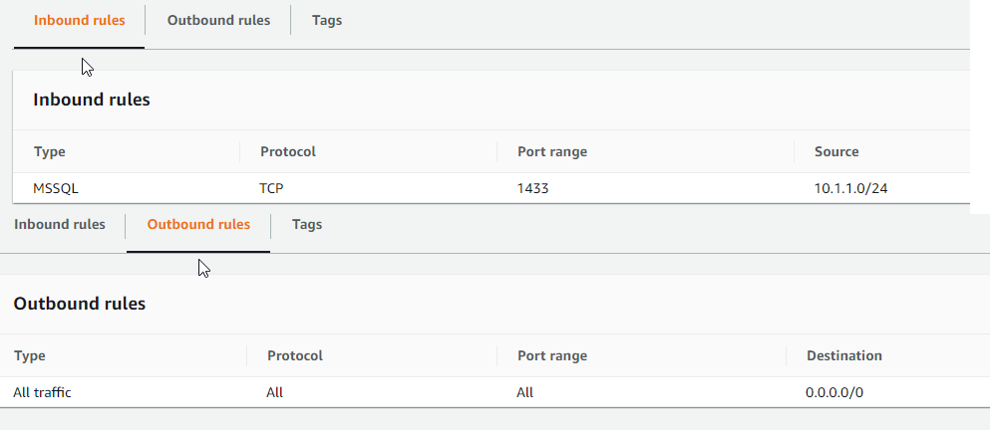

## Example 2: linked security groups

One security group can reference another security group. Thx to this we can say that incoming traffic to database server is allowed only if it comes from web server.

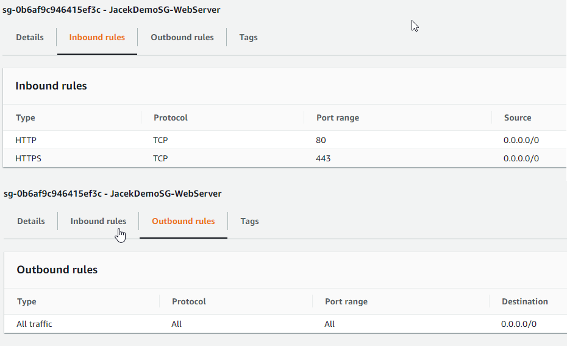

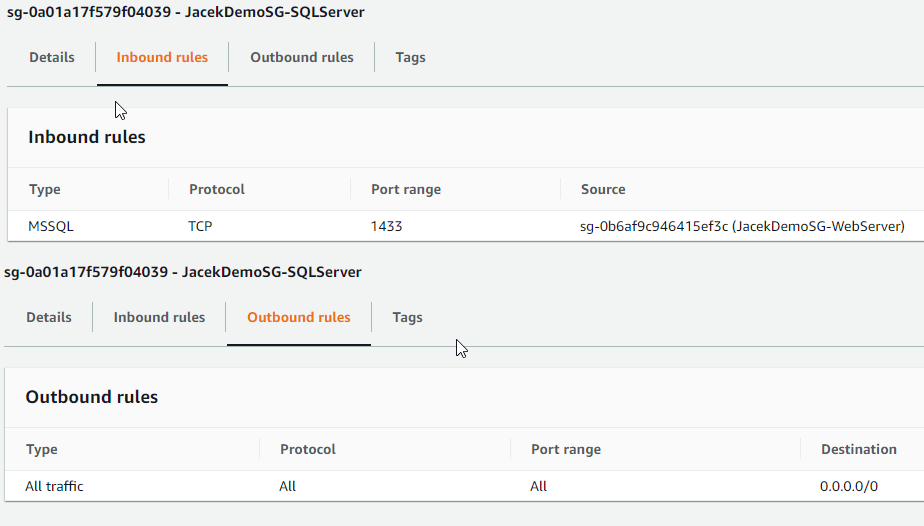

# Routing table

Each VPC has one **routing table**, which declares attempted destination IPs and where they should be routed to. For instance, if you want to run all outgoing traffic through a proxy, you can set a routing table rule to automatically send traffic to that IP. This can be a powerful tool for security as you can inspect outgoing traffic and only whitelist safe destinations for traffic.   

Router exist across availability zones and there is no single point of hardware failure that would take this router down.

https://docs.aws.amazon.com/vpc/latest/userguide/VPC_Route_Tables.html

**Route tables can be assigned also to subnets.**

## Typical route table (public and private subnet)

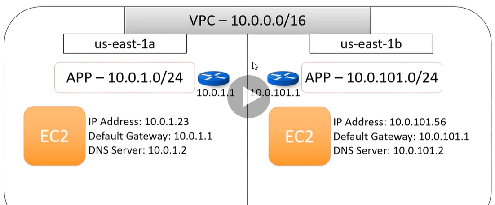

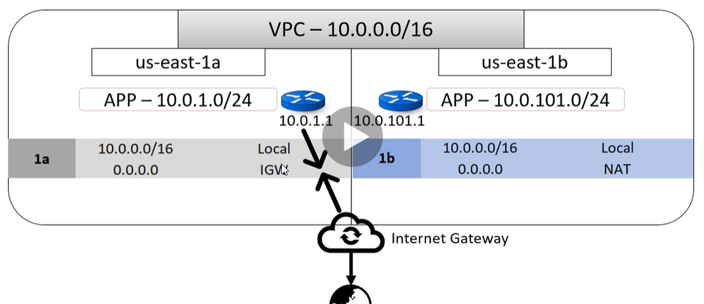

# Network access control list

Another tool the VPCs use for networking control is the **network access control list**. Each VPC has one access control list, and this acts as an IP filtering table saying which IPs are allowed through the VPC for both incoming and outgoing traffic. Access control lists are kind of like super-powered security groups that apply rules for the entire VPC. **ACL is stateless firewall** - it means that return traffic must be explicitly allowed by rules.

**In ACL you cannot use individual IP address without using CIDR block.**

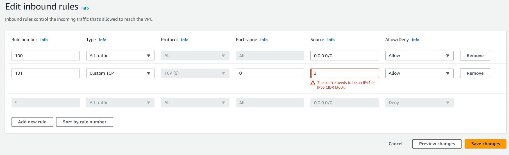

**ACL can be assigned to VPC and subnet.** It is not possible to assign ACL to EC2 instance or ENI (Security Groups can be assigned to EC2 instance or ENI).

**For incoming traffic first is always checked ACL and next Security Group rules.** 

When new ACL is created then by default it has rules that DENY all traffic. It is not possible to delete these rules!

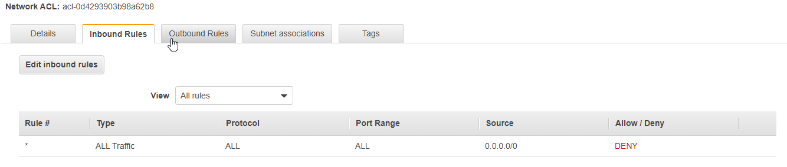
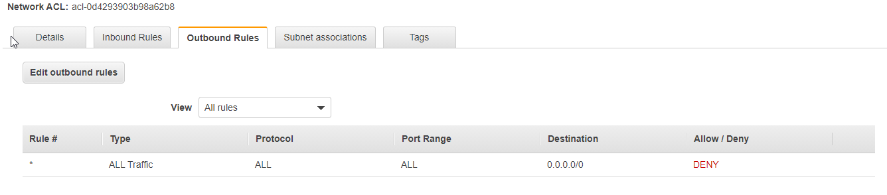

Rules are executed from the lowest number to the highest number and at then end *.
This allows supporting scenarios when HTTPS traffic from specific IPs is forbidden but all other incoming HTTPS traffic is allowed - first deny stops checking further rules. 

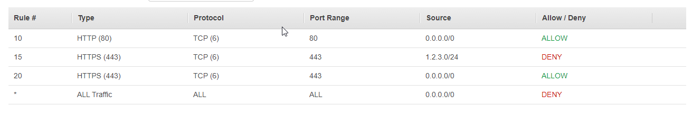

**By default, your account’s default network ACL allows all inbound and outbound traffic, but you can modify it by adding your own rules.**

[Security Group vs ACL](https://docs.aws.amazon.com/vpc/latest/userguide/VPC_Security.html)

## Security Group vs ACL

With security groups, everything is blocked by default so you can only use allow rules. Whereas with network ACLs, everything is allowed by default but you can use both allow and deny rules.

# Subnet

A VPC defines a private, logically isolated area for instances, but a **subnet** is where things really get interesting. Instances cannot be launched into just a VPC. They must also be launched into a subnet that is inside a VPC. A subnet is an additional isolated area that has its own CIDR block, routing table, and access control list. Subnets enable you to create different behavior in the same VPC. For instance, creating a public subnet that can be accessed and have access to the public internet and a private subnet that is not accessible from the internet and must go through a NAT gateway to access the outside world. With subnets, you can achieve very secure infrastructure for your instances.


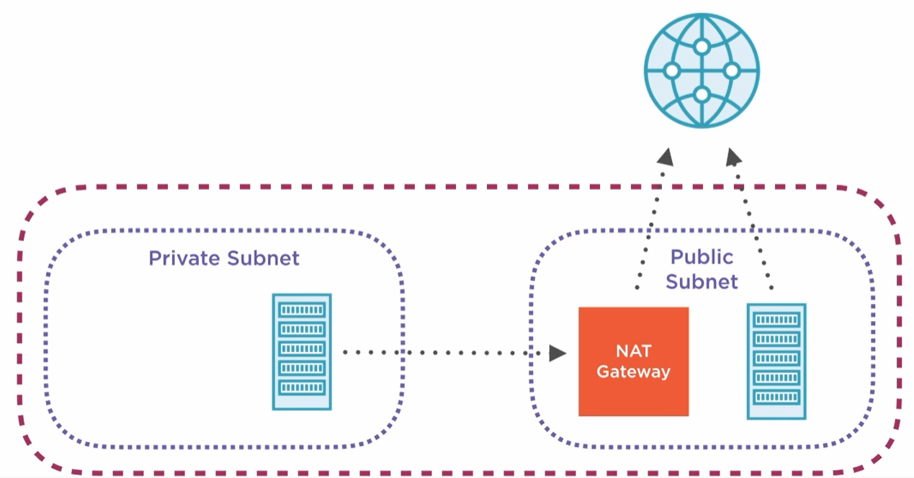

## Subnet reserved IP addresses

For example for CIDR 10.0.0.0/22:
* 10.0.0.0 is network address
* 10.0.0.1 is VPC local router
* 10.0.0.2 is DNS server
* 10.0.0.3 is future use by AWS
* 10.0.2.255 is network broadcast address

# Internet Gateway

An Internet gateway is attached to a VPC and allows inbound traffic from the internet to access the VPC. It is also used as a target in route tables for outbound internet traffic.

**External IP is not visible from level of EC2 instance!** It sees only 10.0.1.23 address.   
**Internet GW is performing source NAT and destination NAT**.   

IGW is automatically HA, it is managed by AWS.

If it will receive package with source 10.0.1.23 and destination 8.8.8.8 it will replace 10.0.1.23 by public IP 59.54.23.52. Similar when it will receive incoming packet from Internet it will replace address 59.54.23.52 by 10.0.1.23.

Source nat:

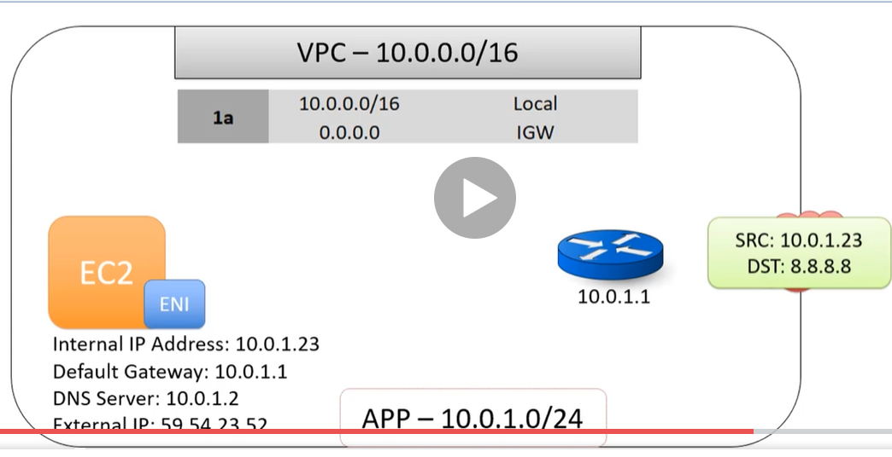

Destination nat:

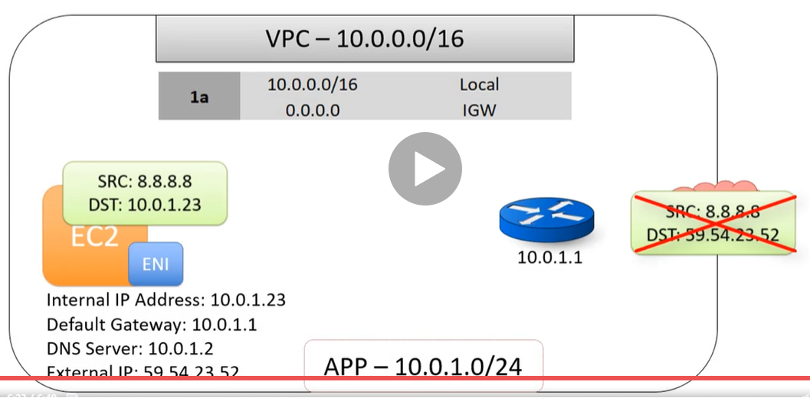

# Virtual Private Gateway

A virtual private gateway is the VPN endpoint on the Amazon side of your Site-to-Site VPN connection that can be attached to a single VPC. **It uses public Internet.**

From on-prem to cloud:
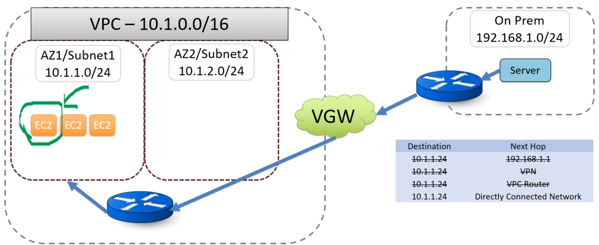   

From cloud to on-prem:
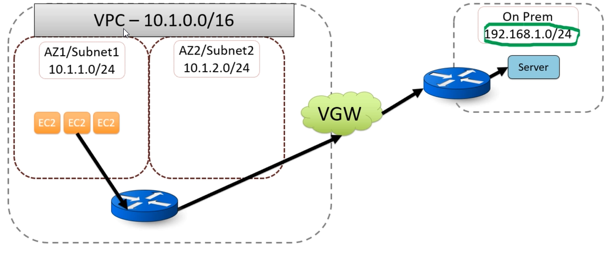

Route propagation can be used to automatically add routes from the VWG to route tables:
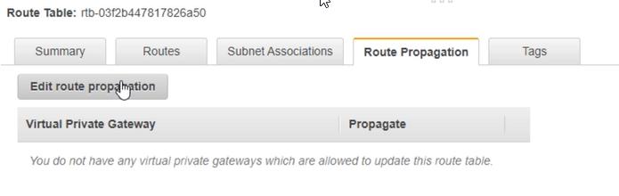

# VPC endpoints to connect with AWS public resources

**A VPC endpoint enables you to privately connect your VPC to supported AWS services **and VPC endpoint services powered by AWS PrivateLink without requiring an internet gateway, NAT device, VPN connection, or AWS Direct Connect connection. Instances in your VPC do not require public IP addresses to communicate with resources in the service. Traffic between your VPC and the other service does not leave the Amazon network.

There are two types of VPC endpoints: 
* **interface endpoints**: an interface endpoint is an elastic network interface (ENI) with a private IP address from the IP address range of your subnet that serves as an entry point for traffic destined to a supported service. Interface endpoints are powered by AWS PrivateLink, a technology that enables you to privately access services by using private IP addresses.

* **gateway endpoints**: a gateway endpoint is a gateway that you specify as a target for a route in your route table for traffic destined to a supported AWS service. **Only S3 and DynamoDB support gateway endpoints**, all other services that support VPC Endpoints use a VPC Endpoint Interface.

* local to a region
* bound to a single VPC
* multiple endpoints are supported based on route tables
* not usable over a VPC peer or VPN connection
* DNS resolution is required in a VPC to resolve the public address to a private VPC endpoint address  

## Services outside the VPC

Not secure approach (S3 and dynamoDB available from Internet).
>NOTE: in some cases we want make available S3 and dynamoDB from Internet  
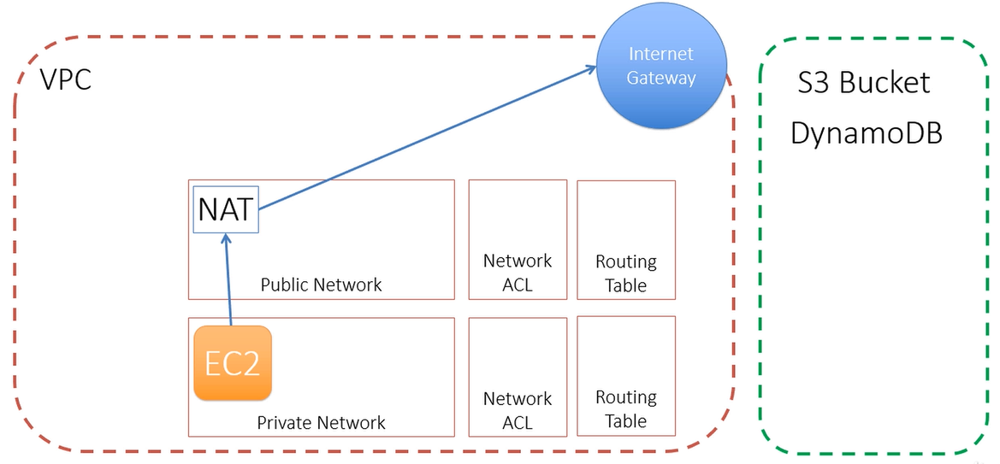

More secure approach:
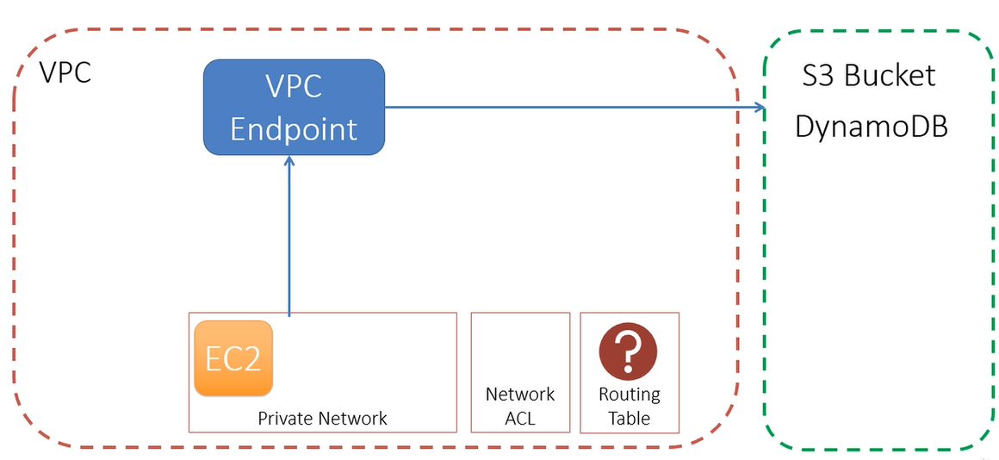

# VPC Peering

* Connect two VPC, privately using AWS network
* Make them behave as if they were in the same network
* Must not have overlapping CIDR
* VPC Peering connection is not transitive - must be established for each VPC then need to communicate with one another

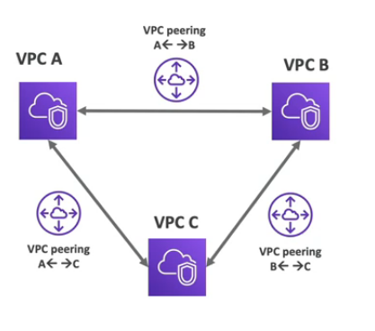

# PrivateLink

AWS PrivateLink provides private connectivity between VPCs and services hosted on AWS or on-premises, securely on the Amazon network. 
*If services are hosted by AWS they have to be in the same region!* However:
https://aws.amazon.com/about-aws/whats-new/2018/10/aws-privatelink-now-supports-access-over-inter-region-vpc-peering/
To connect with services from other regions you have to use **Inter-Region VPC Peering**.

It is most secure & scalable way to expose a service to 1000s of VPCs.

It works very well when in one AWS account we have load balancer that will be reached by many clients that for example can be in different AWS accounts and have overlapping VPCs - that`s why using VPC peering is not good idea in such case and it is better to use PrivateLink.

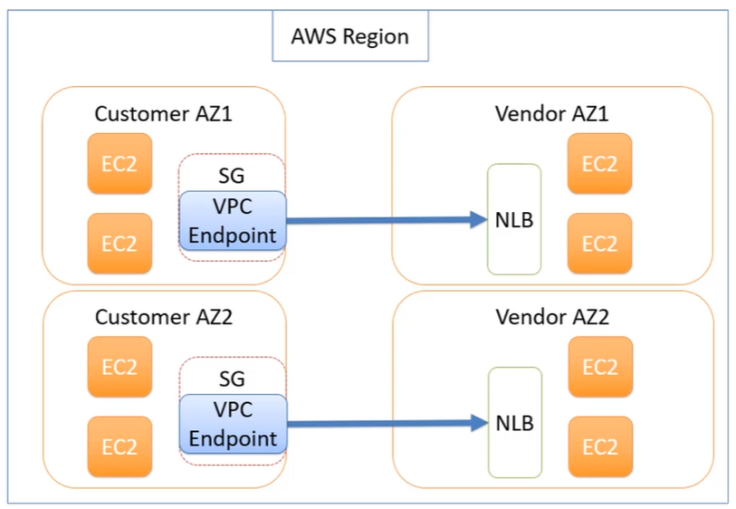

* Step one is create **endpoint service** that connects this service with selected load balancer.

* Second step is to create endpoint that will connect with this service. This endpoint will have own private IP address that`s why later EC2 instances can access the load balancer by providing this IP address. This endpoint has to be created in every client subnet that wants connect with the load balancer.

# AWS Transit Gateway

https://aws.amazon.com/transit-gateway/

AWS Transit Gateway connects your Amazon Virtual Private Clouds (VPCs) and on-premises networks through a central hub. This simplifies your network and puts an end to complex peering relationships. It acts as a cloud router – each new connection is only made once.

As you expand globally, inter-Region **(it can connect VPCs from different regions)** peering connects AWS Transit Gateways together using the AWS global network. Your data is automatically encrypted and never travels over the public internet.

# Web Application Firewall (WAF)

WAFs are available in AWS marketplace. It can ve deployed on Cloudfront or an Application Load Balancer (ALB).

# VPC Flow logs

* collect network traffic information in your AWS env.
* data is stored in a CloudWatch log
* can be created for a VPC, subnet or EC2 instance/ENI
* view accepted, rejected, or all traffic
* logs are published every 10 mins or 1 minute

It is good practice to create IAM role that will be responsible for creating flow logs.

More [here](https://docs.aws.amazon.com/vpc/latest/userguide/flow-logs.html).

## Create flow logs

Create log group:
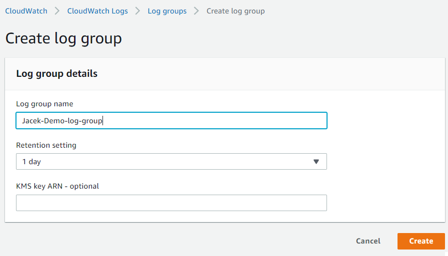

Create flow logs:
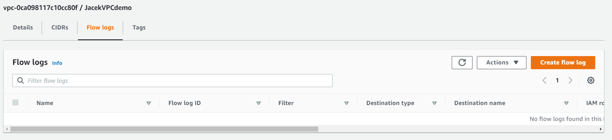

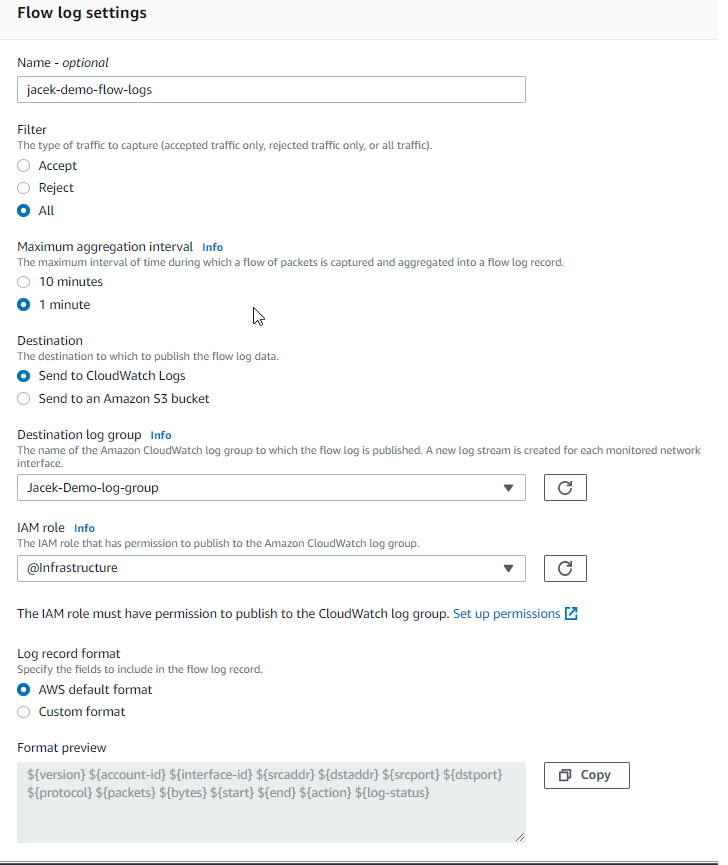

## Read flow logs

First generate some network traffic. Next wait ~10mins/~1min and navigate to log group that contains the logs.

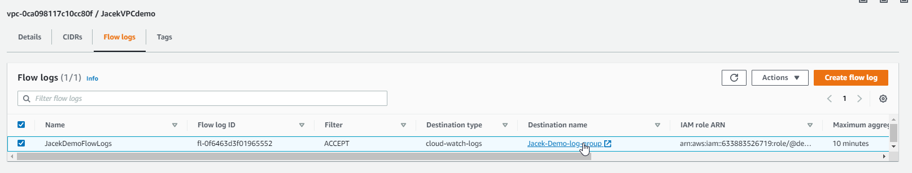

# Site to Site VPN & Direct Connect

* Site to Site VPN (Virtual Private Gateway)
  * Connect an on-premises VPN to AWS
  * The connection is automatically encrypted
  * **Goes over the public Internet**
  * On-premises: must use a Customer Gateway (CGW)
  * AWS: must use a Virtual Private Gateway (VGW)
  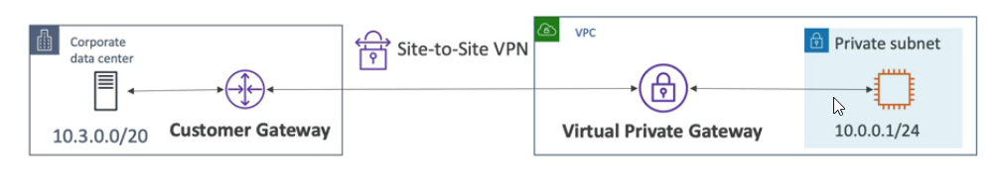

* Direct Connect (DX)
  * Establish a physical connection between on-premises and AWS
  * The connection is private, secure and fast
  * Goes over a private network
  * Takes at least month to establish
  * Is more expensive


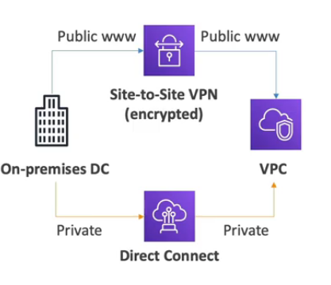

# AWS Client VPN

* Connect from your computer using OpenVPN to your private network in AWS and on-premises
* Allow you to connect to your EC2 instances over a private IP (just as if you were in the private VPC network)
* Goes over public Internet
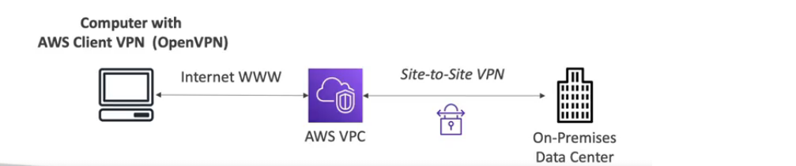

# AWS Transient Gateway

* For having transitive peering between thousands of VPCs and on-premises, hub-and-spoke (start) connection
* One single gateway to provide this functionality
* Works with DirectConnect Gateway, VPN connections

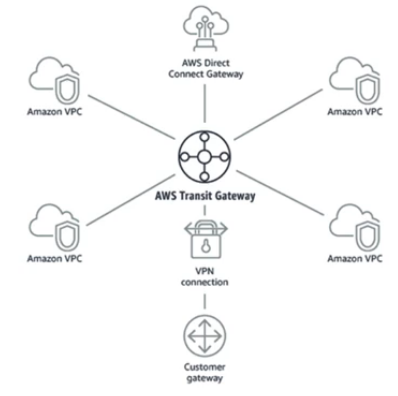

# Other AWS networking stuff

https://aws.amazon.com/marketplace/pp/Cloud-Infrastructure-Services-Squid-Proxy-Cache-Se/B084H16546   

https://aws.amazon.com/blogs/networking-and-content-delivery/securing-egress-using-ids-ips-leveraging-transit-gateway/   

https://aws.amazon.com/marketplace/pp/Deep-Packet-Inspection-and-Processing-Market/prodview-jus56ki4exp6q   

# Create VPC with 2 public subnets

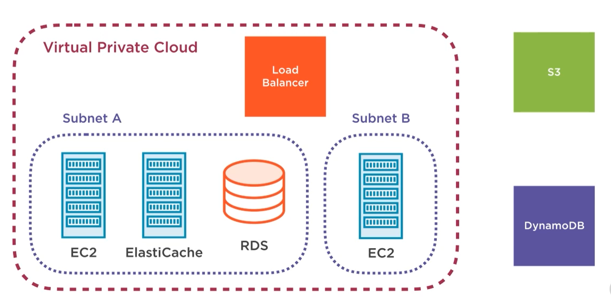

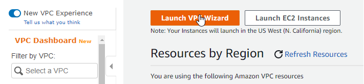

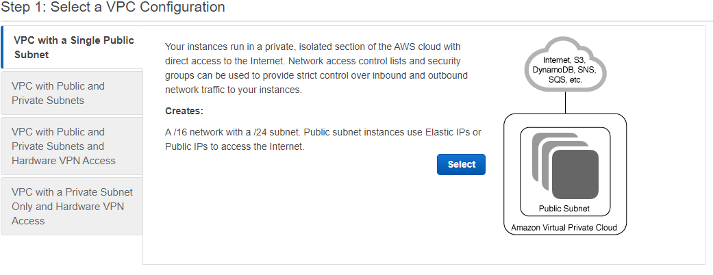

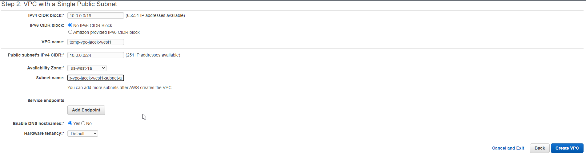

Update routing table to make possible to connect with Internet EC2 instances from this subnet.

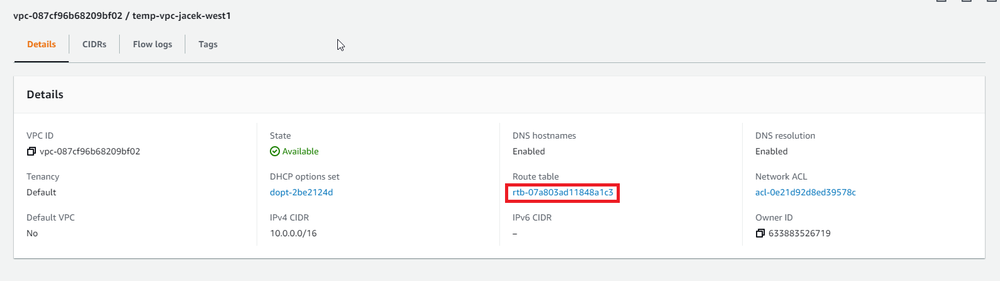

By default there is only one route that says that any IP address referencing our local VPC CIDR block should resolve locally.

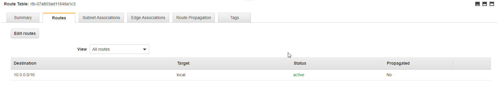

0.0.0.0/0 means anywhere.

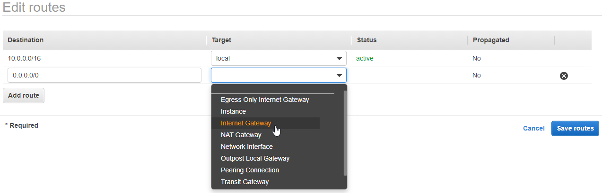

Select pre-created internet gateway for your VPC. It will allow outgoing traffic to reach the outside world.
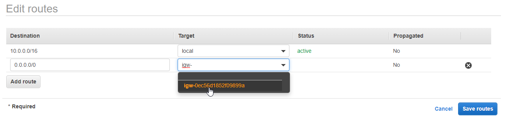

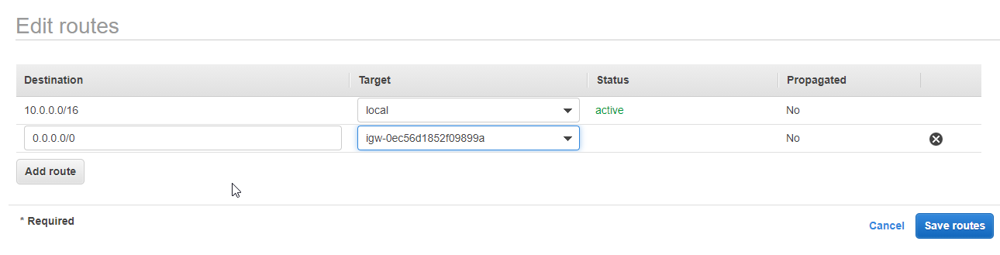

Create second subnet in second AZ - **single subnet can exist only in one AZ**. Use different CIDR to avoid collisions with already created subnet.

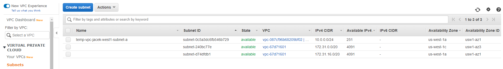

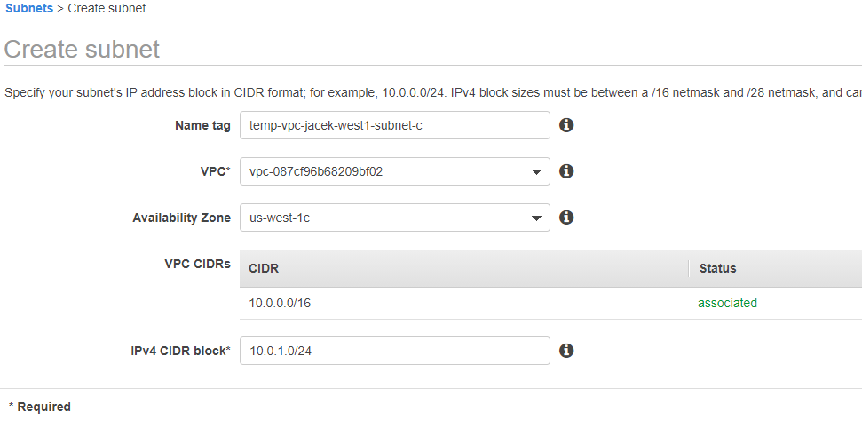


## Create EC2 instances that will be connected to created VPC

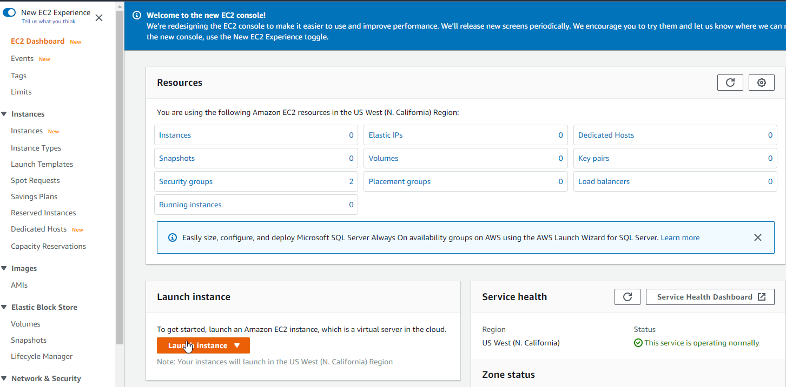

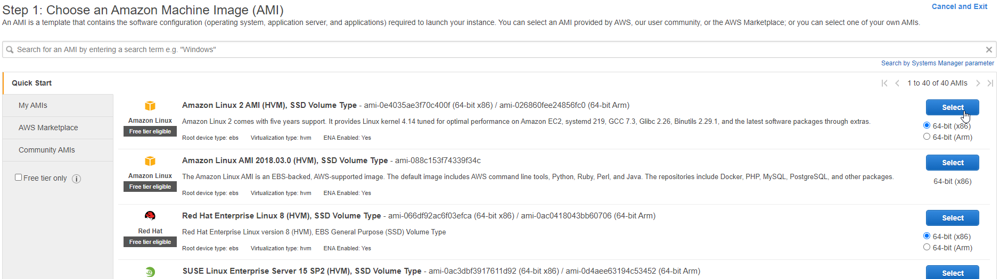

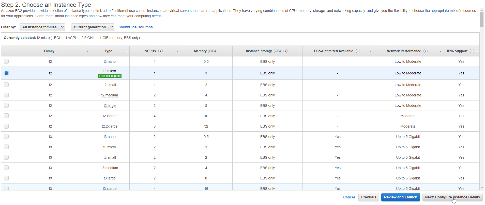

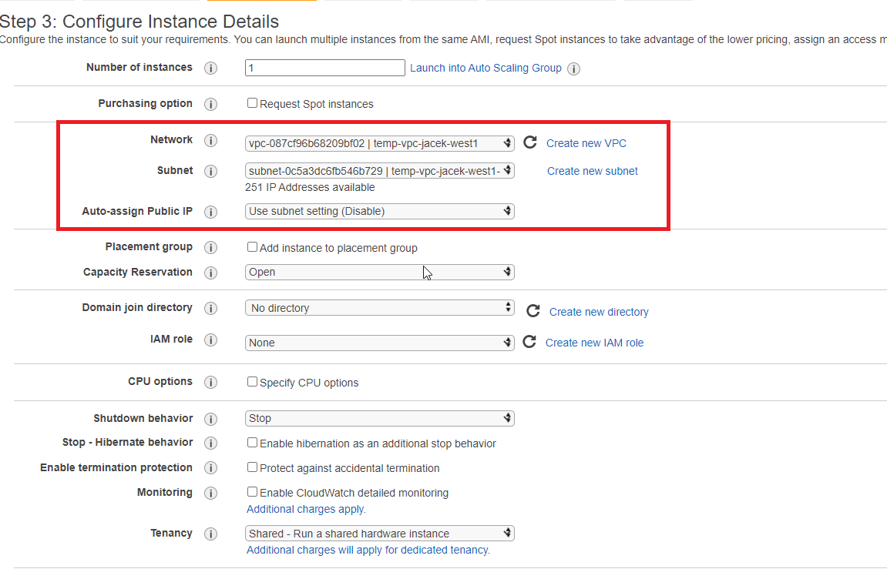

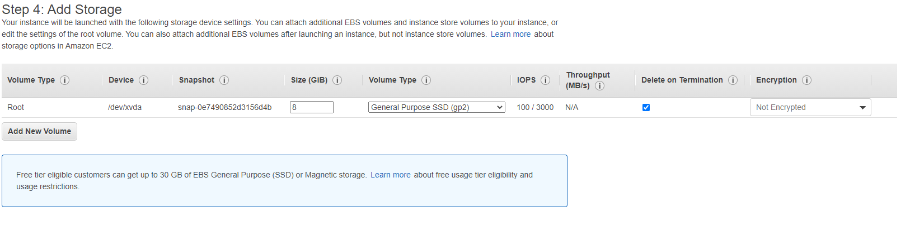

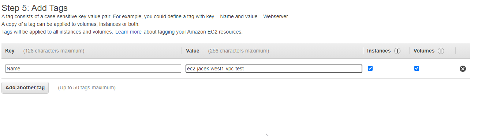


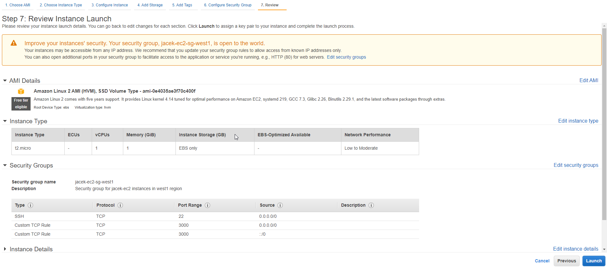

Create key pair to be able use SSH and download it (ec2-jacek-west1-keys.pem).


Click launch instances:


## Create and assign a public IP address to EC2 instance


Now we can see that EC2 instance has public IP Address:


## Connect to the EC2 Instance via SSH

### Run PuTTYGent to convert pem file to ppk

Click load to select pem file:


   
Select save private key to save if in ppk format.

Apply the ppk file in putty:


> :warning: from unknown reasons I had to generate ppk file 2 times, file that was created first time did not work.

To check user name that should be provided in putty select the instance in click connect:


Connect to the EC2 instance:


## Update EC2 instance and deploy the app

### Update already installed components (in ssh console)
```
sudo yum update
```


### Install nodejs
```
curl -sL https://rpm.nodesource.com/setup_14.x | sudo bash -
```


```
sudo yum install -y nodejs
```


Next we can check version

```
[ec2-user@ip-10-0-0-152 ~]$ node -v
v14.14.0
[ec2-user@ip-10-0-0-152 ~]$ npm -v
6.14.8
[ec2-user@ip-10-0-0-152 ~]$
```

### Upload the app using WinSCP

Install WinSCP and import defined session from PuTTY.   
Next upload the app to /home/ec2-user/sample-app. Before doing it remove **node_modules** folder from local app, these files will be download by EC2 instance later.


Next install necessary npms:


Next run the app:

```
[ec2-user@ip-10-0-0-152 sample-app]$ npm start

> pizza-luvrs@1.0.0 start /home/ec2-user/sample-app
> node index.js

Server running at: http://ip-10-0-0-152.us-west-1.compute.internal:3000
```

To run it in web browsers use public IP address because the EC2 instance does not have interface with public IP (it looks that it exist only in Elastic IP component).

Open in web browser this address ```http://52.53.108.154:3000/``` to see working app.

## Scaling EC2 instances

https://docs.aws.amazon.com/autoscaling/ec2/userguide/ec2-auto-scaling-predictive-scaling.html

### Creating dedicated AMI (image) for EC2 instance

It is possible to created a snapshot of existing instance. Such snapshot can be saved and replicated.

Such AMI can be automatically scaled using **Auto Scaling Group**. Auto Scaling Group expands or shrinks a pool of instances based on pre-defined rules.


Created AMI (Amazon Machine Images) is visible on the AMI list:


### Create load balancer


If you host HTTP application select Application Load Balancer.


Click register to add the instance to LB targets:


### Enable instance stickiness on Load Balancer

We need to ensure that if a user logs into our app in one EC2 instance that they continue to connect to that same instance wit subsequent requests. If we didn't do this, there's a possibility that they would hit an instance where they don't have a session. To avoid this situation entirely, let's enable stickiness on the load balancer. The load balancer will use a cookie to keep track of which users should be sent to which instances.

>NOTE: it is needed only if we deal with stateful app.


### Creating launch configuration for an auto-scaling group


>NOTE: search in drop down AMI does not work well, typing *sample* does not find the AMI, I had to select it directly from the drop down.


### Create autoscaling group using created launch configuration


Select both sub-networks. Thx to this load balancer will balance the traffic across AZ.


Select the target group that was created in load balancer wizard.


Scaling policies will be defined after creation of the auto scaling group.


After 30 seconds from creation of auto scaling group new instances will be launched in this group:


In the load balancer/target group we can see 3 instances. One instance was created at the very beginning and 2 other instances are from the create auto scaling group:


>NOTE: it took some time to see **healthy** in this status column.

Go to load balancer to check its DNS name. The ideas is that then you would get a normal URL like sample-app.com and create a DNS CNAME record to point to this load balancer DNS name. This part is not presented here.


Type ```http://jacek-app-load-balancer-west1-366905866.us-west-1.elb.amazonaws.com/``` in the web browser to see working app.

We can also see that there is cookie created by the [Enable instance stickiness on Load Balancer](#enable-instance-stickiness-on-load-balancer) mechanism.


Improve security group for the EC2 instances because now it is enough to allow inbound traffic from the load balancer and SSH.

Change from:


To:

The above configuration allows on inbound traffic from any instance that is in security group **jacek-lb-sg-west1**.

We can see also that ```http://jacek-app-load-balancer-west1-366905866.us-west-1.elb.amazonaws.com/``` still works fine in the web browser.

### Scaling in action


Add policy:


Typical alarm metrics:
* CPU Utilization
* Disk reads
* Disk writes
* Disk read operations
* Disk write operations
* Network in
* Network out


Set *greater than 100 bytes* to easily simulate adding more instances.


Remove notifications it is not needed now:   


It is common practice to create alarms that will trigger adding more instances and alarms that will trigger removing instances.

From unknown reasons I was not able to select auto scaling group from the drop down. This chapter will be finalized later:


# Review of default VPC and default subnets

Every AWS region has default VPC created. Thx to this we can start creating for example EC2 instances just after sign in to AWS console, if there would be no default VPC it would have to be created first, it is like pre-requisite step.

> NOTE: if needed it is possible to delete default VPC. If we deleted default VPC by mistake it is possible to create it once again, go to VPC view and next Actions -> Create default VPC.

## Selected subnets fields

* Auto-assign public IPv4 address (Yes/No): in case of Yes instances created in this subnet will get public IP address - publicly routable IP address. Someone in Internet could connect with this EC2 instance using this public IP if other AWS configuration (like security group) allows this.
To have public subnet we need value ```Yes``` for this field and Internet GW in the subnet.
  
* Route table
  
  First row (172.31.0.0/16): local route, it routes traffic locally within particular VPC. Thx this this instances from this subnet can communicate with instances from other subnets in this VPC.   
  Second row (0.0.0.0/0): if the traffic is anything other than network 172.31.0.0/16 then send this traffic to Internet Gateway. This also causes that EC2 instances will be accessible **from Internet.** It makes this subnet public.

* Network ACL
     
  By default it allows all traffic from any source and any port for inbound and outbound traffic. It means that by default this ACL blocks nothing! What does it mean * on this screen???

# Create VPC with public and private subnets

## Create VPC


Automatically will be also created main route for this VPC and default ACL for this VPC.


Route with target local allows communication between all sub-networks within this VPC.


Default ACL allows for all incoming and all outgoing traffic.   
What does it mean * on this screen???

## Create private subnet


Instances that will run in this subnet will not have public IP.
It also has the same route table and ACL that "parent" VPC.


## Create public subnet


Again this subnet will by default will have the same route table and ACL as its VPC. At this moment this subnet is not yet public because instances in this subnet will not get public IP and there is missing route to Internet Gateway.


## Create Internet Gateway

Internet gateway is fully managed service it means that HA and auto-scaling works out of the box.


Next attach IGW to the created VPC:


## Create new route table for public subnet


Next add route for Internet traffic:


**Destination**: the range of IP addresses where you want traffic to go (destination CIDR).
**Target**: the gateway, network interface, or connection through which to send the destination traffic; for example, an internet gateway

Next attach this route to public network:


## Enable auto-assign public IPv4

In public subnet enable public IPv4:


**Since now public network is really public because instances from this network will have public ID and there is route to Internet Gateway**.

## Create EC2 instance in public subnet


Download pem file and next connect to the EC2 instance

Created instances has one ENI interface:


### Connect to the created EC2 via SSH to check IP addresses

We can see that in the EC2 instance we do not have public IP address.
Public IP address is managed by [Internet Gateway](#internet-gateway).


```
[ec2-user@ip-10-1-101-13 ~]$ ifconfig
eth0: flags=4163<UP,BROADCAST,RUNNING,MULTICAST>  mtu 9001
        inet 10.1.101.13  netmask 255.255.255.0  broadcast 10.1.101.255
        inet6 fe80::403:21ff:fe67:47a6  prefixlen 64  scopeid 0x20<link>
        ether 06:03:21:67:47:a6  txqueuelen 1000  (Ethernet)
        RX packets 36907  bytes 51476363 (49.0 MiB)
        RX errors 0  dropped 0  overruns 0  frame 0
        TX packets 11180  bytes 693870 (677.6 KiB)
        TX errors 0  dropped 0 overruns 0  carrier 0  collisions 0

lo: flags=73<UP,LOOPBACK,RUNNING>  mtu 65536
        inet 127.0.0.1  netmask 255.0.0.0
        inet6 ::1  prefixlen 128  scopeid 0x10<host>
        loop  txqueuelen 1000  (Local Loopback)
        RX packets 8  bytes 648 (648.0 B)
        RX errors 0  dropped 0  overruns 0  frame 0
        TX packets 8  bytes 648 (648.0 B)
        TX errors 0  dropped 0 overruns 0  carrier 0  collisions 0

```

**Also this assigned public IP is not permanent. If we stop and start the EC2 instance it will get new public IP address!**.


## Assigned Elastic IP to ENI

To have permanent public IP address EIP has to be used and assigned to EC2 instance or to interface from EC2 instance.

Create elastic IP:


Review created EIP:


Associate EIP to ENI:


Next we can see that the EC2 instance got new public IP which is permanent (restart will not change it). Also previous public IP is unassigned from the instance.


EIP is also not visible from EC2 instance - ```ifconfig``` command.

## Create seconde EC2 instance in private network


## Bastion host (jump box)

Bastion host allows connection to instance that runs in private network.

### Create bastion host


### Connect with the bastion host


   
Bq5zN6h.Xu

Next connect RDP client to connect with the bastion host:


Next copy to Windows instance ppk and putty installer:


Install putty and import ppk file.

### Connect to private EC2 instance from bastion host


## Create NAT gateway to allow traffic to/from private subnet

A NAT gateway is used for outbound internet access for instances running in a private subnet.

Create NAT gateway (assign new elastic IP):


### Create new route table for private subnet


### Check that there is no Internet traffic in private EC2


### Change association for route table in private subnet


### Check that there is Internet traffic in private EC2


## Create VPC Endpoint type of gateway for S3

VPC endpoint supports only this S3 buckets which are created in the same region as VPC endpoint.

### Using jump box confirm that private EC2 instance has access to S3


### Remove NAT GW from route in private subnet


After this operation EC2 instance is loosing access to Internet and cannot connect with S3:


### Create VPC endpoint


After this we can see that new route has been added in route table used in private subnet:


### Test VPC endpoint for S3

We can see that now private EC2 instance can connect with S3 without Internet connection (ping to google.com does not work):


**Accessing detailed data about S3 from region different then VPC endpoint region is not supported!**


### Remove VPC endpoint

It is not possible to delete route to the target VPC. To remove the route the whole VPC endpoint has to be deleted or in the VPC endpoint we have to unassign the route table.


After this operation we can see that again private EC2 instance cannot S3 in eu-north-1 (Stockholm) region:


### VPC endpoint pricing

VPC endpoint uses own AWS network that`s why it is cheaper then Internet traffic.

### VPC endpoint access control

To execute this step assign again VPC endpoint to the route table used by private subnet.   
Create also second bucket in eu-north-1 region:


It is possible to narrow access for the VPC endpoint only to selected S3 buckets.
To do this we have to update policy on the VPC endpoint to:


## VPC endpoint type of interface

>NOTE: VPC endpoint type of gateway are limited because connections cannot be extended out of a VPC. Resources on the other side of a VPC connection, VPC peering connection, transit gateway, AWS Direct Connect connection or ClassicLink connection in your VPC cannot use the endpoint to communicate with resources in the endpoint service.

Above limitations do not exist in case of VPC endpoint type of interface.
Interface VPC endpoints are created in a subnet and are assigned to ENI. Thanks to this for example security groups can be used.


### Create VPC endpoint type of interface

Before start remove previously created VPC gateway endpoint that has route in the private subnet. After removal the route table should have only one entry:


Next pre-requisite was to enable DNS hostnames in the used VPC.


We can also check that aws cli command does not work because it cannot reach the endpoint:


Create endpoint:


We can see that new ENI has been created for this VPC interface endpoint:


It uses default security group. Inbound rules have set as a source the same security groups. It means that anything else that is inside this security group can establish connection with anything else that is inside this security group. By default anything else is blocked. 


### Test connection to eu-north-1

Next we can see that AWS endpoint for EC2 is reachable:


>NOTE: to have it working I had to update inbound rules in the security group to the following: 

The connection is possible although there is only route for local connections:


It is working because VPC interface endpoint uses DNS names, traffic to eu-east-1 is going to the address of the ENI that is assigned to this VPC interface endpoint - its all local traffic!


Because of this other resources can potentially use this IP address that`s why interface endpoints have less limitations than gateway endpoints.

# Dual-Homed Instance

It is possible to create second interface (ENI) and in this way EC2 instance be accessed from private and public subnet.


# Route 53/DNS

* AWS based DNS Service
* Can monitor health of endpoints
* DNS runs on port 53

## Key DNS record types

* A - maps host name to IPv4 address, for example mapping: www.google.com => 12.34.56.78
* AAAA - maps host name to IPv6 address, the same like above but for IPv6
* CNAME - alias one name to another, for example: search.google.com => www.google.com. **A CNAME record cannot point to the domain apex**.   
  >NOTE: A domain apex is the "root" level of your domain. For example, let's say you just purchased mygreatbrand.com. We'd call that the "domain apex", meaning that mygreatbrand.com is the "root" of the hierarchy of domain names. Any subdomain of that (e.g. www.mygreatbrand.com, mail.mygreatbrand.com, etc.) are not considered domain apexes, but are considered subdomains of mygreatbrand.com.
* MX - email server
* NS - identifies name servers for a hosted zone. A NS (name server) record allows you to delegate the DNS of one of your subdomains to a different nameserver. 

## Routing policies

https://docs.aws.amazon.com/Route53/latest/DeveloperGuide/routing-policy.html

* simple, does not have health check: user -> route 53 -> web server instance (www.mypage.com/10.64.100.200)
* weighted, has health check
 user1 -> route 53 (90% traffic) -> web server instance (www.mypage.com/10.64.100.200)
 user2 -> route 53 (10% traffic) -> web server instance (www.mypage.com/10.64.100.201)   
 example
 
* latency-based, has health check: good for apps hosted in different regions
 user1 (NewYork) -> route 53 -> web server instance 1 in us-east-1 (www.mypage.com/10.78.100.221)
 user2 (California) -> route 53 -> web server instance 2 in us-west-1  (www.mypage.com/10.78.100.222)
* failover routing policy, has health check: if some web server is down then it will not be routed by route 53 service
  * is used when you want to configure **active-passive failover**
  * failover routing lets you route traffic to a resource when the resource is healthy or to a different resource when the first resource is unhealthy.
  
* geo location, has health check
  * traffic if routed based on the location of the user
  * if location can`t be identified it uses a default resource set
  * can be used to serve different content to users from different locations
* Geoproximity routing
* [And more here](https://docs.aws.amazon.com/Route53/latest/DeveloperGuide/routing-policy.html)
* [Geoproximity vs Geolocation](https://www.abstractapi.com/guides/geoproximity-vs-geolocation)

## Route 53 Alias records

* similar to CNAME records
* **can be used to map the zone apex to an ELB**
* the ip address of the ELB can change dynamically
* alias record adjusts to ELB IP address changes
* for example: example.com => AWS resource (ELB, CloudFront, S3, RDS, etc...)

## Example: domain registration, alias record and ELB integration

### Register domain


EMail from AWS:
```
Dear AWS customer,
We successfully registered the jacek-sandbox-temp-1981.com domain. We also created a hosted zone for the domain.
Your next step is to add records to the hosted zone. These records contain information about how to route traffic for your domain and any subdomains. To learn how to add records to your hosted zone, see Working with Records [amazon.com]. 
If you did not request this change, contact Amazon Web Services Customer Support [amazon.com] immediately. 
Regards, 
Amazon Route 53 
```


### Create 2 EC2 instances

Select image ```Amazon Linux 2 AMI (HVM), SSD Volume Type``` and use default security groups.

Make sure to enable HTTP traffic in security group:


For both instances create use data input:

```
#!/bin/bash
yum update -y
yum install httpd -y
systemctl enable httpd.service
systemctl start httpd.service
echo "<html><h1>N.California Web Server #1</h1></html>" > /var/www/html/index.html
```

```
#!/bin/bash
yum update -y
yum install httpd -y
systemctl enable httpd.service
systemctl start httpd.service
echo "<html><h1>N.California Web Server #2</h1></html>" > /var/www/html/index.html
```

Both EC2 got public IP addresses so we can see the page in a web browser: http://54.176.147.39/, http://18.144.62.41/ 

### Create NLB


After creation we can check its dns name:

and see that it is working:


### Add Route 53 alias record - simple routing


New record set is added:

Next we can see that our DNS name is correctly mapped to DNS name of NLB:


### Add weighted routing

Assuming there are 2 EC2 instances we will create DNS record that 50% traffic sends to EC2 #1 and second 50% sends to EC2 #2.


Next created 2 weighted records:


Next we can open the URL and page will be displayed


Next we can run ```ipconfig /displaydns``` to see cached record in Win10 for DNS name ```fifty.jacek-sandbox-temp-1981.com```:

```
    Record Name . . . . . : fifty.jacek-sandbox-temp-1981.com
    Record Type . . . . . : 1
    Time To Live  . . . . : 57
    Data Length . . . . . : 4
    Section . . . . . . . : Answer
    A (Host) Record . . . : 13.52.215.135
```

We see that TTL is currently 57s so it means that in 57s this record will be deleted from the cache. After deleting from the cache we can try open once again ```http://fifty.jacek-sandbox-temp-1981.com``` and there will be 50% chance that this time we will hit web server 2 so if you are lucky you will see


and new recorded to the local DNS cache will be added

```
    Record Name . . . . . : fifty.jacek-sandbox-temp-1981.com
    Record Type . . . . . : 1
    Time To Live  . . . . : 293
    Data Length . . . . . : 4
    Section . . . . . . . : Answer
    A (Host) Record . . . : 13.52.251.29
```

### Add latency-based routing

Here we assume that we have one EC2 in Frankfurt and second EC2 in Tokyo.
Web client is close to Frankfurt so latency to this location is lower.


Next create DNS records:


Next if we are close to Frankfurt we will see:


### Add failover routing policy

We will use 1 instance from Frankfurt and 1 instanced from Tokio.


>NOTE: without ElasticIP IP address of EC2 instance is changed after its restart!


#### Create health checks

Create health check based on IP for Frankfurt server, here we check based on IP address (for now no alarms defined): 


Next create health check based on domain name:


After this we can see that health check based on IP is ok and health check based on DNS name fails because this DNS name has not been configured yet.


#### Create DNS records for failover


Secondary record is not assigned to any health checks:


After this we can see working DNS name:


and we can see that both health checks are ok now:


Now if we will stop Frankfurt EC2 instance then DNS will start pointing secondary EC2 in Tokyo:


and also health checks have updated statuses:


>NOTE: after shouting down EC2 in Frankfurt I had to wait ~5 mins to have again working URL http://failover.jacek-sandbox-temp-1981.com ! This is not good because then system is not available for the users for ~5 mins!

Next stop instance in Tokyo and we will see that both health checks fail (after ~30 seconds form the EC2 stop) and alarm is raised:


NOTE: before receiving first email with alarm I have to click confirmation link in email sent by AWS to accept subscription in SNS topic.

To clean up after this example do not forget to delete SNS topic, it was created by default in Virginia region


### Add geolocation routing policy

Tokyo EC2 IP: 52.69.211.195
Frankfurt EC2 IP: 18.185.2.205

Create DNS record for clients that will send their requests from Poland:


Create DNS record for clients that will send their requests from any other locations:


Next if from Poland we will open this address we will see:


to test other locations you can for example connect via VPN to some other region in the world and then you will see:


# resources
https://acloud.guru/forums/aws-certified-cloud-practitioner/discussion/-Lmu_Iq2Zrc_ojEYoN4d/I%20got%20a%20putty%20fatal%20error:%20No%20supported%20authentication%20methods%20available%20(server%20sent:publickey,gssapi-keyex,gssapi-with-mic)%20%20How%20do%20I%20resolve%20this%20issue%3F   
https://app.pluralsight.com/library/courses/aws-developer-getting-started/table-of-contents (chapters related with EC2 and putty)   
https://techviewleo.com/how-to-install-nodejs-on-amazon-linux/   
https://www.udemy.com/course/awsnetworking/   
https://www.youtube.com/watch?v=gMvXruavqDI&t=189s   
https://aws.amazon.com/vpc/pricing/
.